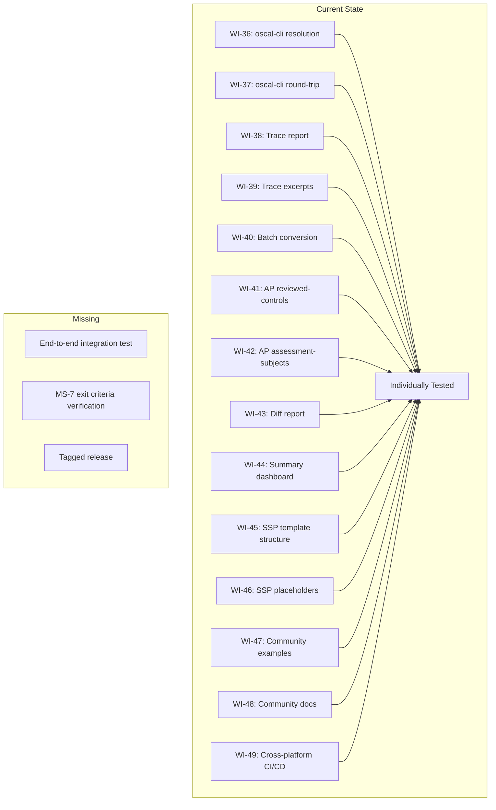
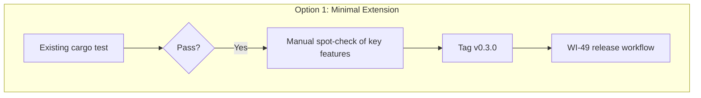
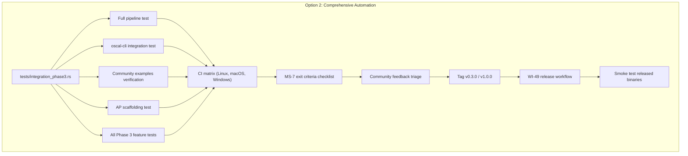
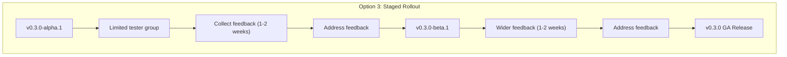
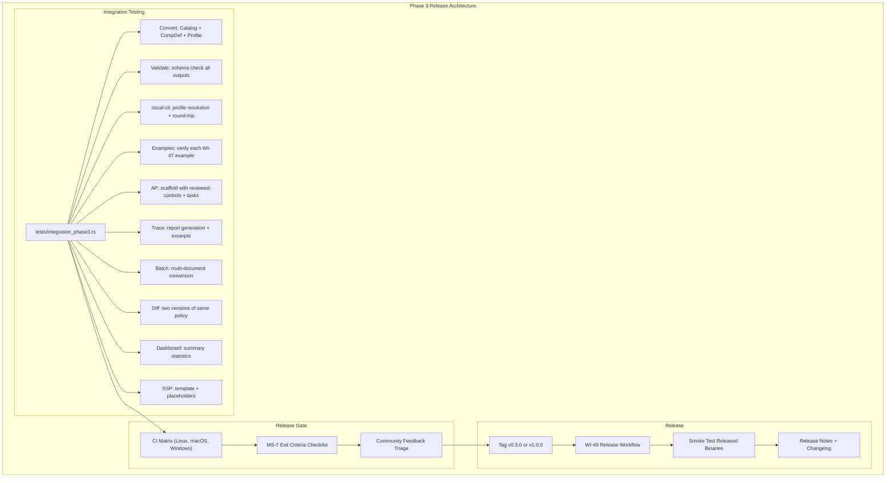
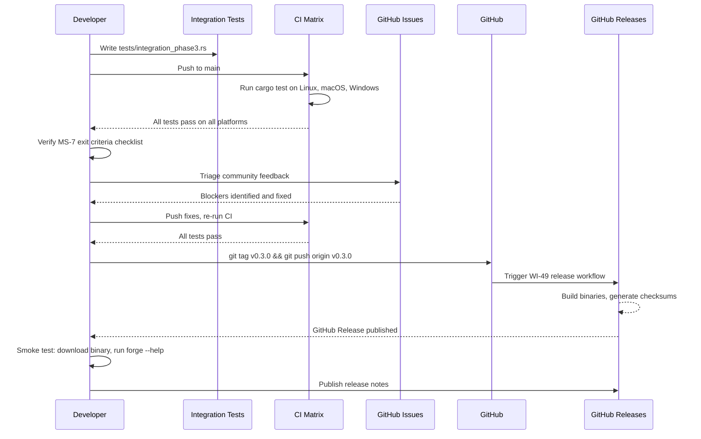
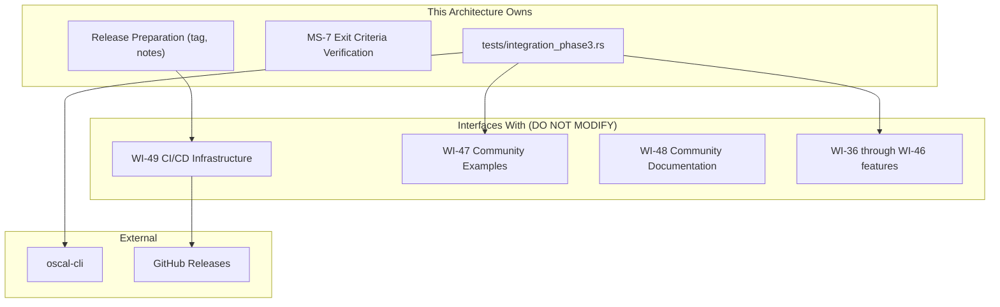

# 050-ar-phase3-release

> **Document Type:** Architecture Review
> **Audience:** LLM agents, human reviewers
> **Status:** Proposed
> **Last Updated:** 2026-02-10 <!-- @auto -->
> **Owner:** Brian Luby <!-- @human-required -->
> **Deciders:** Brian Luby <!-- @human-required -->

---

## Review Tier Legend

| Marker | Tier | Speckit Behavior |
|--------|------|------------------|
| :red_circle: `@human-required` | Human Generated | Prompt human to author; blocks until complete |
| :yellow_circle: `@human-review` | LLM + Human Review | LLM drafts -> prompt human to confirm/edit; blocks until confirmed |
| :green_circle: `@llm-autonomous` | LLM Autonomous | LLM completes; no prompt; logged for audit |
| :white_circle: `@auto` | Auto-generated | System fills (timestamps, links); no prompt |

---

## Document Completion Order

> :warning: **For LLM Agents:** Complete sections in this order. Do not fill downstream sections until upstream human-required inputs exist.

1. **Summary (Decision)** -> requires human input first
2. **Context (Problem Space)** -> requires human input
3. **Decision Drivers** -> requires human input (prioritized)
4. **Driving Requirements** -> extract from PRD, human confirms
5. **Options Considered** -> LLM drafts after drivers exist, human reviews
6. **Decision (Selected + Rationale)** -> requires human decision
7. **Implementation Guardrails** -> LLM drafts, human reviews
8. **Everything else** -> can proceed after decision is made

---

## Linkage :white_circle: `@auto`

| Document | ID | Relationship |
|----------|-----|--------------|
| Parent PRD | [050-prd-phase3-release](../PRD/050-prd-phase3-release.md) | Requirements this architecture satisfies |
| Security Review | N/A | Integration testing and release; no new security surface |
| Supersedes | -- | N/A |
| Superseded By | -- | |

---

## Summary

### Decision :red_circle: `@human-required`
> Use comprehensive automated integration testing via `cargo test` supplemented by manual verification of MS-7 exit criteria, leveraging the WI-49 release infrastructure (GitHub Actions matrix + GitHub Releases) for the final tagged release with blocker-only community feedback triage.

### TL;DR for Agents :yellow_circle: `@human-review`
> Phase 3 release (WI-50) is an integration testing and release gate, NOT a feature development sprint. Create a comprehensive integration test module (`tests/integration_phase3.rs`) exercising ALL Phase 3 features end-to-end. Verify MS-7 exit criteria: oscal-cli integration tested, community examples published, Assessment Plan scaffolding working. Triage community feedback as blocker/non-blocker -- only address blockers before release. Tag as v0.3.0 or v1.0.0 (product owner decision), trigger the WI-49 release workflow. Do NOT add new features. Do NOT defer testing to "fix later."

---

## Context

### Problem Space :red_circle: `@human-required`
Phase 3 spans 15 work items (WI-36 through WI-49) developed over 14 sprints, adding ecosystem integration, advanced reporting, Assessment Plan scaffolding, SSP templates, community documentation, and cross-platform release infrastructure. Each work item was tested independently, but no comprehensive integration test has verified that all features work together as a cohesive product. Additionally, community feedback accumulated during development must be triaged before release. The architectural challenge is designing a release validation process that provides confidence in the integrated product without introducing scope creep or schedule risk.

### Decision Scope :yellow_circle: `@human-review`

**This AR decides:**
- How integration testing is structured and what it covers
- How MS-7 exit criteria are verified
- How community feedback is triaged and addressed
- The release preparation and publication process
- The version numbering decision framework (v0.3.0 vs v1.0.0)

**This AR does NOT decide:**
- New feature development -- explicitly prohibited in this sprint
- Post-release support or maintenance planning -- deferred
- Version number itself -- product owner decides at release time
- Future roadmap beyond Phase 3 -- deferred to post-release retrospective

### Current State :green_circle: `@llm-autonomous`
All Phase 3 work items (WI-36 through WI-49) are completed and individually tested. The WI-49 release infrastructure (GitHub Actions CI matrix + release workflow) is operational. Community examples (WI-47) are committed. Documentation (WI-48) is published. Individual unit and integration tests pass on all platforms. No comprehensive end-to-end integration test covering all Phase 3 features exists.



### Driving Requirements :yellow_circle: `@human-review`

| PRD Req ID | Requirement Summary | Architectural Implication |
|------------|---------------------|---------------------------|
| M-1 | Full test suite passes on all platforms | cargo test on Linux, macOS, Windows via CI matrix |
| M-2 | End-to-end integration test for complete pipeline | Integration test module covering all OSCAL output models |
| M-3 | oscal-cli integration tested | oscal-cli invocation in integration tests |
| M-4 | Community examples verified | Each example policy converted and output compared |
| M-5 | Assessment Plan scaffolding validated | AP scaffold generation test with reviewed-controls, tasks |
| M-6 | All Phase 3 features exercised | Integration tests for trace, batch, diff, dashboard, SSP |
| M-7 | Tagged release with cross-platform binaries and checksums | Trigger WI-49 release workflow |
| M-8 | Release notes documenting Phase 3 features | Changelog and release notes preparation |

**PRD Constraints inherited:**
- From constitution: Rust latest stable, `cargo clippy -- -D warnings`, `cargo fmt --check`
- From roadmap: MS-7 exit criteria: oscal-cli integration tested, community examples published, AP scaffolding working
- From PRD: No new features; fixes only

---

## Decision Drivers :red_circle: `@human-required`

1. **Confidence:** The release must be validated to a level that justifies community distribution *(traces to PRD M-1, M-2)*
2. **Completeness:** All MS-7 exit criteria must be explicitly verified and documented *(traces to PRD M-3, M-4, M-5)*
3. **Scope discipline:** Integration testing and release only -- no feature work, no scope creep *(traces to PRD W-1)*
4. **Timeliness:** Release within one sprint; community feedback triage must not extend indefinitely *(traces to PRD risk R-2)*

---

## Options Considered :yellow_circle: `@human-review`

### Option 0: Status Quo / Do Nothing

**Description:** Skip integration testing; tag and release based on individual work item test results.

| Driver | Rating | Notes |
|--------|--------|-------|
| Confidence | :x: Poor | No assurance features work together |
| Completeness | :x: Poor | MS-7 exit criteria not explicitly verified |
| Scope discipline | :white_check_mark: Good | No additional work |
| Timeliness | :white_check_mark: Good | Immediate release |

**Why not viable:** Individual work item tests do not verify cross-feature interactions. Releasing without integration testing risks shipping a broken product to the community, undermining adoption and credibility.

---

### Option 1: Extend Phase 2 Release Pipeline

**Description:** Reuse the Phase 2 release process (WI-35) with minimal modifications -- run existing tests, verify a few key scenarios manually, tag and release.



| Driver | Rating | Notes |
|--------|--------|-------|
| Confidence | :warning: Medium | Existing tests cover some scenarios; manual checks fill gaps |
| Completeness | :warning: Medium | MS-7 exit criteria checked manually but not automated |
| Scope discipline | :white_check_mark: Good | Minimal additional work |
| Timeliness | :white_check_mark: Good | Quick; relies on existing infrastructure |

**Pros:**
- Fastest path to release
- Reuses existing test infrastructure
- No new test code to write

**Cons:**
- Manual verification is not repeatable
- MS-7 exit criteria verification is not automated
- Cross-feature interactions may be missed
- No regression protection for future releases

---

### Option 2: Comprehensive Release Automation

**Description:** Create a comprehensive integration test module that exercises all Phase 3 features end-to-end in a structured sequence. Automate MS-7 exit criteria verification. Triage community feedback with blocker/non-blocker classification. Tag and release via WI-49 infrastructure.



| Driver | Rating | Notes |
|--------|--------|-------|
| Confidence | :white_check_mark: Good | Automated end-to-end tests cover all features and cross-feature interactions |
| Completeness | :white_check_mark: Good | MS-7 exit criteria verified by automated tests |
| Scope discipline | :white_check_mark: Good | Integration tests + release only; no new features |
| Timeliness | :warning: Medium | Requires writing integration tests, but within one sprint |

**Pros:**
- Automated tests are repeatable and protect against future regression
- MS-7 exit criteria are explicitly verified in code
- Community feedback triage prevents scope creep
- Smoke testing of released binaries verifies distribution chain
- Integration test module is reusable for future releases

**Cons:**
- Requires writing an integration test module (one sprint of effort)
- oscal-cli must be available in CI environment (or mocked)

---

### Option 3: Staged Rollout

**Description:** Release in stages: first an alpha/beta to a small group of testers, then address feedback, then a general release. Multiple tags and release cycles.



| Driver | Rating | Notes |
|--------|--------|-------|
| Confidence | :white_check_mark: Good | Real user testing before GA release |
| Completeness | :white_check_mark: Good | MS-7 verified by real users |
| Scope discipline | :x: Poor | Multiple release cycles; feedback may expand scope |
| Timeliness | :x: Poor | 3-6 weeks of release cycles; extends well beyond one sprint |

**Pros:**
- Highest quality release through real user testing
- Community involvement builds early adoption
- Iterative feedback reduces release risk

**Cons:**
- Extends the release timeline by 3-6 weeks
- Multiple release cycles increase overhead for solo developer
- Feedback may create pressure for scope expansion
- Solo developer cannot support parallel development and release testing
- Overkill for an exploratory Phase 3 release

---

## Decision

### Selected Option :red_circle: `@human-required`
> **Option 2: Comprehensive Release Automation**

### Rationale :red_circle: `@human-required`

Option 2 provides the best balance of confidence and timeliness. Automated integration tests are repeatable and provide regression protection for future releases. MS-7 exit criteria are verified in code, not just manually. The blocker-only feedback triage policy prevents scope creep while ensuring release quality. Option 1's manual verification is not repeatable and provides weaker assurance. Option 3's staged rollout is overkill for an exploratory Phase 3 release with a solo developer -- the overhead of multiple release cycles is not justified.

#### Simplest Implementation Comparison :yellow_circle: `@human-review`

| Aspect | Simplest Possible | Selected Option | Justification for Complexity |
|--------|-------------------|-----------------|------------------------------|
| Components | Manual spot-check + tag | Integration test module + CI + release workflow | PRD M-2 requires end-to-end integration test; M-6 requires all features exercised |
| Dependencies | cargo test only | cargo test + oscal-cli (optional) | PRD M-3 requires oscal-cli integration testing |
| Patterns | Existing tests only | New integration test module | Existing tests do not cover cross-feature interactions |
| Release | Simple tag + push | Tag + automated release + smoke test | PRD M-7 requires cross-platform binaries with checksums (WI-49 infrastructure) |

**Complexity justified by:** PRD M-1 through M-8 require comprehensive testing, MS-7 verification, and a published release. The integration test module is a one-time investment that serves all future releases.

### Architecture Diagram :yellow_circle: `@human-review`



---

## Technical Specification

### Component Overview :yellow_circle: `@human-review`

| Component | Responsibility | Interface | Dependencies |
|-----------|---------------|-----------|--------------|
| tests/integration_phase3.rs | End-to-end integration tests covering all Phase 3 features | cargo test | FORGE CLI, test fixtures, oscal-cli (optional) |
| MS-7 Verification Checklist | Explicit test cases for each MS-7 exit criterion | Test assertions in integration_phase3.rs | WI-36/37 (oscal-cli), WI-47 (examples), WI-41/42 (AP) |
| Community Feedback Triage | Process for classifying feedback as blocker/non-blocker | Manual process; documented in release notes | GitHub Issues |
| Release Preparation | Tag, changelog, release notes, trigger release workflow | Manual (tag) + automated (WI-49 workflow) | WI-49 release infrastructure |
| Smoke Test Suite | Verify released binaries work on each platform | Manual or scripted: download, run forge --help, convert sample | GitHub Releases, example policies |

### Data Flow :green_circle: `@llm-autonomous`



### Interface Definitions :yellow_circle: `@human-review`

```rust
// tests/integration_phase3.rs - Structure (conceptual)

/// Test the full pipeline: Markdown -> Catalog -> Component Definition -> Profile
#[test]
fn full_pipeline_produces_valid_artifacts() {
    // 1. Convert sample policy to Catalog
    // 2. Convert sample policy to Component Definition
    // 3. Generate Profile from Catalog
    // 4. Validate all outputs against OSCAL v1.2.0 schema
    // Assert: all outputs are schema-valid
}

/// Test oscal-cli integration (WI-36, WI-37)
#[test]
fn oscal_cli_profile_resolution_succeeds() {
    // 1. Generate Profile from FORGE
    // 2. Run oscal-cli resolve-profile
    // 3. Verify resolved catalog is valid
    // Assert: oscal-cli operation completes successfully
}

/// Test community examples (WI-47)
#[test]
fn community_examples_produce_expected_output() {
    // For each example in examples/:
    // 1. Run forge convert on policy.md
    // 2. Compare output to expected-catalog.json
    // Assert: outputs match (modulo timestamps if non-deterministic)
}

/// Test Assessment Plan scaffolding (WI-41, WI-42)
#[test]
fn assessment_plan_scaffold_has_required_elements() {
    // 1. Generate AP scaffold from policy
    // 2. Check reviewed-controls, tasks, assessment-subjects
    // Assert: all required AP elements present
}

/// Test all Phase 3 features (WI-38-WI-46)
#[test]
fn phase3_features_exercise_successfully() {
    // Trace report, batch conversion, diff report,
    // summary dashboard, SSP template + placeholders
}
```

### Key Algorithms/Patterns :yellow_circle: `@human-review`

**Pattern:** MS-7 Exit Criteria Verification
```
MS-7 Exit Criteria:
1. "oscal-cli integration tested"
   -> Automated: oscal-cli profile resolution test
   -> Automated: oscal-cli round-trip validation test
   -> Manual: verify oscal-cli version documented

2. "community examples published"
   -> Automated: each example policy converts to matching expected output
   -> Automated: all expected outputs pass forge validate
   -> Manual: verify examples/ committed and README published

3. "Assessment Plan scaffolding working"
   -> Automated: AP scaffold generation test
   -> Automated: reviewed-controls, tasks, assessment-subjects present
   -> Automated: AP scaffold passes partial schema validation
```

**Pattern:** Community Feedback Triage
```
For each GitHub Issue tagged "community-feedback":
1. Classify as Blocker or Non-Blocker
   - Blocker: crash, data corruption, security issue, schema-invalid output
   - Non-Blocker: enhancement request, cosmetic issue, edge case
2. Blockers: fix in this sprint, add regression test
3. Non-Blockers: add to "Known Issues" in release notes, label for future
4. Close or defer all non-blockers
```

**Pattern:** Version Number Decision Framework
```
v0.3.0 if:
  - API may change in future versions
  - Some Phase 3 features are experimental
  - Community feedback has not yet validated stability

v1.0.0 if:
  - CLI interface is stable and will not change
  - All features are tested and production-quality
  - Product owner assesses "ready for production use"

Decision made by: Product Owner (Brian Luby) at release time
```

---

## Constraints & Boundaries

### Technical Constraints :yellow_circle: `@human-review`

**Inherited from PRD:**
- Rust latest stable toolchain
- `cargo clippy -- -D warnings` must pass on all platforms
- `cargo fmt --check` must pass
- `cargo test` must pass on all target platforms with zero failures
- Semantic versioning; tag format `v0.3.0` or `v1.0.0`
- oscal-cli pinned version for integration testing

**Added by this Architecture:**
- Integration test module: `tests/integration_phase3.rs`
- No new features in this sprint -- fixes and tests only
- Community feedback: blocker-only addressing; non-blockers deferred to Known Issues
- Release workflow: use WI-49 infrastructure; do not create separate release process
- Smoke test: verify released binary runs `forge --help` and converts a sample on each platform

### Architectural Boundaries :yellow_circle: `@human-review`



- **Owns:** Integration test module, MS-7 verification, release preparation
- **Interfaces With:** All Phase 3 work items (exercises them), WI-49 release infrastructure (uses it)
- **Must Not Touch:** Source code beyond bug fixes; feature implementations; release workflow configuration (owned by WI-49)

### Implementation Guardrails :yellow_circle: `@human-review`

> :warning: **Critical for LLM Agents:**

- [x] **DO NOT** add new features in this sprint -- fixes and tests only *(PRD W-1)*
- [x] **DO NOT** address all community feedback regardless of severity -- triage as blocker/non-blocker *(PRD S-1)*
- [x] **DO NOT** skip cross-platform verification of release binaries *(PRD S-3)*
- [x] **DO NOT** tag a release before all MS-7 exit criteria are verified *(anti-pattern)*
- [x] **MUST** create an integration test module exercising all Phase 3 features *(PRD M-2, M-6)*
- [x] **MUST** verify MS-7 exit criteria: oscal-cli tested, examples published, AP scaffolding working *(PRD M-3, M-4, M-5)*
- [x] **MUST** pass `cargo test` on all platforms with zero failures before tagging *(PRD M-1)*
- [x] **MUST** publish release with cross-platform binaries, checksums, and release notes *(PRD M-7, M-8)*

---

## Consequences :yellow_circle: `@human-review`

### Positive
- Comprehensive integration tests provide high confidence in the released product
- MS-7 exit criteria are verifiable and documented
- Blocker-only feedback triage prevents scope creep while ensuring quality
- Integration test module is reusable for future releases
- Automated release via WI-49 infrastructure is reproducible and auditable

### Negative
- Writing integration tests consumes sprint time that could be used for polish
- oscal-cli dependency in CI adds complexity (mitigated by optional/skippable tests)
- Blocker-only triage may leave some valid feedback unaddressed at release time

### Risks & Mitigations

| Risk | Likelihood | Impact | Mitigation |
|------|------------|--------|------------|
| Integration issues between Phase 3 features | Medium | Medium | Comprehensive integration tests catch cross-feature issues; fix within sprint |
| Community feedback requires significant rework | Low | High | Triage as blocker/non-blocker; defer non-blockers; only address blockers |
| oscal-cli unavailable in CI environment | Low | Medium | Make oscal-cli tests optional (skip if binary not found); document as known limitation |
| Cross-platform issues in released binaries | Low | Medium | Smoke test released binaries on each platform before announcing |

---

## Implementation Guidance

### Suggested Implementation Order :green_circle: `@llm-autonomous`
1. Create `tests/integration_phase3.rs` with test structure for all Phase 3 features
2. Implement full pipeline test (convert to all output models, validate)
3. Implement oscal-cli integration tests (with skip-if-unavailable fallback)
4. Implement community examples verification tests
5. Implement Assessment Plan scaffolding tests
6. Implement remaining Phase 3 feature tests (trace, batch, diff, dashboard, SSP)
7. Run full test suite on all platforms via CI
8. Triage community feedback (blocker/non-blocker)
9. Fix any blockers; add regression tests
10. Prepare CHANGELOG.md and release notes
11. Tag release (v0.3.0 or v1.0.0 per product owner decision)
12. Verify released binaries (smoke test on each platform)

### Testing Strategy :green_circle: `@llm-autonomous`

| Layer | Test Type | Coverage Target | Notes |
|-------|-----------|-----------------|-------|
| Integration | Full pipeline (all OSCAL models) | All output types | Convert -> validate -> profile for Catalog, CompDef |
| Integration | oscal-cli interop | Resolution + round-trip | Skip if oscal-cli not installed |
| Integration | Community examples | All 3+ examples | Convert each; compare to expected output |
| Integration | AP scaffolding | reviewed-controls, tasks, subjects | Verify structural completeness |
| Integration | Phase 3 features | All features exercised | Trace, batch, diff, dashboard, SSP |
| Smoke | Released binaries | All platforms | Download, run forge --help, convert sample |
| CI | Full suite on all platforms | 100% pass rate | Linux, macOS, Windows |

### Reference Implementations :yellow_circle: `@human-review`

- WI-25 Phase 1 release process for release preparation patterns *(internal)*
- WI-35 Phase 2 release process for integration testing patterns *(internal)*
- Rust release checklist: https://doc.rust-lang.org/cargo/reference/publishing.html *(external)*
- Semantic versioning: https://semver.org/ *(external)*

### Anti-patterns to Avoid :yellow_circle: `@human-review`
- **Don't:** Rush the release without thorough integration testing
  - **Why:** This sprint exists specifically for validation; skipping it defeats its purpose
  - **Instead:** Complete all integration tests before tagging
- **Don't:** Address all community feedback regardless of severity
  - **Why:** Scope creep delays the release indefinitely
  - **Instead:** Triage as blocker/non-blocker; defer non-blockers
- **Don't:** Make feature changes during integration testing
  - **Why:** Feature changes introduce new risk that requires re-testing
  - **Instead:** Fixes only; all features are frozen
- **Don't:** Tag before MS-7 exit criteria are verified
  - **Why:** MS-7 is the contractual definition of "done" for Phase 3
  - **Instead:** Verify each criterion explicitly before tagging

---

## Compliance & Cross-cutting Concerns

### Security Considerations :yellow_circle: `@human-review`
- Authentication: N/A -- CLI tool; release uses GitHub Actions secrets for publishing
- Authorization: Release workflow uses `GITHUB_TOKEN` managed by GitHub
- Data handling: Integration tests use sample policies only; no real security data. Verify release binaries do not contain test data or credentials.
- Supply chain: Release binaries built from source on trusted CI runners; SHA-256 checksums published

### Observability :green_circle: `@llm-autonomous`
- **Logging:** CI provides full build and test logs per platform
- **Metrics:** Test pass rate across all platforms; community feedback triage counts
- **Tracing:** Release tag linked to specific commit; release notes document all included changes

### Error Handling Strategy :green_circle: `@llm-autonomous`
```
Error Category -> Handling Approach
+-- Integration test failure -> Identify failing feature; fix; add regression test; re-run
+-- Platform-specific failure -> Fix platform-specific code; verify on affected platform
+-- oscal-cli unavailable -> Skip oscal-cli tests with warning; document as known limitation
+-- Community blocker -> Fix within sprint; add regression test
+-- Release workflow failure -> Debug via CI logs; retry; do not publish partial release
```

---

## Migration Plan (if applicable) :yellow_circle: `@human-review`

N/A -- This is a release gate, not a migration. The integration test module is new code that does not modify existing systems.

### Rollback Plan :red_circle: `@human-required`

**Rollback Triggers:**
- Critical bug discovered after release that causes data corruption or security issue
- Release binaries are non-functional on one or more platforms

**Rollback Decision Authority:** Brian Luby (product owner)

**Rollback Time Window:** Within 48 hours of release publication

**Rollback Procedure:**
1. Mark the GitHub Release as pre-release or draft (hide from latest)
2. Create a GitHub Issue documenting the critical issue
3. Fix the issue on a hotfix branch
4. Run full integration test suite
5. Tag a patch release (e.g., v0.3.1)
6. Publish the patched release
7. Announce the fix to the community

---

## Open Questions :yellow_circle: `@human-review`

No open questions blocking implementation.

---

## Changelog :white_circle: `@auto`

| Version | Date | Author | Changes |
|---------|------|--------|---------|
| 0.1 | 2026-02-10 | LLM (Claude) | Initial proposal |

---

## Decision Record :white_circle: `@auto`

| Date | Event | Details |
|------|-------|---------|
| 2026-02-10 | Proposed | Initial draft created from PRD 050 |

---

## Traceability Matrix :green_circle: `@llm-autonomous`

| PRD Req ID | Decision Driver | Option Rating | Component | Notes |
|------------|-----------------|---------------|-----------|-------|
| M-1 | Confidence | Option 2: :white_check_mark: | CI Matrix | cargo test on all platforms, zero failures |
| M-2 | Confidence | Option 2: :white_check_mark: | integration_phase3.rs | End-to-end pipeline test |
| M-3 | Completeness | Option 2: :white_check_mark: | integration_phase3.rs | oscal-cli profile resolution + round-trip tests |
| M-4 | Completeness | Option 2: :white_check_mark: | integration_phase3.rs | Community examples verification tests |
| M-5 | Completeness | Option 2: :white_check_mark: | integration_phase3.rs | AP scaffold with reviewed-controls, tasks |
| M-6 | Confidence | Option 2: :white_check_mark: | integration_phase3.rs | All Phase 3 features exercised |
| M-7 | Timeliness | Option 2: :white_check_mark: | WI-49 Release Workflow | Tag triggers automated binary + checksum release |
| M-8 | Completeness | Option 2: :white_check_mark: | Release Preparation | Release notes + changelog |

---

## Review Checklist :green_circle: `@llm-autonomous`

Before marking as Accepted:
- [x] All PRD Must Have requirements appear in Driving Requirements
- [x] Option 0 (Status Quo) is documented
- [x] Simplest Implementation comparison is completed
- [x] Decision drivers are prioritized and addressed
- [x] At least 2 options were seriously considered
- [x] Constraints distinguish inherited vs. new
- [x] Component names are consistent across all diagrams and tables
- [x] Implementation guardrails reference specific PRD constraints
- [x] Rollback triggers and authority are defined
- [x] Security review is linked or N/A documented
- [x] No open questions blocking implementation
