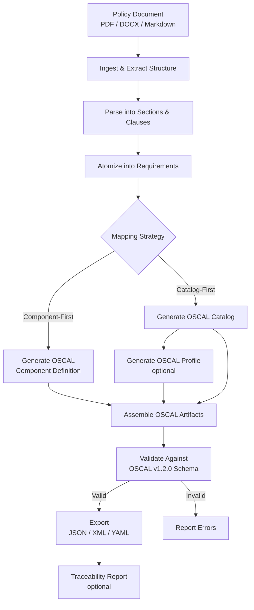
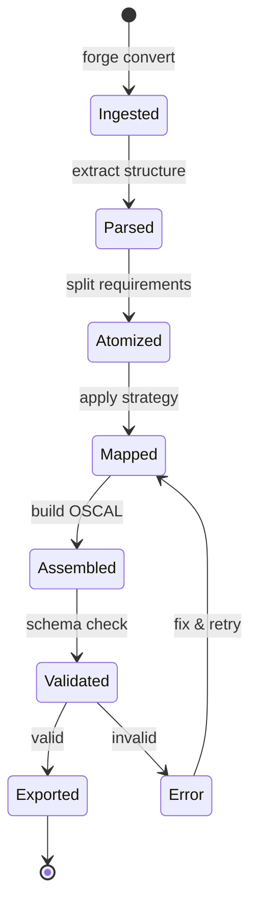
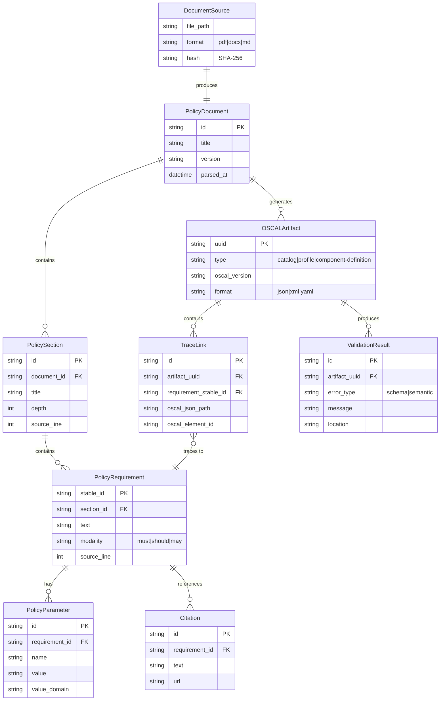
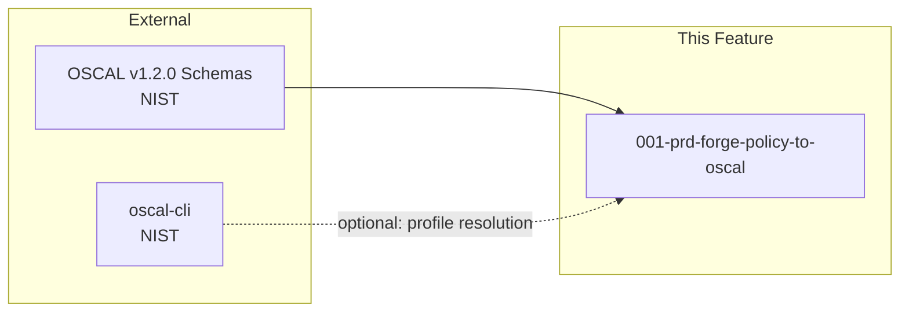

# 001-prd-forge-policy-to-oscal

> **Document Type:** Product Requirements Document
> **Audience:** LLM agents, human reviewers
> **Status:** Draft
> **Last Updated:** 2026-02-10 <!-- @auto -->
> **Owner:** <!-- @human-required -->

**Feature Branch**: `001-forge-policy-to-oscal`
**Created**: 2026-02-10
**Status**: Draft
**Input**: User description: "Rust CLI tool that converts security policies from documents (PDFs, Word docs, Markdown) into OSCAL"

---

## Review Tier Legend

| Marker | Tier | Speckit Behavior |
|--------|------|------------------|
| 🔴 `@human-required` | Human Generated | Prompt human to author; blocks until complete |
| 🟡 `@human-review` | LLM + Human Review | LLM drafts → prompt human to confirm/edit; blocks until confirmed |
| 🟢 `@llm-autonomous` | LLM Autonomous | LLM completes; no prompt; logged for audit |
| ⚪ `@auto` | Auto-generated | System fills (timestamps, links); no prompt |

---

## Document Completion Order

> ⚠️ **For LLM Agents:** Complete sections in this order. Do not fill downstream sections until upstream human-required inputs exist.

1. **Context** (Background, Scope) → requires human input first
2. **Problem Statement & User Scenarios** → requires human input
3. **Requirements** (Must/Should/Could/Won't) → requires human input
4. **Technical Constraints** → human review
5. **Diagrams, Data Model, Interface** → LLM can draft after above exist
6. **Acceptance Criteria** → derived from requirements
7. **Everything else** → can proceed

---

## Context

### Background 🔴 `@human-required`
Security and compliance teams spend enormous effort manually translating human-readable security policy documents (PDFs, Word docs, Markdown) into structured, machine-readable formats for auditing, automation, and regulatory reporting. OSCAL (Open Security Controls Assessment Language), the NIST standard for machine-readable security and compliance data, provides a rigorous set of interlinked models (Catalog, Profile, Component Definition, SSP, Assessment Plan, Assessment Results, POA&M) but no automated pipeline exists to convert natural-language policy documents into validated OSCAL artifacts. FORGE (Framework for OSCAL Risk & Governance Execution) fills this gap as a Rust CLI tool.

### Scope Boundaries 🟡 `@human-review`

**In Scope:**
- CLI-based ingestion of security policy documents in PDF, DOCX, and Markdown formats
- Parsing and structural extraction of policy sections, headings, numbered clauses, and tables
- Atomization of compound policy statements into individual requirements
- Conversion to OSCAL Catalog model (policy-as-controls strategy)
- Conversion to OSCAL Component Definition model (policy-as-documentary-components strategy)
- OSCAL Profile generation for baseline selection and tailoring
- Multi-format OSCAL output: JSON, XML, YAML
- Schema validation of generated OSCAL artifacts against OSCAL v1.2.0 schemas
- Traceability links from source policy text to generated OSCAL elements
- Stable identifier management (UUIDs) across document revisions
- Back matter resource management for citations and evidence references

**Out of Scope:**
- Web UI or SaaS deployment — FORGE is a CLI-only tool in this phase
- Full SSP generation — requires system-specific data (inventory, boundaries, hosting) beyond policy text; deferred to future phase
- Assessment Results and POA&M generation — requires actual assessment data; deferred
- AI/ML-based semantic understanding of policy intent — initial version uses structural/syntactic parsing
- Integration with external GRC tools, ticketing systems, or CI/CD pipelines — deferred to future phase
- User roles, permissions, or multi-tenancy — not applicable for CLI tool
- Profile Resolution engine — initial version delegates to NIST oscal-cli for resolution
- Control Mapping model (OSCAL v1.2.0 feature) — deferred for future "policy → framework crosswalk" capability

### Glossary 🟡 `@human-review`

| Term | Definition |
|------|------------|
| OSCAL | Open Security Controls Assessment Language — NIST standard for machine-readable security/compliance data |
| Catalog | OSCAL model representing a structured collection of controls (requirements) |
| Profile | OSCAL model for selecting, organizing, and tailoring controls into a baseline from one or more Catalogs |
| Component Definition | OSCAL model describing how controls are implemented by reusable components, including documentary components (policy/procedure) |
| SSP | System Security Plan — OSCAL model describing control implementations for a specific system |
| Assessment Plan (AP) | OSCAL model describing planned assessment activities and scope |
| Assessment Results (AR/SAR) | OSCAL model recording assessment observations, findings, and risks |
| POA&M | Plan of Action and Milestones — OSCAL model tracking remediation of identified issues |
| Profile Resolution | NIST-defined algorithm (import → merge → modify) that produces a resolved catalog from a Profile |
| Documentary Component | An OSCAL component of type "policy", "procedure", or "process" representing non-technical control implementations |
| Back Matter | Consistent OSCAL structure across all models for linked/attached resources (citations, evidence) |
| Metaschema | NIST framework used to produce OSCAL schemas and documentation across XML/JSON/YAML |
| Atomization | The process of splitting compound policy statements into individual, independently addressable requirements |
| Traceability | Bidirectional links between source policy text and generated OSCAL elements |
| Normative Requirement | A policy statement using "must" or "shall" language indicating mandatory compliance |

### Related Documents ⚪ `@auto`

| Document | Link | Relationship |
|----------|------|--------------|
| OSCAL Research | docs/research/OSCAL_Research.md | Source research informing this PRD |
| Architecture Plan | docs/architecture_plan.md | High-level architecture |
| CLAUDE.md | CLAUDE.md | Project conventions and build commands |

---

## Problem Statement 🔴 `@human-required`

Organizations maintain security policies as natural-language documents (PDFs, Word, Markdown) that define requirements for access control, data protection, incident response, and more. Translating these policies into machine-readable OSCAL artifacts is currently a manual, error-prone process requiring deep OSCAL expertise. This creates a bottleneck for compliance automation: policies cannot be programmatically audited, mapped to control frameworks, or traced through the assessment lifecycle without extensive manual effort.

FORGE addresses this by providing a deterministic, auditable conversion pipeline that ingests policy documents, extracts structured requirements, and produces validated OSCAL artifacts with full traceability back to source text. Without FORGE, organizations face weeks of manual conversion work per policy document, risk of transcription errors, loss of traceability, and inability to leverage OSCAL's interlinked model ecosystem.

---

## User Scenarios & Testing 🔴 `@human-required`

### User Story 1 — Convert Policy to OSCAL Catalog (Priority: P1)

A compliance engineer has a corporate security policy in Markdown and needs to convert it into a structured OSCAL Catalog where each policy requirement becomes a control.

> As a compliance engineer, I want to convert a security policy document into an OSCAL Catalog so that my policy requirements are machine-readable and can be imported by Profiles and downstream OSCAL workflows.

**Why this priority**: This is the foundational conversion capability. Without Catalog generation, no downstream OSCAL workflows (Profiles, Components, SSPs) are possible. The Catalog model is the cleanest native representation of policy requirements.

**Independent Test**: Run `forge convert policy.md --strategy catalog --format json` and verify the output is a valid OSCAL Catalog with controls mapped to policy requirements.

**Acceptance Scenarios**:
1. **Given** a Markdown policy document with 3 sections and 10 numbered requirements, **When** running `forge convert policy.md --strategy catalog --format json`, **Then** a valid OSCAL Catalog JSON is produced with 3 groups and 10 controls, each with statement parts containing the requirement prose.
2. **Given** a policy document with metadata (title, version, author, date), **When** converting to Catalog, **Then** the OSCAL metadata fields (title, version, last-modified, oscal-version) are correctly populated.
3. **Given** a policy with compound statements ("Systems must X and must Y"), **When** converting, **Then** the compound statement is atomized into separate controls with individual stable IDs.

---

### User Story 2 — Convert Policy to Documentary Component Definition (Priority: P1)

A compliance engineer needs to represent a security policy as an OSCAL Component Definition (documentary component) mapped to an existing control baseline.

> As a compliance engineer, I want to convert a security policy into an OSCAL Component Definition so that policy requirements are represented as documentary component implementations traceable to a control baseline.

**Why this priority**: The component-first strategy is equally critical for organizations that map policies to external control frameworks (e.g., NIST SP 800-53) rather than treating policies as the authoritative control set.

**Independent Test**: Run `forge convert policy.md --strategy component --source-profile baseline.json --format json` and verify the output is a valid OSCAL Component Definition with documentary components.

**Acceptance Scenarios**:
1. **Given** a policy document and a baseline Profile reference, **When** running `forge convert policy.md --strategy component --source-profile baseline.json`, **Then** a valid Component Definition is produced with a documentary component whose control-implementations reference the baseline control IDs.
2. **Given** a policy with 5 requirements mapped to 3 controls, **When** converting, **Then** each implemented-requirement in the Component Definition references the correct control-id and contains the policy-derived narrative.

---

### User Story 3 — Validate Generated OSCAL Artifacts (Priority: P1)

A compliance engineer needs assurance that generated OSCAL artifacts conform to the OSCAL v1.2.0 schema.

> As a compliance engineer, I want to validate generated OSCAL artifacts against the official schema so that I can trust they are interoperable with other OSCAL-compliant tools.

**Why this priority**: Without validation, generated output cannot be trusted for downstream use. NIST's tooling ecosystem depends on schema-valid artifacts.

**Independent Test**: Run `forge validate artifact.json` and verify it reports schema conformance or actionable errors.

**Acceptance Scenarios**:
1. **Given** a generated OSCAL Catalog JSON, **When** running `forge validate catalog.json`, **Then** the tool reports "Valid" if schema-conformant or lists specific schema violations with file locations.
2. **Given** an OSCAL artifact with a missing required field (e.g., no `uuid`), **When** validating, **Then** the error message identifies the missing field and its expected location.

---

### User Story 4 — Generate OSCAL Profile from Policy Baseline (Priority: P2)

A compliance engineer needs to create a Profile that selects a subset of policy requirements for a specific baseline (e.g., "Engineering baseline" vs "Corporate baseline").

> As a compliance engineer, I want to generate an OSCAL Profile that selects specific controls from my policy Catalog so that I can create tailored baselines for different teams or systems.

**Why this priority**: Profiles are the canonical OSCAL mechanism for baseline selection and tailoring. Critical for multi-team organizations but not strictly required for initial single-policy conversion.

**Independent Test**: Run `forge profile --catalog policy-catalog.json --include POL-AC-001,POL-AC-002 --format json` and verify a valid Profile is produced.

**Acceptance Scenarios**:
1. **Given** a policy Catalog with 10 controls, **When** running `forge profile --catalog catalog.json --include POL-AC-001,POL-AC-002`, **Then** a valid Profile JSON is produced that imports only the specified controls.
2. **Given** a Profile generation request with parameter overrides, **When** specifying `--set-param POL-AC-001_prm "60 days"`, **Then** the Profile includes the parameter modification in its `modify` section.

---

### User Story 5 — Multi-Format Export (Priority: P2)

A compliance engineer needs OSCAL output in JSON, XML, or YAML depending on their toolchain requirements.

> As a compliance engineer, I want to export OSCAL artifacts in JSON, XML, or YAML so that I can integrate with different tools and workflows.

**Why this priority**: OSCAL is intentionally multi-format. Many tools expect specific formats (e.g., XML for some GRC tools, JSON for web APIs).

**Independent Test**: Run `forge convert policy.md --format yaml` and verify semantically equivalent output to JSON.

**Acceptance Scenarios**:
1. **Given** a policy document, **When** converting with `--format json`, `--format xml`, and `--format yaml` respectively, **Then** all three outputs are valid OSCAL in their respective formats and are semantically equivalent.
2. **Given** an existing OSCAL JSON artifact, **When** running `forge export artifact.json --format xml`, **Then** a valid XML representation is produced.

---

### User Story 6 — Ingest PDF and DOCX Policy Documents (Priority: P2)

A compliance engineer has policies in PDF and Word formats and needs to convert them without manual reformatting.

> As a compliance engineer, I want to ingest PDF and DOCX policy documents so that I don't have to manually convert them to Markdown before using FORGE.

**Why this priority**: Most real-world policies exist in PDF/DOCX. Without this, adoption requires manual pre-processing.

**Independent Test**: Run `forge convert policy.pdf --strategy catalog --format json` and verify structural extraction from the PDF.

**Acceptance Scenarios**:
1. **Given** a PDF policy document with headings and numbered clauses, **When** converting, **Then** the structural hierarchy (sections, subsections, requirements) is correctly extracted and mapped to OSCAL groups and controls.
2. **Given** a DOCX policy document with tables and bullet lists, **When** converting, **Then** table content and list items are correctly parsed and represented in the OSCAL output.

---

### User Story 7 — Traceability Report (Priority: P3)

A compliance engineer needs to verify the bidirectional mapping between source policy text and generated OSCAL elements.

> As a compliance engineer, I want a traceability report showing which source policy sections map to which OSCAL elements so that I can audit the conversion and satisfy assessor requirements.

**Why this priority**: Traceability is essential for audit confidence but the core conversion can function without a dedicated report.

**Independent Test**: Run `forge trace artifact.json --source policy.md` and verify every OSCAL element links back to a source location.

**Acceptance Scenarios**:
1. **Given** a converted OSCAL Catalog and its source policy, **When** running `forge trace catalog.json --source policy.md`, **Then** a report is produced showing each control's source section, paragraph, and line number.
2. **Given** the traceability report, **When** inspecting any entry, **Then** the source text excerpt matches the OSCAL control statement prose.

---

## Assumptions & Risks 🟡 `@human-review`

### Assumptions
- [A-1] Users have policy documents in well-structured formats with identifiable headings, numbered clauses, or similar structural markers.
- [A-2] OSCAL v1.2.0 schemas remain stable for the development period; any v1.3.0 changes will be handled as a future update.
- [A-3] Users have a Rust toolchain installed (or will use pre-built binaries) to run the CLI.
- [A-4] For component-first workflows, users can provide a reference Profile or Catalog for control-id mapping.
- [A-5] The NIST oscal-cli is available for Profile Resolution delegation in the initial version.
- [A-6] Policy documents are in English.

### Risks
| ID | Risk | Likelihood | Impact | Mitigation |
|----|------|------------|--------|------------|
| R-1 | PDF extraction produces poor structural fidelity for complex layouts (multi-column, embedded tables) | High | High | Start with well-structured PDFs; provide fallback to Markdown pre-processing; allow user correction of parsed structure |
| R-2 | Compound policy statements resist clean atomization without semantic understanding | Med | Med | Provide heuristic splitting on "and"/"or" conjunctions + user review/override capability |
| R-3 | OSCAL v1.2.0 schema changes or corrections during development | Low | Med | Pin to specific schema release; validate against published schemas from NIST repository |
| R-4 | Policy documents with ambiguous normative language ("should" vs "must") produce inconsistent output | Med | Med | Default to conservative mapping (normative only); tag advisory content with `prop` for downstream filtering |
| R-5 | Identifier stability breaks when policies are re-versioned | Med | High | Implement content-based stable ID generation; warn on ID changes during re-conversion |
| R-6 | Large policy documents (100+ pages) cause performance issues during parsing | Low | Med | Stream-based parsing; benchmark with large documents early |

---

## Feature Overview

### Flow Diagram 🟡 `@human-review`



### State Diagram (if applicable) 🟡 `@human-review`


---

## Requirements

### Must Have (M) — MVP, launch blockers 🔴 `@human-required`
- [ ] **M-1:** The CLI shall accept Markdown policy documents as input and extract a structural hierarchy (headings, numbered clauses, tables).
- [ ] **M-2:** The CLI shall atomize compound policy statements into individual requirements, each with a stable internal identifier.
- [ ] **M-3:** The CLI shall generate a valid OSCAL v1.2.0 Catalog from extracted requirements, with controls organized into groups corresponding to policy sections.
- [ ] **M-4:** The CLI shall generate a valid OSCAL v1.2.0 Component Definition with documentary components from extracted requirements.
- [ ] **M-5:** Generated OSCAL artifacts shall include all required metadata fields: `uuid`, `title`, `last-modified`, `version`, `oscal-version`.
- [ ] **M-6:** The CLI shall validate generated OSCAL artifacts against OSCAL v1.2.0 JSON schemas and report actionable errors.
- [ ] **M-7:** The CLI shall output OSCAL artifacts in JSON format.
- [ ] **M-8:** Generated OSCAL artifacts shall use UUID v4 identifiers that remain stable across re-conversions of the same source content.
- [ ] **M-9:** Policy citations and cross-references shall be extracted into OSCAL back matter as resources, not embedded in prose or remarks.
- [ ] **M-10:** The CLI shall preserve traceability from each generated OSCAL element back to its source policy section and line.
- [ ] **M-11:** The converter shall not store arbitrary data in OSCAL `remarks` fields; additional data shall use `prop` or `link` patterns per NIST guidance.

### Should Have (S) — High value, not blocking 🔴 `@human-required`
- [ ] **S-1:** The CLI shall accept PDF policy documents and extract structural hierarchy with reasonable fidelity.
- [ ] **S-2:** The CLI shall accept DOCX policy documents and extract structural hierarchy.
- [ ] **S-3:** The CLI shall output OSCAL artifacts in XML format.
- [ ] **S-4:** The CLI shall output OSCAL artifacts in YAML format.
- [ ] **S-5:** The CLI shall generate OSCAL Profiles for baseline selection, with support for control inclusion/exclusion and parameter setting.
- [ ] **S-6:** The CLI shall produce a traceability report mapping source policy locations to OSCAL element identifiers.
- [ ] **S-7:** The CLI shall distinguish normative requirements ("must"/"shall") from advisory language ("should"/"may") and tag them appropriately using OSCAL `prop` annotations.
- [ ] **S-8:** The CLI shall extract policy parameters (e.g., "within 30 days", "at least annually") as OSCAL `param` elements with value domains.

### Could Have (C) — Nice to have, if time permits 🟡 `@human-review`
- [ ] **C-1:** The CLI could support batch conversion of multiple policy documents in a single invocation.
- [ ] **C-2:** The CLI could generate Assessment Plan skeletons with reviewed-controls and assessment tasks derived from policy requirements.
- [ ] **C-3:** The CLI could produce a diff report showing changes between two conversions of different versions of the same policy.
- [ ] **C-4:** The CLI could produce a summary dashboard (to stdout) showing conversion statistics: sections parsed, requirements extracted, controls generated, validation status.

### Won't Have (W) — Explicitly deferred 🟡 `@human-review`
- [ ] **W-1:** Full SSP generation — *Reason: Requires system-specific data (inventory, boundaries, hosting) beyond policy text*
- [ ] **W-2:** Assessment Results and POA&M generation — *Reason: Requires actual assessment observation data*
- [ ] **W-3:** Built-in Profile Resolution engine — *Reason: Delegates to NIST oscal-cli; building a conformant resolver is a major effort better addressed later*
- [ ] **W-4:** Web UI or API server mode — *Reason: CLI-first approach; web/API deferred to future phase*
- [ ] **W-5:** AI/ML semantic analysis of policy intent — *Reason: Initial version uses structural/syntactic parsing; ML enhancement is a future capability*
- [ ] **W-6:** Control Mapping model support — *Reason: OSCAL v1.2.0 feature for framework crosswalks; deferred to future "policy mapping" phase*
- [ ] **W-7:** Integration with external GRC tools or CI/CD pipelines — *Reason: Out of scope for initial CLI release*

---

## Technical Constraints 🟡 `@human-review`

- **Language/Framework:** Rust (as specified in project setup); must use `cargo` build system
- **OSCAL Version:** Target OSCAL v1.2.0 schemas and model definitions
- **Output Formats:** JSON (M-7), XML (S-3), YAML (S-4) — must be semantically equivalent
- **Performance:** Conversion of a 50-page policy document shall complete in under 30 seconds on commodity hardware
- **Dependencies:** Minimize external runtime dependencies; prefer pure-Rust crates where possible. PDF/DOCX parsing crates require human review before adoption.
- **Identifier Stability:** UUID generation must be deterministic for the same source content to enable stable re-conversion
- **Schema Validation:** Must validate against official NIST-published OSCAL v1.2.0 JSON schemas
- **No Network Dependency:** Core conversion pipeline must work fully offline; network access only for optional schema/tool downloads

---

## Data Model (if applicable) 🟡 `@human-review`



---

## Interface Contract (if applicable) 🟡 `@human-review`

```rust
// CLI Interface (conceptual)

// Primary conversion command
// forge convert <input> --strategy <catalog|component> --format <json|xml|yaml>
//                       [--source-profile <path>] [--output <path>]

// Validation command
// forge validate <artifact-path>

// Profile generation command
// forge profile --catalog <path> --include <control-ids> [--set-param <id> <value>]
//               --format <json|xml|yaml> [--output <path>]

// Traceability report command
// forge trace <artifact-path> --source <policy-path>

// Internal pipeline stages (library API)

/// Ingested and structurally parsed policy document
struct PolicyDocument {
    id: String,
    title: String,
    version: String,
    sections: Vec<PolicySection>,
    metadata: DocumentMetadata,
}

/// Atomic policy requirement extracted from source
struct PolicyRequirement {
    stable_id: String,         // Deterministic, content-based
    text: String,
    modality: Modality,        // Must, Should, May
    source_location: SourceSpan,
    parameters: Vec<Parameter>,
    citations: Vec<Citation>,
}

/// Generated OSCAL artifact with traceability
struct OSCALArtifact {
    uuid: Uuid,
    artifact_type: ArtifactType, // Catalog, Profile, ComponentDefinition
    content: OSCALContent,
    trace_links: Vec<TraceLink>,
    validation_status: ValidationStatus,
}
```

---

## Evaluation Criteria 🟡 `@human-review`

| Criterion | Weight | Metric | Target | Notes |
|-----------|--------|--------|--------|-------|
| Schema Validity | Critical | % of generated artifacts passing OSCAL v1.2.0 schema validation | 100% | Non-negotiable for interoperability |
| Structural Fidelity (Markdown) | Critical | % of policy sections/requirements correctly extracted from Markdown | >95% | Measured against golden-file test suite |
| Structural Fidelity (PDF) | High | % of policy sections/requirements correctly extracted from well-structured PDFs | >80% | Lower target due to PDF format variability |
| Traceability Completeness | High | % of generated OSCAL elements with valid trace links to source | 100% | Every element must trace back |
| Identifier Stability | High | % of IDs unchanged across re-conversion of identical source | 100% | Deterministic generation required |
| Conversion Performance | Medium | Time to convert 50-page policy to OSCAL JSON | <30s | On commodity hardware |
| Round-Trip Fidelity | Medium | Semantic equivalence after JSON→XML→JSON conversion | 100% | Via oscal-cli verification |

---

## Tool/Approach Candidates 🟡 `@human-review`

| Option | License | Pros | Cons | Spike Result |
|--------|---------|------|------|--------------|
| **PDF parsing: `pdf-extract`** | MIT | Pure Rust, good text extraction | Limited structural awareness (no heading detection) | Needs spike |
| **PDF parsing: `lopdf` + `pdf_text`** | MIT | Low-level control, pure Rust | Requires manual structural heuristics | Needs spike |
| **DOCX parsing: `docx-rs`** | MIT | Rust-native DOCX reading | May not handle all DOCX features | Needs spike |
| **XML output: `quick-xml`** | MIT | Fast, well-maintained Rust XML writer | — | Likely choice |
| **YAML output: `serde_yaml`** | MIT/Apache-2.0 | Standard serde integration | — | Likely choice |
| **JSON Schema validation: `jsonschema`** | MIT | Rust-native JSON Schema validation | Need to verify OSCAL schema compatibility | Needs spike |
| **UUID generation: `uuid`** | MIT/Apache-2.0 | Standard Rust UUID crate, supports v4 and v5 (deterministic) | — | Likely choice |
| **CLI framework: `clap`** | MIT/Apache-2.0 | Industry standard Rust CLI | — | Likely choice |

### Selected Approach 🔴 `@human-required`
> **Decision:** [Filled after spike]
> **Rationale:** [Why this option over others]

---

## Acceptance Criteria 🟡 `@human-review`

| AC ID | Requirement | User Story | Given | When | Then |
|-------|-------------|------------|-------|------|------|
| AC-1 | M-1 | US-1 | A well-structured Markdown policy document | Running `forge convert policy.md --strategy catalog` | Structural hierarchy is correctly extracted with sections mapped to groups |
| AC-2 | M-2 | US-1 | A policy with compound "must X and must Y" statement | Converting to Catalog | Two separate controls are generated, each with a stable ID |
| AC-3 | M-3 | US-1 | Extracted requirements from a Markdown policy | Converting with `--strategy catalog --format json` | A valid OSCAL v1.2.0 Catalog JSON is produced |
| AC-4 | M-4 | US-2 | Extracted requirements and a baseline Profile reference | Converting with `--strategy component` | A valid OSCAL Component Definition with documentary components is produced |
| AC-5 | M-5 | US-1, US-2 | Any generated OSCAL artifact | Inspecting metadata | All required fields (uuid, title, last-modified, version, oscal-version) are present |
| AC-6 | M-6 | US-3 | A generated OSCAL JSON artifact | Running `forge validate artifact.json` | Schema validation passes or actionable errors are reported |
| AC-7 | M-7 | US-1 | Any conversion command | Specifying `--format json` | Valid JSON output is produced |
| AC-8 | M-8 | US-1 | Same source policy converted twice | Comparing UUIDs | Identifiers remain identical across runs |
| AC-9 | M-9 | US-1 | A policy with citations and references | Converting | Citations appear in back matter as resources, not in prose |
| AC-10 | M-10 | US-7 | A generated OSCAL artifact | Inspecting trace metadata | Each element links back to source section and line |
| AC-11 | S-1 | US-6 | A well-structured PDF policy document | Running `forge convert policy.pdf --strategy catalog` | Structural hierarchy is extracted with >80% fidelity |
| AC-12 | S-5 | US-4 | A policy Catalog with multiple controls | Running `forge profile` with include/exclude flags | A valid OSCAL Profile is generated |
| AC-13 | S-7 | US-1 | A policy mixing "must" and "should" language | Converting | Normative vs advisory requirements are tagged with appropriate `prop` |

### Edge Cases 🟢 `@llm-autonomous`
- [ ] **EC-1:** (M-1) When a Markdown document has no identifiable headings or structure, then the CLI exits with a descriptive error and non-zero status code.
- [ ] **EC-2:** (M-2) When a policy statement cannot be atomized (single atomic statement), then it is preserved as-is with a single control.
- [ ] **EC-3:** (M-3) When a policy document contains zero normative requirements, then the generated Catalog has empty groups and a warning is emitted.
- [ ] **EC-4:** (M-5) When no document version is found in the source, then `version` defaults to "0.0.0" and a warning is emitted.
- [ ] **EC-5:** (M-8) When a policy is slightly edited (whitespace-only changes), then stable IDs do not change.
- [ ] **EC-6:** (M-8) When a requirement is substantively altered, then its stable ID changes and the CLI warns about the change.
- [ ] **EC-7:** (M-9) When a citation URL is malformed, then it is preserved in back matter with a `prop` annotation flagging it as unvalidated.
- [ ] **EC-8:** (S-1) When a PDF has no extractable text (scanned image), then the CLI exits with an error indicating OCR is not supported.
- [ ] **EC-9:** (M-1) When the input file does not exist or is unreadable, then the CLI exits with a descriptive filesystem error.
- [ ] **EC-10:** (M-6) When validation encounters both schema and semantic errors, then all errors are reported (not just the first one).

---

## Dependencies 🟡 `@human-review`



- **Requires:** OSCAL v1.2.0 JSON/XML schemas from NIST (published, stable)
- **Blocks:** Future SSP generation, Assessment workflows, GRC integrations
- **External:** NIST oscal-cli (optional, for Profile Resolution and round-trip testing)

---

## Security Considerations 🟡 `@human-review`

| Aspect | Assessment | Notes |
|--------|------------|-------|
| Internet Exposure | No | CLI tool runs locally; no network services |
| Sensitive Data | Yes | Policy documents may contain sensitive operational details or internal control weaknesses |
| Authentication Required | No | Local CLI; no auth needed |
| Security Review Required | Yes | Input parsing (PDF/DOCX) is an attack surface; malformed documents must not cause crashes or arbitrary code execution |

Additional security notes:
- Policy documents and generated OSCAL artifacts should be treated as sensitive content per the research findings.
- PDF/DOCX parsing libraries must be evaluated for memory safety and resistance to malformed input.
- Generated artifacts should not leak filesystem paths or internal metadata beyond what the user explicitly provides.

---

## Implementation Guidance 🟢 `@llm-autonomous`

### Suggested Approach
The conversion should be implemented as a deterministic pipeline with intermediate representations, as recommended in the OSCAL research: **Ingest → Parse → Normalize → Map → Assemble → Validate → Export**. Each stage should produce a typed intermediate result that can be inspected and tested independently. The internal canonical model (PolicyDocument, PolicyRequirement, etc.) should be decoupled from OSCAL serialization to avoid tight coupling to a single OSCAL JSON shape.

Use UUID v5 (namespace + content hash) for stable, deterministic identifier generation. This ensures the same source content always produces the same UUIDs without requiring a persistence layer.

### Anti-patterns to Avoid
- **Dumping data into `remarks`**: NIST explicitly warns against misusing `remarks` for arbitrary data. Use `prop` or `link` for structured extensions.
- **Single-pass "policy → JSON blob" converter**: This approach fails once users need provenance, tailoring, and validation. Use staged pipeline with intermediate representations.
- **Embedding citations in prose**: Extract references into back matter resources and link from body elements.
- **Generating new UUIDs on every run**: This breaks traceability and makes diffs meaningless. Use deterministic ID generation.
- **Skipping the Profile layer**: Controls used downstream must pass through Profile selection per OSCAL architecture. Don't generate Components that reference Catalog controls directly without a Profile bridge.

### Reference Examples
- NIST OSCAL examples repository: golden-file reference for formatting conventions across JSON/XML/YAML
- NIST SP 800-53 annotated OSCAL example: demonstrates control structure, parts, back matter citations
- Sample outputs in `docs/research/OSCAL_Research.md` (Catalog, Profile, Component Definition, Assessment Plan examples)

---

## Spike Tasks 🟡 `@human-review`

- [ ] **Spike-1:** Evaluate Rust PDF parsing crates (`lopdf`, `pdf-extract`, `pdf_text`) for structural extraction quality on 3 representative policy PDFs. Completion criteria: table comparing extraction fidelity, heading detection, and table handling for each crate.
- [ ] **Spike-2:** Evaluate Rust JSON Schema validation crates (`jsonschema`, `valico`) against the OSCAL v1.2.0 JSON schema. Completion criteria: confirm successful validation of NIST's published OSCAL example files.
- [ ] **Spike-3:** Evaluate Rust DOCX parsing crates (`docx-rs`, `docx`) for structural extraction. Completion criteria: successful extraction of headings, numbered lists, and tables from 2 representative policy DOCX files.
- [ ] **Spike-4:** Prototype deterministic UUID v5 generation from policy requirement content. Completion criteria: demonstrate identical UUIDs for identical content and changed UUIDs for altered content.

---

## Success Metrics 🔴 `@human-required`

| Metric | Baseline | Target | Measurement Method |
|--------|----------|--------|-------------------|
| Policy conversion accuracy (Markdown) | N/A | >95% of requirements correctly extracted and mapped | Golden-file test suite |
| Schema validation pass rate | N/A | 100% of generated artifacts pass OSCAL v1.2.0 validation | Automated validation in CI |
| Traceability completeness | N/A | 100% of OSCAL elements trace to source | Automated traceability check |
| Conversion time (50-page doc) | N/A | <30 seconds | Benchmark test |
| User adoption | N/A | 5+ organizations using FORGE within 6 months of release | GitHub stars, issues, usage reports |

### Technical Verification 🟢 `@llm-autonomous`
| Metric | Target | Verification Method |
|--------|--------|---------------------|
| Test coverage for Must Have ACs | >90% | `cargo test` + coverage tool |
| No Critical/High security findings | 0 | `cargo clippy -- -D warnings` + dependency audit |
| Golden file regression tests pass | 100% | `cargo test --lib` with fixture-based tests |
| Round-trip conversion fidelity | 100% | JSON→XML→JSON via oscal-cli comparison |
| No panics on malformed input | 0 panics | Fuzz testing with arbitrary input |

---

## Definition of Ready 🔴 `@human-required`

### Readiness Checklist
- [ ] Problem statement reviewed and validated by stakeholder
- [ ] All Must Have requirements have acceptance criteria
- [ ] Technical constraints are explicit and agreed
- [ ] Dependencies identified and owners confirmed
- [ ] Security review completed (or N/A documented with justification)
- [ ] Spike tasks completed and results documented
- [ ] PDF/DOCX crate selection finalized
- [ ] No open questions blocking implementation

### Sign-off
| Role | Name | Date | Decision |
|------|------|------|----------|
| Product Owner | | YYYY-MM-DD | [Ready / Not Ready] |

---

## Changelog ⚪ `@auto`

| Version | Date | Author | Changes |
|---------|------|--------|---------|
| 0.1 | 2026-02-10 | LLM (Claude) | Initial draft from OSCAL research |

---

## Decision Log 🟡 `@human-review`

| Date | Decision | Rationale | Alternatives Considered |
|------|----------|-----------|------------------------|
| 2026-02-10 | Support both catalog-first and component-first conversion strategies | Research indicates organizations vary: some treat policies as authoritative requirements (catalog-first), others map to external frameworks (component-first) | Single strategy only — rejected due to limited applicability |
| 2026-02-10 | Defer Profile Resolution engine; delegate to NIST oscal-cli | Building a conformant Profile Resolution engine is a major effort; NIST tooling already supports it | Build custom resolver — rejected for MVP timeline |
| 2026-02-10 | Target OSCAL v1.2.0 | Latest stable OSCAL version with comprehensive model support | v1.1.x — rejected as outdated |
| 2026-02-10 | Use deterministic UUID v5 for stable identifiers | Ensures reproducible output and meaningful diffs across re-conversions | Random UUID v4 — rejected due to instability across runs |

---

## Open Questions 🟡 `@human-review`

- [ ] **Q1:** Should the CLI support interactive mode for requirement atomization review, or should all splitting be fully automatic with a separate review step?
- [ ] **Q2:** What is the preferred behavior when a policy requirement maps to multiple OSCAL controls — create one control with multiple parts, or multiple controls with cross-references?
- [ ] **Q3:** Should the initial version support custom OSCAL extensions (namespace props) for organization-specific metadata, or stick strictly to core OSCAL constructs?
- [ ] **Q4:** What level of PDF extraction quality is acceptable for MVP? Should we require well-tagged/accessible PDFs, or attempt best-effort on any PDF?
- [ ] **Q5:** Should traceability metadata be embedded within OSCAL artifacts (as props/links) or maintained in a separate sidecar file?

---

## Review Checklist 🟢 `@llm-autonomous`

Before marking as Approved:
- [x] All requirements have unique IDs (M-1, S-2, etc.)
- [x] All Must Have requirements have linked acceptance criteria
- [x] User stories are prioritized and independently testable
- [x] Acceptance criteria reference both requirement IDs and user stories
- [x] Glossary terms are used consistently throughout
- [x] Diagrams use terminology from Glossary
- [x] Security considerations documented (or N/A justified)
- [ ] Definition of Ready checklist is complete
- [ ] No open questions blocking implementation
