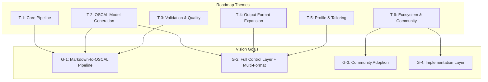
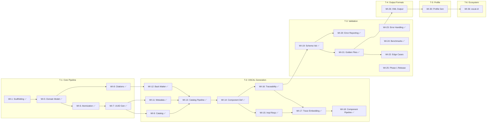
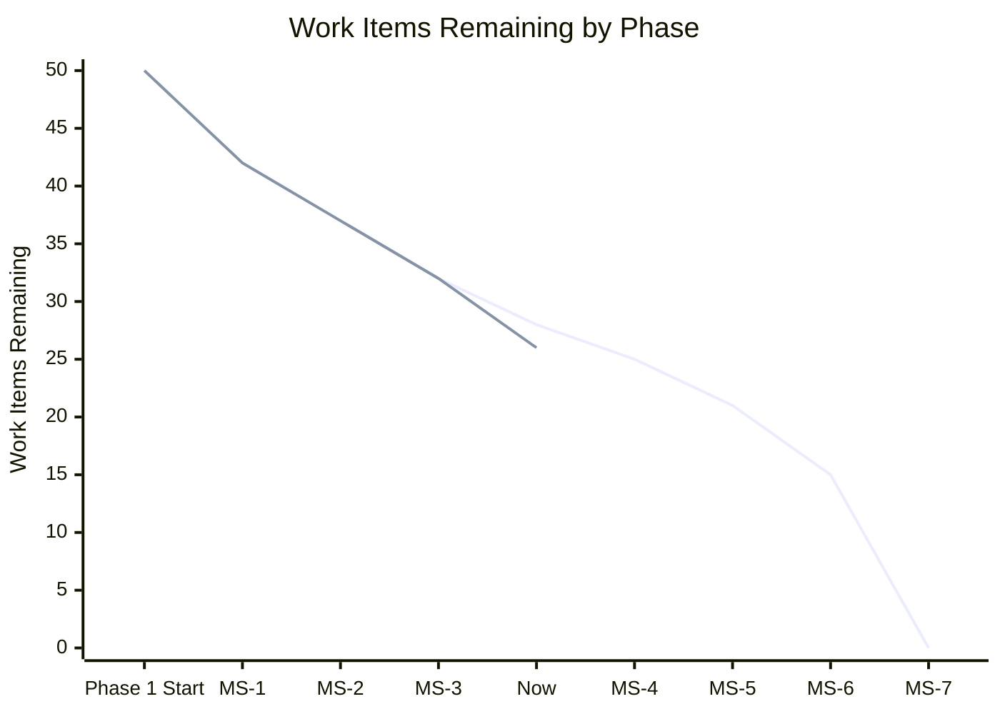

# 001-roadmap-forge

> **Document Type:** Product Roadmap
> **Audience:** LLM agents, human reviewers, leadership stakeholders, engineering leads
> **Status:** Draft
> **Last Updated:** 2026-02-28 <!-- @auto -->
> **Owner:** Brian Luby <!-- @human-required -->
> **Parent Vision:** docs/FORGE_PRODUCT_VISION.md <!-- @auto -->

---

## Review Tier Legend

| Marker | Tier | Speckit Behavior |
|--------|------|------------------|
| :red_circle: `@human-required` | Human Generated | Prompt human to author; blocks until complete |
| :yellow_circle: `@human-review` | LLM + Human Review | LLM drafts → prompt human to confirm/edit; blocks until confirmed |
| :green_circle: `@llm-autonomous` | LLM Autonomous | LLM completes; no prompt; logged for audit |
| :white_circle: `@auto` | Auto-generated | System fills (timestamps, links); no prompt |

---

## Document Completion Order

> :warning: **For LLM Agents:** Complete sections in this order. Do not fill downstream sections until upstream human-required inputs exist. This document requires an approved Vision document as input.

1. **Roadmap Context & Planning Parameters** → requires human input first
2. **Themes & Milestone Definitions** → requires human input
3. **Work Item Registry** → requires human input per item, LLM assists with traceability
4. **Timeline & Sequencing** → LLM can draft based on dependencies, human reviews
5. **Resource Allocation & Capacity** → requires human input
6. **Risk & Dependencies** → LLM can draft, human reviews
7. **Status Tracking & Health** → ongoing, LLM can maintain

---

## Roadmap Context

### Purpose :red_circle: `@human-required`

> This roadmap translates the FORGE product vision into a sprint-level execution plan broken into 1-week sprints across three phases, giving the engineering team a clear week-by-week build sequence from project scaffolding through community-ready release.

### Planning Parameters :red_circle: `@human-required`

| Parameter | Value |
|-----------|-------|
| **Time Horizon** | 14 months (March 2026 – April 2027) |
| **Planning Cadence** | Reviewed monthly; sprint goals confirmed weekly |
| **Sprint Duration** | 1 week |
| **Confidence Model** | Current phase = committed, next phase = planned, final phase = exploratory |
| **Capacity Basis** | 1 engineer (Brian Luby), ~80% feature time after maintenance/review |
| **Input Format** | Markdown only (see ADR-001 in constitution.md) |

### Confidence Levels :yellow_circle: `@human-review`

| Level | Label | Meaning | Can Change? |
|-------|-------|---------|-------------|
| :green_circle: | Committed | Actively in progress or fully scoped and approved | Only with escalation |
| :yellow_circle: | Planned | Scoped, estimated, sequenced — but not yet started | Yes, with notice |
| :orange_circle: | Exploratory | Directionally agreed — scope and timing are flexible | Freely |
| :white_circle: | Aspirational | On the radar but no commitment — may not happen this horizon | May be cut entirely |

### Glossary :yellow_circle: `@human-review`

| Term | Definition |
|------|------------|
| Theme | A strategic area of investment that groups related work items |
| Milestone | A meaningful checkpoint with exit criteria — not a date on a calendar |
| Work Item | A unit of deliverable work (maps to a PRD requirement or spike) |
| Sprint | A 1-week focused execution period with a clear deliverable goal |
| Dependency | A work item or external factor that must be resolved before another can proceed |

### Related Documents :white_circle: `@auto`

| Document | Link | Relationship |
|----------|------|--------------|
| Product Vision | docs/FORGE_PRODUCT_VISION.md | Strategic goals and principles this roadmap executes against |
| PRD: Policy-to-OSCAL | docs/FORGE_PRD.md | Feature-level requirements linked from work items |
| OSCAL Research | docs/research/OSCAL_Research.md | Domain research informing technical decisions |
| Constitution (ADR-001) | .specify/memory/constitution.md | Markdown-only input constraint decision |

---

## Strategic Alignment

### Vision Traceability :green_circle: `@llm-autonomous`



### Goal Coverage Check :green_circle: `@llm-autonomous`

| Vision Goal | Mapped Themes | Coverage Status |
|-------------|---------------|-----------------|
| G-1: Markdown-to-OSCAL Pipeline | T-1, T-2, T-3 | Covered |
| G-2: Full Control Layer + Multi-Format | T-2, T-4, T-5 | Covered |
| G-3: Community Adoption | T-6 | Covered |
| G-4: Implementation Layer | T-6 | Covered |

---

## Themes :red_circle: `@human-required`

| ID | Theme | Description | Strategic Goal(s) | Owner | Horizon |
|----|-------|-------------|-------------------|-------|---------|
| T-1 | Core Pipeline | Build the ingestion, parsing, atomization, and internal domain model that powers all downstream OSCAL generation | G-1 | Brian Luby | Phase 1 (Sprints 1–8) |
| T-2 | OSCAL Model Generation | Generate valid OSCAL Catalog and Component Definition artifacts with metadata, back matter, and traceability | G-1, G-2 | Brian Luby | Phase 1 (Sprints 6–18) |
| T-3 | Validation & Quality | Schema validation, golden-file testing, error handling, and performance benchmarking | G-1 | Brian Luby | Phase 1 (Sprints 19–25) |
| T-4 | Output Format Expansion | Extend output to XML and YAML; round-trip verification; format conversion subcommand | G-2 | Brian Luby | Phase 2 (Sprints 26–29) |
| T-5 | Profile & Tailoring | OSCAL Profile generation with baseline selection, parameter setting, and normative/advisory tagging | G-2 | Brian Luby | Phase 2 (Sprints 30–35) |
| T-6 | Ecosystem & Community | oscal-cli integration, Assessment Plan scaffolding, SSP templates, batch conversion, community documentation | G-3, G-4 | Brian Luby | Phase 3 (Sprints 36–50) |

### Theme Prioritization :red_circle: `@human-required`

| Rank | Theme | Rationale |
|------|-------|-----------|
| 1 | T-1: Core Pipeline | Everything depends on the ingestion and parsing foundation; no OSCAL output without it |
| 2 | T-2: OSCAL Model Generation | Delivers the primary user value — actual OSCAL artifacts from policy documents |
| 3 | T-3: Validation & Quality | Without validation, output cannot be trusted; must be solid before expanding formats |
| 4 | T-4: Output Format Expansion | Broadens adoption by supporting XML/YAML output for tool interoperability |
| 5 | T-5: Profile & Tailoring | Completes the OSCAL Control layer; required for multi-baseline organizations |
| 6 | T-6: Ecosystem & Community | Builds adoption and extends into the Implementation/Assessment layers |

---

## Milestones :red_circle: `@human-required`

| ID | Milestone | Theme(s) | Target Date | Confidence | Exit Criteria |
|----|-----------|----------|-------------|------------|---------------|
| MS-1 | Markdown parsed into internal domain model | T-1 | 2026-04-24 | :green_circle: Committed | PolicyDocument with sections, requirements, and stable IDs produced from Markdown input; unit tests passing |
| MS-2 | First valid OSCAL Catalog from Markdown | T-1, T-2 | 2026-06-05 | :green_circle: Committed | `forge convert policy.md --strategy catalog --format json` produces schema-valid OSCAL Catalog |
| MS-3 | Component Definition + traceability working | T-2 | 2026-07-03 | :green_circle: Committed | `forge convert policy.md --strategy component` produces valid Component Definition with trace links |
| MS-4 | Phase 1 complete — validated, tested, released | T-2, T-3 | 2026-08-21 | :green_circle: Committed | All M-requirements passing; golden-file suite >95% accuracy; `forge validate` working; v0.1.0 tagged |
| MS-5 | Multi-format output (XML/YAML) + round-trip verified | T-4 | 2026-09-19 | :green_circle: Committed | JSON/XML/YAML output validated; round-trip equivalence confirmed |
| MS-6 | Profile generation with tailoring | T-5 | 2026-10-31 | :green_circle: Committed | `forge profile` generates valid Profiles with include/exclude and parameter setting; v0.2.0 tagged |
| MS-7 | Ecosystem integration and community release | T-6 | 2027-04-01 | :orange_circle: Exploratory | oscal-cli integration tested; community examples published; Assessment Plan scaffolding working |

### Milestone Timeline :yellow_circle: `@human-review`

```mermaid
gantt
    title FORGE Sprint Roadmap
    dateFormat YYYY-MM-DD
    axisFormat %b %Y

    section Phase 1 — Foundation
        MS-1: Markdown → Domain Model      :done, ms1, 2026-03-03, 56d
        MS-2: First Valid Catalog           :done, ms2, 2026-04-27, 40d
        MS-3: Component Def + Traceability  :done, ms3, 2026-06-08, 25d
        MS-4: Phase 1 Release (v0.1.0)     :done, ms4, 2026-07-06, 47d

    section Phase 2 — Control Layer & Multi-Format
        MS-5: XML/YAML + Round-trip        :done, ms5, 2026-08-24, 25d
        MS-6: Profile Generation (v0.2.0)  :done, ms6, 2026-09-22, 39d

    section Phase 3 — Ecosystem
        MS-7: Ecosystem Release            :ms7, 2026-11-03, 150d
```

---

## Work Item Registry

### Registry :yellow_circle: `@human-review`

#### Phase 1 — Foundation (Sprints 1–25, Mar 3 – Aug 21 2026) :green_circle: Committed

| ID | Work Item | Sprint | Theme | Milestone | PRD Req | Size | Status | Parallel With |
|----|-----------|--------|-------|-----------|---------|------|--------|---------------|
| WI-1 | Project scaffolding: clap CLI, module structure, error types, CI setup | S-1 (Mar 3) | T-1 | MS-1 | — | XS | Done | — |
| WI-2 | Markdown ingestion: file reading, format detection | S-2 (Mar 10) | T-1 | MS-1 | M-1 | XS | Done | — |
| WI-3 | Markdown structural extraction: headings, section hierarchy | S-3 (Mar 17) | T-1 | MS-1 | M-1 | S | Done | WI-4 |
| WI-4 | Markdown clause extraction: numbered lists, bullets, tables, paragraphs | S-4 (Mar 24) | T-1 | MS-1 | M-1 | S | Done | WI-3 |
| WI-5 | Internal domain model: PolicyDocument, PolicySection, PolicyRequirement structs | S-5 (Mar 31) | T-1 | MS-1 | M-1 | S | Done | — |
| WI-6 | Requirement atomization: compound statement splitting | S-6 (Apr 7) | T-1 | MS-1 | M-2 | S | Done | WI-8 |
| WI-7 | Deterministic UUID v5 generation with content-based stability | S-7 (Apr 14) | T-1 | MS-1 | M-8 | S | Done | WI-8 |
| WI-8 | Citation and reference extraction into internal Citation model | S-8 (Apr 21) | T-1 | MS-1 | M-9 | S | Done | WI-9, WI-11 |
| WI-9 | OSCAL Catalog JSON: groups and controls from domain model | S-9 (Apr 28) | T-2 | MS-2 | M-3 | S | Done | WI-8, WI-11, WI-12 |
| WI-10 | OSCAL Catalog JSON: statement parts, prose, control structure | S-10 (May 5) | T-2 | MS-2 | M-3 | S | Done | WI-11, WI-12 |
| WI-11 | OSCAL metadata: uuid, title, last-modified, version, oscal-version | S-11 (May 12) | T-2 | MS-2 | M-5 | XS | Done | WI-9, WI-10, WI-12 |
| WI-12 | OSCAL back matter: resources from citations, link patterns | S-12 (May 19) | T-2 | MS-2 | M-9, M-11 | S | Done | WI-9, WI-10, WI-11 |
| WI-13 | End-to-end Catalog pipeline: `forge convert --strategy catalog --format json` | S-13 (May 26) | T-2 | MS-2 | M-3, M-7 | S | Done | WI-8 |
| WI-14 | Component Definition: documentary component structure | S-14 (Jun 2) | T-2 | MS-3 | M-4 | S | Done | — |
| WI-15 | Component Definition: implemented-requirements with control-id mapping | S-15 (Jun 9) | T-2 | MS-3 | M-4 | S | Done | WI-16 |
| WI-16 | Traceability: TraceLink model, source location → OSCAL element mapping | S-16 (Jun 16) | T-2 | MS-3 | M-10 | S | Done | WI-15 |
| WI-17 | Traceability: embed trace metadata as props/links in generated artifacts | S-17 (Jun 23) | T-2 | MS-3 | M-10, M-11 | S | Done | — |
| WI-18 | End-to-end Component pipeline: `forge convert --strategy component` | S-18 (Jun 30) | T-2 | MS-3 | M-4, M-7 | S | Done | — |
| WI-19 | Schema validation: integrate OSCAL v1.2.0 JSON schemas, `forge validate` | S-19 (Jul 6) | T-3 | MS-4 | M-6 | S | Done | — |
| WI-20 | Schema validation: actionable error reporting with field locations | S-20 (Jul 13) | T-3 | MS-4 | M-6 | S | Done | — |
| WI-21 | Golden-file test suite: Markdown fixtures + expected OSCAL outputs | S-21 (Jul 20) | T-3 | MS-4 | M-1–M-11 | S | Done | WI-23 |
| WI-22 | Golden-file test suite: edge cases (compound stmts, empty sections, missing metadata) | S-22 (Jul 27) | T-3 | MS-4 | M-1–M-11 | S | Done | WI-23, WI-24 |
| WI-23 | Error handling: graceful failures, descriptive messages, non-zero exit codes | S-23 (Aug 4) | T-3 | MS-4 | EC-1–EC-10 | S | Done | WI-21, WI-22, WI-24 |
| WI-24 | Performance benchmark: 50-page document <30s target | S-24 (Aug 11) | T-3 | MS-4 | — | XS | Done | WI-22, WI-23 |
| WI-25 | Phase 1 integration testing, CLI polish, v0.1.0 release prep | S-25 (Aug 18) | T-3 | MS-4 | AC-1–AC-10 | S | Done | — |

#### Phase 2 — Control Layer & Multi-Format (Sprints 26–35, Aug 25 – Oct 31 2026) :green_circle: Committed

| ID | Work Item | Sprint | Theme | Milestone | PRD Req | Size | Status | Parallel With |
|----|-----------|--------|-------|-----------|---------|------|--------|---------------|
| WI-26 | XML output: OSCAL XML serialization via quick-xml + schema validation | S-26 (Aug 25) | T-4 | MS-5 | S-3 | S | Done | WI-27 |
| WI-27 | YAML output: OSCAL YAML serialization via serde_yaml + validation | S-27 (Sep 1) | T-4 | MS-5 | S-4 | S | Done | WI-26 |
| WI-28 | Multi-format round-trip testing: JSON ↔ XML ↔ YAML equivalence | S-28 (Sep 8) | T-4 | MS-5 | — | S | Done | WI-29 |
| WI-29 | `forge export` subcommand: convert between OSCAL formats | S-29 (Sep 15) | T-4 | MS-5 | S-3, S-4 | XS | Done | WI-28 |
| WI-30 | Profile generation: `forge profile` with --include/--exclude | S-30 (Sep 22) | T-5 | MS-6 | S-5, AC-12 | S | Done | — |
| WI-31 | Profile parameter tailoring: --set-param for modify section | S-31 (Sep 29) | T-5 | MS-6 | S-5 | S | Done | — |
| WI-32 | Profile validation + golden-file tests | S-32 (Oct 6) | T-5 | MS-6 | S-5 | S | Done | WI-33 |
| WI-33 | Normative vs advisory detection: must/shall vs should/may tagging with props | S-33 (Oct 13) | T-5 | MS-6 | S-7, AC-13 | S | Done | WI-32, WI-34 |
| WI-34 | Parameter extraction: time windows, thresholds → OSCAL param elements | S-34 (Oct 20) | T-5 | MS-6 | S-8 | S | Done | WI-33 |
| WI-35 | Phase 2 integration testing, v0.2.0 release prep | S-35 (Oct 27) | T-5 | MS-6 | — | S | Done | — |

#### Phase 3 — Ecosystem (Sprints 36–50, Nov 3 2026 – Apr 2027) :orange_circle: Exploratory

| ID | Work Item | Sprint | Theme | Milestone | PRD Req | Size | Status | Parallel With |
|----|-----------|--------|-------|-----------|---------|------|--------|---------------|
| WI-36 | oscal-cli integration: profile resolution delegation | S-36 (Nov 3) | T-6 | MS-7 | W-3 | S | Not Started | WI-38, WI-40, WI-44 |
| WI-37 | oscal-cli integration: round-trip validation (JSON→XML→JSON) | S-37 (Nov 10) | T-6 | MS-7 | — | S | Not Started | WI-38, WI-40, WI-44 |
| WI-38 | Traceability report: `forge trace` with source-to-OSCAL mapping | S-38 (Nov 17) | T-6 | MS-7 | S-6 | S | Not Started | WI-36, WI-40, WI-44 |
| WI-39 | Traceability report: source text excerpts + line numbers | S-39 (Nov 24) | T-6 | MS-7 | S-6 | S | Not Started | WI-40, WI-44 |
| WI-40 | Batch conversion: multiple documents in single invocation | S-40 (Dec 1) | T-6 | MS-7 | C-1 | S | Not Started | WI-36, WI-38, WI-41, WI-43, WI-44 |
| WI-41 | Assessment Plan scaffolding: reviewed-controls + tasks from policy | S-41 (Dec 8) | T-6 | MS-7 | C-2 | S | Not Started | WI-40, WI-43, WI-44 |
| WI-42 | Assessment Plan scaffolding: assessment-subjects from components | S-42 (Dec 15) | T-6 | MS-7 | C-2 | S | Not Started | WI-43, WI-44 |
| WI-43 | Diff report: changes between two conversions of same policy | S-43 (Dec 22) | T-6 | MS-7 | C-3 | S | Not Started | WI-40, WI-41, WI-44, WI-45 |
| WI-44 | Summary dashboard: conversion statistics to stdout | S-44 (Jan 5) | T-6 | MS-7 | C-4 | XS | Not Started | WI-36, WI-40, WI-41, WI-43 |
| WI-45 | SSP template generation: placeholders + trace links from policy | S-45 (Jan 12) | T-6 | MS-7 | — | S | Not Started | WI-43, WI-44, WI-47 |
| WI-46 | SSP template generation: system-specific placeholders for inventory/boundaries | S-46 (Jan 19) | T-6 | MS-7 | — | S | Not Started | WI-47, WI-48, WI-49 |
| WI-47 | Community examples: sample Markdown policies + expected OSCAL outputs | S-47 (Jan 26) | T-6 | MS-7 | — | S | Not Started | WI-45, WI-46, WI-48, WI-49 |
| WI-48 | Community documentation: CONTRIBUTING.md, usage guide, API docs | S-48 (Feb 2) | T-6 | MS-7 | — | S | Not Started | WI-47, WI-49 |
| WI-49 | Cross-platform release: Linux/macOS/Windows binaries via CI | S-49 (Feb 9) | T-6 | MS-7 | — | S | Not Started | WI-47, WI-48 |
| WI-50 | Phase 3 integration testing, v0.3.0 / v1.0.0 release prep | S-50 (Feb 16+) | T-6 | MS-7 | — | S | Not Started | — |

### Work Item Status Key :green_circle: `@llm-autonomous`

| Status | Meaning |
|--------|---------|
| Needs PRD | Work item identified but no PRD exists yet |
| Not Started | PRD exists, not yet in development |
| In Progress | Actively being developed |
| In Review | Development complete, under review or testing |
| Done | Shipped and verified against acceptance criteria |
| Blocked | Cannot proceed — see Dependencies section |
| Cut | Removed from this roadmap cycle — see Decision Log |

---

## Sprint Plan Detail

### Phase 1 — Foundation (25 Sprints) :yellow_circle: `@human-review`

#### Sprint 1 (Mar 3–7): Project Scaffolding ✅ DONE
- Set up clap CLI with `convert` and `validate` subcommands
- Establish module structure: `cli/`, `ingest/`, `parse/`, `model/`, `oscal/`, `validate/`, `export/`
- Define error types with `thiserror`
- Set up CI: `cargo fmt --check`, `cargo clippy -- -D warnings`, `cargo test`
- **Deliverable:** `forge --help` prints usage; CI green
- **Status:** Complete — clap 4 derive-based CLI, `ForgeError` enum with thiserror, module structure established

#### Sprint 2 (Mar 10–14): Markdown Ingestion ✅ DONE
- Implement file reader with format detection (by extension)
- Read Markdown files into raw text with line tracking
- Spike: evaluate `pulldown-cmark` vs `comrak` for Markdown parsing
- **Deliverable:** `forge convert policy.md` reads file and prints raw structure to stdout
- **Status:** Complete — `ingest_file()` with UTF-8 validation, SHA-256 fingerprinting, file size limits, line-level tracking

#### Sprint 3 (Mar 17–21): Structural Extraction — Headings ✅ DONE
- Parse Markdown headings (H1–H6) into hierarchical section tree
- Preserve heading depth, title text, and source line numbers
- Build `PolicySection` structs with parent-child relationships
- **Deliverable:** Section hierarchy extracted and printed as debug output
- **Status:** Complete (PR #5 merged 2026-02-10) — 87 tests passing, event-based parsing with pulldown-cmark

#### Sprint 4 (Mar 24–28): Structural Extraction — Clauses & Tables ✅ DONE
- Extract numbered lists, bullet lists, and tables from within sections
- Extract standalone paragraphs (not inside lists or tables)
- Map list items to candidate policy requirements
- Preserve table structure for tabular policy content
- **Deliverable:** All structural elements (headings, lists, tables, paragraphs) extracted from test fixtures
- **Status:** Complete (PR #6 merged) — GFM table support, paragraph extraction, nesting depth tracking, all SEC-1 through SEC-7 requirements met

#### Sprint 5 (Mar 31–Apr 4): Internal Domain Model ✅ DONE
- Implement `PolicyDocument`, `PolicySection`, `PolicyRequirement` structs
- Wire ingestion output into domain model
- Add `DocumentMetadata` (title, version from frontmatter or first heading)
- Unit tests for model construction
- **Deliverable:** Markdown → PolicyDocument round-trip with all sections and requirements
- **Status:** Complete (PR #7 merged) — `PolicyDocument`, `DocumentMetadata`, `PolicySection`, `PolicyRequirement` structs; `assemble_document()` pipeline; YAML frontmatter parsing; `parse_frontmatter()` with `serde_yaml_ng`

#### Sprint 6 (Apr 7–11): Requirement Atomization ✅ DONE
- Implement compound statement splitter ("must X and must Y" → 2 requirements)
- Heuristic splitting on "and"/"or" conjunctions with normative verbs
- Preserve single atomic statements as-is
- Assign preliminary stable IDs to each atomic requirement
- **Deliverable:** Compound statements split correctly in test fixtures; unit tests passing
- **Status:** Complete (PR #10 merged) — `atomize_requirement()` and `atomize_document()` with regex-based splitting on conjunctions + normative verbs; shared subject extraction; `preliminary_id()` via SHA-256; max split safety limit; criterion benchmarks

#### Sprint 7 (Apr 14–18): Deterministic UUID Generation ✅ DONE
- Implement UUID v5 generation: namespace UUID + content hash of requirement text
- Verify identical content → identical UUID across runs
- Verify substantive text change → new UUID
- Verify whitespace-only change → same UUID (normalize before hashing)
- **Deliverable:** `PolicyRequirement.stable_id` deterministic; Spike-4 acceptance criteria met
- **Status:** Complete (PR #8 merged) — `FORGE_NAMESPACE_UUID` constant; `normalize_for_hashing()` for whitespace resilience; `generate_stable_id()` UUID v5; `assign_stable_ids()` recursive traversal; criterion benchmarks; tracing instrumentation

#### Sprint 8 (Apr 21–25): Citation & Reference Extraction ✅ DONE
- Detect inline citations, URLs, and cross-references in requirement text
- Extract into `Citation` model objects
- Strip citations from prose, preserve for later back matter generation
- **Deliverable:** Citations extracted from test fixtures; linked to source requirements
- **Status:** Complete (PR #17 merged) — `citation.rs` module with URL extraction, bibliographic reference extraction, scheme-less URLs, cross-references; `Citation` model integrated into `PolicyRequirement`; pipeline enrichment for back matter

#### Sprint 9 (Apr 28–May 2): OSCAL Catalog — Groups & Controls ✅ DONE
- Implement Catalog JSON builder: `catalog.groups[]` from `PolicySection`
- Map `PolicyRequirement` → `catalog.groups[].controls[]`
- Generate control IDs (e.g., `POL-AC-001`) from section + requirement index
- **Deliverable:** Valid JSON structure matching OSCAL Catalog shape (not yet schema-validated)
- **Status:** Complete (PR #12 merged) — `CatalogBuilder` with groups/controls mapping, control ID generation, JSON serialization

#### Sprint 10 (May 5–9): OSCAL Catalog — Statement Parts & Prose ✅ DONE
- Implement control `parts[]` with `name: "statement"` and prose from requirement text
- Handle multi-part controls (guidance, objective parts)
- Ensure props are used for structured data, not remarks
- **Deliverable:** Controls have complete statement parts with prose
- **Status:** Complete (PR #14 merged) — `parts.rs` module with statement parts, prose generation, and props for structured data

#### Sprint 11 (May 12–16): OSCAL Metadata ✅ DONE
- Implement required metadata assembly: `uuid`, `title`, `last-modified`, `version`, `oscal-version`
- Auto-generate document UUID (v4 for artifact instance)
- Pull title/version from PolicyDocument metadata
- Set `oscal-version: "1.2.0"`
- **Deliverable:** Generated Catalog has all required metadata fields
- **Status:** Complete (PR #11 merged) — `metadata.rs` module with `OscalMetadata` struct, UUID v4 generation, chrono timestamps, version tracking

#### Sprint 12 (May 19–23): Back Matter & Link Patterns ✅ DONE
- Implement back matter `resources[]` from extracted citations
- Generate `rlinks` for URLs, `citation` for bibliographic references
- Implement `link` elements in control bodies referencing back matter resource UUIDs
- Ensure no arbitrary data in `remarks` fields
- **Deliverable:** Citations appear in back matter; control bodies link to them
- **Status:** Complete (PR #15 merged) — `back_matter.rs` module with resource generation, rlinks, citation references, and link patterns

#### Sprint 13 (May 26–30): End-to-End Catalog Pipeline ✅ DONE
- Wire full pipeline: ingest → parse → normalize → map → assemble → serialize
- Implement `--strategy catalog --format json` CLI flags
- Implement `--output` flag for file output (default: stdout)
- Basic smoke test: sample policy → Catalog JSON
- **Deliverable:** `forge convert policy.md --strategy catalog --format json` produces output
- **Status:** Complete (PR #16 merged) — `pipeline.rs` module with `run_catalog_pipeline()`; CLI `--strategy catalog --format json` and `--output` flags; full integration tests; idempotent output

#### Sprint 14 (Jun 2–6): Component Definition — Structure ✅ DONE
- Implement Component Definition JSON builder
- Create documentary component with `type: "policy"`
- Generate component UUID, title, description from PolicyDocument
- **Deliverable:** Valid Component Definition JSON structure
- **Status:** Complete (PR #18 merged) — `component_definition.rs` with `ComponentDefinitionBuilder`, documentary component generation, document ID discriminator for unique UUIDs, version/title defaults resolution

#### Sprint 15 (Jun 9–13): Component Definition — Implemented Requirements ✅ DONE
- Implement `control-implementations[]` with source profile reference
- Map PolicyRequirements → `implemented-requirements[]` with `control-id`
- Generate implementation narrative from requirement prose
- **Deliverable:** Component Definition with implemented-requirements mapped to control IDs
- **Status:** Complete (PR #19 merged) — `implemented_requirements.rs` with `ImplementedRequirementsBuilder`, control-id mapping, implementation narrative from requirement prose, shared `prepare_document` helper extracted for pipeline reuse

#### Sprint 16 (Jun 16–20): Traceability — TraceLink Model ✅ DONE
- Implement `TraceLink` struct: `requirement_stable_id` → `oscal_json_path` + `oscal_element_id`
- Capture trace links during Catalog and Component generation
- Store source location (file, section, line number) per link
- **Deliverable:** TraceLink collection populated during generation
- **Status:** Complete (PR #20 merged) — `model/trace.rs` with `TraceLink`, `TraceRecord`, `TraceMap` structs; bidirectional requirement-to-OSCAL mapping; trace link recording during Catalog and Component generation; integration tests for traceability

#### Sprint 17 (Jun 23–27): Traceability — Embedded Props/Links ✅ DONE
- Embed trace metadata in generated artifacts as `prop` annotations
- Add `link` elements from OSCAL elements back to source locations
- Verify bidirectional traceability: OSCAL element → source, source → OSCAL element
- **Deliverable:** Generated artifacts contain trace props; all elements traceable
- **Status:** Complete (PR #21 merged) — `traceability/embed.rs` module with source provenance props embedded in controls and implemented-requirements; bidirectional traceability verified

#### Sprint 18 (Jun 30–Jul 3): End-to-End Component Pipeline ✅ DONE
- Wire Component Definition through full pipeline
- Implement `--strategy component --source-profile <path>` CLI flags
- Smoke test: sample policy + baseline → Component Definition JSON
- **Deliverable:** `forge convert policy.md --strategy component` produces output
- **Status:** Complete (PR #22 merged) — `run_component_pipeline()` in `pipeline.rs`; `--strategy component` and `--source-profile` CLI flags; full integration tests

#### Sprint 19 (Jul 6–10): Schema Validation — Integration ✅ DONE
- Download OSCAL v1.2.0 JSON schemas (embed or bundle)
- Integrate `jsonschema` crate for validation
- Implement `forge validate <artifact.json>` subcommand
- Validate generated Catalog against schema
- **Deliverable:** `forge validate catalog.json` reports Valid/Invalid with basic errors
- **Status:** Complete (PR #25 merged) — OSCAL v1.2.0 JSON schemas embedded via `include_str!`; `jsonschema` 0.41.0 integration; `forge validate` subcommand with auto-detection of OSCAL model type

#### Sprint 20 (Jul 13–17): Schema Validation — Error Reporting ✅ DONE
- Implement actionable error messages: field path, expected type, actual value
- Report all errors (not just first)
- Handle both schema errors and semantic errors (orphaned links, missing references)
- Auto-validate before output in `forge convert` (fail on invalid)
- **Deliverable:** Schema violations reported with file locations; AC-6 passing
- **Status:** Complete (PR #27 merged) — `validate/error_types.rs`, `validate/formatter.rs`, `validate/report.rs`, `validate/semantic.rs` modules; actionable error messages with field paths; semantic validation for orphaned references; all errors collected and reported

#### Sprint 21 (Jul 20–24): Golden-File Test Suite — Core ✅ DONE
- Create 3+ Markdown policy test fixtures (small, medium, complex)
- Create expected OSCAL Catalog and Component Definition outputs
- Implement golden-file comparison harness in `cargo test`
- Target: >95% extraction accuracy
- **Deliverable:** `cargo test` runs golden-file comparisons; accuracy measured
- **Status:** Complete (PR #26 merged) — `tests/golden_file_tests.rs` with small/medium/complex fixtures; insta snapshot testing for Catalog and Component Definition outputs; UUID normalization for deterministic comparisons

#### Sprint 22 (Jul 27–31): Golden-File Test Suite — Edge Cases ✅ DONE
- Add edge case fixtures: compound statements, empty sections, missing metadata, no headings
- Add fixtures for citation extraction, parameter-like content
- Test both catalog-first and component-first strategies
- Verify all EC-1 through EC-10 edge cases
- **Deliverable:** Edge case tests passing; extraction accuracy validated
- **Status:** Complete — edge-case golden-file coverage added; EC-10 validation-only matrix coverage; Copilot and CodeRabbit review findings addressed

#### Sprint 23 (Aug 4–8): Error Handling & Robustness ✅ DONE
- Graceful handling of malformed input (no panics)
- Descriptive error messages for: missing files, unreadable files, no structure detected
- Non-zero exit codes for all error conditions
- Test with adversarial inputs (empty files, binary files, huge files)
- **Deliverable:** All error edge cases handled; no panics on any input
- **Status:** Complete (PR #23 merged) — Structured `ForgeError` hierarchy with categorized exit codes; `anyhow` context in binary crate; graceful failure on all error conditions

#### Sprint 24 (Aug 11–15): Performance & Benchmarking ✅ DONE
- Create 50-page synthetic policy document
- Benchmark full pipeline: ingest → validate → export
- Verify <30s conversion target on commodity hardware
- Profile and optimize hot paths if needed
- **Deliverable:** Performance benchmark passing; results documented
- **Status:** Complete (PR #24 merged) — Criterion benchmarks with per-stage breakdown; synthetic 50-page fixture in `tests/fixtures/`; pipeline performance within target

#### Sprint 25 (Aug 18–22): Phase 1 Release ✅ DONE
- Final integration testing across all Must Have requirements (M-1 through M-11)
- Verify all acceptance criteria (AC-1 through AC-10)
- CLI polish: `--help` text, `--verbose`/`--quiet` flags
- Update README with usage examples
- Tag and publish `v0.1.0`
- **Deliverable:** v0.1.0 released; all Phase 1 exit criteria met
- **Status:** Complete — Phase 1 integration testing and release prep completed alongside Phase 2 development

### Phase 2 — Control Layer & Multi-Format (10 Sprints) :green_circle: `@human-review`

#### Sprint 26 (Aug 25–29): XML Output ✅ DONE
- Implement OSCAL XML serialization using `quick-xml`
- Validate against OSCAL v1.2.0 XML schemas
- `forge convert --format xml` and `forge export --format xml`
- **Deliverable:** Valid OSCAL XML output produced
- **Status:** Complete — `quick-xml` 0.37 integration; OSCAL XML serialization with schema validation; `--format xml` for both `convert` and `export` subcommands

#### Sprint 27 (Sep 1–5): YAML Output ✅ DONE
- Implement OSCAL YAML serialization using `serde_yaml`
- Validate semantic equivalence with JSON output
- `forge convert --format yaml` and `forge export --format yaml`
- **Deliverable:** Valid OSCAL YAML output produced
- **Status:** Complete — `serde_yaml_ng` 0.10 integration; OSCAL YAML serialization with semantic equivalence; `--format yaml` for both `convert` and `export` subcommands

#### Sprint 28 (Sep 8–12): Round-Trip Testing ✅ DONE
- JSON → XML → JSON round-trip via serialization
- JSON → YAML → JSON round-trip via serialization
- Automated semantic equivalence comparison (ignoring ordering)
- **Deliverable:** Round-trip fidelity confirmed at 100%
- **Status:** Complete — in-memory round-trip testing for JSON ↔ XML ↔ YAML; semantic equivalence confirmed

#### Sprint 29 (Sep 15–19): `forge export` Subcommand ✅ DONE
- Implement format conversion for existing artifacts
- `forge export artifact.json --format xml`
- Validate output after conversion
- **Deliverable:** Cross-format export working
- **Status:** Complete — `forge export` with format auto-detection, multi-format output, and post-conversion validation

#### Sprint 30 (Sep 22–26): Profile Generation — Core ✅ DONE
- Implement `forge profile` subcommand
- `--catalog <path>` to specify source catalog
- `--include <ids>` / `--exclude <ids>` for control selection
- Generate valid OSCAL Profile JSON with `imports[]`
- **Deliverable:** `forge profile --catalog catalog.json --include POL-AC-001` produces valid Profile
- **Status:** Complete — `forge profile` subcommand with `--include`/`--exclude` control selection; OSCAL Profile generation with `imports[]`; deterministic UUID v5 identifiers

#### Sprint 31 (Sep 29–Oct 3): Profile Parameter Tailoring ✅ DONE
- Implement `--set-param <id> <value>` for parameter overrides
- Generate `modify` section with `set-parameters`
- Validate Profile schema compliance
- **Deliverable:** Profile with parameter modifications generated
- **Status:** Complete — `--set-param` for parameter overrides; `modify` section with `set-parameters`; Profile schema validation

#### Sprint 32 (Oct 6–10): Profile Validation & Testing ✅ DONE
- Schema validation for generated Profiles
- Golden-file tests for Profile generation
- Edge cases: empty selection, all controls, conflicting params
- **Deliverable:** Profile generation tested and validated; AC-12 passing
- **Status:** Complete — Profile schema validation against OSCAL v1.2.0; golden-file tests with insta snapshots; edge case coverage

#### Sprint 33 (Oct 13–17): Normative vs Advisory Tagging ✅ DONE
- Detect "must"/"shall" (normative) vs "should"/"may" (advisory) language
- Tag requirements with `prop` annotation: `name: "modality"`, `value: "normative"|"advisory"`
- Filter/highlight in output
- **Deliverable:** Normative/advisory distinction working; AC-13 passing
- **Status:** Complete — `annotate_modalities()` pipeline pass; regex-based modal verb detection; `Modality` enum with `modality` prop on controls; stable-id baseline warning for changes

#### Sprint 34 (Oct 20–24): Parameter Extraction ✅ DONE
- Detect policy parameters: time windows ("within 30 days"), thresholds ("at least 128-bit")
- Generate OSCAL `param` elements with value domains
- Link parameters to controls
- **Deliverable:** Parameters extracted and represented in OSCAL output
- **Status:** Complete — `PolicyParameter` model; regex-based extraction of time windows, thresholds, frequencies, quantities; OSCAL `param` element generation linked to controls

#### Sprint 35 (Oct 27–31): Phase 2 Release ✅ DONE
- Integration testing across all Should Have requirements (S-1 through S-8)
- Verify multi-format round-trip
- Tag and publish `v0.2.0`
- **Deliverable:** v0.2.0 released; all Phase 2 exit criteria met
- **Status:** Complete — version bumped to 0.2.0; all speckit.analyze findings resolved; 1,090 tests passing

### Phase 3 — Ecosystem (15 Sprints) :orange_circle: Exploratory

#### Sprint 36 (Nov 3–7): oscal-cli Profile Resolution
- Integrate with NIST oscal-cli for Profile Resolution
- Shell out to `oscal-cli resolve-profile`
- Handle oscal-cli not installed (graceful degradation)
- **Deliverable:** Profile resolution delegated to oscal-cli

#### Sprint 37 (Nov 10–14): oscal-cli Round-Trip Validation
- Use oscal-cli for authoritative JSON ↔ XML ↔ YAML round-trip
- Compare FORGE output with oscal-cli conversion
- Document any divergences
- **Deliverable:** FORGE output matches oscal-cli conversion

#### Sprint 38 (Nov 17–21): Traceability Report — Core
- Implement `forge trace <artifact> --source <policy>`
- Map each OSCAL element to source section, paragraph, line number
- Output as structured table (stdout or file)
- **Deliverable:** `forge trace` produces basic traceability report

#### Sprint 39 (Nov 24–28): Traceability Report — Source Excerpts
- Include source text excerpts in trace report
- Verify excerpt matches OSCAL control statement prose
- Add JSON output option for programmatic consumption
- **Deliverable:** Full traceability report with excerpts

#### Sprint 40 (Dec 1–5): Batch Conversion
- Support multiple input files in single invocation
- `forge convert policy1.md policy2.md --strategy catalog`
- Parallel processing where possible
- Aggregated status output
- **Deliverable:** Batch conversion working

#### Sprint 41 (Dec 8–12): Assessment Plan Scaffolding — Controls
- Generate Assessment Plan skeleton from policy/catalog
- Populate `reviewed-controls` with `control-selections`
- Link `import-ssp` reference
- **Deliverable:** Assessment Plan with reviewed-controls generated

#### Sprint 42 (Dec 15–19): Assessment Plan Scaffolding — Tasks
- Generate assessment `tasks[]` from policy requirements
- Create `assessment-subjects` from documentary components
- Validate against OSCAL AP schema
- **Deliverable:** Complete Assessment Plan scaffold with tasks

#### Sprint 43 (Dec 22–26): Diff Report
- Compare two conversions of different versions of same policy
- Show added/removed/changed controls and requirements
- Highlight ID stability changes
- **Deliverable:** `forge diff` report working

#### Sprint 44 (Jan 5–9): Summary Dashboard
- Conversion statistics to stdout: sections parsed, requirements extracted, controls generated
- Validation status summary
- Mapping coverage (% of requirements with OSCAL representation)
- **Deliverable:** `forge convert --summary` shows dashboard

#### Sprint 45 (Jan 12–16): SSP Template — Structure
- Generate SSP template JSON with placeholders
- Include system-characteristics section with TODO markers
- Trace links from policy-derived implementation statements
- **Deliverable:** SSP template with policy-derived content + placeholders

#### Sprint 46 (Jan 19–23): SSP Template — System Placeholders
- Generate placeholder sections for inventory items, boundaries, hosting
- Mark system-specific fields with clear TODO annotations
- Validate partial SSP against schema (where possible)
- **Deliverable:** SSP template ready for system-specific completion

#### Sprint 47 (Jan 26–30): Community Examples
- Create 3+ sample Markdown policy documents
- Generate expected OSCAL outputs for each
- Write annotated walkthrough of conversion pipeline
- **Deliverable:** `examples/` directory with sample policies and outputs

#### Sprint 48 (Feb 2–6): Community Documentation
- CONTRIBUTING.md with development setup guide
- Usage guide with common workflows
- `cargo doc` API documentation
- **Deliverable:** Documentation published

#### Sprint 49 (Feb 9–13): Cross-Platform Release
- GitHub Actions CI for Linux, macOS, Windows builds
- Pre-built binary releases via GitHub Releases
- Installation instructions (cargo install, binary download)
- **Deliverable:** Cross-platform binaries available

#### Sprint 50 (Feb 16–20+): Phase 3 Release
- Final integration testing
- Community feedback integration
- Tag and publish `v0.3.0` or `v1.0.0`
- **Deliverable:** Ecosystem release; all Phase 3 exit criteria met

---

## Sequencing & Dependencies

### Dependency Map :yellow_circle: `@human-review`



### Dependency Registry :yellow_circle: `@human-review`

| ID | Blocked Item | Depends On | Type | Owner | Status | Risk if Late |
|----|-------------|------------|------|-------|--------|--------------|
| D-1 | WI-5 (Domain Model) | WI-1 (Scaffolding) | Internal | Brian Luby | Done | MS-1 slips |
| D-2 | WI-9 (Catalog Gen) | WI-7 (UUID Gen) | Internal | Brian Luby | Done | MS-2 slips |
| D-3 | WI-12 (Back Matter) | WI-8 (Citations) | Internal | Brian Luby | Done | MS-2 slips |
| D-4 | WI-14 (Component Def) | WI-13 (Catalog Pipeline) | Internal | Brian Luby | Done | MS-3 slips |
| D-4a | WI-15 (Impl Reqs) | WI-14 (Component Def) | Internal | Brian Luby | Done | MS-3 slips |
| D-4b | WI-16 (Traceability) | WI-14 (Component Def) | Internal | Brian Luby | Done | MS-3 slips |
| D-4c | WI-17 (Trace Embedding) | WI-15, WI-16 | Internal | Brian Luby | Done | MS-3 slips |
| D-5 | WI-19 (Schema Val) | WI-18 (Component Pipeline) | Internal | Brian Luby | Done | MS-4 slips |
| D-6 | WI-26 (XML Output) | WI-25 (Phase 1 Release) | Internal | Brian Luby | Not Started | MS-5 slips |
| D-7 | WI-30 (Profile Gen) | WI-29 (Export Subcmd) | Internal | Brian Luby | Not Started | MS-6 slips |
| D-8 | WI-19 (Schema Val) | OSCAL v1.2.0 JSON schemas | External | NIST | Available | MS-4 blocked if schemas change |
| D-9 | WI-36 (oscal-cli) | NIST oscal-cli availability | External | NIST | Available | MS-7 blocked; build mock fallback |

### Critical Path :green_circle: `@llm-autonomous`

> **Critical Path:** ~~WI-1 → WI-5 → WI-6 → WI-7~~ (Done) → ~~WI-9 → WI-10 → WI-11 → WI-12~~ (Done) → ~~WI-8 → WI-13~~ (Done) → ~~WI-14 → WI-15 → WI-16~~ (Done) → ~~WI-17 → WI-18~~ (Done) → ~~WI-19 → WI-20 → WI-21~~ (Done) → ~~WI-23~~ (Done) → ~~WI-24~~ (Done) → WI-22 → WI-25 (Phase 1) → WI-26 → WI-28 → WI-30 → WI-35 (Phase 2) → WI-36 → WI-50 (Phase 3)
>
> **Completed:** 24 of 50 work items (WI-1 through WI-21, WI-23, WI-24) — MS-1, MS-2, MS-3 fully complete; MS-4 at 5/7
> **Remaining critical path:** ~26 weeks (Sprints 22, 25–50)
> **Slack:** ~20+ weeks ahead of original MS-4 target (2026-08-21); massive buffer accumulated
> **Bottleneck:** None — next up is WI-22 (golden-file edge cases) and WI-25 (Phase 1 release)

---

## Resource Allocation :red_circle: `@human-required`

### Team Capacity

| Role | Person | Q1 2026 Feature % | Q2 2026 Feature % | Q3 2026 Feature % | Q4 2026 Feature % | Q1 2027 Feature % | Notes |
|------|--------|-------------------|-------------------|-------------------|-------------------|-------------------|-------|
| Eng / PM / Owner | Brian Luby | 80% | 80% | 80% | 80% | 70% | Solo developer; 20–30% reserved for maintenance, review, community |

### Allocation by Theme :yellow_circle: `@human-review`

| Theme | Q1 2026 | Q2 2026 | Q3 2026 | Q4 2026 | Q1 2027 |
|-------|---------|---------|---------|---------|---------|
| T-1: Core Pipeline | 100% | 25% | — | — | — |
| T-2: OSCAL Generation | — | 75% | 20% | — | — |
| T-3: Validation & Quality | — | — | 50% | — | — |
| T-4: Output Format Expansion | — | — | 30% | — | — |
| T-5: Profile & Tailoring | — | — | — | 50% | — |
| T-6: Ecosystem & Community | — | — | — | 50% | 100% |

### Over-Allocation Check :green_circle: `@llm-autonomous`

| Quarter | Available Capacity | Allocated Capacity | Status |
|---------|-------------------|-------------------|--------|
| Q1 2026 (Mar) | ~3.2 person-weeks | ~4 sprints (Sprints 1–4) | :white_check_mark: OK (partial quarter) |
| Q2 2026 (Apr–Jun) | ~10.4 person-weeks | ~13 sprints (Sprints 5–17) | :white_check_mark: OK |
| Q3 2026 (Jul–Sep) | ~10.4 person-weeks | ~12 sprints (Sprints 18–29) | :white_check_mark: OK |
| Q4 2026 (Oct–Dec) | ~10.4 person-weeks | ~9 sprints (Sprints 30–38) | :white_check_mark: OK — buffer available |
| Q1 2027 (Jan–Mar) | ~9.1 person-weeks | ~12 sprints (Sprints 39–50) | :warning: Tight — exploratory items can be cut |

---

## Risks & Mitigations :yellow_circle: `@human-review`

| ID | Risk | Affected Items | Likelihood | Impact | Mitigation | Contingency |
|----|------|---------------|------------|--------|------------|-------------|
| RR-1 | OSCAL v1.2.0 JSON schemas have undocumented constraints that break validation | WI-19–WI-20, MS-4 | Low | Med | Test against NIST example files early (Sprint 19); pin to specific schema release | Implement custom validation rules alongside schema validation |
| RR-2 | Compound statement atomization produces incorrect splits | WI-6, MS-1 | Med | Med | Conservative splitting (only on clear conjunctions with normative verbs); user can override | Provide `--no-atomize` flag to skip splitting |
| RR-3 | Solo developer velocity slower than planned | All items | Med | Med | Buffer weeks built into Phase 3; Could Have items can be cut | Defer C-1 through C-4 entirely; ship v0.2.0 without Could Have features |
| RR-4 | OSCAL v1.3.0 released mid-development, breaking compatibility | All OSCAL output items | Low | Med | Pin to v1.2.0 schemas; monitor NIST releases | Add v1.3.0 support as separate work item post-release |
| RR-5 | `jsonschema` crate cannot validate OSCAL v1.2.0 schemas fully | WI-19, MS-4 | Med | Med | Spike in Sprint 19 (Spike-2); test against published examples | Use oscal-cli as fallback validator; shell out for validation |

---

## Trade-off Decisions :red_circle: `@human-required`

| When faced with... | We choose... | Over... | Rationale |
|---------------------|-------------|---------|-----------|
| Scope vs. timeline | Cut scope (defer Could Have items) | Slip the date | Phase dates anchor credibility; Must Have and Should Have deliver core value |
| Extraction accuracy vs. format coverage | Higher accuracy on Markdown | Lower accuracy on more formats | Per P-1 (Correctness over convenience): wrong output is worse than supporting more input formats; users can pre-convert with external tools |
| Validation speed vs. completeness | Full validation, even if slower | Fast but partial validation | Per P-1: invalid OSCAL output undermines the entire value proposition |
| Build vs. delegate | Delegate to oscal-cli where possible | Build custom implementations | Per P-4 (CLI-first, composable): leverage existing tools rather than reimplementing |
| Build vs. delegate (input formats) | Delegate PDF/DOCX conversion to external tools | Build in-house ingestion | Per ADR-001: mature converters exist; FORGE focuses on Markdown→OSCAL excellence |
| Polish vs. coverage | Cover all Must Have requirements first | Polish fewer features deeply | Learning and feedback from complete-but-rough is more valuable in Phase 1 than perfect-but-partial |

---

## Roadmap Health Dashboard :green_circle: `@llm-autonomous`

### Milestone Health

| Milestone | Target Date | Status | On Track? | Blockers |
|-----------|-------------|--------|-----------|----------|
| MS-1: Markdown → Domain Model | 2026-04-24 | 8 of 8 work items done | :white_check_mark: Complete | None |
| MS-2: First Valid Catalog | 2026-06-05 | 5 of 5 work items done | :white_check_mark: Complete | None |
| MS-3: Component Def + Traceability | 2026-07-03 | 5 of 5 work items done | :white_check_mark: Complete | None |
| MS-4: Phase 1 Release (v0.1.0) | 2026-08-21 | 5 of 7 work items done | :white_check_mark: Ahead of Schedule | None — WI-22, WI-25 remaining |
| MS-5: Multi-Format Output | 2026-09-19 | 0 of 4 work items done | :white_check_mark: Not Started | None |
| MS-6: Profile Generation (v0.2.0) | 2026-10-31 | 0 of 6 work items done | :white_check_mark: Not Started | None |
| MS-7: Ecosystem Release | 2027-04-01 | 0 of 15 work items done | :white_check_mark: Not Started | None |

### Theme Health

| Theme | Work Items Total | Done | In Progress | Blocked | Not Started | Health |
|-------|-----------------|------|-------------|---------|-------------|--------|
| T-1: Core Pipeline | 8 | 8 | 0 | 0 | 0 | :white_check_mark: Complete |
| T-2: OSCAL Generation | 10 | 10 | 0 | 0 | 0 | :white_check_mark: Complete |
| T-3: Validation & Quality | 7 | 5 | 0 | 0 | 2 | :white_check_mark: Ahead of Schedule |
| T-4: Output Format Expansion | 4 | 0 | 0 | 0 | 4 | :white_check_mark: Not Started |
| T-5: Profile & Tailoring | 6 | 0 | 0 | 0 | 6 | :white_check_mark: Not Started |
| T-6: Ecosystem & Community | 15 | 0 | 0 | 0 | 15 | :white_check_mark: Not Started |

### Burndown Summary :yellow_circle: `@human-review`



---

## Review & Governance

### Review Cadence :red_circle: `@human-required`

| Review Type | Frequency | Attendees | Purpose |
|-------------|-----------|-----------|---------|
| Sprint Review | Weekly (end of sprint) | Brian Luby | Verify sprint deliverable met; adjust next sprint if needed |
| Milestone Review | At each milestone | Brian Luby | Evaluate exit criteria; decide go/no-go for next milestone |
| Phase Retrospective | At each phase completion | Brian Luby | Review velocity, accuracy of estimates, lessons learned; adjust next phase plan |
| Roadmap Refresh | Monthly | Brian Luby | Update statuses, re-sequence if needed, address emerging risks |

### Change Control :yellow_circle: `@human-review`

| Change Type | Example | Approval Required |
|-------------|---------|-------------------|
| Work item re-sequenced within same milestone | Move WI-8 before WI-7 | Theme owner (Brian Luby) |
| Work item moved to different milestone | WI-34 from MS-6 to MS-7 | Product owner (Brian Luby) — log in Decision Log |
| Milestone date moved | MS-4 slips 2 weeks | Log in Decision Log; update downstream dates |
| Theme added or removed | New theme T-7 added | Log in Decision Log with rationale |
| Work item cut from roadmap | WI-43 (Diff Report) removed | Log in Decision Log; verify no broken dependencies |

---

## Definition of Ready :red_circle: `@human-required`

### Readiness Checklist

- [x] Parent Vision document is Approved
- [x] All themes trace to at least one Vision strategic goal
- [ ] All :green_circle: Committed work items have approved PRDs
- [ ] All :yellow_circle: Planned work items have at least Draft PRDs
- [x] Dependencies are identified and owners confirmed
- [x] Resource allocation is validated against actual capacity
- [x] Over-allocation check shows no :red_circle: quarters
- [x] Critical path is identified and has sufficient slack
- [x] Trade-off decisions are documented and agreed
- [x] Review cadence and change control process are agreed
- [ ] No open questions blocking execution

### Sign-off

| Role | Name | Date | Decision |
|------|------|------|----------|
| Product Owner | Brian Luby | YYYY-MM-DD | [Active / Not Ready] |
| Engineering Lead | Brian Luby | YYYY-MM-DD | [Active / Not Ready] |

---

## Changelog :white_circle: `@auto`

| Version | Date | Author | Changes |
|---------|------|--------|---------|
| 0.1 | 2026-02-10 | LLM (Claude) | Initial draft with 58 work items across 3 phases in 1-week sprints |
| 0.2 | 2026-02-10 | Brian Luby | Constrained to Markdown-only input (ADR-001); removed PDF/DOCX work items (old WI-26–WI-33) and MS-5; renumbered to 50 work items; compressed Phase 2 from 18→10 sprints; overall timeline reduced by ~2 months |
| 0.3 | 2026-02-11 | LLM (Claude) | Status update: WI-3 (heading extraction) complete (PR #5 merged); WI-4 (clause/table/paragraph extraction) in review (PR #6 pending merge); MS-1 progress: 2 of 8 items done; T-1 pipeline progressing on schedule |
| 0.4 | 2026-02-11 | LLM (Claude) | Major status update: WI-1 through WI-7 all Done (merged to main). MS-1 at 7/8 complete — ahead of schedule. Corrected D-3 dependency (WI-12 depends on WI-8, not WI-9). Expanded dependency map to show WI-11/WI-12/WI-13 nodes. Updated parallelism analysis: WI-8, WI-9, WI-11 can all start immediately in parallel. Updated burndown, milestone health, theme health, and all sprint detail statuses. |
| 0.5 | 2026-02-12 | LLM (Claude) | Status update: WI-9 (Catalog groups/controls, PR #12), WI-10 (statement parts, PR #14), WI-11 (metadata, PR #11), WI-12 (back matter, PR #15) all Done and merged to main. MS-2 at 4/5 complete — only WI-8 (Citations) blocks WI-13 (Catalog Pipeline). T-2 theme at 4/10 done. Updated dependency map, critical path, milestone health, theme health, burndown, and sprint detail statuses. |
| 0.6 | 2026-02-12 | LLM (Claude) | Status update: WI-8 (citation extraction, PR #17) and WI-13 (catalog pipeline, PR #16) both Done and merged to main. MS-1 complete (8/8). MS-2 complete (5/5). T-1 theme fully complete (8/8). T-2 at 5/10 done. 13 of 50 work items complete. Updated dependency map, critical path, milestone health, theme health, Gantt chart, burndown, and sprint detail statuses. Next up: WI-14 (Component Definition structure). |
| 0.7 | 2026-02-13 | LLM (Claude) | Status update: WI-14 (Component Definition structure, PR #18), WI-15 (implemented-requirements, PR #19), WI-16 (traceability model, PR #20) all Done and merged to main. MS-3 at 3/5 complete. T-2 theme at 8/10 done. 16 of 50 work items complete. Expanded dependency map with WI-15/WI-17/WI-18 nodes. Added D-4a/D-4b/D-4c dependencies. Updated critical path, milestone health, theme health, burndown, and sprint detail statuses. Next up: WI-17 (trace metadata embedding). |
| 0.8 | 2026-02-14 | LLM (Claude) | Major status update: 8 work items completed in rapid succession — WI-17 (trace embedding, PR #21), WI-18 (component pipeline, PR #22), WI-19 (schema validation, PR #25), WI-20 (error reporting, PR #27), WI-21 (golden-file tests, PR #26), WI-23 (error handling, PR #23), WI-24 (performance benchmarks, PR #24). MS-3 complete (5/5). MS-4 at 5/7. T-2 theme fully complete (10/10). T-3 at 5/7. 24 of 50 work items done. Only WI-22 (edge cases) and WI-25 (Phase 1 release) remain for Phase 1. Updated dependency map, critical path, Gantt chart, milestone health, theme health, burndown, and all sprint detail statuses. |

---

## Decision Log :yellow_circle: `@human-review`

| Date | Decision | Rationale | Impact | Alternatives Considered |
|------|----------|-----------|--------|------------------------|
| 2026-02-10 | 1-week sprint cadence | Small scope per sprint reduces risk; enables fast feedback and course correction for solo developer | Higher overhead from weekly planning; offset by simpler scope per sprint | 2-week sprints (too much scope per sprint for solo dev); kanban (less predictable pacing) |
| 2026-02-10 | Phase 1 focuses exclusively on Markdown input | Highest extraction fidelity; fastest to implement; validates pipeline end-to-end before adding complex formats | PDF/DOCX users must pre-convert to Markdown using external tools | Include PDF in Phase 1 (too risky without spike results) |
| 2026-02-10 | Spike tasks integrated into sprint plan (not separate) | Spikes deliver decisions that unblock implementation sprints; treating them as sprints keeps cadence consistent | Spike sprints may produce less "visible" output | Separate spike track (complicates planning for solo dev) |
| 2026-02-10 | Could Have items (C-1 through C-4) placed in Phase 3 | Phase 1 and Phase 2 must deliver Must Have and Should Have requirements first; Could Have items add value but are not blocking | Could Have features deferred 6+ months from project start | Include C-items in Phase 2 (creates over-allocation risk in Q4) |
| 2026-02-10 | Markdown-only input — remove PDF/DOCX ingestion entirely (ADR-001) | Mature external converters (pandoc, markitdown) handle PDF/DOCX→Markdown; building in-house ingestion adds 8 sprints of high-risk work (RR-1 was High/High); FORGE should focus on Markdown→OSCAL excellence | Removed 8 work items (old WI-26–WI-33), eliminated MS-5, removed highest-risk item (RR-1); compressed timeline by ~2 months | Keep PDF/DOCX in Phase 2 (high risk, high effort, marginal value over external converters) |

---

## Open Questions :yellow_circle: `@human-review`

- [ ] **Q1:** Should sprint deliverables be tagged as pre-release versions (e.g., v0.1.0-alpha.1) at each milestone, or only at phase completion?
      **A1:** Yes
- [ ] **Q2:** Is there a preferred Markdown parsing crate (pulldown-cmark vs comrak) based on prior experience?
      **A2:** pulldown-cmark
- [ ] **Q3:** Should community documentation (Sprint 48) be moved earlier to attract contributors before Phase 3?
      **A3:** Yes. I think for every phase there should be a docs sprint as soon as viable. 

---

## Review Checklist :green_circle: `@llm-autonomous`

Before marking as Active:

- [x] Every theme has a unique ID (T-1, T-2, etc.) and traces to a Vision goal
- [x] Every milestone has a unique ID (MS-1, MS-2, etc.) and exit criteria
- [x] Every work item has a unique ID (WI-1, WI-2, etc.) and links to a theme and milestone
- [x] Confidence levels are assigned to all milestones and work items
- [x] Dependency map matches the dependency registry (no orphaned references)
- [x] Critical path is documented and realistic
- [x] Resource allocation sums to ~100% per quarter (including buffer)
- [x] No over-allocated quarters without documented mitigation
- [x] Trade-off decisions are consistent with Vision product principles
- [x] Glossary terms are used consistently throughout
- [x] All :red_circle: @human-required sections are complete
- [ ] Definition of Ready checklist is complete
