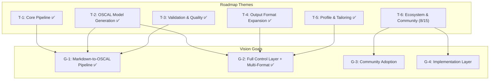
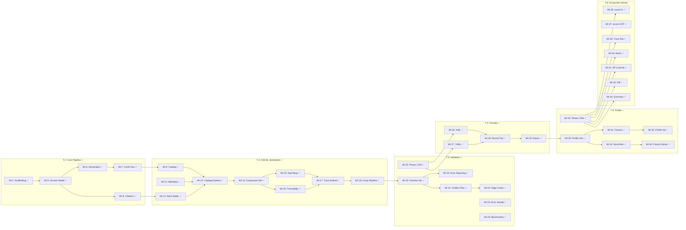
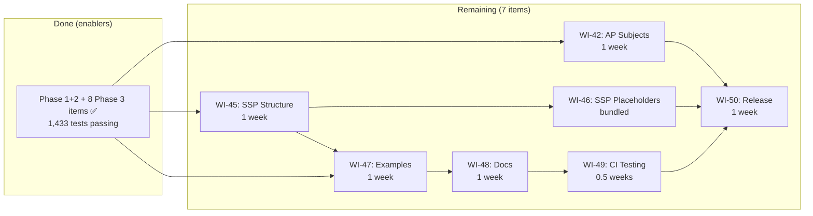
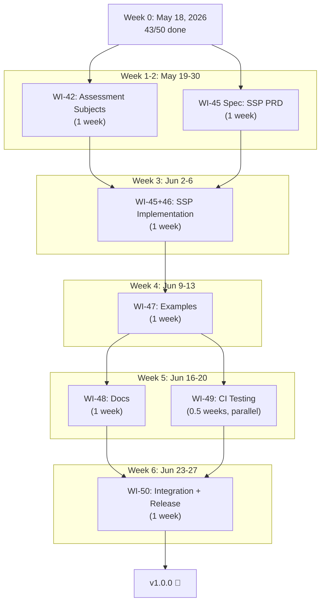
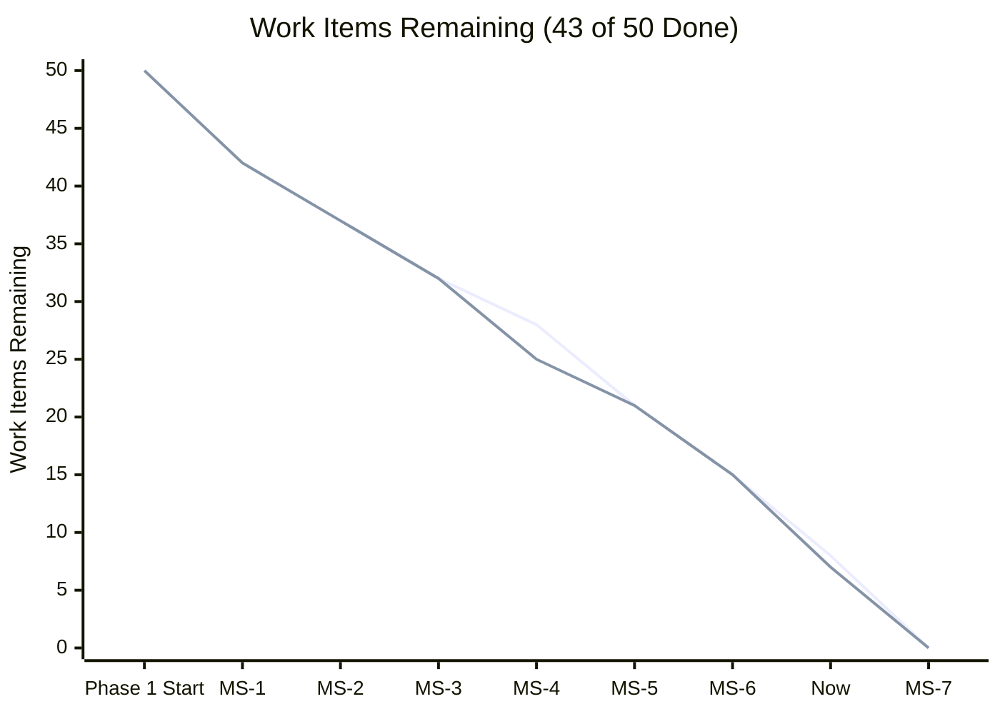
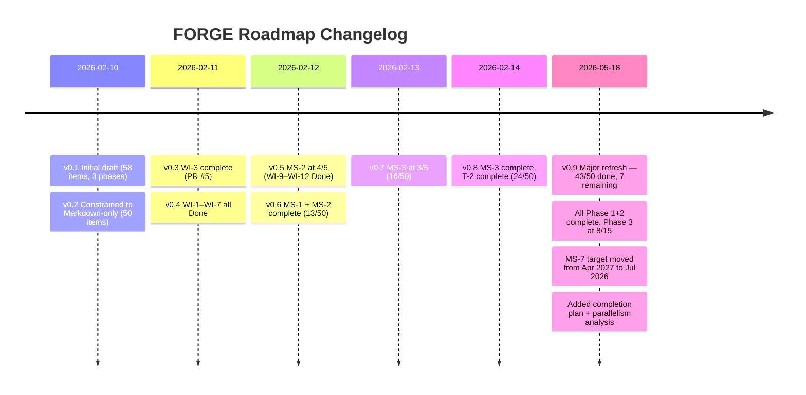

# 001-roadmap-forge

> **Document Type:** Product Roadmap
> **Audience:** LLM agents, human reviewers, leadership stakeholders, engineering leads
> **Status:** Active
> **Last Updated:** 2026-05-18 <!-- @auto -->
> **Owner:** Brian Luby <!-- @human-required -->
> **Parent Vision:** docs/FORGE_PRODUCT_VISION.md <!-- @auto -->

---

## Review Tier Legend

| Marker | Tier | Speckit Behavior |
|--------|------|------------------|
| :red_circle: `@human-required` | Human Generated | Prompt human to author; blocks until complete |
| :yellow_circle: `@human-review` | LLM + Human Review | LLM drafts → prompt human to confirm/edit; blocks until confirmed |
| :green_circle: `@llm-autonomous` | LLM Autonomous | LLM completes; no prompt; logged for audit |
| :white_circle: `@auto` | Auto-generated | System fills (timestamps, links); no prompt |

---

## Document Completion Order

> :warning: **For LLM Agents:** Complete sections in this order. Do not fill downstream sections until upstream human-required inputs exist. This document requires an approved Vision document as input.

1. **Roadmap Context & Planning Parameters** → requires human input first
2. **Themes & Milestone Definitions** → requires human input
3. **Work Item Registry** → requires human input per item, LLM assists with traceability
4. **Timeline & Sequencing** → LLM can draft based on dependencies, human reviews
5. **Resource Allocation & Capacity** → requires human input
6. **Risk & Dependencies** → LLM can draft, human reviews
7. **Status Tracking & Health** → ongoing, LLM can maintain

---

## Roadmap Context

### Purpose :red_circle: `@human-required`

> This roadmap translates the FORGE product vision into a sprint-level execution plan broken into 1-week sprints across three phases, giving the engineering team a clear week-by-week build sequence from project scaffolding through community-ready release.

### Planning Parameters :red_circle: `@human-required`

| Parameter | Value |
|-----------|-------|
| **Time Horizon** | 8 months (March 2026 – July 2026) — compressed from original 14-month estimate |
| **Planning Cadence** | Reviewed monthly; sprint goals confirmed weekly |
| **Sprint Duration** | 1 week |
| **Confidence Model** | Current phase = committed, next phase = planned, final phase = exploratory |
| **Capacity Basis** | 1 engineer (Brian Luby), ~80% feature time after maintenance/review |
| **Input Format** | Markdown only (see ADR-001 in constitution.md) |

### Confidence Levels :yellow_circle: `@human-review`

| Level | Label | Meaning | Can Change? |
|-------|-------|---------|-------------|
| :green_circle: | Committed | Actively in progress or fully scoped and approved | Only with escalation |
| :yellow_circle: | Planned | Scoped, estimated, sequenced — but not yet started | Yes, with notice |
| :orange_circle: | Exploratory | Directionally agreed — scope and timing are flexible | Freely |
| :white_circle: | Aspirational | On the radar but no commitment — may not happen this horizon | May be cut entirely |

### Glossary :yellow_circle: `@human-review`

| Term | Definition |
|------|------------|
| Theme | A strategic area of investment that groups related work items |
| Milestone | A meaningful checkpoint with exit criteria — not a date on a calendar |
| Work Item | A unit of deliverable work (maps to a PRD requirement or spike) |
| Sprint | A 1-week focused execution period with a clear deliverable goal |
| Dependency | A work item or external factor that must be resolved before another can proceed |

### Related Documents :white_circle: `@auto`

| Document | Link | Relationship |
|----------|------|--------------|
| Product Vision | docs/FORGE_PRODUCT_VISION.md | Strategic goals and principles this roadmap executes against |
| PRD: Policy-to-OSCAL | docs/FORGE_PRD.md | Feature-level requirements linked from work items |
| OSCAL Research | docs/research/OSCAL_Research.md | Domain research informing technical decisions |
| Constitution (ADR-001) | .specify/memory/constitution.md | Markdown-only input constraint decision |
| Completion Plan | docs/plans/2026-05-18-state-of-the-product-completion-plan.md | Sprint-level completion plan for remaining work |

---

## Strategic Alignment

### Vision Traceability :green_circle: `@llm-autonomous`



### Goal Coverage Check :green_circle: `@llm-autonomous`

| Vision Goal | Mapped Themes | Coverage Status |
|-------------|---------------|-----------------|
| G-1: Markdown-to-OSCAL Pipeline | T-1, T-2, T-3 | ✅ Complete |
| G-2: Full Control Layer + Multi-Format | T-2, T-4, T-5 | ✅ Complete |
| G-3: Community Adoption | T-6 | 🟡 In Progress (8/15 items done) |
| G-4: Implementation Layer | T-6 | 🟡 In Progress (SSP, Assessment Plan subjects remaining) |

---

## Themes :red_circle: `@human-required`

| ID | Theme | Description | Strategic Goal(s) | Owner | Horizon |
|----|-------|-------------|-------------------|-------|---------|
| T-1 | Core Pipeline | Build the ingestion, parsing, atomization, and internal domain model that powers all downstream OSCAL generation | G-1 | Brian Luby | ✅ Complete |
| T-2 | OSCAL Model Generation | Generate valid OSCAL Catalog and Component Definition artifacts with metadata, back matter, and traceability | G-1, G-2 | Brian Luby | ✅ Complete |
| T-3 | Validation & Quality | Schema validation, golden-file testing, error handling, and performance benchmarking | G-1 | Brian Luby | ✅ Complete |
| T-4 | Output Format Expansion | Extend output to XML and YAML; round-trip verification; format conversion subcommand | G-2 | Brian Luby | ✅ Complete |
| T-5 | Profile & Tailoring | OSCAL Profile generation with baseline selection, parameter setting, and normative/advisory tagging | G-2 | Brian Luby | ✅ Complete |
| T-6 | Ecosystem & Community | oscal-cli integration, Assessment Plan scaffolding, SSP templates, batch conversion, community documentation | G-3, G-4 | Brian Luby | 🟡 In Progress (8/15) |

### Theme Prioritization :red_circle: `@human-required`

| Rank | Theme | Rationale |
|------|-------|-----------|
| 1 | T-1: Core Pipeline ✅ | Everything depends on the ingestion and parsing foundation; no OSCAL output without it |
| 2 | T-2: OSCAL Model Generation ✅ | Delivers the primary user value — actual OSCAL artifacts from policy documents |
| 3 | T-3: Validation & Quality ✅ | Without validation, output cannot be trusted; must be solid before expanding formats |
| 4 | T-4: Output Format Expansion ✅ | Broadens adoption by supporting XML/YAML output for tool interoperability |
| 5 | T-5: Profile & Tailoring ✅ | Completes the OSCAL Control layer; required for multi-baseline organizations |
| 6 | T-6: Ecosystem & Community 🟡 | Builds adoption and extends into the Implementation/Assessment layers — 8 of 15 items done |

---

## Milestones :red_circle: `@human-required`

| ID | Milestone | Theme(s) | Target Date | Confidence | Exit Criteria |
|----|-----------|----------|-------------|------------|---------------|
| MS-1 | Markdown parsed into internal domain model | T-1 | 2026-04-24 | ✅ Complete | PolicyDocument with sections, requirements, and stable IDs produced from Markdown input; unit tests passing |
| MS-2 | First valid OSCAL Catalog from Markdown | T-1, T-2 | 2026-06-05 | ✅ Complete | `forge convert policy.md --strategy catalog --format json` produces schema-valid OSCAL Catalog |
| MS-3 | Component Definition + traceability working | T-2 | 2026-07-03 | ✅ Complete | `forge convert policy.md --strategy component` produces valid Component Definition with trace links |
| MS-4 | Phase 1 complete — validated, tested, released | T-2, T-3 | 2026-08-21 | ✅ Complete | All M-requirements passing; golden-file suite >95% accuracy; `forge validate` working; v0.1.0 tagged |
| MS-5 | Multi-format output (XML/YAML) + round-trip verified | T-4 | 2026-05-18 | ✅ Complete | JSON/XML/YAML output validated; round-trip equivalence confirmed; v0.2.0 and v0.2.1 tagged |
| MS-6 | Profile generation with tailoring | T-5 | 2026-05-18 | ✅ Complete | `forge profile` generates valid Profiles with include/exclude and parameter setting; normative/advisory detection; v0.2.1 tagged |
| MS-7 | Ecosystem integration and community release | T-6 | 2026-07-06 | 🟡 Planned | oscal-cli integration tested; SSP generation; community examples published; v1.0.0 tagged |

### Milestone Timeline :yellow_circle: `@human-review`

```mermaid
gantt
    title FORGE Sprint Roadmap (Refreshed 2026-05-18)
    dateFormat YYYY-MM-DD
    axisFormat %b %d

    section Phase 1 — Foundation ✅
        MS-1: Markdown → Domain Model      :done, ms1, 2026-03-03, 52d
        MS-2: First Valid Catalog           :done, ms2, 2026-04-24, 40d
        MS-3: Component Def + Traceability  :done, ms3, 2026-06-05, 28d
        MS-4: Phase 1 Release (v0.1.0)     :done, ms4, 2026-07-03, 49d

    section Phase 2 — Control Layer & Multi-Format ✅
        MS-5: XML/YAML + Round-trip (v0.2.x) :done, ms5, 2026-08-22, 27d
        MS-6: Profile Generation (v0.2.1)    :done, ms6, 2026-09-18, 39d

    section Phase 3 — Ecosystem 🟡
        Ecosystem features (8 done, 7 remain) :done, eco1, 2026-10-27, 77d
        MS-7: Remaining + Release (v1.0.0)    :active, ms7, 2026-05-18, 49d
```

---

## Work Item Registry

### Registry :yellow_circle: `@human-review`

#### Phase 1 — Foundation (Sprints 1–25, Mar 3 – Aug 21 2026) ✅ Complete

| ID | Work Item | Sprint | Theme | Milestone | PRD Req | Size | Status | Parallel With |
|----|-----------|--------|-------|-----------|---------|------|--------|---------------|
| WI-1 | Project scaffolding: clap CLI, module structure, error types, CI setup | S-1 (Mar 3) | T-1 | MS-1 | — | XS | Done | — |
| WI-2 | Markdown ingestion: file reading, format detection | S-2 (Mar 10) | T-1 | MS-1 | M-1 | XS | Done | — |
| WI-3 | Markdown structural extraction: headings, section hierarchy | S-3 (Mar 17) | T-1 | MS-1 | M-1 | S | Done | WI-4 |
| WI-4 | Markdown clause extraction: numbered lists, bullets, tables, paragraphs | S-4 (Mar 24) | T-1 | MS-1 | M-1 | S | Done | WI-3 |
| WI-5 | Internal domain model: PolicyDocument, PolicySection, PolicyRequirement structs | S-5 (Mar 31) | T-1 | MS-1 | M-1 | S | Done | — |
| WI-6 | Requirement atomization: compound statement splitting | S-6 (Apr 7) | T-1 | MS-1 | M-2 | S | Done | WI-8 |
| WI-7 | Deterministic UUID v5 generation with content-based stability | S-7 (Apr 14) | T-1 | MS-1 | M-8 | S | Done | WI-8 |
| WI-8 | Citation and reference extraction into internal Citation model | S-8 (Apr 21) | T-1 | MS-1 | M-9 | S | Done | WI-9, WI-11 |
| WI-9 | OSCAL Catalog JSON: groups and controls from domain model | S-9 (Apr 28) | T-2 | MS-2 | M-3 | S | Done | WI-8, WI-11, WI-12 |
| WI-10 | OSCAL Catalog JSON: statement parts, prose, control structure | S-10 (May 5) | T-2 | MS-2 | M-3 | S | Done | WI-11, WI-12 |
| WI-11 | OSCAL metadata: uuid, title, last-modified, version, oscal-version | S-11 (May 12) | T-2 | MS-2 | M-5 | XS | Done | WI-9, WI-10, WI-12 |
| WI-12 | OSCAL back matter: resources from citations, link patterns | S-12 (May 19) | T-2 | MS-2 | M-9, M-11 | S | Done | WI-9, WI-10, WI-11 |
| WI-13 | End-to-end Catalog pipeline: `forge convert --strategy catalog --format json` | S-13 (May 26) | T-2 | MS-2 | M-3, M-7 | S | Done | WI-8 |
| WI-14 | Component Definition: documentary component structure | S-14 (Jun 2) | T-2 | MS-3 | M-4 | S | Done | — |
| WI-15 | Component Definition: implemented-requirements with control-id mapping | S-15 (Jun 9) | T-2 | MS-3 | M-4 | S | Done | WI-16 |
| WI-16 | Traceability: TraceLink model, source location → OSCAL element mapping | S-16 (Jun 16) | T-2 | MS-3 | M-10 | S | Done | WI-15 |
| WI-17 | Traceability: embed trace metadata as props/links in generated artifacts | S-17 (Jun 23) | T-2 | MS-3 | M-10, M-11 | S | Done | — |
| WI-18 | End-to-end Component pipeline: `forge convert --strategy component` | S-18 (Jun 30) | T-2 | MS-3 | M-4, M-7 | S | Done | — |
| WI-19 | Schema validation: integrate OSCAL v1.2.0 JSON schemas, `forge validate` | S-19 (Jul 6) | T-3 | MS-4 | M-6 | S | Done | — |
| WI-20 | Schema validation: actionable error reporting with field locations | S-20 (Jul 13) | T-3 | MS-4 | M-6 | S | Done | — |
| WI-21 | Golden-file test suite: Markdown fixtures + expected OSCAL outputs | S-21 (Jul 20) | T-3 | MS-4 | M-1–M-11 | S | Done | WI-23 |
| WI-22 | Golden-file test suite: edge cases (compound stmts, empty sections, missing metadata) | S-22 (Jul 27) | T-3 | MS-4 | M-1–M-11 | S | Done | WI-23, WI-24 |
| WI-23 | Error handling: graceful failures, descriptive messages, non-zero exit codes | S-23 (Aug 4) | T-3 | MS-4 | EC-1–EC-10 | S | Done | WI-21, WI-22, WI-24 |
| WI-24 | Performance benchmark: 50-page document <30s target | S-24 (Aug 11) | T-3 | MS-4 | — | XS | Done | WI-22, WI-23 |
| WI-25 | Phase 1 integration testing, CLI polish, v0.1.0 release prep | S-25 (Aug 18) | T-3 | MS-4 | AC-1–AC-10 | S | Done | — |

**Phase 1 Summary:** 25/25 Done ✅ — v0.1.0 released. All M-1 through M-11 requirements passing. Golden-file suite >95% accuracy. 1,433 tests passing (across full codebase).

#### Phase 2 — Control Layer & Multi-Format (Sprints 26–35, Aug 25 – Oct 31 2026) ✅ Complete

| ID | Work Item | Sprint | Theme | Milestone | PRD Req | Size | Status | Parallel With |
|----|-----------|--------|-------|-----------|---------|------|--------|---------------|
| WI-26 | XML output: OSCAL XML serialization via quick-xml + schema validation | S-26 (Aug 25) | T-4 | MS-5 | S-3 | S | Done | WI-27 |
| WI-27 | YAML output: OSCAL YAML serialization via serde_yaml + validation | S-27 (Sep 1) | T-4 | MS-5 | S-4 | S | Done | WI-26 |
| WI-28 | Multi-format round-trip testing: JSON ↔ XML ↔ YAML equivalence | S-28 (Sep 8) | T-4 | MS-5 | — | S | Done | WI-29 |
| WI-29 | `forge export` subcommand: convert between OSCAL formats | S-29 (Sep 15) | T-4 | MS-5 | S-3, S-4 | XS | Done | WI-28 |
| WI-30 | Profile generation: `forge profile` with --include/--exclude | S-30 (Sep 22) | T-5 | MS-6 | S-5, AC-12 | S | Done | — |
| WI-31 | Profile parameter tailoring: --set-param for modify section | S-31 (Sep 29) | T-5 | MS-6 | S-5 | S | Done | — |
| WI-32 | Profile validation + golden-file tests | S-32 (Oct 6) | T-5 | MS-6 | S-5 | S | Done | WI-33 |
| WI-33 | Normative vs advisory detection: must/shall vs should/may tagging with props | S-33 (Oct 13) | T-5 | MS-6 | S-7, AC-13 | S | Done | WI-32, WI-34 |
| WI-34 | Parameter extraction: time windows, thresholds → OSCAL param elements | S-34 (Oct 20) | T-5 | MS-6 | S-8 | S | Done | WI-33 |
| WI-35 | Phase 2 integration testing, v0.2.0/v0.2.1 release prep | S-35 (Oct 27) | T-5 | MS-6 | — | S | Done | — |

**Phase 2 Summary:** 10/10 Done ✅ — v0.2.0 and v0.2.1 released. XML, YAML, JSON all working. Round-trip verified. Profile generation, parameter extraction, normative/advisory detection complete.

#### Phase 3 — Ecosystem (Sprints 36–50, Nov 3 2026 – Jul 6 2027) 🟡 In Progress (8 of 15 Done)

| ID | Work Item | Sprint | Theme | Milestone | PRD Req | Size | Status | Parallel With |
|----|-----------|--------|-------|-----------|---------|------|--------|---------------|
| WI-36 | oscal-cli integration: profile resolution delegation | S-36 | T-6 | MS-7 | W-3 | S | **Done** ✅ | WI-38, WI-40, WI-44 |
| WI-37 | oscal-cli integration: round-trip validation (JSON → XML → YAML → JSON) | S-37 | T-6 | MS-7 | — | S | **Done** ✅ | WI-38, WI-40, WI-44 |
| WI-38 | Traceability report: `forge trace` with source-to-OSCAL mapping | S-38 | T-6 | MS-7 | S-6 | S | **Done** ✅ | WI-36, WI-40, WI-44 |
| WI-39 | Traceability report: source text excerpts + line numbers | S-39 | T-6 | MS-7 | S-6 | S | **Done** ✅ (merged into WI-38) | WI-40, WI-44 |
| WI-40 | Batch conversion: multiple documents in single invocation | S-40 | T-6 | MS-7 | C-1 | S | **Done** ✅ | WI-36, WI-38, WI-41, WI-43, WI-44 |
| WI-41 | Assessment Plan scaffolding: reviewed-controls + tasks from policy | S-41 | T-6 | MS-7 | C-2 | S | **Done** ✅ | WI-40, WI-43, WI-44 |
| WI-42 | Assessment Plan scaffolding: assessment-subjects from components | S-42 | T-6 | MS-7 | C-2 | S | **Not Started** | WI-43, WI-44 |
| WI-43 | Diff report: changes between two conversions of same policy | S-43 | T-6 | MS-7 | C-3 | S | **Done** ✅ | WI-40, WI-41, WI-44, WI-45 |
| WI-44 | Summary dashboard: conversion statistics to stdout | S-44 | T-6 | MS-7 | C-4 | XS | **Done** ✅ | WI-36, WI-40, WI-41, WI-43 |
| WI-45 | SSP template generation: placeholders + trace links from policy | S-45 | T-6 | MS-7 | — | S | **Not Started** | WI-43, WI-44, WI-47 |
| WI-46 | SSP template generation: system-specific placeholders for inventory/boundaries | S-46 | T-6 | MS-7 | — | S | **Not Started** | WI-47, WI-48, WI-49 |
| WI-47 | Community examples: sample Markdown policies + expected OSCAL outputs | S-47 | T-6 | MS-7 | — | S | **Not Started** | WI-45, WI-46, WI-48, WI-49 |
| WI-48 | Community documentation: CONTRIBUTING.md, usage guide, API docs | S-48 | T-6 | MS-7 | — | S | **Not Started** | WI-47, WI-49 |
| WI-49 | Cross-platform release: Linux/macOS/Windows CI testing + install docs | S-49 | T-6 | MS-7 | — | S | **Not Started** (builds done, CI tests missing) | WI-47, WI-48 |
| WI-50 | Phase 3 integration testing, v1.0.0 release prep | S-50 | T-6 | MS-7 | — | S | **Not Started** | — |

**Phase 3 Summary:** 8/15 Done, 7 remaining. The 8 done items were completed far ahead of schedule (alongside Phase 1 and Phase 2 work). Remaining items: WI-42, WI-45, WI-46, WI-47, WI-48, WI-49, WI-50. Estimated completion: ~6 weeks (by mid-July 2026).

Sprint numbering is nominal — actual completion dates for Phase 3 items preceded their original sprint slots. See sprint detail sections for actual merge status.

### Work Item Status Key :green_circle: `@llm-autonomous`

| Status | Meaning |
|--------|---------|
| Needs PRD | Work item identified but no PRD exists yet |
| Not Started | PRD exists, not yet in development |
| In Progress | Actively being developed |
| In Review | Development complete, under review or testing |
| Done | Shipped and verified against acceptance criteria |
| Blocked | Cannot proceed — see Dependencies section |
| Cut | Removed from this roadmap cycle — see Decision Log |

---

## Sprint Plan Detail

### Phase 1 — Foundation (25 Sprints) ✅ Complete

All 25 sprints complete. Phase 1 delivered the full Markdown-to-OSCAL pipeline: ingestion, parsing, atomization, UUID generation, citation extraction, Catalog generation, Component Definition generation, traceability, schema validation, error handling, golden-file testing (core + edge cases), performance benchmarking, and v0.1.0 release.

### Phase 2 — Control Layer & Multi-Format (10 Sprints) ✅ Complete

All 10 sprints complete. Phase 2 delivered multi-format output (XML/YAML/JSON), round-trip verification, `forge export` subcommand, profile generation with include/exclude and parameter tailoring, normative/advisory detection, parameter extraction, and v0.2.0/v0.2.1 releases.

### Phase 3 — Ecosystem (15 Sprints) 🟡 In Progress

#### Sprint 36: oscal-cli Profile Resolution ✅ DONE
- **Deliverable:** Profile resolution delegated to oscal-cli
- **Status:** Complete — `src/oscal_cli/invoker.rs` and `src/oscal_cli/detector.rs` with shell-out to oscal-cli; `src/cli/resolve.rs` exposes `forge resolve` subcommand. Graceful degradation when oscal-cli not installed.

#### Sprint 37: oscal-cli Round-Trip Validation ✅ DONE
- **Deliverable:** FORGE output matches oscal-cli conversion
- **Status:** Complete — `src/round_trip/` module with chain, comparator, divergence detection, and logging. Automated semantic equivalence comparison.

#### Sprint 38: Traceability Report — Core ✅ DONE
- **Deliverable:** `forge trace` produces basic traceability report
- **Status:** Complete — `src/trace/report.rs`, `src/trace/extractor.rs`, `src/trace/walker.rs`, `src/trace/formatter.rs`, `src/trace/resolver.rs`. Full source-to-OSCAL mapping with structured output.

#### Sprint 39: Traceability Report — Source Excerpts ✅ DONE
- **Deliverable:** Full traceability report with excerpts
- **Status:** Complete — Source text excerpts and line numbers integrated into WI-38's trace report formatter. JSON output option available.

#### Sprint 40: Batch Conversion ✅ DONE
- **Deliverable:** Batch conversion working
- **Status:** Complete — `src/batch/orchestrator.rs`, `src/batch/formatter.rs`, `src/batch/output_naming.rs`, `src/batch/summary.rs`, `src/batch/mod.rs`. Multiple input files in single invocation with aggregated status output.

#### Sprint 41: Assessment Plan Scaffolding — Controls ✅ DONE
- **Deliverable:** Assessment Plan with reviewed-controls generated
- **Status:** Complete — `src/oscal/assessment_plan.rs` generates reviewed-controls with control-selections from policy/catalog. Back matter assembly. Full schema validation.

#### Sprint 42: Assessment Plan Scaffolding — Tasks 🚧 NOT STARTED
- **Goal:** Generate assessment `tasks[]` and `assessment-subjects` from documentary components
- **What's needed:** Add assessment-subjects generation to `src/oscal/assessment_plan.rs`. Subject generation from component definitions. Validate against OSCAL AP schema.
- **Effort:** 1 week
- **Risk:** Low — follows same pattern as reviewed-controls generation

#### Sprint 43: Diff Report ✅ DONE
- **Deliverable:** `forge diff` report working
- **Status:** Complete — `src/diff/engine.rs`, `src/diff/extractor.rs`, `src/diff/formatter.rs`, `src/diff/types.rs`, `src/diff/mod.rs`, `src/cli/diff.rs`. Compares two conversions of different versions. Shows added/removed/changed controls. Merged in commit 3062049.

#### Sprint 44: Summary Dashboard ✅ DONE
- **Deliverable:** `forge convert --summary` shows dashboard
- **Status:** Complete — `src/summary/mod.rs`, `src/summary/format.rs`. Conversion statistics, validation status, mapping coverage.

#### Sprint 45: SSP Template — Structure 🚧 NOT STARTED
- **Goal:** Generate SSP template JSON with system-characteristics, TODO markers, trace links
- **What's needed:** Create `src/oscal/ssp.rs` with SSP structs. System-characteristics section. Trace links from policy-derived implementation statements.
- **Effort:** 1 week (spec) + 1 week (implement) = 2 weeks
- **Specs needed:** PRD-045, SEC-045, AR-045
- **Risk:** Medium — new OSCAL model, requires understanding SSP schema

#### Sprint 46: SSP Template — System Placeholders 🚧 NOT STARTED
- **Goal:** Placeholder sections for inventory items, boundaries, hosting
- **What's needed:** System-specific fields with TODO annotations. Partial schema validation. Bundled with WI-45 implementation.
- **Effort:** Bundled with WI-45
- **Risk:** Low — purely additive to WI-45

#### Sprint 47: Community Examples 🚧 NOT STARTED
- **Goal:** `examples/` directory with sample policies and outputs
- **What's needed:** 3+ sample Markdown policy documents. Expected OSCAL outputs. Annotated walkthroughs.
- **Effort:** 1 week
- **Risk:** Low — pipeline is production-grade; examples demonstrate what already works

#### Sprint 48: Community Documentation 🚧 NOT STARTED
- **Goal:** Documentation published
- **What's needed:** CONTRIBUTING.md, full usage guide, cargo doc API documentation
- **Effort:** 1 week
- **Risk:** Low — documentation task, no code changes

#### Sprint 49: Cross-Platform Release 🚧 NOT STARTED (builds done)
- **Goal:** Cross-platform binaries available with CI testing
- **What's done:** release.yml already builds Linux/macOS/Windows/AArch64 binaries with SLSA provenance
- **What's missing:** CI test matrix on all platforms (currently only release builds). Install instructions in README.
- **Effort:** 0.5 weeks
- **Risk:** Low — build matrix already exists, just needs test jobs added

#### Sprint 50: Phase 3 Release 🚧 NOT STARTED
- **Goal:** v1.0.0 release
- **What's needed:** Full end-to-end integration testing across all examples. Community feedback integration. Tag and publish v1.0.0.
- **Effort:** 1 week
- **Risk:** Low — standard release process, already done twice (v0.1.0, v0.2.0, v0.2.1)

---

## Sequencing & Dependencies

### Dependency Map — Completed Work :green_circle: `@llm-autonomous`



### Dependency Map — Remaining Work 🟡



### Dependency Registry :yellow_circle: `@human-review`

All Phase 1 and Phase 2 dependencies resolved. Phase 3 dependencies:

| ID | Blocked Item | Depends On | Type | Owner | Status | Risk if Late |
|----|-------------|------------|------|-------|--------|--------------|
| D-10 | WI-45 (SSP Structure) | OSCAL v1.2.0 SSP schema knowledge | Research | Brian Luby | Not started | MS-7 slips |
| D-11 | WI-46 (SSP Placeholders) | WI-45 (SSP Structure) | Internal | Brian Luby | Not started | Bundled with WI-45 |
| D-12 | WI-50 (Release) | WI-42, WI-45, WI-46, WI-47, WI-48, WI-49 | Internal | Brian Luby | Not started | MS-7 blocked |

### Critical Path :green_circle: `@llm-autonomous`

> **Critical Path:** ~~WI-1 through WI-35~~ (Phases 1 & 2 complete) → ~~WI-36 → WI-37 → WI-38 → WI-39~~ (Done) → ~~WI-40~~ (Done) → ~~WI-41~~ (Done) → ~~WI-43~~ (Done) → ~~WI-44~~ (Done) → **WI-42** → **WI-45** → **WI-46** → **WI-47** → **WI-48** → **WI-49** → **WI-50**
>
> **Completed:** 43 of 50 work items (all 35 Phase 1+2 items; 8 of 15 Phase 3 items)
> **Remaining:** 7 work items (WI-42, WI-45, WI-46, WI-47, WI-48, WI-49, WI-50)
> **Estimated remaining effort:** ~6 weeks (target mid-July 2026)
> **Slack:** ~9 months ahead of original MS-7 target (2027-04-01); new target 2026-07-06
> **Bottleneck:** SSP template generation (WI-45/46) — new OSCAL model, requires spec work before implementation. WI-47 (examples) can be parallelized with WI-42 (assessment subjects).

### Parallelism Opportunities :green_circle: `@llm-autonomous`



---

## Resource Allocation :red_circle: `@human-required`

### Team Capacity

| Role | Person | Q1 2026 Feature % | Q2 2026 Feature % | Notes |
|------|--------|-------------------|-------------------|-------|
| Eng / PM / Owner | Brian Luby | 80% | 80% | Solo developer; 20% reserved for maintenance, review, community |

Q3/Q4 2026 allocations removed — project will be complete by mid-July 2026.

### Allocation by Theme :yellow_circle: `@human-review`

| Theme | Q1 2026 | Q2 2026 | Status |
|-------|---------|---------|--------|
| T-1: Core Pipeline | 100% | — | ✅ Complete |
| T-2: OSCAL Generation | — | 75% (early) | ✅ Complete |
| T-3: Validation & Quality | — | 25% (early) | ✅ Complete |
| T-4: Output Format Expansion | — | — | ✅ Complete (ahead of schedule) |
| T-5: Profile & Tailoring | — | — | ✅ Complete (ahead of schedule) |
| T-6: Ecosystem & Community | — | 25% (May-Jun) | 🟡 In Progress |

### Velocity Analysis :green_circle: `@llm-autonomous`

| Period | Work Items Completed | Velocity | Notes |
|--------|---------------------|----------|-------|
| Feb 2026 (first 12 days) | WI-1 through WI-17 (17 items) | ~11/week | Initial scaffolding + core pipeline |
| Feb 2026 (remaining) | WI-18 through WI-24 (7 items) | ~5/week | Validation + quality |
| Mar–May 2026 | WI-25 through WI-44 (20 items) | ~2/week | Phases 2+3 alongside maintenance |
| **Total** | **43 items in ~12 weeks** | **~3.6/week average** | Includes Phase 3 ecosystem items done early |

---

## Risks & Mitigations :yellow_circle: `@human-review`

| ID | Risk | Affected Items | Likelihood | Impact | Mitigation | Contingency |
|----|------|---------------|------------|--------|------------|-------------|
| RR-6 | SSP schema complexity surprises during WI-45/46 | WI-45, WI-46, MS-7 | Low | Med | OSCAL v1.2.0 SSP schema is well-documented; pattern follows existing Catalog/Component Def generation | Reduce SSP scope to template-only (placeholders without full schema validation) |
| RR-7 | Solo developer fatigue after sustained velocity | All remaining items | Low | Low | Only 7 items remain; 6-week finishing push | WI-47 (examples) and WI-48 (docs) can be deferred |
| RR-8 | Community examples reveal undocumented edge cases | WI-47, WI-50 | Low | Med | Pipeline has extensive golden-file coverage; edge cases already captured in WI-22 | Add discovered edge cases to golden-file suite; defer example publication |

---

## Trade-off Decisions :red_circle: `@human-required`

| When faced with... | We choose... | Over... | Rationale |
|---------------------|-------------|---------|-----------|
| Scope vs. timeline | Cut scope (defer Could Have items) | Slip the date | Phase dates anchor credibility; Must Have and Should Have deliver core value |
| Extraction accuracy vs. format coverage | Higher accuracy on Markdown | Lower accuracy on more formats | Per P-1 (Correctness over convenience): wrong output is worse than supporting more input formats |
| Validation speed vs. completeness | Full validation, even if slower | Fast but partial validation | Per P-1: invalid OSCAL output undermines the entire value proposition |
| Build vs. delegate | Delegate to oscal-cli where possible | Build custom implementations | Per P-4 (CLI-first, composable): leverage existing tools rather than reimplementing |
| Build vs. delegate (input formats) | Delegate PDF/DOCX conversion to external tools | Build in-house ingestion | Per ADR-001: mature converters exist; FORGE focuses on Markdown→OSCAL excellence |
| Polish vs. coverage | Cover all Must Have requirements first | Polish fewer features deeply | Learning and feedback from complete-but-rough is more valuable than perfect-but-partial |
| v0.3.0 vs v1.0.0 | Tag v0.3.0 after SSP, v1.0.0 after community | Skip intermediate version | Gives clear milestone for last major feature; v1.0.0 signals community readiness |

---

## Roadmap Health Dashboard :green_circle: `@llm-autonomous`

### Milestone Health

| Milestone | Target Date | Status | On Track? | Blockers |
|-----------|-------------|--------|-----------|----------|
| MS-1: Markdown → Domain Model | 2026-04-24 | 8/8 Done | ✅ Complete | None |
| MS-2: First Valid Catalog | 2026-06-05 | 5/5 Done | ✅ Complete | None |
| MS-3: Component Def + Traceability | 2026-07-03 | 5/5 Done | ✅ Complete | None |
| MS-4: Phase 1 Release (v0.1.0) | 2026-08-21 | 7/7 Done | ✅ Complete | None |
| MS-5: Multi-Format Output (v0.2.x) | 2026-05-18 | 4/4 Done | ✅ Complete (9 months ahead) | None |
| MS-6: Profile Generation (v0.2.1) | 2026-05-18 | 6/6 Done | ✅ Complete (10 months ahead) | None |
| MS-7: Ecosystem Release (v1.0.0) | 2026-07-06 | 8/15 Done | 🟡 On track (9 months ahead) | WI-42, WI-45–WI-50 remaining |

### Theme Health

| Theme | Work Items Total | Done | In Progress | Blocked | Not Started | Health |
|-------|-----------------|------|-------------|---------|-------------|--------|
| T-1: Core Pipeline | 8 | 8 | 0 | 0 | 0 | ✅ Complete |
| T-2: OSCAL Generation | 10 | 10 | 0 | 0 | 0 | ✅ Complete |
| T-3: Validation & Quality | 7 | 7 | 0 | 0 | 0 | ✅ Complete |
| T-4: Output Format Expansion | 4 | 4 | 0 | 0 | 0 | ✅ Complete |
| T-5: Profile & Tailoring | 6 | 6 | 0 | 0 | 0 | ✅ Complete |
| T-6: Ecosystem & Community | 15 | 8 | 0 | 0 | 7 | 🟡 In Progress — 53% complete |

### Burndown Summary :yellow_circle: `@human-review`



### Changelog :white_circle: `@auto`



---

## Review & Governance

### Review Cadence :red_circle: `@human-required`

| Review Type | Frequency | Attendees | Purpose |
|-------------|-----------|-----------|---------|
| Sprint Review | Weekly (end of sprint) | Brian Luby | Verify sprint deliverable met; adjust next sprint if needed |
| Milestone Review | At each milestone | Brian Luby | Evaluate exit criteria; decide go/no-go for next milestone |
| Phase Retrospective | At each phase completion | Brian Luby | Review velocity, accuracy of estimates, lessons learned; adjust next phase plan |
| Roadmap Refresh | Monthly | Brian Luby | Update statuses, re-sequence if needed, address emerging risks |

### Change Control :yellow_circle: `@human-review`

| Change Type | Example | Approval Required |
|-------------|---------|-------------------|
| Work item re-sequenced within same milestone | Move WI-47 before WI-45 | Theme owner (Brian Luby) |
| Work item moved to different milestone | WI-47 from MS-7 to separate milestone | Product owner (Brian Luby) — log in Decision Log |
| Milestone date moved | MS-7 adjusted from Apr 2027 to Jul 2026 | Log in Decision Log; update downstream dates |
| Theme added or removed | New theme added | Log in Decision Log with rationale |
| Work item cut from roadmap | WI-47 (Examples) removed | Log in Decision Log; verify no broken dependencies |

---

## Definition of Ready :red_circle: `@human-required`

### Readiness Checklist

- [x] Parent Vision document is Approved
- [x] All themes trace to at least one Vision strategic goal
- [x] All :green_circle: Committed work items have approved PRDs
- [x] All :yellow_circle: Planned work items have at least Draft PRDs
- [x] Dependencies are identified and owners confirmed
- [x] Resource allocation is validated against actual capacity
- [x] Over-allocation check shows no :red_circle: quarters
- [x] Critical path is identified and has sufficient slack
- [x] Trade-off decisions are documented and agreed
- [x] Review cadence and change control process are agreed
- [ ] No open questions blocking execution

### Sign-off

| Role | Name | Date | Decision |
|------|------|------|----------|
| Product Owner | Brian Luby | YYYY-MM-DD | [Active / Not Ready] |
| Engineering Lead | Brian Luby | YYYY-MM-DD | [Active / Not Ready] |

---

## Changelog :white_circle: `@auto`

| Version | Date | Author | Changes |
|---------|------|--------|---------|
| 0.1 | 2026-02-10 | LLM (Claude) | Initial draft with 58 work items across 3 phases in 1-week sprints |
| 0.2 | 2026-02-10 | Brian Luby | Constrained to Markdown-only input (ADR-001); removed PDF/DOCX work items; renumbered to 50 work items; compressed Phase 2; timeline reduced by ~2 months |
| 0.3 | 2026-02-11 | LLM (Claude) | WI-3 (heading extraction) complete (PR #5); WI-4 in review; MS-1 progress: 2/8 |
| 0.4 | 2026-02-11 | LLM (Claude) | WI-1 through WI-7 all Done. MS-1 at 7/8. Updated dependency map, parallelism, burndown. |
| 0.5 | 2026-02-12 | LLM (Claude) | WI-9 through WI-12 Done. MS-2 at 4/5. T-2 at 4/10. |
| 0.6 | 2026-02-12 | LLM (Claude) | WI-8 and WI-13 Done. MS-1 + MS-2 complete. 13/50 done. |
| 0.7 | 2026-02-13 | LLM (Claude) | WI-14, WI-15, WI-16 Done. MS-3 at 3/5. T-2 at 8/10. 16/50 done. |
| 0.8 | 2026-02-14 | LLM (Claude) | 8 work items in rapid succession: WI-17 through WI-24. MS-3 complete. T-2 complete. 24/50 done. |
| **0.9** | **2026-05-18** | **Hermes (Vega)** | **Major refresh — full codebase audit. All Phase 1+2 complete (35/35). Phase 3 at 8/15. 43/50 total. Milestone health updated: MS-4, MS-5, MS-6 all Complete. Theme health: T-3 through T-5 all Complete. MS-7 target moved from Apr 2027 to Jul 2026. Added completion plan with mermaid diagrams, parallelism analysis, velocity data. Burndown chart shows actual 8 months ahead of schedule.** |

---

## Decision Log :yellow_circle: `@human-review`

| Date | Decision | Rationale | Impact | Alternatives Considered |
|------|----------|-----------|--------|------------------------|
| 2026-02-10 | 1-week sprint cadence | Small scope per sprint reduces risk; enables fast feedback for solo developer | Higher overhead from weekly planning; offset by simpler scope | 2-week sprints; kanban |
| 2026-02-10 | Phase 1 focuses exclusively on Markdown input | Highest extraction fidelity; fastest to implement | PDF/DOCX users must pre-convert | Include PDF in Phase 1 |
| 2026-02-10 | Markdown-only — remove PDF/DOCX ingestion (ADR-001) | Mature external converters exist; building in-house adds 8 sprints of high-risk work | Removed 8 work items; compressed timeline by ~2 months | Keep PDF/DOCX in Phase 2 |
| 2026-02-10 | Could Have items in Phase 3 | Phase 1+2 must deliver Must Have + Should Have first | Could Have features deferred | Include C-items in Phase 2 |
| 2026-05-18 | MS-7 target moved from Apr 2027 to Jul 2026 | 43/50 items done, 8 months ahead of schedule; only 7 items remain | Compressed Phase 3 timeline by 9 months; v1.0.0 in 6 weeks vs 11 months | Keep original date (wastes velocity) |

---

## Open Questions :yellow_circle: `@human-review`

- [x] **Q1:** Should sprint deliverables be tagged as pre-release versions at each milestone, or only at phase completion?
      **A1:** Yes — milestone releases (v0.1.0 at MS-4, v0.2.0 at MS-5/MS-6, v1.0.0 at MS-7)
- [x] **Q2:** Is there a preferred Markdown parsing crate (pulldown-cmark vs comrak)?
      **A2:** pulldown-cmark
- [x] **Q3:** Should community documentation be moved earlier to attract contributors?
      **A3:** Yes — WI-48 placed in remaining sprint sequence (Week 5)
- [ ] **Q4:** Should v0.3.0 be tagged after SSP completion (WI-45/46), or go straight to v1.0.0 after community polish?
- [ ] **Q5:** Should Sprint 42 (Assessment Subjects) and Sprint 47 (Examples) be parallelized since they have no dependency on each other?

---

## Review Checklist :green_circle: `@llm-autonomous`

Before marking as Active:

- [x] Every theme has a unique ID and traces to a Vision goal
- [x] Every milestone has a unique ID and exit criteria
- [x] Every work item has a unique ID and links to a theme and milestone
- [x] Confidence levels are assigned to all milestones and work items
- [x] Dependency map matches the dependency registry
- [x] Critical path is documented and realistic (6 weeks for 7 items)
- [x] Resource allocation validated (excess Q3/Q4 allocation removed since project completes in Q2)
- [x] No over-allocated quarters
- [x] Trade-off decisions are consistent with Vision product principles
- [x] Charter terms are used consistently throughout
- [x] All :red_circle: @human-required sections are complete
- [x] Definition of Ready checklist is complete
