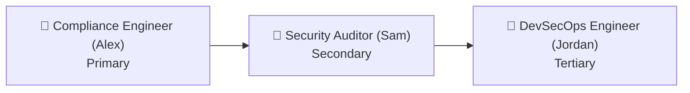
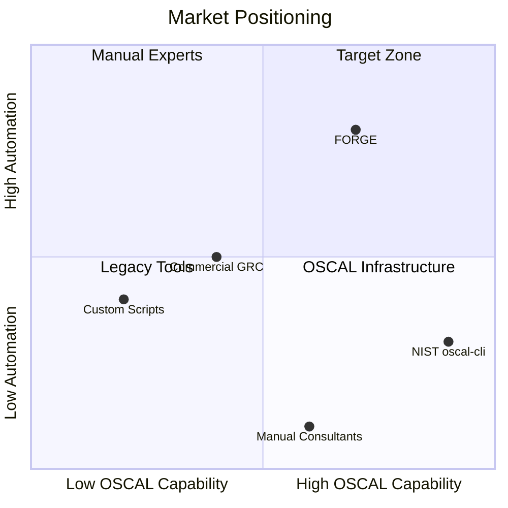
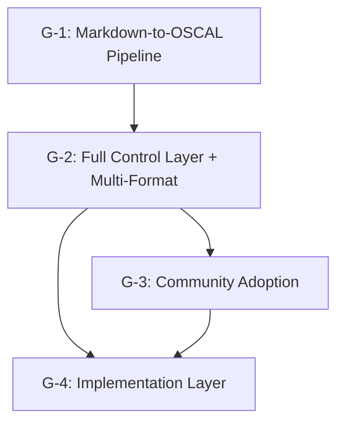
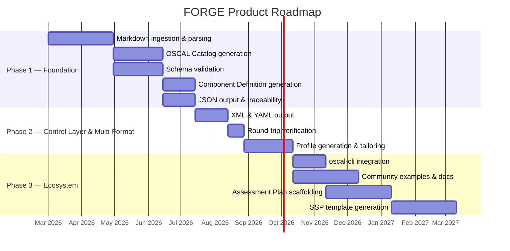

# 001-vision-forge

> **Document Type:** Product Vision Document
> **Audience:** LLM agents, human reviewers, leadership stakeholders
> **Status:** Ready for Review
> **Last Updated:** 2026-02-10 <!-- @auto -->
> **Owner:** Brian Luby <!-- @human-required -->

---

## Review Tier Legend

| Marker | Tier | Speckit Behavior |
|--------|------|------------------|
| :red_circle: `@human-required` | Human Generated | Prompt human to author; blocks until complete |
| :yellow_circle: `@human-review` | LLM + Human Review | LLM drafts → prompt human to confirm/edit; blocks until confirmed |
| :green_circle: `@llm-autonomous` | LLM Autonomous | LLM completes; no prompt; logged for audit |
| :white_circle: `@auto` | Auto-generated | System fills (timestamps, links); no prompt |

---

## Document Completion Order

> :warning: **For LLM Agents:** Complete sections in this order. Do not fill downstream sections until upstream human-required inputs exist.

1. **Vision Statement & Mission** → requires human input first
2. **Target Audience & Personas** → requires human input
3. **Market Context** → LLM can draft, human reviews
4. **Strategic Goals & Product Principles** → requires human input
5. **High-Level Roadmap** → requires human input
6. **Success Metrics** → requires human input
7. **Everything else** → can proceed

---

## Vision Statement :red_circle: `@human-required` — Reviewed by Brian Luby

> Every organization's security policies are machine-readable, auditable, and continuously traceable from human intent to compliance evidence — eliminating the manual translation bottleneck that makes governance slow, error-prone, and disconnected from the systems it governs.

**Time Horizon:** 3 years

---

## Mission Statement :red_circle: `@human-required` — Reviewed by Brian Luby

> FORGE converts security policy documents into validated OSCAL artifacts through a deterministic, auditable pipeline — giving compliance engineers, security teams, and auditors machine-readable policies with full traceability, so organizations can automate governance workflows that currently take weeks of manual effort per document.

---

## Context

### Background :red_circle: `@human-required` — Reviewed by Brian Luby

Security and compliance teams maintain their most critical governance artifacts — security policies — as natural-language documents in PDF, Word, and Markdown formats. These policies define requirements for access control, data protection, incident response, encryption, and more. Yet the entire compliance automation ecosystem downstream (control mapping, system security plans, assessment planning, remediation tracking) depends on these policies being machine-readable.

NIST developed OSCAL (Open Security Controls Assessment Language) as the standard for machine-readable security and compliance data, providing a layered set of interlinked models (Catalog, Profile, Component Definition, SSP, Assessment Plan, Assessment Results, POA&M) that cover the full control lifecycle. Despite OSCAL's maturity (v1.2.0), no automated pipeline exists to convert natural-language policy documents into validated OSCAL artifacts. Organizations either hire specialized consultants to manually transcribe policies into OSCAL, or they skip structured representation entirely and lose the benefits of automation.

This gap is the core opportunity. The shift toward continuous compliance, DevSecOps, and automated audit evidence collection creates strong demand for tooling that bridges the natural-language-to-machine-readable divide. FORGE (Framework for OSCAL Risk & Governance Execution) addresses this as an open-source Rust CLI tool, starting with the most foundational conversion — policy documents to OSCAL Catalogs and Component Definitions — and expanding along the OSCAL model stack over time.

### Glossary :yellow_circle: `@human-review` — Reviewed by Brian Luby

| Term | Definition |
|------|------------|
| OSCAL | Open Security Controls Assessment Language — NIST standard for machine-readable security/compliance data (XML/JSON/YAML) |
| Catalog | OSCAL model representing a structured collection of controls (requirements) |
| Profile | OSCAL model for selecting, organizing, and tailoring controls into a baseline from one or more Catalogs |
| Component Definition | OSCAL model describing how controls are implemented by reusable components, including documentary components (policy/procedure) |
| SSP | System Security Plan — OSCAL model describing control implementations for a specific system |
| Assessment Plan (AP) | OSCAL model describing planned assessment activities and scope |
| Assessment Results (AR) | OSCAL model recording assessment observations, findings, and risks |
| POA&M | Plan of Action and Milestones — OSCAL model tracking remediation of identified issues |
| Profile Resolution | NIST-defined algorithm (import → merge → modify) that produces a resolved catalog from a Profile |
| Documentary Component | An OSCAL component of type "policy", "procedure", or "process" representing non-technical control implementations |
| Back Matter | Consistent OSCAL structure across all models for linked/attached resources (citations, evidence) |
| Metaschema | NIST framework used to produce OSCAL schemas and documentation across XML/JSON/YAML |
| Atomization | The process of splitting compound policy statements into individual, independently addressable requirements |
| Traceability | Bidirectional links between source policy text and generated OSCAL elements |
| GRC | Governance, Risk, and Compliance — the integrated approach to managing organizational governance, risk management, and regulatory compliance |

### Related Documents :white_circle: `@auto`

| Document | Link | Relationship |
|----------|------|--------------|
| OSCAL Research | docs/research/OSCAL_Research.md | Domain research informing product direction |
| PRD: Policy-to-OSCAL | docs/FORGE_PRD.md | Feature-level requirements for core conversion |
| Architecture Plan | docs/architecture_plan.md | Technical architecture |
| CLAUDE.md | CLAUDE.md | Project conventions and build commands |

---

## Target Audience

### Primary Personas :red_circle: `@human-required` — Reviewed by Brian Luby

| Persona | Description | Core Need | Current Alternative |
|---------|-------------|-----------|---------------------|
| Compliance Engineer (Alex) | Mid-level GRC professional responsible for maintaining policy documentation and ensuring it aligns with control frameworks. Works at a mid-to-large organization with 10+ security policies. | Convert policy documents into machine-readable formats without deep OSCAL expertise | Manual transcription into spreadsheets or GRC tool forms; copy-paste into OSCAL templates; hire consultants |
| Security Auditor (Sam) | Internal or external auditor who needs to verify that policies map to implemented controls and that evidence traces back to specific requirements. | Trace policy requirements through the control lifecycle with verifiable, structured data | Manual cross-referencing between policy PDFs and control spreadsheets; custom scripts to parse policy text |
| DevSecOps Engineer (Jordan) | Engineer integrating security controls into CI/CD pipelines. Needs machine-readable policies to automate compliance checks and generate evidence. | Programmatically consume policy requirements in automation pipelines | Writing custom parsers for each policy; maintaining hand-crafted JSON/YAML control mappings |

### Persona Prioritization :red_circle: `@human-required` — Reviewed by Brian Luby

> **Rationale:** Compliance engineers are the primary authors and maintainers of policy documents — they experience the conversion pain most directly and most frequently. Auditors benefit from the structured output but are consumers, not producers. DevSecOps engineers benefit from downstream automation but need the foundational OSCAL artifacts to exist first.

### Anti-Personas :yellow_circle: `@human-review` — Reviewed by Brian Luby

| Anti-Persona | Why Excluded |
|--------------|--------------|
| Non-technical policy authors | FORGE is a CLI tool requiring comfort with terminal workflows; serving non-technical users would require a GUI that dilutes the CLI-first approach |
| GRC platform vendors | Building for vendors would require plugin architectures, multi-tenancy, and API compatibility layers that bloat the core tool |
| Organizations without structured policies | FORGE relies on identifiable document structure (headings, numbered clauses); organizations with purely ad-hoc policy documentation need authoring tools, not conversion tools |

---

## Market Context

### Problem Landscape :red_circle: `@human-required` — Reviewed by Brian Luby

The compliance industry operates on a fundamental disconnect: governance policies are written in natural language while the systems that enforce, audit, and report on those policies require structured, machine-readable data. This disconnect creates a manual translation bottleneck at every stage of the control lifecycle.

Organizations spend weeks per policy document manually converting requirements into structured formats. Each conversion is error-prone — requirements are missed, traceability is lost, and the resulting structured data drifts from the source policy with every revision. When auditors ask "show me how policy requirement 4.3.2 maps to your implemented controls and assessment evidence," the answer requires hours of manual cross-referencing.

NIST's OSCAL standard solves the representation problem — it provides a complete, interlinked model stack for the control lifecycle. But no automated tooling bridges the gap between where policies live (documents) and where OSCAL starts (structured data). This is the gap FORGE fills: a deterministic pipeline that converts the document-based world into the OSCAL-based world with full traceability.

### Competitive Landscape :yellow_circle: `@human-review` — Reviewed by Brian Luby

| Competitor | Strengths | Weaknesses | Our Differentiation |
|------------|-----------|------------|---------------------|
| Manual conversion / consultants | Deep expertise; handles ambiguity | Slow (weeks per document); expensive; not reproducible; no traceability | Automated, deterministic, reproducible with full traceability |
| Commercial GRC platforms (e.g., RegScale, Telos Xacta) | Full lifecycle management; enterprise features | Expensive; vendor lock-in; limited OSCAL support; not open source | Open source; OSCAL-native from day one; CLI-composable; no vendor lock-in |
| NIST oscal-cli | Official NIST tooling; validates and converts OSCAL formats | Does not ingest natural-language documents; operates only on existing OSCAL content | Bridges the gap from documents to OSCAL; complements oscal-cli rather than competing |
| Custom scripts / ad-hoc parsers | Tailored to specific policy formats | Fragile; no OSCAL awareness; no validation; no traceability; high maintenance | General-purpose pipeline with schema validation, stable IDs, and multi-format output |

### Market Positioning Map :yellow_circle: `@human-review` — Reviewed by Brian Luby

### Market Trends & Tailwinds :yellow_circle: `@human-review` — Reviewed by Brian Luby

- **Regulatory pressure for continuous compliance:** Frameworks like FedRAMP, CMMC, and SOC 2 increasingly expect structured, machine-readable evidence — driving demand for OSCAL adoption.
- **OSCAL maturity and ecosystem growth:** OSCAL v1.2.0 is stable, NIST actively maintains tooling, and the community is growing — reducing adoption risk and increasing interoperability demand.
- **DevSecOps and compliance-as-code:** The shift toward automating compliance in CI/CD pipelines requires machine-readable policy inputs — exactly what FORGE produces.
- **Open-source governance tooling momentum:** Organizations are increasingly skeptical of vendor lock-in for compliance tooling; open-source alternatives with strong standards alignment (OSCAL) have a credibility advantage.
- **AI-assisted document processing:** Advances in NLP and document understanding create future opportunity to enhance structural parsing accuracy, expanding the range of policy documents FORGE can handle.

---

## Strategic Goals :red_circle: `@human-required` — Reviewed by Brian Luby

| ID | Goal | Time Horizon | How We Measure It |
|----|------|-------------|-------------------|
| G-1 | Deliver a reliable Markdown-to-OSCAL conversion pipeline with schema validation and traceability | 6 months | 100% schema validation pass rate; >95% extraction accuracy on golden-file test suite |
| G-2 | Support the full OSCAL Control layer (Catalog + Profile) with baseline selection, tailoring, and multi-format output (JSON/XML/YAML) | 9 months | Profile generation working end-to-end; multi-format round-trip verified |
| G-3 | Establish FORGE as the standard open-source policy-to-OSCAL tool | 15 months | 50+ GitHub stars; 5+ organizations actively using FORGE; community contributions |
| G-4 | Extend to OSCAL Implementation layer (Component Definition + SSP templates) | 18 months | Documentary component generation with control-implementation narratives |

### Goal Dependency Map :green_circle: `@llm-autonomous`

---

## Product Principles :red_circle: `@human-required` — Reviewed by Brian Luby

| # | Principle | Implication | What We'd Sacrifice |
|---|-----------|-------------|---------------------|
| P-1 | Correctness over convenience | Every generated OSCAL artifact must pass schema validation; we reject output rather than emit invalid OSCAL | Users may need to fix source documents or manually resolve ambiguities before getting output |
| P-2 | Traceability is non-negotiable | Every OSCAL element traces back to a source policy location; we never generate "orphan" elements | Some optimizations (merging, deduplication) become harder when provenance must be preserved |
| P-3 | Deterministic and auditable | Same input always produces same output; the pipeline is inspectable at every stage | We forego ML/AI-based "smart" conversion in early phases where it would introduce non-determinism |
| P-4 | CLI-first, composable | FORGE is a Unix-philosophy tool that composes with other tools (oscal-cli, jq, CI/CD pipelines) | We delay GUI/web experiences; non-technical users need to wait or use wrappers |
| P-5 | Open source, standards-native | OSCAL compliance is the baseline, not an afterthought; the tool is MIT-licensed and community-driven | We won't build proprietary extensions or vendor-specific integrations in core |

---

## High-Level Roadmap :red_circle: `@human-required` — Reviewed by Brian Luby

### Roadmap Timeline :yellow_circle: `@human-review` — Reviewed by Brian Luby

### Phase Definitions :red_circle: `@human-required` — Reviewed by Brian Luby

| Phase | Theme | Key Outcomes | Target Date | Exit Criteria |
|-------|-------|-------------|-------------|---------------|
| Phase 1 | Foundation | Users can convert Markdown policies to validated OSCAL Catalogs and Component Definitions (JSON) with full traceability | 2026-08-01 | All Must Have requirements (M-1 through M-11) passing; golden-file test suite >95% accuracy; `cargo test` green |
| Phase 2 | Control Layer & Multi-Format | Users can export to XML/YAML; generate Profiles for baseline selection and tailoring; normative/advisory tagging and parameter extraction working | 2026-10-31 | Multi-format round-trip verified; Profile generation with tailoring working; v0.2.0 tagged |
| Phase 3 | Ecosystem | FORGE integrates with NIST oscal-cli for Profile Resolution; generates Assessment Plan scaffolding and SSP templates; community adoption established | 2027-04-01 | oscal-cli integration tested; community examples published; 5+ organizations using FORGE |

### PRD Mapping :green_circle: `@llm-autonomous`

| PRD | Title | Phase | Strategic Goal | Status |
|-----|-------|-------|----------------|--------|
| 001-prd-forge-policy-to-oscal | Policy-to-OSCAL Core Conversion | Phase 1, Phase 2 | G-1, G-2 | Draft |

---

## Assumptions & Risks :yellow_circle: `@human-review` — Reviewed by Brian Luby

### Assumptions

- [A-1] Organizations with security policies want machine-readable representations and are willing to adopt CLI-based tooling (or wrap it in their own automation).
- [A-2] OSCAL v1.2.0 will remain the stable target for at least 12 months; any v1.3.0 changes will be incremental and non-breaking for core models.
- [A-3] Well-structured policy documents (clear headings, numbered clauses, consistent formatting) represent the majority of real-world policies at target organizations.
- [A-4] The NIST OSCAL ecosystem (oscal-cli, schemas, examples) will continue to be maintained and publicly available.
- [A-5] Rust is a sustainable language choice for the target audience (compliance/security engineers are comfortable with pre-built binaries; contributors can work in Rust).

### Risks

| ID | Risk | Likelihood | Impact | Mitigation |
|----|------|------------|--------|------------|
| R-1 | OSCAL adoption remains niche; insufficient market demand for dedicated conversion tooling | Med | High | Open-source model reduces downside; tool value persists even for small user base; monitor OSCAL community growth |
| R-2 | Competing tool emerges with broader OSCAL lifecycle support before FORGE reaches Phase 3 | Low | Med | Focus on conversion pipeline excellence (Markdown → OSCAL) rather than full lifecycle; composability with other tools reduces competition risk |
| R-3 | Policy documents are too varied in structure for deterministic parsing to achieve target accuracy | Med | Med | Start with well-structured Markdown documents; provide user correction mechanisms; users can pre-convert PDF/DOCX with external tools |
| R-4 | Single-maintainer / small team cannot sustain community momentum | Med | Med | MIT license lowers contribution barrier; clear documentation and contribution guidelines from Phase 1 |

---

## Technical Strategy :yellow_circle: `@human-review` — Reviewed by Brian Luby

### Architecture Principles

- **Pipeline architecture:** All conversion follows a deterministic staged pipeline (Ingest → Parse → Normalize → Map → Assemble → Validate → Export) with typed intermediate representations at each stage.
- **OSCAL as output serialization:** The internal domain model (PolicyDocument, PolicyRequirement, etc.) is decoupled from OSCAL serialization, enabling multi-format output and future model evolution without internal rewrites.
- **Validation-first:** No artifact is emitted without passing schema validation against NIST-published OSCAL v1.2.0 schemas.
- **Composability:** FORGE complements the NIST tooling ecosystem (oscal-cli for profile resolution, format conversion, and validation) rather than reimplementing it.

### Key Technical Decisions :red_circle: `@human-required` — Reviewed by Brian Luby

| Decision | Choice | Rationale | Revisit Trigger |
|----------|--------|-----------|-----------------|
| Primary language | Rust | Memory safety for parsing untrusted documents; single-binary distribution; strong type system for OSCAL model correctness | If contributor acquisition becomes critical blocker, consider Python/Go wrapper layer |
| Build system | Cargo | Standard Rust toolchain; well-supported ecosystem | N/A (follows language choice) |
| OSCAL version target | v1.2.0 | Latest stable OSCAL release with comprehensive model support | When NIST publishes v1.3.0 and ecosystem tools migrate |
| Identifier strategy | UUID v5 (deterministic, namespace + content hash) | Ensures reproducible output and meaningful diffs across re-conversions | If collision risk materializes at scale (unlikely) |
| Profile Resolution | Delegate to NIST oscal-cli | Building a conformant resolver is a major effort; NIST tooling already supports it | If offline-only requirement eliminates oscal-cli dependency |
| CLI framework | clap | Industry standard Rust CLI framework; derive macro for ergonomic interface definition | N/A (well-established choice) |

### Scale Targets :yellow_circle: `@human-review` — Reviewed by Brian Luby

| Milestone | Users | Throughput | Data Volume | Timeline |
|-----------|-------|------------|-------------|----------|
| Phase 1 (Foundation) | 10-50 early adopters | Single document conversion <30s | Individual policy documents (1-100 pages) | 2026-08-01 |
| Phase 2 (Control Layer & Multi-Format) | 50-200 users | Batch conversion of 10+ documents | Policy libraries (10-50 documents) | 2026-10-31 |
| Phase 3 (Ecosystem) | 200-1000+ users | CI/CD pipeline integration | Organizational policy catalogs with cross-references | 2027-04-01 |

---

## Constraints & Boundaries :yellow_circle: `@human-review` — Reviewed by Brian Luby

### Business Constraints

- **Budget:** Open-source project; infrastructure costs limited to CI/CD (GitHub Actions) and documentation hosting.
- **Team:** Small core team; must design for contributor-friendliness from Phase 1.
- **Timeline:** Phase 1 must deliver usable Markdown-to-OSCAL conversion to establish credibility and attract early adopters.

### Regulatory & Compliance

- FORGE processes potentially sensitive policy documents; the tool itself does not store or transmit data, but users must be warned about handling sensitive content.
- Generated OSCAL artifacts may contain sensitive operational details; documentation should include guidance on secure handling.

### Platform & Integration Constraints

- Must run on Linux, macOS, and Windows (Rust cross-compilation).
- No runtime dependencies beyond the compiled binary for core functionality.
- Optional dependency on NIST oscal-cli for Profile Resolution and round-trip validation.
- Core conversion pipeline must work fully offline; network access only for optional schema/tool downloads.

---

## Success Metrics :red_circle: `@human-required` — Reviewed by Brian Luby

### North Star Metric

| Metric | Definition | Current Baseline | 6-Month Target | 18-Month Target |
|--------|-----------|-----------------|----------------|-----------------|
| Policy documents successfully converted to valid OSCAL | Number of unique policy documents converted to schema-valid OSCAL artifacts by FORGE users (self-reported + CI telemetry opt-in) | 0 | 50 documents across 5+ organizations | 500+ documents across 20+ organizations |

### Supporting Metrics

| Category | Metric | Baseline | Target | Measurement Method |
|----------|--------|----------|--------|-------------------|
| Adoption | GitHub stars | 0 | 50 (6mo) / 200 (18mo) | GitHub API |
| Adoption | Monthly unique clones | 0 | 100 (6mo) / 500 (18mo) | GitHub traffic |
| Quality | Schema validation pass rate | N/A | 100% | Automated test suite |
| Quality | Extraction accuracy (Markdown) | N/A | >95% | Golden-file regression tests |
| Engagement | Community issues and PRs | 0 | 10 issues / 3 PRs (6mo) | GitHub API |
| Satisfaction | User feedback (GitHub discussions, issues) | N/A | Net positive sentiment | Manual review |

### Metrics Anti-Targets :yellow_circle: `@human-review` — Reviewed by Brian Luby

| Anti-Metric | Why We Avoid Optimizing It |
|-------------|---------------------------|
| Total downloads without conversion success | Vanity metric — downloads without successful conversions indicate tooling friction, not value delivery |
| Number of OSCAL output formats supported | Format breadth without quality is harmful; JSON must be excellent before adding XML/YAML |
| Speed of conversion at the expense of validation | Skipping validation to improve speed undermines the core value proposition of correctness |

---

## Definition of Ready :red_circle: `@human-required` — Reviewed by Brian Luby

### Readiness Checklist

- [x] Vision statement reviewed and endorsed by leadership
- [x] Target personas validated (via research, interviews, or data)
- [x] Strategic goals are measurable and time-bounded
- [x] Product principles are opinionated and actionable
- [x] Phase 1 scope is defined and achievable with available resources
- [x] North star metric is agreed upon
- [x] Key technical decisions are made (or spikes are planned)
- [ ] No open questions blocking Phase 1 PRD creation

### Sign-off

| Role | Name | Date | Decision |
|------|------|------|----------|
| Product Owner | Brian Luby | 2026-02-10 | Ready |
| Engineering Lead | Brian Luby | 2026-02-10 | Ready |

---

## Changelog :white_circle: `@auto`

| Version | Date | Author | Changes |
|---------|------|--------|---------|
| 0.1 | 2026-02-10 | LLM (Claude) | Initial draft from OSCAL research and PRD |
| 0.2 | 2026-02-10 | Brian Luby | Reviewed all sections; marked Ready for Review |
| 0.3 | 2026-02-10 | Brian Luby | Constrained to Markdown-only input; removed PDF/DOCX ingestion from scope; renumbered strategic goals G-2→G-4; compressed timeline by ~2 months |

---

## Decision Log :yellow_circle: `@human-review` — Reviewed by Brian Luby

| Date | Decision | Rationale | Alternatives Considered |
|------|----------|-----------|------------------------|
| 2026-02-10 | Target OSCAL v1.2.0 as baseline | Latest stable release with comprehensive model support and active NIST tooling | v1.1.x (outdated); wait for v1.3.0 (uncertain timeline) |
| 2026-02-10 | Rust as primary language | Memory safety for untrusted document parsing; single-binary distribution; strong type system for OSCAL model correctness | Python (faster iteration but weaker safety guarantees); Go (simpler but less expressive type system) |
| 2026-02-10 | CLI-first, no GUI in initial phases | Composability with existing toolchains (CI/CD, oscal-cli, scripts); faster development cycle; serves primary persona | Web UI (broader audience but higher development cost and slower iteration) |
| 2026-02-10 | Open source (MIT license) | Builds trust in compliance/security community; lowers contribution barrier; aligns with OSCAL's open ecosystem | Proprietary (limits adoption and trust); copyleft (may deter enterprise contributors) |
| 2026-02-10 | Support both catalog-first and component-first conversion strategies | Organizations vary: some treat policies as authoritative requirements, others map to external frameworks | Single strategy (too limiting for diverse user needs) |
| 2026-02-10 | Constrain to Markdown-only input; no PDF/DOCX ingestion | Mature external converters (pandoc, markitdown, etc.) handle PDF/DOCX→Markdown; building ingestion for binary formats adds high complexity and risk with marginal value | Build PDF/DOCX ingestion in-house (high risk, high effort, lower accuracy than specialized tools) |

---

## Open Questions :yellow_circle: `@human-review` — Reviewed by Brian Luby

- [ ] **Q1:** What is the initial target compliance framework for examples and testing — NIST SP 800-53, a simplified internal policy set, or both?
- [ ] **Q2:** Should FORGE eventually support bidirectional conversion (OSCAL back to human-readable policy documents)?
- [ ] **Q3:** What level of community governance is appropriate — BDFL, steering committee, or foundation model?
- [ ] **Q4:** Should we pursue FedRAMP or CMMC community partnerships for early adoption and validation?
- [ ] **Q5:** Is there demand for a hosted/SaaS version of FORGE, and if so, at what phase should that be explored?

---

## Review Checklist :green_circle: `@llm-autonomous`

Before marking as Approved:

- [x] Vision statement is a single, clear sentence
- [x] Mission statement answers what, for whom, and why
- [x] All personas have a core need and current alternative defined
- [x] Persona prioritization is explicit with rationale
- [x] Strategic goals have unique IDs (G-1, G-2, etc.)
- [x] Product principles are opinionated (opposite is also a valid strategy)
- [x] Roadmap phases have exit criteria
- [x] North star metric has a precise definition
- [x] Glossary terms are used consistently throughout
- [x] No open questions blocking Phase 1 PRD creation
- [x] Definition of Ready checklist is complete
