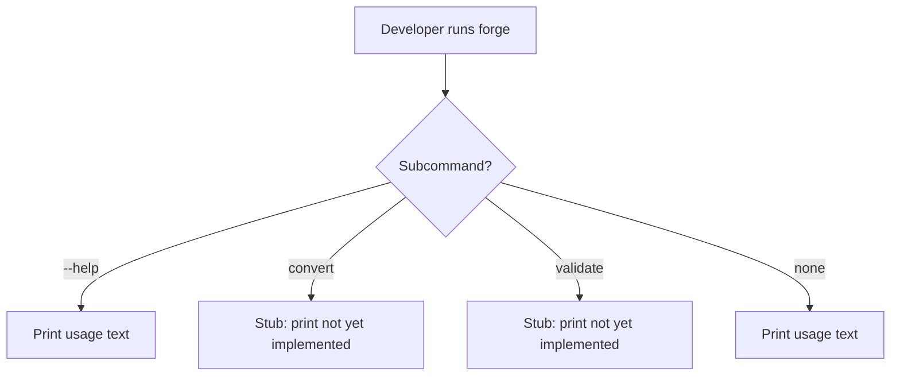
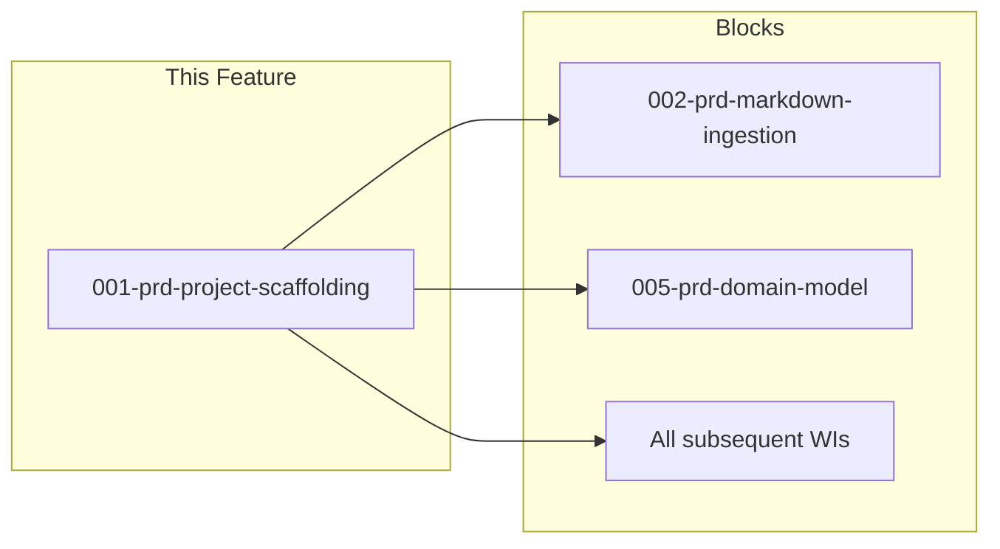

# 001-prd-project-scaffolding

> **Document Type:** Product Requirements Document
> **Audience:** LLM agents, human reviewers
> **Status:** Draft
> **Last Updated:** 2026-02-10 <!-- @auto -->
> **Owner:** Brian Luby <!-- @human-required -->

**Feature Branch**: `001-project-scaffolding`
**Created**: 2026-02-10
**Status**: Draft
**Input**: Derived from FORGE Product Roadmap WI-1

---

## Review Tier Legend

| Marker | Tier | Speckit Behavior |
|--------|------|------------------|
| 🔴 `@human-required` | Human Generated | Prompt human to author; blocks until complete |
| 🟡 `@human-review` | LLM + Human Review | LLM drafts → prompt human to confirm/edit; blocks until confirmed |
| 🟢 `@llm-autonomous` | LLM Autonomous | LLM completes; no prompt; logged for audit |
| ⚪ `@auto` | Auto-generated | System fills (timestamps, links); no prompt |

---

## Document Completion Order

> ⚠️ **For LLM Agents:** Complete sections in this order. Do not fill downstream sections until upstream human-required inputs exist.

1. **Context** (Background, Scope) → requires human input first
2. **Problem Statement & User Scenarios** → requires human input
3. **Requirements** (Must/Should/Could/Won't) → requires human input
4. **Technical Constraints** → human review
5. **Diagrams, Data Model, Interface** → LLM can draft after above exist
6. **Acceptance Criteria** → derived from requirements
7. **Everything else** → can proceed

---

## Context

### Background 🔴 `@human-required`
This PRD covers **WI-1: Project Scaffolding** from the FORGE Product Roadmap (Sprint S-1, Mar 3–7 2026, Theme T-1: Core Pipeline, Milestone MS-1). Before any policy-to-OSCAL conversion work can begin, the project needs a properly structured Rust codebase with a CLI entry point, well-organized module hierarchy, standardized error types, and a CI pipeline enforcing quality gates. This work item establishes the foundation that all subsequent work items build upon.

### Scope Boundaries 🟡 `@human-review`

**In Scope:**
- Setting up a `clap`-based CLI with `convert` and `validate` subcommand stubs
- Establishing the module structure: `cli/`, `ingest/`, `parse/`, `model/`, `oscal/`, `validate/`, `export/`
- Defining error types using `thiserror`
- Configuring CI pipeline: `cargo fmt --check`, `cargo clippy -- -D warnings`, `cargo test`
- Ensuring `forge --help` prints usage information

**Out of Scope:**
- Actual file ingestion or parsing logic — deferred to WI-2 (002-prd-markdown-ingestion)
- Domain model struct definitions — deferred to WI-5 (005-prd-domain-model)
- Any OSCAL generation or validation logic — deferred to later work items
- Markdown parsing crate evaluation — deferred to WI-2 spike task

### Glossary 🟡 `@human-review`

| Term | Definition |
|------|------------|
| CLI | Command-Line Interface — the primary user interaction model for FORGE |
| clap | Rust crate for parsing command-line arguments and generating help text |
| thiserror | Rust crate for deriving structured, composable error types |
| CI | Continuous Integration — automated build, lint, and test pipeline |
| Module | A Rust source file or directory representing a logical code unit |

### Related Documents ⚪ `@auto`

| Document | Link | Relationship |
|----------|------|--------------|
| Parent PRD | docs/FORGE_PRD.md | Parent requirements (this WI enables all M-requirements) |
| Product Roadmap | docs/FORGE_PRODUCT_ROADMAP.md | Sprint S-1 context |
| Product Vision | docs/FORGE_PRODUCT_VISION.md | Strategic goal G-1 |
| Constitution | .specify/memory/constitution.md | Technical constraints and quality gates |

---

## Problem Statement 🔴 `@human-required`

No project structure exists yet. There is no CLI entry point, no module hierarchy, no standardized error handling, and no CI pipeline. Every subsequent work item (WI-2 through WI-50) depends on having a compilable, well-structured Rust project with an established CLI framework and quality enforcement. Without this scaffolding, downstream development cannot begin and there is no mechanism to enforce code quality standards from the start.

---

## User Scenarios & Testing 🔴 `@human-required`

### User Story 1 — Run FORGE CLI (Priority: P1)

A developer or user runs the FORGE CLI for the first time and sees available commands and usage information.

> As a developer working on FORGE, I want a properly structured CLI entry point so that I can begin implementing conversion and validation features within a consistent project layout.

**Why this priority**: This is the absolute foundation — nothing else can be built without a project that compiles and runs.

**Independent Test**: Run `forge --help` and verify it prints usage information with `convert` and `validate` subcommands listed.

**Acceptance Scenarios**:
1. **Given** a freshly built FORGE binary, **When** running `forge --help`, **Then** usage text is printed showing `convert` and `validate` subcommands with descriptions.
2. **Given** the FORGE binary, **When** running `forge convert` without arguments, **Then** a helpful error message is displayed indicating required arguments.

---

### User Story 2 — CI Quality Gates (Priority: P1)

A developer pushes code and the CI pipeline validates formatting, linting, and tests.

> As a developer working on FORGE, I want CI quality gates in place from day one so that code quality standards are enforced automatically and consistently.

**Why this priority**: The constitution mandates quality gates (formatting, linting, testing) as non-negotiable. Establishing them in the first sprint prevents technical debt accumulation.

**Independent Test**: Run `cargo fmt --check && cargo clippy -- -D warnings && cargo test` and verify all pass with zero warnings.

**Acceptance Scenarios**:
1. **Given** the project source code, **When** running `cargo fmt --check`, **Then** no formatting violations are reported.
2. **Given** the project source code, **When** running `cargo clippy -- -D warnings`, **Then** no clippy warnings or errors are reported.
3. **Given** the project with initial tests, **When** running `cargo test`, **Then** all tests pass.

---

### User Story 3 — Structured Error Types (Priority: P2)

A developer needs to handle errors consistently across the codebase using typed error variants.

> As a developer working on FORGE, I want standardized error types using `thiserror` so that error handling is consistent, composable, and produces descriptive messages for users.

**Why this priority**: Error types are referenced by all downstream modules. Defining them early ensures a consistent error handling pattern.

**Independent Test**: Verify that the error type module compiles and that error variants produce meaningful display messages.

**Acceptance Scenarios**:
1. **Given** the error type definitions, **When** formatting an error variant for display, **Then** a descriptive, user-facing message is produced.
2. **Given** the error types, **When** used in a function return type, **Then** the error propagates correctly using the `?` operator.

---

## Assumptions & Risks 🟡 `@human-review`

### Assumptions
- [A-1] Rust stable toolchain is available and targets the latest stable release.
- [A-2] The project will use a single-crate structure initially; workspace expansion happens as needed per constitution principle I (Crate-First Architecture).
- [A-3] CI will run on GitHub Actions (or equivalent) with Rust toolchain pre-installed.

### Risks
| ID | Risk | Likelihood | Impact | Mitigation |
|----|------|------------|--------|------------|
| R-1 | Module structure proves inadequate as features are added | Low | Low | Module boundaries are logical, not physical constraints; can be refactored. Follow constitution principle X (Simplicity). |

---

## Feature Overview

### Flow Diagram 🟡 `@human-review`



### State Diagram (if applicable) 🟡 `@human-review`
N/A — No state transitions in this work item.

---

## Requirements

### Must Have (M) — MVP, launch blockers 🔴 `@human-required`
- [ ] **M-1:** The project shall compile successfully with `cargo build` producing a `forge` binary.
- [ ] **M-2:** The CLI shall use `clap` (v4.x) with `convert` and `validate` subcommand definitions.
- [ ] **M-3:** Running `forge --help` shall print usage text listing available subcommands and global options.
- [ ] **M-4:** The module structure shall include the following top-level modules: `cli`, `ingest`, `parse`, `model`, `oscal`, `validate`, `export`.
- [ ] **M-5:** Error types shall be defined using `thiserror` with at least variants for I/O errors, parse errors, and validation errors.
- [ ] **M-6:** The CI pipeline shall enforce `cargo fmt --check`, `cargo clippy -- -D warnings`, and `cargo test` with all checks passing.

### Should Have (S) — High value, not blocking 🔴 `@human-required`
- [ ] **S-1:** The CLI shall include `--verbose` and `--quiet` global flags for controlling output verbosity.
- [ ] **S-2:** The `convert` subcommand stub shall define placeholder arguments for `<input>`, `--strategy`, `--format`, and `--output` to establish the interface early.

### Could Have (C) — Nice to have, if time permits 🟡 `@human-review`
- [ ] **C-1:** A basic `--version` flag displaying the crate version from `Cargo.toml`.

### Won't Have (W) — Explicitly deferred 🟡 `@human-review`
- [ ] **W-1:** Actual file reading or parsing logic — *Reason: Deferred to WI-2 and WI-3/WI-4*
- [ ] **W-2:** OSCAL generation or validation logic — *Reason: Deferred to WI-9+ and WI-19+*
- [ ] **W-3:** Workspace or multi-crate setup — *Reason: Start with single crate; expand per constitution principle I when needed*

---

## Technical Constraints 🟡 `@human-review`

- **Language/Framework:** Rust (latest stable), Cargo build system
- **CLI Framework:** clap 4.x (per constitution technology stack)
- **Error Handling:** `thiserror` for library error types (per constitution principle VIII)
- **Linting:** `cargo clippy -- -D warnings` must pass (per constitution quality gates)
- **Formatting:** `cargo fmt --all` must produce no changes (per constitution quality gates)
- **Testing:** `cargo test` must pass; TDD is mandatory per constitution principle IV
- **Dependencies:** All dependencies at latest stable versions per constitution principle XI

---

## Data Model (if applicable) 🟡 `@human-review`

N/A — No data model introduced in this work item. Domain model structs are defined in WI-5 (005-prd-domain-model).

---

## Interface Contract (if applicable) 🟡 `@human-review`

```rust
// CLI Interface (scaffolding)

// forge --help
// forge convert <input> --strategy <catalog|component> --format <json|xml|yaml> [--output <path>]
// forge validate <artifact-path>

// Error types (initial)
enum ForgeError {
    Io(std::io::Error),          // File system errors
    Parse(String),               // Parsing/extraction errors
    Validation(String),          // OSCAL validation errors
    Config(String),              // Configuration/argument errors
}
```

---

## Evaluation Criteria 🟡 `@human-review`

| Criterion | Weight | Metric | Target | Notes |
|-----------|--------|--------|--------|-------|
| Compilation | Critical | `cargo build` succeeds | Zero errors | Foundation for all work |
| CLI Help | Critical | `forge --help` output | Displays convert and validate subcommands | User-facing entry point |
| CI Green | Critical | All quality gates pass | Zero warnings | Enforces standards from day one |

---

## Tool/Approach Candidates 🟡 `@human-review`

| Option | License | Pros | Cons | Spike Result |
|--------|---------|------|------|--------------|
| clap 4.x (derive) | MIT/Apache-2.0 | Industry standard, derive macros reduce boilerplate | Compile time cost | Selected per constitution |
| thiserror | MIT/Apache-2.0 | Standard for library error types, derives Display/Error | None significant | Selected per constitution |

### Selected Approach 🔴 `@human-required`
> **Decision:** clap 4.x with derive macros for CLI; thiserror for error types
> **Rationale:** Both are specified in the project constitution technology stack and are industry-standard choices for Rust CLI applications.

---

## Acceptance Criteria 🟡 `@human-review`

| AC ID | Requirement | User Story | Given | When | Then |
|-------|-------------|------------|-------|------|------|
| AC-1 | M-1 | US-1 | Source code in repository | Running `cargo build` | Binary compiles with zero errors |
| AC-2 | M-2, M-3 | US-1 | Built `forge` binary | Running `forge --help` | Usage text shows `convert` and `validate` subcommands |
| AC-3 | M-4 | US-1 | Project source tree | Inspecting `src/` directory | Modules `cli`, `ingest`, `parse`, `model`, `oscal`, `validate`, `export` exist |
| AC-4 | M-5 | US-3 | Error type module | Compiling and using error variants | Errors propagate with `?` and display descriptive messages |
| AC-5 | M-6 | US-2 | Project source code | Running `cargo fmt --check && cargo clippy -- -D warnings && cargo test` | All checks pass with zero violations |

### Edge Cases 🟢 `@llm-autonomous`
- [ ] **EC-1:** (M-2) When running `forge` with no subcommand, then help text is displayed (not a panic or empty output).
- [ ] **EC-2:** (M-2) When running `forge convert` with no arguments, then a descriptive error indicates required arguments.
- [ ] **EC-3:** (M-2) When running `forge unknown-command`, then a descriptive error lists available subcommands.

---

## Dependencies 🟡 `@human-review`



- **Requires:** None (this is the first work item)
- **Blocks:** 002-prd-markdown-ingestion, 005-prd-domain-model, and all subsequent WIs
- **External:** Rust stable toolchain, GitHub Actions (or CI equivalent)

---

## Security Considerations 🟡 `@human-review`

| Aspect | Assessment | Notes |
|--------|------------|-------|
| Internet Exposure | No | CLI tool, no network services |
| Sensitive Data | No | Scaffolding only; no data processing |
| Authentication Required | No | Local CLI tool |
| Security Review Required | N/A | No attack surface in scaffolding; security-relevant work begins in WI-2 (input parsing) |

---

## Implementation Guidance 🟢 `@llm-autonomous`

### Suggested Approach
Start with `cargo init` or manual `Cargo.toml` setup. Use clap's derive macros to define the CLI struct hierarchy. Create module files (`mod.rs` or named files) for each top-level module, each exporting a minimal public API. Define a `ForgeError` enum with `thiserror` derives, covering the error categories needed by downstream modules. Write initial unit tests verifying CLI argument parsing and error type Display implementations.

### Anti-patterns to Avoid
- Over-engineering the module structure with deep nesting before features exist
- Adding dependencies beyond clap and thiserror at this stage
- Creating empty trait definitions "for future use" — defer until WI-5+ when contracts are needed
- Skipping CI setup — quality gates must be in place from sprint 1

### Reference Examples
- clap derive examples: https://docs.rs/clap/latest/clap/_derive/index.html
- thiserror examples: https://docs.rs/thiserror/latest/thiserror/

---

## Spike Tasks 🟡 `@human-review`

N/A — No spike tasks for this work item. Spike tasks begin in WI-2 (Markdown parser evaluation).

---

## Success Metrics 🔴 `@human-required`

| Metric | Baseline | Target | Measurement Method |
|--------|----------|--------|-------------------|
| Project compiles | N/A | Zero errors | `cargo build` |
| CLI prints help | N/A | Subcommands listed | Manual verification |
| CI passes | N/A | All gates green | CI pipeline run |

### Technical Verification 🟢 `@llm-autonomous`
| Metric | Target | Verification Method |
|--------|--------|---------------------|
| Test coverage for scaffolding | >80% | `cargo test` + coverage tool |
| No clippy warnings | 0 | `cargo clippy -- -D warnings` |
| No formatting violations | 0 | `cargo fmt --check` |

---

## Definition of Ready 🔴 `@human-required`

### Readiness Checklist
- [x] Problem statement reviewed and validated by stakeholder
- [x] All Must Have requirements have acceptance criteria
- [x] Technical constraints are explicit and agreed
- [x] Dependencies identified and owners confirmed
- [x] Security review completed (or N/A documented with justification)
- [x] No open questions blocking implementation

### Sign-off
| Role | Name | Date | Decision |
|------|------|------|----------|
| Product Owner | Brian Luby | YYYY-MM-DD | [Ready / Not Ready] |

---

## Changelog ⚪ `@auto`

| Version | Date | Author | Changes |
|---------|------|--------|---------|
| 0.1 | 2026-02-10 | LLM (Claude) | Initial draft derived from FORGE Product Roadmap WI-1 |

---

## Decision Log 🟡 `@human-review`

| Date | Decision | Rationale | Alternatives Considered |
|------|----------|-----------|------------------------|
| 2026-02-10 | Use clap derive macros over builder pattern | Derive macros reduce boilerplate, are type-safe, and align with constitution tech stack | Builder pattern (more verbose, less type-safe) |
| 2026-02-10 | Define module stubs for all pipeline stages upfront | Establishes architecture early, making it clear where future WIs add code | Add modules incrementally (risks ad-hoc structure) |

---

## Open Questions 🟡 `@human-review`

No open questions for this work item.

---

## Review Checklist 🟢 `@llm-autonomous`

Before marking as Approved:
- [x] All requirements have unique IDs (M-1 through M-6, S-1 through S-2, C-1, W-1 through W-3)
- [x] All Must Have requirements have linked acceptance criteria
- [x] User stories are prioritized and independently testable
- [x] Acceptance criteria reference both requirement IDs and user stories
- [x] Glossary terms are used consistently throughout
- [x] Diagrams use terminology from Glossary
- [x] Security considerations documented (N/A justified)
- [x] Definition of Ready checklist is complete
- [x] No open questions blocking implementation
