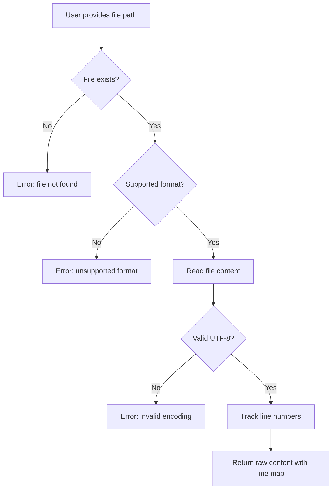
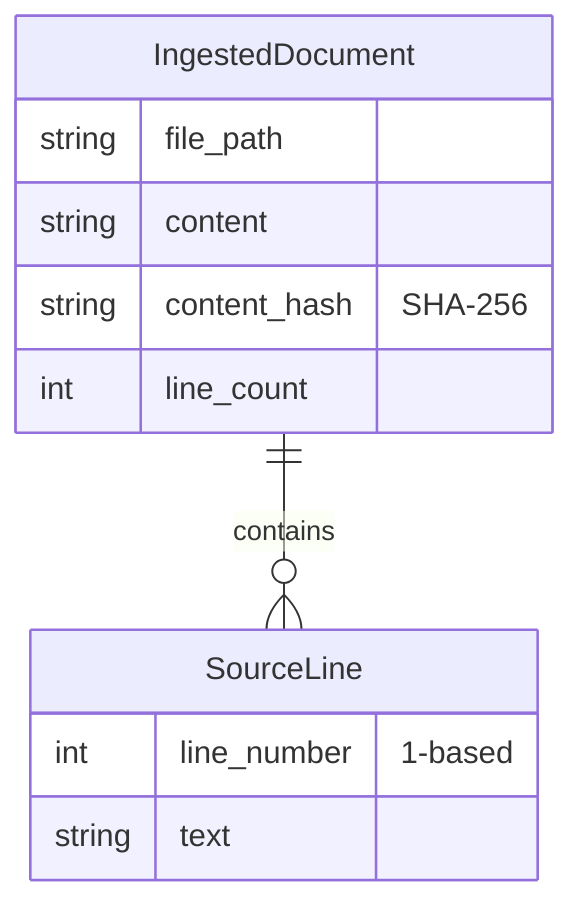
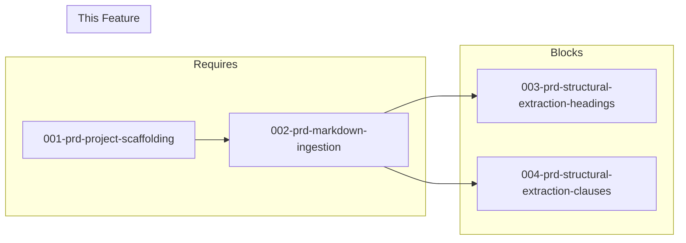

# 002-prd-markdown-ingestion

> **Document Type:** Product Requirements Document
> **Audience:** LLM agents, human reviewers
> **Status:** Draft
> **Last Updated:** 2026-02-10 <!-- @auto -->
> **Owner:** Brian Luby <!-- @human-required -->

**Feature Branch**: `002-markdown-ingestion`
**Created**: 2026-02-10
**Status**: Draft
**Input**: Derived from FORGE Product Roadmap WI-2

---

## Review Tier Legend

| Marker | Tier | Speckit Behavior |
|--------|------|------------------|
| 🔴 `@human-required` | Human Generated | Prompt human to author; blocks until complete |
| 🟡 `@human-review` | LLM + Human Review | LLM drafts → prompt human to confirm/edit; blocks until confirmed |
| 🟢 `@llm-autonomous` | LLM Autonomous | LLM completes; no prompt; logged for audit |
| ⚪ `@auto` | Auto-generated | System fills (timestamps, links); no prompt |

---

## Document Completion Order

> ⚠️ **For LLM Agents:** Complete sections in this order. Do not fill downstream sections until upstream human-required inputs exist.

1. **Context** (Background, Scope) → requires human input first
2. **Problem Statement & User Scenarios** → requires human input
3. **Requirements** (Must/Should/Could/Won't) → requires human input
4. **Technical Constraints** → human review
5. **Diagrams, Data Model, Interface** → LLM can draft after above exist
6. **Acceptance Criteria** → derived from requirements
7. **Everything else** → can proceed

---

## Context

### Background 🔴 `@human-required`
This PRD covers **WI-2: Markdown Ingestion** from the FORGE Product Roadmap (Sprint S-2, Mar 10–14 2026, Theme T-1: Core Pipeline, Milestone MS-1). The conversion pipeline begins with reading policy documents from the filesystem. This work item implements file reading with format detection, establishing the ingestion layer that feeds into structural extraction (WI-3, WI-4) and ultimately the domain model (WI-5). Per ADR-001 (Markdown-only input), FORGE accepts only Markdown files; users pre-convert PDF/DOCX using external tools like pandoc or markitdown.

### Scope Boundaries 🟡 `@human-review`

**In Scope:**
- File reading from a given filesystem path
- Format detection by file extension (`.md`, `.markdown`)
- Reading Markdown files into raw text with line number tracking
- Evaluating `pulldown-cmark` vs `comrak` for Markdown parsing (spike)
- Basic output of raw structure to stdout for verification

**Out of Scope:**
- Structural extraction of headings/sections — deferred to WI-3 (003-prd-structural-extraction-headings)
- Clause/table extraction — deferred to WI-4 (004-prd-structural-extraction-clauses)
- PDF or DOCX ingestion — excluded per ADR-001 (Markdown-only input)
- Domain model construction — deferred to WI-5 (005-prd-domain-model)

### Glossary 🟡 `@human-review`

| Term | Definition |
|------|------------|
| Ingestion | The process of reading a source document from the filesystem into memory for processing |
| Format Detection | Determining the input file type based on file extension |
| Line Tracking | Preserving the mapping between content and its original line number in the source file |
| pulldown-cmark | A Rust crate implementing a CommonMark-compliant Markdown parser |
| comrak | A Rust crate implementing a GitHub Flavored Markdown (GFM) parser |

### Related Documents ⚪ `@auto`

| Document | Link | Relationship |
|----------|------|--------------|
| Parent PRD | docs/FORGE_PRD.md | Parent requirement M-1 |
| Product Roadmap | docs/FORGE_PRODUCT_ROADMAP.md | Sprint S-2 context |
| Product Vision | docs/FORGE_PRODUCT_VISION.md | Strategic goal G-1 |
| Constitution | .specify/memory/constitution.md | Technical constraints, ADR-001 |
| Depends On | docs/PRD/001-prd-project-scaffolding.md | Project structure and error types |

---

## Problem Statement 🔴 `@human-required`

The conversion pipeline cannot begin without the ability to read Markdown files from the filesystem. Currently, FORGE has a CLI skeleton (from WI-1) but no capability to ingest documents. Compliance engineers need to point FORGE at a policy document and have it read and prepare the content for downstream structural extraction. Without this work item, the entire pipeline is blocked — no file can enter the system for conversion to OSCAL.

---

## User Scenarios & Testing 🔴 `@human-required`

### User Story 1 — Read a Markdown Policy File (Priority: P1)

A compliance engineer provides a Markdown policy file path and FORGE reads it into memory with line tracking.

> As a compliance engineer, I want to provide a Markdown policy file to FORGE so that it can be processed through the conversion pipeline.

**Why this priority**: This is the entry point to the entire pipeline. No conversion is possible without file ingestion.

**Independent Test**: Run `forge convert policy.md` and verify the file is read and raw structure is printed to stdout.

**Acceptance Scenarios**:
1. **Given** a valid Markdown file at `policy.md`, **When** running `forge convert policy.md`, **Then** the file content is read and raw structure is output to stdout.
2. **Given** a Markdown file with 100 lines, **When** ingested, **Then** each line is tracked with its original line number for downstream traceability.

---

### User Story 2 — Reject Unsupported Formats (Priority: P1)

A user accidentally provides a non-Markdown file and receives a clear error message.

> As a compliance engineer, I want clear feedback when I provide an unsupported file format so that I know to pre-convert my document to Markdown.

**Why this priority**: Per ADR-001, only Markdown is supported. Clear error messages prevent confusion and guide users to the correct workflow.

**Independent Test**: Run `forge convert policy.pdf` and verify a descriptive error is returned.

**Acceptance Scenarios**:
1. **Given** a file with a `.pdf` extension, **When** running `forge convert policy.pdf`, **Then** the CLI exits with an error message indicating only Markdown files are supported, suggesting external conversion tools.
2. **Given** a file with a `.docx` extension, **When** running `forge convert policy.docx`, **Then** the CLI exits with a similar descriptive error.

---

## Assumptions & Risks 🟡 `@human-review`

### Assumptions
- [A-1] Input files are UTF-8 encoded Markdown.
- [A-2] File sizes are reasonable for in-memory processing (policy documents are typically under 1MB).
- [A-3] The Markdown parsing crate selected in the spike (pulldown-cmark per roadmap Q2 answer) will be used in downstream WIs.

### Risks
| ID | Risk | Likelihood | Impact | Mitigation |
|----|------|------------|--------|------------|
| R-1 | Non-UTF-8 files cause unexpected behavior | Low | Med | Validate UTF-8 encoding on read; return descriptive error for non-UTF-8 files |
| R-2 | Very large files (>10MB) cause memory issues | Low | Low | Document size limits; stream-based reading can be added later if needed |

---

## Feature Overview

### Flow Diagram 🟡 `@human-review`



### State Diagram (if applicable) 🟡 `@human-review`
N/A — Simple read operation, no state transitions.

---

## Requirements

### Must Have (M) — MVP, launch blockers 🔴 `@human-required`
- [ ] **M-1:** The CLI shall read a Markdown file from a given filesystem path and return its content as a string. *(Traces to: Parent PRD M-1)*
- [ ] **M-2:** The CLI shall detect input format by file extension (`.md`, `.markdown`) and reject unsupported formats with a descriptive error. *(Traces to: Parent PRD M-1)*
- [ ] **M-3:** The ingestion layer shall preserve line number tracking, mapping each line of content to its original 1-based line number in the source file. *(Traces to: Parent PRD M-10)*
- [ ] **M-4:** The CLI shall return a non-zero exit code and descriptive error message when the input file does not exist or is unreadable. *(Traces to: Parent PRD M-1)*

### Should Have (S) — High value, not blocking 🔴 `@human-required`
- [ ] **S-1:** The ingestion layer shall validate that the input file is valid UTF-8 and return a descriptive error for non-UTF-8 files.
- [ ] **S-2:** The ingestion layer shall record the source file path and a SHA-256 hash of the content for downstream traceability and caching.

### Could Have (C) — Nice to have, if time permits 🟡 `@human-review`
- [ ] **C-1:** The error message for unsupported formats could suggest specific external conversion tools (e.g., pandoc, markitdown) for PDF and DOCX files.

### Won't Have (W) — Explicitly deferred 🟡 `@human-review`
- [ ] **W-1:** PDF ingestion — *Reason: Excluded per ADR-001; users should use external converters*
- [ ] **W-2:** DOCX ingestion — *Reason: Excluded per ADR-001; users should use external converters*
- [ ] **W-3:** Structural parsing of Markdown content — *Reason: Deferred to WI-3 and WI-4*

---

## Technical Constraints 🟡 `@human-review`

- **Language/Framework:** Rust (latest stable), Cargo build system
- **Markdown Parser:** `pulldown-cmark` selected per roadmap open question Q2 answer
- **Error Handling:** `thiserror` for error types (per constitution principle VIII); ingestion errors must be variants of the project error enum
- **Testing:** TDD mandatory per constitution principle IV; tests must cover happy path and all error conditions
- **Dependencies:** All at latest stable versions per constitution principle XI
- **Input Constraint:** Markdown only per ADR-001

---

## Data Model (if applicable) 🟡 `@human-review`



---

## Interface Contract (if applicable) 🟡 `@human-review`

```rust
/// Result of ingesting a source document
pub struct IngestedDocument {
    /// Original filesystem path
    pub file_path: PathBuf,
    /// Raw file content
    pub content: String,
    /// SHA-256 hash of content
    pub content_hash: String,
    /// Lines with 1-based line numbers
    pub lines: Vec<SourceLine>,
}

pub struct SourceLine {
    pub line_number: usize,  // 1-based
    pub text: String,
}

/// Ingest a document from the filesystem
pub fn ingest(path: &Path) -> Result<IngestedDocument, ForgeError>;
```

---

## Evaluation Criteria 🟡 `@human-review`

| Criterion | Weight | Metric | Target | Notes |
|-----------|--------|--------|--------|-------|
| File Reading | Critical | Successfully reads valid Markdown files | 100% | Core functionality |
| Error Handling | Critical | Descriptive errors for all failure modes | All cases covered | File not found, unsupported format, encoding |
| Line Tracking | High | Line numbers correctly mapped | 100% accuracy | Foundation for traceability |

---

## Tool/Approach Candidates 🟡 `@human-review`

| Option | License | Pros | Cons | Spike Result |
|--------|---------|------|------|--------------|
| pulldown-cmark | MIT | CommonMark compliant, fast, pure Rust, well-maintained | No GFM tables by default (has extension) | Selected per roadmap Q2 |
| comrak | MIT | Full GFM support, battle-tested | Larger dependency footprint | Not selected |

### Selected Approach 🔴 `@human-required`
> **Decision:** `pulldown-cmark` for Markdown parsing
> **Rationale:** Selected per roadmap open question Q2 answer. CommonMark compliant, fast, pure Rust, with optional GFM extensions for tables.

---

## Acceptance Criteria 🟡 `@human-review`

| AC ID | Requirement | User Story | Given | When | Then |
|-------|-------------|------------|-------|------|------|
| AC-1 | M-1 | US-1 | A valid Markdown file at a given path | Calling `ingest(path)` | File content is returned as a string |
| AC-2 | M-2 | US-2 | A file with `.pdf` extension | Running `forge convert file.pdf` | Error message indicates unsupported format |
| AC-3 | M-3 | US-1 | A 50-line Markdown file | After ingestion | Each line maps to its 1-based line number |
| AC-4 | M-4 | US-2 | A non-existent file path | Running `forge convert missing.md` | Non-zero exit code with descriptive "file not found" error |

### Edge Cases 🟢 `@llm-autonomous`
- [ ] **EC-1:** (M-1) When the input file is empty (0 bytes), then an empty IngestedDocument is returned (not an error).
- [ ] **EC-2:** (M-4) When the input file exists but is not readable (permissions), then a descriptive permission error is returned.
- [ ] **EC-3:** (M-2) When the input file has no extension, then it is rejected as unsupported format.
- [ ] **EC-4:** (S-1) When the input file contains non-UTF-8 bytes, then a descriptive encoding error is returned.
- [ ] **EC-5:** (M-2) When the file extension is `.MD` (uppercase), then it is recognized as Markdown (case-insensitive detection).

---

## Dependencies 🟡 `@human-review`



- **Requires:** [001-prd-project-scaffolding](docs/PRD/001-prd-project-scaffolding.md) (project structure and error types)
- **Blocks:** [003-prd-structural-extraction-headings](docs/PRD/003-prd-structural-extraction-headings.md), [004-prd-structural-extraction-clauses](docs/PRD/004-prd-structural-extraction-clauses.md)
- **External:** None

---

## Security Considerations 🟡 `@human-review`

| Aspect | Assessment | Notes |
|--------|------------|-------|
| Internet Exposure | No | Local file reading only |
| Sensitive Data | Yes | Policy documents may contain sensitive operational details |
| Authentication Required | No | Local CLI tool |
| Security Review Required | Yes | File path handling must prevent path traversal; input validation for encoding |

---

## Implementation Guidance 🟢 `@llm-autonomous`

### Suggested Approach
Implement an `ingest` module with a public `ingest(path: &Path) -> Result<IngestedDocument, ForgeError>` function. Validate the file extension first, then read the file using `std::fs::read_to_string`. Split content into lines and build the `SourceLine` vector with 1-based indexing. Compute SHA-256 hash using the `sha2` crate (or `ring`). Return the `IngestedDocument` struct.

### Anti-patterns to Avoid
- Reading the file in binary mode and attempting manual encoding detection — just use `read_to_string` which requires valid UTF-8
- Accepting any file extension and guessing format from content — explicit extension checking is clearer and more secure
- Storing content as `Vec<u8>` when `String` is sufficient — policy documents are text

### Reference Examples
- `std::fs::read_to_string` for UTF-8 file reading
- `sha2` crate for content hashing

---

## Spike Tasks 🟡 `@human-review`

- [ ] **Spike-1:** Evaluate `pulldown-cmark` vs `comrak` for Markdown parsing on 3 representative policy Markdown files. Completion criteria: table comparing parse tree quality, heading detection, table handling, and performance for each crate. *(Note: roadmap Q2 already selected `pulldown-cmark`, but spike validates the choice.)*

---

## Success Metrics 🔴 `@human-required`

| Metric | Baseline | Target | Measurement Method |
|--------|----------|--------|-------------------|
| File reading accuracy | N/A | 100% of valid Markdown files read correctly | Unit tests |
| Error handling coverage | N/A | All failure modes produce descriptive errors | Unit tests for each error path |

### Technical Verification 🟢 `@llm-autonomous`
| Metric | Target | Verification Method |
|--------|--------|---------------------|
| Test coverage for ingestion module | >90% | `cargo test` + coverage tool |
| No clippy warnings | 0 | `cargo clippy -- -D warnings` |

---

## Definition of Ready 🔴 `@human-required`

### Readiness Checklist
- [x] Problem statement reviewed and validated by stakeholder
- [x] All Must Have requirements have acceptance criteria
- [x] Technical constraints are explicit and agreed
- [x] Dependencies identified and owners confirmed
- [x] Security review completed (or N/A documented with justification)
- [x] No open questions blocking implementation

### Sign-off
| Role | Name | Date | Decision |
|------|------|------|----------|
| Product Owner | Brian Luby | YYYY-MM-DD | [Ready / Not Ready] |

---

## Changelog ⚪ `@auto`

| Version | Date | Author | Changes |
|---------|------|--------|---------|
| 0.1 | 2026-02-10 | LLM (Claude) | Initial draft derived from FORGE Product Roadmap WI-2 |

---

## Decision Log 🟡 `@human-review`

| Date | Decision | Rationale | Alternatives Considered |
|------|----------|-----------|------------------------|
| 2026-02-10 | Markdown-only input per ADR-001 | Mature converters exist for PDF/DOCX→Markdown; FORGE focuses on Markdown→OSCAL excellence | PDF/DOCX ingestion (high risk, deferred) |
| 2026-02-10 | pulldown-cmark over comrak | Selected per roadmap Q2 answer; CommonMark compliant, fast, smaller footprint | comrak (full GFM but larger) |

---

## Open Questions 🟡 `@human-review`

No open questions for this work item.

---

## Review Checklist 🟢 `@llm-autonomous`

Before marking as Approved:
- [x] All requirements have unique IDs (M-1 through M-4, S-1 through S-2, C-1, W-1 through W-3)
- [x] All Must Have requirements have linked acceptance criteria
- [x] User stories are prioritized and independently testable
- [x] Acceptance criteria reference both requirement IDs and user stories
- [x] Glossary terms are used consistently throughout
- [x] Diagrams use terminology from Glossary
- [x] Security considerations documented
- [x] Definition of Ready checklist is complete
- [x] No open questions blocking implementation
