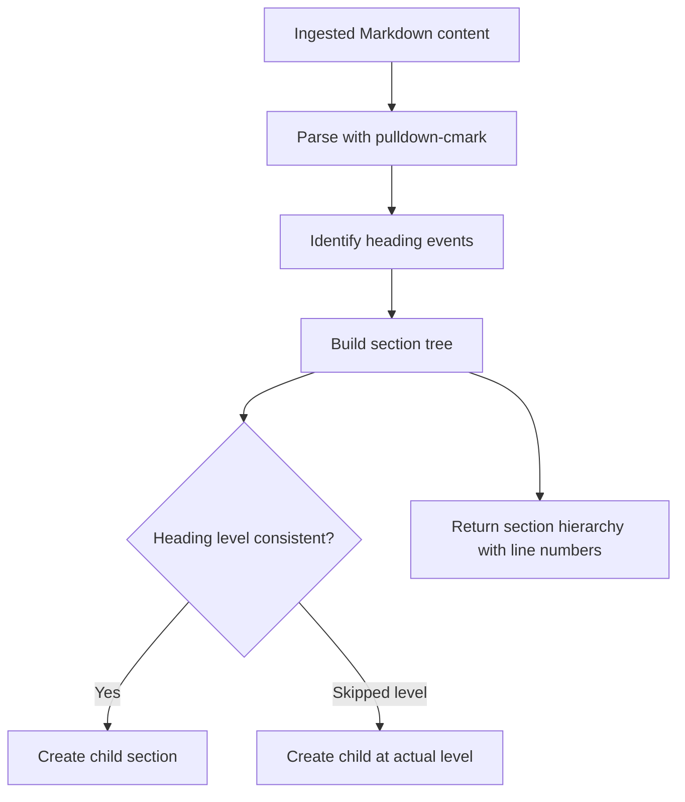
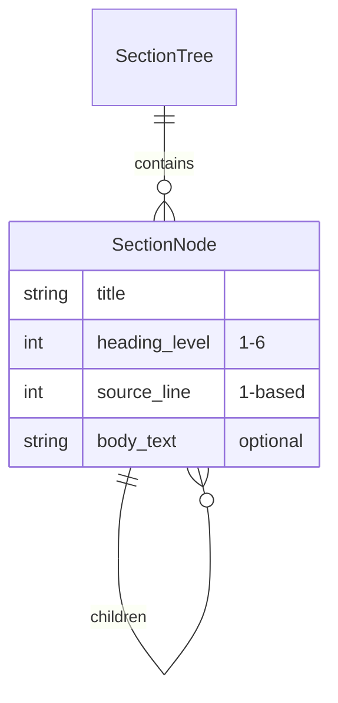
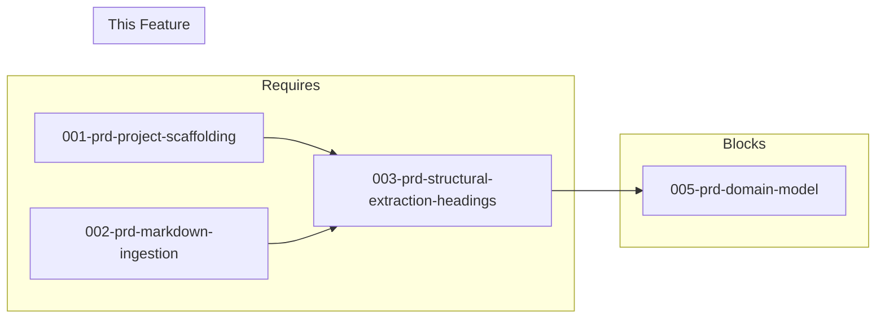

# 003-prd-structural-extraction-headings

> **Document Type:** Product Requirements Document
> **Audience:** LLM agents, human reviewers
> **Status:** Draft
> **Last Updated:** 2026-02-10 <!-- @auto -->
> **Owner:** Brian Luby <!-- @human-required -->

**Feature Branch**: `003-structural-extraction-headings`
**Created**: 2026-02-10
**Status**: Draft
**Input**: Derived from FORGE Product Roadmap WI-3

---

## Review Tier Legend

| Marker | Tier | Speckit Behavior |
|--------|------|------------------|
| 🔴 `@human-required` | Human Generated | Prompt human to author; blocks until complete |
| 🟡 `@human-review` | LLM + Human Review | LLM drafts → prompt human to confirm/edit; blocks until confirmed |
| 🟢 `@llm-autonomous` | LLM Autonomous | LLM completes; no prompt; logged for audit |
| ⚪ `@auto` | Auto-generated | System fills (timestamps, links); no prompt |

---

## Document Completion Order

> ⚠️ **For LLM Agents:** Complete sections in this order. Do not fill downstream sections until upstream human-required inputs exist.

1. **Context** (Background, Scope) → requires human input first
2. **Problem Statement & User Scenarios** → requires human input
3. **Requirements** (Must/Should/Could/Won't) → requires human input
4. **Technical Constraints** → human review
5. **Diagrams, Data Model, Interface** → LLM can draft after above exist
6. **Acceptance Criteria** → derived from requirements
7. **Everything else** → can proceed

---

## Context

### Background 🔴 `@human-required`
This PRD covers **WI-3: Markdown Structural Extraction — Headings** from the FORGE Product Roadmap (Sprint S-3, Mar 17–21 2026, Theme T-1: Core Pipeline, Milestone MS-1). After Markdown files are ingested (WI-2), the content must be parsed into a hierarchical section tree based on heading levels (H1–H6). This section hierarchy forms the backbone of the OSCAL Catalog group structure and is essential for organizing policy requirements into logical groupings. This work item can be developed in parallel with WI-4 (clause extraction).

### Scope Boundaries 🟡 `@human-review`

**In Scope:**
- Parsing Markdown headings (H1–H6) into a hierarchical section tree
- Preserving heading depth, title text, and source line numbers
- Building intermediate section structures with parent-child relationships
- Outputting section hierarchy as debug output for verification

**Out of Scope:**
- Extraction of numbered lists, bullet lists, and tables — deferred to WI-4 (004-prd-structural-extraction-clauses)
- Construction of `PolicySection` domain model structs — deferred to WI-5 (005-prd-domain-model)
- Requirement identification within sections — deferred to WI-4 and WI-6

### Glossary 🟡 `@human-review`

| Term | Definition |
|------|------------|
| Section Tree | A hierarchical representation of document structure where headings define nested sections |
| Heading Level | The depth of a Markdown heading (H1=1, H2=2, ... H6=6) |
| Structural Extraction | The process of parsing document formatting into a machine-readable hierarchy |
| Parent-Child Relationship | A section at heading level N is a child of the nearest preceding section at level N-1 |

### Related Documents ⚪ `@auto`

| Document | Link | Relationship |
|----------|------|--------------|
| Parent PRD | docs/FORGE_PRD.md | Parent requirement M-1 |
| Product Roadmap | docs/FORGE_PRODUCT_ROADMAP.md | Sprint S-3 context |
| Depends On | docs/PRD/002-prd-markdown-ingestion.md | Provides ingested content |
| Parallel With | docs/PRD/004-prd-structural-extraction-clauses.md | Clause extraction (concurrent) |

---

## Problem Statement 🔴 `@human-required`

Ingested Markdown content (from WI-2) is a flat stream of text. To convert policy documents into OSCAL Catalogs, the pipeline must understand the document's hierarchical structure — which sections contain which subsections, and where each section begins and ends. Without heading-based structural extraction, policy requirements cannot be grouped into OSCAL catalog groups, and the section-to-group mapping that drives the entire Catalog model is impossible.

---

## User Scenarios & Testing 🔴 `@human-required`

### User Story 1 — Extract Section Hierarchy (Priority: P1)

A compliance engineer's policy document has headings (H1 for "Access Control Policy", H2 for "Authentication Requirements", H3 for specific rules) and these must be parsed into a tree.

> As a compliance engineer, I want FORGE to recognize the heading hierarchy in my Markdown policy so that sections map correctly to OSCAL Catalog groups.

**Why this priority**: Section hierarchy is the primary organizational structure that drives OSCAL group generation. Without it, all requirements would be in a flat list.

**Independent Test**: Parse a Markdown document with nested headings and verify the resulting tree has correct parent-child relationships.

**Acceptance Scenarios**:
1. **Given** a Markdown document with H1 "Policy", H2 "Access Control", H3 "Passwords", **When** extracting structure, **Then** a tree is produced where "Access Control" is a child of "Policy" and "Passwords" is a child of "Access Control".
2. **Given** a heading at line 15 of the source document, **When** extracted, **Then** the section node records source line 15.

---

### User Story 2 — Handle Irregular Heading Levels (Priority: P2)

A policy document skips heading levels (e.g., H1 directly to H3) and the parser handles this gracefully.

> As a compliance engineer, I want FORGE to handle imperfect heading structures so that real-world policy documents (which may not follow strict heading nesting) are still parsed correctly.

**Why this priority**: Real-world documents often have inconsistent heading levels. The parser must be robust, not fragile.

**Independent Test**: Parse a document with skipped heading levels and verify a reasonable tree is still produced.

**Acceptance Scenarios**:
1. **Given** a document with H1 followed directly by H3 (skipping H2), **When** extracting structure, **Then** H3 is placed as a child of H1 (no crash or missing sections).
2. **Given** a document with multiple H1 headings, **When** extracting, **Then** each H1 starts a new top-level section.

---

## Assumptions & Risks 🟡 `@human-review`

### Assumptions
- [A-1] Policy documents use Markdown headings (# through ######) as the primary organizational structure.
- [A-2] The `pulldown-cmark` parser (selected in WI-2) correctly identifies Markdown headings.
- [A-3] Non-heading content between sections belongs to the section that precedes it.

### Risks
| ID | Risk | Likelihood | Impact | Mitigation |
|----|------|------------|--------|------------|
| R-1 | Documents without any headings have no extractable structure | Med | Med | Detect and warn; treat entire document as single root section |
| R-2 | Deeply nested headings (H5, H6) produce overly deep trees | Low | Low | Support all 6 levels; downstream OSCAL mapping can flatten if needed |

---

## Feature Overview

### Flow Diagram 🟡 `@human-review`



### State Diagram (if applicable) 🟡 `@human-review`
N/A

---

## Requirements

### Must Have (M) — MVP, launch blockers 🔴 `@human-required`
- [ ] **M-1:** The parser shall extract all Markdown headings (H1–H6) from ingested content and produce a hierarchical section tree. *(Traces to: Parent PRD M-1)*
- [ ] **M-2:** Each extracted section shall include the heading title text, heading level (1–6), and source line number. *(Traces to: Parent PRD M-1, M-10)*
- [ ] **M-3:** The section tree shall represent parent-child relationships where a heading at level N is a child of the nearest preceding heading at level N-1 or lower. *(Traces to: Parent PRD M-1)*
- [ ] **M-4:** The parser shall handle documents with irregular heading nesting (skipped levels) without panicking or losing sections. *(Traces to: Parent PRD M-1)*

### Should Have (S) — High value, not blocking 🔴 `@human-required`
- [ ] **S-1:** The parser shall capture the text content between headings (section body) and associate it with the appropriate section.
- [ ] **S-2:** The section tree shall be printable as debug output for verification during development.

### Could Have (C) — Nice to have, if time permits 🟡 `@human-review`
- [ ] **C-1:** The parser could detect and warn about heading-level inconsistencies (e.g., H1→H3 skip) in diagnostic output.

### Won't Have (W) — Explicitly deferred 🟡 `@human-review`
- [ ] **W-1:** Extraction of lists, tables, and clauses — *Reason: Deferred to WI-4*
- [ ] **W-2:** Mapping sections to OSCAL groups — *Reason: Deferred to WI-9*

---

## Technical Constraints 🟡 `@human-review`

- **Language/Framework:** Rust (latest stable)
- **Markdown Parser:** `pulldown-cmark` (selected in WI-2 spike)
- **Error Handling:** `thiserror` error variants for parse failures
- **Testing:** TDD mandatory; test with multiple heading configurations
- **Performance:** Parsing should be linear in document size (O(n))

---

## Data Model (if applicable) 🟡 `@human-review`



---

## Interface Contract (if applicable) 🟡 `@human-review`

```rust
/// A node in the section hierarchy tree
pub struct SectionNode {
    /// Heading title text
    pub title: String,
    /// Heading level (1-6)
    pub heading_level: u8,
    /// Source line number (1-based)
    pub source_line: usize,
    /// Text content between this heading and the next
    pub body_text: Option<String>,
    /// Child sections (headings at deeper levels)
    pub children: Vec<SectionNode>,
}

/// Extract section hierarchy from Markdown content
pub fn extract_sections(content: &str) -> Result<Vec<SectionNode>, ForgeError>;
```

---

## Evaluation Criteria 🟡 `@human-review`

| Criterion | Weight | Metric | Target | Notes |
|-----------|--------|--------|--------|-------|
| Heading Extraction | Critical | All headings correctly identified | 100% | Verified against test fixtures |
| Hierarchy Accuracy | Critical | Parent-child relationships correct | 100% | Verified with nested heading tests |
| Line Number Accuracy | High | Source line numbers match original | 100% | Foundation for traceability |

---

## Tool/Approach Candidates 🟡 `@human-review`

| Option | License | Pros | Cons | Spike Result |
|--------|---------|------|------|--------------|
| pulldown-cmark event-based parsing | MIT | Emits Start/End Heading events with level info | Requires manual tree construction from event stream | Selected |

### Selected Approach 🔴 `@human-required`
> **Decision:** Use `pulldown-cmark` event-based parser, consuming heading events to build the section tree
> **Rationale:** pulldown-cmark emits structured events (Start(Heading), Text, End(Heading)) that map directly to the section tree construction needed.

---

## Acceptance Criteria 🟡 `@human-review`

| AC ID | Requirement | User Story | Given | When | Then |
|-------|-------------|------------|-------|------|------|
| AC-1 | M-1 | US-1 | A Markdown document with 5 headings at various levels | Extracting sections | 5 section nodes produced in correct hierarchy |
| AC-2 | M-2 | US-1 | A heading "## Access Control" at line 10 | Extracting sections | Section node has title="Access Control", level=2, source_line=10 |
| AC-3 | M-3 | US-1 | H1 → H2 → H3 nesting | Extracting sections | H3 is child of H2, which is child of H1 |
| AC-4 | M-4 | US-2 | H1 → H3 (skipping H2) | Extracting sections | H3 is child of H1; no panic or lost sections |

### Edge Cases 🟢 `@llm-autonomous`
- [ ] **EC-1:** (M-1) When a document has no headings, then an empty section list is returned (or single root section with all content).
- [ ] **EC-2:** (M-4) When a document starts with H3 (no H1 or H2), then H3 becomes a top-level section.
- [ ] **EC-3:** (M-1) When a heading has no text (empty `##`), then the section is created with an empty title.
- [ ] **EC-4:** (M-3) When multiple H1 headings exist, then each is a separate top-level section.

---

## Dependencies 🟡 `@human-review`



- **Requires:** [001-prd-project-scaffolding](docs/PRD/001-prd-project-scaffolding.md), [002-prd-markdown-ingestion](docs/PRD/002-prd-markdown-ingestion.md)
- **Blocks:** [005-prd-domain-model](docs/PRD/005-prd-domain-model.md)
- **Parallel:** [004-prd-structural-extraction-clauses](docs/PRD/004-prd-structural-extraction-clauses.md)
- **External:** None

---

## Security Considerations 🟡 `@human-review`

| Aspect | Assessment | Notes |
|--------|------------|-------|
| Internet Exposure | No | Local parsing only |
| Sensitive Data | Yes | Policy document content is parsed |
| Authentication Required | No | Local CLI tool |
| Security Review Required | No | Parsing headings from already-ingested trusted content; no external input |

---

## Implementation Guidance 🟢 `@llm-autonomous`

### Suggested Approach
Use `pulldown-cmark::Parser` to iterate over Markdown events. Track the current heading level and build the section tree using a stack-based approach: push sections onto a stack when entering a heading, pop back to the appropriate level when encountering a same-or-higher-level heading. Capture the source offset from pulldown-cmark events and convert to line numbers using the line map from the ingested document.

### Anti-patterns to Avoid
- Regex-based heading detection instead of using the Markdown parser — fragile and misses edge cases (code blocks containing `#` characters)
- Assuming strict heading nesting — real documents skip levels
- Building a flat list instead of a tree — loses the hierarchical information needed for OSCAL groups

### Reference Examples
- pulldown-cmark event iteration: `for event in Parser::new(markdown) { ... }`

---

## Spike Tasks 🟡 `@human-review`

N/A — Markdown parser selected in WI-2 spike.

---

## Success Metrics 🔴 `@human-required`

| Metric | Baseline | Target | Measurement Method |
|--------|----------|--------|-------------------|
| Heading extraction accuracy | N/A | 100% of headings extracted correctly | Unit tests with varied fixtures |
| Hierarchy correctness | N/A | 100% of parent-child relationships correct | Unit tests |

### Technical Verification 🟢 `@llm-autonomous`
| Metric | Target | Verification Method |
|--------|--------|---------------------|
| Test coverage | >90% | `cargo test` + coverage tool |
| No clippy warnings | 0 | `cargo clippy -- -D warnings` |

---

## Definition of Ready 🔴 `@human-required`

### Readiness Checklist
- [x] Problem statement reviewed and validated by stakeholder
- [x] All Must Have requirements have acceptance criteria
- [x] Technical constraints are explicit and agreed
- [x] Dependencies identified and owners confirmed
- [x] Security review completed (or N/A documented with justification)
- [x] No open questions blocking implementation

### Sign-off
| Role | Name | Date | Decision |
|------|------|------|----------|
| Product Owner | Brian Luby | YYYY-MM-DD | [Ready / Not Ready] |

---

## Changelog ⚪ `@auto`

| Version | Date | Author | Changes |
|---------|------|--------|---------|
| 0.1 | 2026-02-10 | LLM (Claude) | Initial draft derived from FORGE Product Roadmap WI-3 |

---

## Decision Log 🟡 `@human-review`

| Date | Decision | Rationale | Alternatives Considered |
|------|----------|-----------|------------------------|
| 2026-02-10 | Stack-based tree construction from pulldown-cmark events | Natural fit for heading-level hierarchy; O(n) complexity | Regex parsing (fragile), two-pass parsing (unnecessary) |

---

## Open Questions 🟡 `@human-review`

No open questions for this work item.

---

## Review Checklist 🟢 `@llm-autonomous`

Before marking as Approved:
- [x] All requirements have unique IDs (M-1 through M-4, S-1 through S-2, C-1, W-1 through W-2)
- [x] All Must Have requirements have linked acceptance criteria
- [x] User stories are prioritized and independently testable
- [x] Acceptance criteria reference both requirement IDs and user stories
- [x] Glossary terms are used consistently throughout
- [x] Diagrams use terminology from Glossary
- [x] Security considerations documented
- [x] Definition of Ready checklist is complete
- [x] No open questions blocking implementation
