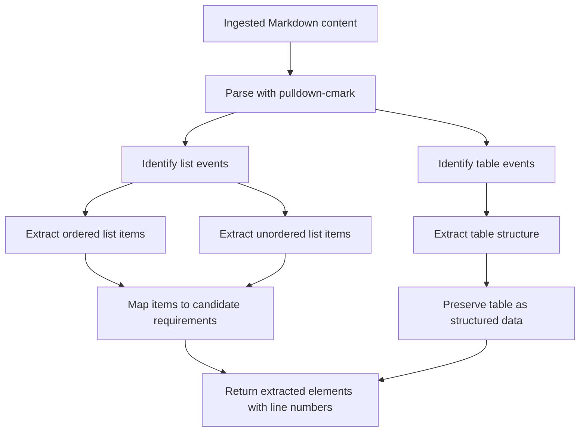
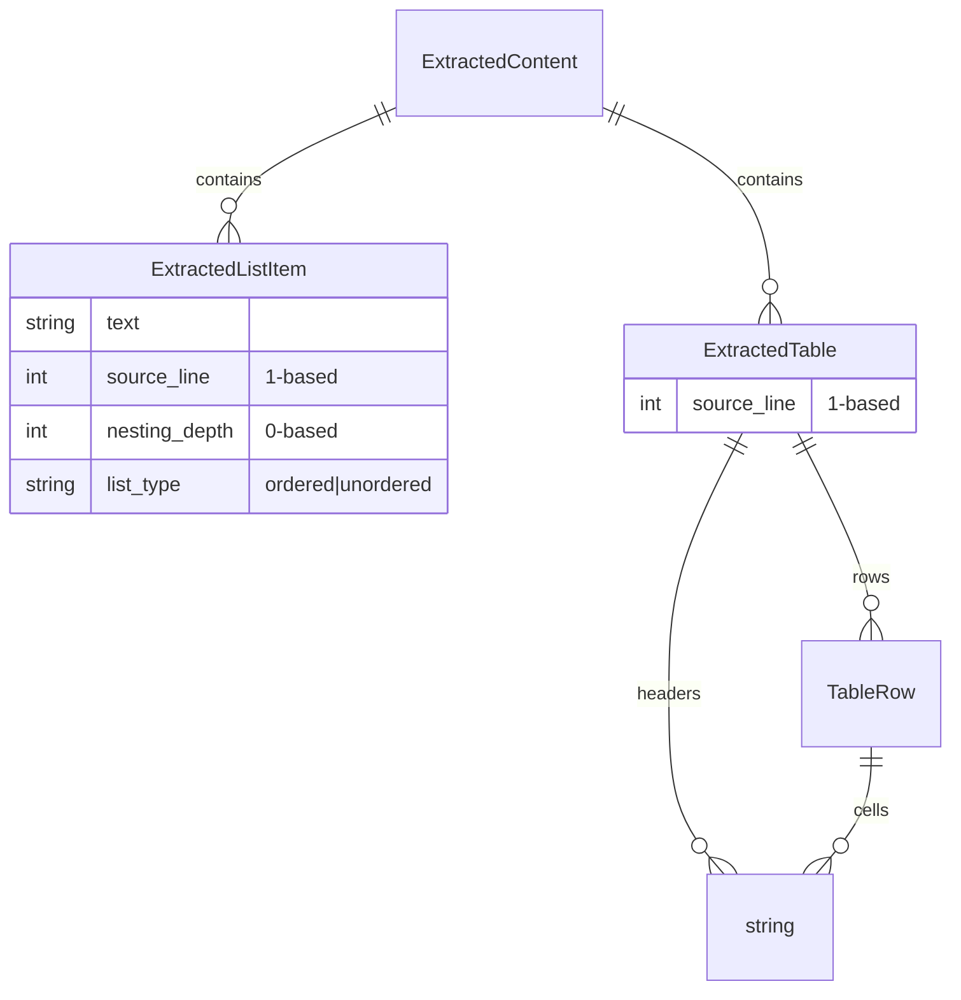
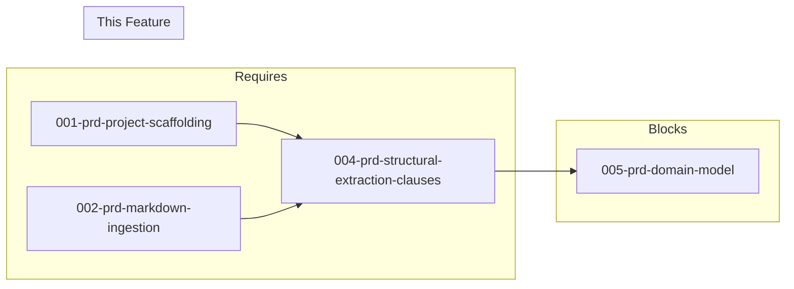

# 004-prd-structural-extraction-clauses

> **Document Type:** Product Requirements Document
> **Audience:** LLM agents, human reviewers
> **Status:** Draft
> **Last Updated:** 2026-02-10 <!-- @auto -->
> **Owner:** Brian Luby <!-- @human-required -->

**Feature Branch**: `004-structural-extraction-clauses`
**Created**: 2026-02-10
**Status**: Draft
**Input**: Derived from FORGE Product Roadmap WI-4

---

## Review Tier Legend

| Marker | Tier | Speckit Behavior |
|--------|------|------------------|
| 🔴 `@human-required` | Human Generated | Prompt human to author; blocks until complete |
| 🟡 `@human-review` | LLM + Human Review | LLM drafts → prompt human to confirm/edit; blocks until confirmed |
| 🟢 `@llm-autonomous` | LLM Autonomous | LLM completes; no prompt; logged for audit |
| ⚪ `@auto` | Auto-generated | System fills (timestamps, links); no prompt |

---

## Document Completion Order

> ⚠️ **For LLM Agents:** Complete sections in this order. Do not fill downstream sections until upstream human-required inputs exist.

1. **Context** (Background, Scope) → requires human input first
2. **Problem Statement & User Scenarios** → requires human input
3. **Requirements** (Must/Should/Could/Won't) → requires human input
4. **Technical Constraints** → human review
5. **Diagrams, Data Model, Interface** → LLM can draft after above exist
6. **Acceptance Criteria** → derived from requirements
7. **Everything else** → can proceed

---

## Context

### Background 🔴 `@human-required`
This PRD covers **WI-4: Markdown Structural Extraction — Clauses & Tables** from the FORGE Product Roadmap (Sprint S-4, Mar 24–28 2026, Theme T-1: Core Pipeline, Milestone MS-1). While WI-3 extracts the heading hierarchy, this work item extracts the content within sections: numbered lists, bullet lists, and tables. These structural elements contain the actual policy requirements that become OSCAL controls. This work item can be developed in parallel with WI-3.

### Scope Boundaries 🟡 `@human-review`

**In Scope:**
- Extracting numbered (ordered) lists from within sections
- Extracting bullet (unordered) lists from within sections
- Extracting tables and preserving table structure
- Mapping list items to candidate policy requirements
- Preserving source line numbers for all extracted elements

**Out of Scope:**
- Heading extraction — handled by WI-3 (003-prd-structural-extraction-headings)
- Domain model construction — deferred to WI-5 (005-prd-domain-model)
- Compound statement atomization — deferred to WI-6 (006-prd-requirement-atomization)
- Normative language detection (must/shall/should) — deferred to WI-33

### Glossary 🟡 `@human-review`

| Term | Definition |
|------|------------|
| Clause | A numbered or bulleted list item within a policy section that may represent a policy requirement |
| Ordered List | A Markdown numbered list (1. 2. 3.) typically used for sequential requirements |
| Unordered List | A Markdown bullet list (- or *) typically used for non-sequential requirements or attributes |
| Table | A Markdown table structure often used for tabular policy content (roles, responsibilities, controls) |
| Candidate Requirement | A list item identified as a potential policy requirement, pending atomization and classification |

### Related Documents ⚪ `@auto`

| Document | Link | Relationship |
|----------|------|--------------|
| Parent PRD | docs/FORGE_PRD.md | Parent requirement M-1 |
| Product Roadmap | docs/FORGE_PRODUCT_ROADMAP.md | Sprint S-4 context |
| Depends On | docs/PRD/002-prd-markdown-ingestion.md | Provides ingested content |
| Parallel With | docs/PRD/003-prd-structural-extraction-headings.md | Heading extraction (concurrent) |

---

## Problem Statement 🔴 `@human-required`

Policy requirements are expressed as numbered lists, bullet points, and tables within document sections. Without extracting these structural elements, the pipeline has the section tree (from WI-3) but no actual requirement content to convert into OSCAL controls. The clause extraction layer bridges the gap between document structure and the individual policy statements that become OSCAL control statements.

---

## User Scenarios & Testing 🔴 `@human-required`

### User Story 1 — Extract Numbered Requirements (Priority: P1)

A policy document has numbered clauses (e.g., "1. All systems must enforce MFA") that represent individual requirements.

> As a compliance engineer, I want FORGE to extract numbered list items from my policy so that each clause becomes a candidate OSCAL control.

**Why this priority**: Numbered lists are the most common format for policy requirements. They directly map to OSCAL controls.

**Independent Test**: Parse a Markdown document with numbered lists and verify each item is extracted with its text and source line number.

**Acceptance Scenarios**:
1. **Given** a section with 5 numbered list items, **When** extracting clauses, **Then** 5 candidate requirements are produced, each with full text and source line number.
2. **Given** a nested numbered list (1. → 1.a. → 1.b.), **When** extracting, **Then** nested items are captured with their nesting level.

---

### User Story 2 — Extract Table Content (Priority: P2)

A policy document contains tables with structured policy data (e.g., roles and responsibilities, control applicability matrices).

> As a compliance engineer, I want FORGE to extract table content from my policy so that tabular policy data is preserved in the OSCAL output.

**Why this priority**: Tables are common in policies for role matrices, control mappings, and requirement summaries. They contain important structured data.

**Independent Test**: Parse a Markdown document with a table and verify the table structure (headers, rows, cells) is preserved.

**Acceptance Scenarios**:
1. **Given** a Markdown table with 3 columns and 5 rows, **When** extracting, **Then** the table structure is preserved with all headers and cell values.
2. **Given** a table with a header row, **When** extracting, **Then** column headers are distinguished from data rows.

---

## Assumptions & Risks 🟡 `@human-review`

### Assumptions
- [A-1] Policy requirements are primarily expressed as list items (numbered or bulleted) within sections.
- [A-2] Tables may contain requirement-like content but are treated as structured data, not individual requirements.
- [A-3] `pulldown-cmark` correctly identifies list and table Markdown events.

### Risks
| ID | Risk | Likelihood | Impact | Mitigation |
|----|------|------------|--------|------------|
| R-1 | Policy requirements are expressed as plain paragraphs, not lists | Med | Med | Capture paragraph text as section body; downstream WIs can process paragraph content |
| R-2 | Complex table formatting (merged cells, multi-line cells) breaks extraction | Low | Low | Handle standard Markdown tables; complex formatting is not supported by CommonMark |

---

## Feature Overview

### Flow Diagram 🟡 `@human-review`



### State Diagram (if applicable) 🟡 `@human-review`
N/A

---

## Requirements

### Must Have (M) — MVP, launch blockers 🔴 `@human-required`
- [ ] **M-1:** The parser shall extract ordered (numbered) list items from Markdown content, producing candidate requirement objects with full text and source line numbers. *(Traces to: Parent PRD M-1)*
- [ ] **M-2:** The parser shall extract unordered (bullet) list items from Markdown content with full text and source line numbers. *(Traces to: Parent PRD M-1)*
- [ ] **M-3:** The parser shall extract Markdown tables, preserving header row, data rows, and cell content. *(Traces to: Parent PRD M-1)*
- [ ] **M-4:** All extracted elements shall include their source line number for downstream traceability. *(Traces to: Parent PRD M-10)*
- [ ] **M-5:** The parser shall handle nested list items, preserving the nesting depth. *(Traces to: Parent PRD M-1)*

### Should Have (S) — High value, not blocking 🔴 `@human-required`
- [ ] **S-1:** The parser shall associate extracted list items and tables with their parent section (from WI-3's heading hierarchy).
- [ ] **S-2:** Paragraph text within sections shall be captured as section body content (not as candidate requirements).

### Could Have (C) — Nice to have, if time permits 🟡 `@human-review`
- [ ] **C-1:** The parser could distinguish between list items that appear to be requirements (contain normative verbs) and informational items.

### Won't Have (W) — Explicitly deferred 🟡 `@human-review`
- [ ] **W-1:** Compound statement splitting — *Reason: Deferred to WI-6 (requirement atomization)*
- [ ] **W-2:** Normative vs advisory classification — *Reason: Deferred to WI-33*

---

## Technical Constraints 🟡 `@human-review`

- **Language/Framework:** Rust (latest stable)
- **Markdown Parser:** `pulldown-cmark` with GFM table extension enabled
- **Error Handling:** `thiserror` error variants for extraction failures
- **Testing:** TDD mandatory; test with varied list and table structures
- **Performance:** Linear in document size (O(n))

---

## Data Model (if applicable) 🟡 `@human-review`



---

## Interface Contract (if applicable) 🟡 `@human-review`

```rust
/// A list item extracted from Markdown
pub struct ExtractedListItem {
    /// Full text content of the list item
    pub text: String,
    /// Source line number (1-based)
    pub source_line: usize,
    /// Nesting depth (0 = top-level)
    pub nesting_depth: u8,
    /// List type
    pub list_type: ListType,
}

pub enum ListType {
    Ordered,
    Unordered,
}

/// A table extracted from Markdown
pub struct ExtractedTable {
    /// Column headers
    pub headers: Vec<String>,
    /// Data rows (each row is a vector of cell strings)
    pub rows: Vec<Vec<String>>,
    /// Source line number (1-based)
    pub source_line: usize,
}

/// Extract list items and tables from Markdown content
pub fn extract_clauses(content: &str) -> Result<ExtractedContent, ForgeError>;
```

---

## Evaluation Criteria 🟡 `@human-review`

| Criterion | Weight | Metric | Target | Notes |
|-----------|--------|--------|--------|-------|
| List Extraction | Critical | All list items correctly extracted | 100% | Both ordered and unordered |
| Table Extraction | High | Table structure preserved | 100% | Headers and rows |
| Line Number Accuracy | High | Source lines match original | 100% | Foundation for traceability |

---

## Tool/Approach Candidates 🟡 `@human-review`

| Option | License | Pros | Cons | Spike Result |
|--------|---------|------|------|--------------|
| pulldown-cmark with GFM tables | MIT | Event-based list/table detection; GFM table extension available | Tables require extension flag | Selected |

### Selected Approach 🔴 `@human-required`
> **Decision:** Use `pulldown-cmark` with GFM table extension enabled
> **Rationale:** Same parser as WI-3; GFM extension adds table support needed for policy documents.

---

## Acceptance Criteria 🟡 `@human-review`

| AC ID | Requirement | User Story | Given | When | Then |
|-------|-------------|------------|-------|------|------|
| AC-1 | M-1 | US-1 | A section with 5 numbered items | Extracting clauses | 5 ordered list items produced with correct text |
| AC-2 | M-2 | US-1 | A section with 3 bullet items | Extracting clauses | 3 unordered list items produced |
| AC-3 | M-3 | US-2 | A 3-column, 5-row Markdown table | Extracting clauses | Table structure preserved with all headers and cells |
| AC-4 | M-4 | US-1 | A list item at line 25 | After extraction | List item records source_line=25 |
| AC-5 | M-5 | US-1 | A nested list (item → sub-item → sub-sub-item) | Extracting clauses | Nesting depths 0, 1, 2 are recorded |

### Edge Cases 🟢 `@llm-autonomous`
- [ ] **EC-1:** (M-1) When a section contains no lists or tables (only paragraphs), then no candidate requirements are produced from that section.
- [ ] **EC-2:** (M-5) When list items are deeply nested (4+ levels), then all levels are preserved.
- [ ] **EC-3:** (M-3) When a table has only a header row and no data rows, then the table is extracted with empty rows.
- [ ] **EC-4:** (M-1) When a list item contains inline Markdown (bold, links, code), then the text is preserved with formatting stripped or normalized.
- [ ] **EC-5:** (M-3) When a table cell is empty, then an empty string is recorded for that cell.

---

## Dependencies 🟡 `@human-review`



- **Requires:** [001-prd-project-scaffolding](docs/PRD/001-prd-project-scaffolding.md), [002-prd-markdown-ingestion](docs/PRD/002-prd-markdown-ingestion.md)
- **Blocks:** [005-prd-domain-model](docs/PRD/005-prd-domain-model.md)
- **Parallel:** [003-prd-structural-extraction-headings](docs/PRD/003-prd-structural-extraction-headings.md)
- **External:** None

---

## Security Considerations 🟡 `@human-review`

| Aspect | Assessment | Notes |
|--------|------------|-------|
| Internet Exposure | No | Local parsing only |
| Sensitive Data | Yes | Policy document content is parsed |
| Authentication Required | No | Local CLI tool |
| Security Review Required | No | Parsing lists/tables from already-ingested trusted content |

---

## Implementation Guidance 🟢 `@llm-autonomous`

### Suggested Approach
Use `pulldown-cmark::Parser` with `Options::ENABLE_TABLES` to iterate over events. Track list start/end events with nesting depth using a counter. For tables, track `Start(Table)`, `Start(TableHead)`, `Start(TableRow)`, and `Start(TableCell)` events to build the table structure. Associate extracted items with their source offsets for line number mapping.

### Anti-patterns to Avoid
- Treating all list items as requirements — some may be informational (C-1 addresses this but it's not Must Have)
- Losing inline formatting context — preserve or normalize, don't corrupt text
- Ignoring nesting depth — flat extraction loses the hierarchical meaning of nested lists

### Reference Examples
- pulldown-cmark table extension: `Options::ENABLE_TABLES`
- pulldown-cmark list event handling: `Event::Start(Tag::List(..))`, `Event::Start(Tag::Item)`

---

## Spike Tasks 🟡 `@human-review`

N/A — Markdown parser selected in WI-2 spike.

---

## Success Metrics 🔴 `@human-required`

| Metric | Baseline | Target | Measurement Method |
|--------|----------|--------|-------------------|
| List item extraction accuracy | N/A | 100% of list items extracted | Unit tests with varied fixtures |
| Table extraction accuracy | N/A | 100% of tables preserved | Unit tests |

### Technical Verification 🟢 `@llm-autonomous`
| Metric | Target | Verification Method |
|--------|--------|---------------------|
| Test coverage | >90% | `cargo test` + coverage tool |
| No clippy warnings | 0 | `cargo clippy -- -D warnings` |

---

## Definition of Ready 🔴 `@human-required`

### Readiness Checklist
- [x] Problem statement reviewed and validated by stakeholder
- [x] All Must Have requirements have acceptance criteria
- [x] Technical constraints are explicit and agreed
- [x] Dependencies identified and owners confirmed
- [x] Security review completed (or N/A documented with justification)
- [x] No open questions blocking implementation

### Sign-off
| Role | Name | Date | Decision |
|------|------|------|----------|
| Product Owner | Brian Luby | YYYY-MM-DD | [Ready / Not Ready] |

---

## Changelog ⚪ `@auto`

| Version | Date | Author | Changes |
|---------|------|--------|---------|
| 0.1 | 2026-02-10 | LLM (Claude) | Initial draft derived from FORGE Product Roadmap WI-4 |

---

## Decision Log 🟡 `@human-review`

| Date | Decision | Rationale | Alternatives Considered |
|------|----------|-----------|------------------------|
| 2026-02-10 | Enable GFM table extension in pulldown-cmark | Policy documents commonly use tables for structured content | Skip tables (lose important data), use separate table parser (unnecessary complexity) |

---

## Open Questions 🟡 `@human-review`

No open questions for this work item.

---

## Review Checklist 🟢 `@llm-autonomous`

Before marking as Approved:
- [x] All requirements have unique IDs (M-1 through M-5, S-1 through S-2, C-1, W-1 through W-2)
- [x] All Must Have requirements have linked acceptance criteria
- [x] User stories are prioritized and independently testable
- [x] Acceptance criteria reference both requirement IDs and user stories
- [x] Glossary terms are used consistently throughout
- [x] Diagrams use terminology from Glossary
- [x] Security considerations documented
- [x] Definition of Ready checklist is complete
- [x] No open questions blocking implementation
