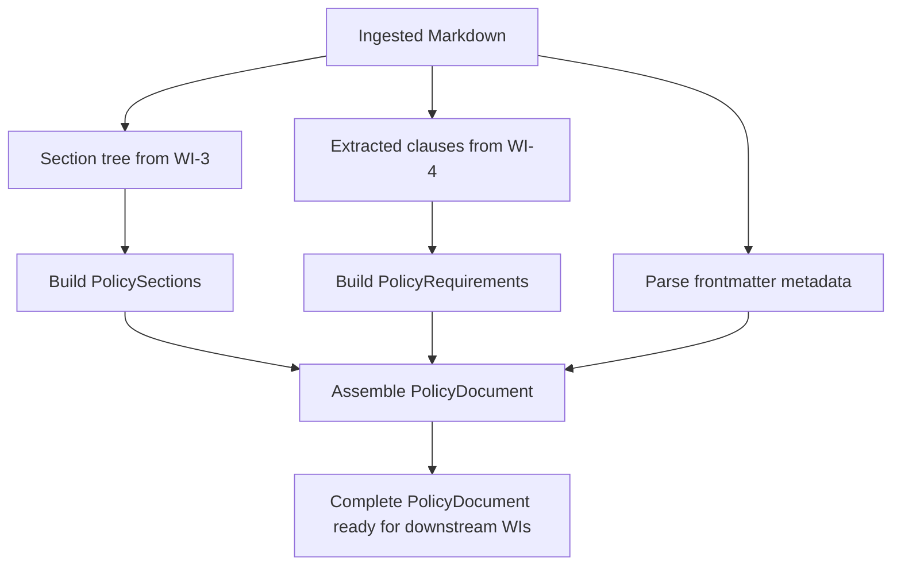
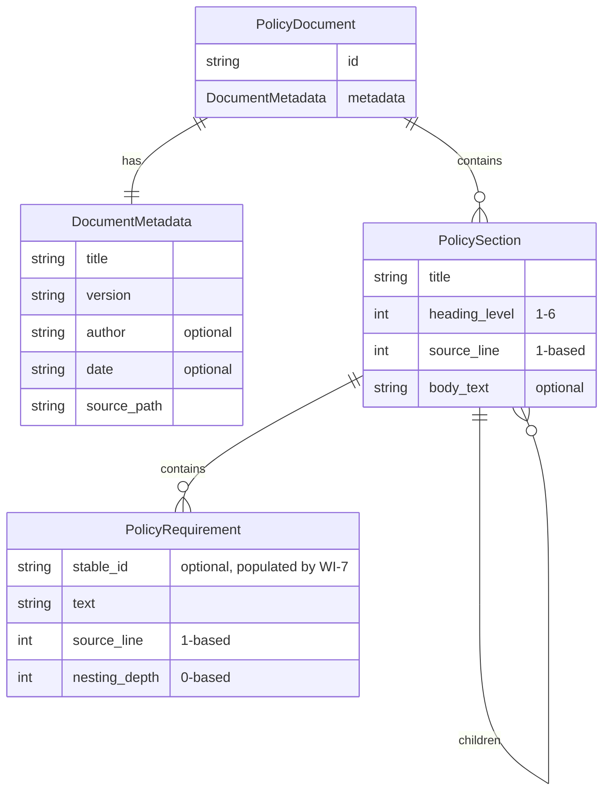
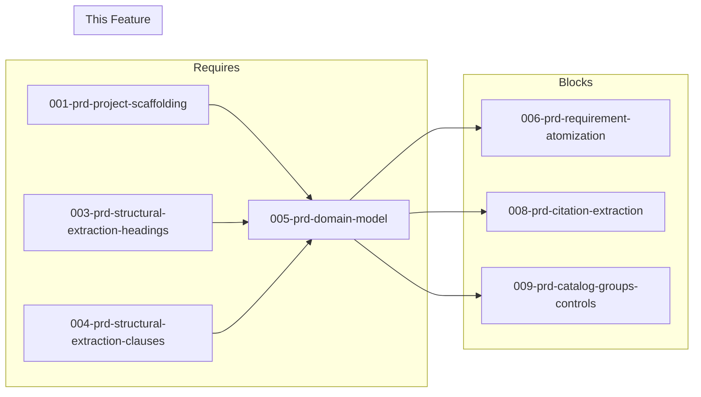

# 005-prd-domain-model

> **Document Type:** Product Requirements Document
> **Audience:** LLM agents, human reviewers
> **Status:** Draft
> **Last Updated:** 2026-02-10 <!-- @auto -->
> **Owner:** Brian Luby <!-- @human-required -->

**Feature Branch**: `005-domain-model`
**Created**: 2026-02-10
**Status**: Draft
**Input**: Derived from FORGE Product Roadmap WI-5

---

## Review Tier Legend

| Marker | Tier | Speckit Behavior |
|--------|------|------------------|
| 🔴 `@human-required` | Human Generated | Prompt human to author; blocks until complete |
| 🟡 `@human-review` | LLM + Human Review | LLM drafts → prompt human to confirm/edit; blocks until confirmed |
| 🟢 `@llm-autonomous` | LLM Autonomous | LLM completes; no prompt; logged for audit |
| ⚪ `@auto` | Auto-generated | System fills (timestamps, links); no prompt |

---

## Document Completion Order

> ⚠️ **For LLM Agents:** Complete sections in this order. Do not fill downstream sections until upstream human-required inputs exist.

1. **Context** (Background, Scope) → requires human input first
2. **Problem Statement & User Scenarios** → requires human input
3. **Requirements** (Must/Should/Could/Won't) → requires human input
4. **Technical Constraints** → human review
5. **Diagrams, Data Model, Interface** → LLM can draft after above exist
6. **Acceptance Criteria** → derived from requirements
7. **Everything else** → can proceed

---

## Context

### Background 🔴 `@human-required`
This PRD covers **WI-5: Internal Domain Model** from the FORGE Product Roadmap (Sprint S-5, Mar 31–Apr 4 2026, Theme T-1: Core Pipeline, Milestone MS-1). After structural extraction (WI-3 headings, WI-4 clauses), the extracted data must be assembled into a coherent internal domain model. The `PolicyDocument`, `PolicySection`, and `PolicyRequirement` structs form the canonical internal representation that all downstream OSCAL generation (WI-9+) operates against. This is the critical boundary between ingestion/parsing and OSCAL mapping — decoupling the two sides of the pipeline.

### Scope Boundaries 🟡 `@human-review`

**In Scope:**
- Implementing `PolicyDocument`, `PolicySection`, `PolicyRequirement` structs
- Wiring ingestion and extraction output into the domain model
- Adding `DocumentMetadata` (title, version from frontmatter or first heading)
- Unit tests for model construction from extracted data

**Out of Scope:**
- Requirement atomization (compound splitting) — deferred to WI-6 (006-prd-requirement-atomization)
- Stable UUID generation — deferred to WI-7 (007-prd-uuid-generation)
- Citation extraction — deferred to WI-8 (008-prd-citation-extraction)
- OSCAL mapping — deferred to WI-9+ (OSCAL generation work items)

### Glossary 🟡 `@human-review`

| Term | Definition |
|------|------------|
| PolicyDocument | The top-level domain model struct representing an entire parsed policy document |
| PolicySection | A struct representing a hierarchical section within a policy document, mapped from headings |
| PolicyRequirement | A struct representing an individual policy requirement extracted from list items/clauses |
| DocumentMetadata | Metadata about the source document: title, version, author, date |
| Domain Model | The canonical internal representation of parsed policy data, independent of both input format and output format |

### Related Documents ⚪ `@auto`

| Document | Link | Relationship |
|----------|------|--------------|
| Parent PRD | docs/FORGE_PRD.md | Parent requirement M-1, data model section |
| Product Roadmap | docs/FORGE_PRODUCT_ROADMAP.md | Sprint S-5 context |
| Depends On | docs/PRD/001-prd-project-scaffolding.md | Project structure |
| Depends On | docs/PRD/003-prd-structural-extraction-headings.md | Section hierarchy |
| Depends On | docs/PRD/004-prd-structural-extraction-clauses.md | Clause extraction |

---

## Problem Statement 🔴 `@human-required`

The ingestion and extraction layers (WI-2, WI-3, WI-4) produce raw structural data: section trees and extracted list items. Without a unified domain model, downstream OSCAL generation would need to understand the raw extraction format directly, creating tight coupling. The domain model provides a clean boundary: extraction produces `PolicyDocument` → OSCAL generators consume `PolicyDocument`. This decoupling enables independent testing, format-agnostic OSCAL generation, and future support for additional input formats.

---

## User Scenarios & Testing 🔴 `@human-required`

### User Story 1 — Build PolicyDocument from Extracted Data (Priority: P1)

After ingestion and extraction, the pipeline assembles a complete PolicyDocument ready for OSCAL generation.

> As a developer working on FORGE, I want a well-defined domain model so that OSCAL generators can work with clean, typed data structures rather than raw extraction output.

**Why this priority**: The domain model is the central data contract. All downstream WIs (WI-6 through WI-18) consume it.

**Independent Test**: Parse a test Markdown file through ingestion and extraction, construct a `PolicyDocument`, and verify all sections and requirements are present.

**Acceptance Scenarios**:
1. **Given** a Markdown file with 3 sections and 10 list items, **When** assembled into a PolicyDocument, **Then** the document has 3 `PolicySection`s containing a total of 10 `PolicyRequirement`s.
2. **Given** a Markdown file with YAML frontmatter containing title and version, **When** assembled, **Then** `DocumentMetadata.title` and `DocumentMetadata.version` are populated from the frontmatter.

---

### User Story 2 — Preserve Source Traceability in Domain Model (Priority: P1)

Every domain model element preserves its source location for downstream traceability.

> As a compliance engineer, I want every extracted requirement to track its source location so that traceability links can be generated in OSCAL output.

**Why this priority**: Traceability is non-negotiable per product principle P-2. Source locations must be preserved from extraction through to OSCAL generation.

**Independent Test**: Construct a PolicyDocument and verify each PolicyRequirement has a valid source_line reference.

**Acceptance Scenarios**:
1. **Given** a requirement extracted from line 42 of the source, **When** stored in the domain model, **Then** `PolicyRequirement.source_line` equals 42.
2. **Given** a section heading at line 10, **When** stored in the domain model, **Then** `PolicySection.source_line` equals 10.

---

## Assumptions & Risks 🟡 `@human-review`

### Assumptions
- [A-1] The domain model is serialization-agnostic — it does not depend on OSCAL JSON structure.
- [A-2] Frontmatter parsing (YAML) is a standard feature that can use an existing crate (e.g., `serde_yaml`).
- [A-3] Requirements at this stage are pre-atomization (may contain compound statements).

### Risks
| ID | Risk | Likelihood | Impact | Mitigation |
|----|------|------------|--------|------------|
| R-1 | Domain model needs significant changes as OSCAL generation is implemented | Med | Med | Design with extensibility in mind; use Option fields for data added by later WIs (stable_id, citations) |
| R-2 | Frontmatter format varies across policy documents | Low | Low | Support YAML frontmatter; fall back to first H1 for title if no frontmatter |

---

## Feature Overview

### Flow Diagram 🟡 `@human-review`



### State Diagram (if applicable) 🟡 `@human-review`
N/A

---

## Requirements

### Must Have (M) — MVP, launch blockers 🔴 `@human-required`
- [ ] **M-1:** The domain model shall include a `PolicyDocument` struct containing document metadata and a collection of `PolicySection`s. *(Traces to: Parent PRD M-1)*
- [ ] **M-2:** The domain model shall include a `PolicySection` struct with title, heading level, source line, body text, child sections, and contained `PolicyRequirement`s. *(Traces to: Parent PRD M-1)*
- [ ] **M-3:** The domain model shall include a `PolicyRequirement` struct with text content, source line number, nesting depth (0-based), and a placeholder for stable_id (populated later by WI-7). *(Traces to: Parent PRD M-1, M-2)*
- [ ] **M-4:** The domain model shall include `DocumentMetadata` with title and version fields, populated from YAML frontmatter or first heading. *(Traces to: Parent PRD M-5)*
- [ ] **M-5:** The assembly function shall wire ingestion output (WI-2), section tree (WI-3), and extracted clauses (WI-4) into a complete `PolicyDocument`. *(Traces to: Parent PRD M-1)*
- [ ] **M-6:** All domain model structs shall preserve source line numbers for traceability. *(Traces to: Parent PRD M-10)*

### Should Have (S) — High value, not blocking 🔴 `@human-required`
- [ ] **S-1:** `PolicyDocument` shall implement `Debug` and provide a human-readable summary (section count, requirement count) for CLI output.
- [ ] **S-2:** `DocumentMetadata` shall include optional `author` and `date` fields if present in frontmatter.

### Could Have (C) — Nice to have, if time permits 🟡 `@human-review`
- [ ] **C-1:** The domain model could include a `source_file_hash` field from ingestion (WI-2) for content integrity tracking.

### Won't Have (W) — Explicitly deferred 🟡 `@human-review`
- [ ] **W-1:** `stable_id` generation — *Reason: Deferred to WI-7 (UUID generation); M-3 includes placeholder only*
- [ ] **W-2:** Citation model — *Reason: Deferred to WI-8 (citation extraction)*
- [ ] **W-3:** Modality field (normative/advisory) — *Reason: Deferred to WI-33*
- [ ] **W-4:** Parameter extraction — *Reason: Deferred to WI-34*

---

## Technical Constraints 🟡 `@human-review`

- **Language/Framework:** Rust (latest stable)
- **Serialization:** `serde` derives for Debug/Serialize (domain model should be serializable for testing/debugging)
- **Frontmatter:** Use `serde_yaml` or similar for YAML frontmatter parsing
- **Error Handling:** `thiserror` for assembly errors
- **Testing:** TDD mandatory; comprehensive unit tests for model construction
- **Design:** Domain model must be decoupled from OSCAL JSON structure — no OSCAL-specific fields

---

## Data Model (if applicable) 🟡 `@human-review`



---

## Interface Contract (if applicable) 🟡 `@human-review`

```rust
/// Top-level domain model for a parsed policy document
#[derive(Debug, Clone)]
pub struct PolicyDocument {
    pub id: String,
    pub metadata: DocumentMetadata,
    pub sections: Vec<PolicySection>,
}

#[derive(Debug, Clone)]
pub struct DocumentMetadata {
    pub title: String,
    pub version: String,
    pub author: Option<String>,
    pub date: Option<String>,
    pub source_path: PathBuf,
    pub content_hash: Option<String>,
}

#[derive(Debug, Clone)]
pub struct PolicySection {
    pub title: String,
    pub heading_level: u8,
    pub source_line: usize,
    pub body_text: Option<String>,
    pub children: Vec<PolicySection>,
    pub requirements: Vec<PolicyRequirement>,
}

#[derive(Debug, Clone)]
pub struct PolicyRequirement {
    /// Populated by WI-7 (UUID generation); None until then
    pub stable_id: Option<String>,
    pub text: String,
    pub source_line: usize,
    pub nesting_depth: u8,
}

/// Assemble a PolicyDocument from ingested and extracted data
pub fn assemble_document(
    ingested: &IngestedDocument,
    sections: Vec<SectionNode>,
    clauses: ExtractedContent,
) -> Result<PolicyDocument, ForgeError>;
```

---

## Evaluation Criteria 🟡 `@human-review`

| Criterion | Weight | Metric | Target | Notes |
|-----------|--------|--------|--------|-------|
| Model Completeness | Critical | All sections and requirements assembled | 100% | No data loss from extraction |
| Source Line Accuracy | Critical | All source lines correctly mapped | 100% | Foundation for traceability |
| Metadata Extraction | High | Title/version from frontmatter | Populated when available | Fallback to first heading |

---

## Tool/Approach Candidates 🟡 `@human-review`

| Option | License | Pros | Cons | Spike Result |
|--------|---------|------|------|--------------|
| serde_yaml for frontmatter | MIT/Apache-2.0 | Standard YAML parsing | May be heavy for just frontmatter | Likely choice |
| Manual YAML frontmatter parsing | N/A | No dependency | Fragile for edge cases | Backup option |

### Selected Approach 🔴 `@human-required`
> **Decision:** Use `serde_yaml` for frontmatter parsing; plain structs with serde derives for the domain model
> **Rationale:** Standard serde integration; consistent with the rest of the Rust ecosystem.

---

## Acceptance Criteria 🟡 `@human-review`

| AC ID | Requirement | User Story | Given | When | Then |
|-------|-------------|------------|-------|------|------|
| AC-1 | M-1, M-2, M-3 | US-1 | A Markdown file with 3 sections and 10 requirements | Assembled into PolicyDocument | Document has 3 sections, 10 requirements total |
| AC-2 | M-4 | US-1 | A Markdown file with YAML frontmatter (title: "Security Policy", version: "1.0") | Assembled into PolicyDocument | metadata.title = "Security Policy", metadata.version = "1.0" |
| AC-3 | M-4 | US-1 | A Markdown file with no frontmatter but H1 heading "Access Control Policy" | Assembled into PolicyDocument | metadata.title = "Access Control Policy", metadata.version = "0.0.0" |
| AC-4 | M-6 | US-2 | Requirements at lines 15, 22, 30 of source | Assembled into PolicyDocument | Each PolicyRequirement has correct source_line (15, 22, 30) |
| AC-5 | M-5 | US-1 | Output from ingestion (WI-2), section extraction (WI-3), and clause extraction (WI-4) | Calling assemble_document() | A complete PolicyDocument is returned with all data |

### Edge Cases 🟢 `@llm-autonomous`
- [ ] **EC-1:** (M-4) When no frontmatter and no headings exist, then title defaults to the filename and version defaults to "0.0.0".
- [ ] **EC-2:** (M-2) When a section has no requirements (only body text), then the section exists with an empty requirements vector.
- [ ] **EC-3:** (M-1) When the document is empty, then an empty PolicyDocument is created with default metadata.
- [ ] **EC-4:** (M-4) When frontmatter is present but malformed YAML, then a warning is emitted and metadata falls back to heading/defaults.

---

## Dependencies 🟡 `@human-review`



- **Requires:** [001-prd-project-scaffolding](docs/PRD/001-prd-project-scaffolding.md), [003-prd-structural-extraction-headings](docs/PRD/003-prd-structural-extraction-headings.md), [004-prd-structural-extraction-clauses](docs/PRD/004-prd-structural-extraction-clauses.md)
- **Blocks:** [006-prd-requirement-atomization](docs/PRD/006-prd-requirement-atomization.md), [008-prd-citation-extraction](docs/PRD/008-prd-citation-extraction.md), and all OSCAL generation WIs
- **External:** None

---

## Security Considerations 🟡 `@human-review`

| Aspect | Assessment | Notes |
|--------|------------|-------|
| Internet Exposure | No | Internal data structures only |
| Sensitive Data | Yes | Domain model contains policy requirement text |
| Authentication Required | No | Local CLI tool |
| Security Review Required | No | Internal data model; no external input processing |

---

## Implementation Guidance 🟢 `@llm-autonomous`

### Suggested Approach
Define all structs in the `model` module. Implement an `assemble_document` function that takes the outputs of WI-2, WI-3, and WI-4 and constructs the domain model. For frontmatter parsing, check for YAML between `---` delimiters at the start of the document. Use `serde_yaml` to deserialize frontmatter into `DocumentMetadata`. Map `SectionNode` children from WI-3 into `PolicySection` structs and associate extracted list items from WI-4 with their parent sections.

### Anti-patterns to Avoid
- Including OSCAL-specific fields in the domain model — it should be format-agnostic
- Making all fields required when some are populated by later WIs (use `Option` for `stable_id`, citations, etc.)
- Tight coupling to extraction output types — use a clean assembly function as the bridge

### Reference Examples
- Parent PRD data model diagram (docs/FORGE_PRD.md, Data Model section) provides the conceptual model

---

## Spike Tasks 🟡 `@human-review`

N/A — No spike tasks for this work item.

---

## Success Metrics 🔴 `@human-required`

| Metric | Baseline | Target | Measurement Method |
|--------|----------|--------|-------------------|
| Model construction accuracy | N/A | 100% of extracted data assembled correctly | Unit tests |
| Metadata extraction | N/A | Title/version populated from frontmatter or fallback | Unit tests |

### Technical Verification 🟢 `@llm-autonomous`
| Metric | Target | Verification Method |
|--------|--------|---------------------|
| Test coverage | >90% | `cargo test` + coverage tool |
| No clippy warnings | 0 | `cargo clippy -- -D warnings` |

---

## Definition of Ready 🔴 `@human-required`

### Readiness Checklist
- [x] Problem statement reviewed and validated by stakeholder
- [x] All Must Have requirements have acceptance criteria
- [x] Technical constraints are explicit and agreed
- [x] Dependencies identified and owners confirmed
- [x] Security review completed (or N/A documented with justification)
- [x] No open questions blocking implementation

### Sign-off
| Role | Name | Date | Decision |
|------|------|------|----------|
| Product Owner | Brian Luby | YYYY-MM-DD | [Ready / Not Ready] |

---

## Changelog ⚪ `@auto`

| Version | Date | Author | Changes |
|---------|------|--------|---------|
| 0.1 | 2026-02-10 | LLM (Claude) | Initial draft derived from FORGE Product Roadmap WI-5 |

---

## Decision Log 🟡 `@human-review`

| Date | Decision | Rationale | Alternatives Considered |
|------|----------|-----------|------------------------|
| 2026-02-10 | Domain model decoupled from OSCAL structure | Enables independent evolution of ingestion and OSCAL generation; clean separation of concerns | Shared OSCAL-aware model (creates tight coupling) |
| 2026-02-10 | Use Option fields for data populated by later WIs | Allows incremental enrichment without breaking changes | Required fields with dummy values (unclear semantics) |

---

## Open Questions 🟡 `@human-review`

No open questions for this work item.

---

## Review Checklist 🟢 `@llm-autonomous`

Before marking as Approved:
- [x] All requirements have unique IDs (M-1 through M-6, S-1 through S-2, C-1, W-1 through W-4)
- [x] All Must Have requirements have linked acceptance criteria
- [x] User stories are prioritized and independently testable
- [x] Acceptance criteria reference both requirement IDs and user stories
- [x] Glossary terms are used consistently throughout
- [x] Diagrams use terminology from Glossary
- [x] Security considerations documented
- [x] Definition of Ready checklist is complete
- [x] No open questions blocking implementation
