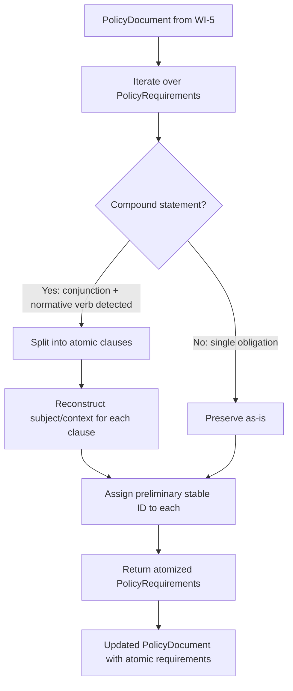
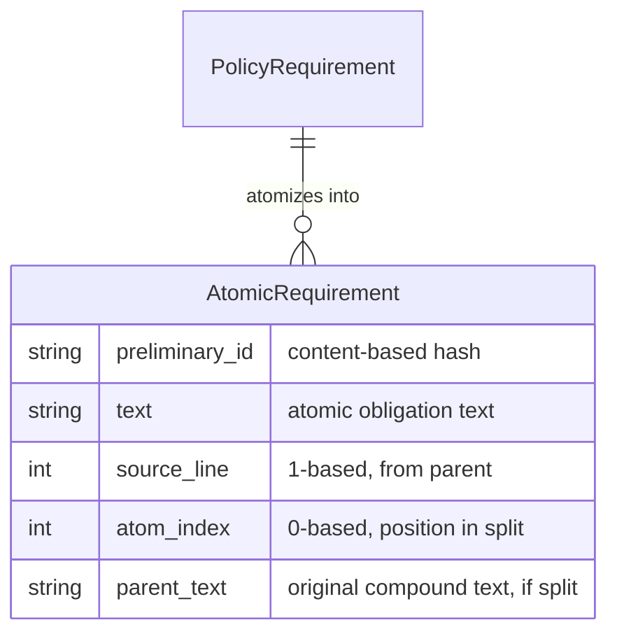
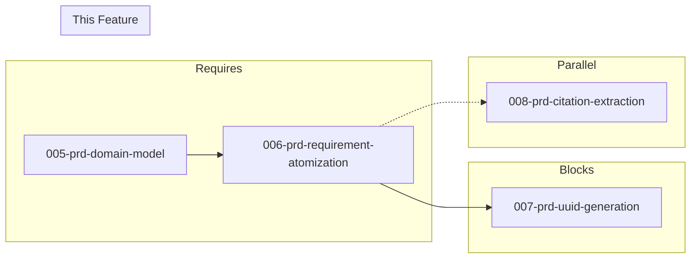

# 006-prd-requirement-atomization

> **Document Type:** Product Requirements Document
> **Audience:** LLM agents, human reviewers
> **Status:** Draft
> **Last Updated:** 2026-02-10 <!-- @auto -->
> **Owner:** Brian Luby <!-- @human-required -->

**Feature Branch**: `006-requirement-atomization`
**Created**: 2026-02-10
**Status**: Draft
**Input**: Derived from FORGE Product Roadmap WI-6

---

## Review Tier Legend

| Marker | Tier | Speckit Behavior |
|--------|------|------------------|
| 🔴 `@human-required` | Human Generated | Prompt human to author; blocks until complete |
| 🟡 `@human-review` | LLM + Human Review | LLM drafts → prompt human to confirm/edit; blocks until confirmed |
| 🟢 `@llm-autonomous` | LLM Autonomous | LLM completes; no prompt; logged for audit |
| ⚪ `@auto` | Auto-generated | System fills (timestamps, links); no prompt |

---

## Document Completion Order

> ⚠️ **For LLM Agents:** Complete sections in this order. Do not fill downstream sections until upstream human-required inputs exist.

1. **Context** (Background, Scope) → requires human input first
2. **Problem Statement & User Scenarios** → requires human input
3. **Requirements** (Must/Should/Could/Won't) → requires human input
4. **Technical Constraints** → human review
5. **Diagrams, Data Model, Interface** → LLM can draft after above exist
6. **Acceptance Criteria** → derived from requirements
7. **Everything else** → can proceed

---

## Context

### Background 🔴 `@human-required`
This PRD covers **WI-6: Requirement Atomization — Compound Statement Splitting** from the FORGE Product Roadmap (Sprint S-6, Apr 7–11 2026, Theme T-1: Core Pipeline, Milestone MS-1). After the domain model is constructed (WI-5), each `PolicyRequirement` may contain compound statements — a single sentence that expresses multiple obligations joined by conjunctions. For example, "Systems must enforce MFA and must require complex passwords" contains two distinct requirements. The atomization step splits these compound statements into individual atomic requirements, each representing a single testable obligation. This is critical because OSCAL controls should map 1:1 to atomic requirements — a compound control is ambiguous, harder to assess, and violates the principle of independently verifiable compliance. This work item can be developed in parallel with WI-8 (citation extraction).

### Scope Boundaries 🟡 `@human-review`

**In Scope:**
- Implementing a compound statement splitter that detects conjunctions ("and"/"or") paired with normative verbs ("must", "shall", "should", "will")
- Heuristic-based splitting of compound policy statements into individual atomic requirements
- Preserving single atomic statements as-is (no modification)
- Assigning preliminary stable IDs to each resulting atomic requirement
- Updating `PolicyRequirement` entries in the domain model with atomized results
- Unit tests with test fixtures covering compound and atomic statements

**Out of Scope:**
- Stable UUID v5 generation — deferred to WI-7 (007-prd-uuid-generation); preliminary IDs only
- Citation extraction — handled by WI-8 (008-prd-citation-extraction) in parallel
- Normative vs advisory classification ("must" vs "should") — deferred to WI-33
- Natural language processing or ML-based semantic splitting — initial version uses heuristic rules only
- OSCAL mapping of atomized requirements — deferred to WI-9+ (Catalog generation)

### Glossary 🟡 `@human-review`

| Term | Definition |
|------|------------|
| Atomization | The process of splitting compound policy statements into individual, independently addressable requirements |
| Compound Statement | A policy statement containing multiple obligations joined by conjunctions (e.g., "must X and must Y") |
| Atomic Requirement | A single, indivisible policy obligation that can be independently assessed and mapped to one OSCAL control |
| Normative Verb | A verb indicating obligation level in policy language: "must", "shall" (mandatory), "should" (recommended), "will" (intent) |
| Conjunction | A connecting word ("and", "or") that joins clauses within a compound statement |
| Preliminary Stable ID | A temporary identifier assigned to each atomic requirement before deterministic UUID generation in WI-7 |
| Heuristic Splitting | Rule-based text splitting using syntactic patterns rather than semantic understanding |

### Related Documents ⚪ `@auto`

| Document | Link | Relationship |
|----------|------|--------------|
| Parent PRD | docs/FORGE_PRD.md | Parent requirement M-2, AC-2, EC-2 |
| Product Roadmap | docs/FORGE_PRODUCT_ROADMAP.md | Sprint S-6 context |
| Product Vision | docs/FORGE_PRODUCT_VISION.md | Goal G-1, Principles P-1, P-3 |
| Depends On | docs/PRD/005-prd-domain-model.md | Domain model structs (PolicyRequirement) |
| Parallel With | docs/PRD/008-prd-citation-extraction.md | Citation extraction (concurrent) |

---

## Problem Statement 🔴 `@human-required`

Policy documents frequently express multiple obligations in a single statement using conjunctions: "Systems must enforce MFA and must require complex passwords" or "The organization shall review access logs and shall revoke inactive accounts." When these compound statements are mapped directly to OSCAL controls without splitting, the result is a single control that conflates multiple independently assessable requirements. This creates problems for compliance engineers: a control may be partially satisfied (MFA is enforced but password complexity is not), yet the compound control forces an all-or-nothing assessment. Atomization solves this by producing one atomic requirement per obligation, each of which maps to its own OSCAL control with a stable identifier. This enables granular compliance tracking, clearer audit trails, and more accurate assessment results. Per product principle P-1 (Correctness over convenience), the splitter must be conservative — it should only split on clear syntactic patterns to avoid incorrect decomposition, preserving ambiguous or already-atomic statements as-is.

---

## User Scenarios & Testing 🔴 `@human-required`

### User Story 1 — Split Compound Policy Statement (Priority: P1)

A policy document contains compound statements that join multiple obligations with conjunctions and normative verbs.

> As a compliance engineer, I want FORGE to split compound policy statements into individual atomic requirements so that each obligation becomes a separate OSCAL control that can be independently assessed.

**Why this priority**: Atomization directly implements Parent PRD M-2 and is on the critical path. Without it, compound statements produce ambiguous controls that cannot be granularly assessed.

**Independent Test**: Pass a compound policy statement through the atomizer and verify it produces the correct number of atomic requirements with accurate text.

**Acceptance Scenarios**:
1. **Given** the statement "Systems must enforce MFA and must require complex passwords", **When** atomizing, **Then** two atomic requirements are produced: "Systems must enforce MFA" and "Systems must require complex passwords".
2. **Given** the statement "The organization shall review access logs and shall revoke inactive accounts within 30 days", **When** atomizing, **Then** two atomic requirements are produced, each preserving its full clause text.
3. **Given** the statement "All employees must complete security training and must acknowledge the acceptable use policy or must request a waiver", **When** atomizing, **Then** three atomic requirements are produced, one per normative verb clause.

---

### User Story 2 — Preserve Atomic Statements (Priority: P1)

A policy document contains statements that are already atomic (a single obligation per statement).

> As a compliance engineer, I want FORGE to preserve already-atomic policy statements without modification so that simple requirements pass through unchanged.

**Why this priority**: Per Parent PRD EC-2, atomic statements must be preserved as-is. The atomizer must not corrupt or unnecessarily modify single-obligation statements.

**Independent Test**: Pass an atomic policy statement through the atomizer and verify it produces exactly one requirement with unmodified text.

**Acceptance Scenarios**:
1. **Given** the statement "All systems must enforce MFA", **When** atomizing, **Then** exactly one atomic requirement is produced with the original text unchanged.
2. **Given** the statement "Passwords must be at least 12 characters", **When** atomizing, **Then** exactly one atomic requirement is produced.

---

### User Story 3 — Assign Preliminary IDs to Atomic Requirements (Priority: P2)

After atomization, each resulting atomic requirement needs a preliminary identifier for downstream processing.

> As a developer working on FORGE, I want each atomic requirement to receive a preliminary stable ID after atomization so that downstream pipeline stages (UUID generation, OSCAL mapping) can reference individual requirements.

**Why this priority**: Preliminary IDs establish the identity of each atomic requirement before WI-7 generates deterministic UUIDs. They enable traceability through the pipeline and are needed by WI-7 and WI-9.

**Independent Test**: Atomize a compound statement and verify each resulting requirement has a unique, non-empty preliminary ID.

**Acceptance Scenarios**:
1. **Given** a compound statement split into 2 atomic requirements, **When** examining the results, **Then** each requirement has a unique preliminary ID.
2. **Given** the same compound statement atomized twice, **When** comparing preliminary IDs, **Then** the IDs are identical across runs (deterministic).

---

## Assumptions & Risks 🟡 `@human-review`

### Assumptions
- [A-1] Compound policy statements follow recognizable syntactic patterns: conjunctions ("and", "or") paired with normative verbs ("must", "shall", "should", "will").
- [A-2] The domain model (WI-5) provides `PolicyRequirement` structs with text content available for splitting.
- [A-3] Heuristic splitting is sufficient for the majority of well-structured policy documents; ML-based splitting is not needed in this phase.
- [A-4] Preliminary stable IDs can be derived from content (e.g., hash-based) without requiring the full UUID v5 scheme from WI-7.

### Risks
| ID | Risk | Likelihood | Impact | Mitigation |
|----|------|------------|--------|------------|
| R-1 | Heuristic splitting incorrectly splits on "and"/"or" that are not joining separate obligations (e.g., "must encrypt and store data") | Med | Med | Conservative splitting: only split when a normative verb follows the conjunction; err on the side of not splitting |
| R-2 | Policy statements use complex sentence structures that resist heuristic decomposition (subordinate clauses, parentheticals) | Med | Low | Preserve complex statements as-is when the pattern is ambiguous; document limitations |
| R-3 | Splitting changes the semantic meaning of a requirement (e.g., shared subject or object is lost) | Med | Med | Carry forward the subject/context from the original statement to each split requirement; validate with test fixtures |

---

## Feature Overview

### Flow Diagram 🟡 `@human-review`



### State Diagram (if applicable) 🟡 `@human-review`
N/A

---

## Requirements

### Must Have (M) — MVP, launch blockers 🔴 `@human-required`
- [ ] **M-1:** The atomizer shall detect compound statements containing conjunctions ("and", "or") paired with normative verbs ("must", "shall", "should", "will") and split them into individual atomic requirements. *(Traces to: Parent PRD M-2)*
- [ ] **M-2:** Each atomic requirement produced by splitting shall contain the complete text of its individual obligation, including any shared subject or context from the original compound statement. *(Traces to: Parent PRD M-2)*
- [ ] **M-3:** Single atomic statements (those without detectable compound patterns) shall pass through the atomizer unchanged. *(Traces to: Parent PRD EC-2)*
- [ ] **M-4:** Each atomic requirement shall be assigned a preliminary stable ID that is deterministic (same input produces same ID). *(Traces to: Parent PRD M-2, M-8)*
- [ ] **M-5:** The atomizer shall preserve source line numbers from the original `PolicyRequirement` on each resulting atomic requirement. *(Traces to: Parent PRD M-10)*
- [ ] **M-6:** The atomizer shall operate on a `PolicyDocument` and return an updated `PolicyDocument` with compound requirements replaced by their atomic parts. *(Traces to: Parent PRD M-2)*
- [ ] **M-7:** The atomizer shall enforce a maximum split count of 50 atomic requirements per compound statement; when exceeded, the statement shall be preserved as-is and a warning shall be logged. *(Traces to: SEC-5, Security Finding F1)*

### Should Have (S) — High value, not blocking 🔴 `@human-required`
- [ ] **S-1:** The atomizer shall handle statements with more than two conjunctions (e.g., "must X and must Y and must Z") producing the correct number of atomic requirements.
- [ ] **S-2:** The atomizer shall handle mixed conjunctions (e.g., "must X and must Y or must Z") by splitting on each conjunction-normative verb pair.
- [ ] **S-3:** The atomizer shall log a warning when it encounters a conjunction without a subsequent normative verb, indicating a potential compound statement that could not be confidently split.

### Could Have (C) — Nice to have, if time permits 🟡 `@human-review`
- [ ] **C-1:** The atomizer could support configurable normative verb lists to accommodate domain-specific policy language.
- [ ] **C-2:** The atomizer could produce an atomization report summarizing how many statements were split and how many were preserved as-is.

### Won't Have (W) — Explicitly deferred 🟡 `@human-review`
- [ ] **W-1:** Deterministic UUID v5 generation — *Reason: Deferred to WI-7; M-4 uses preliminary content-based IDs only*
- [ ] **W-2:** ML/NLP-based semantic splitting — *Reason: Deferred per product principle P-3 (deterministic and auditable); heuristic splitting only in this phase*
- [ ] **W-3:** Normative vs advisory classification — *Reason: Deferred to WI-33; the atomizer detects normative verbs for splitting but does not classify modality*
- [ ] **W-4:** User-interactive review of splits — *Reason: Deferred per roadmap risk RR-2 contingency; fully automatic in this phase*

---

## Technical Constraints 🟡 `@human-review`

- **Language/Framework:** Rust (latest stable)
- **Dependencies:** No new external crates required; string processing and regex from `regex` crate if needed
- **Determinism:** Same input text must always produce the same split results and same preliminary IDs (per principle P-3)
- **Error Handling:** `thiserror` error variants for atomization failures
- **Testing:** TDD mandatory; comprehensive test fixtures covering compound statements, atomic statements, and edge cases
- **Performance:** Linear in the number of requirements (O(n)); splitting a single statement is O(m) where m is statement length
- **Conservative Splitting:** When in doubt, do not split — per principle P-1 (Correctness over convenience)

---

## Data Model (if applicable) 🟡 `@human-review`



Note: In practice, atomized requirements are stored as `PolicyRequirement` structs in the domain model. The `AtomicRequirement` concept above illustrates the logical relationship. After atomization, compound `PolicyRequirement`s are replaced by multiple `PolicyRequirement`s, each with its own preliminary `stable_id`.

---

## Interface Contract (if applicable) 🟡 `@human-review`

```rust
/// Result of atomizing a single policy requirement
pub struct AtomizationResult {
    /// The atomic requirements produced (1 if already atomic, N if split)
    pub requirements: Vec<PolicyRequirement>,
    /// Whether the original statement was split
    pub was_split: bool,
    /// The original compound text (if split)
    pub original_text: Option<String>,
}

/// Atomize all requirements in a PolicyDocument
/// Replaces compound PolicyRequirements with their atomic parts
pub fn atomize_document(document: PolicyDocument) -> Result<PolicyDocument, ForgeError>;

/// Atomize a single policy requirement text
/// Returns one or more atomic requirement texts
pub fn atomize_requirement(requirement: &PolicyRequirement) -> Result<AtomizationResult, ForgeError>;

/// Generate a preliminary stable ID for an atomic requirement
/// Based on content hash; will be replaced by UUID v5 in WI-7
pub fn preliminary_id(text: &str, source_line: usize, atom_index: usize) -> String;
```

---

## Evaluation Criteria 🟡 `@human-review`

| Criterion | Weight | Metric | Target | Notes |
|-----------|--------|--------|--------|-------|
| Split Accuracy | Critical | Compound statements correctly split into atomic parts | 100% on test fixtures | No false splits, no missed splits on clear patterns |
| Preservation Accuracy | Critical | Atomic statements pass through unchanged | 100% | No modification to already-atomic statements |
| Subject Reconstruction | High | Split requirements retain meaningful context (shared subject) | 100% on test fixtures | Each atomic requirement is a complete sentence |
| ID Determinism | High | Same input produces same preliminary IDs across runs | 100% | Foundation for WI-7 UUID stability |

---

## Tool/Approach Candidates 🟡 `@human-review`

| Option | License | Pros | Cons | Spike Result |
|--------|---------|------|------|--------------|
| Regex-based heuristic splitting | N/A (regex crate, MIT/Apache-2.0) | Simple, deterministic, no external NLP dependencies | Limited to syntactic patterns; may miss complex constructions | Selected |
| NLP-based clause parsing (e.g., rust-bert) | MIT/Apache-2.0 | Handles complex sentence structures | Non-deterministic, heavy dependency, violates P-3 | Deferred (W-2) |
| Manual string splitting (no regex) | N/A | Zero dependencies | Fragile for varied patterns | Backup option |

### Selected Approach 🔴 `@human-required`
> **Decision:** Regex-based heuristic splitting on conjunction + normative verb patterns
> **Rationale:** Deterministic and auditable per principle P-3; handles the common patterns found in well-structured policy documents without introducing ML dependencies. Conservative by design — preserves statements when patterns are ambiguous.

---

## Acceptance Criteria 🟡 `@human-review`

| AC ID | Requirement | User Story | Given | When | Then |
|-------|-------------|------------|-------|------|------|
| AC-1 | M-1, M-2 | US-1 | "Systems must enforce MFA and must require complex passwords" | Atomizing | 2 atomic requirements: "Systems must enforce MFA" and "Systems must require complex passwords" |
| AC-2 | M-1, M-2 | US-1 | "The organization shall review access logs and shall revoke inactive accounts within 30 days" | Atomizing | 2 atomic requirements, each preserving its full clause with shared subject "The organization" |
| AC-3 | M-3 | US-2 | "All systems must enforce MFA" | Atomizing | 1 atomic requirement with original text unchanged |
| AC-4 | M-3 | US-2 | "Passwords must be at least 12 characters" | Atomizing | 1 atomic requirement with original text unchanged |
| AC-5 | M-4 | US-3 | A compound statement split into 2 requirements | Examining preliminary IDs | Each requirement has a unique, non-empty preliminary ID |
| AC-6 | M-4 | US-3 | Same statement atomized twice across runs | Comparing preliminary IDs | IDs are identical (deterministic) |
| AC-7 | M-5 | US-1 | A compound requirement from source line 42 | Atomizing | Each resulting atomic requirement has source_line = 42 |
| AC-8 | M-6 | US-1 | A PolicyDocument with 3 sections containing a mix of compound and atomic requirements | Calling atomize_document() | Updated PolicyDocument with compound requirements replaced by atomic parts; total requirement count increases |

### Edge Cases 🟢 `@llm-autonomous`
- [ ] **EC-1:** (M-3) When a statement contains "and" but no normative verb after the conjunction (e.g., "must encrypt and store data securely"), then the statement is preserved as-is (no split).
- [ ] **EC-2:** (M-1) When a statement uses "or" as a conjunction with normative verbs (e.g., "must implement MFA or must use certificate-based authentication"), then the statement is split into separate atomic requirements.
- [ ] **EC-3:** (M-1) When a statement contains three or more conjunction-normative verb pairs (e.g., "must X and must Y and must Z"), then all clauses are split into separate atomic requirements.
- [ ] **EC-4:** (M-2) When a compound statement has a shared subject (e.g., "The IT department must X and must Y"), then each atomic requirement reconstructs the full sentence with the shared subject.
- [ ] **EC-5:** (M-3) When a statement contains "and" in a non-splitting context (e.g., "must implement logging and monitoring"), then the statement is preserved as-is because no normative verb follows the conjunction.
- [ ] **EC-6:** (M-1) When a statement uses "shall" as the normative verb (e.g., "shall X and shall Y"), then splitting works the same as with "must".
- [ ] **EC-7:** (M-3) When a requirement text is empty or whitespace-only, then it is preserved as-is without error.
- [ ] **EC-8:** (M-6) When a PolicyDocument has zero requirements, then atomize_document() returns the document unchanged.

---

## Dependencies 🟡 `@human-review`



- **Requires:** [005-prd-domain-model](docs/PRD/005-prd-domain-model.md) — provides `PolicyDocument`, `PolicySection`, `PolicyRequirement` structs
- **Blocks:** [007-prd-uuid-generation](docs/PRD/007-prd-uuid-generation.md) — UUID generation depends on atomized requirements being available
- **Parallel:** [008-prd-citation-extraction](docs/PRD/008-prd-citation-extraction.md) — citation extraction can proceed concurrently
- **External:** None

---

## Security Considerations 🟡 `@human-review`

| Aspect | Assessment | Notes |
|--------|------------|-------|
| Internet Exposure | No | Internal text processing only |
| Sensitive Data | Yes | Policy requirement text is processed; may contain sensitive operational details |
| Authentication Required | No | Local CLI tool |
| Security Review Required | No | Text splitting on already-ingested trusted content; no external input processing at this stage |

Additional security notes:
- If `regex` crate is used, ensure patterns are not vulnerable to catastrophic backtracking (ReDoS). Use bounded patterns and test with adversarial input.
- Policy text content should not be logged at debug level in production to avoid leaking sensitive requirement details.

---

## Implementation Guidance 🟢 `@llm-autonomous`

### Suggested Approach
Implement the atomizer in the `parse` module (or a dedicated `atomize` submodule). The core logic should:

1. **Detect compound patterns**: Use regex to find conjunctions ("and", "or") preceded or followed by normative verbs ("must", "shall", "should", "will"). The key pattern is: `<text> <normative-verb> <obligation> <conjunction> <normative-verb> <obligation>`.
2. **Split on conjunction + normative verb boundaries**: When "and must", "and shall", "or must", "or shall" (and similar) are detected, split the statement at those boundaries.
3. **Reconstruct shared subject**: If the clause before the first normative verb is a subject phrase (e.g., "Systems", "The organization"), prepend it to each split clause that lacks its own subject.
4. **Assign preliminary IDs**: Compute a content-based hash (e.g., using `std::hash` or a simple hash function) from the atomic text, source line, and atom index.
5. **Update the domain model**: Replace each compound `PolicyRequirement` in the `PolicyDocument` with the resulting atomic `PolicyRequirement`s.

### Anti-patterns to Avoid
- Splitting on every occurrence of "and"/"or" without checking for an accompanying normative verb — this would incorrectly split phrases like "logging and monitoring"
- Modifying atomic statements that pass through — the atomizer must be a no-op for non-compound statements
- Using non-deterministic processing (e.g., thread-dependent ordering) — output must be identical across runs per P-3
- Over-engineering the splitter with NLP features that violate the heuristic-only scope of this WI

### Reference Examples
- Parent PRD AC-2: "must X and must Y" produces two separate controls
- Parent PRD EC-2: Single atomic statements preserved as-is
- Roadmap RR-2: Conservative splitting only on clear conjunctions with normative verbs

---

## Spike Tasks 🟡 `@human-review`

N/A — No spike tasks for this work item. The heuristic approach is well-understood and does not require technology evaluation.

---

## Success Metrics 🔴 `@human-required`

| Metric | Baseline | Target | Measurement Method |
|--------|----------|--------|-------------------|
| Compound split accuracy | N/A | 100% of compound statements in test fixtures correctly split | Unit tests with compound fixtures |
| Atomic preservation accuracy | N/A | 100% of atomic statements pass through unchanged | Unit tests with atomic fixtures |
| ID determinism | N/A | 100% identical IDs across repeated runs | Unit tests comparing repeat atomizations |

### Technical Verification 🟢 `@llm-autonomous`
| Metric | Target | Verification Method |
|--------|--------|---------------------|
| Test coverage | >90% | `cargo test` + coverage tool |
| No clippy warnings | 0 | `cargo clippy -- -D warnings` |
| No regex ReDoS vulnerability | 0 | Test with adversarial long input strings |

---

## Definition of Ready 🔴 `@human-required`

### Readiness Checklist
- [x] Problem statement reviewed and validated by stakeholder
- [x] All Must Have requirements have acceptance criteria
- [x] Technical constraints are explicit and agreed
- [x] Dependencies identified and owners confirmed
- [x] Security review completed (or N/A documented with justification)
- [x] No open questions blocking implementation

### Sign-off
| Role | Name | Date | Decision |
|------|------|------|----------|
| Product Owner | Brian Luby | YYYY-MM-DD | [Ready / Not Ready] |

---

## Changelog ⚪ `@auto`

| Version | Date | Author | Changes |
|---------|------|--------|---------|
| 0.1 | 2026-02-10 | LLM (Claude) | Initial draft derived from FORGE Product Roadmap WI-6 |

---

## Decision Log 🟡 `@human-review`

| Date | Decision | Rationale | Alternatives Considered |
|------|----------|-----------|------------------------|
| 2026-02-10 | Use heuristic regex-based splitting, not NLP | Deterministic and auditable per principle P-3; avoids heavy ML dependencies; sufficient for well-structured policy documents | NLP clause parsing (non-deterministic, heavy dependency); manual string splitting (too fragile) |
| 2026-02-10 | Conservative splitting: only split when normative verb follows conjunction | Prevents incorrect splits on phrases like "logging and monitoring" where "and" joins parts of a single obligation | Aggressive splitting on all conjunctions (high false-positive rate) |
| 2026-02-10 | Preliminary content-based IDs, not full UUID v5 | UUID v5 generation is scoped to WI-7; preliminary IDs provide traceability without coupling to UUID scheme | Full UUID v5 now (scope creep into WI-7); no IDs until WI-7 (breaks pipeline traceability) |

---

## Open Questions 🟡 `@human-review`

No open questions for this work item.

---

## Review Checklist 🟢 `@llm-autonomous`

Before marking as Approved:
- [x] All requirements have unique IDs (M-1 through M-6, S-1 through S-3, C-1 through C-2, W-1 through W-4)
- [x] All Must Have requirements have linked acceptance criteria
- [x] User stories are prioritized and independently testable
- [x] Acceptance criteria reference both requirement IDs and user stories
- [x] Glossary terms are used consistently throughout
- [x] Diagrams use terminology from Glossary
- [x] Security considerations documented
- [x] Definition of Ready checklist is complete
- [x] No open questions blocking implementation
