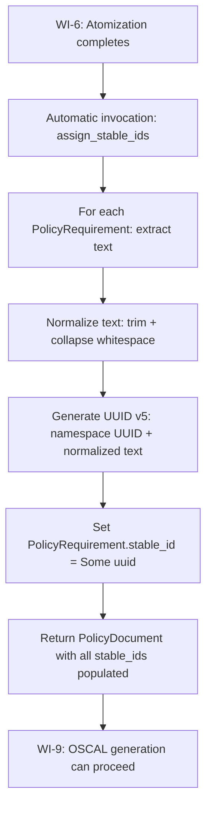
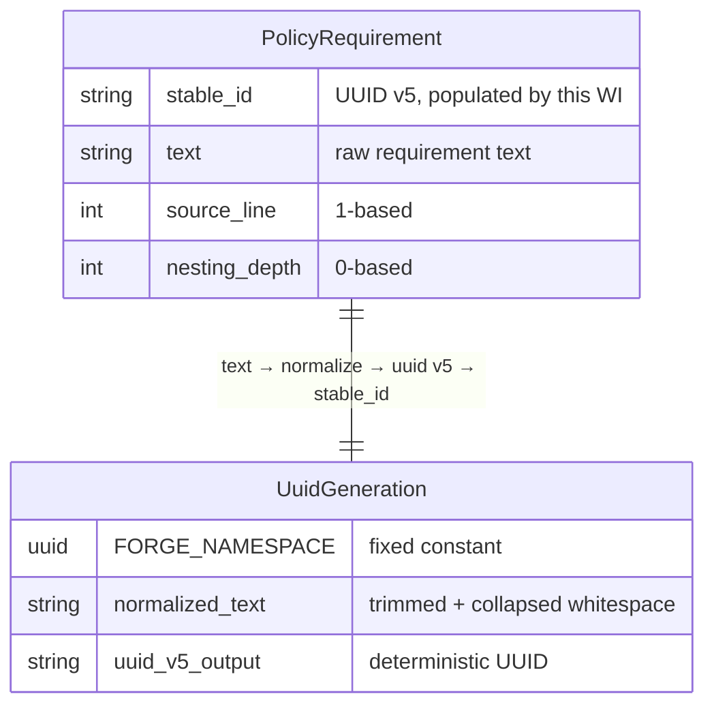
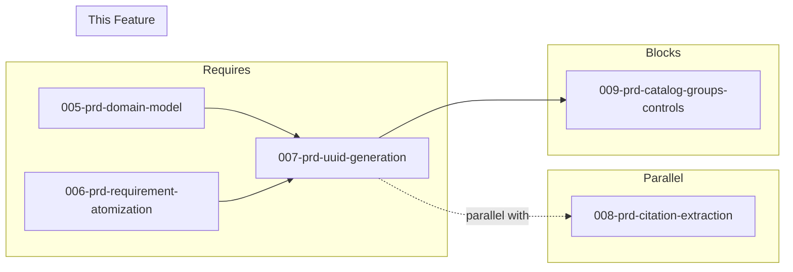

# 007-prd-uuid-generation

> **Document Type:** Product Requirements Document
> **Audience:** LLM agents, human reviewers
> **Status:** Draft
> **Last Updated:** 2026-02-10 <!-- @auto -->
> **Owner:** Brian Luby <!-- @human-required -->

**Feature Branch**: `007-uuid-generation`
**Created**: 2026-02-10
**Status**: Draft
**Input**: Derived from FORGE Product Roadmap WI-7

---

## Review Tier Legend

| Marker | Tier | Speckit Behavior |
|--------|------|------------------|
| 🔴 `@human-required` | Human Generated | Prompt human to author; blocks until complete |
| 🟡 `@human-review` | LLM + Human Review | LLM drafts → prompt human to confirm/edit; blocks until confirmed |
| 🟢 `@llm-autonomous` | LLM Autonomous | LLM completes; no prompt; logged for audit |
| ⚪ `@auto` | Auto-generated | System fills (timestamps, links); no prompt |

---

## Document Completion Order

> ⚠️ **For LLM Agents:** Complete sections in this order. Do not fill downstream sections until upstream human-required inputs exist.

1. **Context** (Background, Scope) → requires human input first
2. **Problem Statement & User Scenarios** → requires human input
3. **Requirements** (Must/Should/Could/Won't) → requires human input
4. **Technical Constraints** → human review
5. **Diagrams, Data Model, Interface** → LLM can draft after above exist
6. **Acceptance Criteria** → derived from requirements
7. **Everything else** → can proceed

---

## Context

### Background 🔴 `@human-required`
This PRD covers **WI-7: Deterministic UUID v5 Generation** from the FORGE Product Roadmap (Sprint S-7, Apr 14–18 2026, Theme T-1: Core Pipeline, Milestone MS-1). After requirement atomization (WI-6) produces individual atomic policy requirements, each requirement needs a stable, deterministic identifier. UUID v5 generation uses a namespace UUID combined with a content hash of the requirement text to produce identifiers that are identical across runs for the same content. This enables meaningful diffs, traceability, and reproducible OSCAL output — core to product principle P-3 (Deterministic and auditable). This work item also satisfies Spike-4 acceptance criteria from the parent PRD: demonstrating identical UUIDs for identical content and changed UUIDs for altered content.

### Scope Boundaries 🟡 `@human-review`

**In Scope:**
- Implementing UUID v5 generation using a FORGE-specific namespace UUID and content hash of requirement text
- Content normalization before hashing (whitespace trimming, collapsing internal whitespace)
- Populating `PolicyRequirement.stable_id` with the generated UUID
- Unit tests verifying determinism (same content produces same UUID across runs)
- Unit tests verifying sensitivity (substantive text change produces different UUID)
- Unit tests verifying normalization (whitespace-only changes produce same UUID)
- Satisfying Spike-4 acceptance criteria from the parent PRD

**Out of Scope:**
- Requirement atomization logic — completed in WI-6 (006-prd-requirement-atomization)
- OSCAL catalog/control generation that consumes stable IDs — deferred to WI-9 (009-prd-catalog-groups-controls)
- Citation extraction — deferred to WI-8 (008-prd-citation-extraction), running in parallel
- UUID v4 generation for OSCAL artifact-level identifiers (document UUIDs) — deferred to WI-11 (OSCAL metadata)
- CLI warning on stable ID changes between conversions — deferred to a later WI with diff/comparison capability

### Glossary 🟡 `@human-review`

| Term | Definition |
|------|------------|
| UUID v5 | A deterministic UUID generated from a namespace UUID and a name (content) using SHA-1 hashing, per RFC 4122 |
| Namespace UUID | A fixed UUID specific to FORGE that serves as the namespace parameter for UUID v5 generation |
| Content Normalization | The process of trimming and collapsing whitespace in requirement text before hashing, ensuring insignificant formatting differences do not change the generated UUID |
| stable_id | The `Option<String>` field on `PolicyRequirement` (defined in WI-5) that holds the deterministic UUID v5 identifier |
| Deterministic | Same input always produces the same output; a core principle (P-3) of the FORGE pipeline |

### Related Documents ⚪ `@auto`

| Document | Link | Relationship |
|----------|------|--------------|
| Parent PRD | docs/FORGE_PRD.md | Parent requirement M-8, AC-8, EC-5, EC-6, Spike-4 |
| Product Roadmap | docs/FORGE_PRODUCT_ROADMAP.md | Sprint S-7 context |
| Product Vision | docs/FORGE_PRODUCT_VISION.md | Principle P-3 (Deterministic and auditable) |
| Depends On | docs/PRD/005-prd-domain-model.md | PolicyRequirement.stable_id field definition |
| Depends On (WI-6) | docs/PRD/006-prd-requirement-atomization.md | Atomized requirements to generate IDs for |

---

## Clarifications

### Session 2026-02-11

- Q: What value should be used for the FORGE_NAMESPACE_UUID constant? → A: Generate a new project-specific UUID v4 and hardcode it in the source (ensures global uniqueness)
- Q: Where in the pipeline should UUID generation be invoked? → A: Automatically invoked immediately after requirement atomization completes, before returning the PolicyDocument (ensures stable_ids always populated)
- Q: Where should the UUID generation code be organized? → A: In a separate uuid generation module (src/uuid.rs or src/uuid_generation.rs) for clear separation of concerns
- Q: What information should be included in debug logging (PRD C-1)? → A: Normalized text + generated UUID (verifies normalization + generation, matches PRD C-1 specification)

---

## Problem Statement 🔴 `@human-required`

After atomization (WI-6), each `PolicyRequirement` has a `stable_id` field that is `None`. Without deterministic identifiers, every conversion run would produce different UUIDs for the same requirements, making diffs between conversion runs meaningless, breaking traceability across re-conversions, and violating product principle P-3 (Deterministic and auditable). The parent PRD explicitly states: "Generating new UUIDs on every run breaks traceability and makes diffs meaningless." UUID v5 generation solves this by deriving the identifier from the content itself — same content always produces the same UUID, without requiring any external persistence or state.

---

## User Scenarios & Testing 🔴 `@human-required`

### User Story 1 — Deterministic IDs Across Runs (Priority: P1)

A compliance engineer converts the same policy document twice and expects identical OSCAL output, including identical requirement identifiers.

> As a compliance engineer, I want the same policy document to produce identical stable IDs every time I convert it so that I can trust diffs between conversion runs and maintain traceability over time.

**Why this priority**: Deterministic output is a core product principle (P-3). Without stable IDs, all downstream OSCAL generation (WI-9+) produces non-reproducible output that cannot be meaningfully compared or tracked.

**Independent Test**: Convert a test policy document twice with the same content. Compare the `stable_id` values on all `PolicyRequirement`s and verify they are identical.

**Acceptance Scenarios**:
1. **Given** a PolicyRequirement with text "All users must use multi-factor authentication", **When** UUID v5 is generated twice with the same namespace, **Then** both generated UUIDs are identical.
2. **Given** two separate conversion runs of the same Markdown policy file, **When** comparing the stable_id values on corresponding PolicyRequirements, **Then** all stable_ids are identical across runs.

---

### User Story 2 — Whitespace Normalization (Priority: P1)

A compliance engineer makes whitespace-only edits to a policy document and expects stable IDs to remain unchanged.

> As a compliance engineer, I want whitespace-only changes (reformatting, extra spaces, trailing newlines) to not change the stable IDs so that non-substantive edits do not trigger false change detection.

**Why this priority**: Without normalization, trivial formatting changes would generate new UUIDs, creating noise in diffs and undermining trust in the stability guarantee. This is explicitly required by parent PRD EC-5.

**Independent Test**: Generate a UUID for a requirement, then modify only the whitespace in the requirement text (add leading/trailing spaces, collapse double spaces, change indentation) and regenerate. Verify the UUID is unchanged.

**Acceptance Scenarios**:
1. **Given** a requirement "Users must change passwords every 90 days", **When** the text is changed to "  Users  must  change  passwords  every  90  days  " (extra whitespace), **Then** the generated UUID is identical to the original.
2. **Given** a requirement with a trailing newline, **When** the trailing newline is removed, **Then** the generated UUID is unchanged.

---

### User Story 3 — Substantive Change Detection (Priority: P1)

When a requirement's text is substantively changed, the stable ID changes to reflect the new content.

> As a compliance engineer, I want a substantive change to a requirement's text to produce a new stable ID so that content changes are detectable through identifier comparison.

**Why this priority**: If substantive changes did not alter the UUID, the system would be unable to detect content drift between policy revisions. This is explicitly required by parent PRD EC-6.

**Independent Test**: Generate a UUID for a requirement, then make a substantive text change (alter a word, add a clause) and regenerate. Verify the UUID is different.

**Acceptance Scenarios**:
1. **Given** a requirement "All users must use MFA", **When** the text is changed to "All administrators must use MFA", **Then** the generated UUID is different from the original.
2. **Given** a requirement "Passwords must be at least 8 characters", **When** the text is changed to "Passwords must be at least 12 characters", **Then** the generated UUID is different.

---

## Assumptions & Risks 🟡 `@human-review`

### Assumptions
- [A-1] The `uuid` Rust crate (MIT/Apache-2.0) supports UUID v5 generation and is the selected tool per the parent PRD tool evaluation.
- [A-2] A single fixed FORGE namespace UUID (a project-specific UUID v4) will be generated once, hardcoded as a constant, and used for all requirement UUID generation to ensure global uniqueness of FORGE's identifier namespace.
- [A-3] Content normalization consists of trimming leading/trailing whitespace and collapsing internal runs of whitespace to single spaces. No other normalization (e.g., case folding, punctuation normalization) is required.
- [A-4] The `stable_id` field on `PolicyRequirement` is `Option<String>` (defined in WI-5) and will be populated as `Some(uuid_string)` after this WI.

### Risks
| ID | Risk | Likelihood | Impact | Mitigation |
|----|------|------------|--------|------------|
| R-1 | Normalization strategy is too aggressive or too lenient | Low | Med | Start with whitespace-only normalization; extend in later WIs if needed based on user feedback |
| R-2 | UUID v5 SHA-1 collision on different requirement texts | Extremely Low | Low | SHA-1 collision probability is negligible at the scale of policy requirements (hundreds, not billions) |
| R-3 | Namespace UUID needs to change in the future | Low | Med | Document the namespace UUID as a versioned constant; changing it is a breaking change that requires a migration path |

---

## Feature Overview

### Flow Diagram 🟡 `@human-review`



### State Diagram (if applicable) 🟡 `@human-review`

```mermaid
stateDiagram-v2
    [*] --> NoneId: PolicyRequirement created (WI-5/WI-6)
    NoneId --> Normalized: Text normalization applied
    Normalized --> Generated: UUID v5 generated from namespace + normalized text
    Generated --> Assigned: stable_id set to Some(uuid)
    Assigned --> [*]

    state NoneId {
        note right of NoneId: stable_id = None
    }
    state Assigned {
        note right of Assigned: stable_id = Some("xxxxxxxx-xxxx-5xxx-...")
    }
```

---

## Requirements

### Must Have (M) — MVP, launch blockers 🔴 `@human-required`
- [ ] **M-1:** The system shall generate UUID v5 identifiers for PolicyRequirements using a fixed FORGE namespace UUID and the normalized requirement text as the name. *(Traces to: Parent PRD M-8)*
- [ ] **M-2:** The system shall normalize requirement text before hashing by trimming leading and trailing whitespace and collapsing all internal whitespace runs to a single space. *(Traces to: Parent PRD EC-5)*
- [ ] **M-3:** The system shall populate `PolicyRequirement.stable_id` with the generated UUID v5 string for every atomized requirement. *(Traces to: Parent PRD M-8)*
- [ ] **M-4:** The system shall produce identical UUIDs for identical requirement text across separate conversion runs. *(Traces to: Parent PRD AC-8)*
- [ ] **M-5:** The system shall produce different UUIDs when requirement text is substantively changed. *(Traces to: Parent PRD EC-6)*

### Should Have (S) — High value, not blocking 🔴 `@human-required`
- [ ] **S-1:** The FORGE namespace UUID shall be defined as a well-documented constant in the codebase with a comment explaining its purpose and the consequence of changing it.
- [ ] **S-2:** The UUID generation function shall accept any string input (not just PolicyRequirement), enabling reuse for other content-addressed identifiers in later WIs.

### Could Have (C) — Nice to have, if time permits 🟡 `@human-review`
- [ ] **C-1:** The system could log (at debug level) the normalized text and generated UUID for each requirement to aid debugging. Use structured tracing fields: `tracing::debug!(normalized_text = %normalized, uuid = %uuid, "UUID generated")` per Section IX observability guidance.

### Won't Have (W) — Explicitly deferred 🟡 `@human-review`
- [ ] **W-1:** CLI warning when a requirement's stable ID changes between conversions — *Reason: Requires diff/comparison capability; deferred to WI-43 (diff report)*
- [ ] **W-2:** UUID v4 generation for OSCAL artifact-level identifiers — *Reason: Deferred to WI-11 (OSCAL metadata)*
- [ ] **W-3:** Case-insensitive normalization or Unicode normalization — *Reason: Out of scope for initial implementation; may be revisited based on user feedback*
- [ ] **W-4:** Persistence of stable IDs to a local cache or database — *Reason: UUID v5 is deterministic by design; no persistence needed*

---

## Technical Constraints 🟡 `@human-review`

- **Language/Framework:** Rust (latest stable)
- **UUID Crate:** `uuid` crate (MIT/Apache-2.0) with `v5` feature enabled, per parent PRD tool evaluation
- **Hashing:** UUID v5 uses SHA-1 internally (per RFC 4122); no separate hashing crate required
- **Namespace:** A single constant `FORGE_NAMESPACE_UUID` of type `uuid::Uuid`, generated once and committed to source
- **Error Handling:** `thiserror` for any errors in the generation pipeline
- **Testing:** TDD mandatory; tests must cover determinism, normalization, and sensitivity
- **Design:** The generation function must be pure (no side effects, no I/O) for testability

---

## Data Model (if applicable) 🟡 `@human-review`



---

## Interface Contract (if applicable) 🟡 `@human-review`

> **Canonical interface definition**: See [007-ar-uuid-generation.md](../AR/007-ar-uuid-generation.md) § Interface Definitions for the full Rust code contract.

**Module**: `src/uuid.rs`

| Component | Signature | Purpose |
|-----------|-----------|---------|
| `FORGE_NAMESPACE_UUID` | `pub const Uuid` | Fixed namespace for UUID v5 generation (compile-time constant) |
| `normalize_for_hashing` | `pub fn(&str) -> String` | Trim + collapse whitespace |
| `generate_stable_id` | `pub fn(&str) -> Uuid` | Deterministic UUID v5 from any text (S-2) |
| `assign_stable_ids` | `pub fn(&mut PolicyDocument)` | Walk tree, populate all `stable_id` fields |

---

## Evaluation Criteria 🟡 `@human-review`

| Criterion | Weight | Metric | Target | Notes |
|-----------|--------|--------|--------|-------|
| Determinism | Critical | Same text produces same UUID across runs | 100% | Core requirement |
| Normalization | Critical | Whitespace-only changes produce same UUID | 100% | Parent PRD EC-5 |
| Sensitivity | Critical | Substantive text changes produce different UUID | 100% | Parent PRD EC-6 |
| Coverage | High | All PolicyRequirements have stable_id populated | 100% | No requirement left with None after this WI |

---

## Tool/Approach Candidates 🟡 `@human-review`

| Option | License | Pros | Cons | Spike Result |
|--------|---------|------|------|--------------|
| `uuid` crate with v5 feature | MIT/Apache-2.0 | Standard Rust UUID crate; RFC 4122 compliant; supports v4 and v5 | SHA-1 internally (acceptable for non-cryptographic use) | Selected per parent PRD |
| Manual SHA-1 + UUID formatting | N/A | No dependency | Error-prone; reimplements standard logic | Rejected |
| UUID v4 (random) | MIT/Apache-2.0 | Simpler | Not deterministic; violates P-3 and M-8 | Rejected per parent PRD Decision Log |

### Selected Approach 🔴 `@human-required`
> **Decision:** Use the `uuid` crate with UUID v5 (namespace + content hash) for deterministic identifier generation
> **Rationale:** UUID v5 is deterministic by design (same namespace + same name = same UUID), eliminating the need for a persistence layer. The `uuid` crate is the standard Rust implementation, is MIT/Apache-2.0 licensed, and was identified as the likely choice in the parent PRD tool evaluation. This aligns with product principle P-3 (Deterministic and auditable) and the parent PRD Decision Log entry: "Use deterministic UUID v5 for stable identifiers — ensures reproducible output and meaningful diffs across re-conversions."

---

## Acceptance Criteria 🟡 `@human-review`

| AC ID | Requirement | User Story | Given | When | Then |
|-------|-------------|------------|-------|------|------|
| AC-1 | M-1, M-4 | US-1 | Same source policy converted twice | Comparing UUIDs on corresponding requirements | Identifiers are identical across runs |
| AC-2 | M-2 | US-2 | A requirement with text "Users must use MFA" | Text is changed to "  Users   must   use   MFA  " (whitespace-only changes) | The generated UUID is identical |
| AC-3 | M-5 | US-3 | A requirement with text "Passwords must be 8 characters" | Text is changed to "Passwords must be 12 characters" (substantive change) | The generated UUID is different |
| AC-4 | M-3 | US-1 | A PolicyDocument with atomized requirements (stable_id = None) | Running UUID generation | All PolicyRequirements have stable_id = Some(uuid_string) |
| AC-5 | M-1 | US-1 | The FORGE namespace UUID and a requirement text | Generating UUID v5 | The output is a valid RFC 4122 UUID v5 (version nibble = 5, variant bits correct) |

### Edge Cases 🟢 `@llm-autonomous`
- [ ] **EC-1:** (M-2) When a requirement contains only whitespace, then the normalized text is an empty string, and the UUID is still generated deterministically (UUID v5 of empty string is well-defined).
- [ ] **EC-2:** (M-2) When a requirement has mixed newlines, tabs, and spaces, then all are collapsed to single spaces and the UUID is the same as a cleanly-formatted version.
- [ ] **EC-3:** (M-2) When a requirement has Unicode whitespace characters (e.g., non-breaking space, em space), then they are treated as whitespace and collapsed. *(Note: depends on Rust's `split_whitespace` behavior, which handles Unicode whitespace.)*
- [ ] **EC-4:** (M-1) When two different requirements have different text, then the generated UUIDs are different (no false collisions for reasonable input sizes).
- [ ] **EC-5:** (M-3) When a PolicyDocument has nested sections with requirements at multiple levels, then all requirements at all nesting depths receive a stable_id.

---

## Dependencies 🟡 `@human-review`



- **Requires:** [005-prd-domain-model](docs/PRD/005-prd-domain-model.md) (defines PolicyRequirement.stable_id field), [006-prd-requirement-atomization](docs/PRD/006-prd-requirement-atomization.md) (provides atomized requirements to generate IDs for)
- **Parallel With:** [008-prd-citation-extraction](docs/PRD/008-prd-citation-extraction.md) (no dependency between UUID generation and citation extraction)
- **Blocks:** [009-prd-catalog-groups-controls](docs/PRD/009-prd-catalog-groups-controls.md) (catalog generation needs stable IDs for controls)
- **External:** `uuid` crate (MIT/Apache-2.0, stable, widely used)

---

## Security Considerations 🟡 `@human-review`

| Aspect | Assessment | Notes |
|--------|------------|-------|
| Internet Exposure | No | Pure computation, no network I/O |
| Sensitive Data | Yes | Requirement text is hashed; the UUID is derived from policy content |
| Authentication Required | No | Local CLI tool |
| Security Review Required | No | UUID v5 uses SHA-1 for hashing, which is acceptable for content-addressing (not used for cryptographic security). No secrets or credentials are involved. |

---

## Implementation Guidance 🟢 `@llm-autonomous`

### Suggested Approach

**Module Structure:** Create a dedicated UUID generation module at `src/uuid.rs` for clear separation of concerns and reusability (per S-2). This module will be independent of the domain model and pipeline orchestration.

**Implementation:** Add the `uuid` crate with the `v5` feature to `Cargo.toml`. Define a `FORGE_NAMESPACE_UUID` constant (generate a v4 UUID once and hardcode it). Implement `normalize_for_hashing` using Rust's `split_whitespace().collect::<Vec<&str>>().join(" ")` — this handles trimming, collapsing, and Unicode whitespace in a single idiomatic expression. Implement `generate_stable_id` as a pure function: normalize then call `Uuid::new_v5`. Implement `assign_stable_ids` to walk all sections/requirements in a `PolicyDocument` and populate `stable_id`.

**Pipeline Integration:** Call `assign_stable_ids(&mut document)` automatically at the end of the atomization pipeline (WI-6), immediately after all PolicyRequirements have been extracted but before returning the PolicyDocument. This ensures stable_ids are always populated before downstream OSCAL generation (WI-9) receives the document.

**Testing:** Write TDD tests first: determinism test, normalization test, sensitivity test, and edge cases. Place tests in `tests/uuid_generation_test.rs` or as unit tests within the module.

### Anti-patterns to Avoid
- Using UUID v4 (random) for requirement identifiers — this violates determinism and is explicitly rejected in the parent PRD Decision Log
- Hashing raw (un-normalized) text — whitespace-only changes would produce different UUIDs, violating EC-5
- Making the namespace UUID configurable at runtime — this would allow users to inadvertently break ID stability
- Over-normalizing (e.g., lowercasing, removing punctuation) — this could cause distinct requirements to collide

### Reference Examples
- `uuid` crate v5 documentation: https://docs.rs/uuid/latest/uuid/struct.Uuid.html#method.new_v5
- RFC 4122 Section 4.3: UUID v5 generation algorithm
- Parent PRD Spike-4 acceptance criteria: "demonstrate identical UUIDs for identical content and changed UUIDs for altered content"

---

## Spike Tasks 🟡 `@human-review`

This work item satisfies **Spike-4** from the parent PRD:

> **Spike-4:** Prototype deterministic UUID v5 generation from policy requirement content. Completion criteria: demonstrate identical UUIDs for identical content and changed UUIDs for altered content.

No additional spike tasks are required — the implementation directly fulfills the spike criteria.

---

## Success Metrics 🔴 `@human-required`

| Metric | Baseline | Target | Measurement Method |
|--------|----------|--------|-------------------|
| Determinism accuracy | N/A | 100% identical UUIDs for identical content | Unit tests with multiple runs |
| Normalization coverage | N/A | 100% whitespace-only changes produce same UUID | Unit tests with whitespace variants |
| Sensitivity accuracy | N/A | 100% substantive changes produce different UUID | Unit tests with text mutations |

### Technical Verification 🟢 `@llm-autonomous`
| Metric | Target | Verification Method |
|--------|--------|---------------------|
| Test coverage | >95% | `cargo test` + coverage tool |
| No clippy warnings | 0 | `cargo clippy -- -D warnings` |
| No formatting violations | 0 | `cargo fmt --check` |
| Spike-4 criteria met | Pass | Tests demonstrate identical UUIDs for identical content and changed UUIDs for altered content |

---

## Definition of Ready 🔴 `@human-required`

### Readiness Checklist
- [x] Problem statement reviewed and validated by stakeholder
- [x] All Must Have requirements have acceptance criteria
- [x] Technical constraints are explicit and agreed
- [x] Dependencies identified and owners confirmed
- [x] Security review completed (or N/A documented with justification)
- [x] No open questions blocking implementation

### Sign-off
| Role | Name | Date | Decision |
|------|------|------|----------|
| Product Owner | Brian Luby | YYYY-MM-DD | [Ready / Not Ready] |

---

## Changelog ⚪ `@auto`

| Version | Date | Author | Changes |
|---------|------|--------|---------|
| 0.1 | 2026-02-10 | LLM (Claude) | Initial draft derived from FORGE Product Roadmap WI-7 |

---

## Decision Log 🟡 `@human-review`

| Date | Decision | Rationale | Alternatives Considered |
|------|----------|-----------|------------------------|
| 2026-02-10 | Use UUID v5 (not v4) for requirement stable IDs | UUID v5 is deterministic (same namespace + name = same UUID), eliminating need for persistence; aligns with P-3 | UUID v4 (random) — rejected because non-deterministic output breaks traceability and diffs |
| 2026-02-10 | Whitespace-only normalization (trim + collapse) before hashing | Prevents trivial formatting changes from altering IDs (parent PRD EC-5); split_whitespace is idiomatic Rust | No normalization (too fragile); aggressive normalization like lowercasing (risks false collisions) |
| 2026-02-10 | Fixed namespace UUID as a compile-time constant | Ensures all FORGE installations produce identical UUIDs for identical content; prevents accidental instability | Configurable namespace (risks user error breaking stability); derived namespace (adds unnecessary complexity) |

---

## Open Questions 🟡 `@human-review`

No open questions for this work item.

---

## Review Checklist 🟢 `@llm-autonomous`

Before marking as Approved:
- [x] All requirements have unique IDs (M-1 through M-5, S-1 through S-2, C-1, W-1 through W-4)
- [x] All Must Have requirements have linked acceptance criteria
- [x] User stories are prioritized and independently testable
- [x] Acceptance criteria reference both requirement IDs and user stories
- [x] Glossary terms are used consistently throughout
- [x] Diagrams use terminology from Glossary
- [x] Security considerations documented
- [x] Definition of Ready checklist is complete
- [x] No open questions blocking implementation
