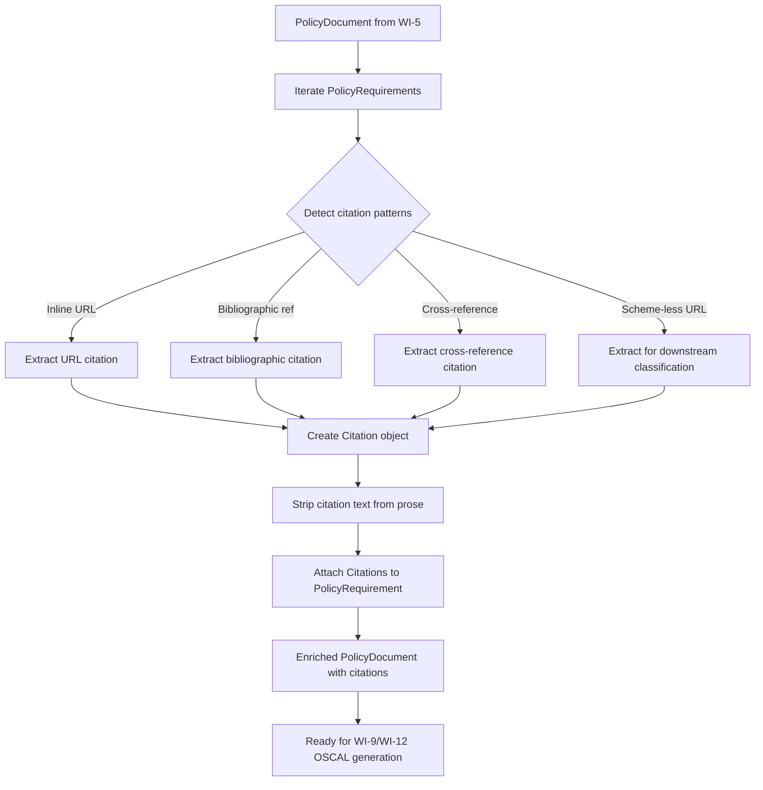
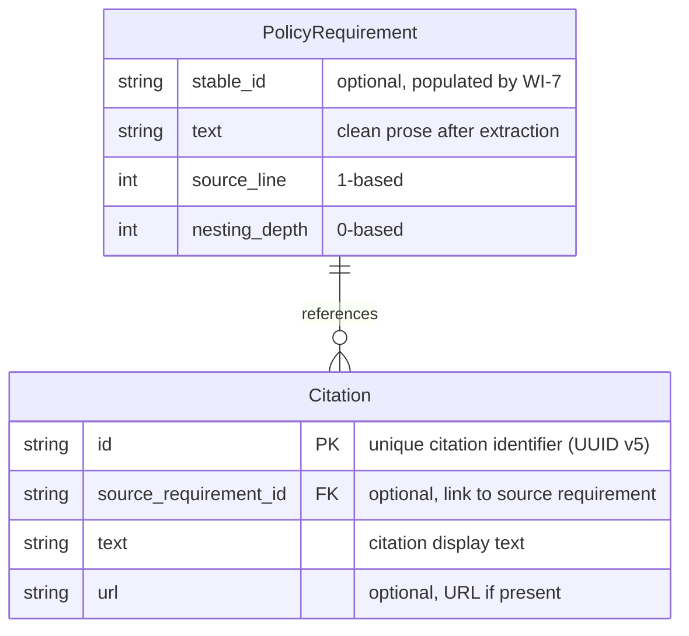
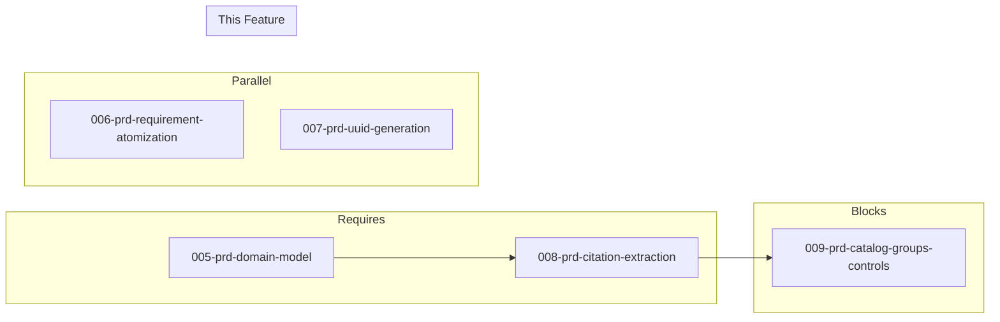

# 008-prd-citation-extraction

> **Document Type:** Product Requirements Document
> **Audience:** LLM agents, human reviewers
> **Status:** Draft
> **Last Updated:** 2026-02-10 <!-- @auto -->
> **Owner:** Brian Luby <!-- @human-required -->

**Feature Branch**: `008-citation-extraction`
**Created**: 2026-02-10
**Status**: Draft
**Input**: Derived from FORGE Product Roadmap WI-8

---

## Review Tier Legend

| Marker | Tier | Speckit Behavior |
|--------|------|------------------|
| 🔴 `@human-required` | Human Generated | Prompt human to author; blocks until complete |
| 🟡 `@human-review` | LLM + Human Review | LLM drafts → prompt human to confirm/edit; blocks until confirmed |
| 🟢 `@llm-autonomous` | LLM Autonomous | LLM completes; no prompt; logged for audit |
| ⚪ `@auto` | Auto-generated | System fills (timestamps, links); no prompt |

---

## Document Completion Order

> ⚠️ **For LLM Agents:** Complete sections in this order. Do not fill downstream sections until upstream human-required inputs exist.

1. **Context** (Background, Scope) → requires human input first
2. **Problem Statement & User Scenarios** → requires human input
3. **Requirements** (Must/Should/Could/Won't) → requires human input
4. **Technical Constraints** → human review
5. **Diagrams, Data Model, Interface** → LLM can draft after above exist
6. **Acceptance Criteria** → derived from requirements
7. **Everything else** → can proceed

---

## Context

### Background 🔴 `@human-required`
This PRD covers **WI-8: Citation and Reference Extraction** from the FORGE Product Roadmap (Sprint S-8, Apr 21–25 2026, Theme T-1: Core Pipeline, Milestone MS-1). Policy documents routinely contain inline citations, URLs, bibliographic references, and cross-references to other documents or standards. Per parent PRD requirement M-9, these citations must not remain embedded in prose or remarks — they must be extracted into a structured `Citation` model so that downstream OSCAL generation (WI-12: Back Matter & Link Patterns) can render them as back matter resources. This work item extends the domain model (WI-5) with a `Citation` struct, implements detection and extraction logic for citation patterns in requirement text, and strips extracted citations from the prose while preserving them for later back matter generation. WI-8 runs in parallel with WI-6 (requirement atomization) and WI-7 (UUID generation), all of which enrich the domain model established in WI-5.

### Scope Boundaries 🟡 `@human-review`

**In Scope:**
- Detecting inline citations, URLs, and cross-references in `PolicyRequirement` text
- Extracting detected citations into `Citation` model objects linked to their source requirement
- Stripping extracted citation text from requirement prose (clean prose for OSCAL control statement generation)
- Preserving extracted citations for later back matter resource generation (WI-12)
- Extending the domain model with a `Citation` struct (id, text, url, source_requirement_id)
- Handling scheme-less URLs gracefully (preserve for downstream back_matter classification)
- Unit tests verifying citation extraction from test fixtures

**Out of Scope:**
- OSCAL back matter resource generation — deferred to WI-12 (012-prd-back-matter-links)
- OSCAL `link` element generation in control bodies — deferred to WI-12
- URL validation or resolution (checking if URLs are reachable) — not in scope; scheme-less URLs are preserved for downstream classification
- Citation deduplication across requirements — deferred to WI-12 when assembling back matter
- PDF or DOCX citation extraction — this WI operates on already-parsed requirement text from the domain model

### Glossary 🟡 `@human-review`

| Term | Definition |
|------|------------|
| Citation | A reference within policy requirement text pointing to an external document, URL, standard, or cross-reference |
| Back Matter | The OSCAL structure for linked/attached resources (citations, evidence) at the end of an OSCAL artifact |
| Inline URL | A URL embedded directly within requirement prose text (e.g., `https://example.com/policy`) |
| Bibliographic Reference | A textual citation to a named document, standard, or regulation (e.g., "NIST SP 800-53 Rev 5") |
| Cross-Reference | A reference from one policy section or requirement to another within the same document |
| Resource | An OSCAL back matter element that represents a citation, link, or attached document |
| rlink | An OSCAL element within a resource for linking to an external URL |

### Related Documents ⚪ `@auto`

| Document | Link | Relationship |
|----------|------|--------------|
| Parent PRD | docs/FORGE_PRD.md | Parent requirement M-9, AC-9, EC-7 |
| Product Roadmap | docs/FORGE_PRODUCT_ROADMAP.md | Sprint S-8 context |
| Depends On | docs/PRD/005-prd-domain-model.md | Domain model structs (PolicyRequirement, PolicyDocument) |
| Parallel With | docs/PRD/006-prd-requirement-atomization.md | Requirement atomization (WI-6) |
| Parallel With | docs/PRD/007-prd-uuid-generation.md | UUID generation (WI-7) |
| Product Vision | docs/FORGE_PRODUCT_VISION.md | Strategic goal G-1 |
| Constitution | .specify/memory/constitution.md | Technical constraints and quality gates |

---

## Problem Statement 🔴 `@human-required`

Policy documents embed citations, URLs, and cross-references directly in requirement prose. If these are left in place during OSCAL generation, they pollute control statement text and violate the OSCAL convention that references belong in back matter as structured resources. Without extraction, downstream OSCAL artifacts would contain unstructured citation text in prose or remarks fields — making citations unsearchable, unlinkable, and inconsistent with NIST guidance (parent PRD M-11 prohibits storing arbitrary data in `remarks`). WI-8 solves this by detecting and extracting citations into a structured `Citation` model, producing clean prose text for control statements and a separate collection of citations ready for back matter assembly in WI-12.

---

## User Scenarios & Testing 🔴 `@human-required`

### User Story 1 — Extract Inline URLs from Requirement Text (Priority: P1)

A policy requirement contains one or more inline URLs that should be extracted and stored as citations, leaving clean prose.

> As a developer working on FORGE, I want inline URLs in requirement text to be detected and extracted into Citation objects so that OSCAL back matter can reference them as structured resources.

**Why this priority**: Inline URLs are the most common and unambiguous citation type. Extracting them is essential to satisfy parent PRD M-9.

**Independent Test**: Parse a requirement containing an inline URL, run citation extraction, and verify the URL is in a Citation object and removed from the prose.

**Acceptance Scenarios**:
1. **Given** a PolicyRequirement with text "Access must comply with https://example.com/policy requirements", **When** citation extraction runs, **Then** a Citation is created with url = "https://example.com/policy" and the requirement text becomes "Access must comply with requirements" (URL stripped).
2. **Given** a PolicyRequirement with multiple URLs in text, **When** citation extraction runs, **Then** one Citation is created per URL and all URLs are stripped from the prose.

---

### User Story 2 — Extract Bibliographic References (Priority: P1)

A policy requirement references external standards or documents by name that should be extracted as citations.

> As a compliance engineer, I want bibliographic references (e.g., "NIST SP 800-53 Rev 5") extracted into Citation objects so that they appear as named resources in OSCAL back matter rather than unstructured inline text.

**Why this priority**: Bibliographic references are fundamental to compliance documents. Extracting them enables structured linking in OSCAL output.

**Independent Test**: Parse a requirement referencing "NIST SP 800-53 Rev 5", run citation extraction, and verify a Citation object captures the reference text.

**Acceptance Scenarios**:
1. **Given** a PolicyRequirement with text "Controls shall align with NIST SP 800-53 Rev 5, Section AC-2", **When** citation extraction runs, **Then** a Citation is created with text = "NIST SP 800-53 Rev 5, Section AC-2" and the reference is stripped from the prose.
2. **Given** a requirement referencing multiple standards, **When** citation extraction runs, **Then** each standard produces a separate Citation object.

---

### User Story 3 — Handle Malformed URLs Gracefully (Priority: P2)

A policy requirement contains a scheme-less URL (e.g., www.example.com) that should be detected and preserved as a citation for downstream validation.

> As a developer working on FORGE, I want scheme-less URLs (e.g., www.example.com) to be detected and preserved as citations so that no data is lost, with downstream back_matter (WI-12) classifying them via OSCAL prop annotations.

**Why this priority**: Per parent PRD EC-7, scheme-less URLs must be preserved (not silently dropped). The back_matter module (WI-12) classifies URLs via `classify_url` and annotates unvalidated ones with OSCAL properties. Data loss is unacceptable for compliance tooling.

**Independent Test**: Parse a requirement with "www.example.com/policy", run citation extraction, and verify a Citation is created with `url: Some("www.example.com/policy")`.

**Acceptance Scenarios**:
1. **Given** a PolicyRequirement with text containing "See www.example.com/policy for details", **When** citation extraction runs, **Then** a Citation is created with `url = Some("www.example.com/policy")` (downstream back_matter classifies as unvalidated via OSCAL prop).
2. **Given** a requirement with a scheme-less URL alongside a full URL, **When** citation extraction runs, **Then** both are extracted as separate Citations — the full URL with its scheme, the scheme-less URL with `url: Some("www....")` for downstream classification.

---

### User Story 4 — Detect Cross-References Between Sections (Priority: P2)

A policy requirement references another section within the same document.

> As a developer working on FORGE, I want internal cross-references (e.g., "See Section 3.2") detected and stored as Citation objects so that OSCAL link elements can be generated downstream.

**Why this priority**: Cross-references are common in policy documents and enable internal linking in OSCAL output, but they are lower priority than external URLs and bibliographic references.

**Independent Test**: Parse a requirement containing "See Section 3.2", run citation extraction, and verify a Citation is created capturing the cross-reference.

**Acceptance Scenarios**:
1. **Given** a PolicyRequirement with text "This control supplements Section 3.2 requirements", **When** citation extraction runs, **Then** a Citation is created with text = "Section 3.2" and no url (internal reference).
2. **Given** a requirement referencing "Appendix A" or "Table 2", **When** citation extraction runs, **Then** Citations are created for each cross-reference.

---

## Assumptions & Risks 🟡 `@human-review`

### Assumptions
- [A-1] Citation extraction operates on `PolicyRequirement.text` after the domain model is assembled (WI-5).
- [A-2] Citation patterns can be detected via regex and pattern matching — no NLP or ML is required at this stage.
- [A-3] The `Citation` struct extends the domain model with a `Vec<Citation>` field on `PolicyRequirement` (default `vec![]`), consistent with the enrichment pattern used for `stable_id` in WI-7.
- [A-4] Citation extraction runs as a pipeline enrichment step, similar to atomization (WI-6) and UUID generation (WI-7).

### Risks
| ID | Risk | Likelihood | Impact | Mitigation |
|----|------|------------|--------|------------|
| R-1 | Bibliographic reference patterns vary widely across policy documents | Med | Med | Start with common patterns (NIST SP, ISO, RFC); expand pattern library iteratively |
| R-2 | Aggressive citation stripping damages requirement prose readability | Low | Med | Preserve a citation marker or placeholder in prose if needed; test with real policy text |
| R-3 | Cross-reference detection produces false positives on ordinary text | Med | Low | Use conservative patterns; require structural cues (e.g., "Section X.Y", "Appendix X") |

---

## Feature Overview

### Flow Diagram 🟡 `@human-review`



### State Diagram (if applicable) 🟡 `@human-review`
N/A — Citation extraction is a stateless transformation pass over the domain model.

---

## Requirements

### Must Have (M) — MVP, launch blockers 🔴 `@human-required`
- [ ] **M-1:** The system shall detect inline URLs (http://, https://) in `PolicyRequirement` text and extract them into `Citation` objects. *(Traces to: Parent PRD M-9)*
- [ ] **M-2:** The system shall strip extracted citation text from `PolicyRequirement.text`, producing clean prose suitable for OSCAL control statements. *(Traces to: Parent PRD M-9)*
- [ ] **M-3:** The `Citation` struct shall include fields for: `id` (unique identifier), `requirement_id` (FK to source requirement), `text` (citation display text), and `url` (optional URL). *(Traces to: Parent PRD M-9, data model)*
- [ ] **M-4:** Each extracted `Citation` shall be linked to the `PolicyRequirement` from which it was extracted. *(Traces to: Parent PRD M-9)*
- [ ] **M-5:** When a scheme-less URL is detected (e.g., www.example.com), the system shall preserve it as a `Citation` with `url: Some(matched_text)` for downstream back_matter classification via OSCAL prop annotations. *(Traces to: Parent PRD EC-7)*
- [ ] **M-6:** Citation extraction shall be implemented as a pipeline enrichment function that takes a `PolicyDocument` and returns an enriched `PolicyDocument` with citations populated. *(Traces to: Parent PRD M-9)*

### Should Have (S) — High value, not blocking 🔴 `@human-required`
- [ ] **S-1:** The system should detect bibliographic references to well-known standards (NIST SP, ISO, RFC, FIPS) and extract them as `Citation` objects with descriptive text.
- [ ] **S-2:** The system should detect internal cross-references (e.g., "Section X.Y", "Appendix X", "Table N") and extract them as `Citation` objects without a URL.
- [ ] **S-3:** The citation extraction function should be idempotent — running it twice on the same document produces the same result.

### Could Have (C) — Nice to have, if time permits 🟡 `@human-review`
- [ ] **C-1:** The system could detect Markdown-style links (`[text](url)`) and extract both the display text and URL into the `Citation`.
- [ ] **C-2:** The system could provide a summary log (count of citations extracted by type: URL, bibliographic, cross-reference) for CLI output.

### Won't Have (W) — Explicitly deferred 🟡 `@human-review`
- [ ] **W-1:** OSCAL back matter resource generation — *Reason: Deferred to WI-12 (Back Matter & Link Patterns)*
- [ ] **W-2:** Citation deduplication across requirements — *Reason: Deferred to WI-12 when assembling back matter*
- [ ] **W-3:** URL reachability validation — *Reason: Out of scope; FORGE does not perform network requests during conversion*
- [ ] **W-4:** NLP-based citation detection — *Reason: Regex/pattern matching is sufficient for MVP; ML deferred to future phases*

---

## Technical Constraints 🟡 `@human-review`

- **Language/Framework:** Rust (latest stable)
- **Pattern Matching:** Use `regex` crate for URL and citation pattern detection
- **Error Handling:** `thiserror` for extraction errors (per constitution principle VIII)
- **Design:** Citation extraction must be a pure enrichment pass — it reads `PolicyRequirement.text`, extracts citations, and updates both the text and the citations field
- **Testing:** TDD mandatory; comprehensive unit tests for each citation type with test fixtures
- **Dependencies:** Depends on WI-5 domain model structs being defined; runs in parallel with WI-6 and WI-7
- **Performance:** Citation extraction must handle documents with hundreds of requirements without noticeable delay

---

## Data Model (if applicable) 🟡 `@human-review`



---

## Interface Contract (if applicable) 🟡 `@human-review`

```rust
/// A citation extracted from policy requirement text
#[derive(Debug, Clone, PartialEq, Serialize)]
pub struct Citation {
    /// Unique identifier for this citation (UUID v5)
    pub id: String,
    /// Display text of the citation (standard name, reference label, URL text)
    pub text: String,
    /// URL if the citation contains a link; None for bibliographic/cross-refs
    pub url: Option<String>,
    /// stable_id of the source PolicyRequirement (populated during extraction)
    pub source_requirement_id: Option<String>,
}

/// Enrichment function: extract citations from all requirements in a document
pub fn extract_citations(
    document: &mut PolicyDocument,
) -> Result<(), ForgeError>;

/// Lower-level: extract citations from a single requirement's text
/// Returns (cleaned_text, extracted_citations)
pub fn extract_citations_from_text(
    requirement_id: &str,
    text: &str,
) -> Result<(String, Vec<Citation>), ForgeError>;
```

The `PolicyRequirement` struct (from WI-5) gains an additional field:

```rust
pub struct PolicyRequirement {
    pub stable_id: Option<String>,    // populated by WI-7
    pub text: String,                  // cleaned after citation extraction
    pub source_line: usize,
    pub nesting_depth: u8,
    pub citations: Vec<Citation>,      // populated by WI-8 (this WI)
}
```

---

## Evaluation Criteria 🟡 `@human-review`

| Criterion | Weight | Metric | Target | Notes |
|-----------|--------|--------|--------|-------|
| URL Extraction | Critical | Inline URLs detected and extracted | 100% of well-formed URLs | Core functionality |
| Prose Cleaning | Critical | Extracted citations removed from text | Clean prose with no embedded URLs | Required for OSCAL control statements |
| Malformed URL Handling | Critical | Malformed URLs preserved with flag | 100% preserved, none silently dropped | Per parent PRD EC-7 |
| Citation-Requirement Linking | Critical | Every Citation linked to source requirement | 100% linked | Foundation for back matter traceability |

---

## Tool/Approach Candidates 🟡 `@human-review`

| Option | License | Pros | Cons | Spike Result |
|--------|---------|------|------|--------------|
| regex crate | MIT/Apache-2.0 | Standard Rust regex; fast, well-maintained | Complex patterns can be hard to maintain | Selected |
| url crate (for validation) | MIT/Apache-2.0 | Standard URL parsing; validates well-formedness | Only handles URLs, not bibliographic refs | Complementary |
| nom (parser combinators) | MIT | Powerful structured parsing | Overkill for citation patterns | Not selected |

### Selected Approach 🔴 `@human-required`
> **Decision:** Use `regex` crate for pattern detection; `url` crate for URL validation; plain struct for the Citation model
> **Rationale:** Regex provides sufficient pattern matching for URL, bibliographic, and cross-reference patterns. Scheme-less URLs are preserved with `url: Some(matched_text)` for downstream back_matter classification (enabling EC-7 compliance). No heavier parsing framework is needed at this stage.

---

## Acceptance Criteria 🟡 `@human-review`

| AC ID | Requirement | User Story | Given | When | Then |
|-------|-------------|------------|-------|------|------|
| AC-1 | M-1, M-2 | US-1 | A PolicyRequirement with text containing "https://example.com/policy" | Running citation extraction | A Citation is created with the URL and the URL is stripped from the prose |
| AC-2 | M-1, M-4 | US-1 | A PolicyRequirement with multiple inline URLs | Running citation extraction | One Citation per URL, each linked to the source requirement |
| AC-3 | M-3, M-4 | US-1 | Any extracted citation | Inspecting the Citation object | Fields id, requirement_id, text, and url are populated correctly |
| AC-4 | M-5 | US-3 | A PolicyRequirement with a scheme-less URL (e.g., "www.example.com/policy") | Running citation extraction | Citation is created with `url: Some("www.example.com/policy")` for downstream back_matter classification |
| AC-5 | M-6 | US-1 | A PolicyDocument with multiple requirements containing citations | Running extract_citations() | All requirements are processed; citations attached; prose cleaned |
| AC-6 | S-1 | US-2 | A PolicyRequirement referencing "NIST SP 800-53 Rev 5" | Running citation extraction | A Citation is created with text capturing the bibliographic reference |
| AC-7 | S-2 | US-4 | A PolicyRequirement containing "See Section 3.2" | Running citation extraction | A Citation is created with text = "Section 3.2" and url = None |

### Edge Cases 🟢 `@llm-autonomous`
- [ ] **EC-1:** (M-1) When a requirement contains no citations, URLs, or references, then the text is unchanged and no Citations are created.
- [ ] **EC-2:** (M-2) When stripping a URL leaves awkward whitespace or punctuation (e.g., double spaces, trailing commas), then the prose is normalized (extra whitespace collapsed).
- [ ] **EC-3:** (M-5) When a URL is missing its scheme (e.g., "www.example.com/policy"), then it is extracted as a Citation with `url: Some("www.example.com/policy")` for downstream back_matter classification.
- [ ] **EC-4:** (M-1) When a URL appears in parentheses (e.g., "(https://example.com)"), then the URL is extracted without the surrounding parentheses.
- [ ] **EC-5:** (M-1) When the same URL appears multiple times in one requirement, then each occurrence produces a separate Citation (deduplication deferred to WI-12).
- [ ] **EC-6:** (S-2) When text contains a partial cross-reference pattern that is ambiguous (e.g., "section" in lowercase without a number), then it is not extracted (conservative matching).
- [ ] **EC-7:** (M-6) When citation extraction is run on a document with zero requirements, then no error occurs and the document is returned unchanged.

---

## Dependencies 🟡 `@human-review`



- **Requires:** [005-prd-domain-model](docs/PRD/005-prd-domain-model.md) — Citation struct extends the domain model; extraction operates on PolicyRequirement text
- **Parallel With:** [006-prd-requirement-atomization](docs/PRD/006-prd-requirement-atomization.md) (WI-6), [007-prd-uuid-generation](docs/PRD/007-prd-uuid-generation.md) (WI-7)
- **Blocks:** [009-prd-catalog-groups-controls](docs/PRD/009-prd-catalog-groups-controls.md) (WI-9) — Catalog generation needs citations for back matter assembly
- **External:** `regex` crate, `url` crate (both well-established Rust ecosystem crates)

---

## Security Considerations 🟡 `@human-review`

| Aspect | Assessment | Notes |
|--------|------------|-------|
| Internet Exposure | No | Citation extraction is offline; no URL resolution or network access |
| Sensitive Data | Yes | Citation text and URLs from policy documents may contain sensitive references |
| Authentication Required | No | Local CLI tool |
| Security Review Required | No | Regex patterns operate on already-parsed text; no external input injection risk beyond the source document |

---

## Implementation Guidance 🟢 `@llm-autonomous`

### Suggested Approach
Implement citation extraction as an enrichment pass in the pipeline, similar to atomization (WI-6) and UUID generation (WI-7). Create a `citation` module with extraction functions. Start with URL detection using a well-tested regex pattern for http/https URLs. Add a secondary regex for scheme-less URLs (`www.` prefix) — these are preserved with `url: Some(matched_text)` for downstream back_matter classification (WI-12). For bibliographic references, define regex patterns for common standard naming conventions (e.g., `NIST SP \d+-\d+`, `ISO \d+`, `RFC \d+`, `FIPS \d+`). For cross-references, match patterns like `Section \d+(\.\d+)*`, `Appendix [A-Z]`, `Table \d+`. After extracting all citations, strip the matched text from the requirement prose and normalize whitespace. Add the `citations: Vec<Citation>` field to `PolicyRequirement` (defaulting to an empty Vec). Write unit tests using test fixture strings that represent realistic policy requirement text.

### Anti-patterns to Avoid
- Embedding OSCAL back matter logic in this module — citation extraction produces the data model; back matter assembly is WI-12
- Using overly aggressive regex that matches ordinary text as citations (e.g., matching any number after "section" in prose)
- Silently dropping scheme-less URLs — parent PRD EC-7 explicitly requires preservation for downstream classification
- Modifying `PolicyRequirement` in place without returning updated text — use a functional transformation pattern returning (cleaned_text, citations)

### Reference Examples
- Parent PRD data model (docs/FORGE_PRD.md): Citation struct definition with id, requirement_id, text, url
- NIST OSCAL back matter examples: how citations appear as resources with rlinks
- regex crate URL patterns: https://docs.rs/regex/latest/regex/

---

## Spike Tasks 🟡 `@human-review`

N/A — No spike tasks for this work item. The `regex` and `url` crates are well-established; no evaluation needed.

---

## Success Metrics 🔴 `@human-required`

| Metric | Baseline | Target | Measurement Method |
|--------|----------|--------|-------------------|
| URL citation extraction | N/A | 100% of inline URLs extracted from test fixtures | Unit tests |
| Prose cleaning | N/A | No residual citation text in requirement prose | Unit tests |
| Scheme-less URL preservation | N/A | 100% preserved with `url: Some(matched_text)` | Unit tests with scheme-less URL fixtures |
| Citation-requirement linking | N/A | Every Citation linked to its source requirement | Unit tests |

### Technical Verification 🟢 `@llm-autonomous`
| Metric | Target | Verification Method |
|--------|--------|---------------------|
| Test coverage | >90% | `cargo test` + coverage tool |
| No clippy warnings | 0 | `cargo clippy -- -D warnings` |
| No formatting violations | 0 | `cargo fmt --check` |

---

## Definition of Ready 🔴 `@human-required`

### Readiness Checklist
- [x] Problem statement reviewed and validated by stakeholder
- [x] All Must Have requirements have acceptance criteria
- [x] Technical constraints are explicit and agreed
- [x] Dependencies identified and owners confirmed
- [x] Security review completed (or N/A documented with justification)
- [x] No open questions blocking implementation

### Sign-off
| Role | Name | Date | Decision |
|------|------|------|----------|
| Product Owner | Brian Luby | YYYY-MM-DD | [Ready / Not Ready] |

---

## Changelog ⚪ `@auto`

| Version | Date | Author | Changes |
|---------|------|--------|---------|
| 0.1 | 2026-02-10 | LLM (Claude) | Initial draft derived from FORGE Product Roadmap WI-8 |

---

## Decision Log 🟡 `@human-review`

| Date | Decision | Rationale | Alternatives Considered |
|------|----------|-----------|------------------------|
| 2026-02-10 | Use regex + url crates for citation detection | Regex is sufficient for URL and pattern-based citation detection; url crate provides reliable well-formedness validation | NLP-based extraction (overkill for MVP), nom parser combinators (unnecessary complexity) |
| 2026-02-10 | Preserve scheme-less URLs for downstream classification rather than dropping them | Parent PRD EC-7 mandates preservation; back_matter (WI-12) classifies via OSCAL prop annotations; data loss is unacceptable for compliance tooling | Drop scheme-less URLs (violates EC-7), attempt auto-correction (unreliable) |
| 2026-02-10 | Citation extraction as pipeline enrichment pass (not inline during parsing) | Keeps extraction decoupled from parsing; enables independent testing and parallel development with WI-6/WI-7 | Inline extraction during WI-4 clause parsing (tight coupling, blocks parallelism) |

---

## Open Questions 🟡 `@human-review`

No open questions for this work item.

---

## Review Checklist 🟢 `@llm-autonomous`

Before marking as Approved:
- [x] All requirements have unique IDs (M-1 through M-6, S-1 through S-3, C-1 through C-2, W-1 through W-4)
- [x] All Must Have requirements have linked acceptance criteria
- [x] User stories are prioritized and independently testable
- [x] Acceptance criteria reference both requirement IDs and user stories
- [x] Glossary terms are used consistently throughout
- [x] Diagrams use terminology from Glossary
- [x] Security considerations documented
- [x] Definition of Ready checklist is complete
- [x] No open questions blocking implementation
