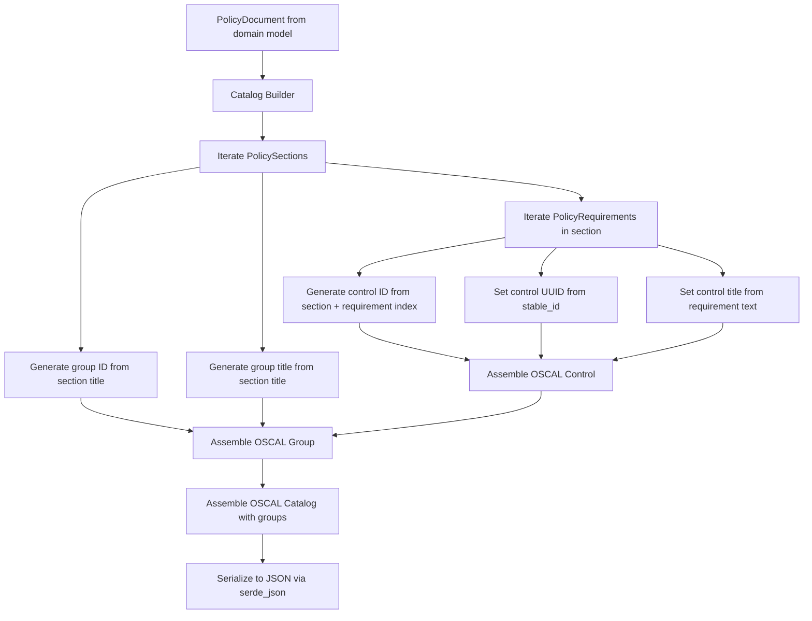
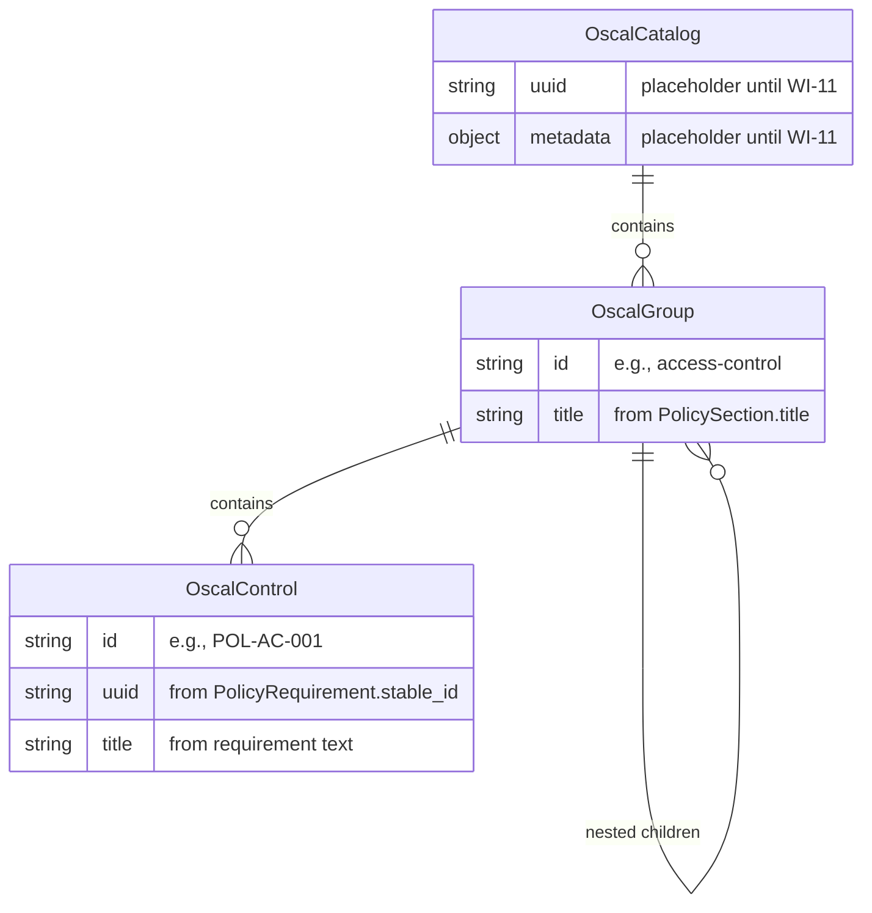
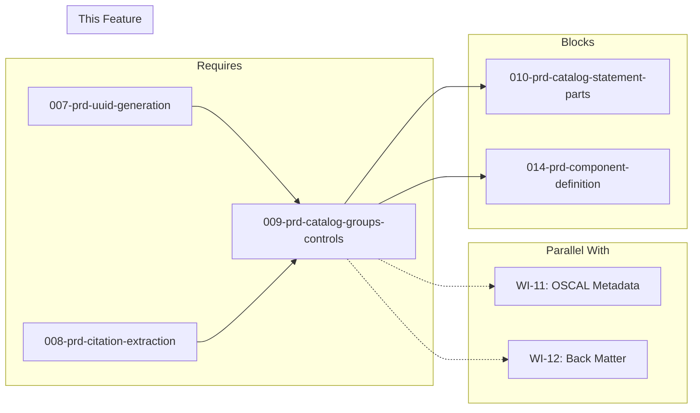

# 009-prd-catalog-groups-controls

> **Document Type:** Product Requirements Document
> **Audience:** LLM agents, human reviewers
> **Status:** Draft
> **Last Updated:** 2026-02-10 <!-- @auto -->
> **Owner:** Brian Luby <!-- @human-required -->

**Feature Branch**: `009-catalog-groups-controls`
**Created**: 2026-02-10
**Status**: Draft
**Input**: Derived from FORGE Product Roadmap WI-9

---

## Review Tier Legend

| Marker | Tier | Speckit Behavior |
|--------|------|------------------|
| 🔴 `@human-required` | Human Generated | Prompt human to author; blocks until complete |
| 🟡 `@human-review` | LLM + Human Review | LLM drafts → prompt human to confirm/edit; blocks until confirmed |
| 🟢 `@llm-autonomous` | LLM Autonomous | LLM completes; no prompt; logged for audit |
| ⚪ `@auto` | Auto-generated | System fills (timestamps, links); no prompt |

---

## Document Completion Order

> ⚠️ **For LLM Agents:** Complete sections in this order. Do not fill downstream sections until upstream human-required inputs exist.

1. **Context** (Background, Scope) → requires human input first
2. **Problem Statement & User Scenarios** → requires human input
3. **Requirements** (Must/Should/Could/Won't) → requires human input
4. **Technical Constraints** → human review
5. **Diagrams, Data Model, Interface** → LLM can draft after above exist
6. **Acceptance Criteria** → derived from requirements
7. **Everything else** → can proceed

---

## Context

### Background 🔴 `@human-required`
This PRD covers **WI-9: OSCAL Catalog JSON — Groups and Controls** from the FORGE Product Roadmap (Sprint S-9, Apr 28–May 2 2026, Theme T-2: OSCAL Model Generation, Milestone MS-2). This is the first OSCAL generation work item in the pipeline. After ingestion (WI-2), structural extraction (WI-3, WI-4), domain model assembly (WI-5), requirement atomization (WI-6), UUID generation (WI-7), and citation extraction (WI-8), the pipeline now has a fully enriched `PolicyDocument` ready for OSCAL mapping. WI-9 converts this domain model into the top-level OSCAL Catalog JSON structure: `PolicySection`s map to `catalog.groups[]` and `PolicyRequirement`s map to `catalog.groups[].controls[]`. Control IDs are generated following a naming pattern (e.g., `POL-AC-001`) derived from section context and requirement index. This work item produces the skeletal Catalog structure; statement parts (WI-10), metadata (WI-11), and back matter (WI-12) are added in subsequent sprints.

### Scope Boundaries 🟡 `@human-review`

**In Scope:**
- Implementing a Catalog JSON builder that maps `PolicySection`s to OSCAL `groups[]`
- Mapping `PolicyRequirement`s to OSCAL `controls[]` within their parent groups
- Generating control IDs (e.g., `POL-AC-001`) from section context and requirement index
- Generating group IDs from section titles (e.g., `access-control` from "Access Control Policies")
- Serializing the Catalog structure to JSON using `serde` / `serde_json`
- Unit tests verifying correct mapping from domain model to OSCAL Catalog groups and controls

**Out of Scope:**
- Control statement parts and prose — deferred to WI-10 (010-prd-catalog-statement-parts)
- OSCAL metadata assembly (uuid, title, last-modified, version, oscal-version) — deferred to WI-11 (011-prd-oscal-metadata)
- Back matter resources from citations — deferred to WI-12 (012-prd-back-matter)
- OSCAL JSON schema validation — deferred to WI-19+
- End-to-end CLI wiring (`--strategy catalog --format json`) — deferred to WI-13
- Component Definition generation — deferred to WI-14 (014-prd-component-definition)
- XML or YAML output formats — deferred to later work items

### Glossary 🟡 `@human-review`

| Term | Definition |
|------|------------|
| OSCAL Catalog | The OSCAL model representing a structured collection of controls (requirements), with a root `catalog` object |
| Group | An OSCAL construct within a Catalog that organizes related controls; maps to a policy section |
| Control | An OSCAL construct representing a single security requirement or policy statement within a group |
| Control ID | A human-readable identifier for a control (e.g., `POL-AC-001`), distinct from the control's UUID |
| PolicySection | The domain model struct representing a hierarchical section within a parsed policy document |
| PolicyRequirement | The domain model struct representing an individual policy requirement extracted from clauses |
| PolicyDocument | The top-level domain model struct representing an entire parsed policy document |
| serde | Rust framework for serializing and deserializing data structures |
| serde_json | Rust crate for JSON serialization/deserialization using serde |

### Related Documents ⚪ `@auto`

| Document | Link | Relationship |
|----------|------|--------------|
| Parent PRD | docs/FORGE_PRD.md | Parent requirement M-3, AC-3 |
| Product Roadmap | docs/FORGE_PRODUCT_ROADMAP.md | Sprint S-9 context |
| OSCAL Research | docs/research/OSCAL_Research.md | Catalog model structure and sample JSON |
| Depends On | docs/PRD/005-prd-domain-model.md | PolicyDocument, PolicySection, PolicyRequirement structs |
| Depends On (D-2) | docs/PRD/007-prd-uuid-generation.md | Stable UUID generation for controls and groups |
| Depends On (D-3) | docs/PRD/008-prd-citation-extraction.md | Citation model (referenced but not mapped to back matter until WI-12) |
| Constitution | .specify/memory/constitution.md | Technical constraints and quality gates |

---

## Problem Statement 🔴 `@human-required`

The pipeline can now ingest, parse, and assemble a fully enriched `PolicyDocument` with atomized requirements, stable UUIDs, and extracted citations. However, no mechanism exists to convert this domain model into OSCAL output. The first step in OSCAL generation is building the Catalog's group and control structure — the skeletal hierarchy that all other Catalog elements (statement parts, metadata, back matter) attach to. Without this mapping layer, the pipeline produces an internal representation with no OSCAL output, and downstream work items (WI-10, WI-11, WI-12, WI-14) have no structure to build upon. This work item bridges the domain model and the OSCAL Catalog model, establishing the core mapping: sections become groups, requirements become controls.

---

## User Scenarios & Testing 🔴 `@human-required`

### User Story 1 — Generate Catalog Groups from Policy Sections (Priority: P1)

The pipeline converts policy sections into OSCAL Catalog groups, preserving the section hierarchy.

> As a developer working on FORGE, I want policy sections to map to OSCAL Catalog groups so that the generated Catalog reflects the organizational structure of the source policy document.

**Why this priority**: Groups are the top-level organizational structure in a Catalog. Without groups, controls have no container and the Catalog has no structure.

**Independent Test**: Build a `PolicyDocument` with 3 sections and call the Catalog builder; verify the output JSON has 3 entries in `catalog.groups[]` with correct titles and IDs.

**Acceptance Scenarios**:
1. **Given** a PolicyDocument with sections "Access Control", "Data Protection", and "Incident Response", **When** the Catalog builder runs, **Then** `catalog.groups[]` contains 3 groups with IDs derived from section titles (e.g., `access-control`, `data-protection`, `incident-response`) and matching titles.
2. **Given** a PolicySection with nested child sections, **When** the Catalog builder runs, **Then** the parent group contains the child sections as nested groups (if applicable) or the hierarchy is flattened with controls in their respective groups.

---

### User Story 2 — Generate Catalog Controls from Policy Requirements (Priority: P1)

Each policy requirement is mapped to an OSCAL control within its parent group.

> As a developer working on FORGE, I want policy requirements to map to OSCAL controls so that each individual requirement is addressable as a discrete control in the Catalog.

**Why this priority**: Controls are the fundamental addressable unit in OSCAL. Every downstream operation (profiling, component mapping, assessment) operates on controls.

**Independent Test**: Build a `PolicyDocument` with 2 sections containing 3 and 4 requirements respectively, call the Catalog builder, and verify 7 controls are distributed across 2 groups with correct IDs.

**Acceptance Scenarios**:
1. **Given** a PolicyDocument with a section "Access Control" containing 3 requirements, **When** the Catalog builder runs, **Then** the "access-control" group contains 3 controls with IDs `POL-AC-001`, `POL-AC-002`, `POL-AC-003`.
2. **Given** a PolicyRequirement with a stable_id from WI-7, **When** mapped to a control, **Then** the control's UUID is set to the requirement's stable_id.

---

### User Story 3 — Generate Control IDs from Section Context (Priority: P1)

Control IDs follow a deterministic naming pattern derived from section and requirement context.

> As a compliance engineer, I want control IDs to follow a meaningful naming convention (e.g., `POL-AC-001`) so that controls are human-readable and traceable to their source policy section.

**Why this priority**: Human-readable control IDs are essential for usability. They enable compliance engineers to quickly identify which policy section a control belongs to and its position within that section.

**Independent Test**: Build a `PolicyDocument` with a section titled "Access Control" and 2 requirements, verify the generated control IDs are `POL-AC-001` and `POL-AC-002`.

**Acceptance Scenarios**:
1. **Given** a section titled "Access Control" with 3 requirements, **When** generating control IDs, **Then** IDs are `POL-AC-001`, `POL-AC-002`, `POL-AC-003`.
2. **Given** a section titled "Incident Response and Recovery" with 1 requirement, **When** generating control IDs, **Then** the ID follows the pattern (e.g., `POL-IR-001`) using an abbreviation derived from the section title.
3. **Given** two sections with potentially colliding abbreviations, **When** generating control IDs, **Then** IDs remain unique across the entire Catalog.

---

## Assumptions & Risks 🟡 `@human-review`

### Assumptions
- [A-1] The `PolicyDocument` is fully assembled by upstream WIs (WI-5 through WI-8) before the Catalog builder is invoked.
- [A-2] Each `PolicyRequirement` has a `stable_id` populated by WI-7 (UUID generation) that becomes the control's UUID.
- [A-3] Section titles are sufficiently descriptive to derive meaningful group IDs and control ID prefixes.
- [A-4] The OSCAL Catalog JSON structure follows v1.2.0 schema conventions (groups contain controls, each with `id` and `title`).
- [A-5] At this stage, controls are skeletal — they have `id`, `title`, and `uuid` but no `parts[]` (added in WI-10), no metadata (WI-11), and no back matter links (WI-12).

### Risks
| ID | Risk | Likelihood | Impact | Mitigation |
|----|------|------------|--------|------------|
| R-1 | Control ID abbreviation collisions across sections with similar titles | Med | Med | Implement a collision-detection mechanism; append numeric suffix or use longer abbreviation on collision |
| R-2 | Nested section hierarchy does not map cleanly to OSCAL group nesting | Low | Med | Start with flat group mapping (one level); add nested group support iteratively if needed |
| R-3 | PolicyDocument structure changes in upstream WIs break the Catalog builder | Low | Med | Use the stable domain model interface defined in WI-5; rely on Rust compiler to catch breaking changes |

---

## Feature Overview

### Flow Diagram 🟡 `@human-review`



### State Diagram (if applicable) 🟡 `@human-review`
N/A — No state transitions in this work item. The builder is a pure function: domain model in, OSCAL Catalog JSON out.

---

## Requirements

### Must Have (M) — MVP, launch blockers 🔴 `@human-required`
- [ ] **M-1:** The Catalog builder shall map each `PolicySection` in the domain model to an OSCAL `group` in `catalog.groups[]`, preserving section order. *(Traces to: Parent PRD M-3)*
- [ ] **M-2:** Each OSCAL group shall have an `id` derived from the section title (e.g., `access-control` from "Access Control Policies") and a `title` matching the section title. *(Traces to: Parent PRD M-3)*
- [ ] **M-3:** The Catalog builder shall map each `PolicyRequirement` within a section to an OSCAL `control` in the parent group's `controls[]` array, preserving requirement order. *(Traces to: Parent PRD M-3)*
- [ ] **M-4:** Each OSCAL control shall have a human-readable `id` generated from section context and requirement index (e.g., `POL-AC-001`). *(Traces to: Parent PRD M-3)*
- [ ] **M-5:** Each OSCAL control shall have a `title` derived from the requirement text (first sentence or truncated text). *(Traces to: Parent PRD M-3)*
- [ ] **M-6:** Each OSCAL control shall include a UUID sourced from the `PolicyRequirement.stable_id` field (populated by WI-7). *(Traces to: Parent PRD M-8)*
- [ ] **M-7:** The Catalog builder shall serialize the assembled Catalog structure to valid JSON using `serde` / `serde_json`. *(Traces to: Parent PRD M-3, M-7)*
- [ ] **M-8:** Control IDs shall be unique across the entire generated Catalog. *(Traces to: Parent PRD M-3)*

### Should Have (S) — High value, not blocking 🔴 `@human-required`
- [ ] **S-1:** Group IDs shall be unique across the Catalog; the builder shall detect and resolve collisions by appending a numeric suffix.
- [ ] **S-2:** The Catalog builder shall handle nested `PolicySection` children by generating nested OSCAL groups or flattening with disambiguated control IDs.
- [ ] **S-3:** The control ID abbreviation (e.g., `AC` from "Access Control") shall be configurable or derived via a deterministic abbreviation algorithm that produces stable results across runs.

### Could Have (C) — Nice to have, if time permits 🟡 `@human-review`
- [ ] **C-1:** The Catalog builder could accept an optional prefix parameter (default: `POL`) for control IDs, allowing customization (e.g., `SEC-AC-001` instead of `POL-AC-001`).
- [ ] **C-2:** The Catalog builder could emit warnings for sections with zero requirements (empty groups).

### Won't Have (W) — Explicitly deferred 🟡 `@human-review`
- [ ] **W-1:** Control statement parts and prose — *Reason: Deferred to WI-10 (statement parts)*
- [ ] **W-2:** OSCAL metadata assembly — *Reason: Deferred to WI-11 (metadata)*
- [ ] **W-3:** Back matter resources — *Reason: Deferred to WI-12 (back matter)*
- [ ] **W-4:** OSCAL JSON schema validation — *Reason: Deferred to WI-19+*
- [ ] **W-5:** CLI integration (`--strategy catalog --format json`) — *Reason: Deferred to WI-13 (end-to-end pipeline wiring)*
- [ ] **W-6:** XML or YAML output — *Reason: Deferred to later work items (S-3, S-4 of parent PRD)*

---

## Technical Constraints 🟡 `@human-review`

- **Language/Framework:** Rust (latest stable)
- **Serialization:** `serde` and `serde_json` for JSON output; OSCAL structs must derive `Serialize`
- **OSCAL Version:** Target OSCAL v1.2.0 Catalog structure
- **Error Handling:** `thiserror` for builder errors (per constitution principle VIII)
- **Testing:** TDD mandatory per constitution principle IV; comprehensive unit tests for all mapping logic
- **Dependencies:** `serde`, `serde_json` at latest stable versions per constitution principle XI
- **Module Location:** Builder logic in the `oscal` module (established in WI-1 scaffolding)
- **Design:** The builder must be a pure function: `PolicyDocument` in, OSCAL Catalog struct out. No side effects, no file I/O.

---

## Data Model (if applicable) 🟡 `@human-review`



**Mapping from Domain Model to OSCAL Catalog:**

| Domain Model | OSCAL Catalog | Notes |
|-------------|---------------|-------|
| `PolicyDocument` | `catalog` | Top-level container |
| `PolicySection` | `catalog.groups[]` | One group per top-level section |
| `PolicySection.title` | `group.title` | Direct mapping |
| `PolicySection.title` (derived) | `group.id` | Slugified/abbreviated form |
| `PolicyRequirement` | `group.controls[]` | One control per requirement |
| `PolicyRequirement.stable_id` | `control.uuid` | From WI-7 UUID generation |
| `PolicyRequirement.text` (derived) | `control.title` | First sentence or truncated |
| Section + requirement index | `control.id` | Pattern: `POL-{ABBR}-{NNN}` |

---

## Interface Contract (if applicable) 🟡 `@human-review`

```rust
use serde::Serialize;

/// OSCAL Catalog root structure (partial — metadata and back matter added by WI-11, WI-12)
#[derive(Debug, Serialize)]
pub struct OscalCatalog {
    /// Placeholder UUID — populated by WI-11
    pub uuid: String,
    /// Placeholder metadata — populated by WI-11
    pub metadata: OscalMetadata,
    /// Groups mapped from PolicySections
    #[serde(skip_serializing_if = "Vec::is_empty")]
    pub groups: Vec<OscalGroup>,
}

/// OSCAL Group mapped from a PolicySection
#[derive(Debug, Serialize)]
pub struct OscalGroup {
    /// Human-readable group ID (e.g., "access-control")
    pub id: String,
    /// Group title from PolicySection.title
    pub title: String,
    /// Controls mapped from PolicyRequirements
    #[serde(skip_serializing_if = "Vec::is_empty")]
    pub controls: Vec<OscalControl>,
    /// Nested child groups (from nested PolicySections)
    #[serde(skip_serializing_if = "Vec::is_empty")]
    pub groups: Vec<OscalGroup>,
}

/// OSCAL Control mapped from a PolicyRequirement
#[derive(Debug, Serialize)]
pub struct OscalControl {
    /// Human-readable control ID (e.g., "POL-AC-001")
    pub id: String,
    /// Stable UUID from PolicyRequirement.stable_id (WI-7)
    pub uuid: String,
    /// Control title derived from requirement text
    pub title: String,
    // parts: Vec<OscalPart> — added by WI-10
    // props: Vec<OscalProp> — added by later WIs
    // links: Vec<OscalLink> — added by WI-12
}

/// Placeholder metadata struct — fully implemented in WI-11
#[derive(Debug, Serialize)]
pub struct OscalMetadata {
    pub title: String,
    #[serde(rename = "last-modified")]
    pub last_modified: String,
    pub version: String,
    #[serde(rename = "oscal-version")]
    pub oscal_version: String,
}

/// Build an OSCAL Catalog from a PolicyDocument
///
/// Maps PolicySections to groups and PolicyRequirements to controls.
/// Returns the Catalog struct ready for JSON serialization.
pub fn build_catalog(document: &PolicyDocument) -> Result<OscalCatalog, ForgeError>;

/// Generate a control ID from section context and requirement index
///
/// Pattern: POL-{SECTION_ABBR}-{NNN}
/// Example: POL-AC-001
fn generate_control_id(
    section_abbreviation: &str,
    requirement_index: usize,
    prefix: &str,  // default: "POL"
) -> String;

/// Generate a group ID from a section title
///
/// Slugifies the title: lowercase, hyphens, alphanumeric only
/// Example: "Access Control Policies" -> "access-control-policies"
fn generate_group_id(section_title: &str) -> String;

/// Generate a section abbreviation from a section title
///
/// Takes initials of significant words: "Access Control" -> "AC"
/// "Incident Response and Recovery" -> "IR"
fn generate_section_abbreviation(section_title: &str) -> String;
```

**Sample Output JSON (WI-9 scope only — no parts, minimal metadata placeholder):**

```json
{
  "catalog": {
    "uuid": "placeholder-populated-by-wi-11",
    "metadata": {
      "title": "placeholder",
      "last-modified": "1970-01-01T00:00:00Z",
      "version": "0.0.0",
      "oscal-version": "1.2.0"
    },
    "groups": [
      {
        "id": "access-control",
        "title": "Access Control",
        "controls": [
          {
            "id": "POL-AC-001",
            "uuid": "a1b2c3d4-...",
            "title": "Multi-factor authentication for privileged access"
          },
          {
            "id": "POL-AC-002",
            "uuid": "e5f6g7h8-...",
            "title": "Access reviews conducted quarterly"
          }
        ]
      },
      {
        "id": "data-protection",
        "title": "Data Protection",
        "controls": [
          {
            "id": "POL-DP-001",
            "uuid": "i9j0k1l2-...",
            "title": "Sensitive data encrypted at rest"
          }
        ]
      }
    ]
  }
}
```

---

## Evaluation Criteria 🟡 `@human-review`

| Criterion | Weight | Metric | Target | Notes |
|-----------|--------|--------|--------|-------|
| Group Mapping Accuracy | Critical | All PolicySections mapped to groups | 100% | No sections dropped or duplicated |
| Control Mapping Accuracy | Critical | All PolicyRequirements mapped to controls | 100% | No requirements dropped or duplicated |
| Control ID Uniqueness | Critical | No duplicate control IDs in output | 0 collisions | Verified by unit tests |
| JSON Validity | Critical | Output is valid JSON | Parseable by any JSON parser | Verified by serde_json serialization |
| Control ID Pattern | High | IDs follow `POL-{ABBR}-{NNN}` pattern | 100% compliance | Human-readable and deterministic |

---

## Tool/Approach Candidates 🟡 `@human-review`

| Option | License | Pros | Cons | Spike Result |
|--------|---------|------|------|--------------|
| serde + serde_json | MIT/Apache-2.0 | Standard Rust serialization; derive macros; widely used | None significant | Selected per constitution |
| Manual JSON string building | N/A | No dependency | Fragile, error-prone, no type safety | Rejected |
| oscal-rs (third-party OSCAL crate) | Unknown | Pre-built OSCAL types | Immature, may not support v1.2.0, adds external dependency | Not evaluated; build custom types |

### Selected Approach 🔴 `@human-required`
> **Decision:** Define custom OSCAL Catalog structs with `serde::Serialize` derives; use `serde_json` for JSON output
> **Rationale:** Custom structs give full control over the OSCAL structure, field naming, and serialization behavior. serde/serde_json is the standard Rust approach per the constitution technology stack. Building custom types avoids dependency on immature third-party OSCAL crates and ensures exact v1.2.0 compliance.

---

## Acceptance Criteria 🟡 `@human-review`

| AC ID | Requirement | User Story | Given | When | Then |
|-------|-------------|------------|-------|------|------|
| AC-1 | M-1, M-2 | US-1 | A PolicyDocument with 3 sections ("Access Control", "Data Protection", "Incident Response") | Calling `build_catalog()` | `catalog.groups[]` has 3 groups with IDs `access-control`, `data-protection`, `incident-response` and matching titles |
| AC-2 | M-3, M-4 | US-2, US-3 | A section "Access Control" with 3 requirements | Calling `build_catalog()` | The `access-control` group has 3 controls with IDs `POL-AC-001`, `POL-AC-002`, `POL-AC-003` |
| AC-3 | M-5 | US-2 | A PolicyRequirement with text "Systems shall require MFA for all privileged access" | Calling `build_catalog()` | The control's `title` is derived from the requirement text |
| AC-4 | M-6 | US-2 | A PolicyRequirement with `stable_id` = "a1b2c3d4-..." | Calling `build_catalog()` | The control's `uuid` = "a1b2c3d4-..." |
| AC-5 | M-7 | US-1 | A complete OscalCatalog struct | Serializing with `serde_json::to_string_pretty()` | Valid JSON is produced with correct field names (`groups`, `controls`, `id`, `title`, `uuid`) |
| AC-6 | M-8 | US-3 | A PolicyDocument with 5 sections and 20 total requirements | Calling `build_catalog()` | All 20 control IDs are unique |

### Edge Cases 🟢 `@llm-autonomous`
- [ ] **EC-1:** (M-1) When a PolicyDocument has zero sections, then `catalog.groups[]` is an empty array (valid Catalog with no groups).
- [ ] **EC-2:** (M-3) When a section has zero requirements, then the group has an empty `controls[]` array.
- [ ] **EC-3:** (M-4) When two sections have titles that produce the same abbreviation (e.g., "Access Control" and "Application Configuration" both yielding "AC"), then control IDs are disambiguated to avoid collisions.
- [ ] **EC-4:** (M-2) When a section title contains special characters or non-ASCII text, then the group ID is properly slugified to contain only lowercase alphanumeric characters and hyphens.
- [ ] **EC-5:** (M-6) When a `PolicyRequirement.stable_id` is `None` (WI-7 not yet run), then the builder returns an error or generates a temporary UUID with a warning.
- [ ] **EC-6:** (M-4) When a section has more than 999 requirements, then control IDs extend beyond 3 digits (e.g., `POL-AC-1000`).
- [ ] **EC-7:** (M-5) When requirement text is very long (>200 characters), then the control title is truncated to a reasonable length.

---

## Dependencies 🟡 `@human-review`



- **Requires:** [007-prd-uuid-generation](docs/PRD/007-prd-uuid-generation.md) (D-2: stable UUIDs for controls), [008-prd-citation-extraction](docs/PRD/008-prd-citation-extraction.md) (D-3: citation model available in domain model)
- **Parallel With:** WI-11 (OSCAL metadata), WI-12 (back matter) — these run in parallel and integrate with the Catalog structure built here
- **Blocks:** [010-prd-catalog-statement-parts](docs/PRD/010-prd-catalog-statement-parts.md) (adds control parts/prose to controls built here), [014-prd-component-definition](docs/PRD/014-prd-component-definition.md) (uses Catalog structure as reference for component mapping)
- **External:** None

---

## Security Considerations 🟡 `@human-review`

| Aspect | Assessment | Notes |
|--------|------------|-------|
| Internet Exposure | No | Internal data transformation only; no network access |
| Sensitive Data | Yes | Policy requirement text is preserved in control titles and will appear in generated OSCAL JSON |
| Authentication Required | No | Local CLI tool |
| Security Review Required | No | Pure data mapping; no external input processing beyond the already-validated domain model |

---

## Implementation Guidance 🟢 `@llm-autonomous`

### Suggested Approach
Implement the Catalog builder in the `oscal` module (e.g., `src/oscal/catalog.rs`). Define OSCAL Catalog, Group, and Control structs with `#[derive(Debug, Serialize)]`. Implement `build_catalog(document: &PolicyDocument) -> Result<OscalCatalog, ForgeError>` that iterates over `document.sections`, generating a group per section and a control per requirement. For group IDs, slugify the section title (lowercase, replace spaces/special chars with hyphens, strip non-alphanumeric). For control IDs, derive a section abbreviation (initials of significant words, skip stop words like "and", "the", "of"), then format as `POL-{ABBR}-{NNN}` with zero-padded 3-digit index. Track used abbreviations and IDs across the entire Catalog to detect and resolve collisions. Serialize with `serde_json::to_string_pretty()` for human-readable output. Use placeholder values for `uuid` and `metadata` fields (WI-11 will populate these).

### Anti-patterns to Avoid
- Embedding OSCAL metadata logic in the Catalog builder — metadata assembly is WI-11's responsibility
- Adding statement parts or prose to controls — deferred to WI-10
- Hard-coding section abbreviations instead of deriving them algorithmically
- Mutating the domain model during Catalog building — the builder should be a pure read-only transformation
- Using `serde_json::Value` instead of typed structs — lose type safety and compile-time guarantees
- Generating UUIDs in the builder — UUIDs come from the domain model (WI-7)

### Reference Examples
- OSCAL Catalog JSON sample: docs/research/OSCAL_Research.md (Sample policy catalog section)
- NIST SP 800-53 Catalog structure as reference for group/control hierarchy
- serde_json serialization: https://docs.rs/serde_json/latest/serde_json/

---

## Spike Tasks 🟡 `@human-review`

N/A — No spike tasks for this work item. The serialization approach (serde/serde_json) and OSCAL Catalog structure are well-established.

---

## Success Metrics 🔴 `@human-required`

| Metric | Baseline | Target | Measurement Method |
|--------|----------|--------|-------------------|
| Group mapping accuracy | N/A | 100% of sections mapped to groups | Unit tests |
| Control mapping accuracy | N/A | 100% of requirements mapped to controls | Unit tests |
| Control ID uniqueness | N/A | Zero collisions across all generated IDs | Unit tests |
| JSON output validity | N/A | Valid, parseable JSON | `serde_json` serialization + parse-back test |

### Technical Verification 🟢 `@llm-autonomous`
| Metric | Target | Verification Method |
|--------|--------|---------------------|
| Test coverage for Catalog builder | >90% | `cargo test` + coverage tool |
| No clippy warnings | 0 | `cargo clippy -- -D warnings` |
| No formatting violations | 0 | `cargo fmt --check` |
| JSON round-trip integrity | 100% | Serialize, deserialize, compare |

---

## Definition of Ready 🔴 `@human-required`

### Readiness Checklist
- [x] Problem statement reviewed and validated by stakeholder
- [x] All Must Have requirements have acceptance criteria
- [x] Technical constraints are explicit and agreed
- [x] Dependencies identified and owners confirmed
- [x] Security review completed (or N/A documented with justification)
- [x] No open questions blocking implementation

### Sign-off
| Role | Name | Date | Decision |
|------|------|------|----------|
| Product Owner | Brian Luby | YYYY-MM-DD | [Ready / Not Ready] |

---

## Changelog ⚪ `@auto`

| Version | Date | Author | Changes |
|---------|------|--------|---------|
| 0.1 | 2026-02-10 | LLM (Claude) | Initial draft derived from FORGE Product Roadmap WI-9 |

---

## Decision Log 🟡 `@human-review`

| Date | Decision | Rationale | Alternatives Considered |
|------|----------|-----------|------------------------|
| 2026-02-10 | Custom OSCAL structs with serde derives over third-party OSCAL crate | Full control over v1.2.0 structure; no dependency on immature crates; type-safe serialization | oscal-rs crate (immature, unknown v1.2.0 support) |
| 2026-02-10 | Control ID pattern `POL-{ABBR}-{NNN}` with derived abbreviations | Human-readable, deterministic, traceable to source section; consistent with OSCAL conventions (cf. SP 800-53 control IDs like AC-1) | Sequential numeric IDs (not human-readable); UUID-only IDs (not scannable) |
| 2026-02-10 | Placeholder metadata in WI-9; full metadata in WI-11 | Separation of concerns; allows parallel development; each WI has a focused scope | All-in-one Catalog builder (too large for a single sprint; violates constitution principle X) |

---

## Open Questions 🟡 `@human-review`

No open questions for this work item.

---

## Review Checklist 🟢 `@llm-autonomous`

Before marking as Approved:
- [x] All requirements have unique IDs (M-1 through M-8, S-1 through S-3, C-1 through C-2, W-1 through W-6)
- [x] All Must Have requirements have linked acceptance criteria
- [x] User stories are prioritized and independently testable
- [x] Acceptance criteria reference both requirement IDs and user stories
- [x] Glossary terms are used consistently throughout
- [x] Diagrams use terminology from Glossary
- [x] Security considerations documented
- [x] Definition of Ready checklist is complete
- [x] No open questions blocking implementation
