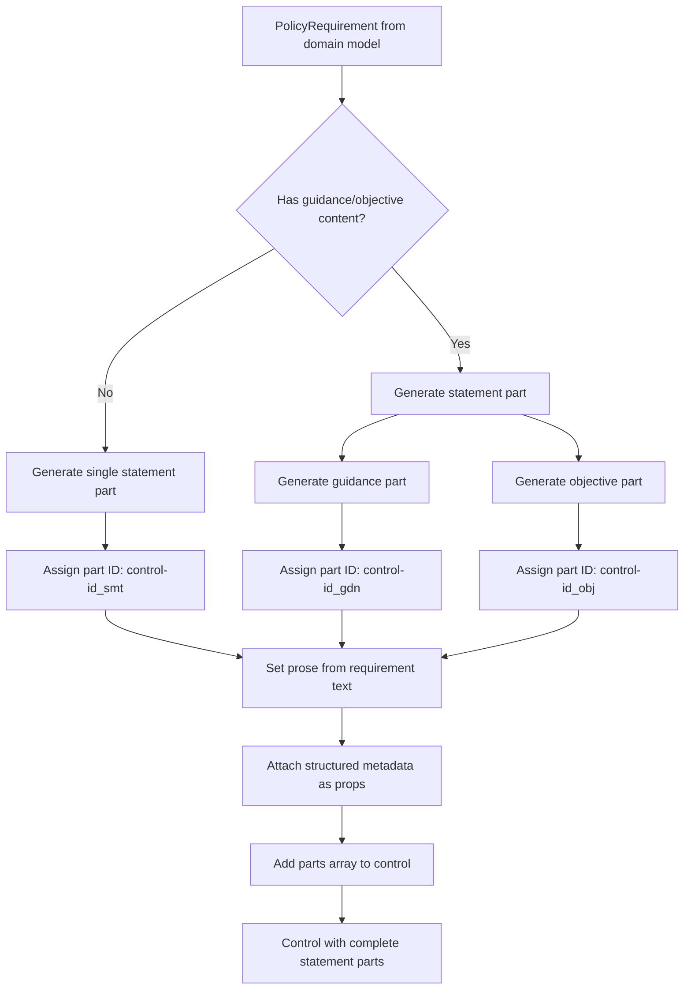
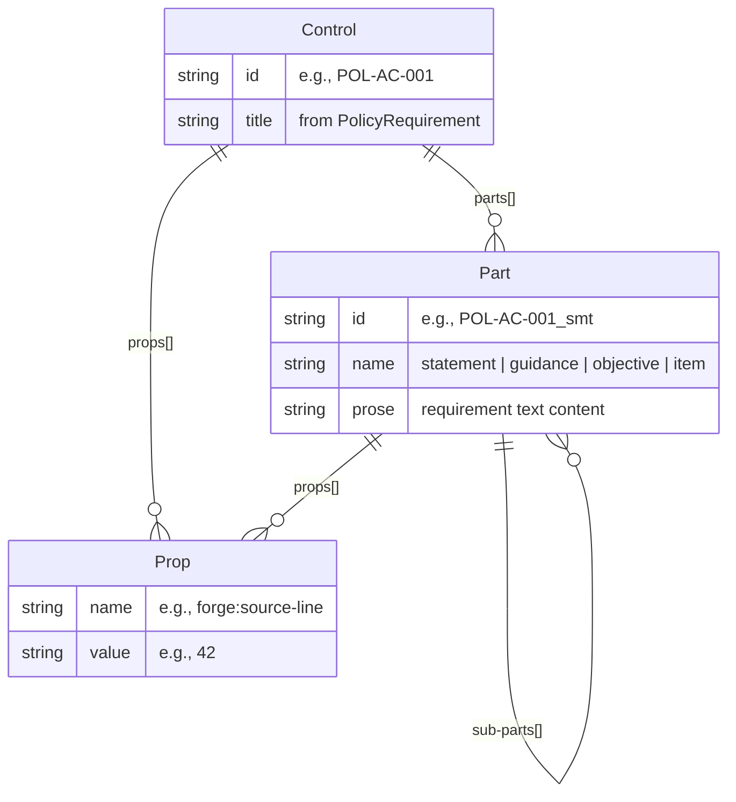
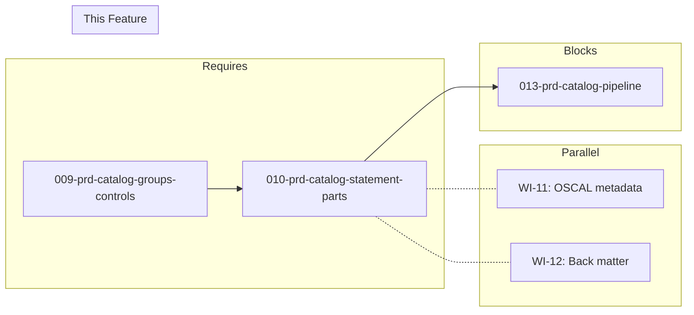

# 010-prd-catalog-statement-parts

> **Document Type:** Product Requirements Document
> **Audience:** LLM agents, human reviewers
> **Status:** Draft
> **Last Updated:** 2026-02-10 <!-- @auto -->
> **Owner:** Brian Luby <!-- @human-required -->

**Feature Branch**: `010-catalog-statement-parts`
**Created**: 2026-02-10
**Status**: Draft
**Input**: Derived from FORGE Product Roadmap WI-10

---

## Review Tier Legend

| Marker | Tier | Speckit Behavior |
|--------|------|------------------|
| 🔴 `@human-required` | Human Generated | Prompt human to author; blocks until complete |
| 🟡 `@human-review` | LLM + Human Review | LLM drafts → prompt human to confirm/edit; blocks until confirmed |
| 🟢 `@llm-autonomous` | LLM Autonomous | LLM completes; no prompt; logged for audit |
| ⚪ `@auto` | Auto-generated | System fills (timestamps, links); no prompt |

---

## Document Completion Order

> ⚠️ **For LLM Agents:** Complete sections in this order. Do not fill downstream sections until upstream human-required inputs exist.

1. **Context** (Background, Scope) → requires human input first
2. **Problem Statement & User Scenarios** → requires human input
3. **Requirements** (Must/Should/Could/Won't) → requires human input
4. **Technical Constraints** → human review
5. **Diagrams, Data Model, Interface** → LLM can draft after above exist
6. **Acceptance Criteria** → derived from requirements
7. **Everything else** → can proceed

---

## Context

### Background 🔴 `@human-required`
This PRD covers **WI-10: OSCAL Catalog JSON — Statement Parts & Prose** from the FORGE Product Roadmap (Sprint S-10, May 5–9 2026, Theme T-2: OSCAL Model Generation, Milestone MS-2). WI-9 established the Catalog JSON builder that maps `PolicySection` to `catalog.groups[]` and `PolicyRequirement` to `catalog.groups[].controls[]`, producing a valid JSON structure matching the OSCAL Catalog shape. However, those controls are structurally empty shells — they have IDs and titles but lack the actual content that gives them meaning. OSCAL controls carry their requirement text inside a `parts[]` array, where each part has a `name` (e.g., `"statement"`, `"guidance"`, `"objective"`) and a `prose` field containing the text. WI-10 fills these control shells with complete statement parts, transforming them from structural placeholders into content-bearing OSCAL controls. This is the work item that puts the actual policy requirement text into the OSCAL output.

### Scope Boundaries 🟡 `@human-review`

**In Scope:**
- Implementing control `parts[]` array generation with `name: "statement"` parts
- Populating `prose` fields from `PolicyRequirement` text content
- Handling multi-part controls: guidance parts, objective parts where applicable
- Generating part IDs following OSCAL conventions (e.g., `{control-id}_smt`)
- Using `props` for structured data that does not belong in prose or remarks
- Ensuring no arbitrary data is stored in OSCAL `remarks` fields

**Out of Scope:**
- Catalog group and control structure (groups[], controls[], control IDs) — completed in WI-9 (009-prd-catalog-groups-controls)
- OSCAL metadata assembly (uuid, title, last-modified, version, oscal-version) — deferred to WI-11
- Back matter resources and link patterns — deferred to WI-12 (012-prd-back-matter)
- End-to-end pipeline wiring — deferred to WI-13 (013-prd-catalog-pipeline)
- Parameter extraction and `param` elements — deferred to WI-34
- Schema validation of generated output — deferred to WI-19

### Glossary 🟡 `@human-review`

| Term | Definition |
|------|------------|
| Part | An OSCAL construct within a control representing a discrete piece of content (statement, guidance, objective); contains `id`, `name`, and `prose` fields |
| Statement Part | A part with `name: "statement"` containing the normative requirement text of a control |
| Guidance Part | A part with `name: "guidance"` containing advisory or implementation guidance text |
| Objective Part | A part with `name: "objective"` containing assessment objectives for a control |
| Prose | The human-readable text content of an OSCAL part, containing the actual requirement or guidance language |
| Prop | An OSCAL property element used for structured key-value data on controls, parts, or other elements; preferred over remarks for additional data per NIST guidance |
| Remarks | An OSCAL field intended for human-readable notes; NIST guidance warns against storing arbitrary or structured data in remarks |
| Control | An OSCAL element representing a single security requirement or policy statement, containing parts, props, links, and parameters |

### Related Documents ⚪ `@auto`

| Document | Link | Relationship |
|----------|------|--------------|
| Parent PRD | docs/FORGE_PRD.md | Parent requirements M-3, M-11 |
| Product Roadmap | docs/FORGE_PRODUCT_ROADMAP.md | Sprint S-10 context |
| OSCAL Research | docs/research/OSCAL_Research.md | OSCAL Catalog model, control parts structure, remarks avoidance guidance |
| Depends On | docs/PRD/005-prd-domain-model.md | PolicyRequirement text content consumed by this WI |
| Depends On (WI-9) | docs/PRD/009-prd-catalog-groups-controls.md | Catalog groups and controls structure this WI extends |
| Constitution | .specify/memory/constitution.md | Technical constraints and quality gates |

---

## Problem Statement 🔴 `@human-required`

After WI-9, the Catalog JSON builder produces controls with IDs and titles but no content — the `parts[]` array is either absent or empty. In OSCAL, a control without statement parts is a hollow shell: it declares that a control exists but says nothing about what it requires. The actual policy requirement text must be placed in a `parts[]` entry with `name: "statement"` and the requirement prose. Additionally, some controls may have multi-part structure (guidance, objectives) and may carry structured metadata that must be expressed as `props` rather than being dumped into `remarks` fields, per NIST guidance. Without this work item, the generated Catalog is structurally valid but semantically empty — it cannot communicate any policy requirements to downstream consumers (profiles, component definitions, assessment plans).

---

## User Scenarios & Testing 🔴 `@human-required`

### User Story 1 — Generate Statement Parts with Prose (Priority: P1)

The Catalog builder populates each control with a statement part containing the policy requirement text.

> As a compliance engineer using FORGE, I want each generated OSCAL control to contain a statement part with the policy requirement prose so that the Catalog communicates actual policy requirements to downstream OSCAL consumers.

**Why this priority**: Without statement parts, the entire Catalog output is semantically empty. This is the core deliverable of WI-10.

**Independent Test**: Convert a test Markdown policy through the Catalog builder and verify each control has a `parts[]` array with a statement part whose `prose` matches the source `PolicyRequirement` text.

**Acceptance Scenarios**:
1. **Given** a PolicyRequirement with text "All users must use multi-factor authentication for privileged access", **When** the Catalog builder generates the control, **Then** the control has a `parts[]` array containing one entry with `name: "statement"` and `prose` equal to the requirement text.
2. **Given** a control with ID `POL-AC-001`, **When** the statement part is generated, **Then** the part has `id: "POL-AC-001_smt"` following the `{control-id}_smt` convention.

---

### User Story 2 — Handle Multi-Part Controls (Priority: P2)

Controls with guidance or objective content produce additional parts beyond the statement.

> As a compliance engineer, I want controls that have guidance or objective content to include those as separate named parts so that the OSCAL output preserves the full structure of the policy requirement.

**Why this priority**: Multi-part controls are important for complete policy representation but secondary to the core statement part generation.

**Independent Test**: Convert a test Markdown policy containing a requirement with associated guidance text, and verify the control has both a statement part and a guidance part.

**Acceptance Scenarios**:
1. **Given** a PolicyRequirement with associated guidance text, **When** the Catalog builder generates the control, **Then** the control has a statement part and a separate guidance part with `name: "guidance"` and appropriate prose.
2. *(Deferred — S-2)* **Given** a PolicyRequirement with associated objective text, **When** the Catalog builder generates the control, **Then** the control has a statement part and a separate objective part with `name: "objective"` and appropriate prose. *(Deferred pending domain model changes — no signal for objective text exists)*

---

### User Story 3 — Structured Data Uses Props Not Remarks (Priority: P1)

Structured metadata about controls is expressed using props, not remarks fields.

> As a compliance engineer, I want structured policy metadata stored in OSCAL `prop` elements rather than `remarks` so that the generated output follows NIST guidance and is machine-queryable.

**Why this priority**: NIST explicitly warns against misusing `remarks` for structured data. Violating this guidance would produce non-idiomatic OSCAL that tools and auditors may reject or misinterpret.

**Independent Test**: Convert a test Markdown policy with structured metadata (e.g., source line numbers, requirement identifiers) and verify they appear as `props` elements, not in `remarks`.

**Acceptance Scenarios**:
1. **Given** a control with structured metadata (e.g., source line number, original requirement ID), **When** the Catalog builder generates the control, **Then** the metadata appears as `prop` entries with appropriate `name` and `value` fields.
2. **Given** a generated Catalog, **When** inspecting all controls, **Then** no control has arbitrary structured data stored in `remarks` fields.

---

## Assumptions & Risks 🟡 `@human-review`

### Assumptions
- [A-1] WI-9 produces controls with IDs and titles that this WI can extend with parts[] content.
- [A-2] `PolicyRequirement.text` from the domain model (WI-5) contains the raw requirement text suitable for use as OSCAL prose.
- [A-3] The distinction between statement, guidance, and objective text can be derived from the source document structure or domain model annotations.
- [A-4] OSCAL v1.2.0 part naming conventions (`statement`, `guidance`, `objective`) are stable and well-documented.

### Risks
| ID | Risk | Likelihood | Impact | Mitigation |
|----|------|------------|--------|------------|
| R-1 | Source policy text does not clearly distinguish between normative statements and guidance | Med | Med | Default all requirement text to statement parts; guidance/objective differentiation is best-effort and can be refined in later WIs |
| R-2 | Multi-part control structure requires domain model changes not yet in WI-5 | Low | Med | Design parts generation to work with current PolicyRequirement; use the text field for statement prose, extend model if needed |
| R-3 | Prop naming conventions may conflict with future OSCAL extensions or established patterns | Low | Low | Use namespace-prefixed prop names (e.g., `forge:source-line`) to avoid collision with standard OSCAL prop names |

---

## Feature Overview

### Flow Diagram 🟡 `@human-review`



### State Diagram (if applicable) 🟡 `@human-review`
N/A — No state transitions in this work item. Controls are built in a single pass.

---

## Requirements

### Must Have (M) — MVP, launch blockers 🔴 `@human-required`
- [ ] **M-1:** Each generated OSCAL control shall contain a `parts[]` array with at least one part having `name: "statement"`. *(Traces to: Parent PRD M-3)*
- [ ] **M-2:** The statement part shall have a `prose` field populated from the `PolicyRequirement.text` content. *(Traces to: Parent PRD M-3)*
- [ ] **M-3:** Each part shall have an `id` following the convention `{control-id}_smt` for statement parts. *(Traces to: Parent PRD M-3)*
- [ ] **M-4:** Structured metadata (source line numbers, original identifiers) shall be expressed as `prop` elements on controls or parts, not stored in `remarks` fields. *(Traces to: Parent PRD M-11)*
- [ ] **M-5:** The parts generation shall integrate with the existing Catalog builder from WI-9, extending controls that already have IDs and titles. *(Traces to: Parent PRD M-3)*
- [ ] **M-6:** Generated parts shall produce valid OSCAL v1.2.0 JSON structure for the `parts` array within controls. *(Traces to: Parent PRD M-3)*

### Should Have (S) — High value, not blocking 🔴 `@human-required`
- [ ] **S-1:** Multi-part controls shall support guidance parts with `name: "guidance"` and ID convention `{control-id}_gdn` when guidance text is available.
- [ ] **S-2:** Multi-part controls shall support objective parts with `name: "objective"` and ID convention `{control-id}_obj` when objective text is available. *(Deferred — no domain model signal exists for objective text; revisit when domain model evolves)*
- [ ] **S-3:** Part generation shall handle multi-paragraph prose by preserving paragraph breaks in the `prose` field.

### Could Have (C) — Nice to have, if time permits 🟡 `@human-review`
- [ ] **C-1:** Nested sub-parts within statement parts for controls that have multiple enumerated sub-requirements (e.g., `(a)`, `(b)`, `(c)` sub-items).
- [ ] **C-2:** A `name: "item"` sub-part pattern for individual list items within a statement part.

### Won't Have (W) — Explicitly deferred 🟡 `@human-review`
- [ ] **W-1:** Parameter (`param`) extraction and embedding within parts — *Reason: Deferred to WI-34*
- [ ] **W-2:** Back matter resource links within part prose — *Reason: Deferred to WI-12*
- [ ] **W-3:** Automatic classification of statement vs. guidance vs. objective from natural language analysis — *Reason: Deferred; initial implementation relies on document structure*
- [ ] **W-4:** Schema validation of generated parts — *Reason: Deferred to WI-19*

---

## Technical Constraints 🟡 `@human-review`

- **Language/Framework:** Rust (latest stable)
- **OSCAL Version:** v1.2.0 — parts structure must conform to the OSCAL Catalog JSON schema
- **Serialization:** `serde` + `serde_json` for JSON output; parts must serialize to correct OSCAL JSON structure
- **Part Naming:** Must use OSCAL-standard part names: `statement`, `guidance`, `objective`, `item`
- **Part IDs:** Must follow `{control-id}_{suffix}` convention (e.g., `POL-AC-001_smt`)
- **Props over Remarks:** Per Parent PRD M-11 and NIST guidance, additional structured data must use `prop` or `link` patterns, never `remarks`
- **Error Handling:** `thiserror` for builder errors
- **Testing:** TDD mandatory; unit tests for part generation, integration tests with WI-9 Catalog builder
- **No Clippy Warnings:** `cargo clippy -- -D warnings` must pass

---

## Data Model (if applicable) 🟡 `@human-review`



---

## Interface Contract (if applicable) 🟡 `@human-review`

```rust
/// An OSCAL control part (statement, guidance, objective, etc.)
#[derive(Debug, Serialize)]
pub struct OscalPart {
    pub id: String,
    pub name: String,
    pub prose: String,
    #[serde(skip_serializing_if = "Vec::is_empty")]
    pub parts: Vec<OscalPart>,  // nested sub-parts
    #[serde(skip_serializing_if = "Vec::is_empty")]
    pub props: Vec<OscalProp>,
}

/// An OSCAL property for structured metadata
#[derive(Debug, Serialize)]
pub struct OscalProp {
    pub name: String,
    pub value: String,
}

/// Generate statement parts for a control from a PolicyRequirement
pub fn build_control_parts(
    control_id: &str,
    requirement: &PolicyRequirement,
) -> Vec<OscalPart>;

/// Example generated JSON structure:
/// {
///   "id": "POL-AC-001",
///   "title": "Multi-factor authentication for privileged access",
///   "parts": [
///     {
///       "id": "POL-AC-001_smt",
///       "name": "statement",
///       "prose": "Privileged access to production systems requires multi-factor authentication."
///     }
///   ],
///   "props": [
///     {
///       "name": "forge:source-line",
///       "value": "42"
///     }
///   ]
/// }
```

---

## Evaluation Criteria 🟡 `@human-review`

| Criterion | Weight | Metric | Target | Notes |
|-----------|--------|--------|--------|-------|
| Statement Parts Present | Critical | Every control has a statement part | 100% | Core deliverable of WI-10 |
| Prose Accuracy | Critical | Prose matches PolicyRequirement text | 100% | No text loss or corruption |
| Part IDs Correct | Critical | All part IDs follow `{control-id}_smt` convention | 100% | Required for OSCAL referencing |
| No Remarks Misuse | Critical | Zero instances of structured data in remarks | 0 violations | Per Parent PRD M-11 |
| Multi-Part Support | High | Guidance/objective parts generated when applicable | Best-effort | Depends on source document structure |

---

## Tool/Approach Candidates 🟡 `@human-review`

| Option | License | Pros | Cons | Spike Result |
|--------|---------|------|------|--------------|
| Extend WI-9 Catalog builder with parts generation | N/A | Minimal new code; integrates naturally with existing builder | Couples parts logic to builder | Selected — natural extension point |
| Separate parts builder composed into Catalog builder | N/A | Clean separation of concerns; independently testable | Additional abstraction layer | Alternative if builder grows too large |
| serde_json for OSCAL JSON serialization | MIT/Apache-2.0 | Already in use from WI-9; standard Rust JSON library | None significant | Already selected |

### Selected Approach 🔴 `@human-required`
> **Decision:** Extend the WI-9 Catalog builder with a `build_control_parts` function that generates the parts array for each control. Parts generation is a separate, testable function composed into the existing builder.
> **Rationale:** Parts generation is logically a sub-step of control building. A separate function keeps it testable while avoiding unnecessary abstraction. This follows constitution principle X (Simplicity).

---

## Acceptance Criteria 🟡 `@human-review`

| AC ID | Requirement | User Story | Given | When | Then |
|-------|-------------|------------|-------|------|------|
| AC-1 | M-1, M-2 | US-1 | A PolicyRequirement with text "Users must authenticate with MFA" | Building control parts | Control has `parts[]` with one entry: `name: "statement"`, `prose: "Users must authenticate with MFA"` |
| AC-2 | M-3 | US-1 | A control with ID `POL-AC-001` | Building control parts | Statement part has `id: "POL-AC-001_smt"` |
| AC-3 | M-4 | US-3 | A PolicyRequirement from source line 42 | Building control with props | Control has a `prop` with `name: "forge:source-line"` and `value: "42"` |
| AC-4 | M-4 | US-3 | A generated Catalog with 10 controls | Inspecting all controls | No control stores structured data in `remarks` fields |
| AC-5 | M-5 | US-1 | WI-9 Catalog builder producing controls with IDs and titles | Extending with parts generation | Controls retain their IDs and titles and now also have populated `parts[]` arrays |
| AC-6 | M-6 | US-1 | Generated parts JSON | Comparing against OSCAL v1.2.0 parts schema shape | JSON structure matches expected OSCAL parts format |
| AC-7 | S-1 | US-2 | A PolicyRequirement with associated guidance text | Building control parts | Control has both a statement part and a guidance part with `name: "guidance"` |
| AC-8 | S-2 | US-2 | A PolicyRequirement with associated objective text | Building control parts | Control has both a statement part and an objective part with `name: "objective"` *(Deferred — S-2 is deferred pending domain model changes; no domain model signal for objective text exists)* |

### Edge Cases 🟢 `@llm-autonomous`
- [ ] **EC-1:** (M-2) When a PolicyRequirement has empty text, then the statement part has an empty string prose field and a warning is emitted.
- [ ] **EC-2:** (M-2) When a PolicyRequirement has only whitespace text, then the statement part has the whitespace-trimmed (empty) prose and a warning is emitted (analogous to EC-1 for whitespace-only input).
- [ ] **EC-3:** (S-3) When prose contains Markdown formatting (bold, links, inline code), then the formatting is preserved as-is in the prose field.
- [ ] **EC-4:** (M-3) When a control ID contains special characters, then the part ID is still correctly formed using the `{control-id}_smt` convention.
- [ ] **EC-5:** (C-1) When a requirement has sub-items (a, b, c), then each sub-item becomes a nested sub-part with `name: "item"` if C-1 is implemented; otherwise they are concatenated into the statement prose.
- [ ] **EC-6:** (M-4) When a PolicyRequirement has a `source_line` of 0 (unknown), then no `forge:source-line` prop is generated for that control.

---

## Dependencies 🟡 `@human-review`



- **Requires:** [009-prd-catalog-groups-controls](docs/PRD/009-prd-catalog-groups-controls.md) (WI-9 — Catalog groups and controls structure)
- **Parallel With:** WI-11 (OSCAL metadata), WI-12 (back matter and link patterns)
- **Blocks:** [013-prd-catalog-pipeline](docs/PRD/013-prd-catalog-pipeline.md) (WI-13 — end-to-end Catalog pipeline)
- **External:** None

---

## Security Considerations 🟡 `@human-review`

| Aspect | Assessment | Notes |
|--------|------------|-------|
| Internet Exposure | No | Internal JSON builder; no network services |
| Sensitive Data | Yes | Parts contain policy requirement text from source documents |
| Authentication Required | No | Local CLI tool |
| Security Review Required | No | JSON serialization of text content; no untrusted input beyond source policy documents already handled by ingestion layer |

---

## Implementation Guidance 🟢 `@llm-autonomous`

### Suggested Approach
Extend the OSCAL Catalog builder module from WI-9 with a `build_control_parts` function. For each `PolicyRequirement` in the domain model, generate an `OscalPart` with `name: "statement"`, `id: "{control-id}_smt"`, and `prose` from `PolicyRequirement.text`. If the domain model provides guidance or objective annotations (or these can be inferred from document structure), generate additional parts with `name: "guidance"` or `name: "objective"`. Add structured metadata (source line, original identifiers) as `OscalProp` entries on the control, ensuring nothing is placed in `remarks`. Write unit tests that verify: (1) every control gets a statement part, (2) prose matches source text, (3) part IDs follow conventions, (4) props are used for metadata, (5) remarks are never populated with structured data.

### Anti-patterns to Avoid
- Storing source line numbers, requirement IDs, or other structured data in `remarks` — use `props` instead per NIST guidance
- Embedding JSON or structured formats within `prose` — prose should be human-readable natural language
- Generating parts without IDs — every part must have a unique, deterministic ID
- Hardcoding part structure assumptions that break when the domain model evolves (e.g., assuming exactly one part per control)
- Over-engineering multi-part detection before clear signals exist in the domain model — start with statement parts, add guidance/objective incrementally

### Reference Examples
- OSCAL Research sample catalog: `docs/research/OSCAL_Research.md` (sample policy catalog section showing `parts[]` with `name: "statement"` and `prose`)
- NIST SP 800-53 control structure: controls with statement, guidance, and objective parts
- NIST remarks avoidance guidance: documented in OSCAL Research under "Avoid misusing `remarks`"

---

## Spike Tasks 🟡 `@human-review`

N/A — No spike tasks for this work item. The OSCAL parts structure is well-documented in the OSCAL Research and NIST examples.

---

## Success Metrics 🔴 `@human-required`

| Metric | Baseline | Target | Measurement Method |
|--------|----------|--------|-------------------|
| Controls with statement parts | 0% (WI-9 produces controls without parts) | 100% of controls have statement parts | Unit tests |
| Prose accuracy | N/A | 100% text match with PolicyRequirement | Unit tests |
| Remarks misuse | N/A | Zero instances | Automated check in tests |

### Technical Verification 🟢 `@llm-autonomous`
| Metric | Target | Verification Method |
|--------|--------|---------------------|
| Test coverage for parts generation | >90% | `cargo test` + coverage tool |
| No clippy warnings | 0 | `cargo clippy -- -D warnings` |
| No formatting violations | 0 | `cargo fmt --check` |
| Part ID convention compliance | 100% | Unit tests verifying `{control-id}_smt` pattern |

---

## Definition of Ready 🔴 `@human-required`

### Readiness Checklist
- [x] Problem statement reviewed and validated by stakeholder
- [x] All Must Have requirements have acceptance criteria
- [x] Technical constraints are explicit and agreed
- [x] Dependencies identified and owners confirmed
- [x] Security review completed (or N/A documented with justification)
- [x] No open questions blocking implementation

### Sign-off
| Role | Name | Date | Decision |
|------|------|------|----------|
| Product Owner | Brian Luby | YYYY-MM-DD | [Ready / Not Ready] |

---

## Changelog ⚪ `@auto`

| Version | Date | Author | Changes |
|---------|------|--------|---------|
| 0.1 | 2026-02-10 | LLM (Claude) | Initial draft derived from FORGE Product Roadmap WI-10 |

---

## Decision Log 🟡 `@human-review`

| Date | Decision | Rationale | Alternatives Considered |
|------|----------|-----------|------------------------|
| 2026-02-10 | Use `{control-id}_smt` convention for statement part IDs | Matches NIST SP 800-53 annotated examples and OSCAL Research sample catalog; deterministic and unique | Random UUIDs for part IDs (less readable, harder to debug) |
| 2026-02-10 | Use props for structured metadata, never remarks | Directly required by Parent PRD M-11 and NIST guidance; ensures machine-queryable metadata | Storing metadata in remarks (violates NIST guidance, not machine-queryable) |
| 2026-02-10 | Default all requirement text to statement parts; guidance/objective as best-effort | Ensures every control has content from day one; guidance/objective classification can be refined in later WIs | Require explicit classification before generating any parts (blocks progress on core deliverable) |

---

## Open Questions 🟡 `@human-review`

No open questions for this work item.

---

## Review Checklist 🟢 `@llm-autonomous`

Before marking as Approved:
- [x] All requirements have unique IDs (M-1 through M-6, S-1 through S-3, C-1 through C-2, W-1 through W-4)
- [x] All Must Have requirements have linked acceptance criteria
- [x] User stories are prioritized and independently testable
- [x] Acceptance criteria reference both requirement IDs and user stories
- [x] Glossary terms are used consistently throughout
- [x] Diagrams use terminology from Glossary
- [x] Security considerations documented
- [x] Definition of Ready checklist is complete
- [x] No open questions blocking implementation
