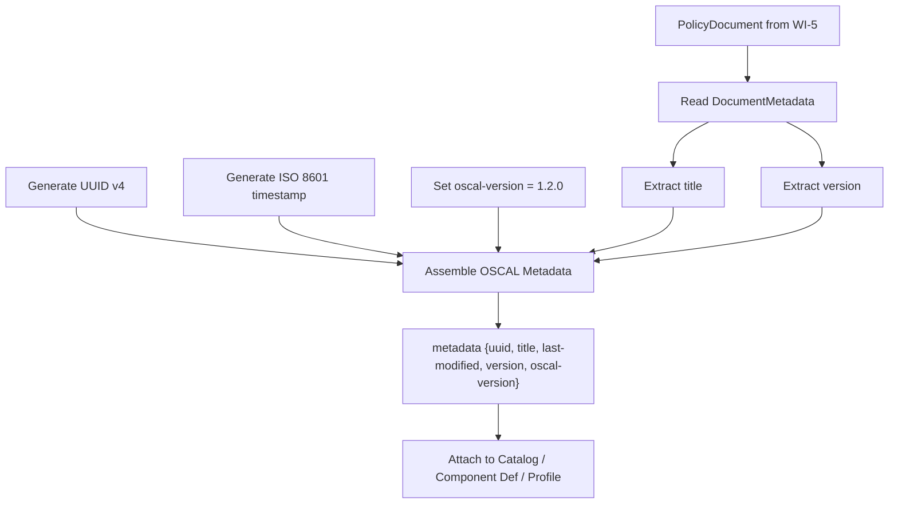
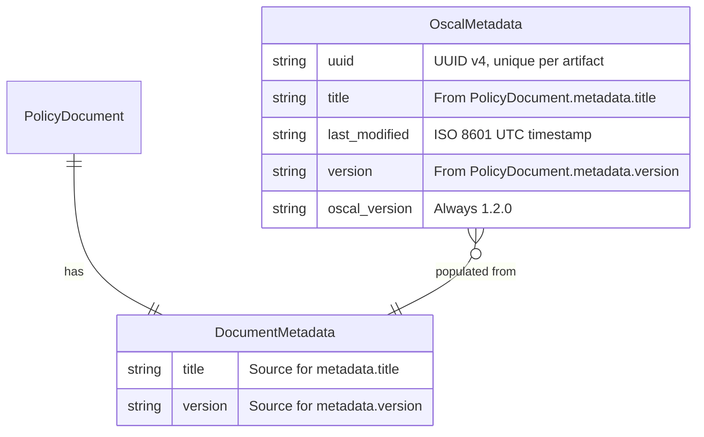
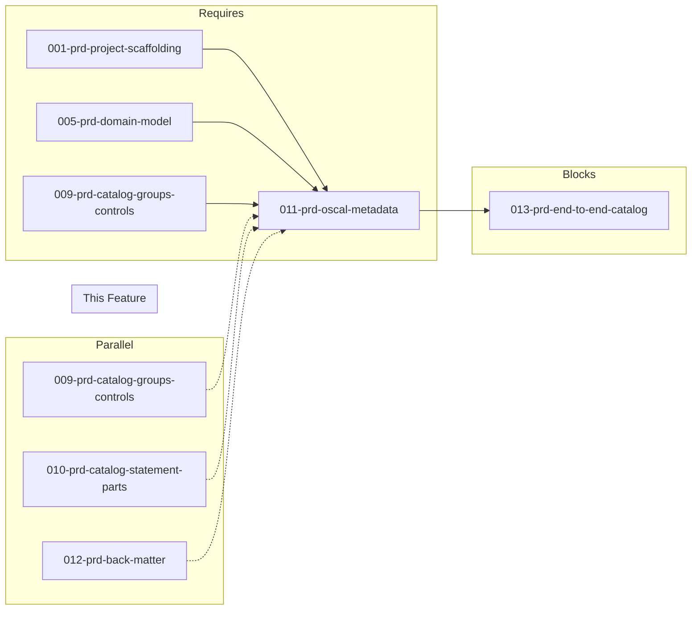

# 011-prd-oscal-metadata

> **Document Type:** Product Requirements Document
> **Audience:** LLM agents, human reviewers
> **Status:** Draft
> **Last Updated:** 2026-02-10 <!-- @auto -->
> **Owner:** Brian Luby <!-- @human-required -->

**Feature Branch**: `011-oscal-metadata`
**Created**: 2026-02-10
**Status**: Draft
**Input**: Derived from FORGE Product Roadmap WI-11

---

## Review Tier Legend

| Marker | Tier | Speckit Behavior |
|--------|------|------------------|
| :red_circle: `@human-required` | Human Generated | Prompt human to author; blocks until complete |
| :yellow_circle: `@human-review` | LLM + Human Review | LLM drafts -> prompt human to confirm/edit; blocks until confirmed |
| :green_circle: `@llm-autonomous` | LLM Autonomous | LLM completes; no prompt; logged for audit |
| :white_circle: `@auto` | Auto-generated | System fills (timestamps, links); no prompt |

---

## Document Completion Order

> :warning: **For LLM Agents:** Complete sections in this order. Do not fill downstream sections until upstream human-required inputs exist.

1. **Context** (Background, Scope) -> requires human input first
2. **Problem Statement & User Scenarios** -> requires human input
3. **Requirements** (Must/Should/Could/Won't) -> requires human input
4. **Technical Constraints** -> human review
5. **Diagrams, Data Model, Interface** -> LLM can draft after above exist
6. **Acceptance Criteria** -> derived from requirements
7. **Everything else** -> can proceed

---

## Context

### Background :red_circle: `@human-required`
This PRD covers **WI-11: OSCAL Metadata** from the FORGE Product Roadmap (Sprint S-11, May 12-16 2026, Theme T-2: OSCAL Model Generation, Milestone MS-2). Every OSCAL artifact (Catalog, Component Definition, Profile, etc.) requires a `metadata` object containing required fields: `uuid`, `title`, `last-modified`, `version`, and `oscal-version`. Without properly assembled metadata, no generated OSCAL artifact can pass schema validation. This work item implements the shared metadata assembly capability that all OSCAL generation work items (WI-9, WI-10, WI-12, WI-13, WI-14, etc.) depend on. It runs in parallel with WI-9 (Catalog groups/controls), WI-10 (statement parts/prose), and WI-12 (back matter) to collectively produce the first valid OSCAL Catalog at MS-2.

### Scope Boundaries :yellow_circle: `@human-review`

**In Scope:**
- Implementing the OSCAL metadata assembly function producing `uuid`, `title`, `last-modified`, `version`, and `oscal-version`
- Auto-generating a UUID v4 for each artifact instance (document-level UUID, distinct from content-based v5 used for requirement stable IDs)
- Pulling `title` and `version` from the `PolicyDocument` / `DocumentMetadata` fields populated in WI-5
- Setting `oscal-version` to `"1.2.0"` (the target OSCAL version for FORGE)
- Generating `last-modified` as an ISO 8601 timestamp at artifact creation time
- Unit tests verifying all required metadata fields are present and correctly formatted

**Out of Scope:**
- Optional metadata fields (`published`, `remarks`, `revisions`, `roles`, `parties`, `responsible-parties`, `locations`) -- deferred to future work items as needed
- OSCAL `props` or `links` within metadata -- deferred to WI-12 (back matter) and WI-17 (traceability)
- Catalog group/control structure -- covered by WI-9 (009-prd-catalog-groups-controls)
- Statement parts and prose -- covered by WI-10 (010-prd-catalog-statement-parts)
- Back matter assembly -- covered by WI-12 (012-prd-back-matter)
- Schema validation of the overall artifact -- covered by WI-19 (019-prd-schema-validation)

### Glossary :yellow_circle: `@human-review`

| Term | Definition |
|------|------------|
| OSCAL Metadata | The required `metadata` object in every OSCAL artifact containing identification, versioning, and provenance fields |
| UUID v4 | A randomly generated universally unique identifier used for artifact instance identification |
| UUID v5 | A deterministic, content-based UUID used for stable requirement identifiers (implemented in WI-7, distinct from artifact UUIDs) |
| oscal-version | The version of the OSCAL specification the artifact conforms to (target: "1.2.0") |
| last-modified | An ISO 8601 timestamp recording when the artifact was last generated or modified |
| DocumentMetadata | The internal domain model struct (from WI-5) containing title, version, and other source document properties |
| ISO 8601 | International standard for date and time representation (e.g., "2026-05-14T10:30:00Z") |

### Related Documents :white_circle: `@auto`

| Document | Link | Relationship |
|----------|------|--------------|
| Parent PRD | docs/FORGE_PRD.md | Parent requirement M-5, AC-5 |
| Product Roadmap | docs/FORGE_PRODUCT_ROADMAP.md | Sprint S-11 context |
| Depends On | docs/PRD/001-prd-project-scaffolding.md | Project structure |
| Depends On | docs/PRD/005-prd-domain-model.md | DocumentMetadata struct (title, version) |
| Parallel With | docs/PRD/009-prd-catalog-groups-controls.md | Catalog group/control structure (WI-9) |
| Parallel With | docs/PRD/010-prd-catalog-statement-parts.md | Statement parts and prose (WI-10) |
| Parallel With | docs/PRD/012-prd-back-matter.md | Back matter resources (WI-12) |
| Blocks | docs/PRD/013-prd-end-to-end-catalog.md | End-to-end catalog pipeline needs metadata (WI-13) |

---

## Problem Statement :red_circle: `@human-required`

OSCAL mandates that every artifact include a `metadata` object with specific required fields. Without this metadata, no generated Catalog, Component Definition, or Profile can pass schema validation or be consumed by OSCAL-compliant tools. The metadata fields serve distinct purposes: `uuid` uniquely identifies the artifact instance, `title` and `version` describe the source policy, `last-modified` provides temporal provenance, and `oscal-version` declares schema compatibility. WI-9 and WI-10 build the Catalog body (groups, controls, statement parts), but without metadata the artifact is incomplete and invalid. This work item implements the shared metadata assembly that all current and future OSCAL generation work items reuse.

---

## User Scenarios & Testing :red_circle: `@human-required`

### User Story 1 -- Generate OSCAL Artifact with Required Metadata (Priority: P1)

When FORGE generates an OSCAL artifact, the metadata section is automatically populated with all required fields.

> As a compliance engineer, I want generated OSCAL artifacts to include all required metadata fields so that the artifacts pass schema validation and are interoperable with other OSCAL-compliant tools.

**Why this priority**: Metadata is required by the OSCAL specification. Without it, no artifact is valid. This is a blocking dependency for the end-to-end Catalog pipeline (WI-13) and all downstream OSCAL generation.

**Independent Test**: Generate an OSCAL Catalog from a test Markdown policy and verify the metadata object contains `uuid`, `title`, `last-modified`, `version`, and `oscal-version`.

**Acceptance Scenarios**:
1. **Given** a PolicyDocument with title "Access Control Policy" and version "2.1", **When** generating an OSCAL Catalog, **Then** `metadata.title` equals "Access Control Policy" and `metadata.version` equals "2.1".
2. **Given** any OSCAL artifact generation, **When** inspecting the metadata, **Then** `metadata.uuid` is a valid UUID v4 string.
3. **Given** any OSCAL artifact generation, **When** inspecting the metadata, **Then** `metadata.oscal-version` equals "1.2.0".
4. **Given** any OSCAL artifact generation, **When** inspecting the metadata, **Then** `metadata.last-modified` is a valid ISO 8601 timestamp.

---

### User Story 2 -- Unique Artifact UUIDs Per Generation (Priority: P1)

Each time an OSCAL artifact is generated, it receives a unique UUID v4, distinguishing it from other artifact instances even from the same source.

> As a compliance engineer, I want each generated OSCAL artifact to have a unique instance UUID so that I can distinguish different generation runs and track artifact provenance over time.

**Why this priority**: UUID v4 per artifact instance is required by OSCAL. Using the same UUID across different generation runs would violate the specification's intent for artifact identification and could cause conflicts when artifacts are consumed by downstream tools.

**Independent Test**: Generate two OSCAL Catalogs from the same Markdown policy and verify they have different `metadata.uuid` values.

**Acceptance Scenarios**:
1. **Given** the same PolicyDocument, **When** generating two OSCAL artifacts in succession, **Then** each has a distinct `metadata.uuid`.
2. **Given** a generated artifact UUID, **When** parsing it, **Then** it conforms to UUID v4 format (version nibble = 4, variant bits correct).

---

### User Story 3 -- Metadata from PolicyDocument Defaults (Priority: P2)

When the source PolicyDocument has missing or default metadata, the metadata assembly provides sensible fallbacks.

> As a developer working on FORGE, I want the metadata assembly to handle missing source metadata gracefully so that artifacts are always generated with valid metadata even from incomplete source documents.

**Why this priority**: Real-world policy documents may lack explicit version or title metadata. The system must produce valid OSCAL regardless.

**Independent Test**: Generate an OSCAL Catalog from a Markdown file with no frontmatter and verify metadata fields use appropriate defaults.

**Acceptance Scenarios**:
1. **Given** a PolicyDocument with no explicit version (defaulting to "0.0.0"), **When** generating metadata, **Then** `metadata.version` equals "0.0.0".
2. **Given** a PolicyDocument whose title was derived from the first H1 heading, **When** generating metadata, **Then** `metadata.title` reflects that heading text.

---

## Assumptions & Risks :yellow_circle: `@human-review`

### Assumptions
- [A-1] The `uuid` crate is available and provides UUID v4 generation (already established in constitution technology stack).
- [A-2] `PolicyDocument.metadata.title` and `PolicyDocument.metadata.version` are populated by WI-5 before metadata assembly runs.
- [A-3] The OSCAL v1.2.0 metadata schema for required fields is stable and well-documented.
- [A-4] ISO 8601 timestamps use UTC timezone with "Z" suffix (e.g., "2026-05-14T10:30:00Z").

### Risks
| ID | Risk | Likelihood | Impact | Mitigation |
|----|------|------------|--------|------------|
| R-1 | OSCAL metadata schema requires additional fields beyond the five targeted | Low | Low | The five fields (uuid, title, last-modified, version, oscal-version) are documented as the minimum required set; additional fields are optional and can be added later |
| R-2 | Timestamp precision or format differs from what OSCAL tools expect | Low | Med | Use `chrono` crate with RFC 3339/ISO 8601 formatting; validate against NIST example artifacts |

---

## Feature Overview

### Flow Diagram :yellow_circle: `@human-review`



### State Diagram (if applicable) :yellow_circle: `@human-review`
N/A -- No state transitions in this work item. Metadata assembly is a single-pass construction.

---

## Requirements

### Must Have (M) -- MVP, launch blockers :red_circle: `@human-required`
- [ ] **M-1:** The metadata assembly shall generate a `uuid` field containing a valid UUID v4 string, unique per artifact generation. *(Traces to: Parent PRD M-5, M-8)*
- [ ] **M-2:** The metadata assembly shall populate the `title` field from the `PolicyDocument.metadata.title` value. *(Traces to: Parent PRD M-5)*
- [ ] **M-3:** The metadata assembly shall populate the `version` field from the `PolicyDocument.metadata.version` value. *(Traces to: Parent PRD M-5)*
- [ ] **M-4:** The metadata assembly shall generate a `last-modified` field containing a valid ISO 8601 timestamp (UTC) representing the artifact generation time. *(Traces to: Parent PRD M-5)*
- [ ] **M-5:** The metadata assembly shall set `oscal-version` to `"1.2.0"`. *(Traces to: Parent PRD M-5)*
- [ ] **M-6:** The metadata assembly shall be a shared function reusable by all OSCAL artifact generators (Catalog, Component Definition, Profile). *(Traces to: Parent PRD M-3, M-4, M-5)*

### Should Have (S) -- High value, not blocking :red_circle: `@human-required`
- [ ] **S-1:** The metadata assembly should accept an optional override for `last-modified` to support deterministic testing (inject a fixed timestamp instead of `now()`).
- [ ] **S-2:** The metadata assembly should accept an optional override for `uuid` to support deterministic testing (inject a fixed UUID instead of random generation).

### Could Have (C) -- Nice to have, if time permits :yellow_circle: `@human-review`
- [ ] **C-1:** The metadata assembly could include a `published` field set to the same timestamp as `last-modified` for first-generation artifacts.
- [ ] **C-2:** The metadata assembly could include a `revisions` array with a single entry for the current generation.

### Won't Have (W) -- Explicitly deferred :yellow_circle: `@human-review`
- [ ] **W-1:** Optional metadata fields (`roles`, `parties`, `responsible-parties`, `locations`) -- *Reason: Not required by OSCAL; add when organizational context features are introduced*
- [ ] **W-2:** Metadata `remarks` -- *Reason: Per Parent PRD M-11, arbitrary data should not be stored in remarks fields*
- [ ] **W-3:** Metadata `props` and `links` -- *Reason: Deferred to WI-12 (back matter) and WI-17 (traceability) where props/links are contextually appropriate*

---

## Technical Constraints :yellow_circle: `@human-review`

- **Language/Framework:** Rust (latest stable)
- **UUID Generation:** `uuid` crate with v4 (random) generation for artifact instance IDs
- **Timestamps:** `chrono` crate (or equivalent) for ISO 8601 / RFC 3339 UTC timestamp generation
- **OSCAL Version:** Hardcoded `"1.2.0"` as a constant, easily updatable when FORGE targets a new OSCAL version
- **Reusability:** The metadata assembly function must be generic enough to serve Catalog, Component Definition, and Profile generators
- **Error Handling:** `thiserror` for any metadata assembly errors (e.g., missing required PolicyDocument fields)
- **Testing:** TDD mandatory; deterministic test support via injectable timestamp and UUID overrides (S-1, S-2)
- **Serialization:** Metadata struct must derive `serde::Serialize` for JSON output

---

## Data Model (if applicable) :yellow_circle: `@human-review`



---

## Interface Contract (if applicable) :yellow_circle: `@human-review`

```rust
use chrono::{DateTime, Utc};
use uuid::Uuid;

/// OSCAL metadata for any artifact type (Catalog, Component Definition, Profile)
#[derive(Debug, Serialize)]
pub struct OscalMetadata {
    /// UUID v4 — unique per artifact generation instance
    pub uuid: Uuid,
    /// Document title from PolicyDocument.metadata.title
    pub title: String,
    /// ISO 8601 UTC timestamp of artifact generation
    #[serde(rename = "last-modified")]
    pub last_modified: DateTime<Utc>,
    /// Document version from PolicyDocument.metadata.version
    pub version: String,
    /// OSCAL specification version — always "1.2.0"
    #[serde(rename = "oscal-version")]
    pub oscal_version: String,
}

/// Options for overriding auto-generated metadata values (primarily for testing)
pub struct MetadataOptions {
    /// Override the auto-generated UUID v4 (for deterministic tests)
    pub uuid_override: Option<Uuid>,
    /// Override the auto-generated timestamp (for deterministic tests)
    pub timestamp_override: Option<DateTime<Utc>>,
}

/// Assemble OSCAL metadata from a PolicyDocument's DocumentMetadata
pub fn assemble_metadata(
    doc_metadata: &DocumentMetadata,
    options: Option<MetadataOptions>,
) -> Result<OscalMetadata, ForgeError>;
```

---

## Evaluation Criteria :yellow_circle: `@human-review`

| Criterion | Weight | Metric | Target | Notes |
|-----------|--------|--------|--------|-------|
| Required Fields Present | Critical | All 5 required metadata fields populated | 100% | uuid, title, last-modified, version, oscal-version |
| UUID v4 Validity | Critical | Generated UUID conforms to v4 format | 100% | Version nibble = 4, variant bits correct |
| Timestamp Format | Critical | last-modified is valid ISO 8601 UTC | 100% | Parseable by standard datetime libraries |
| Reusability | High | Metadata function used by all artifact generators | Shared function | Not duplicated per artifact type |

---

## Tool/Approach Candidates :yellow_circle: `@human-review`

| Option | License | Pros | Cons | Spike Result |
|--------|---------|------|------|--------------|
| `uuid` crate (v4 generation) | MIT/Apache-2.0 | Standard Rust UUID crate; supports v4 and v5 | None significant | Selected per constitution |
| `chrono` crate (timestamps) | MIT/Apache-2.0 | Comprehensive date/time handling; ISO 8601 formatting | Slightly heavier than `time` crate | Likely choice |
| `time` crate (timestamps) | MIT/Apache-2.0 | Lighter weight; good ISO 8601 support | Less feature-rich than chrono | Alternative |

### Selected Approach :red_circle: `@human-required`
> **Decision:** Use `uuid` crate for UUID v4 generation; `chrono` crate for ISO 8601 timestamp formatting
> **Rationale:** Both are industry-standard Rust crates. `uuid` is already specified in the constitution technology stack. `chrono` provides robust, well-tested ISO 8601/RFC 3339 formatting out of the box.

---

## Acceptance Criteria :yellow_circle: `@human-review`

| AC ID | Requirement | User Story | Given | When | Then |
|-------|-------------|------------|-------|------|------|
| AC-1 | M-1 | US-1, US-2 | Any OSCAL artifact generation | Inspecting `metadata.uuid` | A valid UUID v4 string is present |
| AC-2 | M-1 | US-2 | The same PolicyDocument converted twice | Comparing `metadata.uuid` values | Each generation has a distinct UUID |
| AC-3 | M-2 | US-1 | A PolicyDocument with title "Access Control Policy" | Generating OSCAL metadata | `metadata.title` equals "Access Control Policy" |
| AC-4 | M-3 | US-1 | A PolicyDocument with version "2.1" | Generating OSCAL metadata | `metadata.version` equals "2.1" |
| AC-5 | M-4 | US-1 | Any OSCAL artifact generation | Inspecting `metadata.last-modified` | A valid ISO 8601 UTC timestamp is present |
| AC-6 | M-5 | US-1 | Any OSCAL artifact generation | Inspecting `metadata.oscal-version` | Value equals "1.2.0" |
| AC-7 | M-6 | US-1 | Catalog, Component Definition, or Profile generation | Inspecting metadata assembly code path | All artifact types use the same `assemble_metadata` function |
| AC-8 | M-2, M-3 | US-3 | A PolicyDocument with no frontmatter (title from H1, version "0.0.0") | Generating OSCAL metadata | `metadata.title` reflects the H1 heading text, `metadata.version` equals "0.0.0" |

### Edge Cases :green_circle: `@llm-autonomous`
- [ ] **EC-1:** (M-2) When the PolicyDocument title is an empty string, then `metadata.title` is set to an empty string (or a sensible default) and a warning is emitted.
- [ ] **EC-2:** (M-3) When the PolicyDocument version is "0.0.0" (the default for missing metadata), then `metadata.version` is "0.0.0".
- [ ] **EC-3:** (M-4) When the system clock returns an unexpected value, then the timestamp is still formatted as valid ISO 8601 UTC.
- [ ] **EC-4:** (M-1) When generating many artifacts in rapid succession, then each receives a unique UUID v4 (no collisions).
- [ ] **EC-5:** (M-2) When the PolicyDocument title contains special characters (e.g., quotes, ampersands, Unicode), then `metadata.title` preserves them faithfully.

---

## Dependencies :yellow_circle: `@human-review`



- **Requires:** [001-prd-project-scaffolding](docs/PRD/001-prd-project-scaffolding.md) (project structure), [005-prd-domain-model](docs/PRD/005-prd-domain-model.md) (DocumentMetadata struct), WI-9 (catalog structure exists to add metadata to)
- **Blocks:** [013-prd-end-to-end-catalog](docs/PRD/013-prd-end-to-end-catalog.md) (end-to-end catalog pipeline needs metadata)
- **Parallel With:** WI-9 (Catalog groups/controls), WI-10 (statement parts/prose), WI-12 (back matter)
- **External:** None

---

## Security Considerations :yellow_circle: `@human-review`

| Aspect | Assessment | Notes |
|--------|------------|-------|
| Internet Exposure | No | Metadata assembly is purely internal; no network calls |
| Sensitive Data | Low | Title and version are typically non-sensitive; UUID is random |
| Authentication Required | No | Local CLI tool |
| Security Review Required | No | No external input processing; uses well-audited crates (uuid, chrono) for data generation |

---

## Implementation Guidance :green_circle: `@llm-autonomous`

### Suggested Approach
Implement `assemble_metadata` as a standalone function in the `oscal` module that takes a reference to `DocumentMetadata` (from WI-5) and an optional `MetadataOptions` struct for test overrides. Generate UUID v4 using `Uuid::new_v4()`, capture the current UTC timestamp using `Utc::now()`, and hardcode `oscal_version` as a module-level constant (`const OSCAL_VERSION: &str = "1.2.0"`). The function should return an `OscalMetadata` struct that serializes to the correct OSCAL JSON shape via serde. Use `#[serde(rename = "...")]` attributes for hyphenated OSCAL field names (`last-modified`, `oscal-version`). Write tests that inject fixed UUIDs and timestamps via `MetadataOptions` to ensure deterministic verification.

### Anti-patterns to Avoid
- Generating UUID v5 for artifact instance IDs -- UUID v5 is for content-based stable requirement IDs (WI-7); artifact UUIDs must be v4 (random per instance)
- Hardcoding a timestamp or reusing the same UUID across generations -- each artifact must have unique identity
- Duplicating metadata assembly logic in each artifact generator -- implement once, reuse everywhere
- Storing arbitrary data in metadata `remarks` -- per Parent PRD M-11, use `prop` or `link` instead
- Using local timezone instead of UTC for `last-modified` -- OSCAL expects UTC timestamps

### Reference Examples
- NIST OSCAL Catalog example metadata: `{"uuid": "...", "metadata": {"title": "...", "last-modified": "2024-...", "version": "...", "oscal-version": "1.1.2"}}`
- `uuid` crate documentation: https://docs.rs/uuid/latest/uuid/
- `chrono` crate documentation: https://docs.rs/chrono/latest/chrono/

---

## Spike Tasks :yellow_circle: `@human-review`

N/A -- No spike tasks for this work item. UUID v4 generation and ISO 8601 timestamping are straightforward with established crates.

---

## Success Metrics :red_circle: `@human-required`

| Metric | Baseline | Target | Measurement Method |
|--------|----------|--------|-------------------|
| Required metadata fields present | N/A | 100% of generated artifacts have all 5 fields | Unit tests |
| UUID v4 format validity | N/A | 100% conformant | UUID parsing test |
| Timestamp format validity | N/A | 100% ISO 8601 UTC | Parsing test with chrono |
| Reuse across artifact types | N/A | Single shared function | Code inspection |

### Technical Verification :green_circle: `@llm-autonomous`
| Metric | Target | Verification Method |
|--------|--------|---------------------|
| Test coverage | >95% | `cargo test` + coverage tool |
| No clippy warnings | 0 | `cargo clippy -- -D warnings` |
| No formatting violations | 0 | `cargo fmt --check` |
| Deterministic test support | All tests pass with injected values | Unit tests using MetadataOptions overrides |

---

## Definition of Ready :red_circle: `@human-required`

### Readiness Checklist
- [x] Problem statement reviewed and validated by stakeholder
- [x] All Must Have requirements have acceptance criteria
- [x] Technical constraints are explicit and agreed
- [x] Dependencies identified and owners confirmed
- [x] Security review completed (or N/A documented with justification)
- [x] No open questions blocking implementation

### Sign-off
| Role | Name | Date | Decision |
|------|------|------|----------|
| Product Owner | Brian Luby | YYYY-MM-DD | [Ready / Not Ready] |

---

## Changelog :white_circle: `@auto`

| Version | Date | Author | Changes |
|---------|------|--------|---------|
| 0.1 | 2026-02-10 | LLM (Claude) | Initial draft derived from FORGE Product Roadmap WI-11 |

---

## Decision Log :yellow_circle: `@human-review`

| Date | Decision | Rationale | Alternatives Considered |
|------|----------|-----------|------------------------|
| 2026-02-10 | Use UUID v4 (random) for artifact instance IDs, not UUID v5 | Artifact UUIDs identify generation instances and must be unique per run; UUID v5 (content-based) is used for stable requirement IDs in WI-7 | UUID v5 for artifacts (would cause same UUID on re-generation, conflating distinct artifact instances) |
| 2026-02-10 | Hardcode oscal-version as "1.2.0" constant | FORGE targets OSCAL v1.2.0; a single constant makes future version bumps trivial | Read from config file (unnecessary complexity for a single value); detect from schema (fragile) |
| 2026-02-10 | Support injectable overrides for UUID and timestamp in tests | Enables deterministic unit tests without mocking or time-freezing hacks | Mock the uuid/chrono crates (more complex, less portable); test only format not value (weaker assertions) |

---

## Open Questions :yellow_circle: `@human-review`

No open questions for this work item.

---

## Review Checklist :green_circle: `@llm-autonomous`

Before marking as Approved:
- [x] All requirements have unique IDs (M-1 through M-6, S-1 through S-2, C-1 through C-2, W-1 through W-3)
- [x] All Must Have requirements have linked acceptance criteria
- [x] User stories are prioritized and independently testable
- [x] Acceptance criteria reference both requirement IDs and user stories
- [x] Glossary terms are used consistently throughout
- [x] Diagrams use terminology from Glossary
- [x] Security considerations documented
- [x] Definition of Ready checklist is complete
- [x] No open questions blocking implementation
