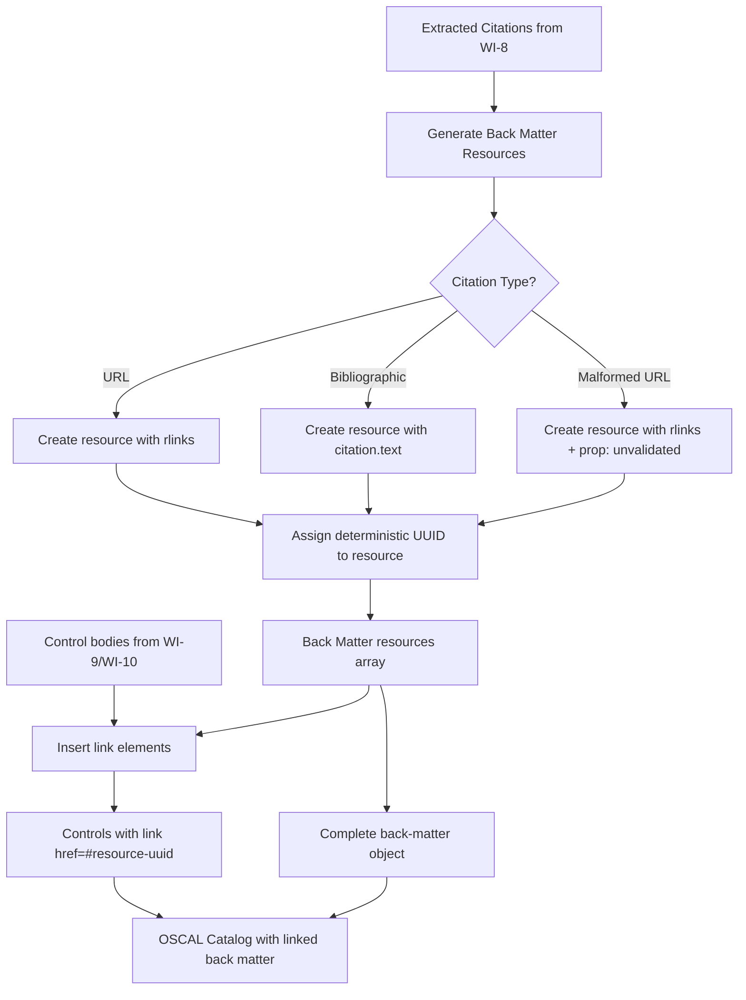
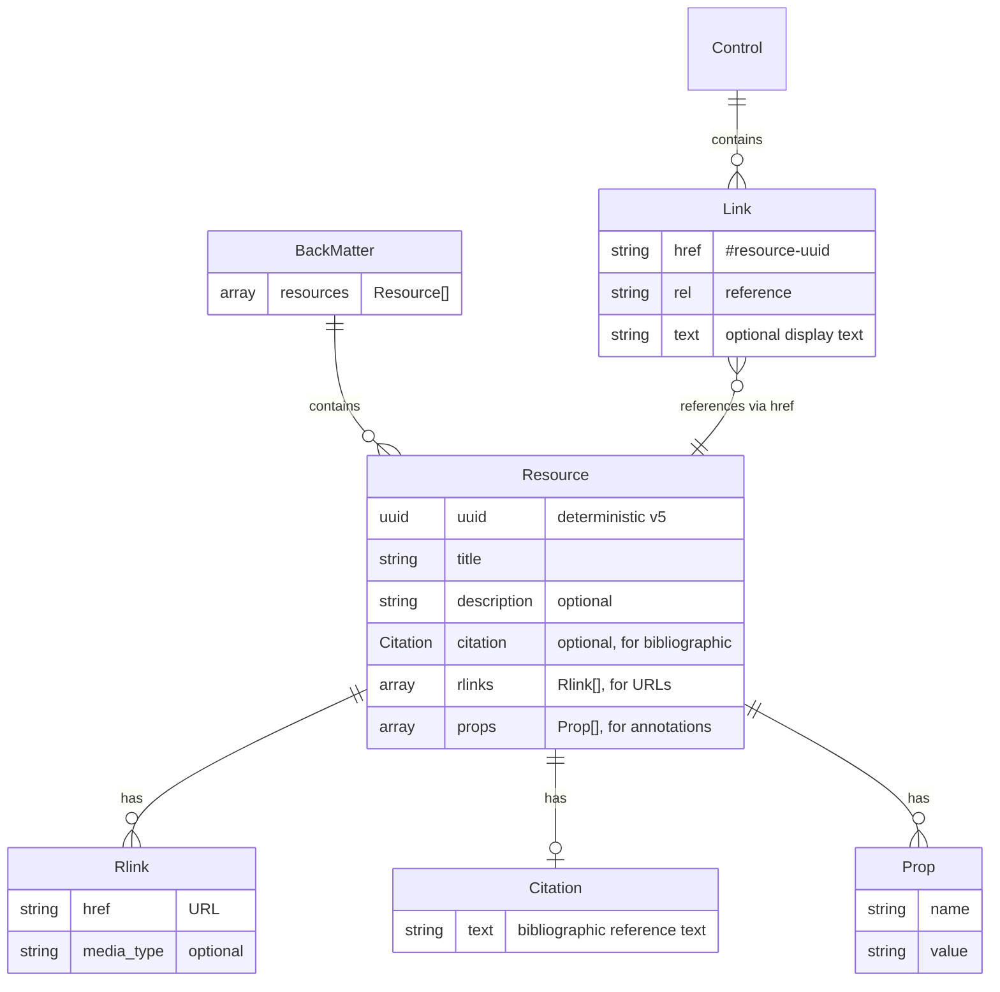
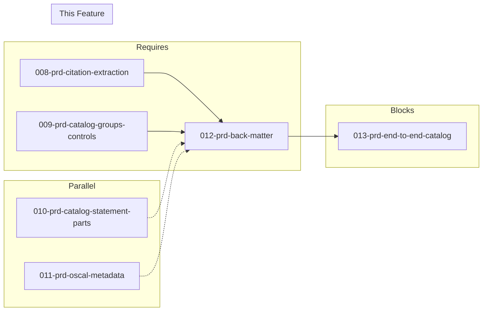

# 012-prd-back-matter

> **Document Type:** Product Requirements Document
> **Audience:** LLM agents, human reviewers
> **Status:** Draft
> **Last Updated:** 2026-02-10 <!-- @auto -->
> **Owner:** Brian Luby <!-- @human-required -->

**Feature Branch**: `012-back-matter`
**Created**: 2026-02-10
**Status**: Draft
**Input**: Derived from FORGE Product Roadmap WI-12

---

## Review Tier Legend

| Marker | Tier | Speckit Behavior |
|--------|------|------------------|
| 🔴 `@human-required` | Human Generated | Prompt human to author; blocks until complete |
| 🟡 `@human-review` | LLM + Human Review | LLM drafts → prompt human to confirm/edit; blocks until confirmed |
| 🟢 `@llm-autonomous` | LLM Autonomous | LLM completes; no prompt; logged for audit |
| ⚪ `@auto` | Auto-generated | System fills (timestamps, links); no prompt |

---

## Document Completion Order

> ⚠️ **For LLM Agents:** Complete sections in this order. Do not fill downstream sections until upstream human-required inputs exist.

1. **Context** (Background, Scope) → requires human input first
2. **Problem Statement & User Scenarios** → requires human input
3. **Requirements** (Must/Should/Could/Won't) → requires human input
4. **Technical Constraints** → human review
5. **Diagrams, Data Model, Interface** → LLM can draft after above exist
6. **Acceptance Criteria** → derived from requirements
7. **Everything else** → can proceed

---

## Context

### Background 🔴 `@human-required`
This PRD covers **WI-12: OSCAL Back Matter** from the FORGE Product Roadmap (Sprint S-12, May 19–23 2026, Theme T-2: OSCAL Model Generation, Milestone MS-2). OSCAL defines a consistent `back-matter` structure across all models for linked and attached resources such as citations, bibliographic references, and evidence. NIST guidance explicitly states that citations and references belong in back matter as resources and should be linked from within control bodies — not embedded in prose or dumped into `remarks` fields. WI-8 (citation extraction) provides the extracted `Citation` objects from parsed policy text. WI-9 (catalog structure) provides the groups-and-controls skeleton. This work item bridges those two: it converts extracted citations into OSCAL `back-matter.resources[]` entries and wires `link` elements in control bodies to reference those back matter resources by UUID.

### Scope Boundaries 🟡 `@human-review`

**In Scope:**
- Implementing OSCAL `back-matter` with `resources[]` array from extracted `Citation` objects
- Generating `rlinks` for URL-based citations (external links)
- Generating `citation` elements for bibliographic references (non-URL citations)
- Generating `link` elements in control bodies that reference back matter resource UUIDs via `href="#<resource-uuid>"`
- Assigning deterministic UUIDs to back matter resources (consistent with WI-7 UUID strategy)
- Ensuring no arbitrary data is placed in OSCAL `remarks` fields — using `prop` or `link` patterns instead
- Handling malformed citation URLs with a `prop` annotation flagging them as unvalidated

**Out of Scope:**
- Citation extraction from source text — handled by WI-8 (008-prd-citation-extraction)
- Catalog group/control structure — handled by WI-9 (009-prd-catalog-groups-controls)
- Control statement parts and prose — handled by WI-10 (010-prd-catalog-statement-parts)
- OSCAL metadata assembly — handled by WI-11 (011-prd-oscal-metadata)
- End-to-end pipeline integration — deferred to WI-13 (013-prd-end-to-end-catalog)
- Evidence/attachment resources (binary files, screenshots) — deferred to Phase 3 ecosystem work
- XML or YAML back matter serialization — deferred to WI-26/WI-27

### Glossary 🟡 `@human-review`

| Term | Definition |
|------|------------|
| Back Matter | A consistent OSCAL structure across all models for linked/attached resources (citations, evidence, graphics) |
| Resource | An entry in `back-matter.resources[]` containing a UUID, title, and either rlinks (URLs) or citation (bibliographic text) |
| rlink | An OSCAL element within a resource that provides a resolvable link (URL) to external content |
| Citation | An OSCAL element within a resource providing bibliographic reference text for non-URL references |
| Link | An OSCAL element in control bodies that references a back matter resource via `href="#<resource-uuid>"` |
| prop | An OSCAL property element used for structured metadata annotations (name-value pairs) per NIST guidance |
| remarks | An OSCAL field intended for human-readable notes; NIST warns against storing arbitrary data here |

### Related Documents ⚪ `@auto`

| Document | Link | Relationship |
|----------|------|--------------|
| Parent PRD | docs/FORGE_PRD.md | Parent requirements M-9, M-11 |
| Product Roadmap | docs/FORGE_PRODUCT_ROADMAP.md | Sprint S-12 context |
| OSCAL Research | docs/research/OSCAL_Research.md | Back matter guidance, NIST best practices |
| Depends On | docs/PRD/001-prd-project-scaffolding.md | Project structure |
| Depends On | docs/PRD/005-prd-domain-model.md | Citation model definition |
| Constitution | .specify/memory/constitution.md | Technical constraints and quality gates |

---

## Problem Statement 🔴 `@human-required`

Policy documents commonly contain citations, cross-references, and bibliographic references to external standards, internal procedures, or regulatory frameworks. In OSCAL, these references must be represented as structured resources in `back-matter` — not embedded inline in control prose or dumped into `remarks` fields. NIST explicitly warns against misusing `remarks` for arbitrary data, directing authors to use `prop` or `link` patterns instead. Without a dedicated back matter generation step, citations would either be lost during conversion or incorrectly embedded in prose, making them unqueryable and breaking OSCAL's resource linking model. This work item ensures that every extracted citation becomes a properly structured back matter resource and that control bodies link to those resources via OSCAL's standard `link` mechanism.

---

## User Scenarios & Testing 🔴 `@human-required`

### User Story 1 — Citations Appear as Back Matter Resources (Priority: P1)

A compliance engineer converts a policy containing citations and expects them to appear as structured resources in back matter, not buried in prose.

> As a compliance engineer, I want policy citations to appear as OSCAL back matter resources so that they are queryable, linkable, and conform to NIST best practices for resource management.

**Why this priority**: Parent PRD M-9 mandates that citations be extracted into back matter as resources. This is a Must Have for MS-2 (first valid OSCAL Catalog).

**Independent Test**: Convert a Markdown policy with 3 citations (2 URLs, 1 bibliographic reference) and verify all 3 appear in `back-matter.resources[]` with correct structure.

**Acceptance Scenarios**:
1. **Given** a policy with a citation referencing `https://nvd.nist.gov/800-53`, **When** converting to OSCAL Catalog, **Then** `back-matter.resources[]` contains a resource with an `rlinks` entry for that URL.
2. **Given** a policy with a bibliographic citation "NIST SP 800-53 Rev 5, Security and Privacy Controls", **When** converting, **Then** `back-matter.resources[]` contains a resource with a `citation.text` field containing the bibliographic text.
3. **Given** a policy with 5 citations, **When** converting, **Then** the back matter contains exactly 5 resources, each with a unique UUID.

---

### User Story 2 — Control Bodies Link to Back Matter Resources (Priority: P1)

A compliance engineer expects controls that reference citations to contain `link` elements pointing to the corresponding back matter resources.

> As a compliance engineer, I want controls to link to their referenced citations via OSCAL link elements so that the relationship between control text and supporting references is machine-readable and navigable.

**Why this priority**: Without links from controls to back matter resources, the back matter is orphaned — resources exist but nothing points to them. The link completes the OSCAL reference pattern.

**Independent Test**: Convert a policy where control text references a citation, and verify the control contains a `link` element with `href="#<resource-uuid>"` matching the back matter resource.

**Acceptance Scenarios**:
1. **Given** a control whose source text references a citation, **When** converting, **Then** the control contains a `link` element with `rel: "reference"` and `href: "#<resource-uuid>"` pointing to the back matter resource.
2. **Given** a control that references 2 different citations, **When** converting, **Then** the control contains 2 `link` elements, each pointing to the correct back matter resource UUID.

---

### User Story 3 — No Arbitrary Data in Remarks (Priority: P1)

A compliance engineer expects generated OSCAL to comply with NIST guidance: no arbitrary data in `remarks` fields.

> As a compliance engineer, I want generated OSCAL artifacts to follow NIST guidance on `remarks` usage so that the output passes both schema validation and best-practice audits.

**Why this priority**: Parent PRD M-11 explicitly mandates that the converter shall not store arbitrary data in `remarks`. This is a core compliance constraint.

**Independent Test**: Convert a policy with citations and structured metadata, then inspect the output for any `remarks` field containing non-human-readable content or data that should be in `prop`/`link`.

**Acceptance Scenarios**:
1. **Given** any generated OSCAL artifact, **When** inspecting all `remarks` fields, **Then** no `remarks` field contains structured data, URIs, citation text, or machine-readable metadata that should be in `prop`, `link`, or back matter.
2. **Given** citation metadata that does not fit standard OSCAL fields, **When** converting, **Then** the data is stored as `prop` annotations on the resource, not in `remarks`.

---

## Assumptions & Risks 🟡 `@human-review`

### Assumptions
- [A-1] WI-8 (citation extraction) provides `Citation` objects with text, optional URL, and a reference to the source requirement.
- [A-2] WI-9 (catalog structure) provides the control skeleton into which `link` elements can be inserted.
- [A-3] WI-7 (UUID generation) provides a deterministic UUID strategy that can be applied to back matter resource identifiers.
- [A-4] OSCAL v1.2.0 `back-matter` schema is stable and well-documented for the resource/rlink/citation structure.

### Risks
| ID | Risk | Likelihood | Impact | Mitigation |
|----|------|------------|--------|------------|
| R-1 | Citation extraction (WI-8) produces incomplete or inconsistent data | Med | Med | Define a clear interface contract for Citation objects; validate inputs before back matter generation |
| R-2 | Malformed URLs in citations cause downstream validation failures | Med | Low | Preserve malformed URLs in rlinks but annotate with a `prop` flagging them as unvalidated (per EC-7 from parent PRD) |
| R-3 | Back matter resource UUIDs conflict with control UUIDs | Low | High | Use separate UUID v5 namespaces for back matter resources vs. controls |

---

## Feature Overview

### Flow Diagram 🟡 `@human-review`



### State Diagram (if applicable) 🟡 `@human-review`
N/A — No state transitions in this work item.

---

## Requirements

### Must Have (M) — MVP, launch blockers 🔴 `@human-required`
- [ ] **M-1:** The converter shall generate an OSCAL `back-matter` object containing a `resources[]` array from extracted citations. *(Traces to: Parent PRD M-9)*
- [ ] **M-2:** Each URL-based citation shall produce a resource with an `rlinks[]` entry containing the URL as `href`. *(Traces to: Parent PRD M-9)*
- [ ] **M-3:** Each bibliographic (non-URL) citation shall produce a resource with a `citation` object containing the reference text in `text`. *(Traces to: Parent PRD M-9)*
- [ ] **M-4:** Each back matter resource shall have a deterministic UUID generated using the WI-7 UUID v5 strategy (namespace + citation content hash). *(Traces to: Parent PRD M-8, M-9)*
- [ ] **M-5:** Each back matter resource shall have a `title` field derived from the citation text or URL. *(Traces to: Parent PRD M-9)*
- [ ] **M-6:** Control bodies that reference citations shall contain `link` elements with `rel: "reference"` and `href: "#<resource-uuid>"` pointing to the corresponding back matter resource. *(Traces to: Parent PRD M-9)*
- [ ] **M-7:** The converter shall not store arbitrary data (citation text, URLs, structured metadata) in OSCAL `remarks` fields; all such data shall use `prop`, `link`, or back matter `resource` patterns. *(Traces to: Parent PRD M-11)*
- [ ] **M-8:** When a citation URL is malformed, the resource shall preserve the URL in `rlinks` and include a `prop` with `name: "url-status"` and `value: "unvalidated"` to flag the issue. *(Traces to: Parent PRD EC-7)*

### Should Have (S) — High value, not blocking 🔴 `@human-required`
- [ ] **S-1:** Back matter resources should include a `description` field providing context about the citation (e.g., where in the policy it was referenced).
- [ ] **S-2:** Resources with URL-based rlinks should include a `media-type` prop when the media type can be inferred from the URL extension (e.g., `.pdf` -> `application/pdf`).

### Could Have (C) — Nice to have, if time permits 🟡 `@human-review`
- [ ] **C-1:** The converter could detect duplicate citations (same URL or same bibliographic text) and merge them into a single back matter resource with multiple link references from controls.

### Won't Have (W) — Explicitly deferred 🟡 `@human-review`
- [ ] **W-1:** Evidence/attachment resources (binary files, screenshots) — *Reason: Deferred to Phase 3 ecosystem work; requires resource storage strategy*
- [ ] **W-2:** Hash verification of referenced resources (`hash` element in rlinks) — *Reason: Requires fetching external content; deferred to Phase 3*
- [ ] **W-3:** XML/YAML back matter serialization — *Reason: Deferred to WI-26/WI-27 (output format expansion)*
- [ ] **W-4:** Back matter for Component Definition artifacts — *Reason: Deferred to WI-14/WI-15 (Component Definition WIs); same pattern applies*

---

## Technical Constraints 🟡 `@human-review`

- **Language/Framework:** Rust (latest stable), Cargo build system
- **OSCAL Version:** Target OSCAL v1.2.0 back matter schema
- **Serialization:** `serde` + `serde_json` for JSON output; back matter structs must be serializable
- **UUID Generation:** Reuse WI-7 UUID v5 strategy with a dedicated namespace for back matter resources
- **Linting:** `cargo clippy -- -D warnings` must pass
- **Formatting:** `cargo fmt --all` must produce no changes
- **Testing:** TDD mandatory; unit tests for back matter generation, link insertion, and malformed URL handling
- **NIST Compliance:** No arbitrary data in `remarks` per NIST OSCAL guidance

---

## Data Model (if applicable) 🟡 `@human-review`



---

## Interface Contract (if applicable) 🟡 `@human-review`

```rust
use uuid::Uuid;

/// A single OSCAL back matter resource generated from a Citation
#[derive(Debug, Serialize)]
pub struct BackMatterResource {
    pub uuid: Uuid,
    pub title: String,
    #[serde(skip_serializing_if = "Option::is_none")]
    pub description: Option<String>,
    #[serde(skip_serializing_if = "Option::is_none")]
    pub citation: Option<ResourceCitation>,
    #[serde(skip_serializing_if = "Vec::is_empty")]
    pub rlinks: Vec<Rlink>,
    #[serde(skip_serializing_if = "Vec::is_empty")]
    pub props: Vec<Prop>,
}

/// Bibliographic citation text within a resource
#[derive(Debug, Serialize)]
pub struct ResourceCitation {
    pub text: String,
}

/// Resolvable link to external content
#[derive(Debug, Serialize)]
pub struct Rlink {
    pub href: String,
    #[serde(skip_serializing_if = "Option::is_none")]
    pub media_type: Option<String>,
}

/// OSCAL link element for control bodies
#[derive(Debug, Serialize)]
pub struct OscalLink {
    pub href: String,   // "#<resource-uuid>"
    pub rel: String,    // "reference"
    #[serde(skip_serializing_if = "Option::is_none")]
    pub text: Option<String>,
}

/// OSCAL property annotation
#[derive(Debug, Serialize)]
pub struct Prop {
    pub name: String,
    pub value: String,
}

/// Generate back matter resources from extracted citations
pub fn generate_back_matter(
    citations: &[Citation],
) -> Result<Vec<BackMatterResource>, ForgeError>;

/// Generate link elements for a control given its associated citations
pub fn generate_control_links(
    citations: &[Citation],
    resource_map: &HashMap<CitationId, Uuid>,
) -> Vec<OscalLink>;
```

---

## Evaluation Criteria 🟡 `@human-review`

| Criterion | Weight | Metric | Target | Notes |
|-----------|--------|--------|--------|-------|
| Resource Generation | Critical | All citations converted to back matter resources | 100% | No citation data lost |
| Link Integrity | Critical | All control-citation links resolve to valid back matter resource UUIDs | 100% | No orphaned links |
| NIST Compliance | Critical | Zero instances of arbitrary data in `remarks` fields | 0 violations | Per M-11 |
| Malformed URL Handling | High | Malformed URLs preserved with unvalidated annotation | 100% | Per EC-7 |

---

## Tool/Approach Candidates 🟡 `@human-review`

| Option | License | Pros | Cons | Spike Result |
|--------|---------|------|------|--------------|
| url crate for URL validation | MIT/Apache-2.0 | Standard Rust URL parsing; detects malformed URLs | May reject valid-but-unusual URLs | Likely choice |
| Manual URL validation via regex | N/A | No dependency | Fragile; may miss edge cases | Backup option |

### Selected Approach 🔴 `@human-required`
> **Decision:** Use the `url` crate for URL validation to detect malformed URLs; generate back matter structs with serde derives for JSON serialization; reuse WI-7 UUID v5 generation with a dedicated back matter namespace.
> **Rationale:** Standard Rust crate for URL parsing gives reliable malformed-URL detection. Serde integration is consistent with the rest of the pipeline. Dedicated UUID namespace prevents collisions with control UUIDs.

---

## Acceptance Criteria 🟡 `@human-review`

| AC ID | Requirement | User Story | Given | When | Then |
|-------|-------------|------------|-------|------|------|
| AC-1 | M-1, M-2 | US-1 | A policy with 2 URL citations | Converting to OSCAL Catalog | `back-matter.resources[]` contains 2 resources, each with `rlinks[].href` matching the URLs |
| AC-2 | M-1, M-3 | US-1 | A policy with 1 bibliographic citation ("NIST SP 800-53 Rev 5") | Converting to OSCAL Catalog | `back-matter.resources[]` contains 1 resource with `citation.text` = "NIST SP 800-53 Rev 5" |
| AC-3 | M-4 | US-1 | Same policy converted twice | Comparing back matter resource UUIDs | Resource UUIDs are identical across runs |
| AC-4 | M-5 | US-1 | A citation with title text | Converting | The back matter resource `title` field is populated |
| AC-5 | M-6 | US-2 | A control referencing a citation | Converting | The control contains a `link` with `rel: "reference"` and `href: "#<resource-uuid>"` matching the back matter resource |
| AC-6 | M-6 | US-2 | A control referencing 2 citations | Converting | The control contains 2 `link` elements with correct `href` values |
| AC-7 | M-7 | US-3 | Any generated OSCAL artifact with back matter | Inspecting all `remarks` fields | No `remarks` field contains citation text, URLs, or structured metadata |
| AC-8 | M-8 | US-1 | A citation with a malformed URL (e.g., "htp://bad url") | Converting | The resource contains the URL in `rlinks` and a `prop` with `name: "url-status"`, `value: "unvalidated"` |

### Edge Cases 🟢 `@llm-autonomous`
- [ ] **EC-1:** (M-1) When a policy has zero citations, then `back-matter` is either omitted or contains an empty `resources[]` array (valid per OSCAL schema).
- [ ] **EC-2:** (M-2) When a citation URL contains query parameters or fragments, then the full URL is preserved in `rlinks[].href`.
- [ ] **EC-3:** (M-3) When a bibliographic citation text is very long (>500 characters), then it is preserved in full in `citation.text` without truncation.
- [ ] **EC-4:** (M-6) When a control references a citation that was not successfully extracted (orphan reference), then a warning is emitted and no broken `link` is generated.
- [ ] **EC-5:** (M-4) When two citations have identical content, then they produce the same deterministic UUID (deduplication possible via C-1).
- [ ] **EC-6:** (M-8) When a citation URL is an empty string, then it is treated as malformed and annotated with `prop name="url-status" value="unvalidated"`.
- [ ] **EC-7:** (M-7) When citation metadata does not fit standard OSCAL fields, then it is stored as `prop` annotations, never in `remarks`.

---

## Dependencies 🟡 `@human-review`



- **Requires:** [008-prd-citation-extraction](docs/PRD/008-prd-citation-extraction.md) (provides extracted Citation objects), [009-prd-catalog-groups-controls](docs/PRD/009-prd-catalog-groups-controls.md) (provides catalog control skeleton for link insertion)
- **Parallel With:** [009-prd-catalog-groups-controls](docs/PRD/009-prd-catalog-groups-controls.md), [010-prd-catalog-statement-parts](docs/PRD/010-prd-catalog-statement-parts.md), [011-prd-oscal-metadata](docs/PRD/011-prd-oscal-metadata.md)
- **Blocks:** [013-prd-end-to-end-catalog](docs/PRD/013-prd-end-to-end-catalog.md) (end-to-end catalog pipeline)
- **External:** OSCAL v1.2.0 JSON schema (back matter section)

---

## Security Considerations 🟡 `@human-review`

| Aspect | Assessment | Notes |
|--------|------------|-------|
| Internet Exposure | No | Back matter generation is local; rlinks contain URLs but no fetching occurs |
| Sensitive Data | Yes | Citations may reference internal documents or reveal organizational dependencies |
| Authentication Required | No | Local CLI tool |
| Security Review Required | Low | URLs are preserved as-is, not fetched; malformed URLs are flagged but not sanitized |

Additional security notes:
- Malformed URLs are preserved in `rlinks` but annotated as unvalidated — they are never fetched or resolved during conversion.
- Citation text from policy documents may contain sensitive organizational references; generated back matter should be treated with the same sensitivity as the source policy.

---

## Implementation Guidance 🟢 `@llm-autonomous`

### Suggested Approach
Implement back matter generation in the `oscal` module alongside the catalog builder. Create a `generate_back_matter` function that takes a slice of `Citation` objects from WI-8 and produces a `Vec<BackMatterResource>`. For each citation: (1) determine if it is URL-based or bibliographic, (2) generate a deterministic UUID v5 using a back-matter-specific namespace and the citation content as the name, (3) construct the appropriate resource structure (rlinks for URLs, citation for bibliographic). For URL-based citations, use the `url` crate to attempt parsing; if parsing fails, still create the rlink but add a `prop` with `name: "url-status"` and `value: "unvalidated"`. Build a `HashMap<CitationId, Uuid>` to enable the link insertion step. Then implement a `generate_control_links` function that, given a control's associated citations and the resource map, produces `OscalLink` elements with `href: "#<uuid>"` and `rel: "reference"`. Wire the link elements into control bodies during catalog assembly.

### Anti-patterns to Avoid
- **Embedding citations in prose**: Extract references into back matter resources and link from body elements — never leave URLs or citation text inline in control statement prose.
- **Dumping data into `remarks`**: NIST explicitly warns against misusing `remarks` for arbitrary data. Use `prop`, `link`, or back matter `resource` patterns.
- **Generating new UUIDs on every run**: Back matter resource UUIDs must be deterministic for the same citation content. Use UUID v5 with a dedicated namespace.
- **Orphaned resources**: Every back matter resource should be referenced by at least one control `link`. Warn if orphaned resources are detected.
- **Silently dropping malformed URLs**: Preserve them in rlinks with an annotation rather than discarding citation data.

### Reference Examples
- NIST SP 800-53 annotated OSCAL example: demonstrates control structure with back matter citations and resource links
- OSCAL Research document (docs/research/OSCAL_Research.md): back matter guidance and sample Catalog JSON
- NIST OSCAL examples repository: golden-file reference for back matter formatting

---

## Spike Tasks 🟡 `@human-review`

N/A — No spike tasks for this work item. The back matter structure is well-defined by the OSCAL v1.2.0 schema.

---

## Success Metrics 🔴 `@human-required`

| Metric | Baseline | Target | Measurement Method |
|--------|----------|--------|-------------------|
| Citation-to-resource conversion | N/A | 100% of extracted citations become back matter resources | Unit tests |
| Link integrity | N/A | 100% of control links resolve to valid back matter resource UUIDs | Unit tests |
| NIST compliance | N/A | Zero `remarks` misuse violations | Automated check in tests |

### Technical Verification 🟢 `@llm-autonomous`
| Metric | Target | Verification Method |
|--------|--------|---------------------|
| Test coverage for back matter generation | >90% | `cargo test` + coverage tool |
| No clippy warnings | 0 | `cargo clippy -- -D warnings` |
| No formatting violations | 0 | `cargo fmt --check` |
| Deterministic UUID stability | 100% | Repeated generation produces identical UUIDs |

---

## Definition of Ready 🔴 `@human-required`

### Readiness Checklist
- [x] Problem statement reviewed and validated by stakeholder
- [x] All Must Have requirements have acceptance criteria
- [x] Technical constraints are explicit and agreed
- [x] Dependencies identified and owners confirmed
- [x] Security review completed (or N/A documented with justification)
- [x] No open questions blocking implementation

### Sign-off
| Role | Name | Date | Decision |
|------|------|------|----------|
| Product Owner | Brian Luby | YYYY-MM-DD | [Ready / Not Ready] |

---

## Changelog ⚪ `@auto`

| Version | Date | Author | Changes |
|---------|------|--------|---------|
| 0.1 | 2026-02-10 | LLM (Claude) | Initial draft derived from FORGE Product Roadmap WI-12 |

---

## Decision Log 🟡 `@human-review`

| Date | Decision | Rationale | Alternatives Considered |
|------|----------|-----------|------------------------|
| 2026-02-10 | Use dedicated UUID v5 namespace for back matter resources | Prevents UUID collisions between back matter resource IDs and control/group IDs; maintains determinism | Shared namespace (risk of collision); random UUID v4 (not deterministic) |
| 2026-02-10 | Preserve malformed URLs with annotation rather than discarding | Parent PRD EC-7 requires malformed URLs to be preserved with a prop flag; discarding loses user data | Discard malformed URLs (data loss); reject document with malformed URLs (too strict) |
| 2026-02-10 | Use `prop` and `link` patterns instead of `remarks` for all structured data | NIST guidance explicitly warns against misusing `remarks`; parent PRD M-11 mandates this constraint | Store in remarks (violates NIST guidance) |

---

## Open Questions 🟡 `@human-review`

No open questions for this work item.

---

## Review Checklist 🟢 `@llm-autonomous`

Before marking as Approved:
- [x] All requirements have unique IDs (M-1 through M-8, S-1 through S-2, C-1, W-1 through W-4)
- [x] All Must Have requirements have linked acceptance criteria
- [x] User stories are prioritized and independently testable
- [x] Acceptance criteria reference both requirement IDs and user stories
- [x] Glossary terms are used consistently throughout
- [x] Diagrams use terminology from Glossary
- [x] Security considerations documented
- [x] Definition of Ready checklist is complete
- [x] No open questions blocking implementation
