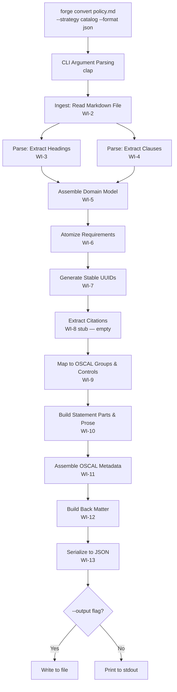
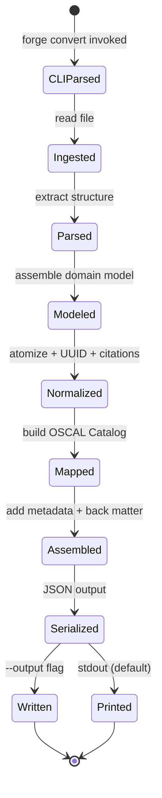
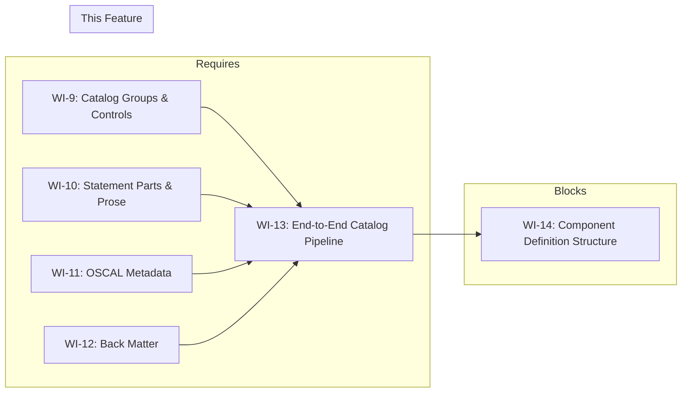

# 013-prd-catalog-pipeline

> **Document Type:** Product Requirements Document
> **Audience:** LLM agents, human reviewers
> **Status:** Draft
> **Last Updated:** 2026-02-10 <!-- @auto -->
> **Owner:** Brian Luby <!-- @human-required -->

**Feature Branch**: `013-catalog-pipeline`
**Created**: 2026-02-10
**Status**: Draft
**Input**: Derived from FORGE Product Roadmap WI-13

---

## Review Tier Legend

| Marker | Tier | Speckit Behavior |
|--------|------|------------------|
| 🔴 `@human-required` | Human Generated | Prompt human to author; blocks until complete |
| 🟡 `@human-review` | LLM + Human Review | LLM drafts → prompt human to confirm/edit; blocks until confirmed |
| 🟢 `@llm-autonomous` | LLM Autonomous | LLM completes; no prompt; logged for audit |
| ⚪ `@auto` | Auto-generated | System fills (timestamps, links); no prompt |

---

## Document Completion Order

> ⚠️ **For LLM Agents:** Complete sections in this order. Do not fill downstream sections until upstream human-required inputs exist.

1. **Context** (Background, Scope) → requires human input first
2. **Problem Statement & User Scenarios** → requires human input
3. **Requirements** (Must/Should/Could/Won't) → requires human input
4. **Technical Constraints** → human review
5. **Diagrams, Data Model, Interface** → LLM can draft after above exist
6. **Acceptance Criteria** → derived from requirements
7. **Everything else** → can proceed

---

## Context

### Background 🔴 `@human-required`
This PRD covers **WI-13: End-to-End Catalog Pipeline** from the FORGE Product Roadmap (Sprint S-13, May 26–30 2026, Theme T-2: OSCAL Model Generation, Milestone MS-2). This is the first end-to-end integration point in the FORGE project, wiring together ALL previous work items (WI-1 through WI-12) into a single executable pipeline. Sprints 1–8 (T-1: Core Pipeline) built ingestion, parsing, the domain model, atomization, UUID generation, and citation extraction. Sprints 9–12 (T-2: OSCAL Model Generation) built Catalog groups/controls, statement parts/prose, OSCAL metadata, and back matter. WI-13 connects these stages into a complete pipeline that accepts a Markdown policy document as input and produces a valid OSCAL v1.2.0 Catalog in JSON format as output. This is the MS-2 milestone exit criteria: the first valid OSCAL Catalog from Markdown.

### Scope Boundaries 🟡 `@human-review`

**In Scope:**
- Wiring the full pipeline: ingest → parse → normalize → map → assemble → serialize
- Implementing `--strategy catalog` CLI flag on the `convert` subcommand
- Implementing `--format json` CLI flag on the `convert` subcommand
- Implementing `--output <path>` CLI flag for file output (default: stdout)
- End-to-end smoke test: sample Markdown policy → OSCAL Catalog JSON output
- Integration of all pipeline stages built in WI-1 through WI-12

**Out of Scope:**
- Component Definition pipeline — deferred to WI-14 through WI-18 (013-prd-component-definition and beyond)
- XML or YAML output formats — deferred to WI-26/WI-27 (Phase 2)
- Schema validation of output — deferred to WI-19 (019-prd-schema-validation)
- Traceability embedding in output — deferred to WI-16/WI-17 (traceability work items)
- Profile generation — deferred to WI-30 (Phase 2)
- Golden-file test suite — deferred to WI-21/WI-22 (Phase 1 validation)
- Error handling polish — deferred to WI-23 (error handling sprint)

### Glossary 🟡 `@human-review`

| Term | Definition |
|------|------------|
| Pipeline | The full sequence of processing stages: ingest → parse → normalize → map → assemble → serialize |
| Ingest | Reading a Markdown file into memory with line tracking (WI-2) |
| Parse | Extracting structural hierarchy (headings, clauses) from Markdown (WI-3, WI-4) |
| Normalize | Atomizing compound requirements and generating stable UUIDs (WI-6, WI-7) |
| Map | Converting domain model elements to OSCAL Catalog structures (WI-9, WI-10) |
| Assemble | Combining OSCAL groups, controls, metadata, and back matter into a complete Catalog (WI-11, WI-12) |
| Serialize | Converting the assembled OSCAL Catalog to JSON output (this WI) |
| OSCAL Catalog | An OSCAL model representing a structured collection of controls (requirements) |
| stdout | Standard output — the default destination for CLI output when no `--output` flag is provided |

### Related Documents ⚪ `@auto`

| Document | Link | Relationship |
|----------|------|--------------|
| Parent PRD | docs/FORGE_PRD.md | Parent requirements M-3, M-7; AC-3; US-1 |
| Product Roadmap | docs/FORGE_PRODUCT_ROADMAP.md | Sprint S-13 context |
| Product Vision | docs/FORGE_PRODUCT_VISION.md | Strategic goal G-1 |
| Constitution | .specify/memory/constitution.md | Technical constraints and quality gates |
| Depends On | docs/PRD/001-prd-project-scaffolding.md | CLI framework and module structure |
| Depends On | docs/PRD/002-prd-markdown-ingestion.md | File reading and format detection |
| Depends On | docs/PRD/003-prd-structural-extraction-headings.md | Section hierarchy extraction |
| Depends On | docs/PRD/004-prd-structural-extraction-clauses.md | Clause extraction |
| Depends On | docs/PRD/005-prd-domain-model.md | PolicyDocument domain model |

---

## Problem Statement 🔴 `@human-required`

After 12 sprints of building individual pipeline stages, no single command exists that takes a Markdown policy document and produces an OSCAL Catalog. Each stage (ingestion, parsing, domain model assembly, OSCAL mapping, metadata generation, back matter assembly) has been implemented and tested in isolation, but they have never been wired together into an end-to-end flow. Without this integration, the `forge convert` command cannot fulfill its primary purpose (Parent PRD US-1: Convert Policy to OSCAL Catalog). This work item connects every upstream component into a single executable pipeline, implements the CLI flags that make it user-invocable (`--strategy catalog --format json --output`), and validates the result with a smoke test. This is the MS-2 milestone exit criteria — until this works, FORGE has no demonstrable user-facing capability.

---

## User Scenarios & Testing 🔴 `@human-required`

### User Story 1 — Convert Markdown Policy to OSCAL Catalog JSON (Priority: P1)

A compliance engineer runs the FORGE CLI to convert a Markdown security policy into an OSCAL Catalog JSON file.

> As a compliance engineer, I want to run `forge convert policy.md --strategy catalog --format json` and receive a complete OSCAL Catalog JSON on stdout so that I can begin using my policy requirements in machine-readable form.

**Why this priority**: This is the primary user scenario from the parent PRD (US-1). It is the MS-2 milestone exit criteria and the first end-to-end demonstration of FORGE's core value proposition.

**Independent Test**: Run `forge convert policy.md --strategy catalog --format json` with a sample Markdown policy containing sections and requirements, and verify a complete OSCAL Catalog JSON is produced on stdout with groups, controls, metadata, and back matter.

**Acceptance Scenarios**:
1. **Given** a Markdown policy document with 3 sections and 10 requirements, **When** running `forge convert policy.md --strategy catalog --format json`, **Then** a complete OSCAL Catalog JSON is produced on stdout with 3 groups, 10 controls, valid metadata, and back matter.
2. **Given** a Markdown policy document with YAML frontmatter (title, version), **When** converting to Catalog JSON, **Then** the OSCAL metadata fields (`title`, `version`, `last-modified`, `oscal-version`) are correctly populated from the document metadata.
3. **Given** a policy with compound statements ("Systems must X and must Y"), **When** converting, **Then** the compound statements are atomized into separate controls with individual stable IDs.

---

### User Story 2 — Write OSCAL Catalog to File (Priority: P1)

A compliance engineer directs the OSCAL Catalog output to a file instead of stdout.

> As a compliance engineer, I want to use `--output catalog.json` to write the OSCAL Catalog directly to a file so that I can integrate it into my workflow without shell redirection.

**Why this priority**: File output is essential for practical use. While stdout is the default and supports piping, many workflows require a named output file.

**Independent Test**: Run `forge convert policy.md --strategy catalog --format json --output catalog.json` and verify the file is created with valid OSCAL Catalog JSON content.

**Acceptance Scenarios**:
1. **Given** a Markdown policy document and `--output catalog.json`, **When** running the convert command, **Then** the file `catalog.json` is created containing the OSCAL Catalog JSON.
2. **Given** the `--output` flag is omitted, **When** running the convert command, **Then** the OSCAL Catalog JSON is printed to stdout.

---

### User Story 3 — Smoke Test End-to-End Pipeline (Priority: P1)

A developer verifies that the full pipeline works end-to-end with a representative sample policy.

> As a developer working on FORGE, I want an automated smoke test that converts a sample Markdown policy through the full pipeline so that I can verify all pipeline stages are correctly integrated.

**Why this priority**: The smoke test is the engineering verification that WI-1 through WI-12 are correctly wired together. Without it, there is no automated confidence that the pipeline works.

**Independent Test**: Run `cargo test` and verify the end-to-end smoke test passes, confirming a sample policy produces valid OSCAL Catalog JSON with expected structure.

**Acceptance Scenarios**:
1. **Given** a sample Markdown policy fixture in the test suite, **When** running the full pipeline programmatically in a test, **Then** the output is valid JSON containing an `oscal-version` field, a `catalog` object with `metadata`, `groups`, and controls.
2. **Given** the smoke test, **When** verifying the output structure, **Then** the number of groups matches the number of top-level sections in the source policy.

---

## Assumptions & Risks 🟡 `@human-review`

### Assumptions
- [A-1] All upstream pipeline stages (WI-1 through WI-12) are complete and their unit tests passing before WI-13 begins.
- [A-2] The `serde_json` crate is already available as a dependency (used by prior WIs for JSON serialization).
- [A-3] The OSCAL Catalog structure produced by WI-9 through WI-12 is serializable to JSON via serde derives.
- [A-4] stdout is an acceptable default output target; file output via `--output` is additive.

### Risks
| ID | Risk | Likelihood | Impact | Mitigation |
|----|------|------------|--------|------------|
| R-1 | Integration of 12 independent work items reveals interface mismatches between pipeline stages | Med | Med | Each WI was designed against a shared domain model (WI-5); integration tests catch mismatches early |
| R-2 | JSON serialization of assembled OSCAL Catalog produces output that does not match expected OSCAL JSON structure | Low | Med | Compare output structure against NIST OSCAL examples; schema validation in WI-19 will confirm |
| R-3 | Performance of full pipeline is poor for larger documents | Low | Low | This sprint focuses on correctness; performance benchmarking is in WI-24 |

---

## Feature Overview

### Flow Diagram 🟡 `@human-review`



### State Diagram (if applicable) 🟡 `@human-review`



---

## Requirements

### Must Have (M) — MVP, launch blockers 🔴 `@human-required`
- [ ] **M-1:** The `forge convert` command shall wire the full pipeline: ingest → parse → normalize → map → assemble → serialize, producing OSCAL Catalog JSON from a Markdown input file. *(Traces to: Parent PRD M-3, M-7)*
- [ ] **M-2:** The `convert` subcommand shall accept a `--strategy catalog` flag to select the Catalog conversion strategy. *(Traces to: Parent PRD M-3)*
- [ ] **M-3:** The `convert` subcommand shall accept a `--format json` flag to select JSON output format. *(Traces to: Parent PRD M-7)*
- [ ] **M-4:** The default output destination shall be stdout when no `--output` flag is provided. *(Traces to: Parent PRD M-7)*
- [ ] **M-5:** The `convert` subcommand shall accept an `--output <path>` flag to write the OSCAL Catalog JSON to a file. *(Traces to: Parent PRD M-7)*
- [ ] **M-6:** The output JSON shall be a syntactically valid JSON document that can be parsed by any standard JSON parser. *(Traces to: Parent PRD M-7)*
- [ ] **M-7:** An automated smoke test shall verify end-to-end conversion of a sample Markdown policy to OSCAL Catalog JSON, checking for the presence of `catalog`, `metadata`, `groups`, and controls in the output. *(Traces to: Parent PRD AC-3)*

### Should Have (S) — High value, not blocking 🔴 `@human-required`
- [ ] **S-1:** The output JSON shall be pretty-printed (indented) by default for human readability.
- [ ] **S-2:** The pipeline shall produce a non-zero exit code and descriptive error message if any pipeline stage fails (e.g., file not found, parsing failure, assembly error).
- [ ] **S-3:** The `--strategy` flag shall reject values other than `catalog` with a descriptive error (component support added in WI-18).

### Could Have (C) — Nice to have, if time permits 🟡 `@human-review`
- [ ] **C-1:** A `--compact` flag could produce minified (non-indented) JSON output for reduced file size.
- [ ] **C-2:** A `--dry-run` flag could run the pipeline without producing output, reporting only statistics (sections, requirements, controls generated).

### Won't Have (W) — Explicitly deferred 🟡 `@human-review`
- [ ] **W-1:** Component Definition pipeline (`--strategy component`) — *Reason: Deferred to WI-14 through WI-18*
- [ ] **W-2:** XML or YAML output (`--format xml`, `--format yaml`) — *Reason: Deferred to WI-26, WI-27 (Phase 2)*
- [ ] **W-3:** Schema validation of output — *Reason: Deferred to WI-19 (schema validation sprint)*
- [ ] **W-4:** Traceability metadata in output — *Reason: Deferred to WI-16, WI-17 (traceability sprints)*
- [ ] **W-5:** Profile generation — *Reason: Deferred to WI-30 (Phase 2)*

---

## Technical Constraints 🟡 `@human-review`

- **Language/Framework:** Rust (latest stable), Cargo build system
- **CLI Framework:** clap 4.x (established in WI-1)
- **Serialization:** `serde` + `serde_json` for JSON output
- **OSCAL Version:** Output shall target OSCAL v1.2.0 structure
- **Error Handling:** `thiserror` for pipeline stage errors; errors must propagate cleanly through the pipeline using `Result<T, ForgeError>`
- **Linting:** `cargo clippy -- -D warnings` must pass
- **Formatting:** `cargo fmt --all` must produce no changes
- **Testing:** TDD mandatory; smoke test must be included in `cargo test`
- **Output:** JSON output must be valid per RFC 8259; UTF-8 encoded

---

## Data Model (if applicable) 🟡 `@human-review`

N/A — No new data model introduced in this work item. This WI wires together the existing domain model (WI-5) and OSCAL Catalog model (WI-9 through WI-12). The pipeline stages consume and produce the data models defined in their respective WIs.

---

## Interface Contract (if applicable) 🟡 `@human-review`

```rust
// CLI Interface (WI-13 additions)

// forge convert <input> --strategy catalog --format json [--output <path>]
//
// Examples:
//   forge convert policy.md --strategy catalog --format json
//   forge convert policy.md --strategy catalog --format json --output catalog.json

// Pipeline orchestration function
/// Run the full catalog conversion pipeline from file path to OSCAL JSON
/// `max_size_bytes` is inherited from the ingest stage (WI-2) and configurable
/// via `--max-size <MB>` CLI flag (default: 10 MB). Files exceeding this limit
/// are rejected with a descriptive error suggesting `--max-size` override.
pub fn run_catalog_pipeline(
    input_path: &Path,
    output: Option<&Path>,
    max_size_bytes: u64,
) -> Result<(), ForgeError>;

// Internal pipeline stages (already implemented in WI-1 through WI-12):
// 1. ingest::read_file(path) -> Result<IngestedDocument, ForgeError>
// 2. parse::extract_sections(doc) -> Result<Vec<SectionNode>, ForgeError>
// 3. parse::extract_clauses(doc) -> Result<ExtractedContent, ForgeError>
// 4. model::assemble_document(ingested, sections, clauses) -> Result<PolicyDocument, ForgeError>
// 5. model::atomize_requirements(doc) -> Result<PolicyDocument, ForgeError>
// 6. model::generate_stable_ids(doc) -> Result<PolicyDocument, ForgeError>
// 7. model::extract_citations(doc) -> Result<PolicyDocument, ForgeError>
// 8. oscal::build_catalog(doc) -> Result<OscalCatalog, ForgeError>
// 9. oscal::assemble_metadata(doc, catalog) -> Result<OscalCatalog, ForgeError>
// 10. oscal::build_back_matter(doc, catalog) -> Result<OscalCatalog, ForgeError>
// 11. export::serialize_json(catalog) -> Result<String, ForgeError>

// Output handling
/// Write JSON string to file or stdout
pub fn write_output(
    json: &str,
    output_path: Option<&Path>,
) -> Result<(), ForgeError>;
```

---

## Evaluation Criteria 🟡 `@human-review`

| Criterion | Weight | Metric | Target | Notes |
|-----------|--------|--------|--------|-------|
| End-to-End Success | Critical | `forge convert policy.md --strategy catalog --format json` produces output | Valid JSON with catalog structure | MS-2 exit criteria |
| Pipeline Integration | Critical | All pipeline stages (ingest through serialize) execute without error | Zero pipeline errors on valid input | First full integration |
| Output Completeness | Critical | Output JSON contains metadata, groups, and controls | All expected fields present | Verified by smoke test |
| File Output | High | `--output` flag writes JSON to specified path | File created and readable | Practical usability |
| Stdout Default | High | Output goes to stdout when no `--output` flag | JSON printed to terminal | Composable CLI behavior |

---

## Tool/Approach Candidates 🟡 `@human-review`

| Option | License | Pros | Cons | Spike Result |
|--------|---------|------|------|--------------|
| serde_json (pretty print) | MIT/Apache-2.0 | Standard JSON serialization; `to_string_pretty()` for readable output | None significant | Already in use from prior WIs |
| Direct pipeline function composition | N/A | Simple, testable, each stage is a function call | Long function chain | Selected: clearest approach for integration |

### Selected Approach 🔴 `@human-required`
> **Decision:** Compose pipeline stages as a sequence of function calls in a `run_catalog_pipeline` orchestrator function; use `serde_json::to_string_pretty()` for JSON serialization; write to stdout by default or to file via `--output`.
> **Rationale:** Each pipeline stage is already implemented and tested. The orchestrator simply calls them in sequence, passing each stage's output to the next. This approach is straightforward, testable, and produces the minimal integration code needed.

---

## Acceptance Criteria 🟡 `@human-review`

| AC ID | Requirement | User Story | Given | When | Then |
|-------|-------------|------------|-------|------|------|
| AC-1 | M-1, M-2, M-3 | US-1 | A Markdown policy with 3 sections and 10 requirements | Running `forge convert policy.md --strategy catalog --format json` | A complete OSCAL Catalog JSON is printed to stdout with 3 groups and 10 controls |
| AC-2 | M-1 | US-1 | A Markdown policy with YAML frontmatter (title, version) | Running the convert command | OSCAL metadata contains correct title, version, oscal-version ("1.2.0"), and last-modified |
| AC-3 | M-4 | US-2 | No `--output` flag provided | Running the convert command | OSCAL Catalog JSON is printed to stdout |
| AC-4 | M-5 | US-2 | `--output catalog.json` flag provided | Running the convert command | File `catalog.json` is created containing the OSCAL Catalog JSON |
| AC-5 | M-6 | US-1 | Output from the convert command | Parsing the output with a standard JSON parser | The output parses without error as valid JSON |
| AC-6 | M-7 | US-3 | A sample Markdown policy fixture | Running `cargo test` (smoke test) | The smoke test passes, verifying the output contains `catalog`, `metadata`, `groups`, and controls |
| AC-7 | M-1 | US-1 | A policy with compound statements | Running the convert command | Compound statements are atomized into separate controls with individual stable IDs |

### Edge Cases 🟢 `@llm-autonomous`
- [ ] **EC-1:** (M-1) When the input file does not exist, then `forge convert` exits with a non-zero status code and a descriptive error message.
- [ ] **EC-2:** (M-1) When the input file is empty (zero bytes), then `forge convert` exits with an error indicating no content to process.
- [ ] **EC-3:** (M-5) When the `--output` path is in a non-existent directory, then `forge convert` exits with an error indicating the output path is invalid.
- [ ] **EC-4:** (M-2) When `--strategy` is omitted, then `forge convert` exits with an error indicating the `--strategy` flag is required.
- [ ] **EC-5:** (M-3) When `--format` is omitted, then `forge convert` exits with an error indicating the `--format` flag is required.
- [ ] **EC-6:** (M-1) When the input Markdown has no identifiable sections or requirements, then the pipeline produces a Catalog with empty groups and a warning is emitted to stderr.
- [ ] **EC-7:** (M-5) When `--output` points to an existing file, then the file is overwritten with the new output.

---

## Dependencies 🟡 `@human-review`



- **Requires:** [WI-9: Catalog Groups & Controls], [WI-10: Statement Parts & Prose], [WI-11: OSCAL Metadata], [WI-12: Back Matter] — and transitively all of WI-1 through WI-8
- **Blocks:** [WI-14: Component Definition Structure] (component definition builds on the catalog pipeline pattern)
- **External:** None

---

## Security Considerations 🟡 `@human-review`

| Aspect | Assessment | Notes |
|--------|------------|-------|
| Internet Exposure | No | CLI tool, no network services |
| Sensitive Data | Yes | Pipeline processes policy document content which may contain sensitive operational details |
| Authentication Required | No | Local CLI tool |
| Security Review Required | No | This WI wires existing, already-reviewed stages together; no new input parsing or data processing logic beyond file I/O for `--output` |

Additional security notes:
- The `--output` flag writes to a user-specified file path. The path should be treated as untrusted user input, but standard Rust `std::fs::File::create()` provides safe behavior (no path traversal risk in the CLI context).
- Policy document content flows through the pipeline and appears in the output JSON. Users should treat output files with the same sensitivity as the source policy.

---

## Implementation Guidance 🟢 `@llm-autonomous`

### Suggested Approach
Create a `run_catalog_pipeline` function that composes all pipeline stages in sequence. In the CLI handler for `forge convert`, parse the `--strategy`, `--format`, and `--output` flags using clap, then dispatch to the pipeline function. The pipeline function calls each stage in order, threading the output of each stage into the input of the next. After the final OSCAL Catalog is assembled, serialize it to JSON using `serde_json::to_string_pretty()`. If `--output` is specified, write to the file; otherwise, print to stdout.

For the smoke test, create a small but representative Markdown policy fixture (e.g., 2-3 sections, 5-10 requirements, YAML frontmatter) and run it through the pipeline programmatically. Assert on the structure of the output: presence of `catalog` root, `metadata` with required fields, `groups` array with the expected count, and controls within groups.

### Anti-patterns to Avoid
- Building a separate "integration" copy of the pipeline logic rather than calling the existing stage functions — the whole point is to wire existing code together
- Skipping the smoke test because "unit tests for each stage already pass" — integration bugs live at the boundaries between stages
- Hard-coding output to a file without supporting stdout — stdout is essential for composability (`forge convert ... | jq .`)
- Catching and silently swallowing errors from pipeline stages — errors must propagate to the CLI and produce non-zero exit codes

### Reference Examples
- NIST OSCAL Catalog JSON examples for expected output structure
- clap documentation for subcommand flag definitions: https://docs.rs/clap/latest/clap/_derive/index.html
- serde_json pretty printing: `serde_json::to_string_pretty(&catalog)?`

---

## Spike Tasks 🟡 `@human-review`

N/A — No spike tasks for this work item. All technical decisions have been made in prior WIs. This is a pure integration and wiring sprint.

---

## Success Metrics 🔴 `@human-required`

| Metric | Baseline | Target | Measurement Method |
|--------|----------|--------|-------------------|
| End-to-end pipeline works | No pipeline exists | `forge convert policy.md --strategy catalog --format json` produces output | Manual verification + smoke test |
| Output is valid JSON | N/A | Parseable by `serde_json::from_str` | Smoke test assertion |
| Output contains expected OSCAL structure | N/A | `catalog`, `metadata`, `groups`, controls present | Smoke test assertion |
| File output works | N/A | `--output` creates file with correct content | Smoke test or manual verification |

### Technical Verification 🟢 `@llm-autonomous`
| Metric | Target | Verification Method |
|--------|--------|---------------------|
| Smoke test passes | 100% | `cargo test` |
| No clippy warnings | 0 | `cargo clippy -- -D warnings` |
| No formatting violations | 0 | `cargo fmt --check` |
| Pipeline error propagation | All stages | Unit test verifying each stage error reaches CLI exit code |

---

## Definition of Ready 🔴 `@human-required`

### Readiness Checklist
- [x] Problem statement reviewed and validated by stakeholder
- [x] All Must Have requirements have acceptance criteria
- [x] Technical constraints are explicit and agreed
- [x] Dependencies identified and owners confirmed
- [x] Security review completed (or N/A documented with justification)
- [x] No open questions blocking implementation

### Sign-off
| Role | Name | Date | Decision |
|------|------|------|----------|
| Product Owner | Brian Luby | YYYY-MM-DD | [Ready / Not Ready] |

---

## Changelog ⚪ `@auto`

| Version | Date | Author | Changes |
|---------|------|--------|---------|
| 0.1 | 2026-02-10 | LLM (Claude) | Initial draft derived from FORGE Product Roadmap WI-13 |

---

## Decision Log 🟡 `@human-review`

| Date | Decision | Rationale | Alternatives Considered |
|------|----------|-----------|------------------------|
| 2026-02-10 | Default output to stdout, file output via `--output` flag | stdout enables composability with other CLI tools (piping to `jq`, redirection); `--output` adds convenience for direct file writing | Default to file output (breaks composability); require `--output` always (verbose for simple use) |
| 2026-02-10 | Pretty-print JSON by default | Human readability during development and review is more valuable than compact output at this stage; `--compact` can be added later | Compact by default (harder to debug); configurable indentation (over-engineering for MVP) |
| 2026-02-10 | Single orchestrator function for pipeline | Keeps integration code minimal and testable; each stage is already a separate function | Pipeline trait with dynamic dispatch (over-engineered for 1 strategy); macro-based composition (obscures flow) |

---

## Open Questions 🟡 `@human-review`

No open questions for this work item.

---

## Review Checklist 🟢 `@llm-autonomous`

Before marking as Approved:
- [x] All requirements have unique IDs (M-1 through M-7, S-1 through S-3, C-1 through C-2, W-1 through W-5)
- [x] All Must Have requirements have linked acceptance criteria
- [x] User stories are prioritized and independently testable
- [x] Acceptance criteria reference both requirement IDs and user stories
- [x] Glossary terms are used consistently throughout
- [x] Diagrams use terminology from Glossary
- [x] Security considerations documented
- [x] Definition of Ready checklist is complete
- [x] No open questions blocking implementation
