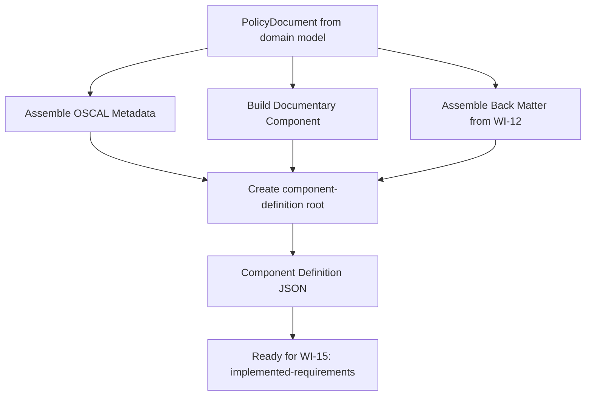
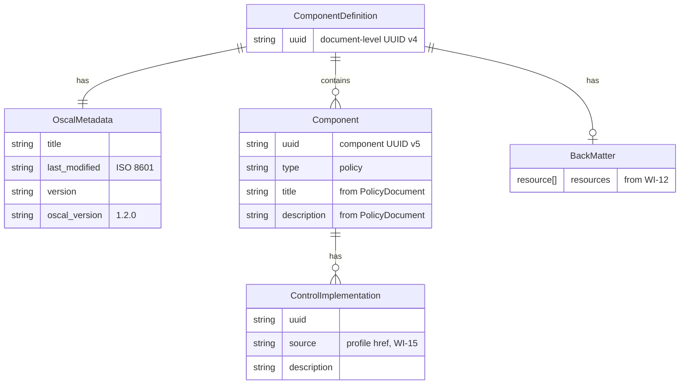
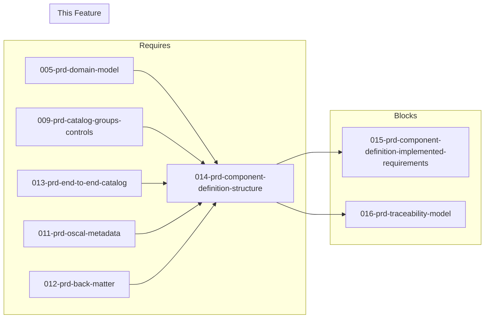

# 014-prd-component-definition-structure

> **Document Type:** Product Requirements Document
> **Audience:** LLM agents, human reviewers
> **Status:** Draft
> **Last Updated:** 2026-02-10 <!-- @auto -->
> **Owner:** Brian Luby <!-- @human-required -->

**Feature Branch**: `014-component-definition-structure`
**Created**: 2026-02-10
**Status**: Draft
**Input**: Derived from FORGE Product Roadmap WI-14

---

## Review Tier Legend

| Marker | Tier | Speckit Behavior |
|--------|------|------------------|
| :red_circle: `@human-required` | Human Generated | Prompt human to author; blocks until complete |
| :yellow_circle: `@human-review` | LLM + Human Review | LLM drafts -> prompt human to confirm/edit; blocks until confirmed |
| :green_circle: `@llm-autonomous` | LLM Autonomous | LLM completes; no prompt; logged for audit |
| :white_circle: `@auto` | Auto-generated | System fills (timestamps, links); no prompt |

---

## Document Completion Order

> :warning: **For LLM Agents:** Complete sections in this order. Do not fill downstream sections until upstream human-required inputs exist.

1. **Context** (Background, Scope) -> requires human input first
2. **Problem Statement & User Scenarios** -> requires human input
3. **Requirements** (Must/Should/Could/Won't) -> requires human input
4. **Technical Constraints** -> human review
5. **Diagrams, Data Model, Interface** -> LLM can draft after above exist
6. **Acceptance Criteria** -> derived from requirements
7. **Everything else** -> can proceed

---

## Context

### Background :red_circle: `@human-required`
This PRD covers **WI-14: Component Definition -- Structure** from the FORGE Product Roadmap (Sprint S-14, Jun 2-6 2026, Theme T-2: OSCAL Model Generation, Milestone MS-3). After the end-to-end Catalog pipeline is working (WI-13), the next major OSCAL artifact to generate is the Component Definition. The OSCAL Component Definition model describes how controls are implemented by reusable components -- and critically, it supports "documentary components" of type `"policy"`, `"procedure"`, or `"process"` that represent non-technical control implementations such as security policies. This work item creates the outer Component Definition JSON structure with a documentary component derived from the PolicyDocument. WI-15 then populates the `implemented-requirements` within that structure, and WI-16 adds traceability links.

### Scope Boundaries :yellow_circle: `@human-review`

**In Scope:**
- Implementing the Component Definition JSON builder (the `component-definition` root object)
- Creating a documentary component with `type: "policy"` inside the Component Definition
- Generating the component UUID, title, and description from `PolicyDocument` metadata
- Generating the Component Definition document-level UUID and required OSCAL metadata (`uuid`, `title`, `last-modified`, `version`, `oscal-version`)
- Reusing the metadata assembly pattern established in WI-11 for the Component Definition envelope
- Producing a structurally valid Component Definition JSON (not yet schema-validated -- that is WI-19)

**Out of Scope:**
- `control-implementations` and `implemented-requirements` mapping -- deferred to WI-15 (015-prd-component-definition-implemented-requirements)
- Traceability props/links on Component Definition elements -- deferred to WI-16/WI-17
- Source Profile reference (`source` field in `control-implementations`) -- deferred to WI-15
- Schema validation of generated output -- deferred to WI-19
- Back matter resources in the Component Definition -- already implemented in WI-12, reused here
- End-to-end `--strategy component` CLI wiring -- deferred to WI-18

### Glossary :yellow_circle: `@human-review`

| Term | Definition |
|------|------------|
| Component Definition | OSCAL model (`component-definition`) describing how controls are implemented by reusable components or capabilities |
| Documentary Component | An OSCAL component of type `"policy"`, `"procedure"`, or `"process"` representing non-technical control implementations |
| Component | A reusable unit within a Component Definition that describes control implementation capabilities |
| Component UUID | A stable UUID v5 (deterministic, content-based) identifier for the documentary component within the Component Definition |
| OSCAL Metadata | The required metadata block in every OSCAL document: `uuid`, `title`, `last-modified`, `version`, `oscal-version` |
| PolicyDocument | The internal domain model struct representing a parsed policy document (from WI-5) |

### Related Documents :white_circle: `@auto`

| Document | Link | Relationship |
|----------|------|--------------|
| Parent PRD | docs/FORGE_PRD.md | Parent requirement M-4, AC-4, US-2 |
| Product Roadmap | docs/FORGE_PRODUCT_ROADMAP.md | Sprint S-14 context |
| Product Vision | docs/FORGE_PRODUCT_VISION.md | Strategic goal G-1, G-2 |
| OSCAL Research | docs/research/OSCAL_Research.md | Component Definition model details and sample output |
| Constitution | .specify/memory/constitution.md | Technical constraints and quality gates |
| Depends On | docs/PRD/005-prd-domain-model.md | PolicyDocument struct consumed by this builder |

---

## Problem Statement :red_circle: `@human-required`

The Catalog pipeline (WI-9 through WI-13) treats policy requirements as the authoritative control set (catalog-first strategy). However, many organizations need the component-first strategy: representing their security policy as a documentary component that "implements" controls from an external baseline (e.g., NIST SP 800-53). The OSCAL Component Definition model supports this via documentary components of type `"policy"`. Without a Component Definition builder, FORGE cannot support the `--strategy component` conversion path, which is a Must Have requirement (M-4) in the parent PRD and the core of User Story 2 (US-2). This work item builds the structural envelope -- the Component Definition document with its documentary component -- so that WI-15 can populate the implementation details and WI-18 can wire the end-to-end pipeline.

---

## User Scenarios & Testing :red_circle: `@human-required`

### User Story 1 -- Generate Component Definition Structure (Priority: P1)

A developer or compliance engineer converts a policy document and needs the outer Component Definition JSON structure with a documentary component representing the policy.

> As a developer working on FORGE, I want to generate a valid OSCAL Component Definition structure from a PolicyDocument so that the component-first conversion strategy has its foundational artifact.

**Why this priority**: This is the structural foundation for the entire component-first strategy. WI-15 (implemented-requirements), WI-16 (traceability), and WI-18 (end-to-end pipeline) all depend on it. It directly enables Parent PRD M-4 and US-2.

**Independent Test**: Given a PolicyDocument with title "Corporate Security Policy" and version "2.0", build a Component Definition and verify the JSON contains a `component-definition` root with correct metadata and a `components` array with one documentary component of type `"policy"`.

**Acceptance Scenarios**:
1. **Given** a PolicyDocument with title and version, **When** building a Component Definition, **Then** the output JSON has a `component-definition` root object with `uuid`, `metadata.title`, `metadata.last-modified`, `metadata.version`, and `metadata.oscal-version` fields correctly populated.
2. **Given** a PolicyDocument, **When** building a Component Definition, **Then** the `components` array contains exactly one entry with `type: "policy"`, a valid UUID, and `title`/`description` derived from the PolicyDocument.

---

### User Story 2 -- Reuse Metadata Assembly Pattern (Priority: P1)

The Component Definition must use the same metadata assembly logic as the Catalog builder to ensure consistency.

> As a developer working on FORGE, I want the Component Definition to reuse the metadata assembly pattern from the Catalog builder so that all OSCAL artifacts are generated consistently.

**Why this priority**: Consistency across artifacts prevents bugs and reduces maintenance. The metadata pattern (WI-11) is already proven for Catalog generation.

**Independent Test**: Build both a Catalog and a Component Definition from the same PolicyDocument and verify their metadata blocks are structurally identical (same fields, same `oscal-version`, same derivation of title/version).

**Acceptance Scenarios**:
1. **Given** the same PolicyDocument, **When** generating both a Catalog and a Component Definition, **Then** both artifacts have structurally consistent `metadata` blocks with the same `oscal-version: "1.2.0"` and matching title/version derivation.
2. **Given** a PolicyDocument with no version, **When** generating a Component Definition, **Then** `metadata.version` defaults to `"0.0.0"` (consistent with Catalog behavior).

---

## Assumptions & Risks :yellow_circle: `@human-review`

### Assumptions
- [A-1] The Catalog builder pattern (WI-9 through WI-13) is complete and provides a reusable metadata assembly function.
- [A-2] The Component Definition at this stage contains exactly one documentary component (one policy document = one component). Multi-component definitions are a future extension.
- [A-3] The `control-implementations` array will be empty or absent at this stage -- WI-15 populates it.
- [A-4] Back matter assembly (WI-12) can be reused for the Component Definition without modification.
- [A-5] OSCAL v1.2.0 Component Definition JSON structure is stable and well-documented.

### Risks
| ID | Risk | Likelihood | Impact | Mitigation |
|----|------|------------|--------|------------|
| R-1 | Component Definition JSON structure differs from research examples in edge cases | Low | Med | Validate against NIST published examples; defer full schema validation to WI-19 |
| R-2 | Metadata assembly from WI-11 needs modification for Component Definition | Low | Low | Component Definition metadata follows the same OSCAL pattern; minor adjustments only |
| R-3 | Documentary component description derivation is unclear for minimal PolicyDocuments | Low | Low | Default to title + "policy document" description; allow override later |

---

## Feature Overview

### Flow Diagram :yellow_circle: `@human-review`



### State Diagram (if applicable) :yellow_circle: `@human-review`
N/A -- No state transitions in this work item. The builder produces a complete Component Definition structure in a single pass.

---

## Requirements

### Must Have (M) -- MVP, launch blockers :red_circle: `@human-required`
- [ ] **M-1:** The builder shall produce a JSON object with root key `"component-definition"` conforming to the OSCAL Component Definition model structure. *(Traces to: Parent PRD M-4)*
- [ ] **M-2:** The Component Definition shall include required OSCAL metadata: `uuid` (document-level, UUID v4), `title`, `last-modified`, `version`, and `oscal-version` set to `"1.2.0"`. *(Traces to: Parent PRD M-4, M-5)*
- [ ] **M-3:** The `components` array shall contain one documentary component with `type: "policy"`. *(Traces to: Parent PRD M-4)*
- [ ] **M-4:** The documentary component shall have a stable UUID generated from PolicyDocument content (UUID v5, consistent with WI-7 pattern). *(Traces to: Parent PRD M-4, M-8)*
- [ ] **M-5:** The documentary component `title` shall be derived from `PolicyDocument.metadata.title`. *(Traces to: Parent PRD M-4)*
- [ ] **M-6:** The documentary component `description` shall use the template format `"Documentary component representing the {title} policy document."` where `{title}` is the PolicyDocument's title (or the default title if empty). *(Traces to: Parent PRD M-4)*
- [ ] **M-7:** The builder shall reuse the metadata assembly function established in WI-11 for generating the document-level metadata block. *(Traces to: consistency with WI-11)*

### Should Have (S) -- High value, not blocking :red_circle: `@human-required`
- [ ] **S-1:** The builder shall include an empty `control-implementations` array on the documentary component as a placeholder for WI-15.
- [ ] **S-2:** The builder shall include back matter resources (reusing WI-12 logic) when the PolicyDocument contains citations.

### Could Have (C) -- Nice to have, if time permits :yellow_circle: `@human-review`
- [ ] **C-1:** The documentary component could include `props` for document-level metadata (e.g., `prop` with `name: "source-document-version"` and `value` from PolicyDocument version).

### Won't Have (W) -- Explicitly deferred :yellow_circle: `@human-review`
- [ ] **W-1:** `implemented-requirements` population -- *Reason: Deferred to WI-15*
- [ ] **W-2:** Source profile reference in `control-implementations[].source` -- *Reason: Deferred to WI-15*
- [ ] **W-3:** Traceability props/links on component elements -- *Reason: Deferred to WI-16/WI-17*
- [ ] **W-4:** Schema validation of generated Component Definition -- *Reason: Deferred to WI-19*
- [ ] **W-5:** End-to-end CLI wiring (`--strategy component`) -- *Reason: Deferred to WI-18*
- [ ] **W-6:** Multiple documentary components per Component Definition -- *Reason: Single policy = single component for now; multi-component is a future extension*

---

## Technical Constraints :yellow_circle: `@human-review`

- **Language/Framework:** Rust (latest stable), Cargo build system
- **OSCAL Version:** Target OSCAL v1.2.0 Component Definition model
- **Output Format:** JSON (via `serde_json`)
- **UUID Generation:** UUID v4 for document-level identifier; UUID v5 (deterministic, content-based) for the documentary component, consistent with WI-7 pattern
- **Metadata Assembly:** Must reuse the metadata builder from WI-11 (shared across Catalog and Component Definition)
- **Serialization:** `serde` with `#[serde(rename)]` to produce OSCAL-compliant JSON keys (e.g., `component-definition`, `oscal-version`, `last-modified`)
- **Linting:** `cargo clippy -- -D warnings` must pass
- **Formatting:** `cargo fmt --check` must pass
- **Testing:** TDD mandatory; unit tests for Component Definition construction

---

## Data Model (if applicable) :yellow_circle: `@human-review`



---

## Interface Contract (if applicable) :yellow_circle: `@human-review`

```rust
/// Build an OSCAL Component Definition from a PolicyDocument.
///
/// Produces a `ComponentDefinitionEnvelope` with:
///   - document-level UUID (v4) and metadata (via WI-11 `assemble_metadata`)
///   - one documentary component (type: "policy") with UUID (v5), title, description
///   - empty control-implementations placeholder (populated by WI-15)
///   - optional back matter (reused from WI-12)
///
/// Note: Returns typed structs with `#[derive(Serialize)]` consistent with the
/// actual Catalog builder pattern (see research.md R-1). The AR's original
/// recommendation of `serde_json::Value` was based on a mistaken premise about
/// the Catalog builder's implementation.
pub fn build_component_definition(
    document: &PolicyDocument,
) -> Result<ComponentDefinitionEnvelope, ForgeError>;

// Expected JSON output structure (via serde serialization of typed structs):
// {
//   "component-definition": {
//     "uuid": "<document-uuid-v4>",
//     "metadata": {
//       "title": "<from PolicyDocument>",
//       "last-modified": "<ISO 8601 timestamp>",
//       "version": "<from PolicyDocument or 0.0.0>",
//       "oscal-version": "1.2.0"
//     },
//     "components": [
//       {
//         "uuid": "<component-uuid-v5>",
//         "type": "policy",
//         "title": "<from PolicyDocument.metadata.title>",
//         "description": "Documentary component representing the {title} policy document.",
//         "control-implementations": []
//       }
//     ],
//     "back-matter": { ... }  // optional, from WI-12
//   }
// }
```

---

## Evaluation Criteria :yellow_circle: `@human-review`

| Criterion | Weight | Metric | Target | Notes |
|-----------|--------|--------|--------|-------|
| JSON Structure | Critical | Output matches OSCAL Component Definition shape | Matches NIST example structure | Root key, metadata, components array |
| Metadata Completeness | Critical | All required metadata fields present | 5 of 5 fields populated | uuid, title, last-modified, version, oscal-version |
| Component Type | Critical | Documentary component type is correct | `"policy"` | Per OSCAL Component Definition model |
| UUID Determinism | High | Component UUID stable across identical inputs | Same UUID for same PolicyDocument content | Consistent with WI-7 pattern |
| Pattern Reuse | High | Metadata assembly reuses WI-11 logic | Shared function, not duplicated code | DRY principle |

---

## Tool/Approach Candidates :yellow_circle: `@human-review`

| Option | License | Pros | Cons | Spike Result |
|--------|---------|------|------|--------------|
| serde_json Value builder | MIT/Apache-2.0 | Flexible JSON construction | No compile-time OSCAL shape enforcement | Originally selected; superseded by research R-1 |
| Typed Component Definition structs | N/A | Compile-time safety; serde derives; matches actual Catalog builder pattern | More upfront code | **Selected** -- consistent with actual Catalog builder (research R-1) |

### Selected Approach :red_circle: `@human-required`
> **Decision:** Use typed Rust structs with `#[derive(Serialize)]` consistent with the actual Catalog builder pattern (research R-1), with shared metadata assembly from WI-11.
> **Rationale:** Research R-1 found that the Catalog builder uses typed structs (`CatalogEnvelope`, `OscalCatalog`, etc.), not `serde_json::Value`. The original decision was based on a mistaken premise. Using typed structs provides compile-time field enforcement, self-documenting code, and true consistency with the established codebase pattern.

---

## Acceptance Criteria :yellow_circle: `@human-review`

| AC ID | Requirement | User Story | Given | When | Then |
|-------|-------------|------------|-------|------|------|
| AC-1 | M-1 | US-1 | A PolicyDocument with title and sections | Calling `build_component_definition()` | JSON output has root key `"component-definition"` |
| AC-2 | M-2 | US-1, US-2 | A PolicyDocument with title "Corp Policy" and version "2.0" | Building Component Definition | `metadata.title` = "Corp Policy", `metadata.version` = "2.0", `metadata.oscal-version` = "1.2.0", `uuid` and `last-modified` present |
| AC-3 | M-3 | US-1 | A PolicyDocument | Building Component Definition | `components` array has exactly one entry with `"type": "policy"` |
| AC-4 | M-4 | US-1 | Same PolicyDocument built twice | Comparing component UUIDs | Both runs produce the same component UUID |
| AC-5 | M-5, M-6 | US-1 | A PolicyDocument with title "Access Control Policy" | Building Component Definition | Component `title` = "Access Control Policy" and `description` is a non-empty string derived from the document |
| AC-6 | M-7 | US-2 | A PolicyDocument | Building both Catalog and Component Definition | Both artifacts have structurally consistent metadata blocks |

### Edge Cases :green_circle: `@llm-autonomous`
- [ ] **EC-1:** (M-5) When PolicyDocument has no title (empty string), then the component title defaults to `"Untitled Policy Document"`.
- [ ] **EC-2:** (M-2) When PolicyDocument has no version, then `metadata.version` defaults to `"0.0.0"`.
- [ ] **EC-3:** (M-3) When PolicyDocument has no sections or requirements, then the Component Definition is still produced with one documentary component (empty content is valid at this structural stage).
- [ ] **EC-4:** (M-4) When PolicyDocument content changes substantively, then the component UUID changes (deterministic v5 generation).
- [ ] **EC-5:** (M-1) When the builder is called, then the output JSON is parseable by `serde_json` and the root key is exactly `"component-definition"` (hyphenated, per OSCAL convention).

---

## Dependencies :yellow_circle: `@human-review`



- **Requires:** WI-9/WI-13 (Catalog pattern to build on -- D-4 in dependency registry), WI-11 (metadata assembly), WI-12 (back matter), WI-5 (PolicyDocument domain model)
- **Blocks:** WI-15 (implemented-requirements), WI-16 (traceability)
- **External:** None

---

## Security Considerations :yellow_circle: `@human-review`

| Aspect | Assessment | Notes |
|--------|------------|-------|
| Internet Exposure | No | CLI tool, no network services |
| Sensitive Data | Yes | Component Definition contains policy document title and description derived from potentially sensitive policy content |
| Authentication Required | No | Local CLI tool |
| Security Review Required | No | JSON builder only; no external input processing beyond the already-parsed PolicyDocument |

---

## Implementation Guidance :green_circle: `@llm-autonomous`

### Suggested Approach
Implement a `build_component_definition` function in the `oscal` module that mirrors the pattern established by the Catalog builder. Start by calling the shared metadata assembly function (WI-11) to produce the metadata block. Then construct the documentary component object with `type: "policy"`, generating its UUID using UUID v5 (same namespace and content-hashing approach as WI-7) from the PolicyDocument's title and content. Set the component title from `PolicyDocument.metadata.title` and derive a description (e.g., `"Documentary component representing the {title} policy document."`). Wrap the component in a `components` array within the `component-definition` root object. Include back matter if citations exist (reusing WI-12 logic). Return the complete JSON structure as a `serde_json::Value`.

### Anti-patterns to Avoid
- Duplicating metadata assembly logic instead of reusing WI-11's shared function
- Hard-coding UUIDs or using random UUID v4 for the component (must be deterministic v5 for stability)
- Including `control-implementations` content at this stage -- that is WI-15's responsibility
- Embedding policy requirement text in the component description -- keep the description high-level; detailed mapping happens in WI-15
- Using OSCAL `remarks` for arbitrary data -- use `prop` if additional metadata is needed (per NIST guidance)

### Reference Examples
- OSCAL Research sample Component Definition: `docs/research/OSCAL_Research.md` (Sample component definition section)
- NIST OSCAL Component Definition model reference: https://pages.nist.gov/OSCAL/reference/latest/component-definition/json-outline/
- Catalog builder pattern in the codebase (WI-9/WI-10) for structural consistency

---

## Spike Tasks :yellow_circle: `@human-review`

N/A -- No spike tasks for this work item. The Component Definition JSON structure is well-documented in OSCAL v1.2.0 and the OSCAL Research document includes a sample output. The builder pattern is already established by the Catalog pipeline.

---

## Success Metrics :red_circle: `@human-required`

| Metric | Baseline | Target | Measurement Method |
|--------|----------|--------|-------------------|
| Component Definition structure produced | N/A | Valid JSON with correct root key and documentary component | Unit tests |
| Metadata completeness | N/A | All 5 required fields populated | Unit tests |
| Component UUID stability | N/A | Identical UUID for identical PolicyDocument content | Determinism unit test |

### Technical Verification :green_circle: `@llm-autonomous`
| Metric | Target | Verification Method |
|--------|--------|---------------------|
| Test coverage for builder | >90% | `cargo test` + coverage tool |
| No clippy warnings | 0 | `cargo clippy -- -D warnings` |
| No formatting violations | 0 | `cargo fmt --check` |
| Output matches OSCAL example shape | Manual comparison | Compare against OSCAL Research sample Component Definition |

---

## Definition of Ready :red_circle: `@human-required`

### Readiness Checklist
- [x] Problem statement reviewed and validated by stakeholder
- [x] All Must Have requirements have acceptance criteria
- [x] Technical constraints are explicit and agreed
- [x] Dependencies identified and owners confirmed
- [x] Security review completed (or N/A documented with justification)
- [x] No open questions blocking implementation

### Sign-off
| Role | Name | Date | Decision |
|------|------|------|----------|
| Product Owner | Brian Luby | YYYY-MM-DD | [Ready / Not Ready] |

---

## Changelog :white_circle: `@auto`

| Version | Date | Author | Changes |
|---------|------|--------|---------|
| 0.1 | 2026-02-10 | LLM (Claude) | Initial draft derived from FORGE Product Roadmap WI-14 |

---

## Decision Log :yellow_circle: `@human-review`

| Date | Decision | Rationale | Alternatives Considered |
|------|----------|-----------|------------------------|
| 2026-02-10 | Use serde_json::Value builder pattern (same as Catalog) | Original decision based on assumed Catalog pattern | Typed Component Definition structs |
| 2026-02-12 | **Override**: Use typed structs with `#[derive(Serialize)]` (research R-1) | Research found Catalog actually uses typed structs, not serde_json::Value; typed structs provide compile-time enforcement and true codebase consistency | serde_json::Value (AR original recommendation, based on mistaken premise) |
| 2026-02-10 | Single documentary component per Component Definition | One policy document maps to one component; simplest correct representation per OSCAL model | Multiple components per definition (adds complexity without current use case) |
| 2026-02-10 | UUID v5 for component, UUID v4 for document | Component UUID must be deterministic for stability across re-conversions; document UUID is an artifact instance identifier | UUID v4 for both (breaks stability requirement); UUID v5 for both (document instance should be unique per generation) |

---

## Open Questions :yellow_circle: `@human-review`

No open questions for this work item.

---

## Review Checklist :green_circle: `@llm-autonomous`

Before marking as Approved:
- [x] All requirements have unique IDs (M-1 through M-7, S-1 through S-2, C-1, W-1 through W-6)
- [x] All Must Have requirements have linked acceptance criteria
- [x] User stories are prioritized and independently testable
- [x] Acceptance criteria reference both requirement IDs and user stories
- [x] Glossary terms are used consistently throughout
- [x] Diagrams use terminology from Glossary
- [x] Security considerations documented
- [x] Definition of Ready checklist is complete
- [x] No open questions blocking implementation
