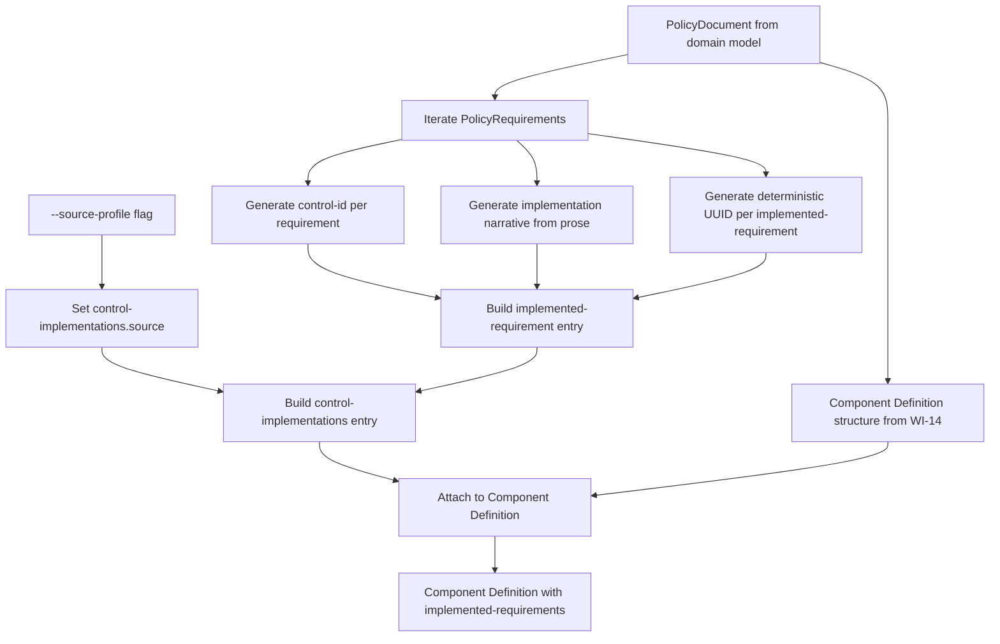
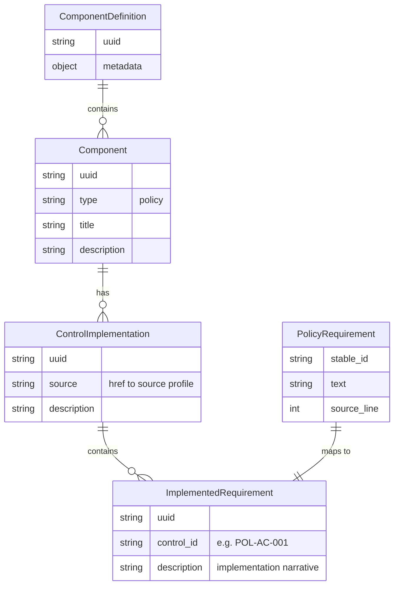
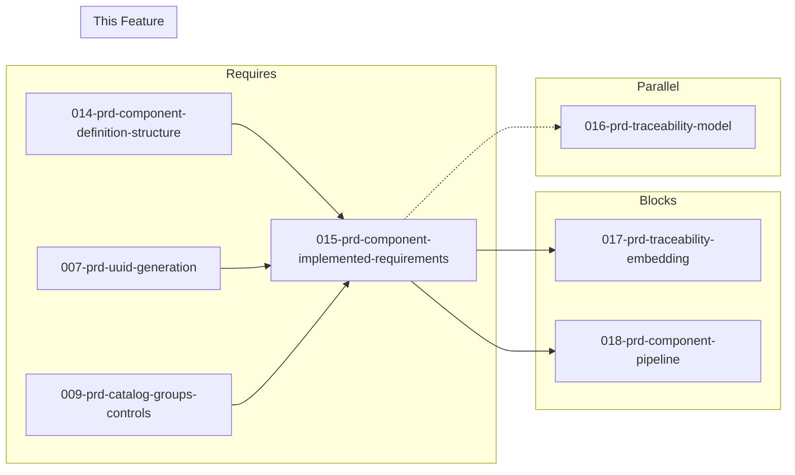

# 015-prd-component-implemented-requirements

> **Document Type:** Product Requirements Document
> **Audience:** LLM agents, human reviewers
> **Status:** Draft
> **Last Updated:** 2026-02-10 <!-- @auto -->
> **Owner:** Brian Luby <!-- @human-required -->

**Feature Branch**: `015-component-implemented-requirements`
**Created**: 2026-02-10
**Status**: Draft
**Input**: Derived from FORGE Product Roadmap WI-15

---

## Review Tier Legend

| Marker | Tier | Speckit Behavior |
|--------|------|------------------|
| 🔴 `@human-required` | Human Generated | Prompt human to author; blocks until complete |
| 🟡 `@human-review` | LLM + Human Review | LLM drafts → prompt human to confirm/edit; blocks until confirmed |
| 🟢 `@llm-autonomous` | LLM Autonomous | LLM completes; no prompt; logged for audit |
| ⚪ `@auto` | Auto-generated | System fills (timestamps, links); no prompt |

---

## Document Completion Order

> ⚠️ **For LLM Agents:** Complete sections in this order. Do not fill downstream sections until upstream human-required inputs exist.

1. **Context** (Background, Scope) → requires human input first
2. **Problem Statement & User Scenarios** → requires human input
3. **Requirements** (Must/Should/Could/Won't) → requires human input
4. **Technical Constraints** → human review
5. **Diagrams, Data Model, Interface** → LLM can draft after above exist
6. **Acceptance Criteria** → derived from requirements
7. **Everything else** → can proceed

---

## Context

### Background 🔴 `@human-required`
This PRD covers **WI-15: Component Definition — Implemented Requirements** from the FORGE Product Roadmap (Sprint S-15, Jun 9–13 2026, Theme T-2: OSCAL Model Generation, Milestone MS-3). WI-14 establishes the Component Definition documentary component structure (component UUID, type, title, description). WI-15 builds on that structure by populating the `control-implementations[]` array with a source profile reference and mapping each `PolicyRequirement` from the domain model into an `implemented-requirements[]` entry with a `control-id`, `uuid`, and implementation narrative derived from the requirement prose. This is the critical step that connects policy requirements to the baseline control framework, making the Component Definition useful for compliance traceability. Without implemented-requirements, the Component Definition is a shell with no control-level substance.

### Scope Boundaries 🟡 `@human-review`

**In Scope:**
- Implementing the `control-implementations[]` array within the Component Definition, including the `source` field referencing a baseline profile
- Mapping `PolicyRequirement`s to `implemented-requirements[]` entries with `control-id` linking
- Generating a `uuid` for each `control-implementation` and each `implemented-requirement`
- Generating implementation narrative `description` from `PolicyRequirement` prose text
- Consuming the `--source-profile` CLI flag to set the `source` reference in `control-implementations`

**Out of Scope:**
- Documentary component structure (type, title, description) — completed in WI-14 (014-prd-component-definition-structure)
- TraceLink model and source-to-OSCAL element mapping — deferred to WI-16 (016-prd-traceability-model)
- Embedding trace metadata as props/links in generated artifacts — deferred to WI-17 (017-prd-traceability-embedding)
- End-to-end component pipeline wiring and CLI integration — deferred to WI-18 (018-prd-component-pipeline)
- OSCAL metadata assembly (uuid, title, last-modified, version, oscal-version) — completed in WI-11
- Back matter resource generation — completed in WI-12

### Glossary 🟡 `@human-review`

| Term | Definition |
|------|------------|
| Component Definition | OSCAL model describing how controls are implemented by reusable components, including documentary components (policy/procedure) |
| Documentary Component | An OSCAL component of type "policy", "procedure", or "process" representing non-technical control implementations |
| control-implementations | An array within an OSCAL component that groups implemented requirements by their source baseline (profile or catalog) |
| implemented-requirement | An entry within control-implementations that maps a specific control-id to an implementation narrative (description) |
| control-id | The identifier of a control from the source baseline that the implemented-requirement addresses (e.g., "POL-AC-001") |
| source | A reference (href) in control-implementations pointing to the baseline profile or catalog that defines the controls being implemented |
| PolicyRequirement | The internal domain model struct representing an individual policy requirement extracted from source text |
| Implementation Narrative | The description text in an implemented-requirement, derived from the PolicyRequirement prose, explaining how the control is addressed |
| --source-profile | CLI flag specifying the path or reference to the baseline profile/catalog against which requirements are mapped |

### Related Documents ⚪ `@auto`

| Document | Link | Relationship |
|----------|------|--------------|
| Parent PRD | docs/FORGE_PRD.md | Parent requirement M-4, AC-4 |
| Product Roadmap | docs/FORGE_PRODUCT_ROADMAP.md | Sprint S-15 context |
| OSCAL Research | docs/research/OSCAL_Research.md | Component Definition model guidance |
| Depends On | docs/PRD/014-prd-component-definition-structure.md | Component structure (WI-14) |
| Product Vision | docs/FORGE_PRODUCT_VISION.md | Strategic goal G-1 |
| Constitution | .specify/memory/constitution.md | Technical constraints and quality gates |

---

## Problem Statement 🔴 `@human-required`

WI-14 produces a Component Definition with a documentary component shell (type, title, description), but without `control-implementations` and `implemented-requirements`, the component has no connection to any control baseline. A Component Definition without implemented-requirements cannot express which controls a policy addresses, what the implementation narrative is, or how the policy maps to a compliance framework. This is the core value proposition of the component-first strategy: each policy requirement becomes an `implemented-requirement` entry that references a specific `control-id` from the baseline, carrying the requirement prose as the implementation narrative. Without this mapping, the Component Definition is structurally incomplete and cannot satisfy Parent PRD M-4 ("generate a valid OSCAL v1.2.0 Component Definition with documentary components from extracted requirements") or AC-4.

---

## User Scenarios & Testing 🔴 `@human-required`

### User Story 1 — Map Policy Requirements to Control IDs (Priority: P1)

A compliance engineer converts a policy document into a Component Definition where each policy requirement is mapped to a control-id from the specified baseline.

> As a compliance engineer, I want each policy requirement to be mapped to a control-id in the Component Definition so that I can trace which controls my policy addresses and use the output for compliance automation.

**Why this priority**: This is the core function of WI-15. Without control-id mapping, the Component Definition has no compliance value. Every downstream workflow (traceability in WI-16/WI-17, end-to-end pipeline in WI-18) depends on implemented-requirements being populated.

**Independent Test**: Build a Component Definition from a PolicyDocument with 5 requirements and a source profile reference, and verify 5 implemented-requirements are produced, each with a valid control-id and narrative description.

**Acceptance Scenarios**:
1. **Given** a PolicyDocument with 5 PolicyRequirements and a source profile path, **When** generating the Component Definition, **Then** the output contains a `control-implementations` array with one entry whose `source` references the profile path, and 5 `implemented-requirements` entries.
2. **Given** a PolicyRequirement with text "All employees must complete security awareness training annually", **When** mapped to an implemented-requirement, **Then** the `description` field contains the implementation narrative derived from that requirement prose.

---

### User Story 2 — Source Profile Reference in Control Implementations (Priority: P1)

A compliance engineer specifies which baseline profile the Component Definition maps against using the `--source-profile` CLI flag.

> As a compliance engineer, I want to specify the source baseline profile so that the Component Definition's control-implementations correctly reference the profile my organization uses for compliance.

**Why this priority**: The `source` field in `control-implementations` is structurally required to indicate which baseline the implemented-requirements map against. Without it, the control-id values have no context.

**Independent Test**: Generate a Component Definition with `--source-profile ./baselines/nist-800-53-moderate.json` and verify the `source` field in `control-implementations` equals that path.

**Acceptance Scenarios**:
1. **Given** a source profile path of `./baselines/nist-800-53-moderate.json`, **When** generating the Component Definition, **Then** the `control-implementations[0].source` field equals `"./baselines/nist-800-53-moderate.json"`.
2. **Given** no `--source-profile` flag is provided, **When** generating the Component Definition with `--strategy component`, **Then** the CLI exits with a descriptive error indicating that `--source-profile` is required for the component strategy.

---

### User Story 3 — Deterministic UUIDs for Implemented Requirements (Priority: P1)

Each implemented-requirement and control-implementation receives a deterministic UUID for stability across re-conversions.

> As a developer working on FORGE, I want implemented-requirement UUIDs to be deterministic so that re-converting the same policy produces identical identifiers, enabling meaningful diffs and stable traceability.

**Why this priority**: UUID stability is a cross-cutting requirement (Parent PRD M-8) that must be established at generation time. Non-deterministic UUIDs would break traceability and make diffs meaningless.

**Independent Test**: Generate a Component Definition from the same PolicyDocument twice and verify all UUIDs in `control-implementations` and `implemented-requirements` are identical across runs.

**Acceptance Scenarios**:
1. **Given** the same PolicyDocument and source profile, **When** generating the Component Definition twice, **Then** all `uuid` values in `control-implementations` and `implemented-requirements` are identical.
2. **Given** a PolicyRequirement whose text is substantively changed, **When** re-generating, **Then** the corresponding `implemented-requirement` UUID changes.

---

## Assumptions & Risks 🟡 `@human-review`

### Assumptions
- [A-1] WI-14 provides a working Component Definition builder with documentary component structure that WI-15 extends.
- [A-2] The `control-id` for each implemented-requirement is derived from the PolicyRequirement's stable_id or a mapping scheme established in the Catalog generation path (WI-9/WI-10).
- [A-3] The `--source-profile` flag is already defined as a CLI argument placeholder from WI-1 scaffolding or WI-14.
- [A-4] UUID v5 generation from WI-7 is available for generating deterministic UUIDs for control-implementations and implemented-requirements.
- [A-5] A single `control-implementations` entry is sufficient for mapping all requirements against one baseline profile; multiple baselines are not required at this stage.

### Risks
| ID | Risk | Likelihood | Impact | Mitigation |
|----|------|------------|--------|------------|
| R-1 | Control-id mapping scheme does not align with IDs generated by the Catalog pipeline (WI-9/WI-10) | Med | Med | Reuse the same control-id generation logic from WI-9/WI-10; ensure a shared utility function |
| R-2 | Implementation narrative generation produces prose that does not meet assessor expectations | Low | Low | Use requirement text directly as the initial narrative; refinement can happen in later WIs or by user editing |
| R-3 | WI-14 component structure changes during its implementation, requiring WI-15 rework | Low | Med | WI-15 runs in the sprint after WI-14; review WI-14 output before starting WI-15 |

---

## Feature Overview

### Flow Diagram 🟡 `@human-review`



### State Diagram (if applicable) 🟡 `@human-review`
N/A — No state transitions in this work item.

---

## Requirements

### Must Have (M) — MVP, launch blockers 🔴 `@human-required`
- [ ] **M-1:** The Component Definition builder shall include a `control-implementations[]` array with at least one entry. *(Traces to: Parent PRD M-4)*
- [ ] **M-2:** Each `control-implementations` entry shall include a `uuid` field generated deterministically. *(Traces to: Parent PRD M-4, M-8)*
- [ ] **M-3:** Each `control-implementations` entry shall include a `source` field set to the value of the `--source-profile` CLI flag. *(Traces to: Parent PRD M-4)*
- [ ] **M-4:** Each `control-implementations` entry shall include a `description` field summarizing the implementation context. *(Traces to: Parent PRD M-4)*
- [ ] **M-5:** Each `control-implementations` entry shall include an `implemented-requirements[]` array populated from `PolicyRequirement`s in the domain model. *(Traces to: Parent PRD M-4)*
- [ ] **M-6:** Each `implemented-requirement` entry shall include a `uuid` field generated deterministically using UUID v5. *(Traces to: Parent PRD M-4, M-8)*
- [ ] **M-7:** Each `implemented-requirement` entry shall include a `control-id` field derived from the requirement's control identifier. *(Traces to: Parent PRD M-4)*
- [ ] **M-8:** Each `implemented-requirement` entry shall include a `description` field containing the implementation narrative generated from the `PolicyRequirement` prose. *(Traces to: Parent PRD M-4)*
- [ ] **M-9:** The `--source-profile` flag shall be required when using `--strategy component`; omitting it shall produce a descriptive error. *(Traces to: Parent PRD M-4)*

### Should Have (S) — High value, not blocking 🔴 `@human-required`
- [ ] **S-1:** The implementation narrative (description) should preserve the original requirement text with minimal transformation, prefixed with context indicating the source policy section.
- [ ] **S-2:** The `control-implementations` entry should include a human-readable `description` indicating the policy document title and conversion context (e.g., "Implementation narratives derived from [Policy Title].").

### Could Have (C) — Nice to have, if time permits 🟡 `@human-review`
- [ ] **C-1:** Multiple `control-implementations` entries could be generated if multiple source profiles are provided (batch baseline mapping).

### Won't Have (W) — Explicitly deferred 🟡 `@human-review`
- [ ] **W-1:** Traceability props/links within implemented-requirements — *Reason: Deferred to WI-17 (traceability embedding)*
- [ ] **W-2:** Validation of control-ids against the source profile's actual controls — *Reason: Deferred to WI-19 (schema validation) and future baseline-aware validation*
- [ ] **W-3:** Multiple components per Component Definition — *Reason: Current design uses one documentary component per policy document; multi-component support deferred*
- [ ] **W-4:** `set-parameters` within implemented-requirements — *Reason: Deferred to WI-34 (parameter extraction)*

---

## Technical Constraints 🟡 `@human-review`

- **Language/Framework:** Rust (latest stable), Cargo build system
- **OSCAL Version:** Target OSCAL v1.2.0 Component Definition schema
- **UUID Generation:** UUID v5 via the `uuid` crate (deterministic, content-based) — must use WI-7 infrastructure
- **Serialization:** `serde` and `serde_json` for JSON output
- **CLI Integration:** `--source-profile` flag via clap 4.x
- **Error Handling:** `thiserror` for error types; descriptive error when `--source-profile` is missing
- **Linting:** `cargo clippy -- -D warnings` must pass
- **Formatting:** `cargo fmt --check` must produce no violations
- **Testing:** TDD mandatory; unit tests for control-implementation and implemented-requirement generation
- **Design:** Builder must extend WI-14's component structure without modifying its public API contract

---

## Data Model (if applicable) 🟡 `@human-review`



---

## Interface Contract (if applicable) 🟡 `@human-review`

```rust
/// A control-implementations entry within a Component Definition component
pub struct ControlImplementation {
    /// Deterministic UUID v5 for this control-implementation
    pub uuid: String,
    /// Reference to the source baseline profile/catalog (from --source-profile)
    pub source: String,
    /// Description of the implementation context
    pub description: String,
    /// The implemented-requirements mapped from PolicyRequirements
    pub implemented_requirements: Vec<ImplementedRequirement>,
}

/// An individual implemented-requirement entry
pub struct ImplementedRequirement {
    /// Deterministic UUID v5 for this implemented-requirement
    pub uuid: String,
    /// The control-id from the baseline that this requirement addresses
    pub control_id: String,
    /// Implementation narrative derived from PolicyRequirement prose
    pub description: String,
}

/// Build control-implementations from PolicyRequirements and a source profile reference
pub fn build_control_implementations(
    requirements: &[PolicyRequirement],
    source_profile: &str,
    policy_title: &str,
) -> Result<Vec<ControlImplementation>, ForgeError>;

/// Map a single PolicyRequirement to an ImplementedRequirement
pub fn map_requirement_to_implemented(
    requirement: &PolicyRequirement,
) -> Result<ImplementedRequirement, ForgeError>;
```

---

## Evaluation Criteria 🟡 `@human-review`

| Criterion | Weight | Metric | Target | Notes |
|-----------|--------|--------|--------|-------|
| Implemented-requirement completeness | Critical | All PolicyRequirements mapped to implemented-requirements | 100% | No requirements lost during mapping |
| Control-id accuracy | Critical | Control-ids match the identifiers from WI-9/WI-10 generation | 100% | Consistent identifier scheme |
| UUID determinism | Critical | Same input produces same UUIDs | 100% | Verified by re-generation test |
| Source reference correctness | Critical | source field matches --source-profile value | 100% | Direct pass-through |
| Narrative quality | High | Description text faithfully represents requirement prose | Manual review | Prose preserved with minimal transformation |

---

## Tool/Approach Candidates 🟡 `@human-review`

| Option | License | Pros | Cons | Spike Result |
|--------|---------|------|------|--------------|
| uuid crate (v5) | MIT/Apache-2.0 | Deterministic UUID generation, standard Rust crate | Requires namespace UUID | Already selected in WI-7 |
| serde_json | MIT/Apache-2.0 | Standard JSON serialization | None significant | Already in use |
| Direct prose pass-through for narrative | N/A | Simple, faithful to source text | May need refinement for assessor readability | Selected for MVP |

### Selected Approach 🔴 `@human-required`
> **Decision:** Use UUID v5 from WI-7 for deterministic identifiers; use direct requirement prose as the implementation narrative with minimal transformation; extend WI-14's component builder with control-implementations.
> **Rationale:** Reuses existing UUID infrastructure, keeps the implementation simple and auditable, and follows the OSCAL research guidance that documentary components carry policy-derived narratives as implementation statements.

---

## Acceptance Criteria 🟡 `@human-review`

| AC ID | Requirement | User Story | Given | When | Then |
|-------|-------------|------------|-------|------|------|
| AC-1 | M-1, M-5 | US-1 | A PolicyDocument with 5 PolicyRequirements and a source profile | Generating the Component Definition | A `control-implementations` array with one entry containing 5 `implemented-requirements` is produced |
| AC-2 | M-3 | US-2 | A source profile path `./baseline.json` | Generating the Component Definition | `control-implementations[0].source` equals `"./baseline.json"` |
| AC-3 | M-7, M-8 | US-1 | A PolicyRequirement with text "Systems must enforce MFA for privileged access" | Mapping to an implemented-requirement | `control-id` is set to the requirement's control identifier and `description` contains the prose-derived narrative |
| AC-4 | M-6, M-2 | US-3 | The same PolicyDocument and source profile | Generating the Component Definition twice | All UUIDs in `control-implementations` and `implemented-requirements` are identical across both runs |
| AC-5 | M-9 | US-2 | No `--source-profile` flag provided with `--strategy component` | Running `forge convert policy.md --strategy component` | A descriptive error is displayed indicating `--source-profile` is required |
| AC-6 | M-6 | US-3 | A PolicyRequirement whose text is substantively changed | Re-generating the Component Definition | The corresponding `implemented-requirement` UUID changes |
| AC-7 | M-4, S-2 | US-2 | A policy document titled "Corporate Security Policy" | Generating the Component Definition | `control-implementations[0].description` includes reference to "Corporate Security Policy" |

### Edge Cases 🟢 `@llm-autonomous`
- [ ] **EC-1:** (M-5) When a PolicyDocument has zero PolicyRequirements, then `implemented-requirements` is an empty array and a warning is emitted.
- [ ] **EC-2:** (M-7) When a PolicyRequirement has no stable_id (WI-7 not yet populated), then a fallback control-id is generated from the section hierarchy and requirement index.
- [ ] **EC-3:** (M-8) When a PolicyRequirement has empty text, then the implemented-requirement description defaults to a placeholder indicating no narrative available.
- [ ] **EC-4:** (M-3) When `--source-profile` is an empty string, then the CLI exits with an error indicating an invalid profile path.
- [ ] **EC-5:** (M-6) When two PolicyRequirements have identical text but different source locations, then they receive distinct UUIDs (incorporating source location or index into the UUID seed).

---

## Dependencies 🟡 `@human-review`



- **Requires:** [014-prd-component-definition-structure](docs/PRD/014-prd-component-definition-structure.md) (WI-14, component structure), [007-prd-uuid-generation](docs/PRD/007-prd-uuid-generation.md) (WI-7, deterministic UUIDs), [009-prd-catalog-groups-controls](docs/PRD/009-prd-catalog-groups-controls.md) (WI-9, control-id scheme)
- **Blocks:** [017-prd-traceability-embedding](docs/PRD/017-prd-traceability-embedding.md) (WI-17), [018-prd-component-pipeline](docs/PRD/018-prd-component-pipeline.md) (WI-18)
- **Parallel With:** [016-prd-traceability-model](docs/PRD/016-prd-traceability-model.md) (WI-16, runs in parallel during Sprint S-16)
- **External:** None

---

## Security Considerations 🟡 `@human-review`

| Aspect | Assessment | Notes |
|--------|------------|-------|
| Internet Exposure | No | CLI tool, no network services |
| Sensitive Data | Yes | Implemented-requirement descriptions contain policy requirement text, which may include sensitive operational details |
| Authentication Required | No | Local CLI tool |
| Security Review Required | No | Extends existing builder pattern; no new input parsing attack surface beyond CLI flag handling |

---

## Implementation Guidance 🟢 `@llm-autonomous`

### Suggested Approach
Extend the Component Definition builder from WI-14 to add `control-implementations` population. Create a `build_control_implementations` function that takes the list of `PolicyRequirement`s and the `--source-profile` value. For each requirement, generate an `ImplementedRequirement` struct with: (1) a UUID v5 derived from the requirement's stable_id and source profile (using WI-7's UUID generation), (2) a `control-id` using the same ID generation scheme as WI-9/WI-10 (e.g., `POL-{section}-{index}` pattern), and (3) a `description` containing the requirement prose, optionally prefixed with the source section title for context. Group all implemented-requirements into a single `ControlImplementation` entry with the source profile as the `source` field and a descriptive summary as the `description`. Add CLI validation to enforce that `--source-profile` is provided when `--strategy component` is used.

### Anti-patterns to Avoid
- Generating random UUIDs (v4) for implemented-requirements — must use deterministic v5 for stability
- Storing the source profile content instead of just the reference (href) — `source` is a reference, not embedded content
- Placing implementation narrative in `remarks` instead of `description` — NIST guidance warns against misusing `remarks`
- Hard-coding control-ids instead of deriving them from the PolicyRequirement mapping scheme
- Modifying WI-14's component structure API instead of extending it

### Reference Examples
- OSCAL Research sample Component Definition (docs/research/OSCAL_Research.md, "Sample component definition" section) demonstrates the `control-implementations` → `implemented-requirements` structure with `source`, `control-id`, and `description` fields
- NIST OSCAL Component Definition model documentation describes documentary components and control-implementation patterns

---

## Spike Tasks 🟡 `@human-review`

N/A — No spike tasks for this work item. The control-implementation structure is well-defined by the OSCAL v1.2.0 schema and documented in the OSCAL Research.

---

## Success Metrics 🔴 `@human-required`

| Metric | Baseline | Target | Measurement Method |
|--------|----------|--------|-------------------|
| Requirement mapping completeness | N/A | 100% of PolicyRequirements mapped to implemented-requirements | Unit tests |
| UUID determinism | N/A | 100% identical across re-runs | Re-generation comparison test |
| Source reference accuracy | N/A | source field matches --source-profile | Unit tests |

### Technical Verification 🟢 `@llm-autonomous`
| Metric | Target | Verification Method |
|--------|--------|---------------------|
| Test coverage for implemented-requirement generation | >90% | `cargo test` + coverage tool |
| No clippy warnings | 0 | `cargo clippy -- -D warnings` |
| No formatting violations | 0 | `cargo fmt --check` |
| Output matches OSCAL Component Definition JSON shape | Valid | Manual comparison against OSCAL v1.2.0 schema structure |

---

## Definition of Ready 🔴 `@human-required`

### Readiness Checklist
- [x] Problem statement reviewed and validated by stakeholder
- [x] All Must Have requirements have acceptance criteria
- [x] Technical constraints are explicit and agreed
- [x] Dependencies identified and owners confirmed
- [x] Security review completed (or N/A documented with justification)
- [x] No open questions blocking implementation

### Sign-off
| Role | Name | Date | Decision |
|------|------|------|----------|
| Product Owner | Brian Luby | YYYY-MM-DD | [Ready / Not Ready] |

---

## Changelog ⚪ `@auto`

| Version | Date | Author | Changes |
|---------|------|--------|---------|
| 0.1 | 2026-02-10 | LLM (Claude) | Initial draft derived from FORGE Product Roadmap WI-15 |

---

## Decision Log 🟡 `@human-review`

| Date | Decision | Rationale | Alternatives Considered |
|------|----------|-----------|------------------------|
| 2026-02-10 | Single control-implementations entry per source profile | OSCAL groups implemented-requirements by source baseline; one profile = one entry; keeps structure clean and aligns with OSCAL semantics | Multiple entries per section (over-fragments the mapping); flat list without source grouping (violates OSCAL structure) |
| 2026-02-10 | Use requirement prose directly as implementation narrative | Faithful to source text, auditable, and avoids introducing AI-generated paraphrasing at this stage; refinement can happen in downstream workflows | AI-summarized narrative (introduces non-determinism); template-based narrative (too generic) |
| 2026-02-10 | Require --source-profile for component strategy | OSCAL control-implementations requires a source reference; generating without one produces structurally incomplete output | Default to a placeholder source (masks missing data); make source optional (produces invalid OSCAL) |

---

## Open Questions 🟡 `@human-review`

No open questions for this work item.

---

## Review Checklist 🟢 `@llm-autonomous`

Before marking as Approved:
- [x] All requirements have unique IDs (M-1 through M-9, S-1 through S-2, C-1, W-1 through W-4)
- [x] All Must Have requirements have linked acceptance criteria
- [x] User stories are prioritized and independently testable
- [x] Acceptance criteria reference both requirement IDs and user stories
- [x] Glossary terms are used consistently throughout
- [x] Diagrams use terminology from Glossary
- [x] Security considerations documented
- [x] Definition of Ready checklist is complete
- [x] No open questions blocking implementation
