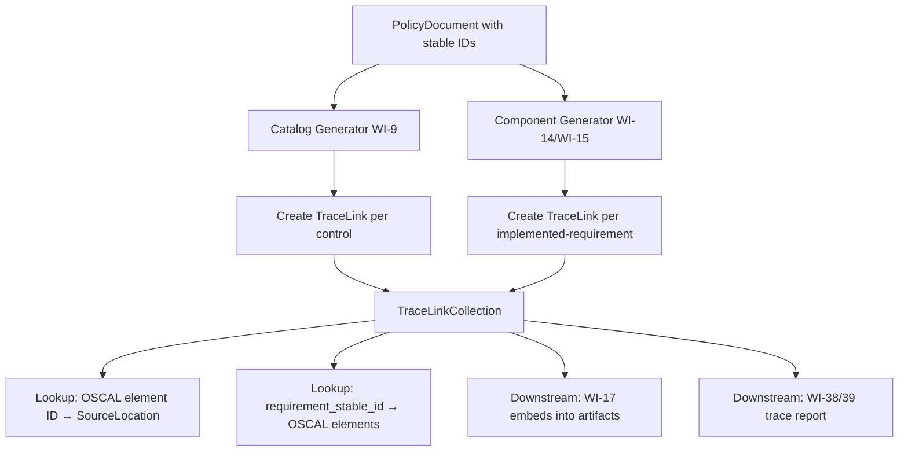
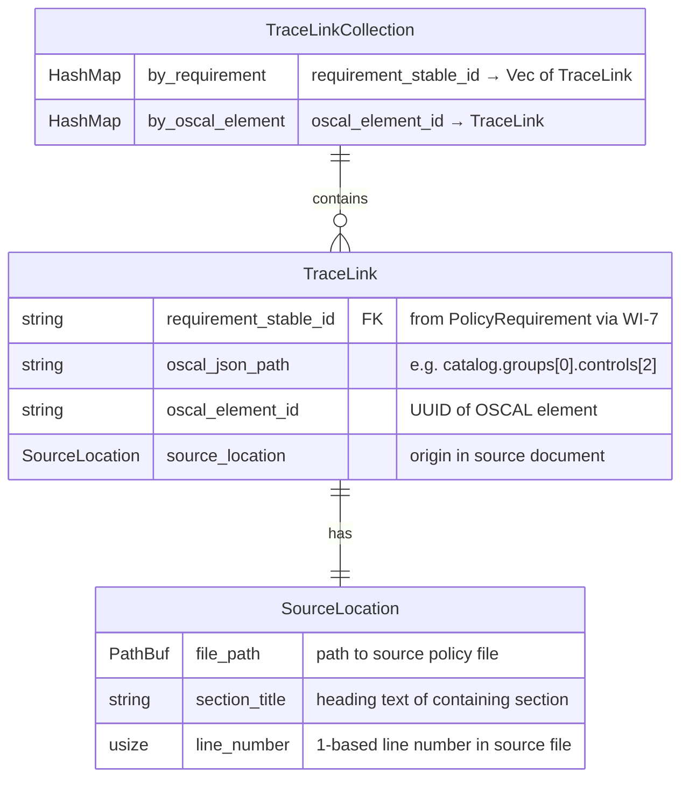
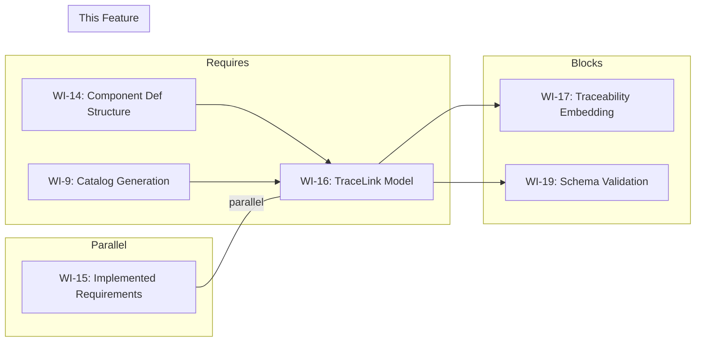

# 016-prd-traceability-model

> **Document Type:** Product Requirements Document
> **Audience:** LLM agents, human reviewers
> **Status:** Draft
> **Last Updated:** 2026-02-10 <!-- @auto -->
> **Owner:** Brian Luby <!-- @human-required -->

**Feature Branch**: `016-traceability-model`
**Created**: 2026-02-10
**Status**: Draft
**Input**: Derived from FORGE Product Roadmap WI-16

---

## Review Tier Legend

| Marker | Tier | Speckit Behavior |
|--------|------|------------------|
| 🔴 `@human-required` | Human Generated | Prompt human to author; blocks until complete |
| 🟡 `@human-review` | LLM + Human Review | LLM drafts → prompt human to confirm/edit; blocks until confirmed |
| 🟢 `@llm-autonomous` | LLM Autonomous | LLM completes; no prompt; logged for audit |
| ⚪ `@auto` | Auto-generated | System fills (timestamps, links); no prompt |

---

## Document Completion Order

> ⚠️ **For LLM Agents:** Complete sections in this order. Do not fill downstream sections until upstream human-required inputs exist.

1. **Context** (Background, Scope) → requires human input first
2. **Problem Statement & User Scenarios** → requires human input
3. **Requirements** (Must/Should/Could/Won't) → requires human input
4. **Technical Constraints** → human review
5. **Diagrams, Data Model, Interface** → LLM can draft after above exist
6. **Acceptance Criteria** → derived from requirements
7. **Everything else** → can proceed

---

## Context

### Background 🔴 `@human-required`
This PRD covers **WI-16: Traceability — TraceLink Model** from the FORGE Product Roadmap (Sprint S-16, Jun 16–20 2026, Theme T-2: OSCAL Model Generation, Milestone MS-3). Product principle P-2 states that "Traceability is non-negotiable" — every OSCAL element must trace back to a source policy location and no "orphan" elements may exist. The TraceLink model is the data structure that makes this possible by mapping each generated OSCAL element bidirectionally to the source policy requirement and its location in the original document. This work item defines the `TraceLink` struct, the `SourceLocation` struct capturing file path, section title, and line number, and the collection mechanism that populates trace links during both Catalog and Component Definition generation. WI-17 subsequently embeds these trace links into the OSCAL artifacts as props and links.

### Scope Boundaries 🟡 `@human-review`

**In Scope:**
- Defining the `TraceLink` struct mapping `requirement_stable_id` to `oscal_json_path` + `oscal_element_id`
- Defining the `SourceLocation` struct capturing file path, section title, and line number
- Implementing a `TraceLinkCollection` container for aggregating trace links during generation
- Capturing trace links during Catalog generation (integration point with WI-9)
- Capturing trace links during Component Definition generation (integration point with WI-14/WI-15)
- Bidirectional lookup: OSCAL element → source location, source location → OSCAL element(s)
- Unit tests validating trace link creation, collection, and bidirectional lookup

**Out of Scope:**
- Embedding trace metadata into OSCAL artifacts as props/links — deferred to WI-17 (017-prd-traceability-embedding)
- Schema validation of generated artifacts — deferred to WI-19 (019-prd-schema-validation)
- Traceability report CLI command (`forge trace`) — deferred to WI-38/WI-39
- Source text excerpt extraction for traceability reports — deferred to WI-39
- Profile generation traceability — deferred to WI-30+

### Glossary 🟡 `@human-review`

| Term | Definition |
|------|------------|
| TraceLink | A data structure mapping a policy requirement's stable ID to its corresponding OSCAL element path and element ID, plus the source location in the original document |
| SourceLocation | A struct capturing the origin of a policy requirement: file path, section title, and line number |
| TraceLinkCollection | An aggregation container holding all TraceLink instances produced during a single conversion run, supporting bidirectional lookup |
| oscal_json_path | A JSON Pointer (RFC 6901) or dot-path identifying where an OSCAL element resides within the generated artifact (e.g., `catalog.groups[0].controls[2]`) |
| oscal_element_id | The UUID or identifier of the specific OSCAL element (e.g., the control's UUID or the implemented-requirement's UUID) |
| requirement_stable_id | The deterministic, content-based UUID assigned to a PolicyRequirement by WI-7 (UUID generation) |
| Bidirectional Traceability | The ability to navigate from an OSCAL element back to its source policy location AND from a source policy location forward to all generated OSCAL elements |

### Related Documents ⚪ `@auto`

| Document | Link | Relationship |
|----------|------|--------------|
| Parent PRD | docs/FORGE_PRD.md | Parent requirement M-10, TraceLink data model, AC-10 |
| Product Roadmap | docs/FORGE_PRODUCT_ROADMAP.md | Sprint S-16 context |
| Product Vision | docs/FORGE_PRODUCT_VISION.md | Product principle P-2 (Traceability is non-negotiable) |
| Constitution | .specify/memory/constitution.md | Technical constraints and quality gates |
| Depends On | docs/PRD/005-prd-domain-model.md | PolicyDocument, PolicyRequirement, source_line fields |

---

## Problem Statement 🔴 `@human-required`

The Catalog generation pipeline (WI-9) and Component Definition pipeline (WI-14/WI-15) produce OSCAL JSON artifacts from parsed policy documents, but currently no mechanism exists to record _which_ source policy requirement produced _which_ OSCAL element. Without explicit trace links, it is impossible to answer two critical questions: (1) "Where did this OSCAL control come from?" and (2) "What OSCAL elements were generated from this policy requirement?" This gap violates product principle P-2 (traceability is non-negotiable) and parent PRD requirement M-10. The TraceLink model closes this gap by providing a structured, bidirectional mapping between source locations and OSCAL elements, captured at generation time before the data is lost.

---

## User Scenarios & Testing 🔴 `@human-required`

### User Story 1 — Trace OSCAL Element Back to Source (Priority: P1)

A compliance engineer inspects a generated OSCAL Catalog and needs to verify which policy section produced a specific control.

> As a compliance engineer, I want every generated OSCAL element to be traceable back to its source policy section and line number so that I can verify correctness and satisfy audit requirements.

**Why this priority**: This is the core purpose of the TraceLink model. Parent PRD M-10 explicitly requires traceability from every generated OSCAL element back to its source. Product principle P-2 makes this non-negotiable.

**Independent Test**: Generate OSCAL from a test policy, retrieve the TraceLinkCollection, and verify that every OSCAL element ID has an associated SourceLocation with valid file path, section title, and line number.

**Acceptance Scenarios**:
1. **Given** a policy document converted to an OSCAL Catalog, **When** looking up any control's element ID in the TraceLinkCollection, **Then** a TraceLink is returned containing the source file path, section title, and line number where the requirement originated.
2. **Given** a policy document converted to an OSCAL Component Definition, **When** looking up any implemented-requirement's element ID in the TraceLinkCollection, **Then** a TraceLink is returned with the correct source location.

---

### User Story 2 — Trace Source Requirement Forward to OSCAL Elements (Priority: P1)

A developer or compliance engineer needs to verify that a specific policy requirement was correctly mapped into OSCAL output.

> As a developer, I want to look up a policy requirement's stable ID and find all OSCAL elements it generated so that I can verify complete coverage and no requirements were dropped during conversion.

**Why this priority**: Bidirectional traceability is essential for completeness verification. If a requirement exists in the source but has no forward trace link, it was silently dropped — a critical defect.

**Independent Test**: Generate OSCAL from a test policy, query the TraceLinkCollection by a known requirement stable ID, and verify it returns the expected OSCAL element IDs and JSON paths.

**Acceptance Scenarios**:
1. **Given** a requirement with stable_id "abc-123" that maps to a Catalog control, **When** querying the TraceLinkCollection by stable_id "abc-123", **Then** the result includes the OSCAL control's element ID and JSON path.
2. **Given** a requirement that maps to both a Catalog control and a Component implemented-requirement, **When** querying by that requirement's stable_id, **Then** both OSCAL elements are returned.

---

### User Story 3 — Capture Source Location Metadata (Priority: P1)

The system must record precise source locations so that downstream consumers (WI-17 embedding, WI-38/39 trace reports) have accurate provenance data.

> As a compliance engineer, I want source locations to include the file path, section title, and line number so that I can navigate directly to the originating text in the source policy document.

**Why this priority**: Source location precision is the foundation of meaningful traceability. Without file path, section, and line number, trace links are vague and un-navigable.

**Independent Test**: Construct a SourceLocation from a known file, section, and line, then verify all three fields are accurately stored and retrievable.

**Acceptance Scenarios**:
1. **Given** a requirement extracted from file "policy.md", section "Access Control", line 42, **When** stored in a TraceLink's source_location, **Then** the SourceLocation fields return "policy.md", "Access Control", and 42 respectively.
2. **Given** a TraceLink with a populated SourceLocation, **When** displaying the trace link for debugging or reporting, **Then** the output includes all three source location fields in a human-readable format.

---

## Assumptions & Risks 🟡 `@human-review`

### Assumptions
- [A-1] The `requirement_stable_id` field is available from WI-7 (UUID generation) by the time trace links are captured. If WI-7 is not yet integrated, a placeholder ID from the domain model suffices.
- [A-2] The Catalog generation pipeline (WI-9) and Component Definition pipeline (WI-14/WI-15) can be instrumented to emit TraceLink instances without significant refactoring.
- [A-3] A single `PolicyRequirement` may map to multiple OSCAL elements (e.g., one control in a Catalog and one implemented-requirement in a Component Definition), so the mapping is one-to-many from source to OSCAL.
- [A-4] The `oscal_json_path` uses a dot-notation or JSON Pointer format that is stable across serialization runs for the same input.

### Risks
| ID | Risk | Likelihood | Impact | Mitigation |
|----|------|------------|--------|------------|
| R-1 | Catalog and Component generators are difficult to instrument for trace link capture | Low | Med | Design TraceLinkCollection with a simple `record()` API that generators call at element creation; minimize coupling |
| R-2 | oscal_json_path becomes invalid if OSCAL structure changes between generation and embedding | Low | Low | Compute JSON paths at generation time when structure is known; validate paths before embedding in WI-17 |
| R-3 | One-to-many mapping from source to OSCAL creates confusion in trace reports | Low | Low | Use Vec<TraceLink> per requirement; document cardinality clearly in the data model |

---

## Feature Overview

### Flow Diagram 🟡 `@human-review`



### State Diagram (if applicable) 🟡 `@human-review`
N/A — TraceLink is a data model with no state transitions. Trace links are created once during generation and are immutable thereafter.

---

## Requirements

### Must Have (M) — MVP, launch blockers 🔴 `@human-required`
- [ ] **M-1:** The system shall define a `TraceLink` struct containing: `requirement_stable_id`, `oscal_json_path`, `oscal_element_id`, and `source_location`. *(Traces to: Parent PRD M-10)*
- [ ] **M-2:** The system shall define a `SourceLocation` struct containing: file path, section title, and line number (1-based). *(Traces to: Parent PRD M-10)*
- [ ] **M-3:** The system shall define a `TraceLinkCollection` container that aggregates `TraceLink` instances and supports bidirectional lookup. *(Traces to: Parent PRD M-10)*
- [ ] **M-4:** The `TraceLinkCollection` shall support forward lookup: given a `requirement_stable_id`, return all associated `TraceLink` instances (source → OSCAL). *(Traces to: Parent PRD M-10)*
- [ ] **M-5:** The `TraceLinkCollection` shall support reverse lookup: given an `oscal_element_id`, return the associated `TraceLink` (OSCAL → source). *(Traces to: Parent PRD M-10)*
- [ ] **M-6:** Trace links shall be captured during Catalog generation by instrumenting the Catalog builder (WI-9) to record a TraceLink for each generated control element. *(Traces to: Parent PRD M-10)*
- [ ] **M-7:** Trace links shall be captured during Component Definition generation by instrumenting the Component builder (WI-14/WI-15) to record a TraceLink for each generated implemented-requirement element. *(Traces to: Parent PRD M-10)*
- [ ] **M-8:** The `SourceLocation` shall be populated from the `PolicyRequirement.source_line` and parent `PolicySection` title and `DocumentMetadata.source_path` fields from the domain model (WI-5). *(Traces to: Parent PRD M-10)*

### Should Have (S) — High value, not blocking 🔴 `@human-required`
- [ ] **S-1:** `TraceLink` and `SourceLocation` shall implement `Debug`, `Clone`, `Serialize`, and `Deserialize` for inspection, testing, and future persistence.
- [ ] **S-2:** `TraceLinkCollection` shall provide an `iter()` method to enumerate all trace links for reporting or batch processing.
- [ ] **S-3:** `TraceLinkCollection` shall provide a `len()` method and an `is_empty()` method for summary statistics.

### Could Have (C) — Nice to have, if time permits 🟡 `@human-review`
- [ ] **C-1:** `SourceLocation` could include an optional `source_text_excerpt` field (first N characters of the requirement text) for display in trace reports without re-reading the source file.
- [ ] **C-2:** `TraceLinkCollection` could provide a `validate()` method that checks for orphaned OSCAL elements (elements with no trace link) or dangling requirement IDs (requirements with no OSCAL output).

### Won't Have (W) — Explicitly deferred 🟡 `@human-review`
- [ ] **W-1:** Embedding trace links into OSCAL artifacts as props/links — *Reason: Deferred to WI-17 (traceability embedding)*
- [ ] **W-2:** Trace report CLI command (`forge trace`) — *Reason: Deferred to WI-38/WI-39*
- [ ] **W-3:** Persisting TraceLinkCollection to disk as a sidecar file — *Reason: Deferred until Q5 from Parent PRD is resolved; may be WI-17 or later*
- [ ] **W-4:** Profile generation traceability — *Reason: Deferred to WI-30+ (Profile generation)*

---

## Technical Constraints 🟡 `@human-review`

- **Language/Framework:** Rust (latest stable)
- **Serialization:** `serde` derives (`Serialize`, `Deserialize`, `Debug`, `Clone`) for all TraceLink structs
- **Error Handling:** `thiserror` for any TraceLink-related errors (e.g., lookup miss, duplicate element ID)
- **Indexing:** Use `HashMap` or `BTreeMap` for O(1)/O(log n) bidirectional lookups; avoid linear scans
- **Immutability:** TraceLink instances are immutable after creation; TraceLinkCollection is append-only during generation, read-only afterward
- **Testing:** TDD mandatory; comprehensive unit tests for struct construction, collection operations, and bidirectional lookups
- **Dependencies:** No new external crates required; uses `std::collections`, `serde`, and `std::path::PathBuf`
- **Compatibility:** TraceLink must be decoupled from specific OSCAL serialization format (JSON/XML/YAML); `oscal_json_path` is a logical path, not format-specific

---

## Data Model (if applicable) 🟡 `@human-review`



### Relationship to Parent PRD Data Model

The parent PRD (docs/FORGE_PRD.md) defines:
```
TraceLink {
    string id PK
    string artifact_uuid FK
    string requirement_stable_id FK
    string oscal_json_path
    string oscal_element_id
}
```

This PRD refines that definition by:
- Adding `SourceLocation` as a first-class struct (the parent PRD's `SourceSpan` concept)
- Defining `TraceLinkCollection` as the container with bidirectional indexes
- Deferring `artifact_uuid` linkage to WI-17 when trace links are embedded into artifacts

---

## Interface Contract (if applicable) 🟡 `@human-review`

```rust
use std::collections::HashMap;
use std::path::PathBuf;
use serde::{Serialize, Deserialize};

/// Source location in the original policy document
#[derive(Debug, Clone, Serialize, Deserialize, PartialEq, Eq)]
pub struct SourceLocation {
    /// Path to the source policy file
    pub file_path: PathBuf,
    /// Title of the section containing this requirement
    pub section_title: String,
    /// 1-based line number in the source file
    pub line_number: usize,
}

/// A single trace link mapping a policy requirement to an OSCAL element
#[derive(Debug, Clone, Serialize, Deserialize)]
pub struct TraceLink {
    /// Deterministic stable ID of the source PolicyRequirement (from WI-7)
    pub requirement_stable_id: String,
    /// Logical path to the OSCAL element in the generated artifact
    /// e.g., "catalog.groups[0].controls[2]"
    pub oscal_json_path: String,
    /// UUID or identifier of the target OSCAL element
    pub oscal_element_id: String,
    /// Source location in the original policy document
    pub source_location: SourceLocation,
}

/// Collection of trace links with bidirectional lookup indexes
#[derive(Debug, Default)]
pub struct TraceLinkCollection {
    /// All trace links in insertion order
    links: Vec<TraceLink>,
    /// Forward index: requirement_stable_id → indices into links
    by_requirement: HashMap<String, Vec<usize>>,
    /// Reverse index: oscal_element_id → index into links
    by_oscal_element: HashMap<String, usize>,
}

impl TraceLinkCollection {
    /// Create a new empty collection
    pub fn new() -> Self;

    /// Record a new trace link during generation
    pub fn record(&mut self, link: TraceLink) -> Result<(), TraceError>;

    /// Forward lookup: requirement_stable_id → all TraceLinks
    pub fn by_requirement(&self, stable_id: &str) -> &[TraceLink];

    /// Reverse lookup: oscal_element_id → TraceLink
    pub fn by_oscal_element(&self, element_id: &str) -> Option<&TraceLink>;

    /// Iterate over all trace links
    pub fn iter(&self) -> impl Iterator<Item = &TraceLink>;

    /// Return the number of trace links
    pub fn len(&self) -> usize;

    /// Return true if no trace links have been recorded
    pub fn is_empty(&self) -> bool;
}
```

---

## Evaluation Criteria 🟡 `@human-review`

| Criterion | Weight | Metric | Target | Notes |
|-----------|--------|--------|--------|-------|
| Traceability Completeness | Critical | % of generated OSCAL elements with a trace link | 100% | No orphan elements allowed (P-2) |
| Bidirectional Accuracy | Critical | Forward and reverse lookups return correct results | 100% | Both directions must be correct |
| Source Location Accuracy | Critical | File path, section title, and line number match source | 100% | Foundation for meaningful traceability |
| Collection Performance | Medium | Lookup time for bidirectional queries | O(1) amortized | HashMap-based indexing |

---

## Tool/Approach Candidates 🟡 `@human-review`

| Option | License | Pros | Cons | Spike Result |
|--------|---------|------|------|--------------|
| HashMap-based dual index | N/A (std) | O(1) lookup, simple, no external deps | Memory overhead from two indexes | Selected |
| BTreeMap-based dual index | N/A (std) | Sorted iteration, O(log n) lookup | Slightly slower lookup than HashMap | Alternative if sorted order is needed |
| External graph crate (petgraph) | MIT/Apache-2.0 | Rich graph operations | Overkill for bidirectional mapping; unnecessary dependency | Rejected |

### Selected Approach 🔴 `@human-required`
> **Decision:** Use `HashMap`-based dual indexing in `TraceLinkCollection` with `Vec<TraceLink>` as the canonical store
> **Rationale:** Standard library only, O(1) amortized lookup in both directions, minimal complexity. The mapping is conceptually simple (one-to-many forward, one-to-one reverse) and does not warrant a graph library. No external crates needed beyond serde for serialization.

---

## Acceptance Criteria 🟡 `@human-review`

| AC ID | Requirement | User Story | Given | When | Then |
|-------|-------------|------------|-------|------|------|
| AC-1 | M-1, M-2 | US-1, US-3 | A policy requirement from file "policy.md", section "Access Control", line 42, with stable_id "req-001" | Creating a TraceLink mapping to OSCAL control "ctrl-uuid-1" at path "catalog.groups[0].controls[0]" | The TraceLink stores all fields correctly: requirement_stable_id, oscal_json_path, oscal_element_id, and source_location with file_path, section_title, and line_number |
| AC-2 | M-3, M-4 | US-2 | A TraceLinkCollection with 3 trace links, 2 of which share requirement_stable_id "req-001" | Calling `by_requirement("req-001")` | Returns exactly 2 TraceLink instances with the correct OSCAL element IDs |
| AC-3 | M-3, M-5 | US-1 | A TraceLinkCollection with 3 trace links | Calling `by_oscal_element("ctrl-uuid-1")` | Returns exactly 1 TraceLink with source_location pointing to "policy.md", "Access Control", line 42 |
| AC-4 | M-6 | US-1 | A policy document converted through the Catalog generation pipeline | Inspecting the TraceLinkCollection after generation | Every generated control has a corresponding TraceLink with valid source location |
| AC-5 | M-7 | US-1 | A policy document converted through the Component Definition pipeline | Inspecting the TraceLinkCollection after generation | Every generated implemented-requirement has a corresponding TraceLink with valid source location |
| AC-6 | M-8 | US-3 | A PolicyRequirement at line 42, in section "Access Control", from file "policy.md" | The SourceLocation is constructed during trace link recording | source_location.file_path = "policy.md", source_location.section_title = "Access Control", source_location.line_number = 42 |

### Edge Cases 🟢 `@llm-autonomous`
- [ ] **EC-1:** (M-3) When recording a TraceLink with a duplicate `oscal_element_id` that already exists in the collection, then an error is returned (each OSCAL element should map to exactly one source requirement).
- [ ] **EC-2:** (M-4) When calling `by_requirement()` with a stable_id that has no trace links, then an empty slice is returned (not a panic or error).
- [ ] **EC-3:** (M-5) When calling `by_oscal_element()` with an element_id that has no trace link, then `None` is returned.
- [ ] **EC-4:** (M-2) When a requirement has no parent section title (e.g., top-level requirement outside any heading), then `section_title` is set to an empty string or a default sentinel value.
- [ ] **EC-5:** (M-1) When `oscal_json_path` contains array indices, the path must be stable for the same input (deterministic generation ensures this).

---

## Dependencies 🟡 `@human-review`



- **Requires:** [WI-14: Component Definition Structure](docs/PRD/014-prd-component-definition-structure.md) — the Component Definition builder must exist to instrument it; [WI-9: Catalog Generation](docs/PRD/009-prd-catalog-groups-controls.md) — the Catalog builder must exist to instrument it
- **Parallel With:** [WI-15: Implemented Requirements](docs/PRD/015-prd-implemented-requirements.md) — runs in the same sprint; TraceLink captures implemented-requirement mappings produced by WI-15
- **Blocks:** [WI-17: Traceability Embedding](docs/PRD/017-prd-traceability-embedding.md) — embeds TraceLinks into OSCAL artifacts as props/links; [WI-19: Schema Validation](docs/PRD/019-prd-schema-validation.md) — validation must account for trace metadata
- **External:** None

---

## Security Considerations 🟡 `@human-review`

| Aspect | Assessment | Notes |
|--------|------------|-------|
| Internet Exposure | No | Internal data structures only; no network operations |
| Sensitive Data | Yes | TraceLinks contain file paths and policy section titles which may reveal organizational structure |
| Authentication Required | No | Local CLI tool |
| Security Review Required | No | Internal data model with no external attack surface; file paths are already known to the user running the CLI |

---

## Implementation Guidance 🟢 `@llm-autonomous`

### Suggested Approach
Define `SourceLocation`, `TraceLink`, and `TraceLinkCollection` in a new `trace` submodule within the `model` module (or as a sibling module if preferred). The `TraceLinkCollection` should use an internal `Vec<TraceLink>` as the canonical store, with two `HashMap` indexes: one mapping `requirement_stable_id → Vec<usize>` (forward, one-to-many) and one mapping `oscal_element_id → usize` (reverse, one-to-one). The `record()` method appends to the Vec, updates both indexes, and returns an error if the `oscal_element_id` is already present (uniqueness constraint).

To capture trace links during generation, modify the Catalog builder (WI-9) and Component Definition builder (WI-14/WI-15) to accept a `&mut TraceLinkCollection` parameter (or return trace links alongside the OSCAL output). At each point where a control or implemented-requirement is created, call `collection.record(TraceLink { ... })` with the requirement's stable_id, the generated element's UUID, the computed JSON path, and a SourceLocation derived from the PolicyRequirement's source_line, its parent PolicySection title, and the DocumentMetadata source_path.

### Anti-patterns to Avoid
- Coupling TraceLink to a specific OSCAL output format (JSON vs. XML) — keep `oscal_json_path` as a logical path
- Storing trace links only in the OSCAL output — the TraceLinkCollection must exist independently so WI-17 can query it during embedding
- Using linear scans for lookups instead of indexed maps — performance matters for large policy documents
- Making TraceLink mutable after creation — trace links should be immutable once recorded
- Deferring source location capture to a later stage — source location must be recorded at generation time when the mapping context is available

### Reference Examples
- Parent PRD data model (docs/FORGE_PRD.md) defines the conceptual TraceLink entity
- RFC 6901 (JSON Pointer) for `oscal_json_path` format reference
- WI-5 domain model (docs/PRD/005-prd-domain-model.md) for `PolicyRequirement.source_line` and `DocumentMetadata.source_path`

---

## Spike Tasks 🟡 `@human-review`

N/A — No spike tasks for this work item. The TraceLink model is a straightforward data structure with well-defined requirements from the parent PRD.

---

## Success Metrics 🔴 `@human-required`

| Metric | Baseline | Target | Measurement Method |
|--------|----------|--------|-------------------|
| Trace link completeness | N/A | 100% of generated OSCAL elements have a TraceLink | Automated test: compare OSCAL element count to TraceLinkCollection.len() |
| Bidirectional accuracy | N/A | 100% of lookups return correct results | Unit tests for forward and reverse lookups |
| Source location accuracy | N/A | 100% of SourceLocations match actual source | Unit tests comparing against known test fixtures |

### Technical Verification 🟢 `@llm-autonomous`
| Metric | Target | Verification Method |
|--------|--------|---------------------|
| Test coverage | >90% | `cargo test` + coverage tool |
| No clippy warnings | 0 | `cargo clippy -- -D warnings` |
| No formatting violations | 0 | `cargo fmt --check` |
| Lookup performance | O(1) amortized | HashMap-based indexing verified by code review |

---

## Definition of Ready 🔴 `@human-required`

### Readiness Checklist
- [x] Problem statement reviewed and validated by stakeholder
- [x] All Must Have requirements have acceptance criteria
- [x] Technical constraints are explicit and agreed
- [x] Dependencies identified and owners confirmed
- [x] Security review completed (or N/A documented with justification)
- [x] No open questions blocking implementation

### Sign-off
| Role | Name | Date | Decision |
|------|------|------|----------|
| Product Owner | Brian Luby | YYYY-MM-DD | [Ready / Not Ready] |

---

## Changelog ⚪ `@auto`

| Version | Date | Author | Changes |
|---------|------|--------|---------|
| 0.1 | 2026-02-10 | LLM (Claude) | Initial draft derived from FORGE Product Roadmap WI-16 |

---

## Decision Log 🟡 `@human-review`

| Date | Decision | Rationale | Alternatives Considered |
|------|----------|-----------|------------------------|
| 2026-02-10 | Use HashMap-based dual indexing for TraceLinkCollection | O(1) amortized bidirectional lookup with no external dependencies; simple and performant | BTreeMap (unnecessary sorting overhead), petgraph (overkill for this use case) |
| 2026-02-10 | TraceLink captures SourceLocation as a first-class struct rather than raw fields | Encapsulates source provenance in a reusable, testable type; aligns with parent PRD SourceSpan concept | Flat fields on TraceLink (less reusable, harder to extend) |
| 2026-02-10 | TraceLinkCollection is independent of OSCAL artifacts | Allows WI-17 to query and embed trace data without circular dependencies; clean separation of data model from artifact structure | Embed trace links directly in OSCAL builder (tight coupling) |
| 2026-02-10 | oscal_element_id must be unique in the collection (one-to-one reverse mapping) | Each OSCAL element is generated from exactly one source requirement; duplicates indicate a generation bug | Allow many-to-one reverse mapping (masks generation errors) |

---

## Open Questions 🟡 `@human-review`

- [ ] **OQ-1:** Should `oscal_json_path` use JSON Pointer format (RFC 6901, e.g., `/catalog/groups/0/controls/2`) or dot-notation (e.g., `catalog.groups[0].controls[2]`)? JSON Pointer is a standard but less human-readable; dot-notation is more intuitive but non-standard.
- [ ] **OQ-2:** Related to Parent PRD Q5: Should the TraceLinkCollection be persistable as a sidecar file alongside the OSCAL artifact, or is in-memory-only sufficient for WI-16? (WI-17 embedding may make a sidecar redundant.)

---

## Review Checklist 🟢 `@llm-autonomous`

Before marking as Approved:
- [x] All requirements have unique IDs (M-1 through M-8, S-1 through S-3, C-1 through C-2, W-1 through W-4)
- [x] All Must Have requirements have linked acceptance criteria
- [x] User stories are prioritized and independently testable
- [x] Acceptance criteria reference both requirement IDs and user stories
- [x] Glossary terms are used consistently throughout
- [x] Diagrams use terminology from Glossary
- [x] Security considerations documented
- [x] Definition of Ready checklist is complete
- [x] No open questions blocking implementation (OQ-1 and OQ-2 are non-blocking design preferences)
