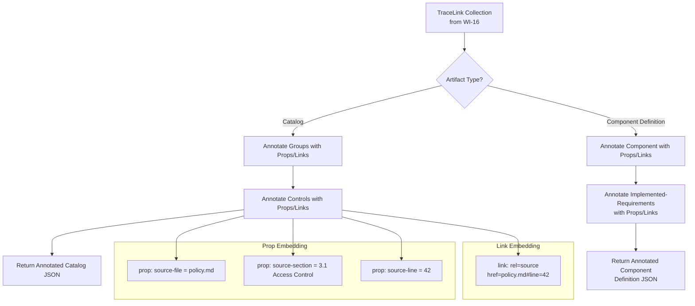
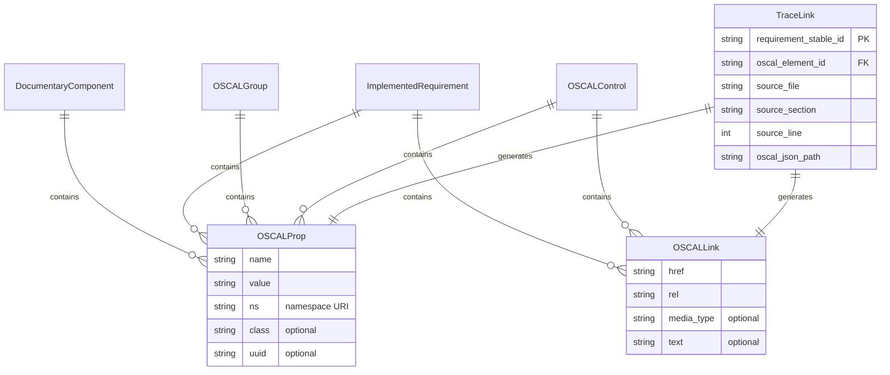
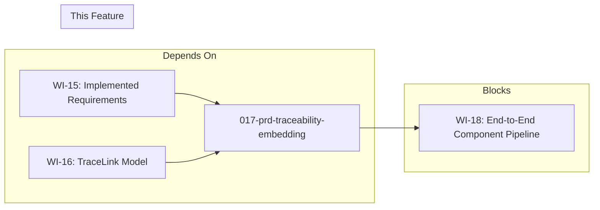

# 017-prd-traceability-embedding

> **Document Type:** Product Requirements Document
> **Audience:** LLM agents, human reviewers
> **Status:** Draft
> **Last Updated:** 2026-02-10 <!-- @auto -->
> **Owner:** Brian Luby <!-- @human-required -->

**Feature Branch**: `017-traceability-embedding`
**Created**: 2026-02-10
**Status**: Draft
**Input**: Derived from FORGE Product Roadmap WI-17

---

## Review Tier Legend

| Marker | Tier | Speckit Behavior |
|--------|------|------------------|
| :red_circle: `@human-required` | Human Generated | Prompt human to author; blocks until complete |
| :yellow_circle: `@human-review` | LLM + Human Review | LLM drafts -> prompt human to confirm/edit; blocks until confirmed |
| :green_circle: `@llm-autonomous` | LLM Autonomous | LLM completes; no prompt; logged for audit |
| :white_circle: `@auto` | Auto-generated | System fills (timestamps, links); no prompt |

---

## Document Completion Order

> **For LLM Agents:** Complete sections in this order. Do not fill downstream sections until upstream human-required inputs exist.

1. **Context** (Background, Scope) -> requires human input first
2. **Problem Statement & User Scenarios** -> requires human input
3. **Requirements** (Must/Should/Could/Won't) -> requires human input
4. **Technical Constraints** -> human review
5. **Diagrams, Data Model, Interface** -> LLM can draft after above exist
6. **Acceptance Criteria** -> derived from requirements
7. **Everything else** -> can proceed

---

## Context

### Background :red_circle: `@human-required`
This PRD covers **WI-17: Traceability -- Embedded Props/Links** from the FORGE Product Roadmap (Sprint S-17, Jun 23-27 2026, Theme T-2: OSCAL Model Generation, Milestone MS-3). WI-15 (implemented-requirements) established the Component Definition's control-implementation mapping, and WI-16 (TraceLink model) built the internal data structure that tracks bidirectional relationships between source policy locations and generated OSCAL elements. WI-17 takes the TraceLink data produced during OSCAL generation and embeds it directly into the generated OSCAL artifacts as `prop` and `link` elements, making trace metadata a first-class part of the OSCAL output rather than a sidecar or external report.

This work item directly satisfies Parent PRD requirements M-10 ("The CLI shall preserve traceability from each generated OSCAL element back to its source policy section and line") and M-11 ("The converter shall not store arbitrary data in OSCAL remarks fields; additional data shall use prop or link patterns per NIST guidance"). By embedding trace metadata as props and links, FORGE ensures that any OSCAL-compliant tool consuming the generated artifacts can discover the provenance of every element without needing access to a separate traceability database or report.

### Scope Boundaries :yellow_circle: `@human-review`

**In Scope:**
- Embedding `prop` elements on OSCAL controls, groups, and components to record source file, section, and line number
- Embedding `link` elements on OSCAL elements that point back to source document locations using a defined `rel` value
- Annotating both Catalog artifacts (controls, groups) and Component Definition artifacts (components, implemented-requirements)
- Ensuring all embedded props/links follow NIST OSCAL naming conventions and patterns
- Verifying bidirectional traceability: given an OSCAL element, its source location is discoverable; given a source location, the corresponding OSCAL element(s) are discoverable
- Unit tests confirming prop/link presence and correctness on generated artifacts

**Out of Scope:**
- The TraceLink internal model itself -- completed in WI-16 (016-prd-traceability-model)
- The `forge trace` CLI subcommand and human-readable traceability report -- deferred to WI-38/WI-39 (Phase 3)
- Traceability across Profile resolution boundaries -- deferred to WI-36 (oscal-cli integration)
- Embedding traceability in XML or YAML output formats -- deferred to WI-26/WI-27 (Phase 2)
- Schema validation of generated artifacts with embedded props -- deferred to WI-19 (schema validation)

### Glossary :yellow_circle: `@human-review`

| Term | Definition |
|------|------------|
| prop | An OSCAL property element: a name/value pair with optional class, ns (namespace), and uuid attributes used for structured annotations on OSCAL elements |
| link | An OSCAL link element: a reference to an external or internal resource via `href`, with a `rel` attribute indicating the relationship type |
| TraceLink | FORGE internal model (from WI-16) recording the mapping between a source policy location and a generated OSCAL element |
| Bidirectional Traceability | The ability to navigate from an OSCAL element to its source location and from a source location to its OSCAL element(s) |
| remarks | An OSCAL field intended for human-readable explanatory text; NIST guidance prohibits using it for arbitrary structured data |
| Documentary Component | An OSCAL component of type "policy", "procedure", or "process" representing non-technical control implementations |
| Source Location | A reference to a position in the input policy document, consisting of file path, section identifier, and line number |

### Related Documents :white_circle: `@auto`

| Document | Link | Relationship |
|----------|------|--------------|
| Parent PRD | docs/FORGE_PRD.md | Parent requirements M-10, M-11 |
| Product Roadmap | docs/FORGE_PRODUCT_ROADMAP.md | Sprint S-17 context |
| Product Vision | docs/FORGE_PRODUCT_VISION.md | Strategic goal G-1 |
| Constitution | .specify/memory/constitution.md | Technical constraints and quality gates |
| WI-15 PRD | docs/PRD/015-prd-component-implemented-requirements.md | Dependency: implemented-requirements structure |
| WI-16 PRD | docs/PRD/016-prd-traceability-model.md | Dependency: TraceLink model definition |

---

## Problem Statement :red_circle: `@human-required`

After WI-16, FORGE captures bidirectional traceability data internally during OSCAL generation, but this data exists only in memory as `TraceLink` structs. The generated OSCAL JSON artifacts contain no indication of where each control, group, component, or implemented-requirement originated in the source policy document. Without embedded trace metadata, a downstream consumer of the OSCAL artifact (an auditor, a GRC tool, or the `forge trace` command in Phase 3) cannot determine provenance without access to FORGE's internal state.

Parent PRD M-10 requires that every generated OSCAL element trace back to its source section and line. Parent PRD M-11 requires that such additional metadata use `prop` or `link` patterns -- never `remarks`. This work item bridges the gap: it takes the TraceLink collection from WI-16 and writes it into the OSCAL artifacts themselves as standardized prop/link annotations, ensuring self-contained, auditable, NIST-compliant provenance in every generated artifact.

---

## User Scenarios & Testing :red_circle: `@human-required`

### User Story 1 -- Discover Source Location from OSCAL Control (Priority: P1)

An auditor inspects a generated OSCAL Catalog and needs to verify the source of a specific control.

> As an auditor reviewing a generated OSCAL Catalog, I want each control to contain prop and link elements indicating its source policy file, section, and line number so that I can trace any control back to its authoritative policy text without needing a separate report.

**Why this priority**: This is the core traceability capability required by M-10. Without it, generated OSCAL artifacts are opaque and unauditable.

**Independent Test**: Generate an OSCAL Catalog from a policy document and inspect any control's `props` and `links` arrays for source location metadata.

**Acceptance Scenarios**:
1. **Given** a Markdown policy document with a requirement at line 42 in section "3.1 Access Control", **When** converting to OSCAL Catalog, **Then** the generated control has a `prop` with `name: "source-file"` and a `prop` with `name: "source-line"` and `value: "42"`, and a `prop` with `name: "source-section"` and `value: "3.1 Access Control"`.
2. **Given** the same generated control, **When** inspecting its `links` array, **Then** there is a `link` with `rel: "source"` and an `href` referencing the source file and location.

---

### User Story 2 -- Discover Source Location from Component Definition (Priority: P1)

A compliance engineer inspects a generated Component Definition and needs to verify which policy text backs each implemented-requirement.

> As a compliance engineer reviewing a generated Component Definition, I want each implemented-requirement to contain props and links indicating its source policy section and line so that I can verify the mapping between policy text and control implementation narratives.

**Why this priority**: Component Definition traceability is equally critical for M-10 and is the primary MS-3 deliverable alongside Catalog traceability.

**Independent Test**: Generate an OSCAL Component Definition and inspect any implemented-requirement's `props` and `links` for source location metadata.

**Acceptance Scenarios**:
1. **Given** a policy document and a baseline profile reference, **When** converting to Component Definition, **Then** each `implemented-requirement` has `prop` elements for `source-file`, `source-section`, and `source-line`.
2. **Given** the same Component Definition, **When** inspecting the documentary component itself, **Then** the component has a `prop` with `name: "source-file"` indicating the policy document it was derived from.

---

### User Story 3 -- Verify No Trace Data in Remarks (Priority: P1)

A compliance engineer needs confidence that FORGE does not misuse OSCAL `remarks` fields for trace metadata.

> As a compliance engineer, I want assurance that trace metadata is stored exclusively in prop and link elements, never in remarks fields, so that generated artifacts comply with NIST OSCAL guidance.

**Why this priority**: M-11 explicitly prohibits storing arbitrary data in remarks. Violating this makes artifacts non-compliant with NIST guidance.

**Independent Test**: Generate OSCAL artifacts and verify that no `remarks` field contains trace metadata (file paths, line numbers, section references).

**Acceptance Scenarios**:
1. **Given** any generated OSCAL artifact (Catalog or Component Definition), **When** inspecting all `remarks` fields, **Then** none contain source file paths, line numbers, or section identifiers -- all such data is in `props` or `links` exclusively.

---

## Assumptions & Risks :yellow_circle: `@human-review`

### Assumptions
- [A-1] WI-16 (TraceLink model) provides a complete `Vec<TraceLink>` collection after OSCAL generation, with each TraceLink containing the source file path, section title, line number, and the OSCAL element ID it maps to.
- [A-2] WI-15 (implemented-requirements) provides the Component Definition structure with `implemented-requirements` elements that accept `props` and `links` per the OSCAL v1.2.0 schema.
- [A-3] The OSCAL v1.2.0 schema permits user-defined `prop` names (with a `ns` namespace) and `link` elements with custom `rel` values on controls, groups, components, and implemented-requirements.
- [A-4] Source line numbers captured during parsing (WI-3/WI-4) remain accurate through atomization (WI-6) and are available in the TraceLink model.

### Risks
| ID | Risk | Likelihood | Impact | Mitigation |
|----|------|------------|--------|------------|
| R-1 | Custom prop names conflict with future OSCAL standard prop names | Low | Med | Use a FORGE-specific namespace (`ns: "https://forge.policy-forge.github.io/ns/trace"`) to avoid collisions with NIST-defined prop names |
| R-2 | Embedded trace props significantly increase artifact file size for large policies | Low | Low | Props are small name/value pairs; even 500 controls with 3 props each add minimal overhead. Monitor in WI-24 benchmarks. |
| R-3 | TraceLink model from WI-16 does not capture all required fields for embedding | Med | Med | Define the expected TraceLink interface contract in this PRD; coordinate with WI-16 implementation to ensure fields are present |

---

## Feature Overview

### Flow Diagram :yellow_circle: `@human-review`



### State Diagram (if applicable) :yellow_circle: `@human-review`
N/A -- No state transitions in this work item. This is a data annotation step within the generation pipeline.

---

## Requirements

### Must Have (M) -- MVP, launch blockers :red_circle: `@human-required`
- [ ] **M-1:** Every generated OSCAL control (in Catalog output) shall have `prop` elements recording `source-file`, `source-section`, and `source-line` from its originating policy requirement.
- [ ] **M-2:** Every generated OSCAL control shall have a `link` element with `rel: "source"` pointing to the source document and location.
- [ ] **M-3:** Every generated `implemented-requirement` (in Component Definition output) shall have `prop` elements recording `source-file`, `source-section`, and `source-line`.
- [ ] **M-4:** Every generated `implemented-requirement` shall have a `link` element with `rel: "source"` pointing to the source document and location.
- [ ] **M-5:** The documentary component element itself shall have a `prop` element recording the `source-file` from which it was derived.
- [ ] **M-6:** All trace-related props shall use the FORGE namespace (`ns: "https://forge.policy-forge.github.io/ns/trace"`) to avoid collisions with NIST-defined prop names.
- [ ] **M-7:** No trace metadata (file paths, section names, line numbers) shall appear in any `remarks` field in generated artifacts.
- [ ] **M-8:** Bidirectional traceability shall be verifiable: given any generated OSCAL element with trace props, the source location is unambiguous; given a source section, the corresponding OSCAL element ID(s) can be determined from the artifact's props.

### Should Have (S) -- High value, not blocking :red_circle: `@human-required`
- [ ] **S-1:** Group elements in Catalog output should have `prop` elements recording the source section they map to.
- [ ] **S-2:** Prop values for `source-section` should use the section's hierarchical path (e.g., "3.1 Access Control") rather than just the immediate heading text, to disambiguate sections with identical titles.

### Could Have (C) -- Nice to have, if time permits :yellow_circle: `@human-review`
- [ ] **C-1:** A `prop` with `name: "source-hash"` containing a content hash of the source text, enabling consumers to detect if the source has changed since generation.

### Won't Have (W) -- Explicitly deferred :yellow_circle: `@human-review`
- [ ] **W-1:** Human-readable traceability report output -- *Reason: Deferred to WI-38/WI-39 (forge trace subcommand)*
- [ ] **W-2:** Traceability embedding in XML or YAML output formats -- *Reason: Deferred to WI-26/WI-27 (Phase 2 output format expansion)*
- [ ] **W-3:** Traceability across Profile resolution boundaries -- *Reason: Deferred to WI-36 (oscal-cli integration in Phase 3)*
- [ ] **W-4:** Interactive traceability visualization or navigation -- *Reason: Out of scope for CLI tool*

---

## Technical Constraints :yellow_circle: `@human-review`

- **Language/Framework:** Rust (latest stable), Cargo build system
- **OSCAL Version:** OSCAL v1.2.0 -- props and links must conform to the OSCAL v1.2.0 property and link model definitions
- **Namespace:** FORGE-specific props must use a dedicated namespace URI to avoid collisions with NIST-defined standard prop names
- **No Remarks Abuse:** Per M-11 and NIST guidance, trace data must never be placed in `remarks` fields; only `prop` and `link` elements are permitted
- **Serialization:** JSON output only (JSON serialization of embedded props/links); XML/YAML deferred to Phase 2
- **Linting:** `cargo clippy -- -D warnings` must pass
- **Formatting:** `cargo fmt --all` must produce no changes
- **Testing:** `cargo test` must pass; TDD is mandatory per constitution principle IV
- **Dependencies:** No new external dependencies expected; this work item uses existing serde/JSON serialization infrastructure

---

## Data Model (if applicable) :yellow_circle: `@human-review`



### Prop Schema

The following props are embedded on each traced OSCAL element:

| Prop Name | Namespace | Value | Example |
|-----------|-----------|-------|---------|
| `source-file` | `https://forge.policy-forge.github.io/ns/trace` | Source policy file path | `"policy.md"` |
| `source-section` | `https://forge.policy-forge.github.io/ns/trace` | Hierarchical section path | `"3.1 Access Control"` |
| `source-line` | `https://forge.policy-forge.github.io/ns/trace` | 1-based line number in source | `"42"` |

### Link Schema

| Rel Value | Href Format | Example |
|-----------|-------------|---------|
| `source` | `<file>#line=<n>` | `"policy.md#line=42"` |

---

## Interface Contract (if applicable) :yellow_circle: `@human-review`

```rust
// Trace embedding interface

/// Embeds trace metadata from TraceLinks into an OSCAL Catalog's
/// controls and groups as prop and link elements.
///
/// # Arguments
/// * `catalog` - Mutable reference to the Catalog being generated
/// * `trace_links` - Collection of TraceLinks captured during generation
///
/// # Guarantees
/// - Every control with a matching TraceLink receives source-file,
///   source-section, and source-line props plus a source link
/// - No trace data is placed in remarks fields
/// - All props use the FORGE trace namespace
fn embed_trace_in_catalog(
    catalog: &mut Catalog,
    trace_links: &[TraceLink],
);

/// Embeds trace metadata from TraceLinks into a Component Definition's
/// implemented-requirements and component as prop and link elements.
///
/// # Arguments
/// * `component_def` - Mutable reference to the Component Definition
/// * `trace_links` - Collection of TraceLinks captured during generation
///
/// # Guarantees
/// - Every implemented-requirement with a matching TraceLink receives
///   source-file, source-section, and source-line props plus a source link
/// - The documentary component receives a source-file prop
/// - No trace data is placed in remarks fields
fn embed_trace_in_component_definition(
    component_def: &mut ComponentDefinition,
    trace_links: &[TraceLink],
);

/// Constructs OSCAL prop elements for a given TraceLink.
///
/// Returns a Vec of three props: source-file, source-section, source-line,
/// all with the FORGE trace namespace.
fn trace_link_to_props(trace_link: &TraceLink) -> Vec<Prop>;

/// Constructs an OSCAL link element for a given TraceLink.
///
/// Returns a link with rel="source" and href pointing to the source
/// file and line number.
fn trace_link_to_link(trace_link: &TraceLink) -> Link;

// Constants
const FORGE_TRACE_NS: &str = "https://forge.policy-forge.github.io/ns/trace";
const PROP_SOURCE_FILE: &str = "source-file";
const PROP_SOURCE_SECTION: &str = "source-section";
const PROP_SOURCE_LINE: &str = "source-line";
const LINK_REL_SOURCE: &str = "source";
```

### Example OSCAL JSON Output (Control with Trace Props/Links)

```json
{
  "id": "POL-AC-001",
  "title": "Access Control Requirements",
  "props": [
    {
      "name": "source-file",
      "ns": "https://forge.policy-forge.github.io/ns/trace",
      "value": "policy.md"
    },
    {
      "name": "source-section",
      "ns": "https://forge.policy-forge.github.io/ns/trace",
      "value": "3.1 Access Control"
    },
    {
      "name": "source-line",
      "ns": "https://forge.policy-forge.github.io/ns/trace",
      "value": "42"
    }
  ],
  "links": [
    {
      "href": "policy.md#line=42",
      "rel": "source"
    }
  ],
  "parts": [
    {
      "name": "statement",
      "prose": "All systems must enforce multi-factor authentication for privileged access."
    }
  ]
}
```

---

## Evaluation Criteria :yellow_circle: `@human-review`

| Criterion | Weight | Metric | Target | Notes |
|-----------|--------|--------|--------|-------|
| Prop Completeness | Critical | % of generated controls/implemented-requirements with all three trace props | 100% | Every traced element must have source-file, source-section, source-line |
| Link Completeness | Critical | % of generated controls/implemented-requirements with a source link | 100% | Every traced element must have a rel=source link |
| No Remarks Abuse | Critical | Count of remarks fields containing trace metadata | 0 | Per M-11, no trace data in remarks |
| Namespace Compliance | High | % of trace props using FORGE namespace | 100% | All FORGE-specific props must be namespaced |
| Bidirectional Verification | High | Given any OSCAL element ID, source location is recoverable; given any source line, OSCAL element IDs are discoverable | 100% | Core traceability guarantee |

---

## Tool/Approach Candidates :yellow_circle: `@human-review`

| Option | License | Pros | Cons | Spike Result |
|--------|---------|------|------|--------------|
| Inline embedding during generation (annotate elements as they are built) | N/A (internal approach) | Simple, single-pass, props are set at creation time | Requires generation code to have access to TraceLink data | Selected |
| Post-processing pass (build artifact, then walk and annotate) | N/A (internal approach) | Separation of concerns, generation code stays clean | Requires element lookup by ID, adds a second pass | Considered |

### Selected Approach :red_circle: `@human-required`
> **Decision:** Hybrid approach -- embed trace props/links during generation where TraceLink data is available at element creation, with a post-processing pass to handle any elements that need annotation after assembly.
> **Rationale:** The generation code (WI-9/WI-10 for Catalog, WI-14/WI-15 for Component Definition) already has access to the source `PolicyRequirement` and its `SourceSpan` when creating each OSCAL element. Embedding props at creation time avoids a costly lookup pass. A lightweight post-processing step ensures completeness for any edge cases (e.g., group-level annotations derived from multiple child controls).

---

## Acceptance Criteria :yellow_circle: `@human-review`

| AC ID | Requirement | User Story | Given | When | Then |
|-------|-------------|------------|-------|------|------|
| AC-1 | M-1 | US-1 | A Markdown policy with requirements in identified sections | Converting to OSCAL Catalog | Every control has `source-file`, `source-section`, and `source-line` props with the FORGE trace namespace |
| AC-2 | M-2 | US-1 | A generated Catalog control | Inspecting its links array | A link with `rel: "source"` and `href` pointing to `<file>#line=<n>` is present |
| AC-3 | M-3 | US-2 | A policy document and baseline profile | Converting to Component Definition | Every implemented-requirement has `source-file`, `source-section`, and `source-line` props |
| AC-4 | M-4 | US-2 | A generated implemented-requirement | Inspecting its links array | A link with `rel: "source"` is present |
| AC-5 | M-5 | US-2 | A generated Component Definition | Inspecting the documentary component | The component has a `source-file` prop indicating the policy document |
| AC-6 | M-6 | US-1, US-2 | Any trace prop on any generated element | Inspecting the prop's `ns` field | The namespace is `https://forge.policy-forge.github.io/ns/trace` |
| AC-7 | M-7 | US-3 | Any generated OSCAL artifact | Searching all `remarks` fields | No remarks field contains file paths, section names, or line numbers |
| AC-8 | M-8 | US-1 | A generated Catalog with trace props | Looking up a control by its ID and reading its source-line prop | The source location (file, section, line) is unambiguous and correct |

### Edge Cases :green_circle: `@llm-autonomous`
- [ ] **EC-1:** (M-1) When a policy requirement spans multiple lines, `source-line` records the starting line of the requirement.
- [ ] **EC-2:** (M-1) When a policy requirement was atomized from a compound statement (WI-6), each resulting control gets the source-line of the original compound statement.
- [ ] **EC-3:** (M-8) When two different requirements originate from the same source line (e.g., atomized compound statement), both controls have the same `source-line` value but distinct control IDs, maintaining bidirectional traceability.
- [ ] **EC-4:** (S-1) When a group has no direct source section (e.g., a synthetic grouping), it receives no `source-section` prop rather than an empty or placeholder value.
- [ ] **EC-5:** (M-6) When a prop name like `source-file` collides with a future NIST-defined prop name, the FORGE namespace (`ns`) disambiguates the two.
- [ ] **EC-6:** (M-7) When the source policy file path contains special characters (spaces, unicode), the `source-file` prop value preserves the exact path and the `link` href properly encodes it.

---

## Dependencies :yellow_circle: `@human-review`



- **Requires:** WI-15 (015-prd-component-implemented-requirements) -- provides Component Definition structure with implemented-requirements
- **Requires:** WI-16 (016-prd-traceability-model) -- provides TraceLink model with source location data
- **Blocks:** WI-18 (018-prd-end-to-end-component-pipeline) -- the end-to-end pipeline requires trace embedding to be in place for MS-3 deliverable
- **External:** None

---

## Security Considerations :yellow_circle: `@human-review`

| Aspect | Assessment | Notes |
|--------|------------|-------|
| Internet Exposure | No | CLI tool, no network services; trace data is embedded locally |
| Sensitive Data | Low | Source file paths and line numbers are embedded in output artifacts; paths may reveal directory structure. Users should be aware that generated OSCAL artifacts contain source file paths. |
| Authentication Required | No | Local CLI tool |
| Security Review Required | Low | File path embedding is the only concern. No user-controlled input is injected into prop values without sanitization. Source paths originate from the user's own `forge convert` invocation. |

Additional security notes:
- Source file paths embedded in props reflect paths provided by the user on the command line. They do not expose additional filesystem information.
- The `link` `href` values reference local files, not network resources. Consumers of the OSCAL artifact should treat them as relative references.
- No secrets, credentials, or sensitive internal state are embedded in trace props.

---

## Implementation Guidance :green_circle: `@llm-autonomous`

### Suggested Approach
Implement two functions (`embed_trace_in_catalog` and `embed_trace_in_component_definition`) that accept the generated OSCAL structure and the TraceLink collection. For each TraceLink, look up the corresponding OSCAL element by its element ID and append the three standard props (`source-file`, `source-section`, `source-line`) and one link (`rel: "source"`). Use a helper function `trace_link_to_props` to construct the prop elements with the FORGE namespace constant, and `trace_link_to_link` to construct the link with the `<file>#line=<n>` href format.

For Catalog generation, integrate the embedding into the existing control-building loop from WI-9/WI-10, since the `PolicyRequirement` and its `SourceSpan` are already in scope. For Component Definition, integrate into the implemented-requirement mapping from WI-15.

Define the FORGE trace namespace as a constant (`FORGE_TRACE_NS`) shared across the codebase. Define prop name constants (`PROP_SOURCE_FILE`, `PROP_SOURCE_SECTION`, `PROP_SOURCE_LINE`) and the link rel constant (`LINK_REL_SOURCE`) to prevent string duplication and typos.

### Anti-patterns to Avoid
- **Storing trace data in `remarks`**: This directly violates M-11 and NIST OSCAL guidance. Always use `prop` or `link`.
- **Using unnamespaced prop names**: Without a namespace, custom prop names risk colliding with NIST-defined standard props in future OSCAL versions.
- **Embedding trace data as freeform text in prop values**: Prop values should be atomic (one piece of data per prop), not comma-separated or structured text that requires parsing.
- **Hardcoding the namespace string in multiple places**: Use a single constant to avoid drift across Catalog and Component Definition embedding code.
- **Skipping trace embedding for atomized requirements**: Even when a compound statement was split, each resulting control must trace back to the original source line.

### Reference Examples
- NIST OSCAL property model: https://pages.nist.gov/OSCAL/reference/latest/complete/json-outline/#/property
- NIST OSCAL link model: https://pages.nist.gov/OSCAL/reference/latest/complete/json-outline/#/link
- OSCAL namespace usage guidance: https://pages.nist.gov/OSCAL/concepts/layer/overview/#prop-and-link

---

## Spike Tasks :yellow_circle: `@human-review`

N/A -- No spike tasks for this work item. The OSCAL prop/link model is well-defined in the v1.2.0 specification, and no external tools or crates are needed beyond existing serialization infrastructure.

---

## Success Metrics :red_circle: `@human-required`

| Metric | Baseline | Target | Measurement Method |
|--------|----------|--------|-------------------|
| Trace prop completeness | 0% (no trace props in artifacts) | 100% of controls and implemented-requirements have all three trace props | Automated test asserting prop presence on every element |
| Trace link completeness | 0% (no trace links in artifacts) | 100% of controls and implemented-requirements have a source link | Automated test asserting link presence on every element |
| Remarks compliance | N/A | 0 trace metadata in remarks fields | Automated test scanning all remarks |

### Technical Verification :green_circle: `@llm-autonomous`
| Metric | Target | Verification Method |
|--------|--------|---------------------|
| Test coverage for embedding functions | >90% | `cargo test` + coverage tool |
| No clippy warnings | 0 | `cargo clippy -- -D warnings` |
| No formatting violations | 0 | `cargo fmt --check` |
| All prop names use constants (no raw strings) | 100% | Code review / grep for raw trace prop strings |

---

## Definition of Ready :red_circle: `@human-required`

### Readiness Checklist
- [x] Problem statement reviewed and validated by stakeholder
- [x] All Must Have requirements have acceptance criteria
- [x] Technical constraints are explicit and agreed
- [x] Dependencies identified and owners confirmed
- [x] Security review completed (or N/A documented with justification)
- [x] No open questions blocking implementation
- [x] WI-16 (TraceLink model) interface contract is defined and agreed

### Sign-off
| Role | Name | Date | Decision |
|------|------|------|----------|
| Product Owner | Brian Luby | YYYY-MM-DD | [Ready / Not Ready] |

---

## Changelog :white_circle: `@auto`

| Version | Date | Author | Changes |
|---------|------|--------|---------|
| 0.1 | 2026-02-10 | LLM (Claude) | Initial draft derived from FORGE Product Roadmap WI-17 |

---

## Decision Log :yellow_circle: `@human-review`

| Date | Decision | Rationale | Alternatives Considered |
|------|----------|-----------|------------------------|
| 2026-02-10 | Use FORGE-specific namespace for all trace props | Avoids collision with NIST-defined prop names in current and future OSCAL versions; OSCAL prop model explicitly supports namespaced extensions | Use unnamespaced prop names (risk of collision); use OSCAL-defined prop names only (insufficient for trace-specific metadata) |
| 2026-02-10 | Use `#line=<n>` fragment in link href for source line reference | Simple, human-readable, consistent with common fragment identifier patterns; parseable by the future `forge trace` command | Use JSON pointer fragments (overly complex for source file references); use only props without links (loses the link-based navigation pattern) |
| 2026-02-10 | Three separate props per trace point instead of one structured prop | OSCAL props are name/value pairs; one prop per datum is idiomatic and allows tools to query individual fields without parsing | Single prop with JSON-encoded value (violates OSCAL prop simplicity); single prop with delimited value (fragile parsing) |

---

## Open Questions :yellow_circle: `@human-review`

No open questions for this work item.

---

## Review Checklist :green_circle: `@llm-autonomous`

Before marking as Approved:
- [x] All requirements have unique IDs (M-1 through M-8, S-1 through S-2, C-1, W-1 through W-4)
- [x] All Must Have requirements have linked acceptance criteria
- [x] User stories are prioritized and independently testable
- [x] Acceptance criteria reference both requirement IDs and user stories
- [x] Glossary terms are used consistently throughout
- [x] Diagrams use terminology from Glossary
- [x] Security considerations documented (Low risk justified)
- [x] Definition of Ready checklist is complete
- [x] No open questions blocking implementation
