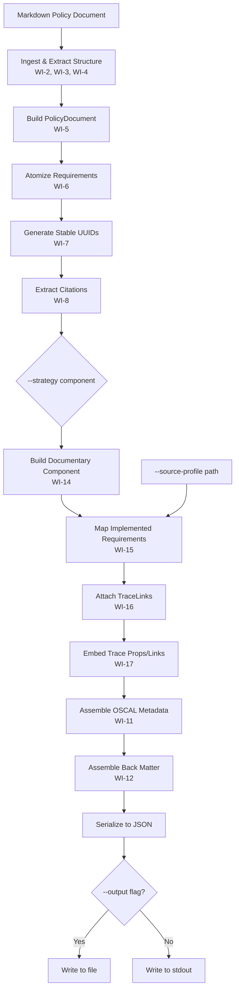
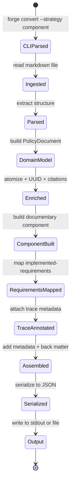
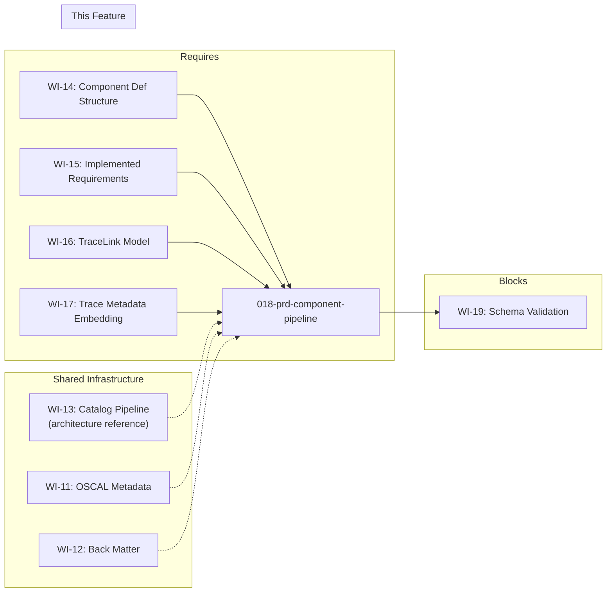

# 018-prd-component-pipeline

> **Document Type:** Product Requirements Document
> **Audience:** LLM agents, human reviewers
> **Status:** Draft
> **Last Updated:** 2026-02-10 <!-- @auto -->
> **Owner:** Brian Luby <!-- @human-required -->

**Feature Branch**: `018-component-pipeline`
**Created**: 2026-02-10
**Status**: Draft
**Input**: Derived from FORGE Product Roadmap WI-18

---

## Review Tier Legend

| Marker | Tier | Speckit Behavior |
|--------|------|------------------|
| 🔴 `@human-required` | Human Generated | Prompt human to author; blocks until complete |
| 🟡 `@human-review` | LLM + Human Review | LLM drafts → prompt human to confirm/edit; blocks until confirmed |
| 🟢 `@llm-autonomous` | LLM Autonomous | LLM completes; no prompt; logged for audit |
| ⚪ `@auto` | Auto-generated | System fills (timestamps, links); no prompt |

---

## Document Completion Order

> ⚠️ **For LLM Agents:** Complete sections in this order. Do not fill downstream sections until upstream human-required inputs exist.

1. **Context** (Background, Scope) → requires human input first
2. **Problem Statement & User Scenarios** → requires human input
3. **Requirements** (Must/Should/Could/Won't) → requires human input
4. **Technical Constraints** → human review
5. **Diagrams, Data Model, Interface** → LLM can draft after above exist
6. **Acceptance Criteria** → derived from requirements
7. **Everything else** → can proceed

---

## Context

### Background 🔴 `@human-required`
This PRD covers **WI-18: End-to-End Component Pipeline** from the FORGE Product Roadmap (Sprint S-18, Jun 30–Jul 3 2026, Theme T-2: OSCAL Model Generation, Milestone MS-3). WI-14 through WI-17 built the individual pieces of Component Definition generation: documentary component structure (WI-14), implemented-requirements with control-id mapping (WI-15), the TraceLink model (WI-16), and embedded trace metadata as props/links (WI-17). WI-18 wires all of these pieces together through the full pipeline — from Markdown ingestion through OSCAL Component Definition JSON output — and exposes the result via the `--strategy component` CLI flag. This is the second end-to-end integration work item (after WI-13 did the same for the Catalog strategy) and serves as the MS-3 milestone exit criteria: `forge convert policy.md --strategy component` produces a valid Component Definition with trace links.

### Scope Boundaries 🟡 `@human-review`

**In Scope:**
- Wiring the Component Definition generation (WI-14, WI-15) through the full pipeline: ingest → parse → normalize → map → assemble → serialize
- Implementing `--strategy component` CLI flag for the `forge convert` subcommand
- Implementing `--source-profile <path>` CLI flag for specifying the baseline catalog/profile for control-id mapping
- Outputting Component Definition as JSON via `--format json`
- Supporting `--output <path>` for file output (default: stdout)
- Ensuring traceability metadata (WI-16, WI-17) is embedded in the generated Component Definition
- Smoke test: sample Markdown policy + baseline reference produces a valid Component Definition JSON

**Out of Scope:**
- Schema validation of generated output — deferred to WI-19 (019-prd-schema-validation)
- XML or YAML output formats — deferred to WI-26/WI-27 (Phase 2)
- Profile generation or profile resolution — deferred to WI-30+ (Phase 2)
- Golden-file test suite — deferred to WI-21/WI-22
- Normative vs advisory detection — deferred to WI-33
- Parameter extraction — deferred to WI-34

### Glossary 🟡 `@human-review`

| Term | Definition |
|------|------------|
| Component Definition | OSCAL model describing how controls are implemented by reusable components, including documentary components (policy/procedure) |
| Documentary Component | An OSCAL component of type "policy", "procedure", or "process" representing non-technical control implementations |
| Source Profile | A baseline catalog or profile referenced by `--source-profile` that provides control IDs for implemented-requirement mapping |
| Implemented Requirement | An OSCAL element within a Component Definition that maps a component's implementation narrative to a specific control-id |
| Control Implementation | An OSCAL structure within a Component Definition that groups implemented-requirements under a source profile reference |
| TraceLink | An internal model linking a source policy requirement (by stable_id and source location) to a generated OSCAL element (by JSON path and element ID) |
| Pipeline | The full processing chain: ingest → parse → normalize → map → assemble → serialize |

### Related Documents ⚪ `@auto`

| Document | Link | Relationship |
|----------|------|--------------|
| Parent PRD | docs/FORGE_PRD.md | Parent requirements M-4, M-7 (Component Definition + JSON output) |
| Product Roadmap | docs/FORGE_PRODUCT_ROADMAP.md | Sprint S-18 context |
| Product Vision | docs/FORGE_PRODUCT_VISION.md | Strategic goal G-1 |
| Constitution | .specify/memory/constitution.md | Technical constraints and quality gates |
| Depends On | docs/PRD/001-prd-project-scaffolding.md | Project structure and CLI framework |
| Depends On | docs/PRD/005-prd-domain-model.md | PolicyDocument domain model |

---

## Problem Statement 🔴 `@human-required`

WI-14 through WI-17 built the individual building blocks for Component Definition generation: documentary component structure, implemented-requirements with control-id mapping, the TraceLink model, and embedded trace metadata. However, these pieces are not yet wired together into an end-to-end pipeline accessible from the CLI. A user cannot yet run `forge convert policy.md --strategy component` and receive a Component Definition JSON file. Without this integration, the component-first conversion strategy — which is equally critical as the catalog-first strategy for organizations that map policies to external control frameworks — remains inaccessible. WI-18 completes the MS-3 milestone by connecting all component-related pieces through the full pipeline and exposing the result via the CLI.

---

## User Scenarios & Testing 🔴 `@human-required`

### User Story 1 — Convert Policy to Component Definition via CLI (Priority: P1)

A compliance engineer converts a Markdown security policy into an OSCAL Component Definition mapped to a baseline control framework.

> As a compliance engineer, I want to run `forge convert policy.md --strategy component --source-profile baseline.json --format json` so that I receive a valid OSCAL Component Definition with my policy requirements mapped as implemented-requirements against baseline control IDs.

**Why this priority**: This is the primary deliverable for MS-3 and directly fulfills Parent PRD requirements M-4 and M-7. The component-first strategy is a P1 capability per Parent PRD US-2.

**Independent Test**: Run `forge convert policy.md --strategy component --source-profile baseline.json --format json` and verify the output is a valid OSCAL Component Definition JSON with documentary components, implemented-requirements, and traceability props.

**Acceptance Scenarios**:
1. **Given** a Markdown policy document and a baseline profile path, **When** running `forge convert policy.md --strategy component --source-profile baseline.json --format json`, **Then** a valid OSCAL Component Definition JSON is written to stdout containing a documentary component with control-implementations referencing the baseline.
2. **Given** a policy with 5 requirements mapped to 3 control IDs, **When** converting with `--strategy component`, **Then** the Component Definition contains 5 implemented-requirements, each referencing the correct control-id and containing the policy-derived narrative.
3. **Given** the `--output report.json` flag, **When** converting, **Then** the Component Definition JSON is written to `report.json` instead of stdout.

---

### User Story 2 — Traceability in Component Definition Output (Priority: P1)

A compliance engineer verifies that every implemented-requirement in the Component Definition traces back to the source policy location.

> As a compliance engineer, I want the generated Component Definition to contain traceability metadata so that I can audit which policy section and line produced each implemented-requirement.

**Why this priority**: Traceability is non-negotiable per product principle P-2 and Parent PRD requirement M-10. The end-to-end pipeline must preserve trace links through all stages.

**Independent Test**: Inspect the generated Component Definition JSON and verify each implemented-requirement contains trace props linking back to source file, section, and line number.

**Acceptance Scenarios**:
1. **Given** a generated Component Definition, **When** inspecting any implemented-requirement, **Then** it contains `prop` annotations with source file path, section title, and source line number.
2. **Given** a generated Component Definition, **When** inspecting the traceability metadata, **Then** every implemented-requirement has a bidirectional trace link to its source PolicyRequirement.

---

### User Story 3 — Component Strategy Without Source Profile (Priority: P2)

A user runs the component strategy without specifying a source profile to get a Component Definition with unmapped requirements.

> As a compliance engineer, I want to run `forge convert policy.md --strategy component --format json` without a `--source-profile` flag so that I get a Component Definition with requirements that I can manually map to controls later.

**Why this priority**: Not all users will have a baseline profile available immediately. The tool should still produce useful output.

**Independent Test**: Run `forge convert policy.md --strategy component --format json` without `--source-profile` and verify a Component Definition is produced with documentary components but without control-id references.

**Acceptance Scenarios**:
1. **Given** no `--source-profile` flag, **When** running `forge convert policy.md --strategy component --format json`, **Then** a valid Component Definition is produced with implemented-requirements that have no control-id mapping (or use placeholder IDs).
2. **Given** no `--source-profile` flag, **When** the output is generated, **Then** a warning is emitted indicating that control-id mapping was skipped due to missing source profile.

---

## Assumptions & Risks 🟡 `@human-review`

### Assumptions
- [A-1] WI-14 (Component Definition structure) and WI-15 (implemented-requirements) are complete and produce correct OSCAL Component Definition JSON fragments.
- [A-2] WI-16 (TraceLink model) and WI-17 (embedded trace metadata) are complete and can annotate Component Definition elements.
- [A-3] The full ingest → parse → normalize pipeline from WI-1 through WI-8 is operational and produces a valid `PolicyDocument`.
- [A-4] The `--strategy catalog` pipeline (WI-13) is operational and can serve as an architectural reference for the component pipeline wiring.
- [A-5] The `--source-profile` flag accepts a file path to a JSON catalog or profile; parsing the referenced profile for control IDs is handled by the mapping logic from WI-15.

### Risks
| ID | Risk | Likelihood | Impact | Mitigation |
|----|------|------------|--------|------------|
| R-1 | Integration issues between WI-14/15 component builders and the main pipeline | Med | Med | Follow the same wiring pattern established by WI-13 (Catalog pipeline); reuse shared pipeline infrastructure |
| R-2 | Source profile parsing fails for certain profile/catalog formats | Low | Med | Limit initial support to OSCAL JSON profiles/catalogs; validate source-profile input before processing |
| R-3 | Traceability metadata from WI-16/17 not properly threaded through the component pipeline | Low | High | End-to-end test verifying trace props in output; reuse proven trace embedding from Catalog pipeline |

---

## Feature Overview

### Flow Diagram 🟡 `@human-review`



### State Diagram (if applicable) 🟡 `@human-review`



---

## Requirements

### Must Have (M) — MVP, launch blockers 🔴 `@human-required`
- [ ] **M-1:** The `forge convert` command shall accept `--strategy component` to invoke the Component Definition generation pipeline. *(Traces to: Parent PRD M-4)*
- [ ] **M-2:** The `forge convert` command shall accept `--source-profile <path>` to specify the baseline catalog/profile for control-id mapping when using the component strategy. *(Traces to: Parent PRD M-4, US-2)*
- [ ] **M-3:** The component pipeline shall wire the full processing chain: ingest → parse → normalize → map → assemble → serialize, producing a complete OSCAL Component Definition JSON. *(Traces to: Parent PRD M-4, M-7)*
- [ ] **M-4:** The generated Component Definition shall include a documentary component with `type: "policy"`, containing `control-implementations` with `implemented-requirements` mapped to control IDs from the source profile. *(Traces to: Parent PRD M-4)*
- [ ] **M-5:** The generated Component Definition shall include all required OSCAL metadata fields: `uuid`, `title`, `last-modified`, `version`, `oscal-version`. *(Traces to: Parent PRD M-5)*
- [ ] **M-6:** The generated Component Definition shall include traceability metadata as `prop` and `link` annotations on implemented-requirements, linking each to its source policy section and line. *(Traces to: Parent PRD M-10, M-11)*
- [ ] **M-7:** The generated Component Definition shall include back matter `resources` for any extracted citations, with `link` elements in the body referencing back matter resource UUIDs. *(Traces to: Parent PRD M-9, M-11)*
- [ ] **M-8:** The output shall be valid JSON written to stdout by default, or to a file when `--output <path>` is specified. *(Traces to: Parent PRD M-7)*

### Should Have (S) — High value, not blocking 🔴 `@human-required`
- [ ] **S-1:** When `--source-profile` is omitted, the component pipeline shall produce a Component Definition with implemented-requirements that lack control-id mappings, and emit a warning to stderr.
- [ ] **S-2:** The pipeline shall validate that the `--source-profile` path exists and is a readable JSON file before processing, and exit with a descriptive error if not.
- [ ] **S-3:** The `--verbose` flag shall print pipeline stage progress to stderr (e.g., "Ingesting...", "Building component...", "Serializing...").

### Could Have (C) — Nice to have, if time permits 🟡 `@human-review`
- [ ] **C-1:** The pipeline could print a summary to stderr after completion: number of requirements extracted, number of implemented-requirements generated, number of control IDs mapped.

### Won't Have (W) — Explicitly deferred 🟡 `@human-review`
- [ ] **W-1:** Schema validation of generated output — *Reason: Deferred to WI-19 (schema validation integration)*
- [ ] **W-2:** XML or YAML output — *Reason: Deferred to WI-26/WI-27 (Phase 2)*
- [ ] **W-3:** Profile resolution (resolving imports/merges in the source profile) — *Reason: Deferred to WI-36 (Phase 3, oscal-cli integration)*
- [ ] **W-4:** Auto-detection of strategy from input content — *Reason: Strategy is always explicit via `--strategy` flag*

---

## Technical Constraints 🟡 `@human-review`

- **Language/Framework:** Rust (latest stable), Cargo build system
- **CLI Framework:** clap 4.x (derive macros), extending existing `convert` subcommand
- **OSCAL Version:** Target OSCAL v1.2.0 Component Definition model
- **Output Format:** JSON only (via `serde_json`); XML/YAML deferred to Phase 2
- **Error Handling:** `thiserror` for pipeline errors; descriptive messages with file paths and stage context
- **Linting:** `cargo clippy -- -D warnings` must pass
- **Formatting:** `cargo fmt --all` must produce no changes
- **Testing:** TDD mandatory per constitution principle IV; smoke tests and unit tests required
- **Pipeline Architecture:** Reuse shared pipeline infrastructure from WI-13 (Catalog pipeline); strategy-specific logic branches after the domain model is built
- **No Network Dependency:** All processing fully offline

---

## Data Model (if applicable) 🟡 `@human-review`

```mermaid
erDiagram
    PolicyDocument ||--o{ PolicySection : contains
    PolicySection ||--o{ PolicyRequirement : contains
    PolicyRequirement ||--o{ Citation : references
    PolicyDocument --> ComponentDefinition : "generates via --strategy component"
    ComponentDefinition ||--|| Metadata : has
    ComponentDefinition ||--o{ Component : contains
    Component ||--o{ ControlImplementation : has
    ControlImplementation ||--o{ ImplementedRequirement : contains
    ImplementedRequirement ||--o{ Prop : "trace metadata"
    ComponentDefinition ||--o{ BackMatterResource : "back-matter"

    ComponentDefinition {
        uuid uuid
        Metadata metadata
    }
    Component {
        uuid uuid
        string type "policy"
        string title
        string description
    }
    ControlImplementation {
        uuid uuid
        string source "source-profile href"
        string description
    }
    ImplementedRequirement {
        uuid uuid
        string control_id "from source profile"
        string description "policy narrative"
    }
    Prop {
        string name "source-file | source-section | source-line"
        string value
    }
    BackMatterResource {
        uuid uuid
        string title
        string href
    }
```

---

## Interface Contract (if applicable) 🟡 `@human-review`

```rust
// CLI Interface (component strategy)

// forge convert <input> --strategy component [--source-profile <path>] --format json [--output <path>]
//
// Examples:
//   forge convert policy.md --strategy component --source-profile baseline.json --format json
//   forge convert policy.md --strategy component --format json --output component-def.json
//   forge convert policy.md --strategy component --source-profile baseline.json --format json --output out.json

// Pipeline entry point (conceptual)

/// Run the component pipeline end-to-end
pub fn run_component_pipeline(
    input_path: &Path,
    source_profile: Option<&Path>,
    output: Option<&Path>,
) -> Result<(), ForgeError> {
    // 1. Ingest markdown file (WI-2)
    // 2. Extract structure: headings (WI-3), clauses (WI-4)
    // 3. Build PolicyDocument (WI-5)
    // 4. Atomize requirements (WI-6)
    // 5. Generate stable UUIDs (WI-7)
    // 6. Extract citations (WI-8)
    // 7. Build documentary component (WI-14)
    // 8. Map implemented-requirements with control-ids (WI-15)
    // 9. Attach trace links (WI-16)
    // 10. Embed trace props/links (WI-17)
    // 11. Assemble metadata (WI-11)
    // 12. Assemble back matter (WI-12)
    // 13. Serialize to JSON
    // 14. Write to output (stdout or file)
    Ok(())
}

// Generated OSCAL Component Definition JSON shape (conceptual)
// {
//   "component-definition": {
//     "uuid": "...",
//     "metadata": { "title": "...", "last-modified": "...", "version": "...", "oscal-version": "1.2.0" },
//     "components": [{
//       "uuid": "...",
//       "type": "policy",
//       "title": "...",
//       "description": "...",
//       "control-implementations": [{
//         "uuid": "...",
//         "source": "baseline.json",
//         "description": "...",
//         "implemented-requirements": [{
//           "uuid": "...",
//           "control-id": "ac-1",
//           "description": "Policy requirement narrative...",
//           "props": [
//             { "name": "source-file", "value": "policy.md" },
//             { "name": "source-section", "value": "Access Control" },
//             { "name": "source-line", "value": "42" }
//           ]
//         }]
//       }]
//     }],
//     "back-matter": { "resources": [...] }
//   }
// }
```

---

## Evaluation Criteria 🟡 `@human-review`

| Criterion | Weight | Metric | Target | Notes |
|-----------|--------|--------|--------|-------|
| End-to-End Execution | Critical | `forge convert policy.md --strategy component --source-profile baseline.json --format json` produces output | Completes without error | MS-3 exit criteria |
| Component Definition Structure | Critical | Output contains `component-definition` with documentary component, control-implementations, and implemented-requirements | All elements present | Validates WI-14/15 integration |
| Traceability | Critical | Every implemented-requirement has trace props | 100% of requirements traced | Validates WI-16/17 integration |
| JSON Validity | High | Output is well-formed JSON | Parseable by any JSON parser | Schema validation deferred to WI-19 |
| Control-ID Mapping | High | Implemented-requirements reference correct control IDs from source profile | All mappings correct | Validates WI-15 integration |

---

## Tool/Approach Candidates 🟡 `@human-review`

| Option | License | Pros | Cons | Spike Result |
|--------|---------|------|------|--------------|
| Reuse WI-13 pipeline architecture with strategy branching | N/A (internal) | Consistent architecture, shared infrastructure, proven pattern | Strategy-specific code may diverge over time | Selected — same pattern as Catalog pipeline |
| Separate pipeline per strategy | N/A (internal) | Complete independence between strategies | Code duplication; maintenance burden | Rejected — too much shared logic |

### Selected Approach 🔴 `@human-required`
> **Decision:** Reuse the shared pipeline infrastructure from WI-13 (Catalog pipeline) with a strategy branch point after domain model construction.
> **Rationale:** The ingest → parse → normalize stages are identical for both strategies. Only the map → assemble stages differ. Sharing the common stages reduces code duplication and ensures consistent behavior for ingestion and parsing regardless of output strategy.

---

## Acceptance Criteria 🟡 `@human-review`

| AC ID | Requirement | User Story | Given | When | Then |
|-------|-------------|------------|-------|------|------|
| AC-1 | M-1, M-3 | US-1 | A Markdown policy document | Running `forge convert policy.md --strategy component --source-profile baseline.json --format json` | A complete OSCAL Component Definition JSON is written to stdout |
| AC-2 | M-4 | US-1 | A policy with 5 requirements and a baseline with 3 control IDs | Converting with `--strategy component` | The Component Definition contains a documentary component with 5 implemented-requirements referencing the correct control IDs |
| AC-3 | M-5 | US-1 | Any component pipeline execution | Inspecting the output metadata | All required fields are present: `uuid`, `title`, `last-modified`, `version`, `oscal-version` set to `"1.2.0"` |
| AC-4 | M-6 | US-2 | A generated Component Definition | Inspecting any implemented-requirement | Trace props (`source-file`, `source-section`, `source-line`) are present and accurate |
| AC-5 | M-7 | US-1 | A policy with citations | Converting with `--strategy component` | Citations appear in `back-matter.resources` with `link` elements in the body referencing them |
| AC-6 | M-8 | US-1 | The `--output report.json` flag | Converting | Component Definition JSON is written to `report.json` file |
| AC-7 | M-2, S-1 | US-3 | No `--source-profile` flag provided | Running `forge convert policy.md --strategy component --format json` | A Component Definition is produced with unmapped implemented-requirements and a warning is emitted to stderr |
| AC-8 | S-2 | US-1 | A non-existent `--source-profile` path | Running `forge convert policy.md --strategy component --source-profile nonexistent.json` | A descriptive error is printed and the process exits with non-zero status |

### Edge Cases 🟢 `@llm-autonomous`
- [ ] **EC-1:** (M-1) When `--strategy component` is specified without `--format json`, then the default format is JSON and a Component Definition is produced.
- [ ] **EC-2:** (M-3) When the input Markdown has zero extractable requirements, then a Component Definition is produced with an empty `control-implementations` array and a warning is emitted.
- [ ] **EC-3:** (M-4) When the source profile contains no control IDs, then implemented-requirements are generated without control-id references and a warning is emitted.
- [ ] **EC-4:** (M-8) When `--output` points to a directory that does not exist, then a descriptive filesystem error is printed and the process exits with non-zero status.
- [ ] **EC-5:** (M-2) When `--source-profile` is provided with `--strategy catalog`, then the flag is ignored (it is only meaningful for component strategy).
- [ ] **EC-6:** (M-3) When the pipeline encounters an error mid-way (e.g., malformed source profile JSON), then a descriptive error is printed with the failing stage and file context, and the process exits with non-zero status.

---

## Dependencies 🟡 `@human-review`



- **Requires:** WI-14 (Component Definition structure), WI-15 (implemented-requirements with control-id mapping), WI-16 (TraceLink model), WI-17 (trace metadata embedding)
- **Shared Infrastructure:** WI-11 (OSCAL metadata), WI-12 (back matter), WI-13 (Catalog pipeline — architectural reference and shared pipeline stages)
- **Blocks:** WI-19 (schema validation needs generated artifacts to validate)
- **External:** None

---

## Security Considerations 🟡 `@human-review`

| Aspect | Assessment | Notes |
|--------|------------|-------|
| Internet Exposure | No | CLI tool, fully offline processing |
| Sensitive Data | Yes | Policy documents may contain sensitive operational details; generated Component Definitions inherit this sensitivity |
| Authentication Required | No | Local CLI tool |
| Security Review Required | Low | Input parsing already reviewed in upstream WIs (WI-2 through WI-4); this WI wires existing components together. Source profile path input should be validated to prevent path traversal. |

Additional security notes:
- The `--source-profile` flag accepts a file path; validate that it is a regular file and not a symlink to a sensitive location outside the working directory.
- Generated Component Definition output should not leak absolute filesystem paths beyond what the user explicitly provides in CLI arguments.

---

## Implementation Guidance 🟢 `@llm-autonomous`

### Suggested Approach
Follow the same wiring pattern established by WI-13 (Catalog pipeline). The `convert` subcommand's strategy dispatch should branch after the shared domain model construction. For `--strategy component`, call the Component Definition builder (WI-14), pass it through implemented-requirement mapping (WI-15) using the source profile if provided, attach trace links (WI-16), embed trace props (WI-17), assemble metadata (WI-11) and back matter (WI-12), then serialize to JSON. Reuse the `--output` and `--format` handling from the Catalog pipeline.

For the `--source-profile` flag, add it as an optional argument on the `convert` subcommand using clap's derive macros. Parse the referenced file to extract control IDs for the mapping stage. If omitted, skip control-id mapping and emit a warning.

### Anti-patterns to Avoid
- Duplicating the ingest → parse → normalize stages for the component pipeline; reuse the shared infrastructure from WI-13
- Hard-coding the source profile format; use the same JSON parsing infrastructure for profiles and catalogs
- Suppressing warnings when `--source-profile` is omitted; the user should know control-id mapping was skipped
- Embedding absolute file paths in OSCAL output props; use relative paths or just filenames for source-file traceability

### Reference Examples
- WI-13 (Catalog pipeline) serves as the direct architectural reference
- Parent PRD US-2 acceptance scenario for expected Component Definition output shape
- NIST OSCAL Component Definition examples for formatting conventions

---

## Spike Tasks 🟡 `@human-review`

N/A — No spike tasks for this work item. All technical decisions were resolved in upstream WIs (WI-14 through WI-17) and the Catalog pipeline (WI-13).

---

## Success Metrics 🔴 `@human-required`

| Metric | Baseline | Target | Measurement Method |
|--------|----------|--------|-------------------|
| End-to-end execution | N/A | `forge convert policy.md --strategy component` completes without error | Manual CLI execution |
| Component Definition correctness | N/A | Documentary component with all implemented-requirements present | Smoke test inspection |
| Traceability completeness | N/A | 100% of implemented-requirements have trace props | Automated test |
| MS-3 exit criteria | Not met | Met: valid Component Definition with trace links | Milestone review |

### Technical Verification 🟢 `@llm-autonomous`
| Metric | Target | Verification Method |
|--------|--------|---------------------|
| Test coverage for pipeline wiring | >80% | `cargo test` + coverage tool |
| No clippy warnings | 0 | `cargo clippy -- -D warnings` |
| No formatting violations | 0 | `cargo fmt --check` |
| Smoke test passing | 1+ end-to-end tests | `cargo test` with sample policy fixture |

---

## Definition of Ready 🔴 `@human-required`

### Readiness Checklist
- [x] Problem statement reviewed and validated by stakeholder
- [x] All Must Have requirements have acceptance criteria
- [x] Technical constraints are explicit and agreed
- [x] Dependencies identified and owners confirmed
- [x] Security review completed (or N/A documented with justification)
- [x] No open questions blocking implementation

### Sign-off
| Role | Name | Date | Decision |
|------|------|------|----------|
| Product Owner | Brian Luby | YYYY-MM-DD | [Ready / Not Ready] |

---

## Changelog ⚪ `@auto`

| Version | Date | Author | Changes |
|---------|------|--------|---------|
| 0.1 | 2026-02-10 | LLM (Claude) | Initial draft derived from FORGE Product Roadmap WI-18 |

---

## Decision Log 🟡 `@human-review`

| Date | Decision | Rationale | Alternatives Considered |
|------|----------|-----------|------------------------|
| 2026-02-10 | Reuse shared pipeline from WI-13 with strategy branch point | Ingest/parse/normalize stages are identical; only map/assemble differ. Avoids code duplication. | Separate pipeline per strategy (rejected: too much duplication) |
| 2026-02-10 | Make `--source-profile` optional rather than required | Users may want to generate an unmapped Component Definition first, then map later. Improves usability for exploratory workflows. | Required flag (rejected: blocks users without a baseline readily available) |
| 2026-02-10 | Defer schema validation to WI-19 | WI-18 focuses on end-to-end wiring; schema validation is a separate concern best handled by dedicated validation infrastructure | Inline schema validation in pipeline (rejected: violates single-responsibility; WI-19 handles all validation) |

---

## Open Questions 🟡 `@human-review`

No open questions for this work item.

---

## Review Checklist 🟢 `@llm-autonomous`

Before marking as Approved:
- [x] All requirements have unique IDs (M-1 through M-8, S-1 through S-3, C-1, W-1 through W-4)
- [x] All Must Have requirements have linked acceptance criteria
- [x] User stories are prioritized and independently testable
- [x] Acceptance criteria reference both requirement IDs and user stories
- [x] Glossary terms are used consistently throughout
- [x] Diagrams use terminology from Glossary
- [x] Security considerations documented
- [x] Definition of Ready checklist is complete
- [x] No open questions blocking implementation
