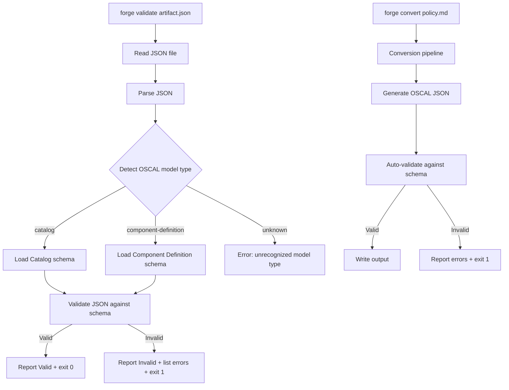
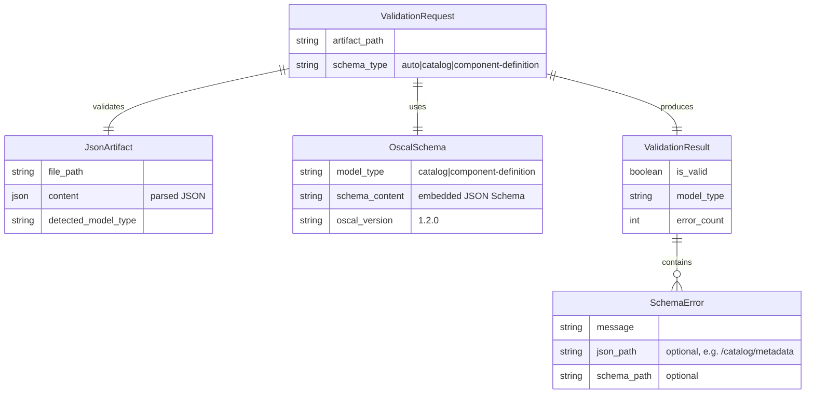
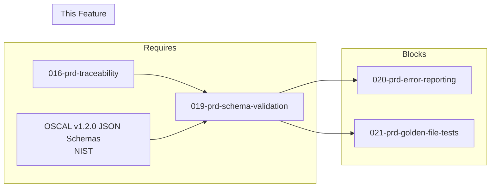

# 019-prd-schema-validation

> **Document Type:** Product Requirements Document
> **Audience:** LLM agents, human reviewers
> **Status:** Draft
> **Last Updated:** 2026-02-10 <!-- @auto -->
> **Owner:** Brian Luby <!-- @human-required -->

**Feature Branch**: `019-schema-validation`
**Created**: 2026-02-10
**Status**: Draft
**Input**: Derived from FORGE Product Roadmap WI-19

---

## Review Tier Legend

| Marker | Tier | Speckit Behavior |
|--------|------|------------------|
| 🔴 `@human-required` | Human Generated | Prompt human to author; blocks until complete |
| 🟡 `@human-review` | LLM + Human Review | LLM drafts → prompt human to confirm/edit; blocks until confirmed |
| 🟢 `@llm-autonomous` | LLM Autonomous | LLM completes; no prompt; logged for audit |
| ⚪ `@auto` | Auto-generated | System fills (timestamps, links); no prompt |

---

## Document Completion Order

> ⚠️ **For LLM Agents:** Complete sections in this order. Do not fill downstream sections until upstream human-required inputs exist.

1. **Context** (Background, Scope) → requires human input first
2. **Problem Statement & User Scenarios** → requires human input
3. **Requirements** (Must/Should/Could/Won't) → requires human input
4. **Technical Constraints** → human review
5. **Diagrams, Data Model, Interface** → LLM can draft after above exist
6. **Acceptance Criteria** → derived from requirements
7. **Everything else** → can proceed

---

## Context

### Background 🔴 `@human-required`
This PRD covers **WI-19: Schema Validation — Integration** from the FORGE Product Roadmap (Sprint S-19, Jul 6–10 2026, Theme T-3: Validation & Quality, Milestone MS-4). After the end-to-end Catalog and Component Definition pipelines are working (WI-13, WI-18) and traceability is embedded in generated artifacts (WI-16, WI-17), FORGE needs to validate that its generated OSCAL JSON artifacts actually conform to the official OSCAL v1.2.0 JSON schemas published by NIST. Without schema validation, generated output cannot be trusted for downstream use by other OSCAL-compliant tools. This work item integrates the `jsonschema` crate (identified in Spike-2 from the parent PRD), embeds or bundles the OSCAL v1.2.0 JSON schemas, and implements the `forge validate <artifact.json>` subcommand. It also adds auto-validation during `forge convert` so that invalid output fails the pipeline rather than being silently emitted.

### Scope Boundaries 🟡 `@human-review`

**In Scope:**
- Downloading and embedding (or bundling) OSCAL v1.2.0 JSON schemas for Catalog, Component Definition, and common types
- Integrating the `jsonschema` crate for JSON Schema validation
- Implementing the `forge validate <artifact.json>` subcommand that reads a JSON file and validates it against the appropriate OSCAL schema
- Auto-detecting the OSCAL model type (Catalog, Component Definition) from the JSON structure to select the correct schema
- Validating generated Catalog artifacts against the OSCAL Catalog JSON schema
- Validating generated Component Definition artifacts against the OSCAL Component Definition JSON schema
- Adding auto-validation as a pipeline step in `forge convert` (fail on invalid output)
- Reporting basic validation results: Valid/Invalid with a list of schema errors

**Out of Scope:**
- Actionable error reporting with field locations and suggested fixes — deferred to WI-20 (020-prd-schema-validation-error-reporting)
- Semantic validation beyond JSON schema (orphaned links, missing references) — deferred to WI-20
- Golden-file test suite — deferred to WI-21 (021-prd-golden-file-tests)
- XML or YAML schema validation — deferred to WI-26/WI-27 (Phase 2 output format expansion)
- Profile schema validation — deferred to WI-32 (Profile validation & testing)

### Glossary 🟡 `@human-review`

| Term | Definition |
|------|------------|
| JSON Schema | A vocabulary for annotating and validating JSON documents, used by NIST to define OSCAL structure constraints |
| OSCAL v1.2.0 JSON Schema | The official JSON Schema files published by NIST defining the structure of each OSCAL model (Catalog, Profile, Component Definition, etc.) |
| jsonschema | A Rust crate for validating JSON documents against JSON Schema specifications |
| Schema Validation | The process of checking a JSON document against a JSON Schema to verify structural conformance |
| Auto-validation | Automatic schema validation performed at the end of the `forge convert` pipeline before output |
| Model Type Detection | Determining which OSCAL model (Catalog, Component Definition, etc.) a JSON artifact represents, to select the correct schema |

### Related Documents ⚪ `@auto`

| Document | Link | Relationship |
|----------|------|--------------|
| Parent PRD | docs/FORGE_PRD.md | Parent requirement M-6, AC-6, US-3 |
| Product Roadmap | docs/FORGE_PRODUCT_ROADMAP.md | Sprint S-19 context |
| Product Vision | docs/FORGE_PRODUCT_VISION.md | Strategic goal G-1 |
| Constitution | .specify/memory/constitution.md | Technical constraints, quality gates, dependency policy |
| Depends On | docs/PRD/001-prd-project-scaffolding.md | CLI framework and validate subcommand stub |
| Spike-2 Reference | docs/FORGE_PRD.md (Spike Tasks) | jsonschema crate evaluation against OSCAL schemas |

---

## Problem Statement 🔴 `@human-required`

FORGE generates OSCAL JSON artifacts (Catalogs and Component Definitions) through its conversion pipeline, but currently has no mechanism to verify that the generated output conforms to the official OSCAL v1.2.0 JSON schemas published by NIST. Without validation, users cannot trust that FORGE's output will be accepted by other OSCAL-compliant tools (oscal-cli, GRC platforms, compliance automation systems). A structurally invalid artifact that silently passes through the pipeline would undermine FORGE's core value proposition of producing correct, interoperable OSCAL output. Schema validation must be both a standalone verification command (`forge validate`) and an automatic quality gate in the conversion pipeline (`forge convert` must fail rather than emit invalid output).

---

## User Scenarios & Testing 🔴 `@human-required`

### User Story 1 — Validate a Generated OSCAL Artifact (Priority: P1)

A compliance engineer has generated an OSCAL Catalog JSON using `forge convert` and wants to independently verify it conforms to the OSCAL v1.2.0 schema before sharing it with other tools.

> As a compliance engineer, I want to validate a generated OSCAL JSON artifact against the official schema so that I can trust it is interoperable with other OSCAL-compliant tools.

**Why this priority**: This is the primary user-facing capability of this work item and directly satisfies parent PRD requirement M-6 and user story US-3. Without validation, generated output cannot be trusted.

**Independent Test**: Run `forge validate catalog.json` on a schema-valid Catalog and verify it reports "Valid". Run it on an artifact with a missing required field and verify it reports "Invalid" with error details.

**Acceptance Scenarios**:
1. **Given** a schema-valid OSCAL Catalog JSON generated by `forge convert`, **When** running `forge validate catalog.json`, **Then** the tool reports "Valid" with a zero exit code.
2. **Given** an OSCAL JSON artifact with a missing required field (e.g., no `uuid` in metadata), **When** running `forge validate artifact.json`, **Then** the tool reports "Invalid" with at least one schema error describing the violation.
3. **Given** an OSCAL Component Definition JSON, **When** running `forge validate component.json`, **Then** the tool auto-detects the model type and validates against the correct schema.

---

### User Story 2 — Auto-Validation During Conversion (Priority: P1)

A compliance engineer runs `forge convert` and expects the output to be automatically validated before being written, preventing invalid artifacts from being produced.

> As a compliance engineer, I want `forge convert` to automatically validate output against the OSCAL schema so that I never receive invalid OSCAL artifacts without explicit warning.

**Why this priority**: Silent emission of invalid output is the worst failure mode for a conversion tool. Auto-validation closes this gap and ensures every artifact that exits the pipeline is schema-conformant.

**Independent Test**: Introduce a deliberate schema violation in the conversion pipeline (e.g., omit a required metadata field), run `forge convert`, and verify it fails with a validation error rather than producing output.

**Acceptance Scenarios**:
1. **Given** a Markdown policy document, **When** running `forge convert policy.md --strategy catalog --format json`, **Then** the generated Catalog JSON is automatically validated against the OSCAL Catalog schema before being output.
2. **Given** a conversion that would produce schema-invalid output, **When** running `forge convert`, **Then** the command fails with a non-zero exit code and reports the schema validation errors.
3. **Given** a successful conversion with auto-validation, **When** inspecting the exit code, **Then** it is zero and the output artifact is schema-valid.

---

### User Story 3 — Validate External OSCAL Artifacts (Priority: P2)

A compliance engineer has an OSCAL JSON artifact from an external source and wants to use FORGE to check its schema conformance.

> As a compliance engineer, I want to validate any OSCAL JSON artifact (not just FORGE-generated ones) so that I can use FORGE as a general-purpose OSCAL validation tool.

**Why this priority**: Extends the utility of `forge validate` beyond FORGE-generated artifacts, increasing adoption value, but is not strictly required for the core conversion pipeline.

**Independent Test**: Download a NIST-published OSCAL example Catalog JSON, run `forge validate` on it, and verify it reports "Valid".

**Acceptance Scenarios**:
1. **Given** a NIST-published OSCAL Catalog example JSON, **When** running `forge validate nist-example.json`, **Then** the tool reports "Valid".
2. **Given** a hand-crafted JSON file that is not valid OSCAL, **When** running `forge validate bad.json`, **Then** the tool reports "Invalid" with schema errors.

---

## Assumptions & Risks 🟡 `@human-review`

### Assumptions
- [A-1] OSCAL v1.2.0 JSON schemas are publicly available from the NIST OSCAL GitHub repository and are stable.
- [A-2] The `jsonschema` crate supports the JSON Schema draft version used by OSCAL v1.2.0 schemas (Draft 2020-12 or Draft-07).
- [A-3] Schemas can be embedded in the FORGE binary at compile time using `include_str!` or `include_bytes!`, keeping the tool fully offline-capable.
- [A-4] The OSCAL JSON structure contains a top-level key (`catalog`, `component-definition`, etc.) that can be used for model type detection.
- [A-5] Spike-2 (jsonschema crate evaluation) has been completed and confirmed the crate's suitability.

### Risks
| ID | Risk | Likelihood | Impact | Mitigation |
|----|------|------------|--------|------------|
| R-1 | `jsonschema` crate does not fully support OSCAL v1.2.0 schema features (complex `$ref` resolution, conditional schemas) | Med | Med | This is roadmap risk RR-5. Test against NIST published example files during implementation. If incompatible, fall back to shelling out to `oscal-cli` for validation. |
| R-2 | Embedded schemas increase binary size significantly | Low | Low | OSCAL JSON schemas are typically <500KB total. Compress with `include_bytes!` + runtime decompression if needed. |
| R-3 | OSCAL v1.2.0 schemas have errata or undocumented constraints | Low | Med | This is roadmap risk RR-1. Pin to a specific schema release commit. Report discrepancies upstream to NIST. |
| R-4 | Model type auto-detection fails on edge cases (e.g., malformed or partial JSON) | Low | Low | Provide a `--schema-type` override flag for manual type selection. |

---

## Feature Overview

### Flow Diagram 🟡 `@human-review`



### State Diagram (if applicable) 🟡 `@human-review`
N/A — No state transitions in this work item. Validation is a single-pass, stateless operation.

---

## Requirements

### Must Have (M) — MVP, launch blockers 🔴 `@human-required`
- [ ] **M-1:** The `forge validate <artifact.json>` subcommand shall read a JSON file from disk and validate it against the appropriate OSCAL v1.2.0 JSON schema. *(Traces to: Parent PRD M-6, AC-6)*
- [ ] **M-2:** OSCAL v1.2.0 JSON schemas for Catalog and Component Definition shall be embedded in the FORGE binary (no network dependency for validation). *(Traces to: Parent PRD M-6, technical constraint "no network dependency")*
- [ ] **M-3:** The validator shall auto-detect the OSCAL model type from the top-level JSON key to select the correct schema. *(Traces to: Parent PRD M-6)*
- [ ] **M-4:** When validation succeeds, `forge validate` shall report "Valid" and exit with code 0. *(Traces to: Parent PRD AC-6)*
- [ ] **M-5:** When validation fails, `forge validate` shall report "Invalid" with a list of schema errors and exit with a non-zero code. *(Traces to: Parent PRD M-6, AC-6)*
- [ ] **M-6:** The `forge convert` command shall auto-validate generated OSCAL JSON against the schema before writing output, failing with a non-zero exit code if validation fails. *(Traces to: Parent PRD M-6)*
- [ ] **M-7:** The `jsonschema` crate (or equivalent Rust JSON Schema validation library) shall be integrated for schema validation. *(Traces to: Spike-2 result)*

### Should Have (S) — High value, not blocking 🔴 `@human-required`
- [ ] **S-1:** `forge validate` shall accept a `--schema-type <catalog|component-definition>` flag to override auto-detection when the model type cannot be determined. *(Traces to: Risk R-4 mitigation)*
- [ ] **S-2:** Validation errors shall include the JSON path of the failing element (e.g., `/catalog/metadata/title`) for basic error localization. *(Traces to: Parent PRD M-6 "actionable errors")*

### Could Have (C) — Nice to have, if time permits 🟡 `@human-review`
- [ ] **C-1:** `forge validate` could support validating multiple files in a single invocation (e.g., `forge validate catalog.json component.json`).
- [ ] **C-2:** `forge validate` could report a summary count of errors when validation fails (e.g., "3 schema violations found").

### Won't Have (W) — Explicitly deferred 🟡 `@human-review`
- [ ] **W-1:** Actionable error reporting with suggested fixes — *Reason: Deferred to WI-20 (error reporting enhancement)*
- [ ] **W-2:** Semantic validation beyond JSON schema (orphaned links, missing cross-references) — *Reason: Deferred to WI-20*
- [ ] **W-3:** XML or YAML schema validation — *Reason: Deferred to WI-26/WI-27 (Phase 2 output format expansion)*
- [ ] **W-4:** Profile or SSP schema validation — *Reason: Profile validation deferred to WI-32; SSP to Phase 3*
- [ ] **W-5:** Custom schema override (user-provided schema file) — *Reason: Not needed for MVP; consider if demand arises*

---

## Technical Constraints 🟡 `@human-review`

- **Language/Framework:** Rust (latest stable), Cargo build system
- **Validation Library:** `jsonschema` crate (per Spike-2 evaluation from parent PRD); must be at latest stable version per constitution principle XI
- **JSON Parsing:** `serde_json` for reading and parsing JSON artifacts
- **Schema Embedding:** OSCAL v1.2.0 JSON schemas embedded via `include_str!` or `include_bytes!` at compile time; no runtime network dependency
- **OSCAL Schema Source:** Official NIST OSCAL releases on GitHub (https://github.com/usnistgov/OSCAL/releases)
- **CLI Framework:** `clap` 4.x (validate subcommand already stubbed from WI-1)
- **Error Handling:** `thiserror` for validation error types (per constitution principle VIII)
- **Linting:** `cargo clippy -- -D warnings` must pass (per constitution quality gates)
- **Formatting:** `cargo fmt --all` must produce no changes (per constitution quality gates)
- **Testing:** TDD mandatory; unit tests for schema loading, model type detection, and validation pass/fail paths (per constitution principle IV)
- **No Network Dependency:** Validation must work fully offline; schemas are compile-time embedded
- **Performance:** Validation of a typical Catalog (100 controls) should complete in under 2 seconds

---

## Data Model (if applicable) 🟡 `@human-review`



---

## Interface Contract (if applicable) 🟡 `@human-review`

```rust
// CLI Interface

// forge validate <artifact.json> [--schema-type <catalog|component-definition>]
// Exit code 0 = valid, non-zero = invalid or error

// forge convert ... (auto-validates before output)

// --- Library API ---

/// Supported OSCAL model types for schema validation
pub enum OscalModelType {
    Catalog,
    ComponentDefinition,
}

/// Result of schema validation
pub struct ValidationResult {
    pub is_valid: bool,
    pub model_type: OscalModelType,
    pub errors: Vec<SchemaError>,
}

/// A single schema validation error
pub struct SchemaError {
    pub message: String,
    /// JSON pointer path to the failing element (e.g., "/catalog/metadata/title")
    pub instance_path: Option<String>,
    /// JSON pointer path within the schema that was violated
    pub schema_path: Option<String>,
}

/// Error types for the validation module
#[derive(Debug, thiserror::Error)]
pub enum ValidateError {
    #[error("Failed to read artifact file: {path}")]
    FileRead {
        path: PathBuf,
        #[source]
        source: std::io::Error,
    },

    #[error("Failed to parse JSON: {0}")]
    JsonParse(#[from] serde_json::Error),

    #[error("Unable to detect OSCAL model type from JSON structure")]
    UnknownModelType,

    #[error("Schema compilation failed for {model_type}: {message}")]
    SchemaCompilation {
        model_type: String,
        message: String,
    },
}

/// Detect the OSCAL model type from a parsed JSON value
pub fn detect_model_type(json: &serde_json::Value) -> Result<OscalModelType, ValidateError>;

/// Validate a JSON value against the OSCAL schema for the given model type
pub fn validate_artifact(
    json: &serde_json::Value,
    model_type: OscalModelType,
) -> Result<ValidationResult, ValidateError>;

/// Load the embedded OSCAL JSON schema for a given model type
pub fn load_schema(model_type: OscalModelType) -> Result<serde_json::Value, ValidateError>;
```

---

## Evaluation Criteria 🟡 `@human-review`

| Criterion | Weight | Metric | Target | Notes |
|-----------|--------|--------|--------|-------|
| Schema Validation Correctness | Critical | NIST example files validate as "Valid" | 100% | Must pass all published NIST OSCAL examples |
| Invalid Detection | Critical | Known-invalid artifacts reported as "Invalid" | 100% | Must detect missing required fields, wrong types |
| Auto-validation in convert | Critical | `forge convert` fails on invalid output | Always | No silent emission of invalid artifacts |
| Model Type Detection | High | Correct schema selected for Catalog vs Component Definition | 100% | Auto-detection from top-level JSON key |
| Offline Operation | High | No network calls during validation | Always | Schemas embedded at compile time |

---

## Tool/Approach Candidates 🟡 `@human-review`

| Option | License | Pros | Cons | Spike Result |
|--------|---------|------|------|--------------|
| `jsonschema` crate | MIT | Rust-native, supports Draft 2020-12 and Draft-07, active maintenance, good performance | Complex `$ref` resolution may have edge cases with OSCAL schemas | Spike-2 candidate; test against OSCAL schemas |
| Shell out to `oscal-cli` | N/A | Authoritative NIST validation, handles all OSCAL model types | External dependency, requires Java runtime, slower, breaks offline requirement | Fallback option if `jsonschema` crate fails |
| `valico` crate | MIT | Alternative Rust JSON Schema validator | Less actively maintained than `jsonschema`, fewer features | Spike-2 alternative |

### Selected Approach 🔴 `@human-required`
> **Decision:** Use `jsonschema` crate for Rust-native JSON Schema validation with embedded OSCAL v1.2.0 schemas
> **Rationale:** Rust-native validation keeps FORGE self-contained and offline-capable. The `jsonschema` crate is the most actively maintained Rust JSON Schema library and supports the draft versions used by OSCAL. If Spike-2 reveals incompatibilities, fall back to oscal-cli integration (risk RR-5 mitigation).

---

## Acceptance Criteria 🟡 `@human-review`

| AC ID | Requirement | User Story | Given | When | Then |
|-------|-------------|------------|-------|------|------|
| AC-1 | M-1, M-4 | US-1 | A schema-valid OSCAL Catalog JSON | Running `forge validate catalog.json` | Reports "Valid" and exits with code 0 |
| AC-2 | M-1, M-5 | US-1 | An OSCAL JSON artifact with a missing required field | Running `forge validate invalid.json` | Reports "Invalid" with at least one error and exits with non-zero code |
| AC-3 | M-2 | US-1 | The FORGE binary running on a machine with no network access | Running `forge validate catalog.json` | Validation completes successfully (schemas are embedded) |
| AC-4 | M-3 | US-1 | An OSCAL Component Definition JSON | Running `forge validate component.json` | Auto-detects "component-definition" model type and validates against the correct schema |
| AC-5 | M-6 | US-2 | A Markdown policy document | Running `forge convert policy.md --strategy catalog --format json` | Output is auto-validated; if schema-valid, output is written; if invalid, command fails |
| AC-6 | M-7 | US-1 | The FORGE binary | Inspecting dependencies | `jsonschema` crate (or equivalent) is integrated |
| AC-7 | S-2 | US-1 | An OSCAL JSON with a type error in a nested field | Running `forge validate artifact.json` | Error output includes the JSON path of the failing element |
| AC-8 | M-1 | US-3 | A NIST-published OSCAL Catalog example JSON | Running `forge validate nist-example.json` | Reports "Valid" |

### Edge Cases 🟢 `@llm-autonomous`
- [ ] **EC-1:** (M-1) When the input file does not exist, then `forge validate` exits with a descriptive file-not-found error and non-zero exit code.
- [ ] **EC-2:** (M-1) When the input file is not valid JSON (e.g., truncated, binary), then `forge validate` exits with a JSON parse error and non-zero exit code.
- [ ] **EC-3:** (M-3) When the JSON file has no recognizable OSCAL top-level key, then `forge validate` exits with an "unrecognized model type" error suggesting the `--schema-type` flag.
- [ ] **EC-4:** (M-5) When the artifact has multiple schema violations, then all errors are reported (not just the first).
- [ ] **EC-5:** (M-1) When the input file is empty (0 bytes), then `forge validate` exits with a descriptive error.
- [ ] **EC-6:** (M-6) When `forge convert` produces output that is valid, then no validation errors are shown and the output is written normally.
- [ ] **EC-7:** (S-1) When `--schema-type catalog` is provided but the JSON contains a component-definition, then validation proceeds using the catalog schema (user override is respected) and reports errors accordingly.

---

## Dependencies 🟡 `@human-review`



- **Requires:** [016-prd-traceability](docs/PRD/016-prd-traceability.md) (WI-16, internal dependency D-5), OSCAL v1.2.0 JSON schemas (external dependency D-8)
- **Blocks:** [020-prd-schema-validation-error-reporting](docs/PRD/020-prd-schema-validation-error-reporting.md) (WI-20), [021-prd-golden-file-tests](docs/PRD/021-prd-golden-file-tests.md) (WI-21)
- **External:** OSCAL v1.2.0 JSON schemas from NIST GitHub releases (available, stable — dependency D-8 in roadmap)

---

## Security Considerations 🟡 `@human-review`

| Aspect | Assessment | Notes |
|--------|------------|-------|
| Internet Exposure | No | Schemas are embedded at compile time; no network calls during validation |
| Sensitive Data | Yes | OSCAL artifacts being validated may contain sensitive policy requirement text |
| Authentication Required | No | Local CLI tool |
| Security Review Required | Yes | Input parsing of user-provided JSON files is an attack surface; malformed JSON must not cause panics or excessive memory consumption. File path arguments must be validated per constitution principle VII. |

Additional security notes:
- JSON parsing via `serde_json` is memory-safe but should enforce reasonable size limits on input files to prevent denial-of-service via extremely large inputs.
- Embedded schemas are trusted (compiled into the binary from a known NIST source) and do not require runtime integrity checking.
- File paths provided to `forge validate` should be canonicalized per constitution principle VII (Input Validation).

---

## Implementation Guidance 🟢 `@llm-autonomous`

### Suggested Approach
Start by downloading the OSCAL v1.2.0 JSON schemas from the NIST OSCAL GitHub releases (specifically `oscal_catalog_schema.json` and `oscal_component_schema.json`). Place them in a `schemas/` directory within the project and embed them at compile time using `include_str!`. Implement the `validate` module with three core functions: `detect_model_type` (inspect top-level JSON keys), `load_schema` (return the embedded schema for a model type), and `validate_artifact` (compile the schema and validate the JSON). Wire the `forge validate` subcommand (already stubbed from WI-1) to call these functions. For auto-validation in `forge convert`, call `validate_artifact` on the generated JSON before serializing to output. Use `thiserror` for error types and ensure all error paths produce descriptive messages with non-zero exit codes.

### Anti-patterns to Avoid
- Downloading schemas at runtime — this breaks the offline requirement and adds a network dependency
- Validating only in `forge validate` but not in `forge convert` — silent emission of invalid artifacts is the worst failure mode
- Catching only the first schema error — users need all errors at once to fix them efficiently
- Hardcoding schema file paths instead of embedding — creates deployment and distribution issues
- Using `.unwrap()` on JSON parsing or schema compilation in production code — use proper error handling

### Reference Examples
- NIST OSCAL JSON schemas: https://github.com/usnistgov/OSCAL/releases (look for `oscal_catalog_schema.json`, `oscal_component-definition_schema.json`)
- `jsonschema` crate documentation: https://docs.rs/jsonschema/latest/jsonschema/
- NIST OSCAL example files (for testing validation): https://github.com/usnistgov/oscal-content

---

## Spike Tasks 🟡 `@human-review`

- [ ] **Spike-2 (from parent PRD):** Evaluate the `jsonschema` Rust crate against the OSCAL v1.2.0 JSON schemas. Completion criteria: confirm successful validation of NIST's published OSCAL Catalog and Component Definition example files; document any unsupported schema features or workarounds needed. This spike should have been completed prior to Sprint 19; if not, it must be completed as the first task of Sprint 19.

---

## Success Metrics 🔴 `@human-required`

| Metric | Baseline | Target | Measurement Method |
|--------|----------|--------|-------------------|
| NIST example validation | N/A | 100% of NIST-published OSCAL examples report "Valid" | `forge validate` on each example file |
| FORGE output validation | N/A | 100% of `forge convert` output passes schema validation | Auto-validation in pipeline |
| Invalid artifact detection | N/A | 100% of known-invalid artifacts report "Invalid" | Unit tests with deliberately malformed artifacts |

### Technical Verification 🟢 `@llm-autonomous`
| Metric | Target | Verification Method |
|--------|--------|---------------------|
| Test coverage for validation module | >90% | `cargo test` + coverage tool |
| No clippy warnings | 0 | `cargo clippy -- -D warnings` |
| No formatting violations | 0 | `cargo fmt --check` |
| Validation performance (100-control Catalog) | <2 seconds | Benchmark test |
| Binary size increase from embedded schemas | <1 MB | `ls -la` on release binary before/after |

---

## Definition of Ready 🔴 `@human-required`

### Readiness Checklist
- [x] Problem statement reviewed and validated by stakeholder
- [x] All Must Have requirements have acceptance criteria
- [x] Technical constraints are explicit and agreed
- [x] Dependencies identified and owners confirmed
- [x] Security review completed (or N/A documented with justification)
- [ ] Spike-2 completed and jsonschema crate confirmed suitable
- [x] No open questions blocking implementation

### Sign-off
| Role | Name | Date | Decision |
|------|------|------|----------|
| Product Owner | Brian Luby | YYYY-MM-DD | [Ready / Not Ready] |

---

## Changelog ⚪ `@auto`

| Version | Date | Author | Changes |
|---------|------|--------|---------|
| 0.1 | 2026-02-10 | LLM (Claude) | Initial draft derived from FORGE Product Roadmap WI-19 |

---

## Decision Log 🟡 `@human-review`

| Date | Decision | Rationale | Alternatives Considered |
|------|----------|-----------|------------------------|
| 2026-02-10 | Embed OSCAL schemas in binary at compile time | Ensures offline operation, simplifies distribution, eliminates runtime dependency on schema file locations | Bundle schemas as separate files alongside binary (adds deployment complexity); download at runtime (breaks offline requirement) |
| 2026-02-10 | Auto-detect OSCAL model type from top-level JSON key | Simplifies user experience — no need to specify which schema to use; OSCAL JSON always has a distinguishing top-level key (`catalog`, `component-definition`, etc.) | Require explicit `--schema-type` flag (worse UX); infer from filename convention (fragile) |
| 2026-02-10 | Add auto-validation to `forge convert` pipeline | Prevents the worst failure mode (silent emission of invalid artifacts); aligns with product principle P-1 (Correctness over convenience) | Validate only on explicit `forge validate` (risks users skipping validation); warn but still output (undermines trust) |
| 2026-02-10 | Use `jsonschema` crate over oscal-cli shelling | Rust-native keeps FORGE self-contained; no Java runtime dependency; faster validation; works offline | Shell out to oscal-cli (external dependency, slower, requires Java — reserved as fallback per RR-5) |

---

## Open Questions 🟡 `@human-review`

No open questions for this work item. Spike-2 result (jsonschema crate suitability) is a prerequisite tracked in the Definition of Ready checklist.

---

## Review Checklist 🟢 `@llm-autonomous`

Before marking as Approved:
- [x] All requirements have unique IDs (M-1 through M-7, S-1 through S-2, C-1 through C-2, W-1 through W-5)
- [x] All Must Have requirements have linked acceptance criteria
- [x] User stories are prioritized and independently testable
- [x] Acceptance criteria reference both requirement IDs and user stories
- [x] Glossary terms are used consistently throughout
- [x] Diagrams use terminology from Glossary
- [x] Security considerations documented
- [x] Definition of Ready checklist is complete (pending Spike-2)
- [x] No open questions blocking implementation
