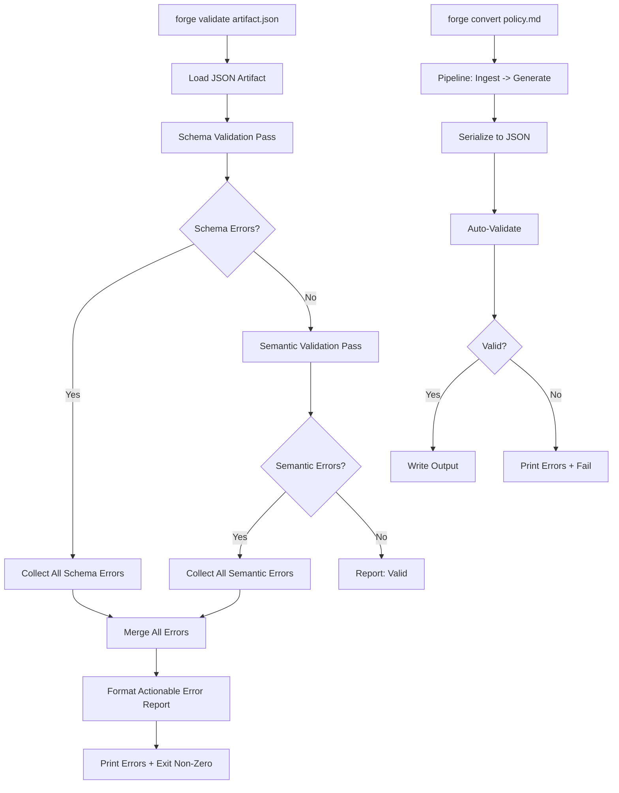
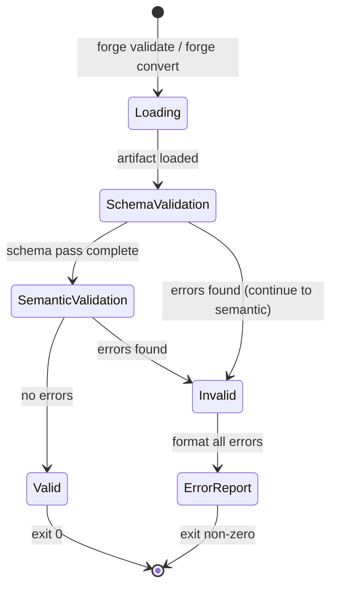
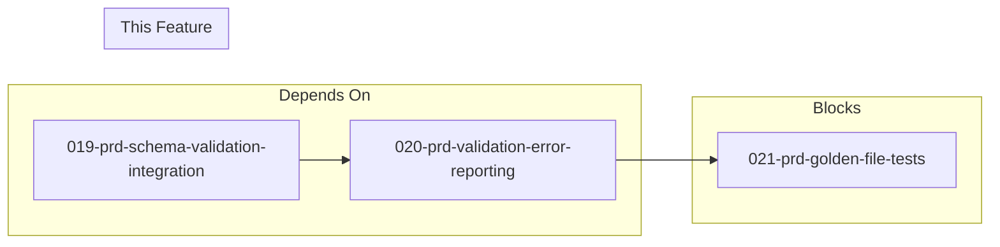

# 020-prd-validation-error-reporting

> **Document Type:** Product Requirements Document
> **Audience:** LLM agents, human reviewers
> **Status:** Draft
> **Last Updated:** 2026-02-10 <!-- @auto -->
> **Owner:** Brian Luby <!-- @human-required -->

**Feature Branch**: `020-validation-error-reporting`
**Created**: 2026-02-10
**Status**: Draft
**Input**: Derived from FORGE Product Roadmap WI-20

---

## Review Tier Legend

| Marker | Tier | Speckit Behavior |
|--------|------|------------------|
| 🔴 `@human-required` | Human Generated | Prompt human to author; blocks until complete |
| 🟡 `@human-review` | LLM + Human Review | LLM drafts → prompt human to confirm/edit; blocks until confirmed |
| 🟢 `@llm-autonomous` | LLM Autonomous | LLM completes; no prompt; logged for audit |
| ⚪ `@auto` | Auto-generated | System fills (timestamps, links); no prompt |

---

## Document Completion Order

> ⚠️ **For LLM Agents:** Complete sections in this order. Do not fill downstream sections until upstream human-required inputs exist.

1. **Context** (Background, Scope) → requires human input first
2. **Problem Statement & User Scenarios** → requires human input
3. **Requirements** (Must/Should/Could/Won't) → requires human input
4. **Technical Constraints** → human review
5. **Diagrams, Data Model, Interface** → LLM can draft after above exist
6. **Acceptance Criteria** → derived from requirements
7. **Everything else** → can proceed

---

## Context

### Background 🔴 `@human-required`
This PRD covers **WI-20: Schema Validation — Error Reporting** from the FORGE Product Roadmap (Sprint S-20, Jul 13–17 2026, Theme T-3: Validation & Quality, Milestone MS-4). WI-19 (Schema Validation — Integration) establishes the basic `forge validate` subcommand and integrates the OSCAL v1.2.0 JSON schemas with the `jsonschema` crate. However, basic schema validation only reports whether an artifact is valid or invalid, often stopping at the first error and providing cryptic schema-level messages that lack context for users.

WI-20 builds on WI-19 to make validation errors actionable. Error messages must include the JSON path to the offending field, the expected type or constraint, and the actual value found. All errors must be reported in a single pass (not just the first one). Beyond schema errors, semantic validation must detect orphaned links (references to non-existent back matter resources) and missing required cross-references. Finally, `forge convert` must auto-validate its output and fail with actionable errors if the generated artifact is invalid — ensuring invalid OSCAL never silently reaches the user.

This work item directly implements Parent PRD requirement M-6 ("The CLI shall validate generated OSCAL artifacts against OSCAL v1.2.0 JSON schemas and report actionable errors"), satisfies AC-6 (the acceptance criterion for validation), and addresses EC-10 (reporting all errors, not just the first one).

### Scope Boundaries 🟡 `@human-review`

**In Scope:**
- Enhancing schema validation error messages with JSON path, expected type, and actual value
- Collecting and reporting all validation errors (not stopping at the first)
- Implementing semantic validation: orphaned back matter links, missing required references
- Auto-validating generated artifacts in `forge convert` before output (fail on invalid)
- Structured error output format (human-readable by default, machine-parseable with `--format json`)
- Non-zero exit codes when validation errors are present

**Out of Scope:**
- Initial schema validation integration (basic `forge validate` subcommand) — completed in WI-19 (019-prd-schema-validation-integration)
- Golden-file test infrastructure — deferred to WI-21 (021-prd-golden-file-tests)
- XML or YAML schema validation — deferred to WI-26+ (Phase 2)
- Profile validation — deferred to WI-32 (Phase 2)
- Custom or organization-specific validation rules — deferred to future work
- Auto-fix or auto-correction of validation errors — deferred to future work

### Glossary 🟡 `@human-review`

| Term | Definition |
|------|------------|
| JSON Path | A dot-separated or bracket-notation path identifying a specific location within a JSON document (e.g., `$.catalog.metadata.title`) |
| Schema Error | A validation failure caused by the artifact not conforming to the OSCAL v1.2.0 JSON schema (wrong type, missing required field, invalid enum value) |
| Semantic Error | A validation failure caused by logical inconsistencies within a structurally valid artifact (orphaned links, missing references, dangling UUIDs) |
| Orphaned Link | A `link` or `href` element in the artifact body that references a back matter resource UUID that does not exist in the artifact's `back-matter.resources[]` |
| Missing Reference | A required cross-reference (e.g., `control-id` in an `implemented-requirement`) that points to a non-existent control or element |
| Actionable Error | An error message that provides sufficient context for the user to locate and fix the problem: field path, expected constraint, actual value |
| Auto-validation | Automatic schema and semantic validation performed by `forge convert` on generated artifacts before writing output |

### Related Documents ⚪ `@auto`

| Document | Link | Relationship |
|----------|------|--------------|
| Parent PRD | docs/FORGE_PRD.md | Parent requirements M-6, AC-6, EC-10 |
| Product Roadmap | docs/FORGE_PRODUCT_ROADMAP.md | Sprint S-20 context |
| Product Vision | docs/FORGE_PRODUCT_VISION.md | Strategic goal G-1, Product principle P-1 (Correctness over convenience) |
| Constitution | .specify/memory/constitution.md | Technical constraints and quality gates |
| WI-19 PRD | docs/PRD/019-prd-schema-validation-integration.md | Dependency: provides base `forge validate` and schema integration |

---

## Problem Statement 🔴 `@human-required`

After WI-19, FORGE has basic schema validation capability — it can report whether an OSCAL artifact is valid or invalid. However, the default error messages from JSON Schema validation libraries are technical, reference schema internals rather than user-facing field names, and typically stop at the first error encountered. When a compliance engineer runs `forge validate` and gets a single cryptic error like "instance failed to match all required schemas," they have no way to locate or fix the problem.

Furthermore, schema validation alone cannot catch semantic errors: an artifact can be schema-valid but contain orphaned back matter links (references to resources that do not exist), missing control-id references in implemented-requirements, or dangling UUID cross-references. These semantic issues produce artifacts that are technically schema-compliant but practically broken when consumed by downstream OSCAL tools.

Without actionable error reporting, users cannot trust or debug FORGE's output. Without auto-validation in `forge convert`, invalid artifacts can silently reach users. This directly violates product principle P-1 (Correctness over convenience) and undermines the core value proposition of FORGE as a tool that produces validated, trustworthy OSCAL.

---

## User Scenarios & Testing 🔴 `@human-required`

### User Story 1 — Actionable Schema Error Messages (Priority: P1)

A compliance engineer validates a generated OSCAL artifact and receives errors that tell them exactly what is wrong and where.

> As a compliance engineer, I want validation errors to include the JSON path, expected type, and actual value so that I can quickly locate and fix problems in generated OSCAL artifacts.

**Why this priority**: Without actionable errors, the validation feature from WI-19 is effectively unusable — users know something is wrong but cannot determine what or where.

**Independent Test**: Run `forge validate` against an artifact with a known schema violation and verify the error message includes the field path, expected constraint, and actual value.

**Acceptance Scenarios**:
1. **Given** an OSCAL Catalog JSON missing the required `uuid` field in metadata, **When** running `forge validate catalog.json`, **Then** the error message includes the path `$.catalog.metadata.uuid`, states the field is required, and indicates it is missing.
2. **Given** an OSCAL artifact with a `last-modified` field containing an invalid date format, **When** validating, **Then** the error message includes the path to the field, the expected format (date-time), and the actual value provided.

---

### User Story 2 — Report All Errors (Priority: P1)

A compliance engineer wants to see all validation problems at once rather than fixing them one at a time.

> As a compliance engineer, I want all validation errors reported in a single pass so that I can fix all problems at once rather than iterating through fix-validate cycles.

**Why this priority**: Reporting only the first error forces users into tedious loops of fix-one-revalidate. This directly implements EC-10 from the parent PRD.

**Independent Test**: Run `forge validate` against an artifact with multiple schema violations and verify all errors are reported.

**Acceptance Scenarios**:
1. **Given** an OSCAL artifact with 3 distinct schema violations (missing field, wrong type, invalid enum value), **When** running `forge validate artifact.json`, **Then** all 3 errors are reported with individual actionable messages.
2. **Given** an artifact with both schema errors and semantic errors, **When** validating, **Then** both categories of errors are reported, clearly labeled by category.

---

### User Story 3 — Semantic Validation (Priority: P1)

A compliance engineer needs validation to catch logical inconsistencies beyond schema compliance.

> As a compliance engineer, I want validation to detect orphaned links and missing references so that generated artifacts are not just schema-valid but semantically correct.

**Why this priority**: Schema-valid but semantically broken artifacts fail silently in downstream tools. Catching these issues at validation time prevents costly debugging later.

**Independent Test**: Create an OSCAL artifact with an orphaned back matter link and verify `forge validate` reports it as a semantic error.

**Acceptance Scenarios**:
1. **Given** an OSCAL Catalog where a control's `link` element references a back matter resource UUID that does not exist in `back-matter.resources[]`, **When** running `forge validate catalog.json`, **Then** a semantic error is reported identifying the orphaned link, the referencing element's path, and the missing resource UUID.
2. **Given** an OSCAL Component Definition where an `implemented-requirement` references a `control-id` that does not exist in the imported catalog/profile, **When** validating, **Then** a semantic warning is reported identifying the unresolvable control-id reference.

---

### User Story 4 — Auto-Validation in forge convert (Priority: P1)

A compliance engineer expects that `forge convert` will never produce invalid output.

> As a compliance engineer, I want `forge convert` to automatically validate its output and fail with errors if the generated artifact is invalid so that I never receive invalid OSCAL without knowing.

**Why this priority**: This enforces product principle P-1 (Correctness over convenience) at the pipeline level. Invalid output must not silently reach users.

**Independent Test**: Introduce a deliberate generation bug that produces invalid OSCAL and verify `forge convert` fails with validation errors rather than writing invalid output.

**Acceptance Scenarios**:
1. **Given** a policy document that triggers a generation edge case producing invalid OSCAL, **When** running `forge convert policy.md --strategy catalog --format json`, **Then** the command fails with a non-zero exit code and prints all validation errors.
2. **Given** a successful conversion producing valid OSCAL, **When** running `forge convert`, **Then** the artifact is written to output and no validation errors are displayed.

---

## Assumptions & Risks 🟡 `@human-review`

### Assumptions
- [A-1] WI-19 has been completed: `forge validate` subcommand exists and OSCAL v1.2.0 JSON schemas are integrated via the `jsonschema` crate.
- [A-2] The `jsonschema` crate supports collecting all validation errors (not just the first) — this is a known feature of the crate's `validate` method returning an iterator of errors.
- [A-3] The `jsonschema` crate provides JSON path information in its error output that can be formatted into user-friendly field locations.
- [A-4] Semantic validation rules (orphaned links, missing references) can be implemented as a second validation pass after schema validation, operating on the parsed JSON structure.

### Risks
| ID | Risk | Likelihood | Impact | Mitigation |
|----|------|------------|--------|------------|
| R-1 | The `jsonschema` crate's error output does not include sufficient path information for user-friendly messages | Low | Med | WI-19 spike (Spike-2) should have confirmed this; if insufficient, implement custom path extraction by walking the schema alongside the document |
| R-2 | Semantic validation rules for orphaned links become complex with nested back matter references | Low | Low | Start with direct link-to-resource UUID matching; defer transitive reference checking to a future work item |
| R-3 | Auto-validation in `forge convert` adds perceptible latency to the conversion pipeline | Low | Low | Validation is already performed on the serialized JSON; the additional cost of collecting all errors vs. stopping at first is minimal |

---

## Feature Overview

### Flow Diagram 🟡 `@human-review`



### State Diagram (if applicable) 🟡 `@human-review`



---

## Requirements

### Must Have (M) — MVP, launch blockers 🔴 `@human-required`
- [ ] **M-1:** Validation error messages shall include the JSON path to the offending field (e.g., `$.catalog.metadata.title`), the expected constraint (type, required, enum values), and the actual value found.
- [ ] **M-2:** The validator shall collect and report all schema validation errors in a single pass, not stopping at the first error.
- [ ] **M-3:** The validator shall perform semantic validation detecting orphaned links — `link` or `href` elements referencing back matter resource UUIDs that do not exist in `back-matter.resources[]`.
- [ ] **M-4:** The validator shall perform semantic validation detecting missing required references — cross-references to non-existent controls, parameters, or other OSCAL elements.
- [ ] **M-5:** `forge convert` shall auto-validate generated artifacts before writing output; if validation fails, the command shall fail with a non-zero exit code and print all errors.
- [ ] **M-6:** Errors shall be clearly categorized as either "schema" or "semantic" in the output.

### Should Have (S) — High value, not blocking 🔴 `@human-required`
- [ ] **S-1:** Error output shall support a `--format json` flag for machine-parseable structured error output (JSON array of error objects with `category`, `path`, `message`, `expected`, `actual` fields).
- [ ] **S-2:** Error messages shall include a human-readable summary line (e.g., "Validation failed: 3 schema errors, 1 semantic error").

### Could Have (C) — Nice to have, if time permits 🟡 `@human-review`
- [ ] **C-1:** Error messages could include a suggestion for fixing the issue where the fix is deterministic (e.g., "missing required field `uuid` — add a UUID v4 value").
- [ ] **C-2:** Error output could support `--format sarif` for integration with code analysis tools.

### Won't Have (W) — Explicitly deferred 🟡 `@human-review`
- [ ] **W-1:** Auto-fix or auto-correction of validation errors — *Reason: Users must understand and approve fixes to maintain auditability; deferred to future work*
- [ ] **W-2:** XML or YAML schema validation — *Reason: Deferred to WI-26+ (Phase 2); JSON-only validation in Phase 1*
- [ ] **W-3:** Custom or organization-specific validation rules — *Reason: Out of scope for initial validation; OSCAL schema and built-in semantic rules only*
- [ ] **W-4:** Validation of external references (fetching remote profiles or catalogs to verify control-id references) — *Reason: Requires network access; violates offline operation constraint*

---

## Technical Constraints 🟡 `@human-review`

- **Language/Framework:** Rust (latest stable), Cargo build system
- **Validation Library:** `jsonschema` crate (selected in WI-19 / Spike-2) — must use its iterator-based error collection API
- **OSCAL Schema Version:** OSCAL v1.2.0 JSON schemas (bundled or embedded per WI-19)
- **Error Handling:** `thiserror` for library error types (per constitution principle VIII); validation errors are structured data, not panics
- **Linting:** `cargo clippy -- -D warnings` must pass (per constitution quality gates)
- **Formatting:** `cargo fmt --all` must produce no changes (per constitution quality gates)
- **Testing:** `cargo test` must pass; TDD is mandatory per constitution principle IV
- **Performance:** Validation of a typical OSCAL artifact (100 controls) shall complete in under 1 second
- **No Network Dependency:** All validation must work fully offline using bundled schemas

---

## Data Model (if applicable) 🟡 `@human-review`

```rust
/// A single validation error with full context for actionable reporting.
struct ValidationError {
    /// Category of error: Schema or Semantic
    category: ValidationErrorCategory,
    /// JSON path to the offending field (e.g., "$.catalog.metadata.uuid")
    path: String,
    /// Human-readable description of the error
    message: String,
    /// What the schema or rule expected (e.g., "string", "required field", "valid UUID")
    expected: String,
    /// What was actually found (e.g., "null", "missing", "integer: 42")
    actual: String,
}

enum ValidationErrorCategory {
    /// Error from JSON Schema validation
    Schema,
    /// Error from semantic validation (orphaned links, missing references)
    Semantic,
}

/// The result of validating an OSCAL artifact.
struct ValidationReport {
    /// Path to the validated artifact
    artifact_path: String,
    /// Whether the artifact is valid
    is_valid: bool,
    /// All collected errors (empty if valid)
    errors: Vec<ValidationError>,
    /// Summary counts
    schema_error_count: usize,
    semantic_error_count: usize,
}
```

---

## Interface Contract (if applicable) 🟡 `@human-review`

```rust
// CLI Interface (enhanced from WI-19)

// Explicit validation command (enhanced with error reporting)
// forge validate <artifact-path> [--format text|json]
//   Exit 0: Valid (prints "Valid" or JSON {"valid": true, "errors": []})
//   Exit 1: Invalid (prints actionable errors or JSON error array)

// Auto-validation in convert (new behavior)
// forge convert <input> --strategy <catalog|component> --format json [--output <path>]
//   On success: writes valid artifact to output
//   On validation failure: prints errors to stderr, exits non-zero, does NOT write output

// Error output format (text, default):
//   Validation failed: 3 schema errors, 1 semantic error
//
//   Schema Errors:
//     [1] $.catalog.metadata.uuid — required field missing
//         Expected: required string field
//         Actual: field not present
//
//     [2] $.catalog.metadata.last-modified — invalid format
//         Expected: date-time string (RFC 3339)
//         Actual: "2026-13-01" (not a valid date-time)
//
//     [3] $.catalog.groups[0].controls[0].id — invalid pattern
//         Expected: string matching "^[a-zA-Z_][\\w.-]*$"
//         Actual: "123-invalid"
//
//   Semantic Errors:
//     [4] $.catalog.groups[0].controls[0].links[0].href — orphaned back matter reference
//         Expected: resource with UUID "abc-123" in back-matter.resources[]
//         Actual: no matching resource found

// Library API
trait Validator {
    /// Validate an OSCAL artifact, returning all errors.
    fn validate(&self, artifact: &serde_json::Value) -> ValidationReport;
}

trait SchemaValidator: Validator {
    /// Validate against OSCAL v1.2.0 JSON schema, collecting all errors.
    fn validate_schema(&self, artifact: &serde_json::Value) -> Vec<ValidationError>;
}

trait SemanticValidator: Validator {
    /// Validate semantic constraints (orphaned links, missing references).
    fn validate_semantics(&self, artifact: &serde_json::Value) -> Vec<ValidationError>;
}
```

---

## Evaluation Criteria 🟡 `@human-review`

| Criterion | Weight | Metric | Target | Notes |
|-----------|--------|--------|--------|-------|
| Error Actionability | Critical | Every error includes path + expected + actual | 100% of errors | Core value of this work item |
| All Errors Reported | Critical | Multiple errors collected in single pass | Zero missed errors per validation run | EC-10 compliance |
| Semantic Validation | Critical | Orphaned links and missing references detected | 100% detection rate on test fixtures | Beyond schema-only validation |
| Auto-Validation in Convert | Critical | `forge convert` fails on invalid output | Never writes invalid artifact | Product principle P-1 |
| Error Categorization | High | Errors labeled as schema or semantic | 100% categorized | Helps users prioritize fixes |

---

## Tool/Approach Candidates 🟡 `@human-review`

| Option | License | Pros | Cons | Spike Result |
|--------|---------|------|------|--------------|
| `jsonschema` crate — iterator API | MIT | Already integrated in WI-19; supports collecting all errors; provides path info in errors | Error messages may need reformatting for user-friendliness | Selected in WI-19 (Spike-2) |
| Custom semantic validator (Rust) | N/A (internal) | Full control over error format and detection logic; no external dependency | Must be written and maintained | Selected — necessary for orphaned link and missing reference detection |

### Selected Approach 🔴 `@human-required`
> **Decision:** Use `jsonschema` crate's iterator-based error collection for schema validation errors, with custom path and message formatting for actionable output. Implement semantic validation as a separate Rust module that walks the parsed JSON structure to detect orphaned links and missing references.
> **Rationale:** The `jsonschema` crate already provides the foundation (from WI-19). Its error iterator gives access to all errors with path information. Semantic validation is FORGE-specific logic that cannot come from a generic JSON Schema library and must be implemented in-house. Separating schema and semantic validation into distinct passes keeps the code modular and testable.

---

## Acceptance Criteria 🟡 `@human-review`

| AC ID | Requirement | User Story | Given | When | Then |
|-------|-------------|------------|-------|------|------|
| AC-1 | M-1 | US-1 | An OSCAL artifact with a missing required field | Running `forge validate artifact.json` | The error message includes the JSON path, states the field is required, and indicates it is missing |
| AC-2 | M-1 | US-1 | An OSCAL artifact with a wrong-type field | Running `forge validate artifact.json` | The error message includes the JSON path, the expected type, and the actual type/value found |
| AC-3 | M-2 | US-2 | An OSCAL artifact with 3+ distinct schema violations | Running `forge validate artifact.json` | All 3+ errors are reported in a single invocation |
| AC-4 | M-3 | US-3 | An OSCAL artifact with a link referencing a non-existent back matter resource UUID | Running `forge validate artifact.json` | A semantic error identifies the orphaned link, the referencing path, and the missing UUID |
| AC-5 | M-4 | US-3 | An OSCAL Component Definition with an implemented-requirement referencing a non-existent control-id | Running `forge validate compdef.json` | A semantic error identifies the missing reference and the expected control-id |
| AC-6 | M-5 | US-4 | A `forge convert` run that would produce invalid OSCAL | Running `forge convert policy.md --strategy catalog --format json` | The command fails with non-zero exit code, prints all validation errors, and does not write output |
| AC-7 | M-6, M-2 | US-2 | An artifact with both schema and semantic errors | Running `forge validate artifact.json` | Errors are grouped by category ("Schema Errors" and "Semantic Errors") with all errors from both categories reported |
| AC-8 | M-6 | US-3 | Parent PRD AC-6 | Running `forge validate artifact.json` | Schema validation passes or actionable errors are reported (parent AC-6 fully satisfied) |

### Edge Cases 🟢 `@llm-autonomous`
- [ ] **EC-1:** (M-2) When an artifact has zero validation errors, then the output reports "Valid" (or `{"valid": true}` in JSON format) and exits with code 0.
- [ ] **EC-2:** (M-2) When an artifact has 50+ validation errors, then all errors are reported without truncation and the summary line shows the correct count.
- [ ] **EC-3:** (M-3) When an artifact has no back matter section at all but controls contain links with `#uuid` href patterns, then orphaned link errors are reported for each such link.
- [ ] **EC-4:** (M-3) When all back matter references are valid (no orphans), then no semantic errors are reported for links.
- [ ] **EC-5:** (M-5) When `forge convert` produces a valid artifact, then auto-validation passes silently and the artifact is written to output normally.
- [ ] **EC-6:** (M-1) When the JSON path to an error is deeply nested (e.g., `$.catalog.groups[2].controls[5].parts[0].props[3].value`), then the full path is displayed without truncation.
- [ ] **EC-7:** (M-5) When `forge convert` fails auto-validation, then no partial output file is written (atomic output behavior).

---

## Dependencies 🟡 `@human-review`



- **Requires:** WI-19 (019-prd-schema-validation-integration) — provides base `forge validate` subcommand, OSCAL v1.2.0 JSON schema integration, and `jsonschema` crate dependency
- **Blocks:** WI-21 (021-prd-golden-file-tests) — golden-file tests need actionable error reporting to produce meaningful failure output
- **External:** OSCAL v1.2.0 JSON schemas (bundled per WI-19)

---

## Security Considerations 🟡 `@human-review`

| Aspect | Assessment | Notes |
|--------|------------|-------|
| Internet Exposure | No | CLI tool; all validation is local and offline |
| Sensitive Data | Low | Validation error messages may echo field values from policy artifacts; artifact content may be sensitive |
| Authentication Required | No | Local CLI tool |
| Security Review Required | Low | Error messages should not expose filesystem paths beyond the artifact path provided by the user; JSON path output is safe as it reflects document structure only |

Additional security notes:
- Error messages that include "actual value" must not expose excessive content from the artifact — truncate long values (e.g., show first 100 characters with "..." suffix) to avoid dumping sensitive policy content into terminal output or log files.
- Semantic validation must not follow external URLs or fetch remote resources; all validation is performed against the artifact's own internal structure.

---

## Implementation Guidance 🟢 `@llm-autonomous`

### Suggested Approach
Build on the `forge validate` subcommand established in WI-19. The implementation has two main components:

**Schema Error Formatting:** The `jsonschema` crate's `validate` method returns an iterator of `ValidationError` values. Each error provides an `instance_path` (JSON pointer to the offending value) and a `schema_path` (path within the schema that was violated). Map these into the actionable error format: convert JSON Pointer notation (`/catalog/metadata/uuid`) to JSON Path notation (`$.catalog.metadata.uuid`), extract the expected constraint from the schema path context, and capture the actual value from the instance.

**Semantic Validation:** Implement as a separate pass after schema validation. Walk the parsed `serde_json::Value` tree:
1. Collect all resource UUIDs from `back-matter.resources[].uuid`.
2. Walk all `link` elements throughout the artifact; for any `href` starting with `#`, verify the referenced UUID exists in the collected resource set.
3. For Component Definitions, collect all `control-id` values from `implemented-requirements[]` and verify they reference valid controls (if a source catalog/profile is available for cross-referencing).

**Auto-validation in `forge convert`:** After the serialization step in the conversion pipeline, deserialize the output back to `serde_json::Value`, run both schema and semantic validation, and only write the output if validation passes. If validation fails, write errors to stderr and exit with code 1.

### Anti-patterns to Avoid
- Stopping at the first validation error — the whole point of this work item is to report ALL errors
- Including raw `jsonschema` crate error messages without reformatting — they reference schema internals and are not user-friendly
- Performing auto-validation on the in-memory domain model instead of the serialized JSON — validation must run against the actual output format to catch serialization bugs
- Exposing full artifact content in error messages — truncate long values to avoid leaking sensitive policy content
- Making semantic validation blocking if the artifact type is unknown — gracefully skip semantic rules that do not apply

### Reference Examples
- `jsonschema` crate error iteration: https://docs.rs/jsonschema/latest/jsonschema/
- JSON Pointer (RFC 6901) to JSON Path conversion: `/catalog/metadata/uuid` becomes `$.catalog.metadata.uuid`
- SARIF format (for future C-2): https://sarifweb.azurewebsites.net/

---

## Spike Tasks 🟡 `@human-review`

N/A — No spike tasks for this work item. The `jsonschema` crate was evaluated in WI-19 (Spike-2). Error formatting and semantic validation are implementation tasks, not research tasks.

---

## Success Metrics 🔴 `@human-required`

| Metric | Baseline | Target | Measurement Method |
|--------|----------|--------|-------------------|
| Error actionability | Schema errors lack path/context (WI-19 baseline) | 100% of errors include path + expected + actual | Unit tests + manual review |
| Error completeness | Only first error reported | All errors reported in single pass | Unit tests with multi-error fixtures |
| Semantic error detection | No semantic validation | Orphaned links and missing references detected | Unit tests with crafted invalid artifacts |
| Auto-validation coverage | `forge convert` may emit invalid OSCAL | `forge convert` never writes invalid output | Integration tests with edge case inputs |

### Technical Verification 🟢 `@llm-autonomous`
| Metric | Target | Verification Method |
|--------|--------|---------------------|
| Test coverage for error reporting | >80% | `cargo test` + coverage tool |
| No clippy warnings | 0 | `cargo clippy -- -D warnings` |
| No formatting violations | 0 | `cargo fmt --check` |
| Validation performance | <1s for 100-control artifact | Benchmark test |

---

## Definition of Ready 🔴 `@human-required`

### Readiness Checklist
- [x] Problem statement reviewed and validated by stakeholder
- [x] All Must Have requirements have acceptance criteria
- [x] Technical constraints are explicit and agreed
- [x] Dependencies identified and owners confirmed
- [x] Security review completed (or N/A documented with justification)
- [x] WI-19 (schema validation integration) is completed or in progress
- [x] No open questions blocking implementation

### Sign-off
| Role | Name | Date | Decision |
|------|------|------|----------|
| Product Owner | Brian Luby | YYYY-MM-DD | [Ready / Not Ready] |

---

## Changelog ⚪ `@auto`

| Version | Date | Author | Changes |
|---------|------|--------|---------|
| 0.1 | 2026-02-10 | LLM (Claude) | Initial draft derived from FORGE Product Roadmap WI-20 |

---

## Decision Log 🟡 `@human-review`

| Date | Decision | Rationale | Alternatives Considered |
|------|----------|-----------|------------------------|
| 2026-02-10 | Separate schema and semantic validation into distinct passes | Schema validation uses the `jsonschema` crate; semantic validation requires FORGE-specific logic. Separating them keeps each testable and maintainable independently. | Single unified validation pass (harder to test and maintain; conflates library errors with custom logic) |
| 2026-02-10 | Auto-validate serialized JSON output, not in-memory model | Validates the actual artifact users receive, catching serialization bugs. Running validation on the in-memory model would miss serde misconfiguration. | Validate in-memory model only (faster but misses serialization issues) |
| 2026-02-10 | Use JSON Path notation ($.field) in error messages rather than JSON Pointer (/field) | JSON Path is more widely recognized by users and aligns with jq-style querying. JSON Pointer is used internally by the `jsonschema` crate but is less intuitive. | JSON Pointer notation (less familiar to target users); line numbers (not applicable to JSON) |

---

## Open Questions 🟡 `@human-review`

No open questions for this work item.

---

## Review Checklist 🟢 `@llm-autonomous`

Before marking as Approved:
- [x] All requirements have unique IDs (M-1 through M-6, S-1 through S-2, C-1 through C-2, W-1 through W-4)
- [x] All Must Have requirements have linked acceptance criteria
- [x] User stories are prioritized and independently testable
- [x] Acceptance criteria reference both requirement IDs and user stories
- [x] Glossary terms are used consistently throughout
- [x] Diagrams use terminology from Glossary
- [x] Security considerations documented
- [x] Definition of Ready checklist is complete
- [x] No open questions blocking implementation
