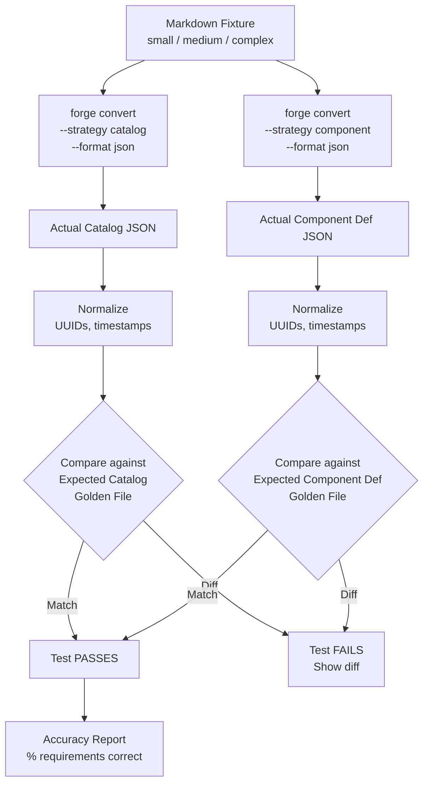
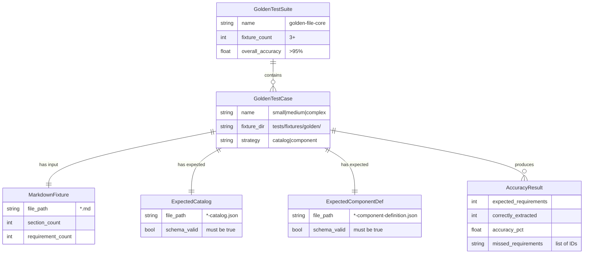
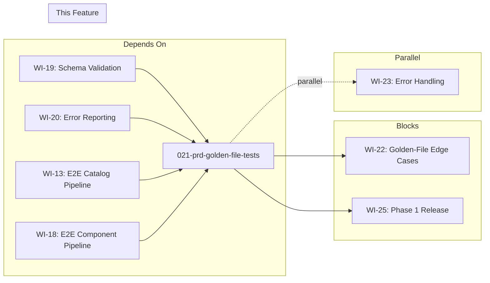

# 021-prd-golden-file-tests

> **Document Type:** Product Requirements Document
> **Audience:** LLM agents, human reviewers
> **Status:** Draft
> **Last Updated:** 2026-02-10 <!-- @auto -->
> **Owner:** Brian Luby <!-- @human-required -->

**Feature Branch**: `021-golden-file-tests`
**Created**: 2026-02-10
**Status**: Draft
**Input**: Derived from FORGE Product Roadmap WI-21

---

## Review Tier Legend

| Marker | Tier | Speckit Behavior |
|--------|------|------------------|
| 🔴 `@human-required` | Human Generated | Prompt human to author; blocks until complete |
| 🟡 `@human-review` | LLM + Human Review | LLM drafts → prompt human to confirm/edit; blocks until confirmed |
| 🟢 `@llm-autonomous` | LLM Autonomous | LLM completes; no prompt; logged for audit |
| ⚪ `@auto` | Auto-generated | System fills (timestamps, links); no prompt |

---

## Document Completion Order

> ⚠️ **For LLM Agents:** Complete sections in this order. Do not fill downstream sections until upstream human-required inputs exist.

1. **Context** (Background, Scope) → requires human input first
2. **Problem Statement & User Scenarios** → requires human input
3. **Requirements** (Must/Should/Could/Won't) → requires human input
4. **Technical Constraints** → human review
5. **Diagrams, Data Model, Interface** → LLM can draft after above exist
6. **Acceptance Criteria** → derived from requirements
7. **Everything else** → can proceed

---

## Context

### Background 🔴 `@human-required`
This PRD covers **WI-21: Golden-File Test Suite — Core** from the FORGE Product Roadmap (Sprint S-21, Jul 20–24 2026, Theme T-3: Validation & Quality, Milestone MS-4). By Sprint 21, the full end-to-end pipeline exists: Markdown ingestion, structural extraction, requirement atomization, deterministic UUID generation, citation extraction, OSCAL Catalog generation, OSCAL Component Definition generation, traceability, and schema validation (WI-1 through WI-20). What does not yet exist is a systematic regression test suite that compares the pipeline's actual output against known-good expected outputs. Golden-file testing fills this gap by maintaining hand-verified OSCAL JSON fixtures alongside the Markdown policy inputs that produce them, and running automated comparisons in `cargo test`. This work item validates all Must Have requirements (M-1 through M-11) end-to-end and establishes the >95% extraction accuracy target required by MS-4.

### Scope Boundaries 🟡 `@human-review`

**In Scope:**
- Creating 3+ Markdown policy test fixtures of varying complexity (small, medium, complex)
- Creating hand-verified expected OSCAL Catalog JSON outputs for each fixture
- Creating hand-verified expected OSCAL Component Definition JSON outputs for each fixture
- Implementing a golden-file comparison harness within `cargo test`
- Normalizing or ignoring non-deterministic fields (UUIDs, timestamps) during comparison
- Measuring extraction accuracy as a percentage of correctly mapped requirements
- Testing both `--strategy catalog` and `--strategy component` conversion strategies
- Reporting accuracy metrics and identifying any extraction failures

**Out of Scope:**
- Edge case fixtures (compound statements, empty sections, missing metadata, no headings) — deferred to WI-22 (022-prd-golden-file-edge-cases)
- Error handling and robustness testing — deferred to WI-23 (023-prd-error-handling)
- Performance benchmarking — deferred to WI-24 (024-prd-performance-benchmark)
- Profile generation testing — deferred to WI-32 (032-prd-profile-validation-tests)
- XML/YAML output testing — deferred to WI-28 (028-prd-round-trip-testing)
- Fuzz testing or adversarial input testing — deferred to WI-23

### Glossary 🟡 `@human-review`

| Term | Definition |
|------|------------|
| Golden File | A known-good expected output file that is hand-verified and stored in version control as the reference for comparison testing |
| Fixture | A test input file (Markdown policy document) paired with its expected output (OSCAL JSON) used in automated testing |
| Extraction Accuracy | The percentage of policy requirements in a source document that are correctly extracted, mapped, and represented in the generated OSCAL output |
| Comparison Harness | Test infrastructure that loads fixtures, runs the conversion pipeline, normalizes non-deterministic fields, and compares actual output against golden files |
| Non-Deterministic Field | A field whose value changes between runs (e.g., random UUIDs, current timestamps) and must be normalized before comparison |
| Normalization | The process of replacing or removing non-deterministic values in output so that structural and content comparisons are stable across runs |
| Catalog-First Strategy | Conversion approach where policy requirements become OSCAL Catalog controls organized into groups by policy section |
| Component-First Strategy | Conversion approach where policy requirements become implemented-requirements in an OSCAL Component Definition documentary component |

### Related Documents ⚪ `@auto`

| Document | Link | Relationship |
|----------|------|--------------|
| Parent PRD | docs/FORGE_PRD.md | Parent requirements (M-1 through M-11 validated by this test suite) |
| Product Roadmap | docs/FORGE_PRODUCT_ROADMAP.md | Sprint S-21 context |
| Product Vision | docs/FORGE_PRODUCT_VISION.md | Strategic goal G-1 |
| Constitution | .specify/memory/constitution.md | Technical constraints, TDD mandate, quality gates |
| Schema Validation PRD | docs/PRD/019-prd-schema-validation.md | Dependency — schema validation must be working before golden-file tests can verify full pipeline |
| Edge Case Tests PRD | docs/PRD/022-prd-golden-file-edge-cases.md | Blocked by this work item — core harness must exist first |

---

## Problem Statement 🔴 `@human-required`

After 20 sprints of development, the FORGE pipeline can ingest Markdown, extract structure, atomize requirements, generate OSCAL Catalog and Component Definition artifacts, embed traceability, and validate against schemas. However, there is no systematic way to verify that the end-to-end pipeline produces correct, complete, and stable output for representative policy documents. Individual unit tests validate isolated stages, but no integration-level regression test confirms that the entire pipeline — from Markdown input to validated OSCAL JSON output — produces the expected result. Without golden-file tests, regressions can silently degrade extraction accuracy, break traceability links, corrupt back matter references, or alter OSCAL structure in ways that individual unit tests would not catch. The >95% extraction accuracy target required by MS-4 cannot be measured or enforced without a golden-file comparison framework.

---

## User Scenarios & Testing 🔴 `@human-required`

### User Story 1 — Run Golden-File Regression Tests (Priority: P1)

A developer makes changes to the conversion pipeline and needs to verify that no regressions occurred in the generated OSCAL output.

> As a developer working on FORGE, I want golden-file regression tests in `cargo test` so that any change to the pipeline that alters OSCAL output is immediately detected and can be reviewed before merging.

**Why this priority**: This is the core purpose of the work item. Without regression tests, changes to any pipeline stage can silently break output correctness.

**Independent Test**: Run `cargo test golden` and verify that all golden-file comparison tests pass, confirming actual output matches expected output for all fixtures.

**Acceptance Scenarios**:
1. **Given** the golden-file test suite with 3+ fixtures, **When** running `cargo test golden`, **Then** all tests pass with actual output matching expected output after normalization.
2. **Given** a pipeline change that alters a control's prose text, **When** running `cargo test golden`, **Then** the affected test fails with a diff showing the exact divergence between actual and expected output.
3. **Given** a pipeline change that only affects non-deterministic fields (UUIDs, timestamps), **When** running `cargo test golden`, **Then** all tests still pass because normalization handles those fields.

---

### User Story 2 — Validate Catalog-First Strategy Output (Priority: P1)

A developer needs to verify that the catalog-first conversion strategy produces correct OSCAL Catalog output for policy documents of varying complexity.

> As a developer working on FORGE, I want golden-file tests for the catalog-first strategy so that I can confirm Catalog generation is correct across small, medium, and complex policy documents.

**Why this priority**: Catalog generation is the primary conversion path (M-3) and must be verified at multiple complexity levels to ensure robustness.

**Independent Test**: Run the catalog-strategy golden-file tests and verify that each fixture (small, medium, complex) produces the expected Catalog JSON.

**Acceptance Scenarios**:
1. **Given** a small policy fixture (1 section, 3–5 requirements), **When** converting with `--strategy catalog`, **Then** the output matches the expected Catalog golden file with correct groups, controls, and statement parts.
2. **Given** a medium policy fixture (3–5 sections, 10–15 requirements), **When** converting with `--strategy catalog`, **Then** the output matches the expected Catalog golden file with correct hierarchical groups and controls.
3. **Given** a complex policy fixture (5+ sections, 20+ requirements including citations and cross-references), **When** converting with `--strategy catalog`, **Then** the output matches the expected Catalog golden file with correct groups, controls, back matter resources, and traceability props.

---

### User Story 3 — Validate Component-First Strategy Output (Priority: P1)

A developer needs to verify that the component-first conversion strategy produces correct OSCAL Component Definition output.

> As a developer working on FORGE, I want golden-file tests for the component-first strategy so that I can confirm Component Definition generation is correct and maps requirements to control IDs properly.

**Why this priority**: Component Definition generation (M-4) is the second primary conversion path and must be tested with equal rigor.

**Independent Test**: Run the component-strategy golden-file tests and verify that each fixture produces the expected Component Definition JSON.

**Acceptance Scenarios**:
1. **Given** a Markdown policy fixture and a baseline profile reference, **When** converting with `--strategy component`, **Then** the output matches the expected Component Definition golden file with correct documentary components and implemented-requirements.
2. **Given** the expected Component Definition output, **When** inspecting each implemented-requirement, **Then** the control-id, narrative prose, and trace props match the expected golden file exactly.

---

### User Story 4 — Measure Extraction Accuracy (Priority: P1)

A developer needs to measure and report the extraction accuracy of the pipeline against the >95% target.

> As a developer working on FORGE, I want the golden-file test suite to measure and report extraction accuracy so that I can verify the >95% target is met and track accuracy trends over time.

**Why this priority**: The >95% extraction accuracy target is an MS-4 exit criterion. Without measurement, the milestone cannot be verified.

**Independent Test**: Run the golden-file tests and verify that the accuracy report shows >95% for each fixture and overall.

**Acceptance Scenarios**:
1. **Given** a golden-file test run across all fixtures, **When** the tests complete, **Then** an accuracy summary is printed showing the number of requirements expected, number correctly extracted, and percentage accuracy per fixture and overall.
2. **Given** a fixture with 20 requirements where 19 are correctly extracted, **When** reviewing the accuracy report, **Then** the accuracy is reported as 95.0% and the one missed requirement is identified.

---

## Assumptions & Risks 🟡 `@human-review`

### Assumptions
- [A-1] The end-to-end pipeline (WI-1 through WI-20) is functional and producing OSCAL output before this work item begins.
- [A-2] Schema validation (WI-19, WI-20) is working, so golden-file expected outputs can be verified as schema-valid before being committed.
- [A-3] Deterministic UUID generation (WI-7) is working, so UUIDs in golden files are stable for identical content, though the harness still normalizes them for resilience.
- [A-4] The `forge convert` CLI interface established in WI-13 and WI-18 is stable and will not change during this sprint.
- [A-5] Hand-verification of expected OSCAL outputs is feasible for the fixture sizes chosen (small, medium, complex).

### Risks
| ID | Risk | Likelihood | Impact | Mitigation |
|----|------|------------|--------|------------|
| R-1 | Expected OSCAL outputs contain errors that are committed as golden files, masking real bugs | Med | High | Hand-verify all expected outputs against OSCAL schema and manual inspection; have both human and schema validation confirm correctness |
| R-2 | Non-deterministic fields beyond UUIDs and timestamps exist in output (e.g., hash ordering in JSON maps) | Med | Med | Use ordered serialization (serde with sorted keys); normalize JSON key ordering in comparison harness |
| R-3 | Complex fixture is too large to hand-verify expected output reliably | Low | Med | Keep complex fixture under 30 requirements; verify incrementally by section |
| R-4 | Golden files become stale as pipeline evolves, causing false test failures | Med | Low | Document the update process; provide a `--update-golden` flag or script to regenerate expected outputs after intentional changes |

---

## Feature Overview

### Flow Diagram 🟡 `@human-review`



### State Diagram (if applicable) 🟡 `@human-review`
N/A — No state transitions in this work item. The golden-file tests are stateless comparisons run on each `cargo test` invocation.

---

## Requirements

### Must Have (M) — MVP, launch blockers 🔴 `@human-required`
- [ ] **M-1:** The test suite shall include at least 3 Markdown policy fixture files of varying complexity: small (1 section, 3–5 requirements), medium (3–5 sections, 10–15 requirements), and complex (5+ sections, 20+ requirements with citations and cross-references).
- [ ] **M-2:** For each fixture, the test suite shall include a hand-verified expected OSCAL Catalog JSON golden file that passes OSCAL v1.2.0 schema validation.
- [ ] **M-3:** For each fixture, the test suite shall include a hand-verified expected OSCAL Component Definition JSON golden file that passes OSCAL v1.2.0 schema validation.
- [ ] **M-4:** The golden-file comparison harness shall normalize non-deterministic fields (UUIDs, `last-modified` timestamps) before comparing actual output against expected output.
- [ ] **M-5:** The golden-file comparison harness shall produce a clear diff output when actual output diverges from expected output, identifying the specific JSON path and values that differ.
- [ ] **M-6:** All golden-file tests shall be runnable via `cargo test` as part of the standard test suite and shall pass in CI.
- [ ] **M-7:** The test suite shall test both `--strategy catalog` and `--strategy component` conversion strategies for each fixture.
- [ ] **M-8:** The test suite shall measure and report extraction accuracy as the percentage of expected requirements that are correctly represented in the actual OSCAL output, with a target of >95%.
- [ ] **M-9:** Expected golden files shall validate all Must Have parent PRD requirements (M-1 through M-11): structural extraction (M-1), atomization (M-2), Catalog generation (M-3), Component Definition generation (M-4), metadata (M-5), schema validity (M-6), JSON output (M-7), stable UUIDs (M-8), back matter (M-9), traceability (M-10), and proper prop/link usage (M-11).

### Should Have (S) — High value, not blocking 🔴 `@human-required`
- [ ] **S-1:** The comparison harness shall support a mechanism to update golden files when intentional pipeline changes are made (e.g., a `--update-golden` environment variable or script).
- [ ] **S-2:** The test suite shall verify that the same fixture produces identical output across consecutive runs, confirming deterministic behavior.
- [ ] **S-3:** The accuracy report shall identify each missed or incorrectly extracted requirement by name or stable ID, not just report a count.

### Could Have (C) — Nice to have, if time permits 🟡 `@human-review`
- [ ] **C-1:** The comparison harness could support partial golden-file matching, allowing tests to assert on specific JSON subtrees rather than the entire document.
- [ ] **C-2:** The test suite could include a fixture with a baseline profile reference for component-first testing, verifying control-id mapping against a real profile.

### Won't Have (W) — Explicitly deferred 🟡 `@human-review`
- [ ] **W-1:** Edge case fixtures — *Reason: Deferred to WI-22 (022-prd-golden-file-edge-cases) which builds on this harness*
- [ ] **W-2:** XML/YAML golden-file comparisons — *Reason: Deferred until WI-26/WI-27 implement XML/YAML output*
- [ ] **W-3:** Profile generation golden files — *Reason: Deferred to WI-32 (032-prd-profile-validation-tests)*
- [ ] **W-4:** Performance regression testing — *Reason: Deferred to WI-24 (024-prd-performance-benchmark)*
- [ ] **W-5:** Fuzzing or property-based testing — *Reason: Out of scope for fixture-based golden-file testing*

---

## Technical Constraints 🟡 `@human-review`

- **Language/Framework:** Rust, `cargo test` integration; tests must run without external test runners
- **Test Organization:** Golden-file tests should be organized as integration tests (in `tests/` directory) or as a dedicated test module, clearly separated from unit tests
- **Fixture Location:** Fixture files (Markdown inputs and expected JSON outputs) shall be stored in a `tests/fixtures/golden/` directory (or equivalent) within the repository
- **Serialization Determinism:** JSON output must use ordered/sorted keys (`serde` with `#[serde(sort_maps)]` or equivalent) to ensure stable serialization for comparison
- **Normalization Strategy:** UUIDs shall be replaced with a placeholder (e.g., `"00000000-0000-0000-0000-000000000000"`) and `last-modified` timestamps with a fixed value before comparison
- **Diff Output:** When tests fail, the diff must be human-readable (not raw byte comparison); prefer structural JSON diff over textual diff
- **CI Compatibility:** Tests must pass in CI (`cargo test`) without manual setup, network access, or external tool dependencies
- **Schema Validation:** All expected golden files must themselves pass OSCAL v1.2.0 schema validation; invalid golden files must not be committed

---

## Data Model (if applicable) 🟡 `@human-review`



---

## Interface Contract (if applicable) 🟡 `@human-review`

```rust
// Golden-file test harness (conceptual)

/// Directory layout for golden-file fixtures:
///
/// tests/fixtures/golden/
///   small/
///     input.md                          — Small policy (1 section, 3-5 reqs)
///     expected-catalog.json             — Expected Catalog output
///     expected-component-definition.json — Expected Component Definition output
///   medium/
///     input.md                          — Medium policy (3-5 sections, 10-15 reqs)
///     expected-catalog.json
///     expected-component-definition.json
///   complex/
///     input.md                          — Complex policy (5+ sections, 20+ reqs, citations)
///     expected-catalog.json
///     expected-component-definition.json

/// Normalize non-deterministic fields for stable comparison
fn normalize_for_comparison(json: &serde_json::Value) -> serde_json::Value {
    // Replace all UUID fields with a fixed placeholder
    // Replace all last-modified timestamps with a fixed value
    // Sort map keys for deterministic ordering
    // Return normalized JSON
}

/// Compare actual output against expected golden file
fn compare_golden(actual: &serde_json::Value, expected: &serde_json::Value) -> GoldenResult {
    // Normalize both values
    // Perform structural comparison
    // Return match/diff with JSON path of divergences
}

/// Measure extraction accuracy
fn measure_accuracy(
    fixture_input: &PolicyDocument,
    actual_output: &serde_json::Value,
    expected_output: &serde_json::Value,
) -> AccuracyReport {
    // Count expected requirements from fixture
    // Count correctly extracted requirements in actual output
    // Identify missed or incorrect requirements
    // Return accuracy percentage and details
}

/// Result of golden-file comparison
struct GoldenResult {
    matches: bool,
    diffs: Vec<GoldenDiff>,
}

struct GoldenDiff {
    json_path: String,      // e.g., "$.catalog.groups[0].controls[1].parts[0].prose"
    expected: String,
    actual: String,
}

/// Accuracy measurement result
struct AccuracyReport {
    fixture_name: String,
    expected_count: usize,
    correct_count: usize,
    accuracy_pct: f64,
    missed_requirements: Vec<String>,  // Stable IDs of missed requirements
}
```

---

## Evaluation Criteria 🟡 `@human-review`

| Criterion | Weight | Metric | Target | Notes |
|-----------|--------|--------|--------|-------|
| Extraction Accuracy | Critical | % of requirements correctly extracted and mapped across all fixtures | >95% | MS-4 exit criterion; measured per fixture and overall |
| Golden-File Coverage | Critical | Number of fixture complexity levels with passing golden-file tests | 3 (small, medium, complex) | Both strategies tested per fixture |
| Strategy Coverage | Critical | Both catalog-first and component-first strategies tested | 100% | Each fixture tested with both strategies |
| Parent PRD Requirement Coverage | Critical | All M-1 through M-11 exercised by at least one fixture | 100% | Complex fixture should exercise all requirements |
| Schema Validity of Golden Files | Critical | All expected golden files pass OSCAL v1.2.0 schema validation | 100% | Invalid golden files must not be committed |
| Determinism | High | Identical output across consecutive runs for same fixture | 100% | Verified by S-2 if implemented |

---

## Tool/Approach Candidates 🟡 `@human-review`

| Option | License | Pros | Cons | Spike Result |
|--------|---------|------|------|--------------|
| **Manual JSON comparison with serde_json** | MIT/Apache-2.0 | Simple, no new dependencies; full control over normalization | Must implement diff reporting from scratch | Likely choice |
| **`assert_json_diff` crate** | MIT | Purpose-built for JSON comparison in tests; produces readable diffs | New dependency; may not support custom normalization | Needs evaluation |
| **`insta` snapshot testing crate** | Apache-2.0 | Industry-standard Rust snapshot testing; `--update` flag for golden file updates; readable diffs | Opinionated workflow; may not align with custom normalization needs | Needs evaluation |
| **`pretty_assertions` crate** | MIT/Apache-2.0 | Colorized diffs in test output; drop-in replacement for `assert_eq!` | Only textual diff, not structural JSON diff | Complement to above |

### Selected Approach 🔴 `@human-required`
> **Decision:** [To be decided — evaluate `assert_json_diff` or `insta` vs manual serde_json comparison during implementation]
> **Rationale:** [Selected approach must support UUID/timestamp normalization, structural JSON diff with JSON paths, and CI compatibility]

---

## Acceptance Criteria 🟡 `@human-review`

| AC ID | Requirement | User Story | Given | When | Then |
|-------|-------------|------------|-------|------|------|
| AC-1 | M-1 | US-1 | The test suite fixtures directory | Inspecting `tests/fixtures/golden/` | At least 3 Markdown fixtures exist: small, medium, complex |
| AC-2 | M-2 | US-2 | Each Markdown fixture | Inspecting expected outputs | A corresponding `expected-catalog.json` exists and passes OSCAL v1.2.0 schema validation |
| AC-3 | M-3 | US-3 | Each Markdown fixture | Inspecting expected outputs | A corresponding `expected-component-definition.json` exists and passes OSCAL v1.2.0 schema validation |
| AC-4 | M-4, M-5 | US-1 | The golden-file comparison harness | Running a test where UUIDs or timestamps differ between actual and expected | The test passes because normalization removes non-deterministic fields before comparison |
| AC-5 | M-5 | US-1 | A pipeline change that alters control prose | Running `cargo test golden` | The affected test fails with a diff showing the JSON path and old/new values |
| AC-6 | M-6 | US-1 | All golden-file tests | Running `cargo test` | All golden-file tests execute and pass as part of the standard test suite |
| AC-7 | M-7 | US-2, US-3 | Each fixture | Running golden-file tests | Both `--strategy catalog` and `--strategy component` outputs are compared against expected golden files |
| AC-8 | M-8 | US-4 | The golden-file test run | Reviewing test output | An accuracy report is printed showing >95% extraction accuracy per fixture and overall |
| AC-9 | M-9 | US-2, US-3 | The complex fixture | Inspecting expected golden files | The expected outputs exercise M-1 through M-11: structural hierarchy, atomized requirements, groups/controls, documentary components, metadata, schema validity, JSON format, stable UUIDs, back matter resources, traceability props, and proper prop/link usage |

### Edge Cases 🟢 `@llm-autonomous`
- [ ] **EC-1:** (M-4) When the pipeline generates a new UUID format or changes UUID generation logic, then normalization still produces a stable comparison (UUIDs are fully replaced, not pattern-matched).
- [ ] **EC-2:** (M-5) When the actual output has additional fields not present in the expected golden file (forward compatibility), then the diff clearly identifies the additions.
- [ ] **EC-3:** (M-5) When the actual output is missing fields present in the expected golden file, then the diff clearly identifies the omissions.
- [ ] **EC-4:** (M-8) When extraction accuracy is exactly 95.0%, then the test passes (boundary condition: >95% is the target, but 95% should be explicitly handled — clarify if >=95% or strictly >95%).
- [ ] **EC-5:** (M-4) When JSON map key ordering differs between actual and expected output, then normalization sorts keys before comparison and the test passes.
- [ ] **EC-6:** (M-6) When a golden file is corrupted or missing, then the test fails with a descriptive error (not a panic) indicating which fixture file is missing or unreadable.

---

## Dependencies 🟡 `@human-review`



- **Requires:** WI-19 (schema validation — must be working to validate golden files and run full pipeline); WI-13 (end-to-end Catalog pipeline); WI-18 (end-to-end Component pipeline)
- **Blocks:** WI-22 (golden-file edge case tests — depends on the harness built here); WI-25 (Phase 1 release — golden-file tests are part of MS-4 exit criteria)
- **Parallel With:** WI-23 (error handling — can run concurrently; independent concerns)
- **External:** OSCAL v1.2.0 JSON schemas (for validating golden files are schema-valid)

---

## Security Considerations 🟡 `@human-review`

| Aspect | Assessment | Notes |
|--------|------------|-------|
| Internet Exposure | No | Test suite runs locally and in CI; no network access |
| Sensitive Data | No | Fixtures are synthetic policy documents created for testing; no real organizational data |
| Authentication Required | No | Local test execution |
| Security Review Required | N/A | Test infrastructure only; no attack surface. Fixtures are Markdown and JSON — no executable content |

---

## Implementation Guidance 🟢 `@llm-autonomous`

### Suggested Approach
Organize golden-file tests as Rust integration tests in `tests/golden_file_tests.rs` (or a `tests/golden/` module). Each test function loads a Markdown fixture from `tests/fixtures/golden/<name>/input.md`, runs the conversion pipeline programmatically (using the library API, not shelling out to the CLI binary), captures the output as `serde_json::Value`, normalizes it, loads the expected golden file, normalizes it, and compares. For normalization, walk the JSON tree and replace any value matching UUID format (`/^[0-9a-f]{8}-...-[0-9a-f]{12}$/`) with a fixed placeholder, and replace `last-modified` field values with a fixed timestamp.

For accuracy measurement, count the number of controls in the expected Catalog (or implemented-requirements in the expected Component Definition) and compare against the actual output. A requirement is "correctly extracted" if a matching control exists with the expected control ID, prose text, and structural position. Report accuracy as `correct / expected * 100`.

For golden file updates, support an environment variable `UPDATE_GOLDEN_FILES=1` that, when set, writes the actual (pre-normalization) output to the golden file path instead of comparing. This allows developers to regenerate golden files after intentional changes.

### Fixture Design Guidelines

**Small fixture (`small/input.md`):**
- 1 section (e.g., "Access Control")
- 3–5 simple, atomic requirements
- No citations or cross-references
- Exercises: M-1 (structural extraction), M-3 (Catalog generation), M-4 (Component Definition), M-5 (metadata), M-7 (JSON), M-8 (stable UUIDs)

**Medium fixture (`medium/input.md`):**
- 3–5 sections (e.g., "Access Control", "Data Protection", "Incident Response")
- 10–15 requirements across sections
- 1–2 citations/references
- Exercises: All of small plus M-9 (back matter), M-10 (traceability)

**Complex fixture (`complex/input.md`):**
- 5+ sections with sub-sections
- 20+ requirements including compound statements that should be atomized
- Multiple citations, cross-references, and parameter-like content
- Exercises: All M-1 through M-11 including M-2 (atomization), M-11 (prop/link usage)

### Anti-patterns to Avoid
- Generating golden files automatically and committing without hand-verification — this defeats the purpose of golden-file testing
- Comparing raw JSON strings instead of parsed/normalized structures — brittle to formatting changes
- Over-normalizing (e.g., removing all string values) — this makes tests meaningless
- Creating fixtures that are too large to hand-verify — keep complex fixture manageable (under 30 requirements)
- Storing golden files outside version control — they must be tracked and reviewed in PRs
- Ignoring JSON key ordering — use sorted serialization to avoid non-deterministic failures

### Reference Examples
- Rust `insta` crate for snapshot testing patterns: https://docs.rs/insta/latest/insta/
- `assert_json_diff` crate for structural JSON comparison: https://docs.rs/assert_json_diff/latest/assert_json_diff/
- NIST OSCAL example files for reference OSCAL JSON structure

---

## Spike Tasks 🟡 `@human-review`

N/A — No spike tasks for this work item. The comparison approach can be evaluated during implementation using the selected approach decision above.

---

## Success Metrics 🔴 `@human-required`

| Metric | Baseline | Target | Measurement Method |
|--------|----------|--------|-------------------|
| Extraction accuracy (overall) | N/A | >95% | Golden-file test accuracy report |
| Fixture count | 0 | 3+ (small, medium, complex) | Count of fixture directories in `tests/fixtures/golden/` |
| Strategy coverage | 0 | 2 (catalog + component) | Each fixture tested with both strategies |
| Golden-file test pass rate | 0 | 100% | `cargo test golden` in CI |
| Parent PRD requirement coverage | 0 | M-1 through M-11 (all 11) | Manual audit of fixtures against requirements |

### Technical Verification 🟢 `@llm-autonomous`
| Metric | Target | Verification Method |
|--------|--------|---------------------|
| All golden-file tests pass | 100% | `cargo test golden` |
| All golden files schema-valid | 100% | `forge validate` on each expected JSON |
| No clippy warnings in test code | 0 | `cargo clippy -- -D warnings` |
| No formatting violations in test code | 0 | `cargo fmt --check` |
| Deterministic output verified | Identical across 2+ runs | S-2 test case |

---

## Definition of Ready 🔴 `@human-required`

### Readiness Checklist
- [x] Problem statement reviewed and validated by stakeholder
- [x] All Must Have requirements have acceptance criteria
- [x] Technical constraints are explicit and agreed
- [x] Dependencies identified and owners confirmed
- [x] Security review completed (N/A documented with justification)
- [x] No open questions blocking implementation

### Sign-off
| Role | Name | Date | Decision |
|------|------|------|----------|
| Product Owner | Brian Luby | YYYY-MM-DD | [Ready / Not Ready] |

---

## Changelog ⚪ `@auto`

| Version | Date | Author | Changes |
|---------|------|--------|---------|
| 0.1 | 2026-02-10 | LLM (Claude) | Initial draft derived from FORGE Product Roadmap WI-21 |

---

## Decision Log 🟡 `@human-review`

| Date | Decision | Rationale | Alternatives Considered |
|------|----------|-----------|------------------------|
| 2026-02-10 | Use UUID/timestamp normalization rather than deterministic-only comparison | Even with deterministic UUID generation (WI-7), normalization adds resilience against future changes to UUID logic or test environment differences | Rely solely on deterministic UUIDs — rejected because timestamp fields are inherently non-deterministic |
| 2026-02-10 | Three complexity levels (small, medium, complex) rather than a single comprehensive fixture | Multiple complexity levels catch different categories of bugs: simple structural mapping, multi-section hierarchy, and complex feature interactions | Single large fixture — rejected because failures would be hard to diagnose; Single small fixture — rejected because it would miss multi-section and citation handling bugs |
| 2026-02-10 | Test via library API, not CLI binary | Library-level testing avoids process spawning overhead, gives better error diagnostics, and allows direct JSON comparison without file I/O | Shell out to `forge convert` binary — rejected for slower execution and harder diff diagnostics |
| 2026-02-10 | Separate core golden files (WI-21) from edge case golden files (WI-22) | Core fixtures validate the happy path end-to-end; edge cases are a different testing concern. Splitting allows WI-21 to be completed and merged independently | Combined in one work item — rejected because it increases sprint scope beyond S-size |

---

## Open Questions 🟡 `@human-review`

No open questions for this work item.

---

## Review Checklist 🟢 `@llm-autonomous`

Before marking as Approved:
- [x] All requirements have unique IDs (M-1 through M-9, S-1 through S-3, C-1 through C-2, W-1 through W-5)
- [x] All Must Have requirements have linked acceptance criteria
- [x] User stories are prioritized and independently testable
- [x] Acceptance criteria reference both requirement IDs and user stories
- [x] Glossary terms are used consistently throughout
- [x] Diagrams use terminology from Glossary
- [x] Security considerations documented (N/A justified)
- [x] Definition of Ready checklist is complete
- [x] No open questions blocking implementation
