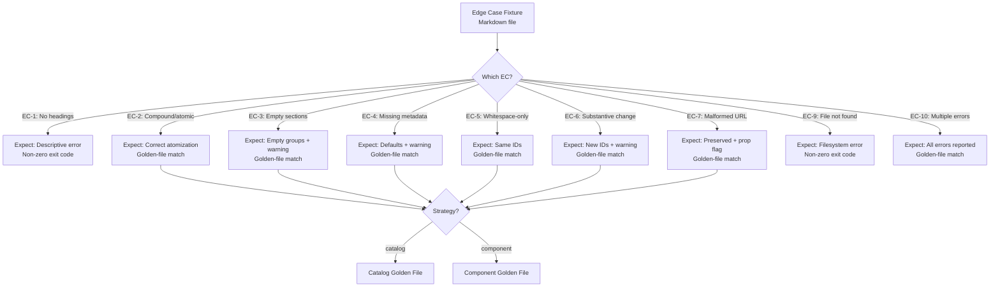
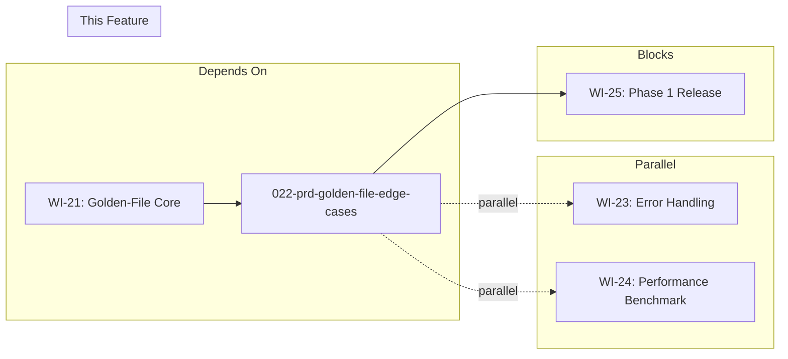

# 022-prd-golden-file-edge-cases

> **Document Type:** Product Requirements Document
> **Audience:** LLM agents, human reviewers
> **Status:** Draft
> **Last Updated:** 2026-02-10 <!-- @auto -->
> **Owner:** Brian Luby <!-- @human-required -->

**Feature Branch**: `022-golden-file-edge-cases`
**Created**: 2026-02-10
**Status**: Draft
**Input**: Derived from FORGE Product Roadmap WI-22

---

## Review Tier Legend

| Marker | Tier | Speckit Behavior |
|--------|------|------------------|
| 🔴 `@human-required` | Human Generated | Prompt human to author; blocks until complete |
| 🟡 `@human-review` | LLM + Human Review | LLM drafts → prompt human to confirm/edit; blocks until confirmed |
| 🟢 `@llm-autonomous` | LLM Autonomous | LLM completes; no prompt; logged for audit |
| ⚪ `@auto` | Auto-generated | System fills (timestamps, links); no prompt |

---

## Document Completion Order

> ⚠️ **For LLM Agents:** Complete sections in this order. Do not fill downstream sections until upstream human-required inputs exist.

1. **Context** (Background, Scope) → requires human input first
2. **Problem Statement & User Scenarios** → requires human input
3. **Requirements** (Must/Should/Could/Won't) → requires human input
4. **Technical Constraints** → human review
5. **Diagrams, Data Model, Interface** → LLM can draft after above exist
6. **Acceptance Criteria** → derived from requirements
7. **Everything else** → can proceed

---

## Context

### Background 🔴 `@human-required`
This PRD covers **WI-22: Golden-File Test Suite — Edge Cases** from the FORGE Product Roadmap (Sprint S-22, Jul 27–31 2026, Theme T-3: Validation & Quality, Milestone MS-4). WI-21 establishes the core golden-file test suite with representative Markdown policy fixtures and their expected OSCAL outputs. WI-22 extends that suite to cover the edge cases defined in the parent PRD (EC-1 through EC-10), ensuring the FORGE pipeline handles degenerate, boundary, and malformed inputs correctly. Each edge case from the parent PRD must have at least one dedicated test fixture and expected output (or expected error). Without this work item, the golden-file suite would only validate the "happy path" and miss the boundary conditions that most commonly cause regressions and user-facing failures.

### Scope Boundaries 🟡 `@human-review`

**In Scope:**
- Creating edge case Markdown test fixtures for each of EC-1 through EC-10 (excluding EC-8 per ADR-001)
- Creating expected OSCAL output files (or expected error output) for each edge case fixture
- Adding fixtures for compound statement atomization edge cases
- Adding fixtures for empty sections (no normative requirements)
- Adding fixtures for missing metadata (no title, no version, no author)
- Adding fixtures for documents with no identifiable headings
- Adding fixtures for citation extraction edge cases (malformed URLs)
- Adding fixtures for parameter-like content within policy text
- Testing both `--strategy catalog` and `--strategy component` for applicable edge cases
- Extending the golden-file comparison harness from WI-21 to cover error output matching
- Verifying whitespace-only changes produce identical stable IDs
- Verifying substantive changes produce new stable IDs with warnings

**Out of Scope:**
- Core golden-file harness implementation — completed in WI-21 (021-prd-golden-file-core)
- Happy-path fixtures for well-structured policies — completed in WI-21
- PDF or DOCX edge cases — deferred per ADR-001 (Markdown-only input)
- Performance benchmarking of edge cases — deferred to WI-24
- Error handling implementation — WI-23 implements error handling; this work item validates it
- Schema validation implementation — completed in WI-19 and WI-20

### Glossary 🟡 `@human-review`

| Term | Definition |
|------|------------|
| Golden File | A reference output file representing the expected correct result of a conversion, used for regression testing |
| Edge Case | An input or scenario at the boundary of expected behavior that tests robustness and error handling |
| Fixture | A test input file (Markdown policy document) used as input to the conversion pipeline during testing |
| EC-N | Edge Case identifier from the parent PRD (docs/FORGE_PRD.md), numbered EC-1 through EC-10 |
| Atomization | The process of splitting compound policy statements into individual, independently addressable requirements |
| Stable ID | A deterministic UUID v5 identifier generated from requirement content that remains consistent across re-conversions of identical content |
| Normative Requirement | A policy statement using "must" or "shall" language indicating mandatory compliance |

### Related Documents ⚪ `@auto`

| Document | Link | Relationship |
|----------|------|--------------|
| Parent PRD | docs/FORGE_PRD.md | Edge cases EC-1 through EC-10 defined here |
| Product Roadmap | docs/FORGE_PRODUCT_ROADMAP.md | Sprint S-22 context |
| Product Vision | docs/FORGE_PRODUCT_VISION.md | Strategic goal G-1 |
| Constitution | .specify/memory/constitution.md | Technical constraints and quality gates |
| WI-21 PRD (Core Golden Files) | docs/PRD/021-prd-golden-file-core.md | Prerequisite: golden-file harness and core fixtures |
| WI-23 PRD (Error Handling) | docs/PRD/023-prd-error-handling.md | Parallel: error handling implementation validated by these edge cases |

---

## Problem Statement 🔴 `@human-required`

The core golden-file test suite (WI-21) validates that FORGE produces correct OSCAL output from well-structured, representative Markdown policy documents. However, real-world policy documents frequently exhibit edge conditions: missing metadata, empty sections, compound statements that resist atomization, malformed citation URLs, documents with no structural headings, and whitespace-only edits that should not change stable identifiers. The parent PRD defines ten specific edge cases (EC-1 through EC-10) that the conversion pipeline must handle correctly. Without dedicated test fixtures for each of these edge cases, regressions in boundary behavior will go undetected, error messages will degrade over time, and users will encounter confusing failures on legitimate (if imperfect) input documents. This work item closes the gap between happy-path testing and the robustness required for a Phase 1 release.

---

## User Scenarios & Testing 🔴 `@human-required`

### User Story 1 — Edge Case: No Identifiable Headings (EC-1) (Priority: P1)

A user attempts to convert a Markdown document that contains policy text but no headings or structural markers.

> As a compliance engineer, I want FORGE to produce a descriptive error when my policy document has no identifiable headings so that I understand why conversion failed and how to fix my document.

**Why this priority**: Without headings, FORGE cannot build a section hierarchy. A clear error prevents user confusion and guides remediation.

**Independent Test**: Run `forge convert no-headings.md --strategy catalog --format json` on a fixture with no Markdown headings and verify a descriptive error is emitted with a non-zero exit code.

**Acceptance Scenarios**:
1. **Given** a Markdown file with policy text but no headings (H1–H6), **When** running `forge convert no-headings.md --strategy catalog`, **Then** the CLI exits with a non-zero status code and a descriptive error message indicating no identifiable headings were found.
2. **Given** the same headingless fixture, **When** running with `--strategy component`, **Then** the same descriptive error is produced.

---

### User Story 2 — Edge Case: Compound Statement Atomization (EC-2) (Priority: P1)

A user converts a policy containing both compound and atomic statements.

> As a compliance engineer, I want compound statements to be correctly atomized into separate controls and single atomic statements to be preserved as-is so that each OSCAL control represents exactly one requirement.

**Why this priority**: Atomization correctness is central to the accuracy of the generated OSCAL. Both over-splitting and under-splitting produce incorrect output.

**Independent Test**: Run `forge convert compound-stmts.md --strategy catalog --format json` on a fixture containing compound ("must X and must Y") and atomic ("must X") statements and verify the expected golden-file output matches.

**Acceptance Scenarios**:
1. **Given** a fixture with a compound statement "Systems must encrypt data at rest and must encrypt data in transit", **When** converting to Catalog, **Then** two separate controls are generated, each with its own stable ID and statement prose.
2. **Given** a fixture with a single atomic statement "Systems must encrypt data at rest", **When** converting, **Then** exactly one control is generated preserving the statement as-is.

---

### User Story 3 — Edge Case: Empty Sections and Missing Metadata (EC-3, EC-4) (Priority: P1)

A user converts a policy document that has sections with no normative requirements or is missing standard metadata fields.

> As a compliance engineer, I want FORGE to handle empty sections and missing metadata gracefully so that I get a usable (if incomplete) OSCAL output with clear warnings about what is missing.

**Why this priority**: Real-world policy documents often have informational sections with no "must"/"shall" statements, and metadata like title, version, or author may be absent. The tool must not fail silently or crash on these inputs.

**Independent Test**: Run `forge convert empty-sections.md --strategy catalog --format json` on a fixture with informational-only sections and verify empty groups are generated with a warning. Run `forge convert missing-metadata.md` and verify `title` defaults to the input filename stem, `version` defaults to "0.0.0", and `author` defaults to "Unknown", with one warning emitted per missing metadata field.

**Acceptance Scenarios**:
1. **Given** a fixture with a section containing no normative requirements, **When** converting to Catalog, **Then** the section produces an empty group in the Catalog and a warning is emitted to stderr.
2. **Given** a fixture with no version metadata, **When** converting, **Then** the OSCAL metadata `version` field defaults to "0.0.0" and one warning for missing `version` is emitted.
3. **Given** a fixture with no title metadata, **When** converting, **Then** the OSCAL metadata `title` field defaults to the input filename stem and one warning for missing `title` is emitted.
4. **Given** a fixture with no author metadata, **When** converting, **Then** the OSCAL metadata `author` field defaults to "Unknown" and one warning for missing `author` is emitted.

---

### User Story 4 — Edge Case: Identifier Stability (EC-5, EC-6) (Priority: P1)

A user re-converts a policy document after minor edits and expects stable identifiers for unchanged content but new identifiers for substantively changed requirements.

> As a compliance engineer, I want stable IDs to remain unchanged when I make whitespace-only edits but to update when I substantively change a requirement so that my traceability and diffs are meaningful.

**Why this priority**: Identifier stability is a Must Have requirement (M-5 and M-6). Incorrect behavior here breaks traceability and produces misleading diffs.

**Independent Test**: Convert two fixture variants (whitespace-only diff and substantive diff) of the same policy and compare generated UUIDs.

**Acceptance Scenarios**:
1. **Given** a fixture and a whitespace-only variant (extra spaces, trailing newlines), **When** converting both, **Then** all stable IDs are identical between the two outputs.
2. **Given** a fixture and a substantive variant (requirement text changed), **When** converting both, **Then** the changed requirement has a new stable ID and the CLI emits a warning about the ID change.

---

### User Story 5 — Edge Case: Malformed Citations and Validation Errors (EC-7, EC-9, EC-10) (Priority: P1)

A user converts a policy with malformed citation URLs, or runs FORGE against a non-existent file, or encounters both schema and semantic validation errors.

> As a compliance engineer, I want FORGE to handle malformed citations, missing files, and multiple validation errors gracefully so that I get complete, actionable feedback rather than cryptic failures.

**Why this priority**: These edge cases represent the most common real-world failure modes. Complete error reporting (EC-10) is essential for user trust and efficient debugging.

**Independent Test**: Run fixtures and commands exercising malformed URLs, missing files, and combined validation errors, comparing output against expected error golden files.

**Acceptance Scenarios**:
1. **Given** a fixture with a malformed citation URL (e.g., `htp://not-a-url`), **When** converting, **Then** the citation is preserved in back matter with a `prop` annotation flagging it as unvalidated.
2. **Given** a file path that does not exist, **When** running `forge convert nonexistent.md`, **Then** the CLI exits with a non-zero status code and a descriptive filesystem error.
3. **Given** a generated artifact with both schema errors and semantic errors, **When** validating, **Then** all errors are reported (not just the first one).

---

### User Story 6 — Edge Case: Citation Extraction and Parameter-Like Content (Priority: P2)

A user converts a policy with inline citations and parameter-like content (e.g., "within 30 days", "at least 128-bit").

> As a compliance engineer, I want citation extraction and parameter-like content to be correctly handled in edge case scenarios so that the golden-file suite validates the full range of extraction behavior.

**Why this priority**: While the core extraction logic is tested in WI-21, edge cases for citation and parameter-like patterns ensure robustness against unusual formatting.

**Independent Test**: Run fixtures with unusual citation patterns and parameter-like text and compare against expected golden-file outputs.

**Acceptance Scenarios**:
1. **Given** a fixture with citations in unusual positions (e.g., mid-sentence, in table cells), **When** converting, **Then** citations are correctly extracted to back matter and linked from the referencing control.
2. **Given** a fixture with parameter-like content ("must review within 30 days"), **When** converting, **Then** the parameter-like text is preserved in the control statement prose (this aligns with Should Have S-2 for WI-22; parameter extraction itself is handled in WI-34).

---

### User Story 7 — Edge Case: Both Strategies Tested (Priority: P1)

Edge case fixtures must be tested with both catalog-first and component-first conversion strategies where applicable, while strategy-agnostic file-not-found behavior is validated once.

> As a compliance engineer, I want edge case behavior to be consistent across both conversion strategies so that I can trust the output regardless of the strategy I choose.

**Why this priority**: Bugs in edge case handling may manifest in one strategy but not the other. Both paths must be validated.

**Independent Test**: For EC-1, EC-2, EC-3, EC-4, EC-5, EC-6, EC-7, and EC-10, run both `--strategy catalog` and `--strategy component` and compare against strategy-specific expected outputs; validate EC-9 once as a strategy-agnostic missing-file failure.

**Acceptance Scenarios**:
1. **Given** EC-1, EC-2, EC-3, EC-4, EC-5, EC-6, EC-7, or EC-10, **When** converting with `--strategy catalog` and then with `--strategy component`, **Then** both outputs match their respective golden files or expected errors.
2. **Given** EC-9 (nonexistent source path), **When** converting, **Then** one strategy-agnostic descriptive filesystem error is produced with non-zero exit status.

---

## Assumptions & Risks 🟡 `@human-review`

### Assumptions
- [A-1] WI-21 (core golden-file suite) is complete, providing the test harness and core fixtures that this work item extends.
- [A-2] WI-19 and WI-20 (schema validation) are complete, enabling validation error testing (EC-10).
- [A-3] WI-23 (error handling) is being developed in parallel; edge case tests may initially fail for error-path scenarios until WI-23 delivers graceful error handling.
- [A-4] The golden-file comparison harness from WI-21 supports both expected-output matching and expected-error matching.
- [A-5] EC-8 (scanned PDF with no extractable text) is skipped per ADR-001 (Markdown-only input).

### Risks
| ID | Risk | Likelihood | Impact | Mitigation |
|----|------|------------|--------|------------|
| R-1 | WI-21 golden-file harness does not support error output matching | Low | Med | Extend harness early in the sprint to support expected-error files alongside expected-output files |
| R-2 | WI-23 (error handling) is not ready, causing edge case error tests to fail | Med | Low | Mark error-path tests as `#[ignore]` with a TODO referencing WI-23; un-ignore when WI-23 merges |
| R-3 | Edge case fixtures are too synthetic and miss real-world patterns | Low | Med | Base fixtures on real policy document patterns observed during WI-21 testing |

---

## Feature Overview

### Flow Diagram 🟡 `@human-review`



### State Diagram (if applicable) 🟡 `@human-review`
N/A — No state transitions in this work item. Edge case fixtures are stateless test inputs.

---

## Requirements

### Must Have (M) — MVP, launch blockers 🔴 `@human-required`
- [ ] **M-1:** A test fixture and expected output (or expected error) shall exist for EC-1 (no identifiable headings → descriptive error).
- [ ] **M-2:** A test fixture and expected output shall exist for EC-2 (single atomic statement preserved as-is; compound statement correctly atomized).
- [ ] **M-3:** A test fixture and expected output shall exist for EC-3 (zero normative requirements → empty groups + warning).
- [ ] **M-4:** A test fixture and expected output shall exist for EC-4 (missing `title`, `version`, and/or `author` → `title` defaults to input filename stem, `version` defaults to "0.0.0", `author` defaults to "Unknown", with one warning per missing field).
- [ ] **M-5:** A test fixture pair shall exist for EC-5 (whitespace-only changes → same stable IDs).
- [ ] **M-6:** A test fixture pair shall exist for EC-6 (substantive change → new stable ID + warning).
- [ ] **M-7:** A test fixture and expected output shall exist for EC-7 (malformed citation URL → preserved with unvalidated prop).
- [ ] **M-8:** A test case shall exist for EC-9 (file not found → descriptive filesystem error).
- [ ] **M-9:** A test fixture and expected output shall exist for EC-10 (both schema and semantic errors → all reported).
- [ ] **M-10:** EC-1, EC-2, EC-3, EC-4, EC-5, EC-6, EC-7, and EC-10 shall be tested with both `--strategy catalog` and `--strategy component` using strategy-specific expected outputs; EC-9 is strategy-agnostic and shall be validated once.
- [ ] **M-11:** All edge case tests shall pass in `cargo test` as part of the golden-file test suite.

### Should Have (S) — High value, not blocking 🔴 `@human-required`
- [ ] **S-1:** Edge case fixtures for citation extraction in unusual positions (mid-sentence, in table cells) shall be included.
- [ ] **S-2:** Edge case fixtures for parameter-like content ("within 30 days", "at least 128-bit") shall be included, verifying content is preserved in statement prose.
- [ ] **S-3:** The golden-file harness shall support expected-warning matching (verifying specific warning messages are emitted for EC-3, EC-4, EC-6).

### Could Have (C) — Nice to have, if time permits 🟡 `@human-review`
- [ ] **C-1:** Edge case fixtures for deeply nested headings (H1 through H6 depth) testing hierarchical extraction limits.
- [ ] **C-2:** Edge case fixtures for extremely long requirement text (>1000 characters) testing atomization and ID stability with large inputs.

### Won't Have (W) — Explicitly deferred 🟡 `@human-review`
- [ ] **W-1:** PDF or DOCX edge case fixtures — *Reason: Deferred per ADR-001 (Markdown-only input)*
- [ ] **W-2:** Performance testing of edge cases — *Reason: Deferred to WI-24 (performance benchmarking)*
- [ ] **W-3:** Fuzz testing with arbitrary binary input — *Reason: Part of WI-23 (error handling robustness), not golden-file edge cases*

---

## Technical Constraints 🟡 `@human-review`

- **Language/Framework:** Rust (latest stable), Cargo build system and test framework
- **Test Framework:** `cargo test` with golden-file comparison; must integrate with WI-21 harness
- **Fixture Format:** Markdown input files in a dedicated test fixtures directory (e.g., `tests/fixtures/edge-cases/`)
- **Expected Output Format:** JSON files for expected OSCAL output; text files for expected error messages
- **Linting:** `cargo clippy -- -D warnings` must pass including test code
- **Formatting:** `cargo fmt --check` must pass
- **Testing:** All edge case tests must pass in `cargo test`; TDD is mandatory per constitution principle IV
- **No EC-8:** EC-8 (scanned PDF) is explicitly excluded per ADR-001

---

## Data Model (if applicable) 🟡 `@human-review`

N/A — No new data model introduced in this work item. Edge case fixtures use the existing domain model and OSCAL output structures defined in prior work items (WI-5, WI-9, WI-14).

---

## Interface Contract (if applicable) 🟡 `@human-review`

```rust
// Edge case test fixture structure (conceptual)

// tests/fixtures/edge-cases/
//   ec01-no-headings/
//     input.md                          // Markdown with no headings
//     expected-error.txt                // Expected error message substring
//   ec02-compound-atomic/
//     input.md                          // Mix of compound and atomic statements
//     expected-catalog.json             // Expected Catalog output
//     expected-component-definition.json // Expected Component Definition output
//   ec03-empty-sections/
//     input.md                          // Sections with no normative requirements
//     expected-catalog.json             // Catalog with empty groups
//     expected-warnings.txt             // Expected warning messages
//   ec04-missing-metadata/
//     input.md                          // Missing title, version, and/or author in frontmatter
//     expected-catalog.json             // Catalog with default title/version/author values
//     expected-warnings.txt             // Expected warning messages
//   ec05-whitespace-only/
//     input-original.md                 // Original fixture
//     input-whitespace-variant.md       // Whitespace-only changes
//     // Both should produce identical stable IDs
//   ec06-substantive-change/
//     input-original.md                 // Original fixture
//     input-changed.md                  // Substantive text change
//     expected-warnings.txt             // Warning about ID change
//   ec07-malformed-citation/
//     input.md                          // Malformed citation URLs
//     expected-catalog.json             // Back matter with unvalidated prop
//   ec09-file-not-found/
//     // No input file — test passes a nonexistent path
//     expected-error.txt                // Expected filesystem error message
//   ec10-multiple-errors/
//     input.md                          // Artifact with schema + semantic issues
//     expected-errors.txt               // All errors reported

// Golden-file test helper (extends WI-21 harness)
fn assert_edge_case_output(fixture_dir: &str, strategy: &str);
fn assert_edge_case_error(fixture_dir: &str, expected_error_substring: &str);
fn assert_stable_ids_match(fixture_a: &str, fixture_b: &str);
fn assert_stable_ids_differ(fixture_a: &str, fixture_b: &str, changed_requirement: &str);
fn assert_validation_issue_set(input_path: &str, expected_issue_substrings: &[&str]);
```

---

## Evaluation Criteria 🟡 `@human-review`

| Criterion | Weight | Metric | Target | Notes |
|-----------|--------|--------|--------|-------|
| EC Coverage | Critical | Number of parent PRD edge cases (EC-1 through EC-10, excluding EC-8) with test fixtures | 9 of 9 | Every applicable edge case must have a fixture |
| Test Pass Rate | Critical | % of edge case tests passing in `cargo test` | 100% | All edge case tests must pass |
| Strategy Coverage | High | % of strategy-applicable edge cases tested with both catalog and component strategies | 100% | EC-1/2/3/4/5/6/7/10 validated under both strategies; EC-9 validated once |
| Extraction Accuracy | High | Edge case outputs match golden files | Exact match | No regressions from WI-21 core suite |

---

## Tool/Approach Candidates 🟡 `@human-review`

| Option | License | Pros | Cons | Spike Result |
|--------|---------|------|------|--------------|
| Inline golden-file comparison in `cargo test` | N/A | Simple, no extra dependencies | May require custom diff output for debugging failures | WI-21 establishes this approach |
| `insta` crate for snapshot testing | MIT/Apache-2.0 | Snapshot review workflow, automatic updates | Adds a dependency; may conflict with WI-21 harness conventions | Evaluate if WI-21 approach proves insufficient |
| `pretty_assertions` crate | MIT/Apache-2.0 | Better diff output on assertion failures | Small dependency; purely cosmetic | Likely useful |

### Selected Approach 🔴 `@human-required`
> **Decision:** Extend WI-21's golden-file comparison harness with edge case-specific helpers (error matching, ID comparison, warning matching). Use `pretty_assertions` for better diff output if available.
> **Rationale:** Consistency with WI-21's established approach minimizes friction. Adding edge case-specific helpers (error matching, ID stability comparison) keeps the test suite cohesive and maintainable.

---

## Acceptance Criteria 🟡 `@human-review`

| AC ID | Requirement | User Story | Given | When | Then |
|-------|-------------|------------|-------|------|------|
| AC-1 | M-1 | US-1 | A Markdown fixture with no headings | Running `forge convert` | CLI exits with descriptive error and non-zero exit code |
| AC-2 | M-2 | US-2 | A fixture with compound and atomic statements | Running `forge convert --strategy catalog` | Compound statements are atomized; atomic statements preserved; output matches golden file |
| AC-3 | M-3 | US-3 | A fixture with sections containing no normative requirements | Running `forge convert --strategy catalog` | Empty groups generated; warning emitted; output matches golden file |
| AC-4 | M-4 | US-3 | A fixture with missing title/version/author metadata | Running `forge convert` | Title defaults to filename stem, version defaults to "0.0.0", author defaults to "Unknown"; one warning per missing field; output matches golden file |
| AC-5 | M-5 | US-4 | Two fixture variants with whitespace-only differences | Converting both | All stable IDs are identical |
| AC-6 | M-6 | US-4 | Two fixture variants with a substantive text change | Converting both | Changed requirement has a new stable ID; warning emitted |
| AC-7 | M-7 | US-5 | A fixture with a malformed citation URL | Running `forge convert` | Citation preserved in back matter with unvalidated prop; output matches golden file |
| AC-8 | M-8 | US-5 | A nonexistent file path | Running `forge convert nonexistent.md` | CLI exits with descriptive filesystem error and non-zero exit code |
| AC-9 | M-9 | US-5 | An artifact with both schema and semantic errors | Running `forge validate` | All errors reported, not just the first |
| AC-10 | M-10 | US-7 | A strategy-applicable edge case fixture (EC-1/2/3/4/5/6/7/10) | Running with both `--strategy catalog` and `--strategy component` | Both outputs match their respective golden files or expected errors |
| AC-11 | M-11 | All | All edge case fixtures | Running `cargo test` | All edge case tests pass |

### Edge Cases 🟢 `@llm-autonomous`
- [ ] **EC-A:** (M-2) When a compound statement uses "or" instead of "and" (e.g., "must X or must Y"), then the atomization produces separate controls (disjunctive splitting).
- [ ] **EC-B:** (M-3) When every section in the document is empty of normative content, then the Catalog has only empty groups and a single aggregated warning.
- [ ] **EC-C:** (M-4) When multiple metadata fields are missing simultaneously (no title, no version, no author), then all defaults are applied and all corresponding warnings are emitted.
- [ ] **EC-D:** (M-5) When whitespace changes include tab-to-space conversion and trailing whitespace removal, then stable IDs remain unchanged.
- [ ] **EC-E:** (M-7) When a citation URL contains unicode or special characters, then it is preserved in back matter without corruption.

---

## Dependencies 🟡 `@human-review`



- **Requires:** WI-21 (core golden-file suite and harness)
- **Parallel With:** WI-23 (error handling), WI-24 (performance benchmark)
- **Blocks:** WI-25 (Phase 1 integration testing and v0.1.0 release)
- **External:** None

---

## Security Considerations 🟡 `@human-review`

| Aspect | Assessment | Notes |
|--------|------------|-------|
| Internet Exposure | No | Test fixtures are local files; no network access |
| Sensitive Data | No | Edge case fixtures are synthetic test data, not real policies |
| Authentication Required | No | Local test execution |
| Security Review Required | N/A | Test fixtures only; no new attack surface. Security-relevant edge cases (malformed input) are validated but the handling logic is in WI-23 |

---

## Implementation Guidance 🟢 `@llm-autonomous`

### Suggested Approach
Start by creating the edge case fixture directory structure under `tests/fixtures/edge-cases/`. For each EC, create a subdirectory with the input Markdown file(s) and expected output(s). Begin with EC-1 (no headings) and EC-9 (file not found) as these are the simplest error-path tests. Then move to EC-2 (compound/atomic), EC-3 (empty sections), and EC-4 (missing metadata) which produce valid but degenerate OSCAL output. EC-5 and EC-6 (ID stability) require paired fixtures. EC-7 (malformed URL) and EC-10 (multiple errors) round out the suite.

For each fixture, write the test first (TDD per constitution principle IV), run it to see it fail, then verify the pipeline produces the expected output (or error). Extend the WI-21 golden-file harness with helpers for error output matching (`assert_edge_case_error`) and ID stability comparison (`assert_stable_ids_match`, `assert_stable_ids_differ`).

Test both strategies where applicable by parameterizing the tests or creating strategy-specific expected output files.

### Anti-patterns to Avoid
- Creating overly synthetic fixtures that do not resemble real policy documents — edge cases should still look like plausible (if flawed) policy text
- Testing only one strategy per edge case when both are applicable
- Hardcoding expected error message strings verbatim — match on substrings to allow message wording refinement in WI-23
- Coupling edge case tests to implementation details (e.g., internal struct layouts) rather than CLI output behavior
- Skipping EC-10 (multiple errors) because it is harder to test — this is one of the most important edge cases for user experience

### Reference Examples
- WI-21 golden-file harness and core fixtures: the pattern to follow for file organization and assertion style
- Parent PRD edge cases (docs/FORGE_PRD.md, Acceptance Criteria > Edge Cases section): authoritative definitions of EC-1 through EC-10

---

## Spike Tasks 🟡 `@human-review`

N/A — No spike tasks for this work item. The golden-file harness is established in WI-21; this work item extends it with additional fixtures.

---

## Success Metrics 🔴 `@human-required`

| Metric | Baseline | Target | Measurement Method |
|--------|----------|--------|-------------------|
| Edge case coverage | 0 of 9 ECs tested | 9 of 9 (EC-1 through EC-10, excluding EC-8) | Count of fixture directories with passing tests |
| Test pass rate | N/A | 100% of edge case tests pass | `cargo test` |
| Strategy coverage | N/A | Both strategies tested for all applicable ECs | Test inspection |
| Extraction accuracy | >95% (from WI-21) | >95% maintained with edge cases added | Golden-file comparison |

### Technical Verification 🟢 `@llm-autonomous`
| Metric | Target | Verification Method |
|--------|--------|---------------------|
| Edge case tests in CI | All pass | `cargo test` in CI pipeline |
| No clippy warnings in test code | 0 | `cargo clippy -- -D warnings` |
| No formatting violations | 0 | `cargo fmt --check` |
| No regressions in WI-21 core tests | 0 failures | `cargo test` includes core golden-file tests |

---

## Definition of Ready 🔴 `@human-required`

### Readiness Checklist
- [x] Problem statement reviewed and validated by stakeholder
- [x] All Must Have requirements have acceptance criteria
- [x] Technical constraints are explicit and agreed
- [x] Dependencies identified and owners confirmed
- [x] Security review completed (N/A documented with justification)
- [x] WI-21 (core golden-file suite) is complete or substantially complete
- [x] No open questions blocking implementation

### Sign-off
| Role | Name | Date | Decision |
|------|------|------|----------|
| Product Owner | Brian Luby | YYYY-MM-DD | [Ready / Not Ready] |

---

## Changelog ⚪ `@auto`

| Version | Date | Author | Changes |
|---------|------|--------|---------|
| 0.1 | 2026-02-10 | LLM (Claude) | Initial draft derived from FORGE Product Roadmap WI-22 |

---

## Decision Log 🟡 `@human-review`

| Date | Decision | Rationale | Alternatives Considered |
|------|----------|-----------|------------------------|
| 2026-02-10 | Skip EC-8 (scanned PDF) per ADR-001 | FORGE accepts Markdown-only input; PDF edge cases are not applicable | Include a stub test documenting the skip (considered but unnecessary given ADR-001 is documented) |
| 2026-02-10 | Extend WI-21 harness rather than introducing a new test framework | Consistency with established test patterns; avoids dependency churn | Use `insta` snapshot testing crate (rejected: adds dependency and different workflow) |
| 2026-02-10 | Test both strategies for all applicable edge cases | Bugs may manifest in one strategy but not the other; comprehensive coverage required for Phase 1 release | Test only catalog strategy for edge cases (rejected: leaves component strategy undertested) |

---

## Open Questions 🟡 `@human-review`

No open questions for this work item.

---

## Review Checklist 🟢 `@llm-autonomous`

Before marking as Approved:
- [x] All requirements have unique IDs (M-1 through M-11, S-1 through S-3, C-1 through C-2, W-1 through W-3)
- [x] All Must Have requirements have linked acceptance criteria
- [x] User stories are prioritized and independently testable
- [x] Acceptance criteria reference both requirement IDs and user stories
- [x] Glossary terms are used consistently throughout
- [x] Diagrams use terminology from Glossary
- [x] Security considerations documented (N/A justified)
- [x] Definition of Ready checklist is complete
- [x] No open questions blocking implementation
