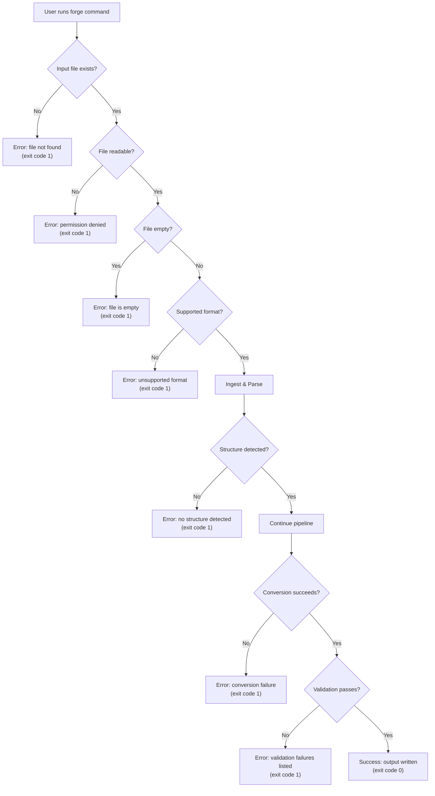
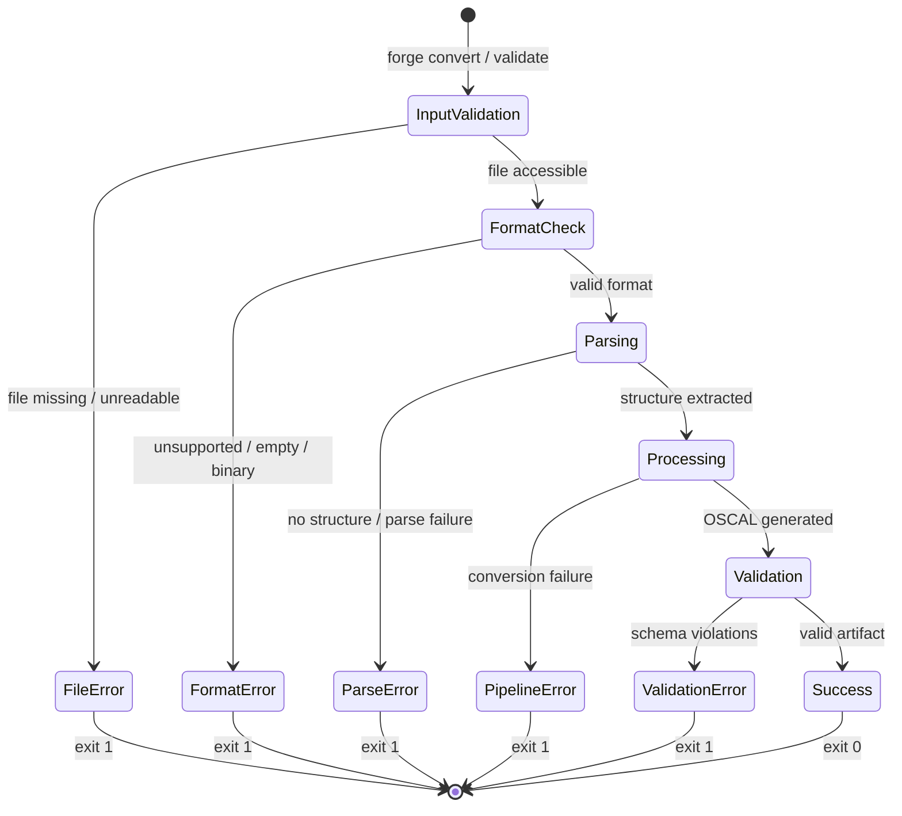
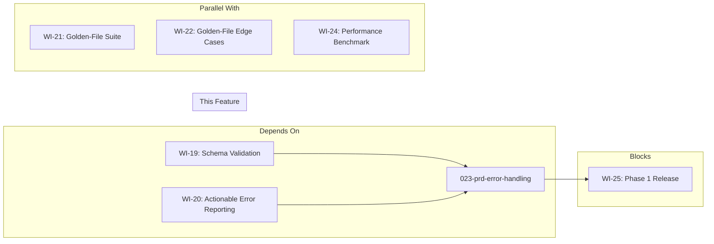

# 023-prd-error-handling

> **Document Type:** Product Requirements Document
> **Audience:** LLM agents, human reviewers
> **Status:** Draft
> **Last Updated:** 2026-02-10 <!-- @auto -->
> **Owner:** Brian Luby <!-- @human-required -->

**Feature Branch**: `023-error-handling`
**Created**: 2026-02-10
**Status**: Draft
**Input**: Derived from FORGE Product Roadmap WI-23

---

## Review Tier Legend

| Marker | Tier | Speckit Behavior |
|--------|------|------------------|
| 🔴 `@human-required` | Human Generated | Prompt human to author; blocks until complete |
| 🟡 `@human-review` | LLM + Human Review | LLM drafts → prompt human to confirm/edit; blocks until confirmed |
| 🟢 `@llm-autonomous` | LLM Autonomous | LLM completes; no prompt; logged for audit |
| ⚪ `@auto` | Auto-generated | System fills (timestamps, links); no prompt |

---

## Document Completion Order

> ⚠️ **For LLM Agents:** Complete sections in this order. Do not fill downstream sections until upstream human-required inputs exist.

1. **Context** (Background, Scope) → requires human input first
2. **Problem Statement & User Scenarios** → requires human input
3. **Requirements** (Must/Should/Could/Won't) → requires human input
4. **Technical Constraints** → human review
5. **Diagrams, Data Model, Interface** → LLM can draft after above exist
6. **Acceptance Criteria** → derived from requirements
7. **Everything else** → can proceed

---

## Context

### Background 🔴 `@human-required`
This PRD covers **WI-23: Error Handling & Robustness** from the FORGE Product Roadmap (Sprint S-23, Aug 4–8 2026, Theme T-3: Validation & Quality, Milestone MS-4). By Sprint 23, the entire FORGE pipeline — ingestion, parsing, atomization, OSCAL generation, schema validation, and golden-file testing — is functionally complete. However, the pipeline may still panic, produce unhelpful error messages, or exit with status code 0 on failure when encountering unexpected, malformed, or adversarial inputs. This work item is a hardening pass across the entire codebase, ensuring that every error path produces a descriptive, user-actionable message, exits with a non-zero status code, and never panics regardless of input. This directly addresses edge cases EC-1 through EC-10 from the parent PRD. WI-19 and WI-20 (schema validation with actionable error reporting) provide the error framework and patterns that this work item extends to all remaining error paths across the pipeline.

### Scope Boundaries 🟡 `@human-review`

**In Scope:**
- Auditing all pipeline stages (ingest, parse, atomize, model, OSCAL generation, validation, export) for unhandled error paths
- Replacing any remaining `.unwrap()` or `.expect()` calls in production code with proper error propagation
- Ensuring all `ForgeError` variants produce descriptive, user-facing messages that guide the user toward resolution
- Implementing non-zero exit codes for all CLI error conditions
- Graceful handling of malformed input: empty files, binary files, extremely large files, files with no detectable structure
- Graceful handling of filesystem errors: missing files, permission denied, unreadable files, invalid paths
- Ensuring no panics occur on any input, including adversarial inputs
- Adding adversarial input tests: empty files, binary files, huge files, files with no headings, files with only whitespace
- Extending error context with `.context()` / `.with_context()` throughout the pipeline

**Out of Scope:**
- Adding new error variants for features not yet implemented (XML/YAML output, Profile generation) — deferred to WI-26+
- Performance optimization of error paths — deferred to WI-24 (performance benchmarking)
- Rich terminal diagnostics (miette integration for source-annotated errors) — may be adopted but full integration deferred to WI-25 (CLI polish)
- Logging and observability instrumentation — addressed as part of broader observability work
- Changing the fundamental error type architecture established in WI-1 and WI-19/WI-20

### Glossary 🟡 `@human-review`

| Term | Definition |
|------|------------|
| Panic | A Rust runtime failure that unwinds the stack and terminates the process with an error message; unacceptable in production code |
| Exit Code | The integer status returned by a CLI process; 0 indicates success, non-zero indicates failure |
| `thiserror` | Rust crate for deriving structured, composable error types with Display implementations |
| `.context()` | Method from `anyhow` (or similar) that adds descriptive context to an error as it propagates up the call stack |
| Adversarial Input | Intentionally malformed, unexpected, or extreme input designed to test robustness (empty files, binary data, huge files) |
| Graceful Failure | An error condition that is caught, reported with a descriptive message, and results in a clean non-zero exit — not a panic or crash |
| Error Variant | A named case in a Rust error enum, carrying structured data about the specific failure |
| User-Actionable Message | An error message that tells the user what went wrong and, where possible, how to fix it |

### Related Documents ⚪ `@auto`

| Document | Link | Relationship |
|----------|------|--------------|
| Parent PRD | docs/FORGE_PRD.md | Parent requirements; EC-1 through EC-10 edge cases |
| Product Roadmap | docs/FORGE_PRODUCT_ROADMAP.md | Sprint S-23 context |
| Product Vision | docs/FORGE_PRODUCT_VISION.md | Strategic goal G-1 |
| Constitution | .specify/memory/constitution.md | Principle VIII (error handling), principle X (simplicity) |
| Schema Validation PRD | docs/PRD/019-prd-schema-validation.md | Error framework established in WI-19 |
| Actionable Error Reporting PRD | docs/PRD/020-prd-actionable-error-reporting.md | Error reporting patterns established in WI-20 |
| Project Scaffolding PRD | docs/PRD/001-prd-project-scaffolding.md | Initial error types defined in WI-1 |

---

## Problem Statement 🔴 `@human-required`

After completing the core pipeline (WI-1 through WI-18) and schema validation (WI-19, WI-20), FORGE can successfully convert well-formed policy documents to valid OSCAL artifacts. However, real-world usage exposes the pipeline to inputs that deviate from the happy path: missing files, empty documents, binary files mistakenly passed as input, policy documents with no detectable structure, permission errors, and extremely large files. Without a systematic hardening pass, these conditions may cause panics (crashing with an opaque Rust backtrace), silent failures (exit code 0 with no output), or unhelpful error messages that leave the user unable to diagnose or fix the problem.

This work item performs a comprehensive audit and hardening of every error path across the pipeline, ensuring that FORGE behaves predictably and helpfully regardless of what input it receives. Every error must produce a descriptive message guiding the user toward resolution, and every failure must result in a non-zero exit code. No input — no matter how malformed or adversarial — should ever cause a panic.

---

## User Scenarios & Testing 🔴 `@human-required`

### User Story 1 — Missing or Unreadable Input File (Priority: P1)

A user runs `forge convert` with a path to a file that does not exist or cannot be read.

> As a user of FORGE, I want a clear error message when my input file is missing or unreadable so that I can fix the file path or permissions and retry.

**Why this priority**: This is the most common error scenario — typos in file paths, files moved or deleted, or permission issues. Users encounter this before any pipeline logic executes.

**Independent Test**: Run `forge convert nonexistent.md --strategy catalog --format json` and verify a descriptive error is printed and the exit code is non-zero.

**Acceptance Scenarios**:
1. **Given** a file path that does not exist, **When** running `forge convert nonexistent.md`, **Then** the CLI prints an error message containing the file path and indicating the file was not found, and exits with a non-zero status code.
2. **Given** a file that exists but is not readable (permission denied), **When** running `forge convert restricted.md`, **Then** the CLI prints an error message indicating permission was denied for the specific file, and exits with a non-zero status code.

---

### User Story 2 — Malformed or Unstructured Input (Priority: P1)

A user passes an empty file, a binary file, or a document with no detectable structure to `forge convert`.

> As a user of FORGE, I want a clear error message when my input document cannot be parsed or has no recognizable structure so that I understand why conversion failed and what kind of input is expected.

**Why this priority**: After file access errors, structural parsing failures are the next most common class. Users need to understand that FORGE requires structured documents with headings and clauses.

**Independent Test**: Run `forge convert empty.md --strategy catalog --format json` with a zero-byte file and verify a descriptive error about no structure detected.

**Acceptance Scenarios**:
1. **Given** a zero-byte (empty) file, **When** running `forge convert empty.md`, **Then** the CLI prints an error indicating the file is empty and exits with a non-zero status code.
2. **Given** a binary file (e.g., a JPEG), **When** running `forge convert image.jpg`, **Then** the CLI prints an error indicating the file is not a supported document format and exits with a non-zero status code.
3. **Given** a text file with no headings, numbered clauses, or recognizable policy structure, **When** running `forge convert plain.txt`, **Then** the CLI prints an error indicating no policy structure was detected, with guidance on expected document format.

---

### User Story 3 — Validation Errors Are Comprehensive (Priority: P1)

A user runs `forge validate` on a malformed OSCAL artifact and expects all errors to be reported, not just the first one.

> As a user of FORGE, I want all validation errors reported at once so that I can fix them in a single pass rather than iterating through errors one at a time.

**Why this priority**: Reporting only the first error forces tedious fix-validate-fix cycles. Comprehensive reporting is essential for usability.

**Independent Test**: Run `forge validate` on an artifact with multiple schema violations and verify all violations are listed in the output.

**Acceptance Scenarios**:
1. **Given** an OSCAL artifact with three schema violations, **When** running `forge validate broken.json`, **Then** all three violations are reported with field locations and descriptions, and the exit code is non-zero.
2. **Given** an OSCAL artifact with both schema errors and semantic warnings, **When** running `forge validate artifact.json`, **Then** both categories of issues are reported, clearly distinguished.

---

### User Story 4 — No Panics on Any Input (Priority: P1)

A developer or CI system runs FORGE against a corpus of adversarial inputs and no panics occur.

> As a developer maintaining FORGE, I want assurance that no input can cause a panic so that FORGE is safe to run in automated pipelines and on untrusted input.

**Why this priority**: Panics in production are unacceptable per the constitution. A panic produces an opaque backtrace instead of a user-friendly message, and may indicate memory safety or logic issues.

**Independent Test**: Run FORGE against a test corpus of adversarial inputs (empty files, binary files, 100MB files, files with only null bytes, files with no newlines) and verify zero panics.

**Acceptance Scenarios**:
1. **Given** a suite of adversarial input files, **When** running `forge convert` on each, **Then** every invocation either succeeds or exits with a descriptive error and non-zero status code — no panics occur.
2. **Given** a binary file passed as input, **When** running `forge convert binary.bin`, **Then** the process exits cleanly with an error message, not a panic.

---

### User Story 5 — Non-Zero Exit Codes for All Errors (Priority: P1)

A CI/CD pipeline or script depends on FORGE exit codes to detect failures.

> As a CI pipeline operator, I want FORGE to return non-zero exit codes for all error conditions so that my automation can reliably detect failures.

**Why this priority**: Exit codes are the standard mechanism for programmatic error detection. A zero exit code on failure causes silent failures in automation.

**Independent Test**: Run `forge convert` and `forge validate` with various invalid inputs and verify the exit code is non-zero in every error case.

**Acceptance Scenarios**:
1. **Given** any error condition (missing file, parse failure, validation failure, no structure detected), **When** FORGE exits, **Then** the exit code is non-zero.
2. **Given** a successful conversion, **When** FORGE exits, **Then** the exit code is 0.

---

## Assumptions & Risks 🟡 `@human-review`

### Assumptions
- [A-1] WI-19 and WI-20 have established the `ForgeError` enum and error reporting patterns that this work item extends.
- [A-2] The golden-file test suite (WI-21, WI-22) has identified the known edge cases that need error handling.
- [A-3] The existing error types from WI-1 scaffolding are sufficient in structure; this work item adds variants and improves messages, not a fundamental redesign.
- [A-4] Adversarial input testing does not require fuzzing infrastructure — manual test corpus is sufficient for this sprint.

### Risks
| ID | Risk | Likelihood | Impact | Mitigation |
|----|------|------------|--------|------------|
| R-1 | Hidden `.unwrap()` or `.expect()` calls in dependencies cause panics despite hardening | Low | Med | Audit direct dependencies for panic paths; wrap external calls in `catch_unwind` only as last resort |
| R-2 | Error messages become too verbose or technical for non-developer users | Med | Low | Follow pattern: "what happened" + "what to do about it"; review messages with user persona in mind |
| R-3 | Hardening pass reveals deeper structural issues requiring refactoring | Low | Med | Scope to error handling only; log refactoring needs as follow-up tasks for WI-25 |

---

## Feature Overview

### Flow Diagram 🟡 `@human-review`



### State Diagram (if applicable) 🟡 `@human-review`



---

## Requirements

### Must Have (M) — MVP, launch blockers 🔴 `@human-required`
- [ ] **M-1:** The CLI shall exit with a non-zero status code for every error condition, including but not limited to: missing files, unreadable files, empty files, unsupported formats, no structure detected, conversion failures, and validation failures.
- [ ] **M-2:** Every error message shall be descriptive and user-actionable, containing: (a) what went wrong, (b) which input or operation caused the error, and (c) where applicable, guidance on how to fix it.
- [ ] **M-3:** The CLI shall never panic on any input, including adversarial inputs such as empty files, binary files, extremely large files, files with only null bytes, and files with no recognizable structure.
- [ ] **M-4:** All `.unwrap()` and `.expect()` calls in production (non-test) code shall be audited and replaced with proper error propagation using `?` and `ForgeError` variants, except where the invariant is provably upheld and documented with a comment.
- [ ] **M-5:** All error paths shall use `.context()` or `.with_context()` to attach call-site information describing the operation that failed.
- [ ] **M-6:** When the input file does not exist, the error message shall include the file path and indicate the file was not found (addresses parent PRD EC-9).
- [ ] **M-7:** When the input file is empty (zero bytes), the error message shall indicate the file is empty and suggest providing a non-empty document.
- [ ] **M-8:** When no policy structure is detected in the input (no headings, no clauses), the error message shall indicate no structure was found and describe the expected document format (addresses parent PRD EC-1).
- [ ] **M-9:** When `forge validate` encounters multiple schema or semantic errors, all errors shall be reported — not just the first one (addresses parent PRD EC-10).
- [ ] **M-10:** An adversarial input test suite shall exist covering at minimum: empty files, binary files, files exceeding 10MB, files with only whitespace, files with only null bytes, and files with no newlines.

### Should Have (S) — High value, not blocking 🔴 `@human-required`
- [ ] **S-1:** Error messages for file system errors shall distinguish between "not found", "permission denied", "is a directory", and other I/O error kinds.
- [ ] **S-2:** When a binary file is passed as input, the error message shall indicate the file appears to be binary and is not a supported document format.
- [ ] **S-3:** When an extremely large file is passed as input (exceeding a configurable threshold, default 50MB), the CLI shall emit a warning or error before attempting to process it.
- [ ] **S-4:** Exit codes shall use distinct non-zero values for different error categories (e.g., 1 for input errors, 2 for parse errors, 3 for validation errors) to enable programmatic error classification.

### Could Have (C) — Nice to have, if time permits 🟡 `@human-review`
- [ ] **C-1:** Error messages could include a `hint:` line with a concrete suggestion (e.g., `hint: check that the file path is correct` or `hint: ensure the document has Markdown headings`).
- [ ] **C-2:** A `--strict` flag could cause warnings (e.g., missing metadata, advisory-only content) to be treated as errors with non-zero exit.
- [ ] **C-3:** Error output could be formatted with color (red for errors, yellow for warnings) when the terminal supports it, with `--no-color` to disable.

### Won't Have (W) — Explicitly deferred 🟡 `@human-review`
- [ ] **W-1:** Full `miette` integration with source-annotated error reports — *Reason: Rich diagnostic rendering is a polish concern deferred to WI-25 (CLI polish)*
- [ ] **W-2:** Error handling for XML/YAML output paths — *Reason: Those formats are not yet implemented; deferred to WI-26 through WI-28*
- [ ] **W-3:** Error handling for Profile generation — *Reason: Profile generation is deferred to WI-30+*
- [ ] **W-4:** Fuzz testing infrastructure — *Reason: Manual adversarial corpus is sufficient for this sprint; property-based fuzzing can be added later*
- [ ] **W-5:** Structured JSON error output for machine consumption — *Reason: Deferred to future API/CI integration work*

---

## Technical Constraints 🟡 `@human-review`

- **Language/Framework:** Rust (latest stable), Cargo build system
- **Error Handling:** `thiserror` for library error types with meaningful variants; `anyhow` permitted only in the binary crate (per constitution principle VIII)
- **Context Propagation:** `.context()` / `.with_context()` from `anyhow` for adding call-site information in the binary crate
- **No Panics:** Zero `.unwrap()` in production code paths without a documented, provable invariant; `#[cfg(test)]` blocks are exempt
- **Exit Codes:** `std::process::exit()` or `main() -> Result<(), ...>` pattern with `process::ExitCode` for non-zero status
- **Linting:** `cargo clippy -- -D warnings` must pass (per constitution quality gates)
- **Formatting:** `cargo fmt --check` must produce no changes (per constitution quality gates)
- **Testing:** `cargo test` must pass; adversarial input tests must be included
- **Constitution Compliance:** Principle VIII (thiserror, meaningful variants, .context()); principle X (simplicity — error messages should be clear, not clever)

---

## Data Model (if applicable) 🟡 `@human-review`

No new data model is introduced in this work item. This work item extends existing `ForgeError` variants with improved messages and adds new variants as needed for previously unhandled error conditions.

### Error Variant Coverage

| Error Condition | Expected ForgeError Variant | User-Facing Message Pattern |
|----------------|---------------------------|----------------------------|
| File not found | `Io` / `FileNotFound` | `Error: file not found: {path}` |
| Permission denied | `Io` / `PermissionDenied` | `Error: permission denied: {path}` |
| Empty file | `Parse` / `EmptyInput` | `Error: file is empty: {path}` |
| Binary file | `Parse` / `UnsupportedFormat` | `Error: file appears to be binary, not a supported document format: {path}` |
| No structure detected | `Parse` / `NoStructure` | `Error: no policy structure detected in {path} (expected Markdown headings or numbered clauses)` |
| Conversion failure | `Convert` / `Pipeline` | `Error: conversion failed: {details}` |
| Schema validation failure | `Validation` | `Error: OSCAL validation failed ({count} errors): ...` |
| File too large | `Io` / `FileTooLarge` | `Warning: file exceeds {threshold}: {path} ({actual_size})` |

---

## Interface Contract (if applicable) 🟡 `@human-review`

```rust
// Extended ForgeError variants (additions to existing enum)
// Exact variant names and structure to be determined by implementation,
// consistent with patterns established in WI-19/WI-20.

use thiserror::Error;
use std::path::PathBuf;

#[derive(Debug, Error)]
pub enum ForgeError {
    #[error("File not found: {path}")]
    FileNotFound { path: PathBuf },

    #[error("Permission denied: {path}")]
    PermissionDenied { path: PathBuf },

    #[error("File is empty: {path}")]
    EmptyInput { path: PathBuf },

    #[error("Unsupported file format (appears to be binary): {path}")]
    UnsupportedFormat { path: PathBuf },

    #[error("No policy structure detected in {path} — expected Markdown headings or numbered clauses")]
    NoStructureDetected { path: PathBuf },

    #[error("File exceeds size limit ({actual_size} bytes, limit: {limit} bytes): {path}")]
    FileTooLarge {
        path: PathBuf,
        actual_size: u64,
        limit: u64,
    },

    #[error("Parse error in {path}: {message}")]
    Parse { path: PathBuf, message: String },

    #[error("OSCAL validation failed ({count} error(s))")]
    Validation {
        count: usize,
        errors: Vec<ValidationDetail>,
    },

    #[error(transparent)]
    Io(#[from] std::io::Error),
}

// Exit code conventions
// 0 — success
// 1 — input/file system error (file not found, permission denied, empty, binary)
// 2 — parse/structure error (no structure detected, parse failure)
// 3 — validation error (schema violations)
// 1 — general/unexpected error (fallback)
```

---

## Evaluation Criteria 🟡 `@human-review`

| Criterion | Weight | Metric | Target | Notes |
|-----------|--------|--------|--------|-------|
| Zero panics | Critical | Panics triggered by adversarial test corpus | 0 | Tested with empty, binary, huge, null-byte, no-newline files |
| Non-zero exit codes | Critical | Error scenarios returning exit code 0 | 0 | Every error path must return non-zero |
| Descriptive messages | Critical | Error messages containing actionable guidance | 100% | Audit all ForgeError Display implementations |
| Context propagation | High | Error paths using .context() | >90% | Audit all `?` propagation sites in pipeline |
| Unwrap audit | High | `.unwrap()` calls in production code without documented invariant | 0 | `cargo clippy` + manual audit |

---

## Tool/Approach Candidates 🟡 `@human-review`

| Option | License | Pros | Cons | Spike Result |
|--------|---------|------|------|--------------|
| `thiserror` (already in use) | MIT/Apache-2.0 | Structured error types, derives Display/Error | None — already adopted | Selected per constitution |
| `anyhow` (already in use for binary) | MIT/Apache-2.0 | `.context()` for call-site info, clean `main()` return | Not for library crates | Selected per constitution |
| `miette` (for rich diagnostics) | Apache-2.0 | Source-annotated errors, colored output, help text | Adds complexity; full integration deferred | Evaluate for C-1/C-3; defer full adoption to WI-25 |
| `std::process::ExitCode` | std | Standard library, no dependency | Requires Rust 1.61+ | Preferred for exit codes |

### Selected Approach 🔴 `@human-required`
> **Decision:** Extend existing `thiserror`-based `ForgeError` enum with new variants for unhandled conditions; use `anyhow::Context` for `.context()` propagation in the binary crate; use `std::process::ExitCode` or matched exit codes from `main()`.
> **Rationale:** This approach builds on the error infrastructure already established in WI-1 and WI-19/WI-20, requires no new dependencies, and aligns with constitution principle VIII. Systematic audit-and-fix is lower risk than error system redesign.

---

## Acceptance Criteria 🟡 `@human-review`

| AC ID | Requirement | User Story | Given | When | Then |
|-------|-------------|------------|-------|------|------|
| AC-1 | M-1 | US-5 | Any error condition in the pipeline | FORGE exits | The exit code is non-zero |
| AC-2 | M-2 | US-1, US-2 | Any error condition | Viewing the error output | The message describes what went wrong, which input caused it, and how to fix it |
| AC-3 | M-3 | US-4 | Adversarial input corpus (empty, binary, huge, null-byte files) | Running `forge convert` on each | No panics occur; all invocations exit cleanly |
| AC-4 | M-4 | US-4 | Production source code | Auditing for `.unwrap()` / `.expect()` | Zero instances without documented, provable invariant |
| AC-5 | M-5 | US-1, US-2 | Error propagated through multiple pipeline stages | Viewing the error output | Context from each stage is included in the error chain |
| AC-6 | M-6, EC-9 | US-1 | A nonexistent file path | Running `forge convert nonexistent.md` | Error message includes the file path and "not found" |
| AC-7 | M-7 | US-2 | A zero-byte file | Running `forge convert empty.md` | Error message indicates the file is empty |
| AC-8 | M-8, EC-1 | US-2 | A file with no headings or structure | Running `forge convert flat.txt` | Error message indicates no structure was detected and describes expected format |
| AC-9 | M-9, EC-10 | US-3 | An OSCAL artifact with 3 schema violations | Running `forge validate broken.json` | All 3 violations are reported with locations |
| AC-10 | M-10 | US-4 | Adversarial test suite in the test directory | Running `cargo test` | All adversarial input tests pass with no panics |

### Edge Cases 🟢 `@llm-autonomous`
- [ ] **EC-1:** (M-3) When the input is a zero-byte file, then the CLI exits with a descriptive "file is empty" error and non-zero exit code — no panic.
- [ ] **EC-2:** (M-3) When the input is a binary file (e.g., PNG, EXE), then the CLI exits with a descriptive "unsupported format" error and non-zero exit code — no panic.
- [ ] **EC-3:** (M-3) When the input file is extremely large (>50MB), then the CLI either processes it or exits with a descriptive size warning/error — no panic or OOM crash.
- [ ] **EC-4:** (M-3) When the input file contains only null bytes, then the CLI exits with a descriptive error — no panic.
- [ ] **EC-5:** (M-3) When the input file contains only whitespace (spaces, tabs, newlines), then the CLI exits with a "no structure detected" error — no panic.
- [ ] **EC-6:** (M-3) When the input file has no newline characters (single extremely long line), then the CLI handles it gracefully — no panic.
- [ ] **EC-7:** (M-1) When `forge convert` is run with a directory path instead of a file, then the CLI exits with a descriptive "is a directory, not a file" error.
- [ ] **EC-8:** (M-6) When the input path contains Unicode characters, then the error message correctly displays the path.
- [ ] **EC-9:** (M-9) When `forge validate` receives a file that is not valid JSON, then a descriptive "invalid JSON" error is returned — not a panic.
- [ ] **EC-10:** (S-1) When a file exists but has its permissions revoked between existence check and read, then the CLI handles the race gracefully with a descriptive error.

---

## Dependencies 🟡 `@human-review`



- **Requires:** WI-19 (schema validation provides error framework), WI-20 (actionable error reporting establishes patterns)
- **Parallel With:** WI-21 (golden-file tests), WI-22 (golden-file edge cases), WI-24 (performance benchmark)
- **Blocks:** WI-25 (Phase 1 integration testing and v0.1.0 release prep)
- **External:** None — all dependencies are internal

---

## Security Considerations 🟡 `@human-review`

| Aspect | Assessment | Notes |
|--------|------------|-------|
| Internet Exposure | No | CLI tool, no network services |
| Sensitive Data | Low | Error messages must not leak internal file system paths beyond the user-provided input path |
| Authentication Required | No | Local CLI tool |
| Security Review Required | Yes | Error handling is a security boundary: malformed input must not cause panics, buffer overflows, or information leakage |

Additional security notes:
- Error messages must not expose internal module structure, stack traces, or absolute system paths beyond what the user provided as input.
- Adversarial input testing (binary files, huge files, null bytes) is a form of security testing — ensuring the parser does not crash or behave unpredictably on malicious input.
- The `.unwrap()` audit is a security measure: unhandled panics in Rust can leak state or produce denial-of-service conditions.

---

## Implementation Guidance 🟢 `@llm-autonomous`

### Suggested Approach

1. **Audit Phase**: Systematically audit every `.unwrap()`, `.expect()`, and `panic!()` call in production code (`src/` excluding `#[cfg(test)]` blocks). For each, either (a) replace with `?` and a `ForgeError` variant, or (b) document why the invariant is provably upheld.

2. **Error Variant Expansion**: Add new `ForgeError` variants for conditions not yet covered: `EmptyInput`, `UnsupportedFormat`, `NoStructureDetected`, `FileTooLarge`. Ensure each variant's `Display` implementation produces a user-actionable message.

3. **Context Propagation**: Walk through each pipeline stage (ingest, parse, atomize, generate, validate, export) and add `.context("while ingesting {path}")` or equivalent at stage boundaries, so errors carry the full chain of what was being attempted.

4. **Exit Code Mapping**: In `main()`, match on error types and map to distinct exit codes. Use a helper function or match arm to translate `ForgeError` variants to exit code integers.

5. **Adversarial Test Suite**: Create test fixtures in the test directory:
   - `empty.md` — zero bytes
   - `binary.bin` — binary content (e.g., PNG header bytes)
   - `null_bytes.bin` — file filled with null bytes
   - `whitespace_only.md` — only spaces, tabs, newlines
   - `no_newlines.md` — single long line of text with no newlines
   - `large_file.md` — file exceeding 10MB (generated in test setup)
   - Write integration tests that run `forge convert` on each and assert: no panic, non-zero exit code, descriptive error message.

6. **Regression Guard**: Add a CI step or clippy lint configuration that flags new `.unwrap()` calls in production code.

### Anti-patterns to Avoid
- **Catch-all error messages**: Do not use generic "An error occurred" messages. Every message must specify what failed and why.
- **Swallowing errors**: Do not silently ignore errors with `let _ = ...` or `.ok()` unless the failure is genuinely inconsequential and documented.
- **Panic-based error handling**: Do not use `panic!()`, `todo!()`, or `unimplemented!()` in production code paths. Replace with proper `ForgeError` variants.
- **Over-engineering exit codes**: Start with simple distinct values (1, 2, 3). Do not build a complex exit code taxonomy that is hard to remember.
- **Exposing internals in messages**: Error messages should reference user-visible concepts (file paths, document structure) not internal module names or Rust type names.

### Reference Examples
- Constitution principle VIII error pattern: `.specify/memory/constitution.md`
- thiserror documentation: https://docs.rs/thiserror/latest/thiserror/
- anyhow context documentation: https://docs.rs/anyhow/latest/anyhow/trait.Context.html

---

## Spike Tasks 🟡 `@human-review`

N/A — No spike tasks for this work item. The error handling patterns are established in WI-19/WI-20, and the implementation is a systematic audit-and-fix pass, not an exploratory investigation.

---

## Success Metrics 🔴 `@human-required`

| Metric | Baseline | Target | Measurement Method |
|--------|----------|--------|-------------------|
| Panics on adversarial input | Unknown (not yet tested) | 0 | Adversarial test suite |
| Error conditions returning exit code 0 | Unknown | 0 | Integration test suite |
| `.unwrap()` in production code | Unknown (needs audit) | 0 (or documented invariants only) | `cargo clippy` + grep audit |
| Error messages with actionable guidance | Partial | 100% | Manual review of all ForgeError Display impls |

### Technical Verification 🟢 `@llm-autonomous`
| Metric | Target | Verification Method |
|--------|--------|---------------------|
| Adversarial test suite passes | 100% | `cargo test` — all adversarial input tests green |
| No clippy warnings | 0 | `cargo clippy -- -D warnings` |
| No formatting violations | 0 | `cargo fmt --check` |
| All existing tests still pass | 100% | `cargo test` — no regressions from error handling changes |
| `.unwrap()` audit clean | 0 unreviewed instances | `grep -rn '\.unwrap()' src/ --include='*.rs'` excluding test blocks |

---

## Definition of Ready 🔴 `@human-required`

### Readiness Checklist
- [x] Problem statement reviewed and validated by stakeholder
- [x] All Must Have requirements have acceptance criteria
- [x] Technical constraints are explicit and agreed
- [x] Dependencies identified and owners confirmed (WI-19, WI-20 must be complete)
- [x] Security review completed (adversarial input testing documented)
- [x] No open questions blocking implementation

### Sign-off
| Role | Name | Date | Decision |
|------|------|------|----------|
| Product Owner | Brian Luby | YYYY-MM-DD | [Ready / Not Ready] |

---

## Changelog ⚪ `@auto`

| Version | Date | Author | Changes |
|---------|------|--------|---------|
| 0.1 | 2026-02-10 | LLM (Claude) | Initial draft derived from FORGE Product Roadmap WI-23 |

---

## Decision Log 🟡 `@human-review`

| Date | Decision | Rationale | Alternatives Considered |
|------|----------|-----------|------------------------|
| 2026-02-10 | Extend existing ForgeError enum rather than redesigning error system | WI-19/WI-20 established the error framework; this work item is a hardening pass, not an architecture change | Full error system redesign — rejected as unnecessary scope expansion |
| 2026-02-10 | Use distinct exit codes for error categories (1=input, 2=parse, 3=validation) | Enables programmatic error classification in CI/CD pipelines and scripts | Single non-zero exit code for all errors — rejected as less useful for automation |
| 2026-02-10 | Manual adversarial test corpus over fuzz testing | Sufficient coverage for known edge cases within sprint scope; fuzzing infrastructure deferred | cargo-fuzz integration — rejected as too much infrastructure for this sprint |
| 2026-02-10 | Defer full miette integration to WI-25 | Source-annotated rich diagnostics are a polish concern; this sprint focuses on correctness of error paths | Full miette adoption now — rejected as scope creep for a hardening sprint |

---

## Open Questions 🟡 `@human-review`

No open questions for this work item. The error handling patterns are established by WI-19/WI-20, and the scope is well-defined as a systematic audit and hardening pass.

---

## Review Checklist 🟢 `@llm-autonomous`

Before marking as Approved:
- [x] All requirements have unique IDs (M-1 through M-10, S-1 through S-4, C-1 through C-3, W-1 through W-5)
- [x] All Must Have requirements have linked acceptance criteria
- [x] User stories are prioritized and independently testable
- [x] Acceptance criteria reference both requirement IDs and user stories
- [x] Glossary terms are used consistently throughout
- [x] Diagrams use terminology from Glossary
- [x] Security considerations documented
- [x] Definition of Ready checklist is complete
- [x] No open questions blocking implementation
