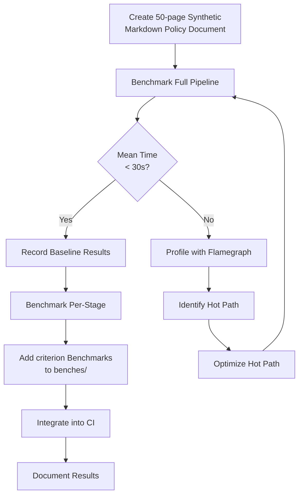
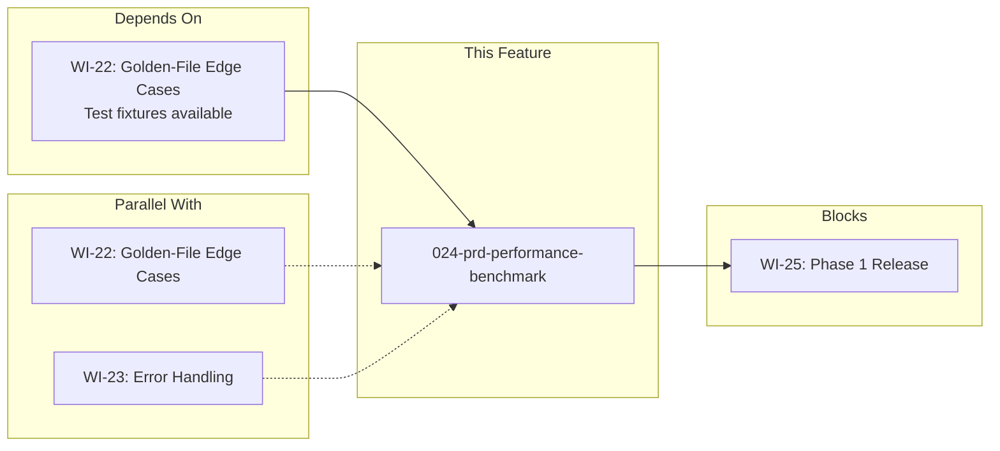

# 024-prd-performance-benchmark

> **Document Type:** Product Requirements Document
> **Audience:** LLM agents, human reviewers
> **Status:** Draft
> **Last Updated:** 2026-02-10 <!-- @auto -->
> **Owner:** Brian Luby <!-- @human-required -->

**Feature Branch**: `024-performance-benchmark`
**Created**: 2026-02-10
**Status**: Draft
**Input**: Derived from FORGE Product Roadmap WI-24

---

## Review Tier Legend

| Marker | Tier | Speckit Behavior |
|--------|------|------------------|
| 🔴 `@human-required` | Human Generated | Prompt human to author; blocks until complete |
| 🟡 `@human-review` | LLM + Human Review | LLM drafts → prompt human to confirm/edit; blocks until confirmed |
| 🟢 `@llm-autonomous` | LLM Autonomous | LLM completes; no prompt; logged for audit |
| ⚪ `@auto` | Auto-generated | System fills (timestamps, links); no prompt |

---

## Document Completion Order

> ⚠️ **For LLM Agents:** Complete sections in this order. Do not fill downstream sections until upstream human-required inputs exist.

1. **Context** (Background, Scope) → requires human input first
2. **Problem Statement & User Scenarios** → requires human input
3. **Requirements** (Must/Should/Could/Won't) → requires human input
4. **Technical Constraints** → human review
5. **Diagrams, Data Model, Interface** → LLM can draft after above exist
6. **Acceptance Criteria** → derived from requirements
7. **Everything else** → can proceed

---

## Context

### Background 🔴 `@human-required`
This PRD covers **WI-24: Performance Benchmark** from the FORGE Product Roadmap (Sprint S-24, Aug 11–15 2026, Theme T-3: Validation & Quality, Milestone MS-4). The parent PRD (docs/FORGE_PRD.md) establishes a technical constraint that "Conversion of a 50-page policy document shall complete in under 30 seconds on commodity hardware," and the evaluation criteria table lists "Conversion time (50-page doc) <30s" at Medium weight. Constitution principle VI (Performance-First Design) mandates that all hot paths be benchmarked with `criterion`, that performance regression tests run in CI, and that benchmarks be documented in the `benches/` directory. This work item creates the synthetic test fixture, instruments the full conversion pipeline with `criterion` benchmarks, verifies the <30s target on commodity hardware, and profiles/optimizes hot paths if the target is not met. Without this benchmark, Phase 1 cannot ship — WI-24 blocks WI-25 (Phase 1 release prep and v0.1.0 tagging).

### Scope Boundaries 🟡 `@human-review`

**In Scope:**
- Creating a 50-page synthetic Markdown policy document as a repeatable test fixture
- Benchmarking the full conversion pipeline end-to-end: ingest → parse → normalize → map → assemble → validate → serialize
- Benchmarking individual pipeline stages (ingest, parse, atomize, catalog assembly, validation, serialization) to identify hot paths
- Verifying the <30s conversion target on commodity hardware (defined as a single-core x86-64 system with 8 GB RAM)
- Profiling with `cargo-flamegraph` or equivalent if the target is not met
- Optimizing identified hot paths if the target is not met
- Establishing a `criterion` benchmark suite in the `benches/` directory for CI regression detection
- Documenting benchmark results (hardware, timing, memory) in the repository

**Out of Scope:**
- Benchmarking XML or YAML output — deferred to WI-26/WI-27 (Phase 2 output format expansion)
- Benchmarking Profile generation — deferred to WI-30+ (Phase 2 Profile & Tailoring)
- Memory profiling with `dhat` or `heaptrack` unless the <30s target requires memory optimization to achieve
- Benchmarking on non-commodity hardware (ARM, low-memory embedded systems)
- Performance optimization of schema validation internals (within the `jsonschema` crate itself)
- Benchmarking concurrent or batch conversion — deferred to WI-40 (Phase 3)

### Glossary 🟡 `@human-review`

| Term | Definition |
|------|------------|
| criterion | Rust crate for statistically rigorous micro-benchmarking with regression detection |
| Commodity Hardware | A standard developer workstation: single-core x86-64, 8 GB RAM, SSD storage; used as the baseline target for performance requirements |
| Hot Path | The section of the pipeline that consumes the most wall-clock time during conversion |
| Flamegraph | A visualization of profiled execution showing which functions consume the most CPU time |
| Synthetic Fixture | A programmatically generated test document designed to exercise the full pipeline at a known scale |
| Pipeline | The full FORGE conversion sequence: ingest → parse → normalize → map → assemble → validate → serialize |
| Regression Detection | Automated comparison of benchmark results against a stored baseline to detect performance degradation |

### Related Documents ⚪ `@auto`

| Document | Link | Relationship |
|----------|------|--------------|
| Parent PRD | docs/FORGE_PRD.md | Performance technical constraint and evaluation criteria |
| Product Roadmap | docs/FORGE_PRODUCT_ROADMAP.md | Sprint S-24 context, WI-24 definition |
| Product Vision | docs/FORGE_PRODUCT_VISION.md | Strategic goal G-1 |
| Constitution | .specify/memory/constitution.md | Principle VI (Performance-First Design), principle IV (TDD with criterion) |
| WI-22 PRD | docs/PRD/022-prd-golden-file-edge-cases.md | Depends on: test fixtures available from WI-22 |
| WI-25 PRD | docs/PRD/025-prd-phase1-release.md | Blocks: Phase 1 release |

---

## Problem Statement 🔴 `@human-required`

The FORGE conversion pipeline has been built incrementally across Sprints 1–23, with correctness verified through golden-file tests and edge-case handling. However, no performance measurement exists. The parent PRD commits to converting a 50-page policy document in under 30 seconds on commodity hardware — a quantitative requirement that must be verified before Phase 1 can ship. Without a benchmark, there is no evidence the target is met, no mechanism to detect performance regressions as the codebase evolves, and no data to guide optimization if the target is missed. Constitution principle VI (Performance-First Design) mandates `criterion` benchmarks for all hot paths and performance regression tests in CI. This work item closes that gap by establishing the benchmark infrastructure, measuring the current pipeline, and optimizing if necessary.

---

## User Scenarios & Testing 🔴 `@human-required`

### User Story 1 — Verify Conversion Performance (Priority: P1)

A developer or release engineer needs to verify that the full FORGE conversion pipeline meets the <30s target before tagging v0.1.0.

> As a developer preparing the Phase 1 release, I want a repeatable benchmark that measures end-to-end conversion time for a 50-page policy document so that I can verify the performance target is met and have confidence the release meets its non-functional requirements.

**Why this priority**: This is the gating criterion for Phase 1 release. The parent PRD and roadmap both require <30s conversion on commodity hardware as an exit criterion for MS-4.

**Independent Test**: Run `cargo bench --bench pipeline_benchmark` and verify the reported mean conversion time is under 30 seconds.

**Acceptance Scenarios**:
1. **Given** the 50-page synthetic Markdown policy fixture, **When** running `cargo bench --bench pipeline_benchmark`, **Then** the full pipeline (ingest → validate → serialize) completes with a mean time under 30 seconds.
2. **Given** the benchmark suite, **When** running on commodity hardware (single-core x86-64, 8 GB RAM), **Then** the 30-second target is met without special hardware or configuration.
3. **Given** a previous baseline benchmark result, **When** running the benchmark after a code change, **Then** `criterion` reports whether performance has regressed, improved, or remained stable.

---

### User Story 2 — Identify and Optimize Hot Paths (Priority: P2)

A developer discovers the <30s target is not met and needs to identify which pipeline stage is the bottleneck.

> As a developer, I want per-stage benchmark results and profiling data so that I can identify the hot path and apply targeted optimizations rather than guessing.

**Why this priority**: Optimization without measurement is guesswork. Per-stage benchmarks provide the data needed to focus effort on the actual bottleneck, consistent with constitution principle VI (profile first, then optimize).

**Independent Test**: Run `cargo bench` and inspect per-stage results (ingest, parse, atomize, catalog assembly, validation, serialization) to confirm each stage is measured independently.

**Acceptance Scenarios**:
1. **Given** the 50-page synthetic fixture, **When** running per-stage benchmarks, **Then** each pipeline stage (ingest, parse, atomize, catalog assembly, validation, serialization) reports its own mean time.
2. **Given** a flamegraph generated with `cargo-flamegraph`, **When** inspecting the profile, **Then** the top-level hot path functions are identifiable and correspond to the slowest stage(s) reported by the benchmarks.
3. **Given** an identified hot path, **When** an optimization is applied, **Then** the benchmark shows measurable improvement and the overall <30s target is met.

---

### User Story 3 — Regression Detection in CI (Priority: P2)

A developer pushes a code change that inadvertently degrades performance, and the CI pipeline catches it.

> As a developer, I want performance benchmarks integrated into CI so that performance regressions are detected automatically before they reach the main branch.

**Why this priority**: Constitution principle VI mandates performance regression tests in CI. Without CI integration, regressions can accumulate silently across sprints, making them harder to diagnose and fix.

**Independent Test**: Verify that the CI pipeline runs `cargo bench` and that `criterion` output is available in CI artifacts or logs.

**Acceptance Scenarios**:
1. **Given** the benchmark suite in the `benches/` directory, **When** the CI pipeline runs, **Then** `criterion` benchmarks execute and produce results.
2. **Given** a code change that increases conversion time by more than 10%, **When** CI runs the benchmark, **Then** `criterion` flags the regression in its output.

---

## Assumptions & Risks 🟡 `@human-review`

### Assumptions
- [A-1] The full conversion pipeline (WI-1 through WI-23) is complete and functional before WI-24 begins.
- [A-2] Test fixtures from WI-22 (golden-file edge case suite) are available and can be extended for the 50-page synthetic document.
- [A-3] "Commodity hardware" is defined as a single-core x86-64 system with 8 GB RAM and SSD storage; CI runners meet or exceed this baseline.
- [A-4] The `criterion` crate is sufficient for statistically rigorous benchmarking of the FORGE pipeline.
- [A-5] The 30-second target is for JSON output via the `--strategy catalog` path; the component definition path is expected to have similar or better performance.
- [A-6] The synthetic 50-page document is representative of real-world policy documents in structure and content density.

### Risks
| ID | Risk | Likelihood | Impact | Mitigation |
|----|------|------------|--------|------------|
| R-1 | Pipeline exceeds 30s target on commodity hardware | Low | High | Profile with flamegraph; optimize hot path (likely schema validation or serialization); if needed, defer non-critical validation to a post-export step |
| R-2 | Schema validation dominates pipeline time, but is in a third-party crate (`jsonschema`) with limited optimization options | Low | Med | Measure validation separately; if it dominates, consider lazy validation (validate on `forge validate` only, not during `forge convert`) or caching compiled schemas |
| R-3 | `criterion` benchmarks are noisy on CI runners due to shared infrastructure | Med | Low | Use `criterion`'s statistical analysis (confidence intervals, outlier detection); document that CI benchmarks are directional, not absolute |
| R-4 | 50-page synthetic document does not reflect real-world complexity (e.g., deeply nested sections, many cross-references) | Low | Med | Design the synthetic document with realistic section depth (H1–H4), numbered clauses, compound statements, citations, and tables |

---

## Feature Overview

### Flow Diagram 🟡 `@human-review`



### State Diagram (if applicable) 🟡 `@human-review`
N/A — No state transitions in this work item. The benchmark is a measurement and verification activity.

---

## Requirements

### Must Have (M) — MVP, launch blockers 🔴 `@human-required`
- [ ] **M-1:** A 50-page synthetic Markdown policy document shall be created as a test fixture in the repository, containing realistic section hierarchy (H1–H4), numbered clauses, compound statements, citations, and tables.
- [ ] **M-2:** A `criterion` benchmark shall measure the full conversion pipeline end-to-end (ingest → parse → normalize → map → assemble → validate → serialize) for the 50-page fixture, producing a mean conversion time.
- [ ] **M-3:** The full pipeline benchmark shall complete with a mean time under 30 seconds on commodity hardware (single-core x86-64, 8 GB RAM, SSD).
- [ ] **M-4:** Benchmark results (hardware description, mean time, standard deviation, throughput) shall be documented in the repository.
- [ ] **M-5:** The `criterion` benchmark suite shall be located in the `benches/` directory and runnable via `cargo bench`.

### Should Have (S) — High value, not blocking 🔴 `@human-required`
- [ ] **S-1:** Per-stage benchmarks shall measure each pipeline stage independently (ingest, parse, atomize, catalog assembly, validation, serialization) to identify time distribution.
- [ ] **S-2:** If the <30s target is not met initially, a flamegraph shall be generated and the dominant hot path optimized until the target is achieved.
- [ ] **S-3:** The CI pipeline shall execute `criterion` benchmarks and include results in CI artifacts or logs for regression detection.
- [ ] **S-4:** The benchmark shall also measure peak memory usage (RSS) during conversion of the 50-page fixture.

### Could Have (C) — Nice to have, if time permits 🟡 `@human-review`
- [ ] **C-1:** Benchmarks for both `--strategy catalog` and `--strategy component` conversion paths.
- [ ] **C-2:** A benchmark for documents of varying sizes (10-page, 25-page, 50-page, 100-page) to characterize performance scaling behavior.
- [ ] **C-3:** Automated CI threshold enforcement: fail CI if mean conversion time exceeds 30 seconds.

### Won't Have (W) — Explicitly deferred 🟡 `@human-review`
- [ ] **W-1:** Benchmarking XML or YAML output paths — *Reason: Deferred to WI-26/WI-27 in Phase 2*
- [ ] **W-2:** Benchmarking Profile generation — *Reason: Deferred to WI-30+ in Phase 2*
- [ ] **W-3:** Benchmarking concurrent or batch conversion — *Reason: Deferred to WI-40 in Phase 3*
- [ ] **W-4:** Detailed memory profiling with `dhat` or `heaptrack` — *Reason: Only needed if memory is identified as a bottleneck for the <30s target*

---

## Technical Constraints 🟡 `@human-review`

- **Benchmarking Framework:** `criterion` crate (per constitution principle VI, technology stack)
- **Profiling Tools:** `cargo-flamegraph` for CPU profiling if optimization is needed (per constitution principle VI)
- **Benchmark Location:** `benches/` directory at the crate or workspace root (per constitution principle VI)
- **Target Hardware:** Commodity hardware defined as single-core x86-64, 8 GB RAM, SSD storage
- **Performance Target:** <30 seconds mean conversion time for the full pipeline on the 50-page fixture (per parent PRD technical constraint)
- **Statistical Rigor:** `criterion` must run sufficient iterations for stable confidence intervals; default `criterion` configuration (100 samples) is acceptable
- **Fixture Stability:** The synthetic 50-page fixture must be deterministic (no randomized content) so benchmarks are reproducible
- **Linting:** `cargo clippy -- -D warnings` must pass (per constitution quality gates)
- **Formatting:** `cargo fmt --all` must produce no changes (per constitution quality gates)
- **Testing:** `cargo test` must pass; the benchmark fixture creation must be covered by tests (per constitution principle IV)

---

## Data Model (if applicable) 🟡 `@human-review`

N/A — No new data model is introduced in this work item. The benchmark operates on the existing `PolicyDocument` domain model and OSCAL output types established in prior work items.

---

## Interface Contract (if applicable) 🟡 `@human-review`

```rust
// Benchmark entry points (benches/ directory)

// Full pipeline benchmark
// Measures: ingest → parse → normalize → map → assemble → validate → serialize
// Input: 50-page synthetic Markdown fixture
// Output: criterion statistical report (mean, std dev, throughput)

// Per-stage benchmarks (S-1)
// fn bench_ingest(c: &mut Criterion)       — file read + format detection
// fn bench_parse(c: &mut Criterion)        — Markdown parsing + structural extraction
// fn bench_atomize(c: &mut Criterion)      — compound statement splitting + UUID generation
// fn bench_catalog_assembly(c: &mut Criterion) — domain model → OSCAL Catalog JSON builder
// fn bench_validation(c: &mut Criterion)   — OSCAL JSON schema validation
// fn bench_serialization(c: &mut Criterion) — OSCAL model → JSON string

// Synthetic fixture generator (test utility)
// fn generate_synthetic_policy(pages: usize) -> String
// Produces a deterministic Markdown policy document with:
//   - H1 title + metadata frontmatter
//   - ~50 sections (H2/H3/H4 hierarchy)
//   - ~200 numbered policy requirements
//   - ~20 compound statements (for atomization)
//   - ~30 citations/references
//   - ~10 tables
//   - Total length: ~50 pages (~25,000 words / ~150,000 characters)
```

---

## Evaluation Criteria 🟡 `@human-review`

| Criterion | Weight | Metric | Target | Notes |
|-----------|--------|--------|--------|-------|
| Conversion Time | Critical | Mean time for full pipeline on 50-page fixture | <30 seconds | Parent PRD constraint; MS-4 exit criterion |
| Benchmark Reproducibility | High | Standard deviation across runs | <10% of mean | Ensures benchmark is stable and meaningful |
| Pipeline Coverage | High | Number of pipeline stages benchmarked individually | All 6 stages | Enables targeted optimization |
| CI Integration | Medium | Benchmarks run in CI | Present in CI logs | Enables regression detection |
| Documentation | Medium | Results documented in repository | Hardware + timing + memory | Audit trail for MS-4 review |

---

## Tool/Approach Candidates 🟡 `@human-review`

| Option | License | Pros | Cons | Spike Result |
|--------|---------|------|------|--------------|
| criterion | MIT/Apache-2.0 | Industry standard for Rust benchmarks; statistical analysis; regression detection; HTML reports | Adds ~30s to CI run time per benchmark group | Selected per constitution principle VI |
| cargo-flamegraph | MIT/Apache-2.0 | Generates flamegraphs from `perf` data; integrates with cargo | Requires `perf` on Linux; not needed if <30s target met initially | Use if optimization needed |
| dhat (Rust allocator profiler) | MIT/Apache-2.0 | Tracks allocations, peak memory, allocation hot spots | Adds overhead; only useful if memory is the bottleneck | Deferred unless needed |
| cargo bench (built-in) | Rust toolchain | No extra dependency; simple | Nightly-only for built-in bench harness; less statistical rigor than criterion | Rejected: criterion is superior and stable |

### Selected Approach 🔴 `@human-required`
> **Decision:** `criterion` for benchmarking; `cargo-flamegraph` for profiling if optimization is needed.
> **Rationale:** `criterion` is mandated by the constitution technology stack (principle VI) and provides statistically rigorous measurement with regression detection. `cargo-flamegraph` is the recommended profiling tool per the constitution. This approach measures first, then optimizes only if the target is missed — consistent with principle X (Simplicity & Pragmatism).

---

## Acceptance Criteria 🟡 `@human-review`

| AC ID | Requirement | User Story | Given | When | Then |
|-------|-------------|------------|-------|------|------|
| AC-1 | M-1 | US-1 | The test fixtures directory | Inspecting for the 50-page synthetic policy fixture | A Markdown file of approximately 50 pages exists with realistic section hierarchy, numbered clauses, compound statements, citations, and tables |
| AC-2 | M-2 | US-1 | The 50-page synthetic fixture | Running `cargo bench --bench pipeline_benchmark` | `criterion` reports mean, standard deviation, and throughput for the full pipeline |
| AC-3 | M-3 | US-1 | The full pipeline benchmark result on commodity hardware | Inspecting the mean time | Mean conversion time is under 30 seconds |
| AC-4 | M-4 | US-1 | Benchmark execution complete | Inspecting the documentation | Hardware description, mean time, standard deviation, and throughput are documented in the repository |
| AC-5 | M-5 | US-1 | The `benches/` directory | Running `cargo bench` | Benchmarks execute without errors |
| AC-6 | S-1 | US-2 | The 50-page synthetic fixture | Running per-stage benchmarks | Each pipeline stage (ingest, parse, atomize, catalog assembly, validation, serialization) reports its own mean time |
| AC-7 | S-3 | US-3 | CI pipeline configuration | Pushing a code change | CI runs `criterion` benchmarks and results appear in CI artifacts or logs |

### Edge Cases 🟢 `@llm-autonomous`
- [ ] **EC-1:** (M-1) When the synthetic fixture generator is run multiple times, then the output is byte-identical (deterministic generation with no randomness).
- [ ] **EC-2:** (M-2) When the benchmark is run on a machine with significantly different performance characteristics than commodity hardware, then the benchmark still completes and reports results (it may not meet the 30s target, but it must not fail or hang).
- [ ] **EC-3:** (M-3) When the pipeline is given the 50-page fixture and the `--strategy component` path, then conversion still completes within a reasonable time (not necessarily <30s, as only catalog path is required for M-3).
- [ ] **EC-4:** (S-1) When one pipeline stage dominates (>80% of total time), then per-stage benchmarks clearly identify that stage as the hot path.
- [ ] **EC-5:** (M-1) When the synthetic fixture is used with the golden-file test harness (from WI-21/WI-22), then it produces valid OSCAL output (the fixture must be well-formed input).

---

## Dependencies 🟡 `@human-review`



- **Requires:** WI-22 (golden-file edge case suite — test fixtures and full pipeline must be working)
- **Blocks:** WI-25 (Phase 1 release — benchmark passing is an MS-4 exit criterion)
- **Parallel With:** WI-22 (golden-file edge cases), WI-23 (error handling & robustness)
- **External:** `criterion` crate (published on crates.io, stable, well-maintained); `cargo-flamegraph` (recommended tool, only needed if optimization is required)

---

## Security Considerations 🟡 `@human-review`

| Aspect | Assessment | Notes |
|--------|------------|-------|
| Internet Exposure | No | Benchmarks run locally and in CI; no network services |
| Sensitive Data | No | Synthetic fixture contains fabricated policy content, not real policies |
| Authentication Required | No | Local CLI tool; no auth needed |
| Security Review Required | N/A | No new attack surface; benchmark infrastructure is test-only code; synthetic fixture is generated deterministically with no external input |

---

## Implementation Guidance 🟢 `@llm-autonomous`

### Suggested Approach

**Phase 1: Create the Synthetic Fixture (M-1)**
Write a deterministic fixture generator function that produces a 50-page Markdown policy document. The document should include:
- A YAML frontmatter block with title, version, author, and date
- Approximately 10 H2 sections (e.g., "Access Control", "Data Protection", "Incident Response", etc.)
- Each H2 section containing 3-5 H3 subsections
- Each H3 subsection containing 3-8 numbered policy requirements using normative language ("shall", "must")
- Approximately 20 compound statements across the document ("Systems must X and must Y")
- Approximately 30 inline citations and cross-references (e.g., "[NIST SP 800-53 AC-2]", "See Section 3.2")
- Approximately 10 tables (e.g., role-responsibility matrices, retention schedules)
- Total target: ~25,000 words / ~150,000 characters (~50 printed pages at ~500 words/page)

Store the generated fixture as a static file in the test fixtures directory (e.g., `tests/fixtures/synthetic-50page-policy.md`) committed to the repository. Include a unit test that verifies the fixture file exists and has the expected approximate size.

**Phase 2: Full Pipeline Benchmark (M-2, M-3, M-5)**
Create `benches/pipeline_benchmark.rs` using `criterion`. The benchmark should:
1. Load the 50-page fixture from disk
2. Run the full conversion pipeline (ingest → parse → normalize → map → assemble → validate → serialize) as a single benchmark function
3. Use `criterion::Criterion` with default configuration (100 samples, 5s warm-up)
4. Report mean time, standard deviation, and throughput

**Phase 3: Per-Stage Benchmarks (S-1)**
Add additional `criterion` benchmark functions for each pipeline stage, using the 50-page fixture as input. Each benchmark should isolate a single stage by pre-computing the input for that stage.

**Phase 4: CI Integration (S-3)**
Add a CI step that runs `cargo bench` and stores criterion output as CI artifacts. The CI step should run after `cargo test` to avoid blocking the test pipeline.

**Phase 5: Profiling and Optimization (S-2, conditional)**
If the <30s target is not met, generate a flamegraph with `cargo flamegraph -- --bench pipeline_benchmark`, identify the dominant hot path, and apply targeted optimization. Common optimization candidates:
- Schema validation: consider caching compiled JSON schemas across runs
- Serialization: consider using `serde_json::to_writer` instead of `to_string` to avoid intermediate allocation
- Parsing: consider zero-copy parsing with `pulldown-cmark` event iteration instead of collecting into intermediate structures
- UUID generation: profile hashing overhead; likely negligible

### Anti-patterns to Avoid
- Benchmarking with a trivially small document (1 page) and extrapolating to 50 pages — non-linear costs (e.g., schema validation) will not scale linearly
- Using random or non-deterministic content in the synthetic fixture — benchmarks must be reproducible
- Optimizing before profiling — constitution principle X (Simplicity & Pragmatism) mandates measuring first
- Running benchmarks with `--release` profile disabled — benchmarks must use release-mode optimizations to reflect real-world performance
- Hardcoding absolute file paths in benchmark code — use relative paths from the workspace root
- Skipping CI integration — silent regressions accumulate and are harder to diagnose later

### Reference Examples
- criterion documentation: https://bheisler.github.io/criterion.rs/book/
- cargo-flamegraph: https://github.com/flamegraph-rs/flamegraph
- Rust Performance Book: https://nnethercote.github.io/perf-book/

---

## Spike Tasks 🟡 `@human-review`

N/A — No spike tasks for this work item. The technology choices (`criterion`, `cargo-flamegraph`) are established by the constitution and do not require evaluation. If schema validation is identified as a bottleneck, investigation of alternative validation strategies (lazy validation, schema caching) can be handled within the optimization phase of this work item.

---

## Success Metrics 🔴 `@human-required`

| Metric | Baseline | Target | Measurement Method |
|--------|----------|--------|-------------------|
| Full pipeline conversion time (50-page doc) | N/A (no benchmark exists) | <30 seconds mean | `criterion` benchmark report |
| Benchmark reproducibility | N/A | Standard deviation <10% of mean | `criterion` statistical analysis |
| Per-stage visibility | N/A | All 6 stages measured | `criterion` benchmark groups |
| CI benchmark integration | N/A | Benchmarks run in CI | CI pipeline logs/artifacts |

### Technical Verification 🟢 `@llm-autonomous`
| Metric | Target | Verification Method |
|--------|--------|---------------------|
| Synthetic fixture validity | Converts to valid OSCAL Catalog | `cargo test` with fixture-based conversion test |
| Synthetic fixture determinism | Byte-identical across generations | `cargo test` comparing two generations |
| No clippy warnings in benchmark code | 0 | `cargo clippy -- -D warnings` |
| No formatting violations in benchmark code | 0 | `cargo fmt --check` |
| Benchmark suite compiles and runs | 0 errors | `cargo bench --bench pipeline_benchmark` |

---

## Definition of Ready 🔴 `@human-required`

### Readiness Checklist
- [x] Problem statement reviewed and validated by stakeholder
- [x] All Must Have requirements have acceptance criteria
- [x] Technical constraints are explicit and agreed
- [x] Dependencies identified and owners confirmed
- [x] Security review completed (N/A documented with justification)
- [x] No open questions blocking implementation

### Sign-off
| Role | Name | Date | Decision |
|------|------|------|----------|
| Product Owner | Brian Luby | YYYY-MM-DD | [Ready / Not Ready] |

---

## Changelog ⚪ `@auto`

| Version | Date | Author | Changes |
|---------|------|--------|---------|
| 0.1 | 2026-02-10 | LLM (Claude) | Initial draft derived from FORGE Product Roadmap WI-24 |

---

## Decision Log 🟡 `@human-review`

| Date | Decision | Rationale | Alternatives Considered |
|------|----------|-----------|------------------------|
| 2026-02-10 | Use `criterion` for all benchmarks | Mandated by constitution principle VI; provides statistical rigor, regression detection, and HTML reports | Built-in `#[bench]` (nightly only, less rigorous); `iai` (instruction-count based — useful but different metric than wall-clock time) |
| 2026-02-10 | Create a static 50-page synthetic fixture rather than generating at benchmark time | Ensures byte-identical input across runs, simplifies benchmark code, and allows the fixture to also serve as a test input for golden-file testing | Runtime generation (adds overhead to benchmark warm-up; harder to reproduce); using a real policy document (licensing and sensitivity concerns) |
| 2026-02-10 | Define "commodity hardware" as single-core x86-64, 8 GB RAM, SSD | Provides a concrete, reproducible target that represents a typical developer workstation; avoids the ambiguity of undefined "commodity" | Multi-core baseline (overly generous); laptop-class ARM (not representative of typical CI or dev environments) |
| 2026-02-10 | Benchmark JSON output only (catalog strategy) for M-3 | JSON is the primary output format for Phase 1; XML/YAML are Phase 2 | Benchmark all strategies and formats (out of scope for XS work item; can be added in Phase 2) |

---

## Open Questions 🟡 `@human-review`

No open questions for this work item.

---

## Review Checklist 🟢 `@llm-autonomous`

Before marking as Approved:
- [x] All requirements have unique IDs (M-1 through M-5, S-1 through S-4, C-1 through C-3, W-1 through W-4)
- [x] All Must Have requirements have linked acceptance criteria
- [x] User stories are prioritized and independently testable
- [x] Acceptance criteria reference both requirement IDs and user stories
- [x] Glossary terms are used consistently throughout
- [x] Diagrams use terminology from Glossary
- [x] Security considerations documented (N/A justified)
- [x] Definition of Ready checklist is complete
- [x] No open questions blocking implementation
