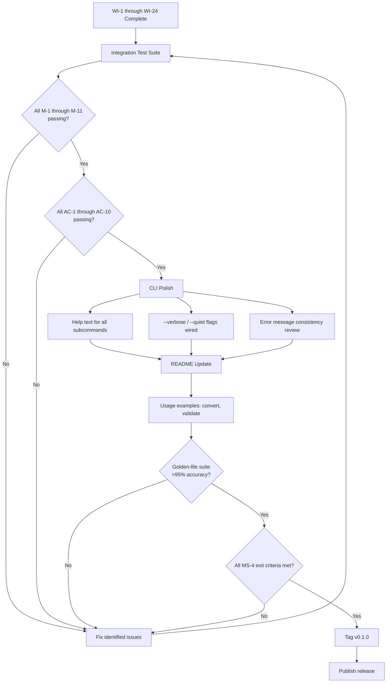
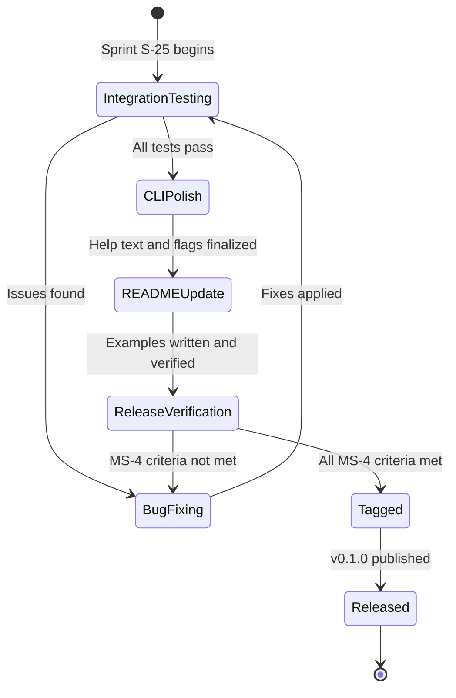

# 025-prd-phase1-release

> **Document Type:** Product Requirements Document
> **Audience:** LLM agents, human reviewers
> **Status:** Draft
> **Last Updated:** 2026-02-10 <!-- @auto -->
> **Owner:** Brian Luby <!-- @human-required -->

**Feature Branch**: `025-phase1-release`
**Created**: 2026-02-10
**Status**: Draft
**Input**: Derived from FORGE Product Roadmap WI-25

---

## Review Tier Legend

| Marker | Tier | Speckit Behavior |
|--------|------|------------------|
| :red_circle: `@human-required` | Human Generated | Prompt human to author; blocks until complete |
| :yellow_circle: `@human-review` | LLM + Human Review | LLM drafts → prompt human to confirm/edit; blocks until confirmed |
| :green_circle: `@llm-autonomous` | LLM Autonomous | LLM completes; no prompt; logged for audit |
| :white_circle: `@auto` | Auto-generated | System fills (timestamps, links); no prompt |

---

## Document Completion Order

> :warning: **For LLM Agents:** Complete sections in this order. Do not fill downstream sections until upstream human-required inputs exist.

1. **Context** (Background, Scope) → requires human input first
2. **Problem Statement & User Scenarios** → requires human input
3. **Requirements** (Must/Should/Could/Won't) → requires human input
4. **Technical Constraints** → human review
5. **Diagrams, Data Model, Interface** → LLM can draft after above exist
6. **Acceptance Criteria** → derived from requirements
7. **Everything else** → can proceed

---

## Context

### Background :red_circle: `@human-required`
This PRD covers **WI-25: Phase 1 Integration Testing, CLI Polish, and v0.1.0 Release** from the FORGE Product Roadmap (Sprint S-25, Aug 18–22 2026, Theme T-3: Validation & Quality, Milestone MS-4). This is the final work item in Phase 1 and serves as the release gate for v0.1.0. All preceding work items (WI-1 through WI-24) have built the complete Markdown-to-OSCAL pipeline: ingestion, structural extraction, domain model, requirement atomization, UUID generation, citation extraction, OSCAL Catalog generation, Component Definition generation, traceability, schema validation, golden-file testing, error handling, and performance benchmarking. WI-25 brings everything together with final integration testing to verify all Must Have requirements (M-1 through M-11) and all acceptance criteria (AC-1 through AC-10) pass end-to-end, polishes the CLI experience (help text, verbose/quiet flags, error messages), updates the README with usage examples, and tags the v0.1.0 release. This is the Phase 1 exit gate — MS-4 requires "All M-requirements passing; golden-file suite >95% accuracy; forge validate working; v0.1.0 tagged."

### Scope Boundaries :yellow_circle: `@human-review`

**In Scope:**
- Final integration testing across all Must Have requirements (M-1 through M-11) from the parent PRD
- Verification of all acceptance criteria (AC-1 through AC-10) from the parent PRD
- CLI polish: comprehensive `--help` text for all subcommands and options
- CLI polish: `--verbose` and `--quiet` global flags for controlling output verbosity
- CLI polish: consistent, descriptive error messages for all error conditions
- README update with usage examples covering `forge convert`, `forge validate`, and common workflows
- Tagging and publishing v0.1.0 release
- Verification of MS-4 exit criteria: all M-requirements passing, golden-file suite >95% accuracy, `forge validate` working, v0.1.0 tagged

**Out of Scope:**
- XML output format — deferred to WI-26 (Phase 2, Sprint S-26)
- YAML output format — deferred to WI-27 (Phase 2, Sprint S-27)
- Profile generation — deferred to WI-30 (Phase 2, Sprint S-30)
- Normative vs advisory tagging — deferred to WI-33 (Phase 2, Sprint S-33)
- Parameter extraction — deferred to WI-34 (Phase 2, Sprint S-34)
- Any Phase 2 or Phase 3 features — this is strictly a release preparation and verification sprint
- New feature development — WI-25 is integration-only; any bugs found must be fixed but no new capabilities are added

### Glossary :yellow_circle: `@human-review`

| Term | Definition |
|------|------------|
| Integration Testing | End-to-end testing that verifies the entire pipeline (ingest through export) works correctly when all components are combined |
| CLI Polish | Improvements to the command-line user experience: help text quality, flag consistency, error message clarity |
| Release Gate | A set of exit criteria that must all pass before a version can be tagged and published |
| Golden-File Test | A test that compares actual output against a pre-approved expected output file, detecting any regressions |
| v0.1.0 | The first public release of FORGE, covering all Phase 1 Must Have requirements |
| MS-4 | Milestone 4: Phase 1 complete — validated, tested, released |
| Acceptance Criteria | Specific, testable conditions derived from requirements that must be satisfied for the feature to be considered complete |

### Related Documents :white_circle: `@auto`

| Document | Link | Relationship |
|----------|------|--------------|
| Parent PRD | docs/FORGE_PRD.md | Parent requirements M-1 through M-11, AC-1 through AC-10 |
| Product Roadmap | docs/FORGE_PRODUCT_ROADMAP.md | Sprint S-25 context, MS-4 exit criteria |
| Product Vision | docs/FORGE_PRODUCT_VISION.md | Strategic goal G-1, principles P-1 through P-4 |
| Constitution | .specify/memory/constitution.md | Technical constraints and quality gates |
| WI-1 PRD | docs/PRD/001-prd-project-scaffolding.md | Foundation: CLI, module structure, error types, CI |
| WI-2 PRD | docs/PRD/002-prd-markdown-ingestion.md | Markdown file reading and format detection |
| WI-5 PRD | docs/PRD/005-prd-domain-model.md | Internal domain model structs |
| WI-7 PRD | docs/PRD/007-prd-uuid-generation.md | Deterministic UUID v5 generation |

---

## Problem Statement :red_circle: `@human-required`

After 24 sprints of incremental development, all Phase 1 pipeline components exist (ingestion, parsing, atomization, UUID generation, citation extraction, Catalog generation, Component Definition generation, traceability, schema validation, golden-file testing, error handling, and performance benchmarking). However, no comprehensive end-to-end verification has been performed across the complete pipeline with all components integrated. Individual work items were tested in isolation and incrementally, but the full system must be verified holistically before release. Additionally, the CLI user experience needs final polish — help text must be comprehensive and accurate, verbose/quiet flags must be wired through all pipeline stages, and error messages must be consistent and actionable. The README needs usage examples so users can start using FORGE immediately after installation. Without this integration testing and polish sprint, FORGE cannot be released with confidence that all 11 Must Have requirements and all 10 acceptance criteria are satisfied end-to-end, and users would encounter a tool with incomplete documentation and inconsistent CLI behavior.

---

## User Scenarios & Testing :red_circle: `@human-required`

### User Story 1 — End-to-End Catalog Conversion (Priority: P1)

A compliance engineer converts a Markdown policy document to an OSCAL Catalog and validates the output, exercising the complete Phase 1 pipeline.

> As a compliance engineer, I want to convert a Markdown policy document to a validated OSCAL Catalog in a single workflow so that I can trust the end-to-end pipeline produces correct, schema-valid output.

**Why this priority**: This is the primary value proposition of FORGE Phase 1. If the end-to-end catalog workflow does not function correctly, the release is not viable.

**Independent Test**: Run `forge convert policy.md --strategy catalog --format json --output catalog.json && forge validate catalog.json` on a representative policy document and verify both commands succeed with correct output.

**Acceptance Scenarios**:
1. **Given** a well-structured Markdown policy document with sections, numbered requirements, and citations, **When** running `forge convert policy.md --strategy catalog --format json`, **Then** a valid OSCAL v1.2.0 Catalog JSON is produced with groups, controls, statement parts, metadata, back matter, stable UUIDs, and trace properties.
2. **Given** the generated Catalog JSON, **When** running `forge validate catalog.json`, **Then** the tool reports schema-valid with zero errors.
3. **Given** the same policy converted twice, **When** comparing the two outputs, **Then** the outputs are identical (deterministic).

---

### User Story 2 — End-to-End Component Definition Conversion (Priority: P1)

A compliance engineer converts a Markdown policy document to an OSCAL Component Definition, exercising the component-first strategy.

> As a compliance engineer, I want to convert a Markdown policy to a validated OSCAL Component Definition so that I can represent policy requirements as documentary component implementations.

**Why this priority**: The component-first strategy is the second core conversion capability in Phase 1. Both strategies must work end-to-end for the release.

**Independent Test**: Run `forge convert policy.md --strategy component --format json` and verify the output is a valid OSCAL Component Definition with documentary components and implemented-requirements.

**Acceptance Scenarios**:
1. **Given** a Markdown policy document and a baseline reference, **When** running `forge convert policy.md --strategy component --format json`, **Then** a valid Component Definition is produced with documentary components, implemented-requirements, and traceability metadata.
2. **Given** the generated Component Definition, **When** running `forge validate`, **Then** the tool reports schema-valid with zero errors.

---

### User Story 3 — CLI Help and Discoverability (Priority: P1)

A new user runs FORGE for the first time and needs to understand available commands and options.

> As a first-time user, I want comprehensive help text for all commands and options so that I can learn how to use FORGE without consulting external documentation.

**Why this priority**: First impressions matter for adoption. If `--help` output is incomplete, inaccurate, or unhelpful, users will abandon the tool. This also verifies that all CLI flags from WI-1 through WI-18 are correctly wired.

**Independent Test**: Run `forge --help`, `forge convert --help`, and `forge validate --help` and verify each displays complete, accurate usage information.

**Acceptance Scenarios**:
1. **Given** a freshly installed FORGE binary, **When** running `forge --help`, **Then** usage text lists `convert` and `validate` subcommands with descriptions, plus global flags (`--verbose`, `--quiet`).
2. **Given** the FORGE binary, **When** running `forge convert --help`, **Then** all options are listed (`<input>`, `--strategy`, `--format`, `--output`, `--source-profile`) with descriptions.
3. **Given** the FORGE binary, **When** running `forge validate --help`, **Then** the artifact path argument and options are described.

---

### User Story 4 — Verbose and Quiet Output Control (Priority: P2)

A user wants to control the verbosity of FORGE output for debugging or for clean integration with scripts.

> As a developer or script author, I want `--verbose` and `--quiet` flags so that I can get detailed debugging information or suppress non-essential output as needed.

**Why this priority**: Output control is a Should Have requirement (S-1 from WI-1 PRD) that significantly improves the user experience for both interactive and automated use cases. It should be wired through the pipeline before release.

**Independent Test**: Run `forge convert policy.md --strategy catalog --format json --verbose` and verify additional pipeline stage information is printed. Run with `--quiet` and verify only essential output (or the artifact itself) is produced.

**Acceptance Scenarios**:
1. **Given** a conversion command with `--verbose`, **When** running the conversion, **Then** additional output is printed showing pipeline stages (ingestion, parsing, atomization, generation, validation).
2. **Given** a conversion command with `--quiet`, **When** running the conversion, **Then** only the OSCAL artifact (or file path) is output, with no informational messages.
3. **Given** conflicting `--verbose --quiet` flags, **When** running, **Then** a clear error message explains the conflict.

---

### User Story 5 — README Usage Examples (Priority: P2)

A potential user reads the README and wants to understand how to use FORGE with practical examples.

> As a potential user browsing the FORGE repository, I want usage examples in the README so that I can quickly understand what FORGE does and how to use it.

**Why this priority**: The README is the front door for community adoption (Vision goal G-3). Without usage examples, potential users cannot evaluate whether FORGE meets their needs.

**Independent Test**: Verify the README contains working examples for `forge convert --strategy catalog`, `forge convert --strategy component`, and `forge validate`, and that copying and running the examples against sample data produces expected results.

**Acceptance Scenarios**:
1. **Given** the updated README, **When** reading the Usage section, **Then** examples for catalog conversion, component conversion, and validation are present with expected output descriptions.
2. **Given** the examples in the README, **When** running each example against the provided sample data, **Then** each example produces the described output without errors.

---

## Assumptions & Risks :yellow_circle: `@human-review`

### Assumptions
- [A-1] All preceding work items (WI-1 through WI-24) are complete and their individual acceptance criteria are passing.
- [A-2] The golden-file test suite from WI-21 and WI-22 covers all Must Have requirements and edge cases.
- [A-3] The schema validation from WI-19 and WI-20 correctly validates against OSCAL v1.2.0 JSON schemas.
- [A-4] The performance benchmark from WI-24 has already established that the 50-page document <30s target is met.
- [A-5] No new features are introduced in this sprint — only integration testing, polish, and release preparation.

### Risks
| ID | Risk | Likelihood | Impact | Mitigation |
|----|------|------------|--------|------------|
| R-1 | Integration testing reveals cross-component bugs not caught by unit tests | Med | Med | Budget time within the sprint for bug fixes; this is the purpose of the integration sprint |
| R-2 | MS-4 exit criteria cannot be met within a single sprint due to discovered issues | Low | High | If critical issues are found, fix them before tagging; delay release by days, not weeks; all component-level testing from WI-19 through WI-24 should have caught major issues |
| R-3 | CLI polish changes inadvertently break existing tests | Low | Low | Run full test suite after each polish change; use CI to catch regressions |
| R-4 | README examples become stale if any last-minute CLI changes are made | Low | Low | Write README examples last, after all CLI polish is finalized; verify examples work before tagging |

---

## Feature Overview

### Flow Diagram :yellow_circle: `@human-review`



### State Diagram (if applicable) :yellow_circle: `@human-review`



---

## Requirements

### Must Have (M) — MVP, launch blockers :red_circle: `@human-required`
- [ ] **M-1:** All parent PRD Must Have requirements (M-1 through M-11) shall pass end-to-end integration testing, verifying the complete pipeline from Markdown input to validated OSCAL output. *(Traces to: Parent PRD M-1 through M-11)*
- [ ] **M-2:** All parent PRD acceptance criteria (AC-1 through AC-10) shall be verified as passing with documented evidence. *(Traces to: Parent PRD AC-1 through AC-10)*
- [ ] **M-3:** The golden-file test suite shall achieve >95% extraction accuracy, as measured by the golden-file comparison harness from WI-21 and WI-22. *(Traces to: MS-4 exit criteria)*
- [ ] **M-4:** The `forge validate` command shall correctly validate generated OSCAL artifacts against OSCAL v1.2.0 JSON schemas and report actionable errors for invalid artifacts. *(Traces to: Parent PRD M-6, MS-4 exit criteria)*
- [ ] **M-5:** The `forge --help`, `forge convert --help`, and `forge validate --help` commands shall display comprehensive, accurate help text listing all available subcommands, arguments, and options. *(Traces to: Parent PRD scaffolding M-3)*
- [ ] **M-6:** The v0.1.0 release shall be tagged in the git repository upon all MS-4 exit criteria being met. *(Traces to: MS-4 exit criteria)*
- [ ] **M-7:** All CI quality gates (`cargo fmt --check`, `cargo clippy -- -D warnings`, `cargo test`) shall pass with zero violations. *(Traces to: WI-1 PRD M-6)*

### Should Have (S) — High value, not blocking :red_circle: `@human-required`
- [ ] **S-1:** The CLI shall support `--verbose` and `--quiet` global flags for controlling output verbosity, with `--verbose` printing pipeline stage information and `--quiet` suppressing all non-essential output. *(Traces to: WI-1 PRD S-1)*
- [ ] **S-2:** The README shall include usage examples for `forge convert --strategy catalog`, `forge convert --strategy component`, and `forge validate`, with sample input and expected output descriptions. *(Traces to: Roadmap Sprint 25 deliverable)*
- [ ] **S-3:** Error messages for all failure conditions (missing file, unreadable file, invalid structure, schema violation) shall be consistent in format, descriptive, and include actionable guidance. *(Traces to: WI-23 error handling)*

### Could Have (C) — Nice to have, if time permits :yellow_circle: `@human-review`
- [ ] **C-1:** The README could include a Quick Start section with a single-command example that demonstrates the simplest path from policy document to OSCAL output.
- [ ] **C-2:** The release could include pre-built binaries for Linux (in addition to the source release), if CI is configured for binary builds.
- [ ] **C-3:** A CHANGELOG.md file could be created documenting all features included in v0.1.0.

### Won't Have (W) — Explicitly deferred :yellow_circle: `@human-review`
- [ ] **W-1:** XML or YAML output formats — *Reason: Deferred to WI-26 and WI-27 (Phase 2)*
- [ ] **W-2:** Profile generation — *Reason: Deferred to WI-30 through WI-32 (Phase 2)*
- [ ] **W-3:** Normative vs advisory tagging — *Reason: Deferred to WI-33 (Phase 2)*
- [ ] **W-4:** Cross-platform binary releases — *Reason: Deferred to WI-49 (Phase 3)*
- [ ] **W-5:** Community documentation (CONTRIBUTING.md, usage guide) — *Reason: Deferred to WI-48 (Phase 3)*
- [ ] **W-6:** New feature development of any kind — *Reason: WI-25 is strictly an integration, polish, and release sprint*

---

## Technical Constraints :yellow_circle: `@human-review`

- **Language/Framework:** Rust (latest stable), Cargo build system
- **CLI Framework:** clap 4.x (established in WI-1)
- **OSCAL Version:** OSCAL v1.2.0 JSON schemas (established in WI-19)
- **Output Format:** JSON only for v0.1.0 (XML and YAML deferred to Phase 2)
- **Linting:** `cargo clippy -- -D warnings` must pass (per constitution quality gates)
- **Formatting:** `cargo fmt --check` must produce no changes (per constitution quality gates)
- **Testing:** `cargo test` must pass with all tests green, including golden-file suite
- **Performance:** 50-page policy document conversion must complete in <30 seconds (established in WI-24)
- **Release:** Git tag `v0.1.0` following semantic versioning; release on the main/default branch
- **No New Dependencies:** No new crate dependencies should be introduced in this sprint unless absolutely required for bug fixes

---

## Data Model (if applicable) :yellow_circle: `@human-review`

N/A — No new data model introduced in this work item. WI-25 integrates and verifies the data models established in prior work items (PolicyDocument, PolicySection, PolicyRequirement, OSCAL Catalog, Component Definition, TraceLink, ValidationResult).

---

## Interface Contract (if applicable) :yellow_circle: `@human-review`

```rust
// CLI Interface (final Phase 1 shape after polish)

// Global flags
// forge [--verbose | --quiet] <subcommand>

// Catalog conversion
// forge convert <input> --strategy catalog --format json [--output <path>]

// Component Definition conversion
// forge convert <input> --strategy component --format json [--source-profile <path>] [--output <path>]

// Validation
// forge validate <artifact-path>

// Help
// forge --help
// forge convert --help
// forge validate --help

// Version
// forge --version  →  "forge 0.1.0"

// Verbose output example:
// $ forge convert policy.md --strategy catalog --format json --verbose
// [INFO] Ingesting: policy.md
// [INFO] Parsing structural hierarchy...
// [INFO] Extracted 5 sections, 23 requirements
// [INFO] Atomizing compound statements...
// [INFO] 23 requirements → 27 atomic requirements
// [INFO] Generating stable identifiers...
// [INFO] Building OSCAL Catalog...
// [INFO] Assembling metadata and back matter...
// [INFO] Validating against OSCAL v1.2.0 schema...
// [INFO] Validation passed
// [INFO] Writing output to stdout
// { "catalog": { ... } }

// Quiet output example:
// $ forge convert policy.md --strategy catalog --format json --quiet
// { "catalog": { ... } }
```

---

## Evaluation Criteria :yellow_circle: `@human-review`

| Criterion | Weight | Metric | Target | Notes |
|-----------|--------|--------|--------|-------|
| M-requirements passing | Critical | All M-1 through M-11 verified | 11/11 passing | Non-negotiable for release |
| Acceptance criteria passing | Critical | All AC-1 through AC-10 verified | 10/10 passing | Non-negotiable for release |
| Golden-file accuracy | Critical | Extraction accuracy in golden-file suite | >95% | MS-4 exit criteria |
| Schema validation working | Critical | `forge validate` correctly validates artifacts | Pass/Fail accurate | MS-4 exit criteria |
| Help text completeness | High | All subcommands and options documented in --help | 100% coverage | User-facing quality |
| CI green | Critical | All quality gates pass | Zero violations | Non-negotiable |
| README examples working | High | All README examples produce expected results | 100% | Front-door quality |

---

## Tool/Approach Candidates :yellow_circle: `@human-review`

| Option | License | Pros | Cons | Spike Result |
|--------|---------|------|------|--------------|
| Manual integration testing script | N/A | Simple, targeted | Not reusable; may miss cases | Acceptable for one-time release gate |
| Extend `cargo test` with integration tests | N/A | Automated, reusable, CI-enforced | More setup effort | Preferred — integration tests become regression suite |
| Shell-based end-to-end test script | N/A | Tests actual binary behavior | Platform-dependent | Supplement to cargo test |

### Selected Approach :red_circle: `@human-required`
> **Decision:** Extend `cargo test` with integration tests that exercise the full pipeline end-to-end, supplemented by manual verification of CLI polish items (help text quality, README accuracy).
> **Rationale:** Integration tests in `cargo test` become a permanent regression suite that runs in CI, ensuring that Phase 2 and Phase 3 development does not regress Phase 1 functionality. Manual review is necessary for subjective quality items (help text clarity, README readability) that cannot be fully automated.

---

## Acceptance Criteria :yellow_circle: `@human-review`

| AC ID | Requirement | User Story | Given | When | Then |
|-------|-------------|------------|-------|------|------|
| AC-1 | M-1 | US-1, US-2 | All Phase 1 components integrated | Running integration test suite | All parent PRD M-1 through M-11 requirements pass end-to-end |
| AC-2 | M-2 | US-1, US-2 | Generated OSCAL artifacts from test fixtures | Verifying against parent PRD AC-1 through AC-10 | All 10 acceptance criteria are satisfied |
| AC-3 | M-3 | US-1 | Golden-file test suite from WI-21/WI-22 | Running `cargo test` | Extraction accuracy is >95% |
| AC-4 | M-4 | US-1, US-2 | Generated OSCAL Catalog and Component Definition | Running `forge validate` on each | Both pass schema validation |
| AC-5 | M-5 | US-3 | Freshly built FORGE binary | Running `forge --help`, `forge convert --help`, `forge validate --help` | Each displays complete, accurate help text with all subcommands, arguments, and options |
| AC-6 | M-6 | US-1 | All MS-4 exit criteria verified as passing | Tagging the release | Git tag `v0.1.0` exists on the release commit |
| AC-7 | M-7 | US-1 | Full source code | Running `cargo fmt --check && cargo clippy -- -D warnings && cargo test` | All checks pass with zero violations |
| AC-8 | S-1 | US-4 | A conversion command | Running with `--verbose` | Pipeline stage information is printed |
| AC-9 | S-1 | US-4 | A conversion command | Running with `--quiet` | Only the OSCAL artifact is output |
| AC-10 | S-2 | US-5 | Updated README | Reading and running the usage examples | Examples are present, accurate, and produce expected output |
| AC-11 | S-3 | US-1 | Various error conditions (missing file, invalid input) | Running `forge convert` or `forge validate` with invalid input | Error messages are consistent, descriptive, and include actionable guidance |

### Edge Cases :green_circle: `@llm-autonomous`
- [ ] **EC-1:** (M-1) When running the full pipeline on a minimal policy document (one section, one requirement), then the end-to-end output is a valid OSCAL Catalog with one group and one control.
- [ ] **EC-2:** (M-1) When running the full pipeline on a complex policy document (deeply nested sections, compound statements, citations), then all elements are correctly extracted, atomized, and represented in the OSCAL output.
- [ ] **EC-3:** (M-5) When running `forge --help` after adding verbose/quiet flags, then the help text includes the new global flags.
- [ ] **EC-4:** (S-1) When `--verbose` and `--quiet` are both specified, then a clear, descriptive error is displayed and the tool exits with a non-zero status code.
- [ ] **EC-5:** (M-4) When running `forge validate` on a file that is not valid JSON, then a descriptive error is displayed (not a panic or cryptic message).
- [ ] **EC-6:** (M-6) When any MS-4 exit criterion is not met, then the release is not tagged and the failing criterion is documented.
- [ ] **EC-7:** (S-2) When a README example references a sample policy file, then that sample file exists in the repository and the example can be run as-is.

---

## Dependencies :yellow_circle: `@human-review`

```mermaid
graph LR
    subgraph Requires — All Phase 1 WIs
        WI1["WI-1: Scaffolding"]
        WI2["WI-2: Markdown Ingestion"]
        WI3["WI-3: Heading Extraction"]
        WI4["WI-4: Clause Extraction"]
        WI5["WI-5: Domain Model"]
        WI6["WI-6: Atomization"]
        WI7["WI-7: UUID Generation"]
        WI8["WI-8: Citation Extraction"]
        WI9["WI-9: Catalog Groups"]
        WI10["WI-10: Catalog Parts"]
        WI11["WI-11: OSCAL Metadata"]
        WI12["WI-12: Back Matter"]
        WI13["WI-13: E2E Catalog"]
        WI14["WI-14: Component Def"]
        WI15["WI-15: Impl Requirements"]
        WI16["WI-16: TraceLink Model"]
        WI17["WI-17: Trace Metadata"]
        WI18["WI-18: E2E Component"]
        WI19["WI-19: Schema Validation"]
        WI20["WI-20: Error Reporting"]
        WI21["WI-21: Golden Files"]
        WI22["WI-22: Edge Cases"]
        WI23["WI-23: Error Handling"]
        WI24["WI-24: Performance"]
    end
    subgraph This Feature
        WI25["WI-25: Phase 1 Release"]
    end
    subgraph Blocks
        WI25 --> WI26["WI-26: XML Output (Phase 2)"]
    end
    WI1 --> WI25
    WI2 --> WI25
    WI3 --> WI25
    WI4 --> WI25
    WI5 --> WI25
    WI6 --> WI25
    WI7 --> WI25
    WI8 --> WI25
    WI9 --> WI25
    WI10 --> WI25
    WI11 --> WI25
    WI12 --> WI25
    WI13 --> WI25
    WI14 --> WI25
    WI15 --> WI25
    WI16 --> WI25
    WI17 --> WI25
    WI18 --> WI25
    WI19 --> WI25
    WI20 --> WI25
    WI21 --> WI25
    WI22 --> WI25
    WI23 --> WI25
    WI24 --> WI25
```

- **Requires:** ALL Phase 1 work items: WI-1 through WI-24 (every component must be complete before integration testing)
- **Parallel With:** None — this is the final integration sprint; no parallel work
- **Blocks:** WI-26 (XML Output, Phase 2 begins)
- **External:** None — all dependencies are internal Phase 1 work items

---

## Security Considerations :yellow_circle: `@human-review`

| Aspect | Assessment | Notes |
|--------|------------|-------|
| Internet Exposure | No | CLI tool, no network services; release tagging is local git operation |
| Sensitive Data | Yes | Integration tests may use policy document fixtures containing representative policy text; ensure test fixtures do not contain real organizational policies |
| Authentication Required | No | Local CLI tool |
| Security Review Required | No | WI-25 does not introduce new parsing or input handling code; security-relevant input handling was addressed in WI-2 (ingestion) and WI-23 (error handling). README and help text changes have no security implications. |

---

## Implementation Guidance :green_circle: `@llm-autonomous`

### Suggested Approach
Begin by running the complete existing test suite (`cargo test`) to establish a baseline. Then create new integration tests that exercise the full pipeline end-to-end: read a Markdown policy fixture, convert to Catalog, validate against schema, and compare with golden-file expected output. Repeat for Component Definition. For each parent PRD acceptance criterion (AC-1 through AC-10), write a specific test or verify coverage by existing tests. Document which test covers which AC in a traceability comment. For CLI polish, review all `--help` output for completeness and accuracy, ensure `--verbose` and `--quiet` flags are wired through the pipeline using a log/output abstraction, and verify error messages are consistent in format. Update the README by writing examples, then immediately running them to verify they work. Tag v0.1.0 only after all tests pass and all MS-4 exit criteria are verified.

### Anti-patterns to Avoid
- Tagging the release before all MS-4 exit criteria are verified — the tag is the final step, not a checkpoint
- Adding new features or refactoring during the integration sprint — this sprint is for testing, polish, and release only
- Writing README examples that have not been manually verified against the actual binary
- Skipping integration tests because unit tests pass — cross-component issues are only caught by end-to-end testing
- Making CLI polish changes without re-running the full test suite afterward
- Rushing the release to meet the sprint date if MS-4 criteria are not met — correctness over schedule (principle P-1)

### Reference Examples
- OSCAL v1.2.0 example files from NIST: reference for validating generated output format and structure
- clap help text customization: https://docs.rs/clap/latest/clap/struct.Command.html#method.about
- Rust integration test conventions: tests in `tests/` directory that exercise the public API

---

## Spike Tasks :yellow_circle: `@human-review`

N/A — No spike tasks for this work item. WI-25 is an integration and release sprint that builds on established, proven components. All technical decisions and tool selections were made in prior work items.

---

## Success Metrics :red_circle: `@human-required`

| Metric | Baseline | Target | Measurement Method |
|--------|----------|--------|-------------------|
| M-requirements passing | Individual WI tests | 11/11 passing end-to-end | Integration test suite |
| Acceptance criteria passing | Individual WI tests | 10/10 verified | Integration test suite + manual verification |
| Golden-file accuracy | WI-21/WI-22 baseline | >95% | Golden-file comparison harness |
| Schema validation accuracy | WI-19/WI-20 baseline | 100% of valid artifacts pass; 100% of invalid artifacts fail | `forge validate` against known-good and known-bad fixtures |
| CLI help completeness | Partial from WI-1 | All subcommands and options documented | Manual review of --help output |
| README examples working | No examples | All examples produce expected output | Manual verification |

### Technical Verification :green_circle: `@llm-autonomous`
| Metric | Target | Verification Method |
|--------|--------|---------------------|
| Integration test count | >10 end-to-end tests | `cargo test` output |
| No clippy warnings | 0 | `cargo clippy -- -D warnings` |
| No formatting violations | 0 | `cargo fmt --check` |
| All existing tests still pass | 100% | `cargo test` (no regressions) |
| v0.1.0 tag exists | Present | `git tag -l v0.1.0` |

---

## Definition of Ready :red_circle: `@human-required`

### Readiness Checklist
- [x] Problem statement reviewed and validated by stakeholder
- [x] All Must Have requirements have acceptance criteria
- [x] Technical constraints are explicit and agreed
- [x] Dependencies identified and owners confirmed
- [x] Security review completed (or N/A documented with justification)
- [x] All prerequisite work items (WI-1 through WI-24) are complete
- [x] No open questions blocking implementation

### Sign-off
| Role | Name | Date | Decision |
|------|------|------|----------|
| Product Owner | Brian Luby | YYYY-MM-DD | [Ready / Not Ready] |

---

## Changelog :white_circle: `@auto`

| Version | Date | Author | Changes |
|---------|------|--------|---------|
| 0.1 | 2026-02-10 | LLM (Claude) | Initial draft derived from FORGE Product Roadmap WI-25 |

---

## Decision Log :yellow_circle: `@human-review`

| Date | Decision | Rationale | Alternatives Considered |
|------|----------|-----------|------------------------|
| 2026-02-10 | Integration tests added to `cargo test` (not a separate script) | Integration tests in cargo test become a permanent regression suite enforced by CI, preventing Phase 2/3 from breaking Phase 1 | Separate shell script (not CI-enforced, platform-dependent); manual-only testing (not repeatable) |
| 2026-02-10 | Tag v0.1.0 only after all MS-4 exit criteria verified | Per principle P-1 (Correctness over convenience), releasing with known failures undermines trust; better to delay briefly than release broken | Tag early and fix forward (risks broken first impression); tag and immediately patch (creates noise) |
| 2026-02-10 | No new features in this sprint | WI-25 is a verification and release sprint; adding features introduces risk and delays the release gate | Include small enhancements (risks scope creep and new bugs before release) |
| 2026-02-10 | README examples verified by running them before release | Documentation that does not match actual behavior erodes trust; examples must be tested artifacts | Trust that examples are correct based on code review (insufficient for user-facing documentation) |

---

## Open Questions :yellow_circle: `@human-review`

No open questions for this work item. All technical decisions were made in prior work items (WI-1 through WI-24), and the scope of WI-25 is limited to integration testing, CLI polish, and release preparation.

---

## Review Checklist :green_circle: `@llm-autonomous`

Before marking as Approved:
- [x] All requirements have unique IDs (M-1 through M-7, S-1 through S-3, C-1 through C-3, W-1 through W-6)
- [x] All Must Have requirements have linked acceptance criteria
- [x] User stories are prioritized and independently testable
- [x] Acceptance criteria reference both requirement IDs and user stories
- [x] Glossary terms are used consistently throughout
- [x] Diagrams use terminology from Glossary
- [x] Security considerations documented
- [x] Definition of Ready checklist is complete
- [x] No open questions blocking implementation
