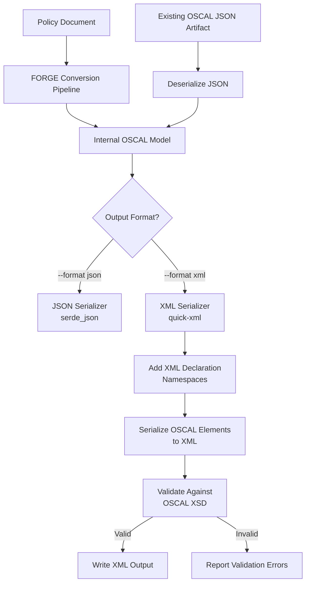
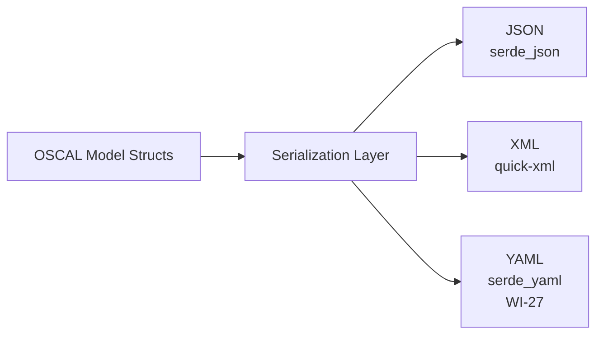
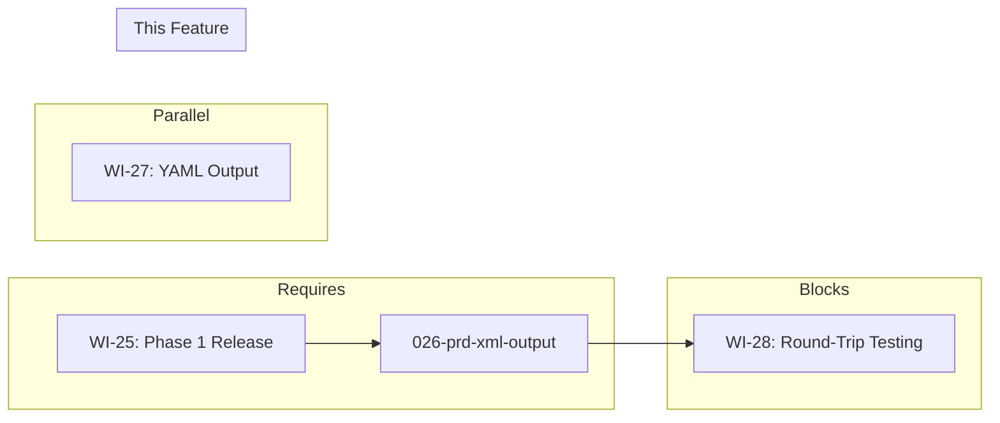

# 026-prd-xml-output

> **Document Type:** Product Requirements Document
> **Audience:** LLM agents, human reviewers
> **Status:** Draft
> **Last Updated:** 2026-02-10 <!-- @auto -->
> **Owner:** Brian Luby <!-- @human-required -->

**Feature Branch**: `026-xml-output`
**Created**: 2026-02-10
**Status**: Draft
**Input**: Derived from FORGE Product Roadmap WI-26

---

## Review Tier Legend

| Marker | Tier | Speckit Behavior |
|--------|------|------------------|
| 🔴 `@human-required` | Human Generated | Prompt human to author; blocks until complete |
| 🟡 `@human-review` | LLM + Human Review | LLM drafts → prompt human to confirm/edit; blocks until confirmed |
| 🟢 `@llm-autonomous` | LLM Autonomous | LLM completes; no prompt; logged for audit |
| ⚪ `@auto` | Auto-generated | System fills (timestamps, links); no prompt |

---

## Document Completion Order

> ⚠️ **For LLM Agents:** Complete sections in this order. Do not fill downstream sections until upstream human-required inputs exist.

1. **Context** (Background, Scope) → requires human input first
2. **Problem Statement & User Scenarios** → requires human input
3. **Requirements** (Must/Should/Could/Won't) → requires human input
4. **Technical Constraints** → human review
5. **Diagrams, Data Model, Interface** → LLM can draft after above exist
6. **Acceptance Criteria** → derived from requirements
7. **Everything else** → can proceed

---

## Context

### Background 🔴 `@human-required`
This PRD covers **WI-26: XML Output** from the FORGE Product Roadmap (Sprint S-26, Aug 25–29 2026, Theme T-4: Output Format Expansion, Milestone MS-5). FORGE currently generates OSCAL artifacts in JSON format (established in Phase 1, covered by parent PRD requirement M-7). However, OSCAL is intentionally a multi-format standard — many GRC tools, government agencies, and enterprise compliance workflows expect or require XML as their primary OSCAL interchange format. XML is the original serialization format for OSCAL and remains widely used in the compliance ecosystem, particularly by tools built on the NIST OSCAL Java ecosystem and oscal-cli. This work item implements OSCAL XML serialization using the `quick-xml` crate, validates generated XML against OSCAL v1.2.0 XML schemas, and enables the `--format xml` flag on both `forge convert` and `forge export` subcommands. WI-26 is the first work item in Theme T-4 (Output Format Expansion) and opens Phase 2 of the project. It depends on WI-25 (Phase 1 Release) being complete and runs in parallel with WI-27 (YAML Output). WI-26 is on the critical path and blocks WI-28 (Round-Trip Testing).

### Scope Boundaries 🟡 `@human-review`

**In Scope:**
- Implementing OSCAL XML serialization for Catalog, Component Definition, and Profile artifacts using `quick-xml`
- Validating generated XML against OSCAL v1.2.0 XML schemas
- Enabling `forge convert --format xml` to produce OSCAL XML output directly from policy documents
- Enabling `forge export --format xml` to convert existing OSCAL JSON artifacts to XML
- Ensuring semantic equivalence between JSON and XML output (same data, different serialization)
- Correct XML namespace handling (`http://csrc.nist.gov/ns/oscal/1.0`)
- Proper XML declaration and encoding (`<?xml version="1.0" encoding="UTF-8"?>`)
- Unit and integration tests verifying valid OSCAL XML generation

**Out of Scope:**
- YAML serialization — deferred to WI-27 (027-prd-yaml-output)
- Round-trip testing (JSON to XML to JSON equivalence) — deferred to WI-28 (028-prd-round-trip-testing)
- The `forge export` subcommand implementation itself — deferred to WI-29 (029-prd-export-subcommand); this WI provides the XML serialization capability that WI-29 wires into the subcommand
- XML Schema Definition (XSD) bundling or download — schemas are assumed available locally or via configuration
- XML digital signatures or encryption
- XSLT transformations or XML stylesheet processing instructions

### Glossary 🟡 `@human-review`

| Term | Definition |
|------|------------|
| OSCAL | Open Security Controls Assessment Language — NIST standard for machine-readable security/compliance data (XML/JSON/YAML) |
| quick-xml | A high-performance Rust crate for reading and writing XML, suitable for OSCAL XML serialization |
| XML Schema (XSD) | A World Wide Web Consortium (W3C) standard for defining the structure and constraints of XML documents; OSCAL publishes XSD schemas for validation |
| XML Namespace | A mechanism for qualifying element and attribute names in XML; OSCAL uses `http://csrc.nist.gov/ns/oscal/1.0` |
| Semantic Equivalence | The property that two serializations (e.g., JSON and XML) of the same OSCAL artifact carry identical information content |
| Serialization | The process of converting in-memory data structures into a specific output format (JSON, XML, YAML) |
| Catalog | OSCAL model representing a structured collection of controls (requirements) |
| Component Definition | OSCAL model describing how controls are implemented by reusable components |
| Profile | OSCAL model for selecting, organizing, and tailoring controls into a baseline |

### Related Documents ⚪ `@auto`

| Document | Link | Relationship |
|----------|------|--------------|
| Parent PRD | docs/FORGE_PRD.md | Parent requirement S-3, US-5 |
| Product Roadmap | docs/FORGE_PRODUCT_ROADMAP.md | Sprint S-26 context |
| Product Vision | docs/FORGE_PRODUCT_VISION.md | Strategic goal G-2 |
| Constitution | .specify/memory/constitution.md | Technical constraints and quality gates |
| Depends On | WI-25 (Phase 1 Release) | Phase 1 must be complete before XML output work begins (D-6) |
| Parallel With | docs/PRD/027-prd-yaml-output.md | YAML output (WI-27) runs in the same phase |
| Blocks | docs/PRD/028-prd-round-trip-testing.md | Round-trip testing (WI-28) requires XML output |

---

## Problem Statement 🔴 `@human-required`

FORGE currently produces OSCAL artifacts exclusively in JSON format. While JSON is the default OSCAL serialization and satisfies Phase 1 requirements (M-7), a significant portion of the OSCAL ecosystem relies on XML. Government agencies, GRC platforms, and tools built on the NIST OSCAL Java libraries (including oscal-cli) commonly expect or produce XML. Without XML output support, FORGE users must manually convert JSON artifacts to XML using external tools, introducing risk of conversion errors and breaking the automated pipeline. Parent PRD requirement S-3 mandates XML output, and user story US-5 (Multi-Format Export) establishes the user need for format flexibility. This work item adds native OSCAL XML serialization so that FORGE can produce validated XML output directly, ensuring interoperability with the broader OSCAL tool ecosystem.

---

## User Scenarios & Testing 🔴 `@human-required`

### User Story 1 — Convert Policy to OSCAL XML (Priority: P1)

A compliance engineer converts a policy document directly to OSCAL XML format for use with XML-based GRC tooling.

> As a compliance engineer, I want to convert a policy document to OSCAL XML so that I can import the result directly into XML-based compliance tools without a separate format conversion step.

**Why this priority**: This is the core capability of WI-26 — producing valid OSCAL XML from the conversion pipeline. Without it, the `--format xml` flag has no implementation.

**Independent Test**: Run `forge convert policy.md --strategy catalog --format xml` and validate the output against the OSCAL v1.2.0 Catalog XML schema.

**Acceptance Scenarios**:
1. **Given** a Markdown policy document, **When** running `forge convert policy.md --strategy catalog --format xml`, **Then** a valid OSCAL v1.2.0 Catalog XML document is produced with correct namespace, XML declaration, and all required elements.
2. **Given** a Markdown policy document, **When** running `forge convert policy.md --strategy component --format xml`, **Then** a valid OSCAL v1.2.0 Component Definition XML document is produced.

---

### User Story 2 — Semantic Equivalence Between JSON and XML (Priority: P1)

A compliance engineer verifies that the XML output contains the same data as the JSON output.

> As a compliance engineer, I want the XML output to be semantically equivalent to the JSON output so that I can trust that switching formats does not lose or alter any data.

**Why this priority**: Semantic equivalence is fundamental to multi-format OSCAL support. If XML output differs from JSON, users cannot rely on format interchangeability.

**Independent Test**: Convert the same policy document with `--format json` and `--format xml`, then compare the logical content of both outputs.

**Acceptance Scenarios**:
1. **Given** the same policy document, **When** converting with `--format json` and `--format xml`, **Then** both outputs contain identical metadata (uuid, title, version, oscal-version, last-modified), controls, groups, and back matter resources.
2. **Given** a Catalog with nested groups and controls containing props, links, and parts, **When** serialized to XML, **Then** all elements, attributes, and text content are preserved with correct OSCAL XML element naming.

---

### User Story 3 — XML Schema Validation (Priority: P1)

A compliance engineer needs assurance that the generated XML conforms to the official OSCAL schema.

> As a compliance engineer, I want the generated OSCAL XML to be validated against the official OSCAL v1.2.0 XML schemas so that I have confidence the output will be accepted by downstream tools.

**Why this priority**: Schema validation is the objective measure of correctness. Without it, XML output may be syntactically valid but structurally non-conformant.

**Independent Test**: Validate the generated XML against the OSCAL v1.2.0 Catalog and Component Definition XSD schemas using an XML validation tool.

**Acceptance Scenarios**:
1. **Given** a generated OSCAL Catalog XML file, **When** validated against `oscal_catalog_schema.xsd`, **Then** validation passes with zero errors.
2. **Given** a generated OSCAL Component Definition XML file, **When** validated against `oscal_component-definition_schema.xsd`, **Then** validation passes with zero errors.

---

### User Story 4 — Export Existing JSON Artifact to XML (Priority: P2)

A compliance engineer has an existing OSCAL JSON artifact and needs to convert it to XML.

> As a compliance engineer, I want to convert an existing OSCAL JSON artifact to XML format so that I can share it with teams or tools that require XML.

**Why this priority**: Export functionality extends the XML capability beyond the conversion pipeline to existing artifacts. This is P2 because the conversion path (US-1) is the primary use case, and full `forge export` wiring is in WI-29.

**Independent Test**: Run `forge export artifact.json --format xml` and verify the output is valid OSCAL XML.

**Acceptance Scenarios**:
1. **Given** an existing valid OSCAL JSON Catalog file, **When** running `forge export catalog.json --format xml`, **Then** a valid OSCAL XML Catalog is produced with all data preserved.
2. **Given** an existing valid OSCAL JSON Component Definition file, **When** running `forge export component.json --format xml`, **Then** a valid OSCAL XML Component Definition is produced.

---

## Assumptions & Risks 🟡 `@human-review`

### Assumptions
- [A-1] Phase 1 (WI-25) is complete, meaning JSON output, schema validation, and the core pipeline are all working.
- [A-2] The `quick-xml` crate supports the XML serialization patterns required by OSCAL (namespaces, attributes, mixed content).
- [A-3] OSCAL v1.2.0 XML schemas (XSD) are publicly available from NIST and can be used for validation.
- [A-4] The existing internal domain model and OSCAL model structs can be serialized to XML without structural changes — only the serialization layer is new.
- [A-5] OSCAL JSON-to-XML field name mapping follows deterministic conventions defined by the OSCAL Metaschema (e.g., JSON property names map to XML element names with consistent rules).

### Risks
| ID | Risk | Likelihood | Impact | Mitigation |
|----|------|------------|--------|------------|
| R-1 | OSCAL XML element naming conventions differ from JSON property names in non-obvious ways | Med | Med | Consult OSCAL Metaschema documentation and NIST-published XML examples; build a comprehensive mapping test suite |
| R-2 | quick-xml does not handle OSCAL's namespace requirements cleanly | Low | Med | quick-xml supports namespaces; validate early with a minimal OSCAL XML spike; fall back to manual XML construction if needed |
| R-3 | XML schema validation tooling in Rust is limited | Med | Med | Use external validation (oscal-cli or xmllint) in tests if pure-Rust XSD validation is insufficient; consider the `xmlschema` Python tool in CI |
| R-4 | Semantic equivalence testing between JSON and XML is difficult to automate | Med | Low | Use oscal-cli for round-trip validation in WI-28; for this WI, compare logical structures programmatically |

---

## Feature Overview

### Flow Diagram 🟡 `@human-review`



### State Diagram (if applicable) 🟡 `@human-review`
N/A — XML serialization is a stateless transformation from the internal OSCAL model to XML output.

---

## Requirements

### Must Have (M) — MVP, launch blockers 🔴 `@human-required`
- [ ] **M-1:** The system shall serialize OSCAL Catalog artifacts to valid OSCAL v1.2.0 XML using the `quick-xml` crate. *(Traces to: Parent PRD S-3)*
- [ ] **M-2:** The system shall serialize OSCAL Component Definition artifacts to valid OSCAL v1.2.0 XML. *(Traces to: Parent PRD S-3)*
- [ ] **M-3:** Generated XML shall include a proper XML declaration (`<?xml version="1.0" encoding="UTF-8"?>`) and the OSCAL namespace (`xmlns="http://csrc.nist.gov/ns/oscal/1.0"`). *(Traces to: OSCAL XML specification)*
- [ ] **M-4:** The `forge convert` command shall accept `--format xml` and produce OSCAL XML output. *(Traces to: Parent PRD S-3, US-5)*
- [ ] **M-5:** Generated OSCAL XML shall validate against the official OSCAL v1.2.0 XML schemas (XSD) with zero errors. *(Traces to: Parent PRD S-3)*
- [ ] **M-6:** OSCAL XML output shall be semantically equivalent to JSON output — identical metadata, controls, groups, props, links, parts, and back matter. *(Traces to: Parent PRD US-5)*
- [ ] **M-7:** All OSCAL JSON property names shall be correctly mapped to their corresponding OSCAL XML element and attribute names per the OSCAL Metaschema conventions. *(Traces to: OSCAL specification)*

### Should Have (S) — High value, not blocking 🔴 `@human-required`
- [ ] **S-1:** The `forge export` command shall accept `--format xml` to convert existing OSCAL JSON artifacts to XML. *(Traces to: Parent PRD US-5; full wiring in WI-29)*
- [ ] **S-2:** Generated XML output shall be human-readable with proper indentation (pretty-printing). *(Traces to: usability)*
- [ ] **S-3:** The system should serialize OSCAL Profile artifacts to valid OSCAL v1.2.0 XML. *(Traces to: Parent PRD S-3; Profile generation in WI-30+)*

### Could Have (C) — Nice to have, if time permits 🟡 `@human-review`
- [ ] **C-1:** The system could support a `--compact` flag to produce minified XML without indentation for reduced file size.
- [ ] **C-2:** The system could include XML comments indicating the FORGE version and generation timestamp.

### Won't Have (W) — Explicitly deferred 🟡 `@human-review`
- [ ] **W-1:** YAML serialization — *Reason: Deferred to WI-27 (YAML Output)*
- [ ] **W-2:** Round-trip testing (JSON to XML to JSON) — *Reason: Deferred to WI-28 (Round-Trip Testing)*
- [ ] **W-3:** XML digital signatures or WS-Security — *Reason: Out of scope for FORGE; compliance tooling does not require signed XML*
- [ ] **W-4:** XSLT stylesheet processing instructions — *Reason: Out of scope; consumers apply their own stylesheets*
- [ ] **W-5:** XSD schema bundling or automatic download — *Reason: Schemas are assumed available via configuration or local path*

---

## Technical Constraints 🟡 `@human-review`

- **Language/Framework:** Rust (latest stable), Cargo build system
- **XML Serialization:** `quick-xml` crate for XML writing (per parent PRD tool candidates)
- **OSCAL Version:** Target OSCAL v1.2.0 XML schemas and model definitions
- **Namespace:** All generated XML must use the OSCAL namespace `http://csrc.nist.gov/ns/oscal/1.0`
- **Encoding:** UTF-8 encoding, declared in the XML declaration
- **Error Handling:** `thiserror` for serialization errors (per constitution principle VIII)
- **Linting:** `cargo clippy -- -D warnings` must pass (per constitution quality gates)
- **Formatting:** `cargo fmt --all` must produce no changes (per constitution quality gates)
- **Testing:** `cargo test` must pass; TDD is mandatory per constitution principle IV
- **Dependencies:** `quick-xml` at latest stable version; minimize additional XML-related dependencies
- **Schema Validation:** Validate against official NIST-published OSCAL v1.2.0 XML schemas (XSD)
- **Semantic Equivalence:** XML output must carry the same information as JSON output — no data loss or addition during serialization

---

## Data Model (if applicable) 🟡 `@human-review`

No new data model is introduced in this work item. The existing OSCAL model structs (Catalog, ComponentDefinition, Profile, Metadata, Control, Group, etc.) established in earlier work items are serialized to XML. The serialization layer maps existing struct fields to XML elements and attributes per OSCAL conventions.



---

## Interface Contract (if applicable) 🟡 `@human-review`

```rust
// CLI Interface additions

// Convert to XML:
// forge convert <input> --strategy <catalog|component> --format xml [--output <path>]

// Export to XML (serialization capability provided here; subcommand wiring in WI-29):
// forge export <artifact.json> --format xml [--output <path>]

// Serialization API (library)

/// Serialize an OSCAL Catalog to XML string
pub fn serialize_catalog_to_xml(
    catalog: &OscalCatalog,
) -> Result<String, ForgeError>;

/// Serialize an OSCAL Component Definition to XML string
pub fn serialize_component_definition_to_xml(
    component_def: &OscalComponentDefinition,
) -> Result<String, ForgeError>;

/// Serialize an OSCAL Profile to XML string (S-3)
pub fn serialize_profile_to_xml(
    profile: &OscalProfile,
) -> Result<String, ForgeError>;

/// Generic serialization dispatcher based on format
pub fn serialize_to_format(
    artifact: &OscalArtifact,
    format: OutputFormat,
) -> Result<String, ForgeError>;

/// Supported output formats
pub enum OutputFormat {
    Json,
    Xml,
    // Yaml — added in WI-27
}

/// Validate XML output against OSCAL XSD schema
pub fn validate_xml_against_schema(
    xml: &str,
    schema_path: &Path,
) -> Result<(), ForgeError>;
```

---

## Evaluation Criteria 🟡 `@human-review`

| Criterion | Weight | Metric | Target | Notes |
|-----------|--------|--------|--------|-------|
| XML Schema Validity | Critical | Generated XML validates against OSCAL v1.2.0 XSD | Zero validation errors | Objective correctness measure |
| Semantic Equivalence | Critical | JSON and XML outputs carry identical data | 100% field-for-field equivalence | No data loss during serialization |
| Namespace Correctness | Critical | XML uses correct OSCAL namespace | `xmlns="http://csrc.nist.gov/ns/oscal/1.0"` | Required for tool interoperability |
| CLI Integration | High | `--format xml` flag works on `forge convert` | XML output produced | User-facing capability |

---

## Tool/Approach Candidates 🟡 `@human-review`

| Option | License | Pros | Cons | Spike Result |
|--------|---------|------|------|--------------|
| **quick-xml** | MIT | High performance; low-level control over XML output; well-maintained; supports namespaces | Requires manual element construction (not derive-based) | Selected per parent PRD |
| xml-rs | MIT | Pure Rust; streaming writer | Slower than quick-xml; less actively maintained | Not selected |
| serde-xml-rs | MIT | serde integration (derive-based) | Incomplete OSCAL support; namespace handling limitations; abandoned | Not selected |
| xmlwriter | MIT | Simple, focused XML writing | Less feature-rich; less widely used | Not selected |

### Selected Approach 🔴 `@human-required`
> **Decision:** Use `quick-xml` for OSCAL XML serialization with manual element construction for precise control over output structure
> **Rationale:** `quick-xml` is identified in the parent PRD tool candidates as the likely choice for XML output. It provides fast, low-level XML writing with namespace support. Manual element construction (rather than serde derive) gives precise control over OSCAL XML element naming, attribute placement, and namespace handling — which is essential because OSCAL JSON-to-XML mapping has specific conventions defined by the Metaschema that do not map trivially through serde.

---

## Acceptance Criteria 🟡 `@human-review`

| AC ID | Requirement | User Story | Given | When | Then |
|-------|-------------|------------|-------|------|------|
| AC-1 | M-1, M-3 | US-1 | A Markdown policy document | Running `forge convert policy.md --strategy catalog --format xml` | A valid OSCAL v1.2.0 Catalog XML document is produced with correct XML declaration and namespace |
| AC-2 | M-2, M-3 | US-1 | A Markdown policy document | Running `forge convert policy.md --strategy component --format xml` | A valid OSCAL v1.2.0 Component Definition XML document is produced |
| AC-3 | M-5 | US-3 | Generated OSCAL Catalog XML | Validating against `oscal_catalog_schema.xsd` | Zero schema validation errors |
| AC-4 | M-5 | US-3 | Generated OSCAL Component Definition XML | Validating against `oscal_component-definition_schema.xsd` | Zero schema validation errors |
| AC-5 | M-6, M-7 | US-2 | Same policy document converted with `--format json` and `--format xml` | Comparing logical content of both outputs | All metadata, controls, groups, props, links, parts, and back matter are identical |
| AC-6 | M-4 | US-1 | The `forge convert` CLI | Passing `--format xml` | XML output is written to stdout or the specified `--output` path |
| AC-7 | S-1 | US-4 | An existing valid OSCAL JSON Catalog | Running `forge export catalog.json --format xml` | A valid OSCAL XML Catalog is produced |

### Edge Cases 🟢 `@llm-autonomous`
- [ ] **EC-1:** (M-1) When a Catalog contains no controls (empty groups only), then valid XML is produced with empty group elements.
- [ ] **EC-2:** (M-7) When OSCAL elements contain special XML characters (`<`, `>`, `&`, `"`, `'`) in text content (e.g., prose, remarks), then characters are properly escaped in the XML output.
- [ ] **EC-3:** (M-6) When a control contains props with namespace-prefixed names (e.g., `ns:name`), then the XML preserves the namespace prefix correctly.
- [ ] **EC-4:** (M-3) When generating XML, the OSCAL namespace declaration appears on the root element and is not redundantly repeated on child elements.
- [ ] **EC-5:** (M-1) When a Catalog contains deeply nested groups (3+ levels), then the XML nesting hierarchy is correctly preserved.
- [ ] **EC-6:** (S-2) When pretty-printing is enabled, then XML indentation is consistent (e.g., 2-space indent) and does not introduce spurious whitespace in text content.
- [ ] **EC-7:** (M-6) When back matter resources contain rlinks with media-type attributes, then these attributes are serialized as XML attributes (not child elements) per the OSCAL XML specification.
- [ ] **EC-8:** (S-1) When the input JSON artifact is malformed or not valid OSCAL, then a descriptive error is returned (not a panic or corrupt XML).

---

## Dependencies 🟡 `@human-review`



- **Requires:** WI-25 (Phase 1 Release) — Phase 1 must be complete with working JSON output, schema validation, and the full conversion pipeline (D-6 in dependency registry)
- **Parallel With:** WI-27 (YAML Output) — both are output format work items in Theme T-4 that can proceed independently
- **Blocks:** WI-28 (Round-Trip Testing) — round-trip equivalence testing requires XML serialization to be working
- **External:** `quick-xml` crate (MIT, well-maintained); OSCAL v1.2.0 XML schemas (XSD) from NIST (published, stable)

---

## Security Considerations 🟡 `@human-review`

| Aspect | Assessment | Notes |
|--------|------------|-------|
| Internet Exposure | No | XML serialization is offline; no network access required |
| Sensitive Data | Yes | Policy content serialized to XML may contain sensitive organizational information |
| Authentication Required | No | Local CLI tool |
| Security Review Required | No | XML serialization uses well-established quick-xml crate; no XML parsing of untrusted input (we are producing XML, not consuming it); XML entity expansion attacks are not applicable to XML generation |

---

## Implementation Guidance 🟢 `@llm-autonomous`

### Suggested Approach
Create an `xml` module within the `export` (or `oscal`) module that implements OSCAL XML serialization. Use `quick-xml::Writer` to construct XML output programmatically. Start by implementing serialization for the Catalog model (the most common artifact type), then extend to Component Definition and Profile. For each OSCAL model type, implement a serialization function that:

1. Writes the XML declaration (`<?xml version="1.0" encoding="UTF-8"?>`).
2. Opens the root element with the OSCAL namespace (`<catalog xmlns="http://csrc.nist.gov/ns/oscal/1.0">`).
3. Recursively serializes child elements (metadata, groups, controls, back-matter) following the OSCAL XML element ordering defined in the XSD.
4. Properly maps JSON property names to XML element names (e.g., JSON `last-modified` → XML `<last-modified>`, JSON arrays map to repeated elements).
5. Handles attributes vs. child elements correctly (e.g., `uuid` is an attribute on most OSCAL elements, not a child element).

Build a mapping layer or trait that defines how each OSCAL struct serializes to XML. Consult the OSCAL Metaschema XML definitions and NIST-published example XML files for correct element ordering and attribute placement. Write tests that validate generated XML against the OSCAL XSD schemas — use an external tool (xmllint, oscal-cli) in integration tests if pure-Rust XSD validation is not available.

### Anti-patterns to Avoid
- Using serde derive with a generic XML serializer — OSCAL XML has specific conventions (attributes, element ordering, namespace handling) that generic serde-XML bridges handle poorly
- Hardcoding XML as string concatenation — use `quick-xml::Writer` for proper escaping and well-formedness guarantees
- Ignoring element ordering — OSCAL XSD defines specific element sequences; out-of-order elements will fail schema validation
- Skipping namespace handling — XML without the correct OSCAL namespace will not validate
- Testing only well-formedness (parseable XML) without schema validation — well-formed XML can still be structurally invalid OSCAL

### Reference Examples
- OSCAL XML examples from NIST: https://github.com/usnistgov/oscal-content/tree/main/examples
- quick-xml documentation: https://docs.rs/quick-xml/latest/quick_xml/
- OSCAL Metaschema XML definitions: https://github.com/usnistgov/OSCAL/tree/main/xml
- OSCAL v1.2.0 XML schemas: https://github.com/usnistgov/OSCAL/tree/main/xml/schema

---

## Spike Tasks 🟡 `@human-review`

| Spike | Question | Time-box | Output |
|-------|----------|----------|--------|
| SP-1 | Validate that `quick-xml` can produce OSCAL-compliant XML with correct namespace handling and attribute placement | 2 hours | Minimal OSCAL Catalog XML generated and validated against XSD |
| SP-2 | Determine the OSCAL JSON-to-XML property name mapping rules from the Metaschema | 2 hours | Mapping table documenting JSON property → XML element/attribute for all OSCAL types used by FORGE |

---

## Success Metrics 🔴 `@human-required`

| Metric | Baseline | Target | Measurement Method |
|--------|----------|--------|-------------------|
| XML schema validation | N/A (no XML output exists) | Zero validation errors against OSCAL v1.2.0 XSD | Automated XSD validation in CI |
| Semantic equivalence | N/A | 100% field-for-field match between JSON and XML output | Programmatic comparison in tests |
| CLI format flag | N/A | `--format xml` produces valid output | Manual verification + integration test |
| OSCAL artifact types | N/A | Catalog and Component Definition XML working | Integration tests per artifact type |

### Technical Verification 🟢 `@llm-autonomous`
| Metric | Target | Verification Method |
|--------|--------|---------------------|
| Test coverage for XML serialization | >90% | `cargo test` + coverage tool |
| No clippy warnings | 0 | `cargo clippy -- -D warnings` |
| No formatting violations | 0 | `cargo fmt --check` |
| XML schema validation in CI | All generated XML passes | XSD validation via xmllint or oscal-cli in test suite |

---

## Definition of Ready 🔴 `@human-required`

### Readiness Checklist
- [x] Problem statement reviewed and validated by stakeholder
- [x] All Must Have requirements have acceptance criteria
- [x] Technical constraints are explicit and agreed
- [x] Dependencies identified and owners confirmed
- [x] Security review completed (or N/A documented with justification)
- [x] No open questions blocking implementation

### Sign-off
| Role | Name | Date | Decision |
|------|------|------|----------|
| Product Owner | Brian Luby | YYYY-MM-DD | [Ready / Not Ready] |

---

## Changelog ⚪ `@auto`

| Version | Date | Author | Changes |
|---------|------|--------|---------|
| 0.1 | 2026-02-10 | LLM (Claude) | Initial draft derived from FORGE Product Roadmap WI-26 |

---

## Decision Log 🟡 `@human-review`

| Date | Decision | Rationale | Alternatives Considered |
|------|----------|-----------|------------------------|
| 2026-02-10 | Use quick-xml with manual element construction over serde-xml-rs | OSCAL XML requires precise control over element ordering, attribute placement, and namespace handling that serde-xml bridges do not reliably provide; quick-xml is identified in the parent PRD as the likely choice | serde-xml-rs (abandoned, poor namespace support), xml-rs (slower, less maintained), xmlwriter (less feature-rich) |
| 2026-02-10 | Validate against OSCAL XSD schemas using external tools in CI | Pure-Rust XSD validation crates are immature; using xmllint or oscal-cli for schema validation provides authoritative results | Pure-Rust XSD validation (insufficient ecosystem maturity), skip validation (unacceptable for compliance tooling) |
| 2026-02-10 | Implement XML serialization as a separate serialization layer rather than modifying existing model structs | Keeps serialization concerns decoupled from the domain model; enables parallel development with WI-27 (YAML) using the same pattern | Add XML serde attributes to existing structs (tight coupling, conflicts with JSON serde attributes) |

---

## Open Questions 🟡 `@human-review`

No open questions for this work item.

---

## Review Checklist 🟢 `@llm-autonomous`

Before marking as Approved:
- [x] All requirements have unique IDs (M-1 through M-7, S-1 through S-3, C-1 through C-2, W-1 through W-5)
- [x] All Must Have requirements have linked acceptance criteria
- [x] User stories are prioritized and independently testable
- [x] Acceptance criteria reference both requirement IDs and user stories
- [x] Glossary terms are used consistently throughout
- [x] Diagrams use terminology from Glossary
- [x] Security considerations documented
- [x] Definition of Ready checklist is complete
- [x] No open questions blocking implementation
