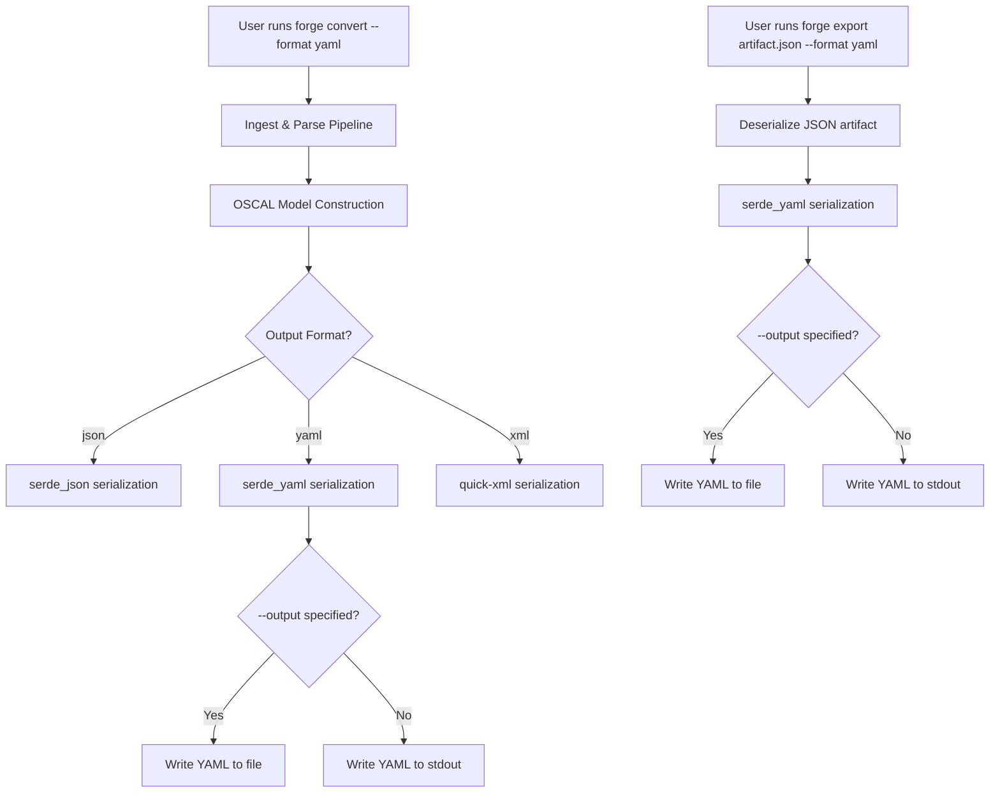
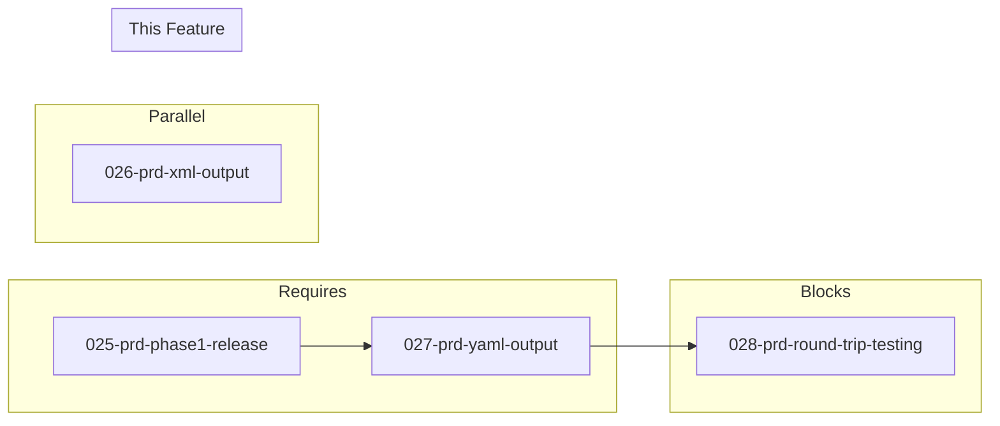

# 027-prd-yaml-output

> **Document Type:** Product Requirements Document
> **Audience:** LLM agents, human reviewers
> **Status:** Draft
> **Last Updated:** 2026-02-10 <!-- @auto -->
> **Owner:** Brian Luby <!-- @human-required -->

**Feature Branch**: `027-yaml-output`
**Created**: 2026-02-10
**Status**: Draft
**Input**: Derived from FORGE Product Roadmap WI-27

---

## Review Tier Legend

| Marker | Tier | Speckit Behavior |
|--------|------|------------------|
| 🔴 `@human-required` | Human Generated | Prompt human to author; blocks until complete |
| 🟡 `@human-review` | LLM + Human Review | LLM drafts → prompt human to confirm/edit; blocks until confirmed |
| 🟢 `@llm-autonomous` | LLM Autonomous | LLM completes; no prompt; logged for audit |
| ⚪ `@auto` | Auto-generated | System fills (timestamps, links); no prompt |

---

## Document Completion Order

> ⚠️ **For LLM Agents:** Complete sections in this order. Do not fill downstream sections until upstream human-required inputs exist.

1. **Context** (Background, Scope) → requires human input first
2. **Problem Statement & User Scenarios** → requires human input
3. **Requirements** (Must/Should/Could/Won't) → requires human input
4. **Technical Constraints** → human review
5. **Diagrams, Data Model, Interface** → LLM can draft after above exist
6. **Acceptance Criteria** → derived from requirements
7. **Everything else** → can proceed

---

## Context

### Background 🔴 `@human-required`
This PRD covers **WI-27: YAML Output** from the FORGE Product Roadmap (Sprint S-27, Sep 1-5 2026, Theme T-4: Output Format Expansion, Milestone MS-5). FORGE currently produces OSCAL artifacts in JSON format (established in Phase 1, WI-9 through WI-13). The OSCAL standard defines three equivalent serialization formats: JSON, XML, and YAML. Many compliance tools and workflows prefer YAML for its human-readability and its prevalence in DevOps/infrastructure-as-code ecosystems (e.g., Ansible, Kubernetes, GitHub Actions). Parent PRD requirement S-4 mandates YAML output support, and parent PRD US-5 (Multi-Format Export) describes the user need for format flexibility. This work item implements OSCAL YAML serialization using `serde_yaml`, validates semantic equivalence with the existing JSON output, and integrates YAML as a `--format` option in both `forge convert` and `forge export`. WI-27 runs in parallel with WI-26 (XML Output) and depends on WI-25 (Phase 1 Release) being complete. WI-27 blocks WI-28 (Multi-Format Round-Trip Testing), which verifies JSON/XML/YAML equivalence.

### Scope Boundaries 🟡 `@human-review`

**In Scope:**
- Implementing OSCAL YAML serialization using `serde_yaml` for all OSCAL model types (Catalog, Component Definition)
- Adding `--format yaml` support to `forge convert` subcommand
- Adding `--format yaml` support to `forge export` subcommand
- Validating that YAML output is semantically equivalent to JSON output for the same source input
- Ensuring YAML output conforms to OSCAL YAML conventions (key ordering, quoting, multiline string handling)
- Unit and integration tests verifying valid YAML is produced and is semantically equivalent to JSON
- Extending the existing output format enumeration to include YAML as a variant

**Out of Scope:**
- XML serialization — handled by WI-26 (026-prd-xml-output)
- Multi-format round-trip testing (JSON <-> XML <-> YAML) — deferred to WI-28 (028-prd-round-trip-testing)
- `forge export` subcommand implementation — deferred to WI-29 (029-prd-export-subcommand); this WI adds YAML as a format option to the existing export interface
- YAML schema validation (validating YAML against OSCAL schemas directly) — OSCAL schemas are defined in JSON Schema; validation is performed on the deserialized model, not the YAML surface syntax
- YAML-specific pretty-printing or style customization beyond serde_yaml defaults

### Glossary 🟡 `@human-review`

| Term | Definition |
|------|------------|
| YAML | YAML Ain't Markup Language — a human-readable data serialization format widely used in DevOps and configuration management |
| serde_yaml | A Rust crate providing YAML serialization and deserialization via the serde framework |
| serde | The standard Rust framework for serializing and deserializing data structures |
| Semantic Equivalence | Two serializations (e.g., JSON and YAML) are semantically equivalent if they represent the identical data model when deserialized |
| OSCAL | Open Security Controls Assessment Language — the NIST standard for machine-readable security and compliance artifacts |
| Catalog | An OSCAL model type representing a collection of security controls organized into groups |
| Component Definition | An OSCAL model type representing a system component and its control implementations |

### Related Documents ⚪ `@auto`

| Document | Link | Relationship |
|----------|------|--------------|
| Parent PRD | docs/FORGE_PRD.md | Parent requirement S-4, US-5 |
| Product Roadmap | docs/FORGE_PRODUCT_ROADMAP.md | Sprint S-27 context |
| Product Vision | docs/FORGE_PRODUCT_VISION.md | Strategic goal G-2 |
| Depends On | docs/PRD/025-prd-phase1-release.md | Phase 1 release (WI-25) |
| Parallel With | docs/PRD/026-prd-xml-output.md | XML output (WI-26) |
| Blocks | docs/PRD/028-prd-round-trip-testing.md | Round-trip testing (WI-28) |
| Constitution | .specify/memory/constitution.md | Technical constraints and quality gates |

---

## Problem Statement 🔴 `@human-required`

FORGE currently outputs OSCAL artifacts exclusively in JSON format. While JSON is the primary OSCAL serialization, many compliance workflows and tools operate in YAML-centric ecosystems. Infrastructure-as-code platforms (Ansible, Kubernetes), CI/CD pipelines (GitHub Actions, GitLab CI), and configuration management systems commonly use YAML as their native format. Compliance engineers working in these environments need OSCAL output in YAML to avoid manual format conversion, maintain consistency with their existing toolchains, and leverage YAML's superior human-readability for review and auditing. Without native YAML output, FORGE users must rely on external conversion tools, introducing friction, potential data loss, and workflow fragmentation. Parent PRD S-4 explicitly requires YAML output, and US-5 establishes the user need for multi-format export capability.

---

## User Scenarios & Testing 🔴 `@human-required`

### User Story 1 — Convert Policy to OSCAL YAML Catalog (Priority: P1)

A compliance engineer converts a policy document to OSCAL YAML format for integration with a YAML-based compliance workflow.

> As a compliance engineer, I want to convert a policy document to an OSCAL Catalog in YAML format so that I can integrate the output with YAML-based compliance and DevOps tools.

**Why this priority**: This is the core deliverable of WI-27 — producing valid OSCAL YAML output from `forge convert`. Without this, the YAML format option has no value.

**Independent Test**: Run `forge convert policy.md --strategy catalog --format yaml` and verify the output is valid YAML containing a valid OSCAL Catalog structure.

**Acceptance Scenarios**:
1. **Given** a Markdown policy document, **When** running `forge convert policy.md --strategy catalog --format yaml`, **Then** a valid OSCAL Catalog in YAML format is produced with groups and controls matching the source document structure.
2. **Given** a Markdown policy document, **When** converting with `--format yaml` and `--format json` respectively, **Then** both outputs deserialize to identical OSCAL data models (semantic equivalence).

---

### User Story 2 — Convert Policy to OSCAL YAML Component Definition (Priority: P1)

A compliance engineer converts a policy document to an OSCAL Component Definition in YAML format.

> As a compliance engineer, I want to convert a policy document to an OSCAL Component Definition in YAML format so that I can use the output in YAML-native component inventory and configuration management systems.

**Why this priority**: Component Definition is the second OSCAL model type FORGE supports. YAML output must work for all supported model types, not just Catalogs.

**Independent Test**: Run `forge convert policy.md --strategy component --format yaml` and verify the output is valid YAML containing a valid OSCAL Component Definition structure.

**Acceptance Scenarios**:
1. **Given** a Markdown policy document, **When** running `forge convert policy.md --strategy component --format yaml`, **Then** a valid OSCAL Component Definition in YAML format is produced.
2. **Given** a Component Definition generated in both JSON and YAML, **When** deserializing both, **Then** the resulting data models are identical.

---

### User Story 3 — Export Existing OSCAL Artifact as YAML (Priority: P2)

A compliance engineer has an existing OSCAL JSON artifact and wants to export it as YAML.

> As a compliance engineer, I want to export an existing OSCAL JSON artifact as YAML so that I can share it with teams that prefer YAML-based workflows without re-running the full conversion pipeline.

**Why this priority**: Export is a secondary workflow (converting between formats for existing artifacts). The primary workflow (convert from source) is higher priority.

**Independent Test**: Run `forge export catalog.json --format yaml` and verify the output is valid OSCAL YAML that is semantically equivalent to the input JSON.

**Acceptance Scenarios**:
1. **Given** an existing OSCAL Catalog JSON file, **When** running `forge export catalog.json --format yaml`, **Then** a valid OSCAL YAML file is produced that is semantically equivalent to the input.
2. **Given** an existing OSCAL Component Definition JSON file, **When** running `forge export component.json --format yaml`, **Then** a valid OSCAL YAML file is produced.

---

### User Story 4 — YAML Output to stdout or File (Priority: P2)

A compliance engineer wants YAML output written to a specific file path or piped to stdout.

> As a compliance engineer, I want to control where YAML output is written (stdout or a file path) so that I can integrate FORGE into scripted workflows and pipelines.

**Why this priority**: Output destination control is important for pipeline integration but follows the same patterns already established for JSON output.

**Independent Test**: Run `forge convert policy.md --format yaml --output catalog.yaml` and verify the file is written. Run without `--output` and verify YAML is written to stdout.

**Acceptance Scenarios**:
1. **Given** a policy document, **When** running `forge convert policy.md --format yaml --output catalog.yaml`, **Then** the YAML output is written to `catalog.yaml`.
2. **Given** a policy document, **When** running `forge convert policy.md --format yaml` without `--output`, **Then** the YAML output is written to stdout.

---

## Assumptions & Risks 🟡 `@human-review`

### Assumptions
- [A-1] The existing OSCAL model structs already derive `serde::Serialize` and `serde::Deserialize`, making YAML serialization a matter of adding `serde_yaml` as a serializer — no model changes required.
- [A-2] `serde_yaml` produces YAML output that is compatible with standard YAML 1.2 parsers and conforms to OSCAL YAML conventions.
- [A-3] The `--format` CLI argument already exists as a placeholder or enum from WI-1 scaffolding, and adding the `yaml` variant is straightforward.
- [A-4] WI-25 (Phase 1 Release) has completed, meaning JSON output is fully functional and validated before YAML work begins.
- [A-5] Semantic equivalence can be verified by deserializing both JSON and YAML outputs into the same Rust structs and comparing them.

### Risks
| ID | Risk | Likelihood | Impact | Mitigation |
|----|------|------------|--------|------------|
| R-1 | serde_yaml produces YAML that differs from OSCAL community YAML conventions (e.g., key ordering, string quoting) | Med | Low | Compare output against NIST OSCAL YAML examples; adjust serialization settings if needed |
| R-2 | Floating-point or numeric precision differences between JSON and YAML serialization | Low | Med | Use string-based comparison of deserialized models rather than byte-level YAML/JSON comparison |
| R-3 | serde_yaml crate is deprecated or unmaintained at implementation time | Low | Med | Evaluate alternative crates (e.g., `serde_yml`) if needed; the serde ecosystem has multiple YAML options |
| R-4 | YAML multiline string handling produces unexpected formatting for long OSCAL prose fields | Med | Low | Test with realistic policy content; configure serde_yaml multiline string style if available |

---

## Feature Overview

### Flow Diagram 🟡 `@human-review`



### State Diagram (if applicable) 🟡 `@human-review`
N/A — YAML serialization is a stateless transformation of the OSCAL data model to a YAML byte stream.

---

## Requirements

### Must Have (M) — MVP, launch blockers 🔴 `@human-required`
- [ ] **M-1:** The CLI shall serialize OSCAL Catalog models to valid YAML using `serde_yaml` when `--format yaml` is specified on `forge convert`. *(Traces to: Parent PRD S-4)*
- [ ] **M-2:** The CLI shall serialize OSCAL Component Definition models to valid YAML using `serde_yaml` when `--format yaml` is specified on `forge convert`. *(Traces to: Parent PRD S-4)*
- [ ] **M-3:** YAML output shall be semantically equivalent to JSON output for the same source input — deserializing both into the same Rust model struct shall produce identical values. *(Traces to: Parent PRD S-4, US-5)*
- [ ] **M-4:** The `--format yaml` option shall be available on `forge export` for converting existing OSCAL artifacts to YAML. *(Traces to: Parent PRD S-4, US-5)*
- [ ] **M-5:** YAML output shall be written to stdout by default or to a file when `--output <path>` is specified, consistent with existing JSON output behavior. *(Traces to: Parent PRD S-4)*
- [ ] **M-6:** The YAML output shall include all OSCAL required fields (uuid, metadata with title, last-modified, version, oscal-version) in the correct structure. *(Traces to: Parent PRD M-5, S-4)*

### Should Have (S) — High value, not blocking 🔴 `@human-required`
- [ ] **S-1:** YAML output should use human-readable formatting with consistent indentation (2-space indent) for readability.
- [ ] **S-2:** YAML output should handle multiline string fields (e.g., control statement prose) using YAML block scalar style (literal `|` or folded `>`) rather than inline escaped strings.
- [ ] **S-3:** The CLI should report the output format in verbose mode (e.g., "Writing OSCAL Catalog as YAML to catalog.yaml").

### Could Have (C) — Nice to have, if time permits 🟡 `@human-review`
- [ ] **C-1:** YAML output could include a leading comment indicating the FORGE version and generation timestamp.
- [ ] **C-2:** YAML output could preserve OSCAL-conventional key ordering (uuid, metadata, groups/components) matching NIST OSCAL YAML examples.

### Won't Have (W) — Explicitly deferred 🟡 `@human-review`
- [ ] **W-1:** Multi-format round-trip testing (JSON <-> YAML <-> XML) — *Reason: Deferred to WI-28 (Round-Trip Testing)*
- [ ] **W-2:** YAML schema validation (validating YAML surface syntax against OSCAL schemas) — *Reason: OSCAL schemas are JSON Schema; validation operates on the deserialized model, not the YAML text*
- [ ] **W-3:** Custom YAML style configuration (user-selectable quoting, indentation, flow vs block style) — *Reason: Unnecessary complexity for MVP; default serde_yaml formatting is sufficient*
- [ ] **W-4:** YAML input ingestion (reading OSCAL YAML as input to FORGE) — *Reason: FORGE ingests policy documents, not OSCAL artifacts; OSCAL input is only for `forge export` which deserializes via serde*

---

## Technical Constraints 🟡 `@human-review`

- **Language/Framework:** Rust (latest stable), Cargo build system
- **Serialization:** `serde_yaml` crate for YAML serialization, integrated with existing `serde` derive macros on OSCAL model structs
- **Semantic Equivalence:** YAML and JSON outputs must deserialize to identical Rust structs; verified by deserialization round-trip in tests
- **OSCAL Version:** Target OSCAL v1.2.0 model definitions, consistent with JSON output
- **Error Handling:** `thiserror` for serialization errors (per constitution principle VIII); YAML serialization errors must produce descriptive ForgeError variants
- **Linting:** `cargo clippy -- -D warnings` must pass (per constitution quality gates)
- **Formatting:** `cargo fmt --all` must produce no changes (per constitution quality gates)
- **Testing:** TDD is mandatory per constitution principle IV; semantic equivalence tests required
- **Dependencies:** `serde_yaml` at latest stable version per constitution principle XI; minimize additional dependencies

---

## Data Model (if applicable) 🟡 `@human-review`

N/A — No new data model is introduced in this work item. YAML serialization operates on the existing OSCAL model structs (Catalog, ComponentDefinition, Metadata, etc.) that already derive `serde::Serialize` and `serde::Deserialize`. The only change is adding a `Yaml` variant to the output format enumeration.

```rust
/// Output format enumeration (extended)
pub enum OutputFormat {
    Json,
    Xml,   // Added by WI-26
    Yaml,  // Added by WI-27 (this WI)
}
```

---

## Interface Contract (if applicable) 🟡 `@human-review`

```rust
// CLI Interface (YAML output)

// forge convert <input> --strategy <catalog|component> --format yaml [--output <path>]
// forge export <artifact-path> --format yaml [--output <path>]

/// Serialize an OSCAL Catalog to YAML
pub fn serialize_catalog_to_yaml(
    catalog: &OscalCatalog,
) -> Result<String, ForgeError>;

/// Serialize an OSCAL Component Definition to YAML
pub fn serialize_component_definition_to_yaml(
    component_def: &OscalComponentDefinition,
) -> Result<String, ForgeError>;

/// Generic YAML serialization for any serde-serializable OSCAL model
pub fn serialize_to_yaml<T: serde::Serialize>(
    model: &T,
) -> Result<String, ForgeError>;

/// Deserialize YAML string back to an OSCAL model (for equivalence testing)
pub fn deserialize_from_yaml<T: serde::de::DeserializeOwned>(
    yaml: &str,
) -> Result<T, ForgeError>;
```

The serialization functions wrap `serde_yaml::to_string()` with FORGE-specific error handling, producing `ForgeError::Serialization` on failure.

---

## Evaluation Criteria 🟡 `@human-review`

| Criterion | Weight | Metric | Target | Notes |
|-----------|--------|--------|--------|-------|
| Valid YAML Output | Critical | YAML output parses without errors by any YAML 1.2 parser | 100% of outputs | Foundation requirement |
| Semantic Equivalence | Critical | JSON and YAML outputs deserialize to identical models | 100% equivalence | Core correctness guarantee |
| All Model Types | Critical | Both Catalog and Component Definition produce valid YAML | 100% of model types | Complete format coverage |
| Output Destination | High | YAML writes to stdout or file correctly | Both paths work | Consistent with JSON behavior |

---

## Tool/Approach Candidates 🟡 `@human-review`

| Option | License | Pros | Cons | Spike Result |
|--------|---------|------|------|--------------|
| serde_yaml | MIT/Apache-2.0 | Standard serde integration; widely used; drop-in serializer | May have limited control over YAML formatting style | Selected per parent PRD |
| serde_yml | MIT/Apache-2.0 | Fork/successor of serde_yaml; actively maintained | Newer, less ecosystem adoption | Alternative if serde_yaml is unmaintained |
| yaml-rust2 + manual serialization | MIT/Apache-2.0 | Full control over YAML output formatting | Requires manual serialization logic; does not integrate with serde | Not selected |

### Selected Approach 🔴 `@human-required`
> **Decision:** Use `serde_yaml` for YAML serialization, leveraging existing serde derive macros on OSCAL model structs
> **Rationale:** `serde_yaml` is identified in the parent PRD tool candidates as the likely choice for YAML output. It integrates seamlessly with the existing serde-based serialization architecture — the same model structs that serialize to JSON via `serde_json` can serialize to YAML via `serde_yaml` with no model changes. This minimizes implementation effort and ensures structural consistency across formats.

---

## Acceptance Criteria 🟡 `@human-review`

| AC ID | Requirement | User Story | Given | When | Then |
|-------|-------------|------------|-------|------|------|
| AC-1 | M-1 | US-1 | A Markdown policy document | Running `forge convert policy.md --strategy catalog --format yaml` | A valid OSCAL Catalog in YAML format is produced |
| AC-2 | M-2 | US-2 | A Markdown policy document | Running `forge convert policy.md --strategy component --format yaml` | A valid OSCAL Component Definition in YAML format is produced |
| AC-3 | M-3 | US-1, US-2 | The same source document converted to JSON and YAML | Deserializing both outputs into Rust structs | The deserialized models are identical |
| AC-4 | M-4 | US-3 | An existing OSCAL JSON artifact | Running `forge export artifact.json --format yaml` | A valid OSCAL YAML file is produced that is semantically equivalent to the input |
| AC-5 | M-5 | US-4 | A policy document | Running `forge convert --format yaml --output catalog.yaml` | YAML is written to the specified file path |
| AC-6 | M-5 | US-4 | A policy document | Running `forge convert --format yaml` without `--output` | YAML is written to stdout |
| AC-7 | M-6 | US-1 | Any YAML output | Inspecting the YAML content | All OSCAL required metadata fields (uuid, title, last-modified, version, oscal-version) are present |

### Edge Cases 🟢 `@llm-autonomous`
- [ ] **EC-1:** (M-1) When the OSCAL model contains empty collections (e.g., a group with no controls), then YAML output represents them as empty sequences (`[]`) or omits them per serde configuration, and the output remains valid.
- [ ] **EC-2:** (M-3) When the OSCAL model contains Unicode text (e.g., policy text with accented characters or non-Latin scripts), then YAML output preserves the Unicode content and remains semantically equivalent to JSON.
- [ ] **EC-3:** (M-1) When the OSCAL model contains deeply nested structures (e.g., nested groups within groups), then YAML output correctly represents the nesting hierarchy.
- [ ] **EC-4:** (M-5) When `--output` specifies a path in a non-existent directory, then the CLI exits with a descriptive filesystem error.
- [ ] **EC-5:** (M-1) When a control statement contains YAML-special characters (e.g., colons, hash marks, brackets), then serde_yaml properly quotes or escapes them in the output.
- [ ] **EC-6:** (M-4) When `forge export` receives a malformed or invalid JSON file, then the CLI exits with a descriptive deserialization error (not a YAML serialization error).
- [ ] **EC-7:** (M-3) When the OSCAL model contains null/None optional fields, then both JSON and YAML handle them consistently (omit or represent as null) and semantic equivalence holds.

---

## Dependencies 🟡 `@human-review`



- **Requires:** [025-prd-phase1-release](docs/PRD/025-prd-phase1-release.md) (WI-25) — Phase 1 must be complete with working JSON output before YAML output can be built and validated against it
- **Parallel With:** [026-prd-xml-output](docs/PRD/026-prd-xml-output.md) (WI-26) — XML and YAML output are independent serialization formats developed in parallel
- **Blocks:** [028-prd-round-trip-testing](docs/PRD/028-prd-round-trip-testing.md) (WI-28) — Round-trip testing requires both XML and YAML output to be functional
- **External:** `serde_yaml` crate (well-established Rust ecosystem crate, MIT/Apache-2.0 licensed)

---

## Security Considerations 🟡 `@human-review`

| Aspect | Assessment | Notes |
|--------|------------|-------|
| Internet Exposure | No | CLI tool, no network services; YAML serialization is entirely local |
| Sensitive Data | Yes | Policy content serialized to YAML may contain sensitive security requirements; same risk profile as JSON output |
| Authentication Required | No | Local CLI tool |
| Security Review Required | No | YAML serialization uses serde_yaml (well-audited crate); no custom parsing or deserialization of untrusted input; output-only path |

---

## Implementation Guidance 🟢 `@llm-autonomous`

### Suggested Approach
Add `serde_yaml` as a dependency in `Cargo.toml`. Extend the `OutputFormat` enum with a `Yaml` variant. In the export/output module, add a `serialize_to_yaml` function that calls `serde_yaml::to_string()` on any serde-serializable OSCAL model, wrapping errors in `ForgeError::Serialization`. Update the CLI dispatch logic for `forge convert` and `forge export` to route `--format yaml` through the YAML serializer. For output destination, reuse the existing `--output` file writing logic (write to file if specified, stdout otherwise) — this should already be format-agnostic. Write semantic equivalence tests that convert the same source document to both JSON and YAML, deserialize both back to Rust structs, and assert equality. Use existing test fixture Markdown documents from the golden-file test suite (WI-21/WI-22) as inputs for YAML output tests. Verify YAML output against a standalone YAML parser (e.g., parse the output string back with `serde_yaml::from_str`) to confirm well-formedness.

### Anti-patterns to Avoid
- Writing custom YAML formatting logic instead of using serde_yaml — the whole point is leveraging serde's ecosystem
- Testing YAML correctness by string comparison rather than structural comparison — YAML formatting (indentation, quoting, key ordering) may vary; always compare deserialized models
- Adding YAML-specific fields or annotations to OSCAL model structs — the model must remain format-agnostic; serialization differences are handled at the serializer level
- Implementing round-trip testing in this WI — that belongs to WI-28; this WI verifies YAML output correctness and JSON-YAML equivalence only
- Ignoring serde_yaml error cases — serialization can fail (e.g., on I/O errors for file output); all error paths must be handled and tested

### Reference Examples
- serde_yaml documentation: https://docs.rs/serde_yaml/latest/serde_yaml/
- NIST OSCAL YAML examples: https://github.com/usnistgov/oscal-content/tree/main/examples
- Existing JSON serialization in FORGE export module: reference for parallel YAML implementation pattern

---

## Spike Tasks 🟡 `@human-review`

N/A — No spike tasks for this work item. `serde_yaml` is a well-established crate identified in the parent PRD tool candidates. Its serde integration is straightforward and requires no evaluation spike.

---

## Success Metrics 🔴 `@human-required`

| Metric | Baseline | Target | Measurement Method |
|--------|----------|--------|-------------------|
| Valid YAML output | N/A | 100% of outputs parse as valid YAML | Automated tests with serde_yaml deserialization |
| Semantic equivalence | N/A | 100% equivalence with JSON output | Structural comparison of deserialized models |
| Model type coverage | N/A | Both Catalog and Component Definition supported | Integration tests for each model type |
| CLI integration | N/A | `--format yaml` works on both `convert` and `export` | CLI integration tests |

### Technical Verification 🟢 `@llm-autonomous`
| Metric | Target | Verification Method |
|--------|--------|---------------------|
| Test coverage for YAML serialization | >90% | `cargo test` + coverage tool |
| No clippy warnings | 0 | `cargo clippy -- -D warnings` |
| No formatting violations | 0 | `cargo fmt --check` |
| Semantic equivalence tests pass | 100% | JSON vs YAML deserialization comparison tests |

---

## Definition of Ready 🔴 `@human-required`

### Readiness Checklist
- [x] Problem statement reviewed and validated by stakeholder
- [x] All Must Have requirements have acceptance criteria
- [x] Technical constraints are explicit and agreed
- [x] Dependencies identified and owners confirmed
- [x] Security review completed (or N/A documented with justification)
- [x] No open questions blocking implementation

### Sign-off
| Role | Name | Date | Decision |
|------|------|------|----------|
| Product Owner | Brian Luby | YYYY-MM-DD | [Ready / Not Ready] |

---

## Changelog ⚪ `@auto`

| Version | Date | Author | Changes |
|---------|------|--------|---------|
| 0.1 | 2026-02-10 | LLM (Claude) | Initial draft derived from FORGE Product Roadmap WI-27 |

---

## Decision Log 🟡 `@human-review`

| Date | Decision | Rationale | Alternatives Considered |
|------|----------|-----------|------------------------|
| 2026-02-10 | Use serde_yaml for YAML serialization | Standard serde integration; leverages existing Serialize/Deserialize derives on OSCAL model structs; identified in parent PRD tool candidates | yaml-rust2 with manual serialization (too much custom code), serde_yml fork (less ecosystem adoption) |
| 2026-02-10 | Verify semantic equivalence via deserialization comparison, not string comparison | YAML formatting (indentation, quoting, key order) may differ from JSON; structural comparison is the correct equivalence test | Byte-level string comparison (brittle, format-dependent), external diff tool (unnecessary complexity) |
| 2026-02-10 | Develop YAML output in parallel with XML output (WI-26) | Both are independent serialization formats with no shared code beyond the format dispatch; parallelism accelerates MS-5 delivery | Sequential development (slower, no dependency justification) |

---

## Open Questions 🟡 `@human-review`

No open questions for this work item.

---

## Review Checklist 🟢 `@llm-autonomous`

Before marking as Approved:
- [x] All requirements have unique IDs (M-1 through M-6, S-1 through S-3, C-1 through C-2, W-1 through W-4)
- [x] All Must Have requirements have linked acceptance criteria
- [x] User stories are prioritized and independently testable
- [x] Acceptance criteria reference both requirement IDs and user stories
- [x] Glossary terms are used consistently throughout
- [x] Diagrams use terminology from Glossary
- [x] Security considerations documented
- [x] Definition of Ready checklist is complete
- [x] No open questions blocking implementation
