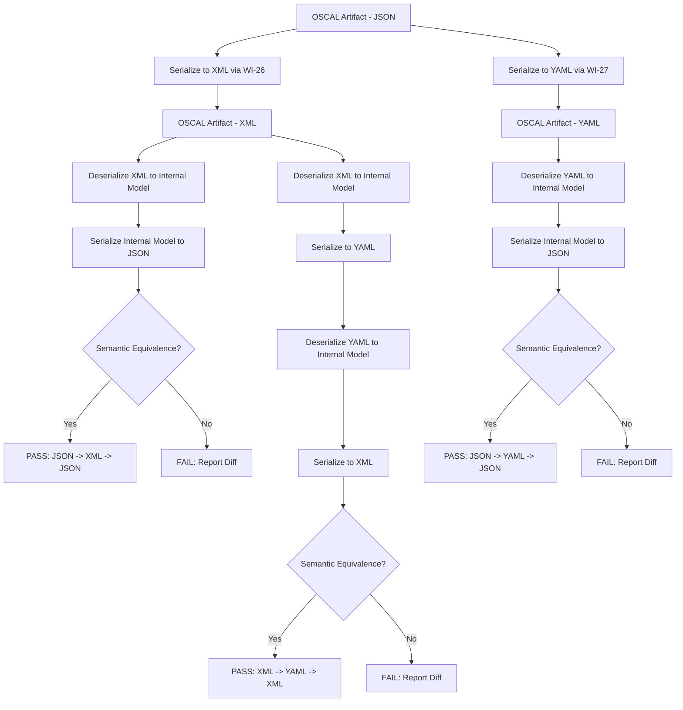
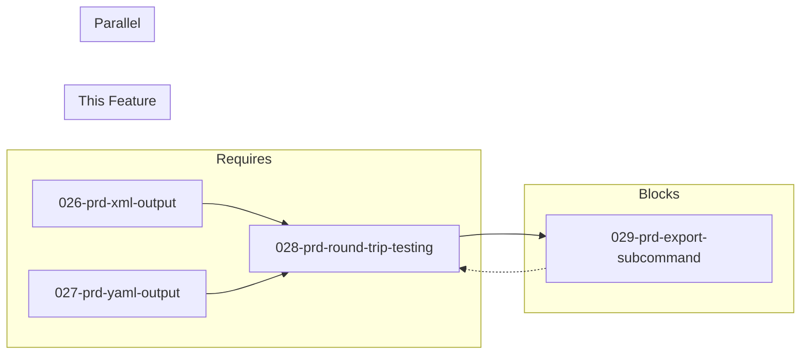

# 028-prd-round-trip-testing

> **Document Type:** Product Requirements Document
> **Audience:** LLM agents, human reviewers
> **Status:** Draft
> **Last Updated:** 2026-02-10 <!-- @auto -->
> **Owner:** Brian Luby <!-- @human-required -->

**Feature Branch**: `028-round-trip-testing`
**Created**: 2026-02-10
**Status**: Draft
**Input**: Derived from FORGE Product Roadmap WI-28

---

## Review Tier Legend

| Marker | Tier | Speckit Behavior |
|--------|------|------------------|
| :red_circle: `@human-required` | Human Generated | Prompt human to author; blocks until complete |
| :yellow_circle: `@human-review` | LLM + Human Review | LLM drafts -> prompt human to confirm/edit; blocks until confirmed |
| :green_circle: `@llm-autonomous` | LLM Autonomous | LLM completes; no prompt; logged for audit |
| :white_circle: `@auto` | Auto-generated | System fills (timestamps, links); no prompt |

---

## Document Completion Order

> :warning: **For LLM Agents:** Complete sections in this order. Do not fill downstream sections until upstream human-required inputs exist.

1. **Context** (Background, Scope) -> requires human input first
2. **Problem Statement & User Scenarios** -> requires human input
3. **Requirements** (Must/Should/Could/Won't) -> requires human input
4. **Technical Constraints** -> human review
5. **Diagrams, Data Model, Interface** -> LLM can draft after above exist
6. **Acceptance Criteria** -> derived from requirements
7. **Everything else** -> can proceed

---

## Context

### Background :red_circle: `@human-required`
This PRD covers **WI-28: Multi-Format Round-Trip Testing** from the FORGE Product Roadmap (Sprint S-28, Sep 8--12 2026, Theme T-4: Output Format Expansion, Milestone MS-5). After WI-26 (XML serialization via quick-xml) and WI-27 (YAML serialization via serde_yaml) deliver format-specific output capabilities, FORGE must verify that converting between formats introduces no data loss or semantic drift. Round-trip testing confirms that a JSON OSCAL artifact serialized to XML and then back to JSON (or through YAML and back) produces a semantically equivalent document. This is a quality and testing work item (PRD Req: --) that validates the correctness of the serialization implementations delivered by WI-26 and WI-27. It runs in parallel with WI-29 (export subcommand) and directly blocks WI-29, which cannot ship a format conversion subcommand without verified format fidelity. WI-28 is on the critical path: WI-26 -> WI-28 -> WI-30. The parent PRD evaluation criterion "Round-Trip Fidelity 100%" (Medium weight) is the primary metric this work item satisfies.

### Scope Boundaries :yellow_circle: `@human-review`

**In Scope:**
- JSON -> XML -> JSON round-trip conversion and semantic equivalence verification
- JSON -> YAML -> JSON round-trip conversion and semantic equivalence verification
- XML -> YAML -> XML round-trip conversion and semantic equivalence verification
- Automated semantic equivalence comparison that ignores JSON object key ordering
- Automated semantic equivalence comparison that ignores XML attribute ordering
- Test harness producing a pass/fail result per round-trip path with detailed diff on failure
- Testing against OSCAL Catalog, Component Definition, and Profile artifact types
- Confirming 100% round-trip fidelity as the deliverable

**Out of Scope:**
- Implementing serialization or deserialization logic -- delivered by WI-26 (XML) and WI-27 (YAML)
- The `forge export` subcommand -- delivered by WI-29 (029-prd-export-subcommand)
- oscal-cli integration for authoritative round-trip validation -- deferred to WI-37 (Phase 3)
- Performance benchmarking of serialization -- covered by separate performance work items
- Schema validation of output formats -- covered by WI-19 (schema validation) and format-specific validation in WI-26/WI-27

### Glossary :yellow_circle: `@human-review`

| Term | Definition |
|------|------------|
| Round-Trip | Converting data from format A to format B and back to format A, verifying the result is equivalent to the original |
| Semantic Equivalence | Two documents representing the same logical content, ignoring superficial differences such as key ordering, whitespace, or attribute order |
| JSON | JavaScript Object Notation -- the default OSCAL serialization format used by FORGE |
| XML | Extensible Markup Language -- an OSCAL-supported serialization format implemented in WI-26 |
| YAML | YAML Ain't Markup Language -- an OSCAL-supported serialization format implemented in WI-27 |
| quick-xml | Rust crate for XML serialization/deserialization, used by WI-26 |
| serde_yaml | Rust crate for YAML serialization/deserialization, used by WI-27 |
| Structural Diff | A comparison that operates on the parsed data structure rather than raw text, enabling order-independent comparison |
| OSCAL | Open Security Controls Assessment Language -- NIST standard for machine-readable security and compliance data |

### Related Documents :white_circle: `@auto`

| Document | Link | Relationship |
|----------|------|--------------|
| Parent PRD | docs/FORGE_PRD.md | Parent evaluation criterion: Round-Trip Fidelity 100% |
| Product Roadmap | docs/FORGE_PRODUCT_ROADMAP.md | Sprint S-28 context |
| Depends On | docs/PRD/026-prd-xml-output.md | XML serialization (WI-26) |
| Depends On | docs/PRD/027-prd-yaml-output.md | YAML serialization (WI-27) |
| Parallel With | docs/PRD/029-prd-export-subcommand.md | Export subcommand (WI-29) |
| Blocks | docs/PRD/029-prd-export-subcommand.md | Export subcommand needs verified formats (WI-29) |

---

## Problem Statement :red_circle: `@human-required`

FORGE supports three OSCAL output formats: JSON (default), XML (WI-26), and YAML (WI-27). Each format uses a different serialization crate with its own parsing and generation semantics. Without systematic round-trip testing, subtle data loss, type coercion errors, or structural divergences could be introduced during format conversion and go undetected. For example, XML serialization may alter element ordering, YAML may change numeric representations, or JSON may not preserve XML namespace semantics. The parent PRD mandates "Round-Trip Fidelity 100%" as a Medium-weight evaluation criterion, meaning every OSCAL artifact must survive conversion through any format pair without semantic data loss. Until this is verified, WI-29 (the `forge export` subcommand for format conversion) cannot ship, because users would be converting between formats with unverified fidelity. This work item creates the automated test infrastructure and executes the round-trip verification to confirm 100% fidelity across all format pairs.

---

## User Scenarios & Testing :red_circle: `@human-required`

### User Story 1 -- JSON to XML to JSON Round-Trip (Priority: P1)

A developer verifies that converting an OSCAL artifact from JSON to XML and back to JSON produces a semantically equivalent document.

> As a developer working on FORGE, I want automated round-trip tests for JSON -> XML -> JSON conversion so that I can confirm the XML serialization (WI-26) preserves all OSCAL data faithfully.

**Why this priority**: JSON is the primary format; XML is the most structurally different format. This is the highest-risk round-trip path because JSON's unordered objects and XML's ordered elements create the greatest opportunity for data loss.

**Independent Test**: Serialize a known OSCAL Catalog JSON to XML using WI-26's serializer, deserialize the XML back to JSON, and compare the result with the original using semantic equivalence (ignoring key ordering).

**Acceptance Scenarios**:
1. **Given** a valid OSCAL Catalog in JSON format, **When** converting JSON -> XML -> JSON, **Then** the resulting JSON is semantically equivalent to the original (all keys, values, and nested structures match, ignoring key order).
2. **Given** a valid OSCAL Component Definition in JSON format, **When** converting JSON -> XML -> JSON, **Then** the resulting JSON is semantically equivalent to the original.
3. **Given** an OSCAL artifact containing arrays with multiple elements, **When** converting JSON -> XML -> JSON, **Then** array element order is preserved.

---

### User Story 2 -- JSON to YAML to JSON Round-Trip (Priority: P1)

A developer verifies that converting an OSCAL artifact from JSON to YAML and back to JSON produces a semantically equivalent document.

> As a developer working on FORGE, I want automated round-trip tests for JSON -> YAML -> JSON conversion so that I can confirm the YAML serialization (WI-27) preserves all OSCAL data faithfully.

**Why this priority**: YAML introduces type coercion risks (e.g., bare "true"/"false" becoming booleans, numeric strings becoming numbers). This round-trip path verifies that OSCAL string values are preserved as strings through YAML serialization.

**Independent Test**: Serialize a known OSCAL Catalog JSON to YAML using WI-27's serializer, deserialize the YAML back to JSON, and compare the result with the original using semantic equivalence.

**Acceptance Scenarios**:
1. **Given** a valid OSCAL Catalog in JSON format, **When** converting JSON -> YAML -> JSON, **Then** the resulting JSON is semantically equivalent to the original.
2. **Given** a valid OSCAL Component Definition in JSON format, **When** converting JSON -> YAML -> JSON, **Then** the resulting JSON is semantically equivalent to the original.
3. **Given** an OSCAL artifact containing string values that resemble YAML special types (e.g., "true", "1.0", "null"), **When** converting JSON -> YAML -> JSON, **Then** those values remain as strings, not coerced to booleans, numbers, or nulls.

---

### User Story 3 -- XML to YAML to XML Round-Trip (Priority: P2)

A developer verifies that converting between the two non-JSON formats preserves data integrity.

> As a developer working on FORGE, I want automated round-trip tests for XML -> YAML -> XML conversion so that I can confirm all three format pairs produce equivalent results.

**Why this priority**: While JSON -> X -> JSON is the most common path, the export subcommand (WI-29) allows arbitrary format-to-format conversion. XML -> YAML -> XML must also be verified for completeness.

**Independent Test**: Load a valid OSCAL Catalog in XML, convert to YAML and back to XML, and compare the result with the original using semantic equivalence.

**Acceptance Scenarios**:
1. **Given** a valid OSCAL Catalog in XML format, **When** converting XML -> YAML -> XML, **Then** the resulting XML is semantically equivalent to the original (all elements, attributes, and text content match, ignoring attribute order).
2. **Given** an OSCAL artifact in XML format with namespace declarations, **When** converting XML -> YAML -> XML, **Then** OSCAL namespaces are preserved correctly.

---

### User Story 4 -- Automated Equivalence Comparison Utility (Priority: P1)

A developer has access to a reusable semantic equivalence comparison utility for use in tests across the project.

> As a developer working on FORGE, I want a semantic equivalence comparison utility so that round-trip tests and future format-related tests can reliably compare OSCAL documents regardless of superficial formatting differences.

**Why this priority**: Without a proper semantic comparison, tests would rely on string comparison, which would produce false negatives due to key ordering or whitespace differences. This utility is foundational for all round-trip assertions.

**Independent Test**: Compare two JSON documents with identical content but different key ordering and verify the utility reports them as equivalent.

**Acceptance Scenarios**:
1. **Given** two JSON objects with identical keys and values but different key ordering, **When** comparing with the semantic equivalence utility, **Then** the result is "equivalent".
2. **Given** two JSON objects where one has an extra key, **When** comparing with the semantic equivalence utility, **Then** the result is "not equivalent" with a diff indicating the missing/extra key.
3. **Given** two JSON objects where a nested value differs, **When** comparing with the semantic equivalence utility, **Then** the result is "not equivalent" with a diff indicating the path and differing values.

---

## Assumptions & Risks :yellow_circle: `@human-review`

### Assumptions
- [A-1] WI-26 (XML serialization) and WI-27 (YAML serialization) are complete and functional before round-trip testing begins.
- [A-2] The internal OSCAL model structs (from WI-5 and subsequent work items) serve as the canonical intermediate representation for all format conversions.
- [A-3] JSON is the canonical format; all round-trip comparisons can normalize through the internal model or through JSON for equivalence checking.
- [A-4] OSCAL does not define format-specific semantics -- the same logical content is expressible in JSON, XML, and YAML without loss.
- [A-5] Array/list ordering is semantically significant in OSCAL (e.g., control ordering within a group matters) and must be preserved through round-trips.

### Risks
| ID | Risk | Likelihood | Impact | Mitigation |
|----|------|------------|--------|------------|
| R-1 | XML namespace handling introduces discrepancies not caught by naive comparison | Med | Med | Implement namespace-aware XML comparison; test with NIST example artifacts that include namespace declarations |
| R-2 | YAML type coercion silently converts string values to non-string types | Med | High | Use serde_yaml's strict string handling; include test cases with YAML-ambiguous values ("true", "1.0", "null", "on", "off") |
| R-3 | Floating-point precision differences between formats cause false negatives | Low | Low | OSCAL uses string representations for most values; add precision-tolerant comparison for any numeric fields |
| R-4 | Large artifacts with deeply nested structures reveal edge cases not present in small test fixtures | Low | Med | Include at least one large, realistic OSCAL Catalog fixture (50+ controls) in the test suite |

---

## Feature Overview

### Flow Diagram :yellow_circle: `@human-review`



### State Diagram (if applicable) :yellow_circle: `@human-review`
N/A -- No state transitions in this work item. Round-trip testing is a stateless verification process.

---

## Requirements

### Must Have (M) -- MVP, launch blockers :red_circle: `@human-required`
- [ ] **M-1:** The test suite shall verify JSON -> XML -> JSON round-trip fidelity for OSCAL Catalog artifacts, confirming 100% semantic equivalence. *(Traces to: Parent PRD Round-Trip Fidelity 100%)*
- [ ] **M-2:** The test suite shall verify JSON -> YAML -> JSON round-trip fidelity for OSCAL Catalog artifacts, confirming 100% semantic equivalence. *(Traces to: Parent PRD Round-Trip Fidelity 100%)*
- [ ] **M-3:** The test suite shall verify JSON -> XML -> JSON round-trip fidelity for OSCAL Component Definition artifacts, confirming 100% semantic equivalence. *(Traces to: Parent PRD Round-Trip Fidelity 100%)*
- [ ] **M-4:** The test suite shall verify JSON -> YAML -> JSON round-trip fidelity for OSCAL Component Definition artifacts, confirming 100% semantic equivalence. *(Traces to: Parent PRD Round-Trip Fidelity 100%)*
- [ ] **M-5:** The semantic equivalence comparison shall ignore JSON object key ordering when determining equivalence. *(Traces to: Parent PRD Round-Trip Fidelity 100%)*
- [ ] **M-6:** The semantic equivalence comparison shall preserve and verify array element ordering, since OSCAL array order is significant. *(Traces to: Parent PRD Round-Trip Fidelity 100%)*
- [ ] **M-7:** The test suite shall produce a clear pass/fail result per round-trip path, with a detailed structural diff on failure indicating the path and nature of the discrepancy. *(Traces to: quality/testing)*
- [ ] **M-8:** The semantic equivalence comparison shall verify that all data types are preserved through round-trips (strings remain strings, numbers remain numbers, booleans remain booleans, nulls remain nulls). *(Traces to: Parent PRD Round-Trip Fidelity 100%)*

### Should Have (S) -- High value, not blocking :red_circle: `@human-required`
- [ ] **S-1:** The test suite should verify XML -> YAML -> XML round-trip fidelity for OSCAL Catalog artifacts.
- [ ] **S-2:** The test suite should include test cases with YAML-ambiguous string values (e.g., "true", "false", "1.0", "null", "on", "off", "yes", "no") to verify no type coercion occurs.
- [ ] **S-3:** The semantic equivalence utility should be exposed as a reusable module for use by other test suites (e.g., WI-29 export tests, WI-37 oscal-cli integration tests).
- [ ] **S-4:** The test suite should include at least one large, realistic OSCAL fixture (50+ controls) to verify fidelity at scale.

### Could Have (C) -- Nice to have, if time permits :yellow_circle: `@human-review`
- [ ] **C-1:** The test suite could verify round-trip fidelity for OSCAL Profile artifacts (depends on WI-30+ being available).
- [ ] **C-2:** The test suite could produce a summary report showing all round-trip paths tested with pass/fail status and timing.
- [ ] **C-3:** The semantic equivalence utility could support configurable tolerance for floating-point numeric comparisons.

### Won't Have (W) -- Explicitly deferred :yellow_circle: `@human-review`
- [ ] **W-1:** oscal-cli authoritative round-trip validation -- *Reason: Deferred to WI-37 (Phase 3) which uses NIST's oscal-cli for cross-tool round-trip verification*
- [ ] **W-2:** Performance benchmarking of serialization/deserialization -- *Reason: Covered by separate performance work items; this work item focuses on correctness, not speed*
- [ ] **W-3:** Round-trip testing for non-OSCAL formats (e.g., Markdown -> OSCAL -> Markdown) -- *Reason: FORGE is a one-way converter; source-to-OSCAL is not invertible*
- [ ] **W-4:** Fuzz testing with randomly generated OSCAL structures -- *Reason: Out of scope for this sprint; can be added as a follow-on quality task*

---

## Technical Constraints :yellow_circle: `@human-review`

- **Language/Framework:** Rust (latest stable), Cargo test framework
- **Serialization Crates:** `serde_json` (JSON), `quick-xml` via WI-26 (XML), `serde_yaml` via WI-27 (YAML)
- **Comparison Approach:** Structural comparison via deserialized `serde_json::Value` trees for JSON equivalence; normalize XML and YAML through the internal model or JSON for comparison
- **Test Fixtures:** Pre-built OSCAL Catalog and Component Definition artifacts in JSON format, generated by FORGE's existing pipeline (WI-13, WI-14)
- **Error Handling:** Test failures must produce actionable diffs showing the structural path and nature of the discrepancy
- **Testing:** TDD mandatory per constitution principle IV; all round-trip tests must be automated and run as part of `cargo test`
- **Linting:** `cargo clippy -- -D warnings` must pass
- **Formatting:** `cargo fmt --check` must pass

---

## Data Model (if applicable) :yellow_circle: `@human-review`

N/A -- This work item does not introduce new data model structs. It tests the existing serialization/deserialization of OSCAL model structs (Catalog, Component Definition) through the format converters delivered by WI-26 and WI-27. The semantic equivalence comparison operates on `serde_json::Value` trees.

---

## Interface Contract (if applicable) :yellow_circle: `@human-review`

```rust
use serde_json::Value;

/// Result of a semantic equivalence comparison between two OSCAL documents.
#[derive(Debug)]
pub struct EquivalenceResult {
    /// Whether the two documents are semantically equivalent
    pub is_equivalent: bool,
    /// Human-readable diff details if not equivalent; empty if equivalent
    pub differences: Vec<EquivalenceDiff>,
}

/// A single difference found during semantic comparison.
#[derive(Debug)]
pub struct EquivalenceDiff {
    /// JSON Pointer-style path to the differing element (e.g., "/catalog/metadata/title")
    pub path: String,
    /// Description of the difference
    pub description: String,
    /// The expected value (from the original document)
    pub expected: Option<String>,
    /// The actual value (from the round-tripped document)
    pub actual: Option<String>,
}

/// Compare two OSCAL documents for semantic equivalence.
/// Ignores JSON object key ordering; preserves array element ordering.
pub fn assert_semantic_equivalence(
    original: &Value,
    round_tripped: &Value,
) -> EquivalenceResult;

/// Round-trip test helper: JSON -> XML -> JSON
pub fn round_trip_json_xml_json(json_input: &Value) -> Result<Value, ForgeError>;

/// Round-trip test helper: JSON -> YAML -> JSON
pub fn round_trip_json_yaml_json(json_input: &Value) -> Result<Value, ForgeError>;

/// Round-trip test helper: XML -> YAML -> XML (via internal model)
pub fn round_trip_xml_yaml_xml(xml_input: &str) -> Result<String, ForgeError>;
```

---

## Evaluation Criteria :yellow_circle: `@human-review`

| Criterion | Weight | Metric | Target | Notes |
|-----------|--------|--------|--------|-------|
| Round-Trip Fidelity (JSON-XML-JSON) | Critical | Semantic equivalence after JSON -> XML -> JSON | 100% | Zero data loss for Catalog and Component Definition |
| Round-Trip Fidelity (JSON-YAML-JSON) | Critical | Semantic equivalence after JSON -> YAML -> JSON | 100% | Zero data loss, no type coercion |
| Semantic Comparison Accuracy | Critical | Comparison correctly identifies equivalent and non-equivalent documents | 100% | No false positives or false negatives |
| Test Coverage | High | All Must Have round-trip paths automated | 100% of M-requirements | Tests run in `cargo test` |
| Diff Quality | Medium | Failure output identifies the structural path and nature of discrepancy | Actionable diffs | Developer can locate and fix the issue from the diff alone |

---

## Tool/Approach Candidates :yellow_circle: `@human-review`

| Option | License | Pros | Cons | Spike Result |
|--------|---------|------|------|--------------|
| `serde_json::Value` tree comparison | MIT/Apache-2.0 | Already a dependency; recursive structural comparison is straightforward | Must implement custom comparison logic for ordering semantics | Selected |
| `assert_json_diff` crate | MIT | Purpose-built for JSON diff assertions in tests | Additional dependency; may not handle all OSCAL edge cases | Evaluated as supplement |
| Manual string comparison | N/A | No additional dependencies | Fragile; fails on key reordering, whitespace differences | Rejected |
| `json-patch` (RFC 6902) | MIT | Produces structured diffs as JSON Patch operations | Over-engineered for equivalence checking; patch semantics differ from diff semantics | Not selected |

### Selected Approach :red_circle: `@human-required`
> **Decision:** Implement semantic equivalence comparison using recursive `serde_json::Value` tree traversal. Normalize all formats through the internal OSCAL model (deserialize -> re-serialize to JSON) for comparison. Optionally supplement with `assert_json_diff` crate for enhanced diff output in test failures.
> **Rationale:** Using `serde_json::Value` as the canonical comparison type leverages the existing dependency, avoids format-specific comparison logic, and naturally handles JSON key ordering insensitivity (since `serde_json::Value::Object` uses `Map` which can be compared structurally). The internal model normalization ensures that format-specific artifacts (e.g., XML namespaces, YAML anchors) are resolved before comparison.

---

## Acceptance Criteria :yellow_circle: `@human-review`

| AC ID | Requirement | User Story | Given | When | Then |
|-------|-------------|------------|-------|------|------|
| AC-1 | M-1 | US-1 | A valid OSCAL Catalog in JSON | Converting JSON -> XML -> JSON | The resulting JSON is semantically equivalent to the original |
| AC-2 | M-2 | US-2 | A valid OSCAL Catalog in JSON | Converting JSON -> YAML -> JSON | The resulting JSON is semantically equivalent to the original |
| AC-3 | M-3 | US-1 | A valid OSCAL Component Definition in JSON | Converting JSON -> XML -> JSON | The resulting JSON is semantically equivalent to the original |
| AC-4 | M-4 | US-2 | A valid OSCAL Component Definition in JSON | Converting JSON -> YAML -> JSON | The resulting JSON is semantically equivalent to the original |
| AC-5 | M-5 | US-4 | Two JSON objects with identical content but different key ordering | Comparing with semantic equivalence utility | The result is "equivalent" |
| AC-6 | M-6 | US-1, US-2 | An OSCAL artifact with ordered arrays (e.g., controls in a group) | Round-tripping through XML or YAML | Array element order is preserved in the round-tripped result |
| AC-7 | M-7 | US-4 | Two non-equivalent OSCAL JSON documents | Comparing with semantic equivalence utility | A detailed diff is produced showing the path and nature of each discrepancy |
| AC-8 | M-8 | US-2 | An OSCAL artifact containing string values "true", "1.0", and "null" | Round-tripping through YAML | Those values remain strings, not coerced to booleans, numbers, or nulls |

### Edge Cases :green_circle: `@llm-autonomous`
- [ ] **EC-1:** (M-5) When comparing two empty JSON objects `{}`, then the result is "equivalent".
- [ ] **EC-2:** (M-6) When an OSCAL artifact contains an empty array `[]`, then the empty array is preserved through all round-trip paths.
- [ ] **EC-3:** (M-8) When an OSCAL artifact contains a string value that is a valid ISO 8601 timestamp (e.g., `"2026-09-08T10:00:00Z"`), then it remains a string after YAML round-trip (YAML may interpret unquoted timestamps as datetime objects).
- [ ] **EC-4:** (M-8) When an OSCAL artifact contains a UUID string (e.g., `"550e8400-e29b-41d4-a716-446655440000"`), then it remains a string after all round-trip paths.
- [ ] **EC-5:** (M-1) When an OSCAL artifact contains deeply nested objects (5+ levels), then all levels are preserved through round-trips.
- [ ] **EC-6:** (M-8) When an OSCAL artifact contains a numeric string like `"10"` or `"3.14"`, then it remains a string after YAML round-trip (not coerced to an integer or float).
- [ ] **EC-7:** (S-2) When an OSCAL artifact contains string values "yes", "no", "on", "off" (YAML 1.1 booleans), then they remain strings after YAML round-trip.

---

## Dependencies :yellow_circle: `@human-review`



- **Requires:** [026-prd-xml-output](docs/PRD/026-prd-xml-output.md) (WI-26: XML serialization must be functional), [027-prd-yaml-output](docs/PRD/027-prd-yaml-output.md) (WI-27: YAML serialization must be functional)
- **Blocks:** [029-prd-export-subcommand](docs/PRD/029-prd-export-subcommand.md) (WI-29: export subcommand needs verified formats)
- **Parallel With:** WI-29 (export subcommand development can proceed in parallel, but verification gate requires WI-28 results)
- **External:** None

---

## Security Considerations :yellow_circle: `@human-review`

| Aspect | Assessment | Notes |
|--------|------------|-------|
| Internet Exposure | No | Round-trip testing is entirely local; no network calls |
| Sensitive Data | No | Tests operate on synthetic OSCAL fixtures, not real policy data |
| Authentication Required | No | Local test execution |
| Security Review Required | No | No attack surface; test-only code with no user-facing input processing |

---

## Implementation Guidance :green_circle: `@llm-autonomous`

### Suggested Approach
Create a `tests/round_trip.rs` integration test file (or a module under the existing test structure) that exercises all round-trip paths. Implement a `semantic_eq` module (or utility within the test support code) that recursively compares `serde_json::Value` trees. For JSON objects, compare keys as sets (ignoring order) and recursively compare values. For JSON arrays, compare element-by-element in order. For primitives, compare directly. For the round-trip functions, leverage the serialization and deserialization functions from WI-26 and WI-27: serialize the internal OSCAL model to the target format, deserialize it back to the internal model, then re-serialize to JSON for comparison. Use test fixtures that include representative OSCAL Catalogs and Component Definitions, ideally the golden files from WI-21/WI-22. Include targeted edge-case fixtures for YAML type coercion risks (strings like "true", "1.0", "null", "yes", "no", "on", "off"). Ensure each test case names its round-trip path clearly (e.g., `test_catalog_json_xml_json`, `test_component_json_yaml_json`).

### Anti-patterns to Avoid
- Comparing serialized output as raw strings -- this will fail due to key ordering, whitespace, and formatting differences
- Testing only with trivial fixtures (e.g., minimal single-control catalogs) -- include realistic fixtures with nested structures, arrays, and metadata
- Ignoring YAML type coercion -- this is the most likely source of round-trip failures and must be explicitly tested
- Coupling round-trip tests to a specific serialization order -- tests should be order-independent for JSON and attribute-independent for XML
- Duplicating serialization logic in tests -- reuse the same serialization functions that production code uses

### Reference Examples
- NIST OSCAL examples repository: https://github.com/usnistgov/oscal-content
- `serde_json::Value` comparison: equality check on deserialized `Value` trees inherently ignores insertion order for `Map<String, Value>`
- `assert_json_diff` crate: https://docs.rs/assert-json-diff/latest/assert_json_diff/

---

## Spike Tasks :yellow_circle: `@human-review`

N/A -- No spike tasks for this work item. The serialization crates (quick-xml, serde_yaml) were evaluated and selected in WI-26 and WI-27. The comparison approach using `serde_json::Value` trees is well-understood.

---

## Success Metrics :red_circle: `@human-required`

| Metric | Baseline | Target | Measurement Method |
|--------|----------|--------|-------------------|
| JSON -> XML -> JSON fidelity | N/A | 100% semantic equivalence | Automated round-trip tests |
| JSON -> YAML -> JSON fidelity | N/A | 100% semantic equivalence | Automated round-trip tests |
| YAML type coercion incidents | N/A | 0 incidents | Edge-case tests with YAML-ambiguous values |
| Round-trip test pass rate | N/A | 100% of tests passing | `cargo test` |

### Technical Verification :green_circle: `@llm-autonomous`
| Metric | Target | Verification Method |
|--------|--------|---------------------|
| Test coverage for round-trip paths | >95% | `cargo test` + coverage tool |
| No clippy warnings | 0 | `cargo clippy -- -D warnings` |
| No formatting violations | 0 | `cargo fmt --check` |
| All round-trip paths tested | JSON-XML-JSON, JSON-YAML-JSON for both Catalog and Component Definition | Test naming convention verification |
| Edge case coverage | All EC items have corresponding test cases | Test audit |

---

## Definition of Ready :red_circle: `@human-required`

### Readiness Checklist
- [x] Problem statement reviewed and validated by stakeholder
- [x] All Must Have requirements have acceptance criteria
- [x] Technical constraints are explicit and agreed
- [x] Dependencies identified and owners confirmed
- [x] Security review completed (or N/A documented with justification)
- [x] No open questions blocking implementation

### Sign-off
| Role | Name | Date | Decision |
|------|------|------|----------|
| Product Owner | Brian Luby | YYYY-MM-DD | [Ready / Not Ready] |

---

## Changelog :white_circle: `@auto`

| Version | Date | Author | Changes |
|---------|------|--------|---------|
| 0.1 | 2026-02-10 | LLM (Claude) | Initial draft derived from FORGE Product Roadmap WI-28 |

---

## Decision Log :yellow_circle: `@human-review`

| Date | Decision | Rationale | Alternatives Considered |
|------|----------|-----------|------------------------|
| 2026-02-10 | Use `serde_json::Value` tree comparison for semantic equivalence | `serde_json::Value::Object` uses `BTreeMap` or `Map` where equality is key-order-independent; avoids string comparison fragility; leverages existing dependency | String-level comparison (fragile, fails on reordering); `json-patch` RFC 6902 (over-engineered for equivalence); custom AST comparison (unnecessary given serde_json) |
| 2026-02-10 | Normalize all formats through internal model for comparison | Converting XML/YAML to internal model then to JSON ensures format-specific artifacts (namespaces, anchors) are resolved before comparison; single comparison path for all format pairs | Direct format-to-format comparison (requires format-specific comparison logic for each pair); binary comparison of internal model (not serialization-aware) |
| 2026-02-10 | Include YAML type coercion edge cases as explicit test requirements | YAML 1.1 type coercion is a well-known source of data loss; OSCAL string values like UUIDs, timestamps, and version numbers resemble YAML special types | Rely on serde_yaml defaults (risky; coercion behavior varies by YAML version); test only happy path (insufficient coverage for production reliability) |

---

## Open Questions :yellow_circle: `@human-review`

No open questions for this work item.

---

## Review Checklist :green_circle: `@llm-autonomous`

Before marking as Approved:
- [x] All requirements have unique IDs (M-1 through M-8, S-1 through S-4, C-1 through C-3, W-1 through W-4)
- [x] All Must Have requirements have linked acceptance criteria
- [x] User stories are prioritized and independently testable
- [x] Acceptance criteria reference both requirement IDs and user stories
- [x] Glossary terms are used consistently throughout
- [x] Diagrams use terminology from Glossary
- [x] Security considerations documented
- [x] Definition of Ready checklist is complete
- [x] No open questions blocking implementation
