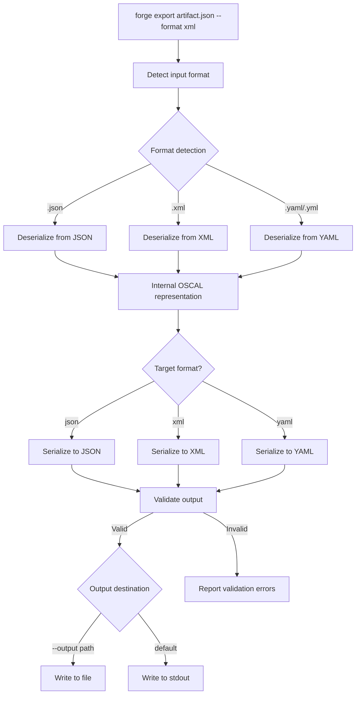
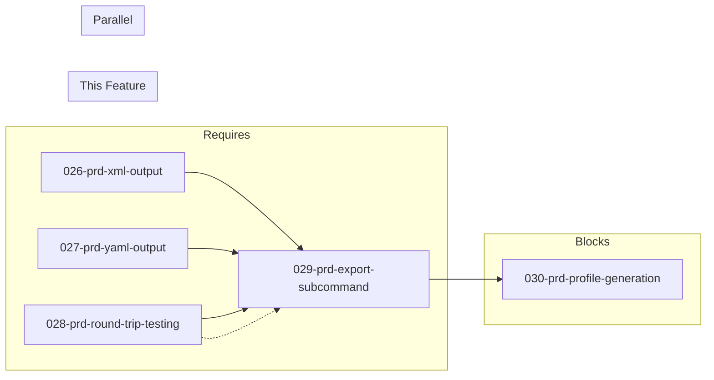

# 029-prd-export-subcommand

> **Document Type:** Product Requirements Document
> **Audience:** LLM agents, human reviewers
> **Status:** Draft
> **Last Updated:** 2026-02-10 <!-- @auto -->
> **Owner:** Brian Luby <!-- @human-required -->

**Feature Branch**: `029-export-subcommand`
**Created**: 2026-02-10
**Status**: Draft
**Input**: Derived from FORGE Product Roadmap WI-29

---

## Review Tier Legend

| Marker | Tier | Speckit Behavior |
|--------|------|------------------|
| :red_circle: `@human-required` | Human Generated | Prompt human to author; blocks until complete |
| :yellow_circle: `@human-review` | LLM + Human Review | LLM drafts -> prompt human to confirm/edit; blocks until confirmed |
| :green_circle: `@llm-autonomous` | LLM Autonomous | LLM completes; no prompt; logged for audit |
| :white_circle: `@auto` | Auto-generated | System fills (timestamps, links); no prompt |

---

## Document Completion Order

> :warning: **For LLM Agents:** Complete sections in this order. Do not fill downstream sections until upstream human-required inputs exist.

1. **Context** (Background, Scope) -> requires human input first
2. **Problem Statement & User Scenarios** -> requires human input
3. **Requirements** (Must/Should/Could/Won't) -> requires human input
4. **Technical Constraints** -> human review
5. **Diagrams, Data Model, Interface** -> LLM can draft after above exist
6. **Acceptance Criteria** -> derived from requirements
7. **Everything else** -> can proceed

---

## Context

### Background :red_circle: `@human-required`
This PRD covers **WI-29: `forge export` Subcommand** from the FORGE Product Roadmap (Sprint S-29, Sep 15--19 2026, Theme T-4: Output Format Expansion, Milestone MS-5). The `forge convert` command takes a source policy document (Markdown) and produces an OSCAL artifact in a specified format. However, once an OSCAL artifact already exists in one format (e.g., JSON), users need a way to convert it to another OSCAL format (e.g., XML or YAML) without re-running the full ingestion and conversion pipeline. The `forge export` subcommand addresses this need: it reads an existing OSCAL artifact file, detects its current format, deserializes it, re-serializes it to the target format, and validates the output. This is distinct from `forge convert` which operates on source policy documents. WI-29 depends on WI-26 (XML serialization), WI-27 (YAML serialization), and WI-28 (round-trip testing) to provide the underlying format serialization and validation capabilities. It runs in parallel with WI-28 and blocks WI-30 (Profile generation), which relies on multi-format output support being fully operational.

### Scope Boundaries :yellow_circle: `@human-review`

**In Scope:**
- Implementing the `forge export` CLI subcommand with `<input>` and `--format <json|xml|yaml>` arguments
- Auto-detecting the input artifact's current format (JSON, XML, or YAML) based on file extension and/or content inspection
- Deserializing the input OSCAL artifact into the internal representation
- Re-serializing the artifact to the target output format
- Validating the converted output against OSCAL v1.2.0 schemas for the target format
- Supporting `--output <path>` for file output (default: stdout)
- Producing actionable error messages when input is not a valid OSCAL artifact or when conversion fails

**Out of Scope:**
- Source policy document ingestion or parsing -- that is `forge convert` (WI-13, WI-18)
- XML serialization implementation -- covered by WI-26 (026-prd-xml-output)
- YAML serialization implementation -- covered by WI-27 (027-prd-yaml-output)
- Round-trip equivalence testing infrastructure -- covered by WI-28 (028-prd-round-trip-testing)
- Profile generation -- deferred to WI-30 (030-prd-profile-generation)
- Schema validation implementation -- covered by WI-19/WI-20; this WI reuses the existing validation infrastructure
- OSCAL model type detection (Catalog vs Component Definition vs Profile) -- the export operates on the serialized representation generically

### Glossary :yellow_circle: `@human-review`

| Term | Definition |
|------|------------|
| Export | The act of converting an existing OSCAL artifact from one serialization format to another (JSON, XML, YAML) |
| OSCAL Artifact | A file containing a valid OSCAL document (Catalog, Component Definition, Profile, etc.) in JSON, XML, or YAML format |
| Format Conversion | Deserializing an OSCAL artifact from its source format and re-serializing it to a different target format |
| Input Format Detection | Automatically determining whether an input file is JSON, XML, or YAML based on file extension or content |
| Round-Trip Fidelity | The property that converting an artifact from format A to format B and back to format A produces a semantically equivalent result |
| quick-xml | Rust crate used for OSCAL XML serialization and deserialization |
| serde_yaml | Rust crate used for OSCAL YAML serialization and deserialization |

### Related Documents :white_circle: `@auto`

| Document | Link | Relationship |
|----------|------|--------------|
| Parent PRD | docs/FORGE_PRD.md | Parent requirements S-3 (XML output), S-4 (YAML output), US-5 AC-2 |
| Product Roadmap | docs/FORGE_PRODUCT_ROADMAP.md | Sprint S-29 context |
| Depends On | docs/PRD/026-prd-xml-output.md | XML serialization (WI-26) |
| Depends On | docs/PRD/027-prd-yaml-output.md | YAML serialization (WI-27) |
| Depends On | docs/PRD/028-prd-round-trip-testing.md | Round-trip testing (WI-28) |
| Parallel With | docs/PRD/028-prd-round-trip-testing.md | Round-trip testing runs in parallel (WI-28) |
| Blocks | docs/PRD/030-prd-profile-generation.md | Profile generation (WI-30) |
| Product Vision | docs/FORGE_PRODUCT_VISION.md | Strategic goal G-2 |
| Constitution | .specify/memory/constitution.md | Technical constraints and quality gates |

---

## Problem Statement :red_circle: `@human-required`

Users who have already generated OSCAL artifacts via `forge convert` (or received OSCAL artifacts from other tools) need a way to convert between JSON, XML, and YAML formats without re-running the full policy-to-OSCAL conversion pipeline. Different tools in the OSCAL ecosystem expect specific formats: some GRC tools require XML, web APIs prefer JSON, and human-readable workflows favor YAML. Without a dedicated `forge export` subcommand, users would need to use external tools or re-run the entire `forge convert` pipeline to change output format, which is wasteful when the OSCAL content is already correct. The `forge export` subcommand provides a fast, validated format conversion that preserves semantic equivalence and validates the output against the target format's OSCAL schema.

---

## User Scenarios & Testing :red_circle: `@human-required`

### User Story 1 -- Convert OSCAL JSON to XML (Priority: P1)

A compliance engineer has a valid OSCAL Catalog in JSON format and needs to provide it to a GRC tool that requires XML input.

> As a compliance engineer, I want to convert an existing OSCAL JSON artifact to XML so that I can provide it to tools that require XML-formatted OSCAL input.

**Why this priority**: JSON-to-XML conversion is the most common cross-format need, as many GRC tools and NIST-adjacent workflows expect XML. This is the core use case for `forge export` and directly satisfies parent PRD US-5 AC-2.

**Independent Test**: Run `forge export catalog.json --format xml` and verify the output is a valid OSCAL XML document semantically equivalent to the input JSON.

**Acceptance Scenarios**:
1. **Given** a valid OSCAL Catalog JSON file, **When** running `forge export catalog.json --format xml`, **Then** a valid OSCAL XML representation is produced to stdout.
2. **Given** a valid OSCAL Catalog JSON file and `--output catalog.xml`, **When** running `forge export catalog.json --format xml --output catalog.xml`, **Then** the XML output is written to the specified file path.

---

### User Story 2 -- Convert OSCAL JSON to YAML (Priority: P1)

A compliance engineer needs a human-readable YAML representation of an OSCAL artifact for review or manual editing.

> As a compliance engineer, I want to convert an existing OSCAL JSON artifact to YAML so that I can review or edit the artifact in a more human-readable format.

**Why this priority**: YAML is preferred for human review and manual editing workflows. Supporting JSON-to-YAML conversion alongside JSON-to-XML completes the multi-format story.

**Independent Test**: Run `forge export catalog.json --format yaml` and verify the output is a valid OSCAL YAML document semantically equivalent to the input JSON.

**Acceptance Scenarios**:
1. **Given** a valid OSCAL Catalog JSON file, **When** running `forge export catalog.json --format yaml`, **Then** a valid OSCAL YAML representation is produced.
2. **Given** a valid OSCAL Component Definition JSON file, **When** running `forge export component.json --format yaml`, **Then** the YAML output contains the same semantic content as the JSON input.

---

### User Story 3 -- Convert Between Any Format Pair (Priority: P1)

A user needs to convert between any combination of JSON, XML, and YAML formats.

> As a compliance engineer, I want `forge export` to handle any format-to-format conversion (JSON, XML, YAML in any combination) so that I have full flexibility in format conversion regardless of the source format.

**Why this priority**: Full format flexibility is required for a complete multi-format export capability. Users may receive OSCAL artifacts in any format and need to convert to any other format.

**Independent Test**: Run `forge export catalog.xml --format json` and verify the output is a valid OSCAL JSON document.

**Acceptance Scenarios**:
1. **Given** a valid OSCAL XML artifact, **When** running `forge export artifact.xml --format json`, **Then** a valid OSCAL JSON representation is produced.
2. **Given** a valid OSCAL YAML artifact, **When** running `forge export artifact.yaml --format xml`, **Then** a valid OSCAL XML representation is produced.
3. **Given** a valid OSCAL JSON artifact, **When** running `forge export artifact.json --format json`, **Then** the output is a valid (potentially re-formatted) JSON representation.

---

### User Story 4 -- Validate Output After Conversion (Priority: P1)

The exported artifact must be validated against the target format's OSCAL schema to ensure correctness.

> As a compliance engineer, I want `forge export` to validate the converted output so that I can trust the exported artifact is a valid OSCAL document in the target format.

**Why this priority**: Validation after conversion is essential to guarantee that the format transformation did not introduce errors or lose data. This is a core differentiator over generic format conversion tools.

**Independent Test**: Run `forge export artifact.json --format xml` on a valid input and verify the output passes OSCAL schema validation; run on an invalid input and verify an error is reported.

**Acceptance Scenarios**:
1. **Given** a valid OSCAL artifact, **When** exporting to any target format, **Then** the output passes OSCAL v1.2.0 schema validation for the target format.
2. **Given** an invalid or non-OSCAL input file, **When** running `forge export invalid.json --format xml`, **Then** a descriptive error is reported indicating the input is not a valid OSCAL artifact.

---

## Assumptions & Risks :yellow_circle: `@human-review`

### Assumptions
- [A-1] WI-26 (XML serialization) and WI-27 (YAML serialization) are complete, providing the serialization and deserialization capabilities that `forge export` depends on.
- [A-2] WI-28 (round-trip testing) has confirmed that format conversions preserve semantic equivalence, giving confidence that `forge export` produces correct output.
- [A-3] The internal OSCAL representation (Rust structs with serde derives) can deserialize from any of the three formats and serialize to any of the three formats without data loss.
- [A-4] File extension is a reliable primary indicator of format (.json, .xml, .yaml/.yml); content inspection is a fallback.
- [A-5] Schema validation infrastructure from WI-19/WI-20 is available and supports validation of JSON, XML, and YAML artifacts.

### Risks
| ID | Risk | Likelihood | Impact | Mitigation |
|----|------|------------|--------|------------|
| R-1 | Deserialization from XML or YAML loses fields or ordering not preserved by serde | Low | Med | WI-28 round-trip testing should catch these issues before WI-29 begins; add explicit round-trip assertions in export tests |
| R-2 | Schema validation for XML and YAML formats is not yet implemented (WI-19 targets JSON schemas) | Med | Med | Implement format-specific validation or convert-then-validate-as-JSON as fallback; document limitation if XML/YAML schema validation is deferred |
| R-3 | Large OSCAL artifacts cause memory issues during deserialization/re-serialization | Low | Low | Use streaming where possible; benchmark with large artifacts from WI-24 |

---

## Feature Overview

### Flow Diagram :yellow_circle: `@human-review`



### State Diagram (if applicable) :yellow_circle: `@human-review`
N/A -- The export subcommand is a single-pass transformation with no state transitions.

---

## Requirements

### Must Have (M) -- MVP, launch blockers :red_circle: `@human-required`
- [ ] **M-1:** The CLI shall provide a `forge export <input> --format <json|xml|yaml>` subcommand that converts an existing OSCAL artifact to the specified target format. *(Traces to: Parent PRD S-3, S-4, US-5 AC-2)*
- [ ] **M-2:** The `forge export` subcommand shall auto-detect the input artifact's format from the file extension (`.json`, `.xml`, `.yaml`, `.yml`). *(Traces to: Parent PRD S-3, S-4)*
- [ ] **M-3:** The `forge export` subcommand shall deserialize the input OSCAL artifact and re-serialize it to the target format, preserving semantic equivalence. *(Traces to: Parent PRD S-3, S-4)*
- [ ] **M-4:** The `forge export` subcommand shall validate the converted output against OSCAL v1.2.0 schemas and report errors if the output is invalid. *(Traces to: Parent PRD M-6)*
- [ ] **M-5:** The `forge export` subcommand shall support `--output <path>` for writing to a file, defaulting to stdout when `--output` is not specified. *(Traces to: Parent PRD S-3, S-4)*
- [ ] **M-6:** The `forge export` subcommand shall report a descriptive error and exit with a non-zero status code when the input file is not a valid OSCAL artifact. *(Traces to: Parent PRD M-6, EC-9)*

### Should Have (S) -- High value, not blocking :red_circle: `@human-required`
- [ ] **S-1:** The `forge export` subcommand should support content-based format detection as a fallback when the file extension is ambiguous or missing.
- [ ] **S-2:** The `forge export` subcommand should report the detected input format and target output format in verbose mode (`--verbose`).
- [ ] **S-3:** When the input format matches the target format (e.g., `forge export artifact.json --format json`), the subcommand should re-serialize and validate the artifact (effectively a format normalization pass).

### Could Have (C) -- Nice to have, if time permits :yellow_circle: `@human-review`
- [ ] **C-1:** The `forge export` subcommand could support `--validate-only` flag to validate the input without producing output, acting as a quick validation shortcut.
- [ ] **C-2:** The `forge export` subcommand could display a summary of the conversion (artifact type, number of controls/components, format change) in verbose mode.

### Won't Have (W) -- Explicitly deferred :yellow_circle: `@human-review`
- [ ] **W-1:** Batch export of multiple artifacts in a single invocation -- *Reason: Deferred to WI-40 (batch conversion)*
- [ ] **W-2:** Streaming/incremental conversion for very large artifacts -- *Reason: Not needed for MVP; standard full-document deserialization/serialization is sufficient*
- [ ] **W-3:** Format conversion for non-OSCAL files (generic JSON/XML/YAML conversion) -- *Reason: FORGE is OSCAL-specific; generic format tools already exist*

---

## Technical Constraints :yellow_circle: `@human-review`

- **Language/Framework:** Rust (latest stable)
- **CLI Framework:** clap 4.x (derive macros) -- the `export` subcommand is added to the existing CLI struct hierarchy
- **JSON Serialization:** `serde_json` for JSON deserialization and serialization
- **XML Serialization:** `quick-xml` (as established by WI-26) for XML deserialization and serialization
- **YAML Serialization:** `serde_yaml` (as established by WI-27) for YAML deserialization and serialization
- **Validation:** Reuse existing schema validation infrastructure from WI-19/WI-20
- **Error Handling:** `thiserror` for export-specific error variants (per constitution principle VIII)
- **Testing:** TDD mandatory; unit tests for each format pair conversion; integration tests for CLI invocation
- **Performance:** Format conversion of a typical OSCAL artifact (100KB--1MB) should complete in under 1 second
- **No Network Dependency:** All conversion and validation runs offline with bundled/embedded schemas

---

## Data Model (if applicable) :yellow_circle: `@human-review`

N/A -- The `forge export` subcommand operates on the existing OSCAL internal representation established by WI-9 through WI-14 and the serialization infrastructure from WI-26 and WI-27. No new data model structs are introduced. The subcommand uses the same serde-based OSCAL types for deserialization and re-serialization.

---

## Interface Contract (if applicable) :yellow_circle: `@human-review`

```rust
// CLI Interface

// forge export <input> --format <json|xml|yaml> [--output <path>]
//
// Examples:
//   forge export catalog.json --format xml
//   forge export catalog.json --format xml --output catalog.xml
//   forge export component.xml --format yaml
//   forge export catalog.yaml --format json --output catalog.json

/// Supported OSCAL serialization formats
#[derive(Debug, Clone, Copy)]
pub enum OscalFormat {
    Json,
    Xml,
    Yaml,
}

/// Detect the format of an OSCAL artifact file
pub fn detect_format(path: &Path) -> Result<OscalFormat, ForgeError>;

/// Export (convert) an OSCAL artifact from one format to another
/// Reads the input, deserializes, re-serializes to target format,
/// validates the output, and writes to the destination.
pub fn export_artifact(
    input_path: &Path,
    target_format: OscalFormat,
    output: Option<&Path>,
) -> Result<(), ForgeError>;
```

---

## Evaluation Criteria :yellow_circle: `@human-review`

| Criterion | Weight | Metric | Target | Notes |
|-----------|--------|--------|--------|-------|
| Format Conversion Correctness | Critical | Semantic equivalence between input and output | 100% | Verified via round-trip comparison |
| Output Validation | Critical | Exported artifacts pass OSCAL schema validation | 100% | Reuses WI-19/WI-20 validation |
| All Format Pairs Supported | Critical | All 9 format combinations (3x3) work correctly | 100% | Including same-format pass-through |
| Error Handling | High | Descriptive errors for invalid input | 100% | Non-zero exit code on failure |
| CLI Integration | High | Subcommand appears in `forge --help` | Yes | Consistent with existing CLI structure |

---

## Tool/Approach Candidates :yellow_circle: `@human-review`

| Option | License | Pros | Cons | Spike Result |
|--------|---------|------|------|--------------|
| serde_json (JSON) | MIT/Apache-2.0 | Standard Rust JSON; already in use | None significant | Selected (already used) |
| quick-xml (XML) | MIT | Fast XML serialization; selected by WI-26 | Requires careful namespace handling | Selected per WI-26 |
| serde_yaml (YAML) | MIT/Apache-2.0 | Standard serde integration; selected by WI-27 | None significant | Selected per WI-27 |

### Selected Approach :red_circle: `@human-required`
> **Decision:** Reuse the serialization crates established by WI-26 (`quick-xml`) and WI-27 (`serde_yaml`), along with the existing `serde_json` for JSON. The `forge export` subcommand is a thin CLI layer that orchestrates deserialization, re-serialization, and validation using existing infrastructure.
> **Rationale:** All serialization crates are already selected, integrated, and tested by WI-26, WI-27, and WI-28. The export subcommand adds no new dependencies -- it composes existing capabilities behind a CLI interface. This minimizes risk and implementation effort (Size: XS).

---

## Acceptance Criteria :yellow_circle: `@human-review`

| AC ID | Requirement | User Story | Given | When | Then |
|-------|-------------|------------|-------|------|------|
| AC-1 | M-1 | US-1 | A valid OSCAL Catalog JSON file | Running `forge export catalog.json --format xml` | A valid OSCAL XML representation is produced |
| AC-2 | M-1 | US-2 | A valid OSCAL Catalog JSON file | Running `forge export catalog.json --format yaml` | A valid OSCAL YAML representation is produced |
| AC-3 | M-2 | US-3 | A valid OSCAL XML artifact | Running `forge export artifact.xml --format json` | The input format is auto-detected as XML and a valid JSON representation is produced |
| AC-4 | M-3 | US-3 | A valid OSCAL artifact in any format | Exporting to a different format and comparing | The output is semantically equivalent to the input |
| AC-5 | M-4 | US-4 | A valid OSCAL artifact | Exporting to any target format | The output passes OSCAL v1.2.0 schema validation |
| AC-6 | M-4 | US-4 | An invalid or non-OSCAL input file | Running `forge export invalid.json --format xml` | A descriptive error is reported and the exit code is non-zero |
| AC-7 | M-5 | US-1 | A valid OSCAL artifact and `--output catalog.xml` | Running `forge export catalog.json --format xml --output catalog.xml` | The output is written to the specified file |
| AC-8 | M-5 | US-1 | A valid OSCAL artifact without `--output` | Running `forge export catalog.json --format xml` | The output is written to stdout |
| AC-9 | M-6 | US-4 | A non-existent input file | Running `forge export missing.json --format xml` | A descriptive error indicating the file does not exist is reported with non-zero exit code |

### Edge Cases :green_circle: `@llm-autonomous`
- [ ] **EC-1:** (M-2) When the input file has no extension (e.g., `forge export oscal-artifact --format xml`), then the subcommand attempts content-based detection or reports a descriptive error.
- [ ] **EC-2:** (M-2) When the input file extension does not match the actual content (e.g., a `.json` file containing XML), then the subcommand reports a descriptive error about the format mismatch.
- [ ] **EC-3:** (M-3) When exporting to the same format as the input (e.g., JSON to JSON), then the output is a valid, re-serialized copy of the input (format normalization).
- [ ] **EC-4:** (M-5) When the `--output` path points to a read-only location, then a descriptive filesystem error is reported.
- [ ] **EC-5:** (M-6) When the input file is empty (0 bytes), then a descriptive error is reported indicating an empty file.
- [ ] **EC-6:** (M-6) When the input is valid JSON but not a valid OSCAL document, then a descriptive error distinguishes between "not JSON" and "not OSCAL".
- [ ] **EC-7:** (M-1) When `--format` is not provided, then the CLI reports the required argument and exits with a non-zero status code.

---

## Dependencies :yellow_circle: `@human-review`



- **Requires:** [026-prd-xml-output](docs/PRD/026-prd-xml-output.md) (WI-26, XML serialization), [027-prd-yaml-output](docs/PRD/027-prd-yaml-output.md) (WI-27, YAML serialization), [028-prd-round-trip-testing](docs/PRD/028-prd-round-trip-testing.md) (WI-28, round-trip fidelity confirmed)
- **Blocks:** [030-prd-profile-generation](docs/PRD/030-prd-profile-generation.md) (WI-30, profile generation relies on multi-format export being operational)
- **Parallel With:** WI-28 (round-trip testing runs in parallel; export can begin as serialization crates are ready)
- **External:** None (all serialization crates already integrated by WI-26/WI-27)

---

## Security Considerations :yellow_circle: `@human-review`

| Aspect | Assessment | Notes |
|--------|------------|-------|
| Internet Exposure | No | Export is purely local; no network calls |
| Sensitive Data | Yes | OSCAL artifacts may contain sensitive policy content; export does not add or remove content |
| Authentication Required | No | Local CLI tool |
| Security Review Required | No | Deserialization uses well-audited serde-based crates already reviewed for WI-26/WI-27; input is limited to OSCAL artifacts (not arbitrary user-controlled documents like PDF) |

---

## Implementation Guidance :green_circle: `@llm-autonomous`

### Suggested Approach
Add the `export` subcommand to the existing clap CLI struct hierarchy alongside `convert` and `validate`. The subcommand takes a positional `<input>` argument and a required `--format` flag (enum: json, xml, yaml), plus an optional `--output` path. Implementation follows a simple pipeline: (1) detect input format via file extension (with optional content sniffing fallback), (2) deserialize using the appropriate serde backend (serde_json, quick-xml, or serde_yaml), (3) serialize to the target format, (4) validate the serialized output using the existing schema validation infrastructure from WI-19/WI-20, (5) write to stdout or the specified output file. Since all serialization and validation logic already exists from WI-26, WI-27, and WI-19, this subcommand is primarily a CLI orchestration layer. The format detection function should be reusable (e.g., `detect_format(path: &Path) -> Result<OscalFormat, ForgeError>`) for potential use by other subcommands. Write unit tests covering each of the 9 format pair combinations (3 input formats x 3 output formats) using small OSCAL fixture files. Write integration tests invoking the `forge export` binary with test artifacts and verifying output validity.

### Anti-patterns to Avoid
- Re-implementing serialization or deserialization logic instead of reusing WI-26/WI-27 infrastructure
- Skipping output validation -- the differentiator of `forge export` over generic format conversion tools is that it guarantees OSCAL validity
- Silently succeeding when input is not valid OSCAL -- always validate and report
- Conflating `forge export` with `forge convert` -- export operates on existing OSCAL artifacts, convert operates on source policy documents
- Writing format-specific code paths for each of the 9 conversions -- use a generic deserialize-then-reserialize pattern through the shared internal representation

### Reference Examples
- Parent PRD US-5 AC-2: "Given an existing OSCAL JSON artifact, When running `forge export artifact.json --format xml`, Then a valid XML representation is produced."
- NIST OSCAL examples repository: reference artifacts in JSON, XML, and YAML for validation
- Sprint 29 deliverable: "Cross-format export working"

---

## Spike Tasks :yellow_circle: `@human-review`

N/A -- No spike tasks for this work item. All serialization crates have been evaluated and integrated by WI-26 and WI-27. Round-trip fidelity has been confirmed by WI-28.

---

## Success Metrics :red_circle: `@human-required`

| Metric | Baseline | Target | Measurement Method |
|--------|----------|--------|-------------------|
| Format pair coverage | N/A | All 9 combinations (3x3) working | Unit tests for each pair |
| Output validation pass rate | N/A | 100% of valid inputs produce valid outputs | Schema validation in test suite |
| Semantic equivalence | N/A | 100% round-trip fidelity | Automated comparison tests from WI-28 |
| Error handling coverage | N/A | All error paths produce descriptive messages | Unit tests for error scenarios |

### Technical Verification :green_circle: `@llm-autonomous`
| Metric | Target | Verification Method |
|--------|--------|---------------------|
| Test coverage | >90% | `cargo test` + coverage tool |
| No clippy warnings | 0 | `cargo clippy -- -D warnings` |
| No formatting violations | 0 | `cargo fmt --check` |
| All 9 format conversions tested | 9/9 | Unit tests with OSCAL fixture files |
| CLI integration tests | Pass | Integration tests invoking `forge export` binary |

---

## Definition of Ready :red_circle: `@human-required`

### Readiness Checklist
- [x] Problem statement reviewed and validated by stakeholder
- [x] All Must Have requirements have acceptance criteria
- [x] Technical constraints are explicit and agreed
- [x] Dependencies identified and owners confirmed
- [x] Security review completed (or N/A documented with justification)
- [x] No open questions blocking implementation

### Sign-off
| Role | Name | Date | Decision |
|------|------|------|----------|
| Product Owner | Brian Luby | YYYY-MM-DD | [Ready / Not Ready] |

---

## Changelog :white_circle: `@auto`

| Version | Date | Author | Changes |
|---------|------|--------|---------|
| 0.1 | 2026-02-10 | LLM (Claude) | Initial draft derived from FORGE Product Roadmap WI-29 |

---

## Decision Log :yellow_circle: `@human-review`

| Date | Decision | Rationale | Alternatives Considered |
|------|----------|-----------|------------------------|
| 2026-02-10 | Implement `forge export` as a separate subcommand from `forge convert` | `convert` operates on source policy documents (Markdown -> OSCAL); `export` operates on existing OSCAL artifacts (format -> format); conflating them would confuse the user mental model and complicate argument parsing | Add `--export` flag to `forge convert` (confuses source-to-OSCAL with format-to-format); use `forge convert --from-oscal` (awkward) |
| 2026-02-10 | Auto-detect input format from file extension with content-based fallback | File extension is the most reliable and user-expected detection method; content sniffing handles edge cases | Require explicit `--input-format` flag (unnecessary user burden when extension is available); always sniff content (slower, less reliable for edge cases) |
| 2026-02-10 | Validate output after conversion rather than relying solely on input validation | Conversion could introduce subtle issues (e.g., namespace handling in XML); validating the output guarantees the exported artifact is usable | Validate input only (misses conversion errors); skip validation for performance (undermines trust in exported artifacts) |

---

## Open Questions :yellow_circle: `@human-review`

No open questions for this work item.

---

## Review Checklist :green_circle: `@llm-autonomous`

Before marking as Approved:
- [x] All requirements have unique IDs (M-1 through M-6, S-1 through S-3, C-1 through C-2, W-1 through W-3)
- [x] All Must Have requirements have linked acceptance criteria
- [x] User stories are prioritized and independently testable
- [x] Acceptance criteria reference both requirement IDs and user stories
- [x] Glossary terms are used consistently throughout
- [x] Diagrams use terminology from Glossary
- [x] Security considerations documented
- [x] Definition of Ready checklist is complete
- [x] No open questions blocking implementation
