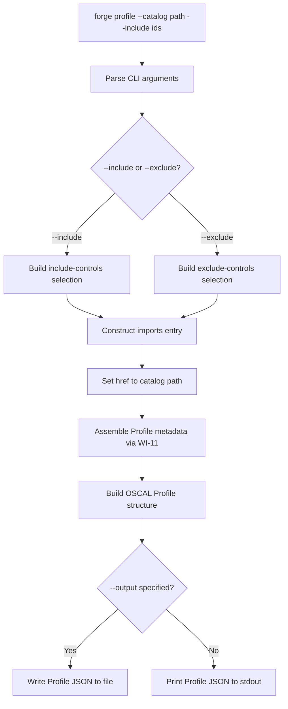
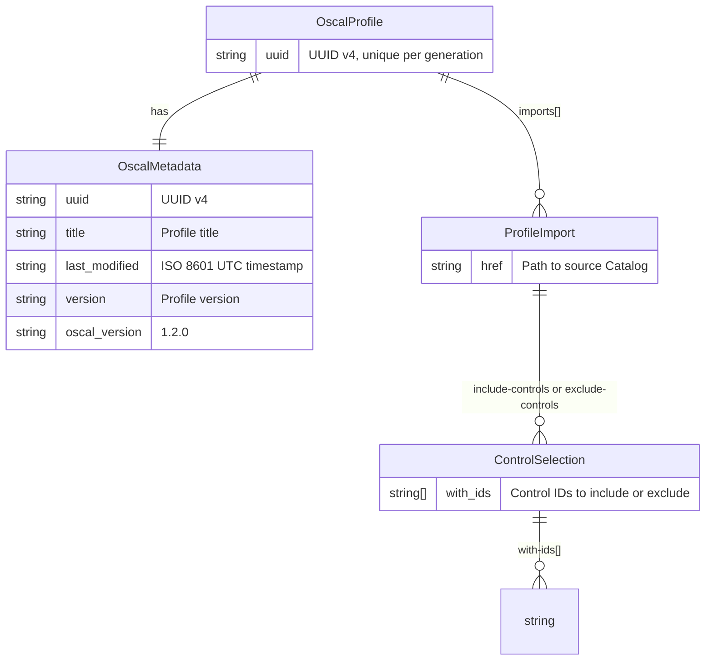
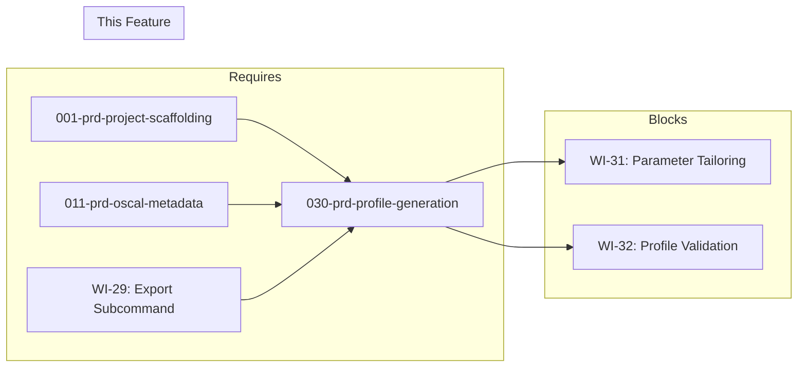

# 030-prd-profile-generation

> **Document Type:** Product Requirements Document
> **Audience:** LLM agents, human reviewers
> **Status:** Draft
> **Last Updated:** 2026-02-10 <!-- @auto -->
> **Owner:** Brian Luby <!-- @human-required -->

**Feature Branch**: `030-prd-profile-generation`
**Created**: 2026-02-10
**Status**: Draft
**Input**: Derived from FORGE Product Roadmap WI-30

---

## Review Tier Legend

| Marker | Tier | Speckit Behavior |
|--------|------|------------------|
| :red_circle: `@human-required` | Human Generated | Prompt human to author; blocks until complete |
| :yellow_circle: `@human-review` | LLM + Human Review | LLM drafts -> prompt human to confirm/edit; blocks until confirmed |
| :green_circle: `@llm-autonomous` | LLM Autonomous | LLM completes; no prompt; logged for audit |
| :white_circle: `@auto` | Auto-generated | System fills (timestamps, links); no prompt |

---

## Document Completion Order

> :warning: **For LLM Agents:** Complete sections in this order. Do not fill downstream sections until upstream human-required inputs exist.

1. **Context** (Background, Scope) -> requires human input first
2. **Problem Statement & User Scenarios** -> requires human input
3. **Requirements** (Must/Should/Could/Won't) -> requires human input
4. **Technical Constraints** -> human review
5. **Diagrams, Data Model, Interface** -> LLM can draft after above exist
6. **Acceptance Criteria** -> derived from requirements
7. **Everything else** -> can proceed

---

## Context

### Background :red_circle: `@human-required`
This PRD covers **WI-30: Profile Generation -- Core** from the FORGE Product Roadmap (Sprint S-30, Sep 22--26 2026, Theme T-5: Profile & Tailoring, Milestone MS-6). OSCAL Profiles are the canonical mechanism for selecting, organizing, and tailoring controls from one or more Catalogs into a baseline. While FORGE can already generate OSCAL Catalogs from policy documents (WI-9 through WI-13) and export them in multiple formats (WI-25 through WI-29), there is no capability to generate an OSCAL Profile that selects a subset of controls from a Catalog for a specific baseline. Organizations commonly need different baselines for different teams, systems, or risk levels (e.g., "Engineering baseline" vs "Corporate baseline"), and OSCAL Profiles are the standard vehicle for expressing those selections. This work item implements the `forge profile` subcommand with `--include` and `--exclude` flags for control selection, producing valid OSCAL Profile JSON with the `imports[]` structure that references a source Catalog and specifies which controls are selected.

### Scope Boundaries :yellow_circle: `@human-review`

**In Scope:**
- Implementing the `forge profile` subcommand with `clap` argument definitions
- `--catalog <path>` flag to specify the source Catalog file
- `--include <ids>` flag to specify control IDs to include (comma-separated)
- `--exclude <ids>` flag to specify control IDs to exclude (comma-separated)
- `--format json` output format support (JSON is the default and only required format for this WI)
- `--output <path>` optional flag to write output to a file (default: stdout)
- Generating valid OSCAL Profile JSON with `imports[]` array containing `include-controls` or `exclude-controls` selections
- Populating Profile metadata using the shared metadata assembly from WI-11
- Unit tests verifying Profile structure, control selection, and JSON validity

**Out of Scope:**
- Parameter tailoring (`--set-param` and `modify` section) -- deferred to WI-31 (031-prd-parameter-tailoring)
- Profile validation and golden-file tests -- deferred to WI-32 (032-prd-profile-validation)
- Profile Resolution (import -> merge -> modify algorithm) -- deferred; delegates to NIST oscal-cli per Parent PRD W-3
- XML and YAML output formats for Profiles -- leverages existing format infrastructure from WI-25/WI-26/WI-27
- Multiple catalog imports in a single Profile -- deferred to future enhancement
- Merge directives (`merge` section) -- deferred to future enhancement
- Normative vs advisory tagging of selected controls -- deferred to WI-33

### Glossary :yellow_circle: `@human-review`

| Term | Definition |
|------|------------|
| OSCAL Profile | An OSCAL model that selects, organizes, and tailors controls from one or more Catalogs into a baseline; contains `imports[]`, optional `merge`, and optional `modify` sections |
| Baseline | A specific selection of controls from a Catalog representing the security requirements applicable to a particular scope (team, system, risk level) |
| imports[] | The required array in an OSCAL Profile specifying which Catalogs to import controls from and which controls to include or exclude |
| include-controls | An OSCAL Profile import directive specifying which control IDs to include from the source Catalog |
| exclude-controls | An OSCAL Profile import directive specifying which control IDs to exclude from the source Catalog (all others are included) |
| with-ids | An array within `include-controls` or `exclude-controls` listing the specific control identifiers to select |
| Profile Resolution | The NIST-defined algorithm (import -> merge -> modify) that produces a resolved catalog from a Profile; delegated to NIST oscal-cli in FORGE |
| href | The URI reference in an OSCAL Profile `imports[]` entry pointing to the source Catalog file |

### Related Documents :white_circle: `@auto`

| Document | Link | Relationship |
|----------|------|--------------|
| Parent PRD | docs/FORGE_PRD.md | Parent requirement S-5, AC-12, US-4 |
| Product Roadmap | docs/FORGE_PRODUCT_ROADMAP.md | Sprint S-30 context |
| Product Vision | docs/FORGE_PRODUCT_VISION.md | Strategic goal G-2 |
| OSCAL Research | docs/research/OSCAL_Research.md | Profile model structure, sample Profile JSON |
| Depends On | docs/PRD/001-prd-project-scaffolding.md | Project structure (WI-1) |
| Depends On (WI-11) | docs/PRD/011-prd-oscal-metadata.md | Shared metadata assembly |
| Depends On (WI-29) | — | Export subcommand / format capability |
| Blocks (WI-31) | — | Profile parameter tailoring |
| Blocks (WI-32) | — | Profile validation and golden-file tests |
| Constitution | .specify/memory/constitution.md | Technical constraints and quality gates |

---

## Problem Statement :red_circle: `@human-required`

FORGE can generate OSCAL Catalogs from policy documents, but organizations rarely apply all controls to all systems. Different teams, environments, and risk levels require different subsets of controls -- baselines. OSCAL Profiles are the standard mechanism for expressing baseline selections: they import controls from a Catalog and specify which controls are included or excluded. Without Profile generation capability, FORGE users cannot create machine-readable baselines and must either manually construct Profile JSON or use the full Catalog everywhere, defeating the purpose of tailored security frameworks. WI-30 implements the `forge profile` subcommand that takes a source Catalog path and include/exclude control ID lists, producing a valid OSCAL Profile JSON with the `imports[]` structure. This is the foundational Profile capability that WI-31 (parameter tailoring) and WI-32 (validation) build upon.

---

## User Scenarios & Testing :red_circle: `@human-required`

### User Story 1 -- Generate Profile with Included Controls (Priority: P1)

A compliance engineer creates a baseline Profile that includes specific controls from a policy Catalog.

> As a compliance engineer, I want to generate an OSCAL Profile that selects specific controls from my policy Catalog so that I can create tailored baselines for different teams or systems.

**Why this priority**: This is the core deliverable of WI-30 and the primary use case for Profile generation. Without include-based selection, no baseline can be created. This directly satisfies Parent PRD S-5 and AC-12.

**Independent Test**: Run `forge profile --catalog catalog.json --include POL-AC-001,POL-AC-002 --format json` and verify a valid OSCAL Profile JSON is produced with `imports[]` containing `include-controls` with the specified IDs.

**Acceptance Scenarios**:
1. **Given** a policy Catalog with 10 controls, **When** running `forge profile --catalog catalog.json --include POL-AC-001,POL-AC-002`, **Then** a valid Profile JSON is produced with `imports[0].include-controls[0].with-ids` containing `["POL-AC-001", "POL-AC-002"]`.
2. **Given** a valid Profile generation request, **When** inspecting the output, **Then** `profile.imports[0].href` references the source Catalog path provided via `--catalog`.
3. **Given** a valid Profile generation request, **When** inspecting the output, **Then** `profile.metadata` contains all required fields (`uuid`, `title`, `last-modified`, `version`, `oscal-version`).

---

### User Story 2 -- Generate Profile with Excluded Controls (Priority: P1)

A compliance engineer creates a baseline Profile that includes all controls except specific excluded ones.

> As a compliance engineer, I want to generate an OSCAL Profile that excludes specific controls from my policy Catalog so that I can quickly create a near-complete baseline without listing every included control individually.

**Why this priority**: Exclude-based selection is the complement of include-based selection and equally important for practical baseline management. When most controls apply and only a few need exclusion, `--exclude` is far more efficient than `--include`.

**Independent Test**: Run `forge profile --catalog catalog.json --exclude POL-AC-003 --format json` and verify a valid OSCAL Profile JSON is produced with `imports[]` containing `exclude-controls` with the specified ID.

**Acceptance Scenarios**:
1. **Given** a policy Catalog with 10 controls, **When** running `forge profile --catalog catalog.json --exclude POL-AC-003`, **Then** a valid Profile JSON is produced with `imports[0].exclude-controls[0].with-ids` containing `["POL-AC-003"]`.
2. **Given** an exclude-based Profile, **When** resolved against the source Catalog, **Then** all controls except the excluded ones would be present in the resolved baseline.

---

### User Story 3 -- Write Profile Output to File (Priority: P2)

A compliance engineer saves the generated Profile to a specific file path for downstream use.

> As a compliance engineer, I want to specify an output file path for the generated Profile so that I can integrate it into my file-based OSCAL workflow.

**Why this priority**: File output is essential for practical use but secondary to the core generation logic. Stdout output is the default and sufficient for initial validation.

**Independent Test**: Run `forge profile --catalog catalog.json --include POL-AC-001 --output baseline.json` and verify the file `baseline.json` is created with valid Profile JSON content.

**Acceptance Scenarios**:
1. **Given** a Profile generation request with `--output baseline.json`, **When** generation completes, **Then** the file `baseline.json` exists and contains valid OSCAL Profile JSON.
2. **Given** a Profile generation request without `--output`, **When** generation completes, **Then** the Profile JSON is printed to stdout.

---

## Assumptions & Risks :yellow_circle: `@human-review`

### Assumptions
- [A-1] The `forge export` subcommand and format infrastructure from WI-29 are available, providing the output format and file-writing patterns that `forge profile` reuses.
- [A-2] The shared metadata assembly from WI-11 is available and can be used for Profile metadata generation.
- [A-3] The source Catalog file path provided via `--catalog` is a local file path to a valid OSCAL Catalog JSON file.
- [A-4] Control IDs provided via `--include` or `--exclude` are comma-separated strings matching control IDs in the source Catalog.
- [A-5] OSCAL v1.2.0 Profile schema for `imports[]` with `include-controls` / `exclude-controls` and `with-ids` is stable and well-documented.

### Risks
| ID | Risk | Likelihood | Impact | Mitigation |
|----|------|------------|--------|------------|
| R-1 | Users provide control IDs that do not exist in the source Catalog | Med | Low | Generate the Profile regardless (OSCAL Profiles reference by ID; validation of ID existence is a WI-32 concern). Emit a warning if the Catalog is readable and IDs are not found. |
| R-2 | Users specify both --include and --exclude simultaneously | Low | Low | Define clear precedence rules or make them mutually exclusive; document behavior in --help text |
| R-3 | Source Catalog file does not exist or is not valid OSCAL | Med | Med | Validate that the file exists and is parseable JSON before generating the Profile; emit actionable error messages |

---

## Feature Overview

### Flow Diagram :yellow_circle: `@human-review`



### State Diagram (if applicable) :yellow_circle: `@human-review`
N/A -- No state transitions in this work item. Profile generation is a single-pass construction from CLI arguments.

---

## Requirements

### Must Have (M) -- MVP, launch blockers :red_circle: `@human-required`
- [ ] **M-1:** The CLI shall provide a `forge profile` subcommand for generating OSCAL Profiles. *(Traces to: Parent PRD S-5)*
- [ ] **M-2:** The `forge profile` subcommand shall accept a `--catalog <path>` flag specifying the source Catalog file. *(Traces to: Parent PRD S-5)*
- [ ] **M-3:** The `forge profile` subcommand shall accept an `--include <ids>` flag specifying comma-separated control IDs to include. *(Traces to: Parent PRD S-5, AC-12)*
- [ ] **M-4:** The `forge profile` subcommand shall accept an `--exclude <ids>` flag specifying comma-separated control IDs to exclude. *(Traces to: Parent PRD S-5, AC-12)*
- [ ] **M-5:** The generated OSCAL Profile shall contain an `imports[]` array with an entry whose `href` references the source Catalog path. *(Traces to: Parent PRD S-5)*
- [ ] **M-6:** When `--include` is used, the `imports[]` entry shall contain an `include-controls` array with a `with-ids` list of the specified control IDs. *(Traces to: Parent PRD S-5, AC-12)*
- [ ] **M-7:** When `--exclude` is used, the `imports[]` entry shall contain an `exclude-controls` array with a `with-ids` list of the specified control IDs. *(Traces to: Parent PRD S-5, AC-12)*
- [ ] **M-8:** The generated Profile shall include valid OSCAL metadata (`uuid`, `title`, `last-modified`, `version`, `oscal-version`) using the shared metadata assembly from WI-11. *(Traces to: Parent PRD M-5, S-5)*
- [ ] **M-9:** The generated Profile shall be valid OSCAL v1.2.0 Profile JSON (correct structure and field names enforced via serde typed serialization; full schema validation against the NIST OSCAL JSON schema is deferred to WI-32). *(Traces to: Parent PRD S-5)*

### Should Have (S) -- High value, not blocking :red_circle: `@human-required`
- [ ] **S-1:** The `forge profile` subcommand shall accept a `--format json` flag (defaulting to JSON). *(Traces to: Parent PRD M-7)*
- [ ] **S-2:** The `forge profile` subcommand shall accept an `--output <path>` flag to write the Profile to a file (default: stdout). *(Traces to: Parent PRD S-5)*
- [ ] **S-3:** When the source Catalog file does not exist, the CLI shall emit an actionable error message. *(Traces to: quality gates; note: JSON validity checking is deferred to WI-32 per AR-030 Decision Log and spec.md EC-6)*
- [ ] **S-4:** When both `--include` and `--exclude` are provided, the CLI shall treat them as mutually exclusive and emit a clear error message.

### Could Have (C) -- Nice to have, if time permits :yellow_circle: `@human-review`
- [ ] **C-1:** The CLI could emit a warning if specified control IDs do not appear in the source Catalog file (requires reading and parsing the Catalog).
- [ ] **C-2:** The Profile `imports[]` entry could include `with-child-controls: "yes"` to automatically include child controls of selected parent controls.
- [ ] **C-3:** The `--include` / `--exclude` flags could accept glob patterns (e.g., `POL-AC-*`) for selecting groups of controls.

### Won't Have (W) -- Explicitly deferred :yellow_circle: `@human-review`
- [ ] **W-1:** Parameter tailoring (`--set-param` and `modify` section) -- *Reason: Deferred to WI-31 (031-prd-parameter-tailoring)*
- [ ] **W-2:** Profile validation and golden-file tests -- *Reason: Deferred to WI-32 (032-prd-profile-validation)*
- [ ] **W-3:** Built-in Profile Resolution engine -- *Reason: Delegates to NIST oscal-cli per Parent PRD W-3*
- [ ] **W-4:** Multiple catalog imports in a single Profile -- *Reason: Start with single-catalog import; multi-catalog support is a future enhancement*
- [ ] **W-5:** Merge directives (`merge` section) -- *Reason: Deferred; merge semantics are only meaningful with multi-catalog imports or when resolution is performed*

---

## Technical Constraints :yellow_circle: `@human-review`

- **Language/Framework:** Rust (latest stable)
- **CLI Framework:** clap 4.x with derive macros; `forge profile` as a new subcommand
- **OSCAL Version:** v1.2.0 -- Profile structure must conform to the OSCAL Profile JSON schema
- **Serialization:** `serde` + `serde_json` for JSON output; Profile struct must serialize to correct OSCAL JSON shape
- **Metadata Assembly:** Reuse the shared `assemble_metadata` function from WI-11; Profile title derived from source Catalog title or a default
- **Output Patterns:** Reuse file-writing and stdout patterns established by `forge export` (WI-29) and `forge convert`
- **Error Handling:** `thiserror` for Profile generation errors (missing catalog, invalid arguments)
- **Testing:** TDD mandatory; unit tests for Profile structure, control selection logic, and JSON output
- **No Clippy Warnings:** `cargo clippy -- -D warnings` must pass
- **No Formatting Violations:** `cargo fmt --check` must pass

---

## Data Model (if applicable) :yellow_circle: `@human-review`



---

## Interface Contract (if applicable) :yellow_circle: `@human-review`

```rust
use serde::Serialize;

/// OSCAL Profile root structure
#[derive(Debug, Serialize)]
pub struct OscalProfile {
    pub uuid: String,
    pub metadata: OscalMetadata,  // from WI-11
    pub imports: Vec<ProfileImport>,
}

/// A single import entry in the Profile's imports[] array
#[derive(Debug, Serialize)]
pub struct ProfileImport {
    pub href: String,
    #[serde(skip_serializing_if = "Option::is_none", rename = "include-controls")]
    pub include_controls: Option<Vec<ControlSelection>>,
    #[serde(skip_serializing_if = "Option::is_none", rename = "exclude-controls")]
    pub exclude_controls: Option<Vec<ControlSelection>>,
}

/// Control selection with a list of control IDs
#[derive(Debug, Serialize)]
pub struct ControlSelection {
    #[serde(rename = "with-ids")]
    pub with_ids: Vec<String>,
}

/// CLI argument structure for forge profile
// forge profile --catalog <path> --include <ids> [--exclude <ids>]
//               [--format json] [--output <path>]

/// Example generated Profile JSON:
/// {
///   "profile": {
///     "uuid": "aaaaaaaa-aaaa-4aaa-8aaa-aaaaaaaaaaaa",
///     "metadata": {
///       "title": "Policy Baseline Profile",
///       "last-modified": "2026-09-22T10:00:00Z",
///       "version": "1.0.0",
///       "oscal-version": "1.2.0"
///     },
///     "imports": [
///       {
///         "href": "./policy-catalog.json",
///         "include-controls": [
///           {
///             "with-ids": ["POL-AC-001", "POL-AC-002"]
///           }
///         ]
///       }
///     ]
///   }
/// }
```

---

## Evaluation Criteria :yellow_circle: `@human-review`

| Criterion | Weight | Metric | Target | Notes |
|-----------|--------|--------|--------|-------|
| Profile Structure Valid | Critical | Generated Profile has `imports[]` with correct selection | 100% | Core deliverable |
| Include Selection | Critical | `--include` produces `include-controls` with correct `with-ids` | 100% | Primary selection mechanism |
| Exclude Selection | Critical | `--exclude` produces `exclude-controls` with correct `with-ids` | 100% | Complementary selection mechanism |
| Metadata Present | Critical | Profile includes all 5 required metadata fields | 100% | uuid, title, last-modified, version, oscal-version |
| href Correct | High | `imports[].href` matches `--catalog` path | 100% | Source Catalog reference |

---

## Tool/Approach Candidates :yellow_circle: `@human-review`

| Option | License | Pros | Cons | Spike Result |
|--------|---------|------|------|--------------|
| clap 4.x subcommand for `profile` | MIT/Apache-2.0 | Consistent with existing CLI pattern; derive macros | None significant | Selected per constitution |
| serde + serde_json for Profile serialization | MIT/Apache-2.0 | Already in use for Catalog generation; standard Rust JSON | None significant | Already selected |
| Reuse WI-11 metadata assembly | N/A | Shared function; consistent metadata across artifact types | None | Selected per WI-11 design |

### Selected Approach :red_circle: `@human-required`
> **Decision:** Add `forge profile` as a new clap subcommand. Build Profile generation as a standalone module in the `oscal` module hierarchy. Reuse the shared metadata assembly from WI-11 and output patterns from WI-29. Serialize Profile struct to OSCAL-compliant JSON via serde.
> **Rationale:** This approach follows the established patterns from Catalog generation (WI-9 through WI-13) and export infrastructure (WI-29), minimizing new abstractions while producing a correct OSCAL Profile structure.

---

## Acceptance Criteria :yellow_circle: `@human-review`

| AC ID | Requirement | User Story | Given | When | Then |
|-------|-------------|------------|-------|------|------|
| AC-1 | M-1 | US-1 | The FORGE binary | Running `forge profile --help` | Usage text shows `--catalog`, `--include`, `--exclude` flags with descriptions |
| AC-2 | M-2, M-5, M-6 | US-1 | A policy Catalog at `catalog.json` with controls POL-AC-001 through POL-AC-010 | Running `forge profile --catalog catalog.json --include POL-AC-001,POL-AC-002` | A valid Profile JSON with `imports[0].href` = `"catalog.json"` and `imports[0].include-controls[0].with-ids` = `["POL-AC-001", "POL-AC-002"]` |
| AC-3 | M-4, M-5, M-7 | US-2 | A policy Catalog at `catalog.json` with controls POL-AC-001 through POL-AC-010 | Running `forge profile --catalog catalog.json --exclude POL-AC-003` | A valid Profile JSON with `imports[0].href` = `"catalog.json"` and `imports[0].exclude-controls[0].with-ids` = `["POL-AC-003"]` |
| AC-4 | M-8 | US-1 | Any Profile generation request | Inspecting `profile.uuid` and `profile.metadata` | `profile.uuid` is a valid UUID v4; `profile.metadata` contains `title`, `last-modified` (ISO 8601 UTC), `version`, and `oscal-version` = `"1.2.0"` |
| AC-5 | M-9 | US-1 | A generated Profile JSON | Assert serialized JSON contains `profile.uuid`, `profile.metadata` with required fields, and `profile.imports[0].href` | JSON structure matches expected OSCAL Profile shape (correct field names and nesting); full schema validation against NIST JSON schema deferred to WI-32 |
| AC-6 | S-2 | US-3 | A Profile generation request with `--output baseline.json` | Generation completes | File `baseline.json` exists and contains valid OSCAL Profile JSON |
| AC-7 | S-2 | US-3 | A Profile generation request without `--output` | Generation completes | Profile JSON is printed to stdout |
| AC-8 | S-3 | US-1 | A `--catalog` path pointing to a non-existent file | Running `forge profile --catalog missing.json --include POL-AC-001` | An actionable error message is displayed indicating the file does not exist, e.g., `Error: file not found: missing.json` |
| AC-9 | S-4 | US-1 | Both `--include` and `--exclude` flags provided | Running `forge profile --catalog catalog.json --include POL-AC-001 --exclude POL-AC-002` | A clear error message indicates that `--include` and `--exclude` are mutually exclusive |

### Edge Cases :green_circle: `@llm-autonomous`
- [ ] **EC-1:** (M-3) When `--include` is provided with a single control ID (no comma), then the Profile is generated with a single-element `with-ids` array.
- [ ] **EC-2:** (M-3) When `--include` is provided with IDs containing extra whitespace (e.g., `"POL-AC-001, POL-AC-002"`), then whitespace is trimmed and IDs are parsed correctly.
- [ ] **EC-3:** (M-1) When `forge profile` is run with no flags, then a helpful error message indicates required arguments (`--catalog` and at least one of `--include` or `--exclude`).
- [ ] **EC-4:** (M-6) When `--include` is provided with duplicate control IDs, then duplicates are deduplicated in the output `with-ids` array.
- [ ] **EC-5:** (M-3) When `--include` is provided with an empty string, then a descriptive error is emitted.
- [ ] **EC-6:** (M-2) When `--catalog` points to a file that exists but is not valid JSON, then an actionable error message describes the parse failure.
- [ ] **EC-7:** (M-9) When generating a Profile, then the root JSON object uses the key `"profile"` as required by OSCAL.

---

## Dependencies :yellow_circle: `@human-review`



- **Requires:** [001-prd-project-scaffolding](docs/PRD/001-prd-project-scaffolding.md) (project structure), [011-prd-oscal-metadata](docs/PRD/011-prd-oscal-metadata.md) (shared metadata assembly), WI-29 (export subcommand / format capability)
- **Blocks:** WI-31 (Profile parameter tailoring), WI-32 (Profile validation and golden-file tests)
- **Parallel With:** None
- **External:** None

---

## Security Considerations :yellow_circle: `@human-review`

| Aspect | Assessment | Notes |
|--------|------------|-------|
| Internet Exposure | No | Profile generation is purely local; no network calls |
| Sensitive Data | Low | Profile references control IDs and a Catalog file path; no policy text is embedded in the Profile itself |
| Authentication Required | No | Local CLI tool |
| Security Review Required | No | Reads a local Catalog file path and control ID strings from CLI arguments; no untrusted input beyond user-provided arguments |

---

## Implementation Guidance :green_circle: `@llm-autonomous`

### Suggested Approach
Add a `Profile` variant to the CLI subcommand enum in the `cli` module, using clap derive macros to define `--catalog`, `--include`, `--exclude`, `--format`, and `--output` flags. Mark `--include` and `--exclude` as mutually exclusive using clap's conflict mechanism (`conflicts_with`). Implement a `build_profile` function in the `oscal` module that takes the catalog path and control ID list, constructs a `ProfileImport` with either `include-controls` or `exclude-controls`, and assembles the full `OscalProfile` struct with metadata from WI-11's `assemble_metadata`. Serialize the Profile to JSON using serde, wrapping it in the required `{"profile": {...}}` root object. For `--output`, reuse the file-writing pattern from `forge export` / `forge convert`. Write TDD tests that: (1) verify include-based selection produces correct `imports[]` structure, (2) verify exclude-based selection, (3) verify metadata fields are present and valid, (4) verify JSON output matches OSCAL Profile shape, (5) verify error handling for missing catalog file and mutual exclusivity of flags.

### Anti-patterns to Avoid
- Reading and parsing the source Catalog to validate control IDs at generation time -- Profile generation should be lightweight; validation is WI-32's concern
- Generating a `modify` section -- parameter tailoring is WI-31; this WI produces only `imports[]`
- Embedding policy text or control content in the Profile -- Profiles reference controls by ID, not by content
- Hardcoding the catalog href as an absolute path -- use the path as provided by the user to support relative paths
- Generating Profile Resolution output -- resolution is delegated to NIST oscal-cli per Parent PRD W-3

### Reference Examples
- OSCAL Research sample Profile: `docs/research/OSCAL_Research.md` (sample Profile JSON with `imports[]` and `include-controls`)
- NIST OSCAL Profile model documentation: https://pages.nist.gov/OSCAL/reference/latest/profile/json-outline/
- clap subcommand documentation: https://docs.rs/clap/latest/clap/_derive/index.html

---

## Spike Tasks :yellow_circle: `@human-review`

N/A -- No spike tasks for this work item. The OSCAL Profile structure is well-documented in the OSCAL Research and NIST references, and the CLI subcommand pattern is established from prior work items.

---

## Success Metrics :red_circle: `@human-required`

| Metric | Baseline | Target | Measurement Method |
|--------|----------|--------|-------------------|
| Profile generation with --include | N/A | Valid Profile JSON with correct include-controls | Unit tests + manual verification |
| Profile generation with --exclude | N/A | Valid Profile JSON with correct exclude-controls | Unit tests + manual verification |
| OSCAL Profile JSON shape | N/A | Matches OSCAL v1.2.0 Profile schema structure | Comparison with NIST examples |
| CLI usability | N/A | `forge profile --help` shows clear usage | Manual verification |

### Technical Verification :green_circle: `@llm-autonomous`
| Metric | Target | Verification Method |
|--------|--------|---------------------|
| Test coverage for Profile generation | >90% | `cargo test` + coverage tool |
| No clippy warnings | 0 | `cargo clippy -- -D warnings` |
| No formatting violations | 0 | `cargo fmt --check` |
| Include/exclude mutual exclusivity enforced | Verified | Unit test for clap conflict behavior |
| Metadata fields present | All 5 required fields | Unit tests verifying metadata assembly integration |

---

## Definition of Ready :red_circle: `@human-required`

### Readiness Checklist
- [x] Problem statement reviewed and validated by stakeholder
- [x] All Must Have requirements have acceptance criteria
- [x] Technical constraints are explicit and agreed
- [x] Dependencies identified and owners confirmed
- [x] Security review completed (or N/A documented with justification)
- [x] No open questions blocking implementation

### Sign-off
| Role | Name | Date | Decision |
|------|------|------|----------|
| Product Owner | Brian Luby | YYYY-MM-DD | [Ready / Not Ready] |

---

## Changelog :white_circle: `@auto`

| Version | Date | Author | Changes |
|---------|------|--------|---------|
| 0.1 | 2026-02-10 | LLM (Claude) | Initial draft derived from FORGE Product Roadmap WI-30 |

---

## Decision Log :yellow_circle: `@human-review`

| Date | Decision | Rationale | Alternatives Considered |
|------|----------|-----------|------------------------|
| 2026-02-10 | Make --include and --exclude mutually exclusive | Simplifies Profile structure (one import entry with one selection type); OSCAL supports both but combining them in one import is semantically ambiguous | Allow both simultaneously (complex precedence rules, confusing UX); require exactly one (too restrictive for future extension) |
| 2026-02-10 | Do not validate control IDs against the source Catalog during generation | Profile generation should be lightweight and fast; ID validation is a WI-32 concern; OSCAL Profiles validly reference IDs that may not yet exist in the Catalog | Validate IDs eagerly (requires parsing full Catalog, couples generation to validation, slower) |
| 2026-02-10 | Reuse WI-11 metadata assembly for Profile metadata | Consistent metadata across all OSCAL artifact types (Catalog, Profile, Component Definition); avoids code duplication | Build separate metadata logic for Profiles (duplicates code, risks inconsistency) |
| 2026-02-10 | Use the catalog path as-is for href (no normalization) | Preserves user intent; supports relative paths, absolute paths, and URL-style references | Normalize to absolute path (breaks portability); resolve to canonical path (may not match user expectations) |

---

## Open Questions :yellow_circle: `@human-review`

No open questions for this work item.

---

## Review Checklist :green_circle: `@llm-autonomous`

Before marking as Approved:
- [x] All requirements have unique IDs (M-1 through M-9, S-1 through S-4, C-1 through C-3, W-1 through W-5)
- [x] All Must Have requirements have linked acceptance criteria
- [x] User stories are prioritized and independently testable
- [x] Acceptance criteria reference both requirement IDs and user stories
- [x] Glossary terms are used consistently throughout
- [x] Diagrams use terminology from Glossary
- [x] Security considerations documented
- [x] Definition of Ready checklist is complete
- [x] No open questions blocking implementation
