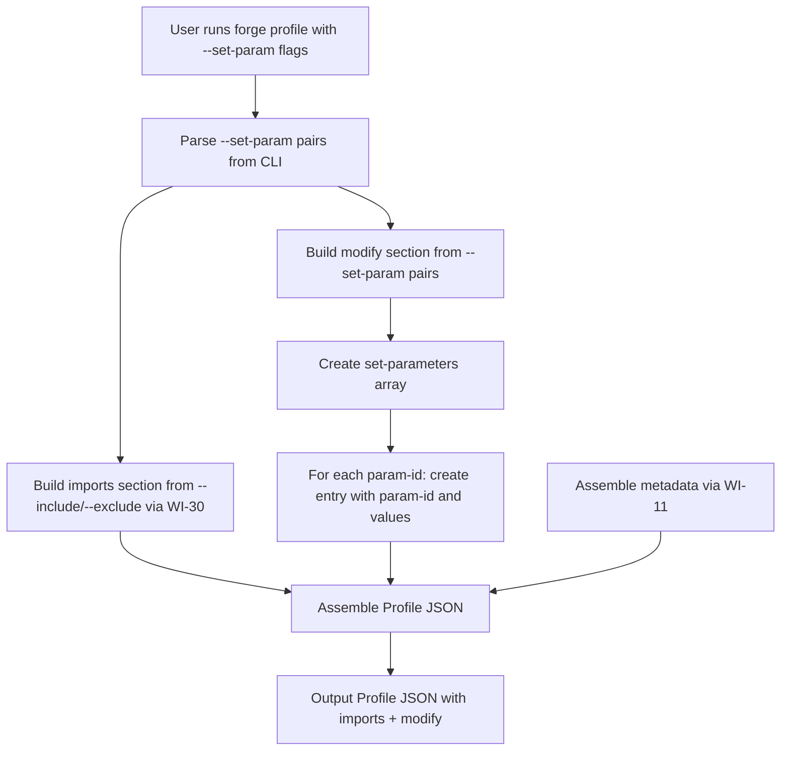
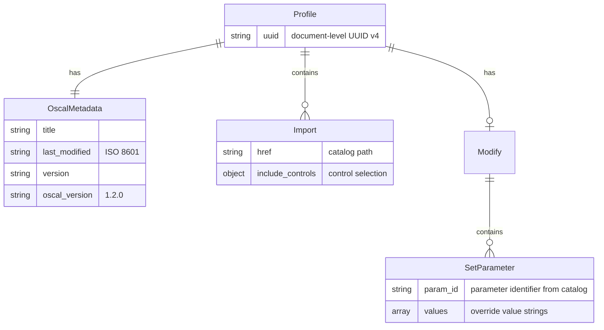
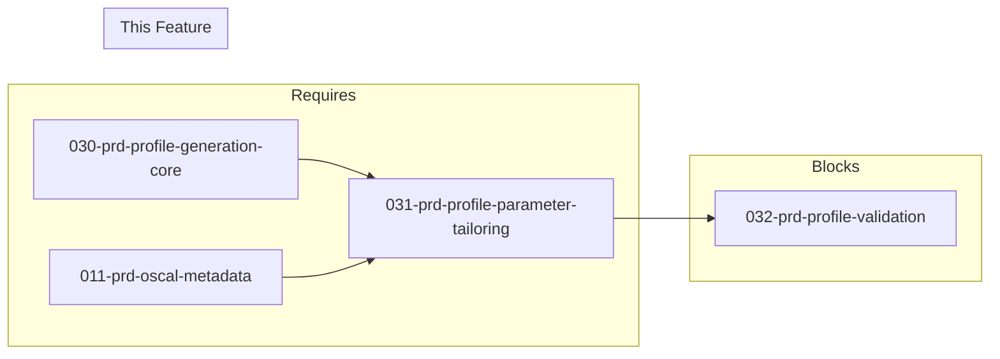

# 031-prd-profile-parameter-tailoring

> **Document Type:** Product Requirements Document
> **Audience:** LLM agents, human reviewers
> **Status:** Draft
> **Last Updated:** 2026-02-10 <!-- @auto -->
> **Owner:** Brian Luby <!-- @human-required -->

**Feature Branch**: `031-profile-parameter-tailoring`
**Created**: 2026-02-10
**Status**: Draft
**Input**: Derived from FORGE Product Roadmap WI-31

---

## Review Tier Legend

| Marker | Tier | Speckit Behavior |
|--------|------|------------------|
| :red_circle: `@human-required` | Human Generated | Prompt human to author; blocks until complete |
| :yellow_circle: `@human-review` | LLM + Human Review | LLM drafts -> prompt human to confirm/edit; blocks until confirmed |
| :green_circle: `@llm-autonomous` | LLM Autonomous | LLM completes; no prompt; logged for audit |
| :white_circle: `@auto` | Auto-generated | System fills (timestamps, links); no prompt |

---

## Document Completion Order

> :warning: **For LLM Agents:** Complete sections in this order. Do not fill downstream sections until upstream human-required inputs exist.

1. **Context** (Background, Scope) -> requires human input first
2. **Problem Statement & User Scenarios** -> requires human input
3. **Requirements** (Must/Should/Could/Won't) -> requires human input
4. **Technical Constraints** -> human review
5. **Diagrams, Data Model, Interface** -> LLM can draft after above exist
6. **Acceptance Criteria** -> derived from requirements
7. **Everything else** -> can proceed

---

## Context

### Background :red_circle: `@human-required`
This PRD covers **WI-31: Profile Parameter Tailoring** from the FORGE Product Roadmap (Sprint S-31, Sep 29--Oct 3 2026, Theme T-5: Profile & Tailoring, Milestone MS-6). After WI-30 establishes the core Profile generation capability with `forge profile --include/--exclude` for control selection via the `imports` section, this work item adds parameter tailoring support through the `--set-param` CLI flag. OSCAL Profiles have a `modify` section that contains `set-parameters` entries, which allow overriding default parameter values defined in the source catalog. For example, a catalog control might define a parameter `POL-AC-001_prm` with a default value of "90 days", and a Profile can tailor that to "60 days" via `set-parameters`. This is the canonical OSCAL mechanism for baseline tailoring beyond simple control inclusion/exclusion, and it directly fulfills Parent PRD requirement S-5 and acceptance criterion AC-2 of User Story US-4.

### Scope Boundaries :yellow_circle: `@human-review`

**In Scope:**
- Implementing the `--set-param <id> <value>` CLI flag on the `forge profile` subcommand (repeatable for multiple parameters)
- Generating the `modify` section within the Profile JSON with `set-parameters` entries
- Each `set-parameters` entry shall contain the `param-id` and a `values` array with the specified value
- Validating that the generated Profile with `modify` section conforms to the OSCAL Profile schema structure
- Supporting multiple `--set-param` invocations in a single command to set multiple parameters

**Out of Scope:**
- Profile generation core (`imports`, `--include`/`--exclude`) -- implemented in WI-30 (030-prd-profile-generation-core)
- Profile schema validation and golden-file testing -- deferred to WI-32 (032-prd-profile-validation)
- Normative vs advisory detection and tagging -- deferred to WI-33
- Parameter extraction from policy text -- deferred to WI-34
- Profile Resolution (import -> merge -> modify processing) -- future work item
- The `merge` section of the Profile -- not addressed in this work item
- `alter` directives within the `modify` section (adding/removing control parts) -- future extension
- Validation that parameter IDs exist in the source catalog -- deferred to WI-32

### Glossary :yellow_circle: `@human-review`

| Term | Definition |
|------|------------|
| Profile | OSCAL model (`profile`) that selects, organizes, and tailors controls from one or more catalogs into a baseline |
| modify | The section within an OSCAL Profile that contains amendments to imported controls, including `set-parameters` and `alters` |
| set-parameters | An array within the Profile `modify` section specifying parameter value overrides for imported controls |
| param-id | The identifier of a parameter defined in the source catalog, used as the key in `set-parameters` entries |
| Parameter Tailoring | The process of overriding default parameter values from a catalog through Profile `set-parameters` directives |
| Profile Resolution | The OSCAL-defined process of resolving a Profile into a result catalog by executing import -> merge -> modify in order |
| --set-param | The CLI flag accepting a parameter ID and value pair to generate a `set-parameters` entry in the Profile `modify` section |

### Related Documents :white_circle: `@auto`

| Document | Link | Relationship |
|----------|------|--------------|
| Parent PRD | docs/FORGE_PRD.md | Parent requirement S-5, US-4 AC-2 |
| Product Roadmap | docs/FORGE_PRODUCT_ROADMAP.md | Sprint S-31 context |
| Product Vision | docs/FORGE_PRODUCT_VISION.md | Strategic goal G-2 |
| OSCAL Research | docs/research/OSCAL_Research.md | Profile model details and sample output |
| Constitution | .specify/memory/constitution.md | Technical constraints and quality gates |
| Depends On | docs/PRD/030-prd-profile-generation-core.md | Profile generation core (WI-30) provides imports and base structure |

---

## Problem Statement :red_circle: `@human-required`

WI-30 establishes Profile generation with control inclusion/exclusion via the `imports` section, but Profiles without parameter tailoring are incomplete baselines. Organizations routinely need to override default parameter values when adopting a control baseline -- for example, changing a password rotation interval from "90 days" to "60 days" or adjusting a review frequency from "annually" to "quarterly." The OSCAL `modify` section with `set-parameters` is the canonical mechanism for this tailoring. Without `--set-param` support, FORGE can only generate Profiles that select controls but cannot customize their parameter values, which is a core requirement of Parent PRD S-5 ("with support for control inclusion/exclusion and parameter setting") and the specific acceptance criterion US-4 AC-2. This work item adds the `modify` section generation so that Profiles can express the full range of baseline tailoring decisions.

---

## User Scenarios & Testing :red_circle: `@human-required`

### User Story 1 -- Set Parameter Values in Profile (Priority: P1)

A compliance engineer generates a Profile that tailors parameter values from the source catalog to match their organization's specific requirements.

> As a compliance engineer, I want to specify `--set-param POL-AC-001_prm "60 days"` when generating a Profile so that the Profile includes the parameter modification in its `modify` section, overriding the catalog default.

**Why this priority**: This is the core deliverable of WI-31 and directly fulfills Parent PRD US-4 AC-2. Parameter tailoring is the primary mechanism for baseline customization beyond control selection.

**Independent Test**: Run `forge profile --catalog catalog.json --include POL-AC-001 --set-param POL-AC-001_prm "60 days" --format json` and verify the output Profile JSON contains a `modify.set-parameters` array with an entry for `param-id: "POL-AC-001_prm"` and `values: ["60 days"]`.

**Acceptance Scenarios**:
1. **Given** a Profile generation request with `--set-param POL-AC-001_prm "60 days"`, **When** generating the Profile, **Then** the output JSON includes a `modify` section containing a `set-parameters` array with `{ "param-id": "POL-AC-001_prm", "values": ["60 days"] }`.
2. **Given** a Profile generation request with no `--set-param` flags, **When** generating the Profile, **Then** the output JSON does not include a `modify` section (or it is absent), leaving catalog defaults untouched.

---

### User Story 2 -- Set Multiple Parameters in a Single Command (Priority: P1)

A compliance engineer needs to override multiple parameter values in a single Profile generation command.

> As a compliance engineer, I want to specify multiple `--set-param` flags in a single `forge profile` invocation so that I can tailor several parameters at once without running multiple commands.

**Why this priority**: Real-world baselines frequently require multiple parameter overrides. Supporting multiple `--set-param` flags in one command is essential for practical usability.

**Independent Test**: Run `forge profile --catalog catalog.json --include POL-AC-001,POL-IR-001 --set-param POL-AC-001_prm "60 days" --set-param POL-IR-001_prm "4 hours" --format json` and verify both parameter overrides appear in the `modify.set-parameters` array.

**Acceptance Scenarios**:
1. **Given** a command with two `--set-param` flags, **When** generating the Profile, **Then** the `modify.set-parameters` array contains two entries, one for each parameter ID with its respective value.
2. **Given** a command with three `--set-param` flags, **When** generating the Profile, **Then** all three parameter overrides appear in the `modify.set-parameters` array in a deterministic order.

---

### User Story 3 -- Profile Schema Compliance with Modify Section (Priority: P1)

The generated Profile with a `modify` section must produce structurally valid OSCAL JSON.

> As a developer working on FORGE, I want the generated Profile with `set-parameters` to be structurally valid OSCAL so that downstream tools (e.g., oscal-cli, Profile Resolution) can consume it without errors.

**Why this priority**: Structural validity is a prerequisite for WI-32 (Profile validation) and for any downstream tooling that processes the Profile.

**Independent Test**: Generate a Profile with `--set-param` and validate the JSON structure contains all required OSCAL Profile fields (`uuid`, `metadata`, `imports`, `modify`) with correct nesting and key naming.

**Acceptance Scenarios**:
1. **Given** a generated Profile with `set-parameters`, **When** inspecting the JSON structure, **Then** the `modify` section is nested directly under the `profile` root, at the same level as `imports`.
2. **Given** a generated Profile with `set-parameters`, **When** inspecting each `set-parameters` entry, **Then** each entry contains `param-id` (string) and `values` (array of strings) fields per the OSCAL Profile model.

---

## Assumptions & Risks :yellow_circle: `@human-review`

### Assumptions
- [A-1] WI-30 (Profile generation core) is complete and provides the base Profile structure with `imports`, `uuid`, and `metadata`.
- [A-2] The `--set-param` flag accepts exactly two arguments: a parameter ID (string) and a value (string). Multi-valued parameters use multiple `--set-param` invocations with the same ID.
- [A-3] Parameter IDs are opaque strings passed through to the Profile `set-parameters` without validation against the source catalog at this stage (catalog-aware validation is deferred to WI-32).
- [A-4] The OSCAL v1.2.0 Profile `modify.set-parameters` structure is stable and well-documented.
- [A-5] The `values` array in each `set-parameters` entry contains a single string value per `--set-param` invocation. If the same `param-id` is specified multiple times, values are aggregated into the same `values` array.

### Risks
| ID | Risk | Likelihood | Impact | Mitigation |
|----|------|------------|--------|------------|
| R-1 | `--set-param` argument parsing is ambiguous for values containing spaces | Low | Med | Use clap's value parsing with explicit two-argument grouping; document quoting requirements |
| R-2 | OSCAL `set-parameters` structure has additional optional fields that users may expect (e.g., `constraints`, `guidelines`, `labels`) | Low | Low | Start with `param-id` and `values` only; extend in future work items as needed |
| R-3 | Multiple `--set-param` flags for the same parameter ID produce unexpected results | Low | Med | Define clear aggregation semantics: same `param-id` entries merge into a single `set-parameters` entry with combined `values` array |

---

## Feature Overview

### Flow Diagram :yellow_circle: `@human-review`



### State Diagram (if applicable) :yellow_circle: `@human-review`
N/A -- No state transitions in this work item. The builder produces a Profile with a `modify` section in a single pass.

---

## Requirements

### Must Have (M) -- MVP, launch blockers :red_circle: `@human-required`
- [x] **M-1:** The `forge profile` subcommand shall accept a repeatable `--set-param <id> <value>` flag for specifying parameter overrides. *(Traces to: Parent PRD S-5, US-4 AC-2)*
- [x] **M-2:** When `--set-param` flags are provided, the generated Profile JSON shall include a `modify` section containing a `set-parameters` array. *(Traces to: Parent PRD S-5)*
- [x] **M-3:** Each `set-parameters` entry shall contain `param-id` (the parameter identifier) and `values` (an array with the specified value string). *(Traces to: OSCAL Profile model)*
- [x] **M-4:** Multiple `--set-param` flags with different parameter IDs shall produce multiple entries in the `set-parameters` array. *(Traces to: Parent PRD S-5)*
- [x] **M-5:** The `modify` section shall be nested directly under the `profile` root object, as a sibling of `imports` and `metadata`. *(Traces to: OSCAL Profile model)*
- [x] **M-6:** When no `--set-param` flags are provided, the Profile shall not include a `modify` section (preserving backward compatibility with WI-30 output). *(Traces to: backward compatibility)*

### Should Have (S) -- High value, not blocking :red_circle: `@human-required`
- [x] **S-1:** When multiple `--set-param` flags specify the same `param-id`, their values shall be aggregated into a single `set-parameters` entry with a combined `values` array.
- [x] **S-2:** The `set-parameters` entries shall be ordered deterministically (e.g., by `param-id` alphabetical order) for reproducible output.

### Could Have (C) -- Nice to have, if time permits :yellow_circle: `@human-review`
- [x] **C-1:** A `--set-param-file <path>` flag accepting a JSON or YAML file containing parameter overrides in bulk, for convenience with large baseline tailoring.
- [x] **C-2:** A warning message when `--set-param` is used without `--include` or `--exclude` (i.e., setting parameters on an empty import is likely unintentional).

### Won't Have (W) -- Explicitly deferred :yellow_circle: `@human-review`
- [x] **W-1:** Validation that `param-id` values exist in the source catalog -- *Reason: Deferred to WI-32 (Profile validation)*
- [x] **W-2:** `alter` directives in the `modify` section (adding/removing control parts) -- *Reason: Future extension beyond current S-5 scope*
- [x] **W-3:** Profile Resolution (computing a resolved catalog from Profile) -- *Reason: Future work item; can be delegated to oscal-cli*
- [x] **W-4:** The `merge` section of the Profile -- *Reason: Not required for parameter tailoring; future extension*
- [x] **W-5:** Constraint/guideline/label fields on `set-parameters` entries -- *Reason: Start minimal; extend as user needs emerge*

---

## Technical Constraints :yellow_circle: `@human-review`

- **Language/Framework:** Rust (latest stable), Cargo build system
- **CLI Framework:** clap 4.x with derive macros; `--set-param` as a repeatable argument accepting two values (parameter ID, value)
- **OSCAL Version:** Target OSCAL v1.2.0 Profile model
- **Output Format:** JSON (via `serde_json`); XML/YAML support inherited from WI-26/WI-27
- **Serialization:** `serde` with `#[serde(rename)]` to produce OSCAL-compliant JSON keys (e.g., `set-parameters`, `param-id`)
- **Dependency on WI-30:** Must integrate with the existing Profile builder established in WI-30
- **Linting:** `cargo clippy -- -D warnings` must pass
- **Formatting:** `cargo fmt --check` must pass
- **Testing:** TDD mandatory; unit tests for `modify` section construction and CLI argument parsing

---

## Data Model (if applicable) :yellow_circle: `@human-review`



---

## Interface Contract (if applicable) :yellow_circle: `@human-review`

```rust
/// CLI interface for profile parameter tailoring
///
/// forge profile --catalog <path>
///               --include <control-ids>
///               [--set-param <param-id> <value>]...
///               --format <json|xml|yaml>
///               [--output <path>]

/// Build the modify section from --set-param pairs.
///
/// Takes a list of (param_id, value) pairs from the CLI and produces
/// the OSCAL Profile modify section with set-parameters entries.
///
/// If the input is empty, returns None (no modify section).
///
/// NOTE: The canonical typed Rust API definition is in
/// `contracts/rust-api.md`. The return type is `Option<Modify>` (a
/// strongly-typed serde struct), not `Option<serde_json::Value>`.
/// Implementers MUST follow contracts/rust-api.md.
pub fn build_modify_section(
    param_overrides: &[(String, String)],
) -> Option<Modify>;

// Expected JSON output structure (Profile with modify):
// {
//   "profile": {
//     "uuid": "<profile-uuid>",
//     "metadata": { ... },
//     "imports": [ ... ],
//     "modify": {
//       "set-parameters": [
//         {
//           "param-id": "POL-AC-001_prm",
//           "values": ["60 days"]
//         },
//         {
//           "param-id": "POL-IR-001_prm",
//           "values": ["4 hours"]
//         }
//       ]
//     }
//   }
// }
```

---

## Evaluation Criteria :yellow_circle: `@human-review`

| Criterion | Weight | Metric | Target | Notes |
|-----------|--------|--------|--------|-------|
| Modify Section Generation | Critical | `--set-param` produces `modify.set-parameters` in output | Correct JSON structure | Core deliverable |
| CLI Argument Parsing | Critical | `--set-param` accepts param-id and value pairs | Repeatable, space-safe | Usability requirement |
| Backward Compatibility | Critical | No `--set-param` flags = no `modify` section | Matches WI-30 output | Non-breaking change |
| Multiple Parameters | High | Multiple `--set-param` flags produce multiple entries | All entries present | Real-world scenario |
| Deterministic Output | High | Same inputs produce identical output | Byte-for-byte identical | Reproducibility |

---

## Tool/Approach Candidates :yellow_circle: `@human-review`

| Option | License | Pros | Cons | Spike Result |
|--------|---------|------|------|--------------|
| Extend WI-30 Profile builder with modify section | N/A | Consistent with existing pattern; minimal new code | Tight coupling to WI-30 implementation | Selected -- natural extension |
| Separate modify builder module | N/A | Clean separation of concerns; independently testable | Additional module overhead for a small feature | Alternative -- adopt if modify grows complex |
| clap `number_of_values(2)` for --set-param | MIT/Apache-2.0 | Native two-value argument parsing; type-safe | Slightly unusual CLI pattern | Selected -- clap supports this natively |

### Selected Approach :red_circle: `@human-required`
> **Decision:** Extend the WI-30 Profile builder with a `build_modify_section` function that takes `--set-param` pairs and produces the `modify` JSON. Use clap 4's `num_args = 2` with `ArgAction::Append` for parsing the parameter ID and value as a pair.
> **Rationale:** This is a natural extension of the Profile builder pattern. The `modify` section is small and well-defined, so a separate module is unnecessary. clap provides native support for multi-value arguments, making the CLI parsing straightforward.

---

## Acceptance Criteria :yellow_circle: `@human-review`

| AC ID | Requirement | User Story | Given | When | Then |
|-------|-------------|------------|-------|------|------|
| AC-1 | M-1, M-2, M-3 | US-1 | A Profile generation request with `--set-param POL-AC-001_prm "60 days"` | Generating the Profile | The output JSON includes `modify.set-parameters` with `{ "param-id": "POL-AC-001_prm", "values": ["60 days"] }` |
| AC-2 | M-4 | US-2 | A command with `--set-param POL-AC-001_prm "60 days" --set-param POL-IR-001_prm "4 hours"` | Generating the Profile | The `modify.set-parameters` array contains two entries with correct param-ids and values |
| AC-3 | M-6 | US-1 | A Profile generation request with no `--set-param` flags | Generating the Profile | The output JSON does not contain a `modify` section |
| AC-4 | M-5 | US-3 | A generated Profile with `set-parameters` | Inspecting JSON structure | The `modify` section is a direct child of the `profile` root, sibling to `imports` and `metadata` |
| AC-5 | M-1, M-2, M-3 | US-3 | A generated Profile with `set-parameters` | Inspecting each entry | Each entry contains `param-id` (string) and `values` (array of strings) per OSCAL Profile model |

### Edge Cases :green_circle: `@llm-autonomous`
- [x] **EC-1:** (M-1) When `--set-param` value contains spaces (e.g., `"60 days"`), then the value is preserved as a single string in the `values` array.
- [x] **EC-2:** (S-1) When the same `param-id` is specified twice with different values (e.g., `--set-param prm1 "val1" --set-param prm1 "val2"`), then a single `set-parameters` entry is produced with `values: ["val1", "val2"]`.
- [x] **EC-3:** (M-6) When `--set-param` is not provided and `--include`/`--exclude` are, then the Profile is generated with `imports` only and no `modify` section (same as WI-30 behavior).
- [x] **EC-4:** (M-3) When `--set-param` value is an empty string, then the entry is still generated with `values: [""]` (empty string is a valid OSCAL parameter value).
- [x] **EC-5:** (M-4) When ten `--set-param` flags are provided with distinct parameter IDs, then all ten entries appear in the `set-parameters` array.
- [x] **EC-6:** (S-2) When multiple `--set-param` flags are provided, then `set-parameters` entries are ordered deterministically (e.g., alphabetically by `param-id`).

---

## Dependencies :yellow_circle: `@human-review`



- **Requires:** WI-30 (Profile generation core -- provides base Profile structure with `imports`, `uuid`, `metadata`)
- **Blocks:** WI-32 (Profile validation + golden-file tests)
- **External:** None

---

## Security Considerations :yellow_circle: `@human-review`

| Aspect | Assessment | Notes |
|--------|------------|-------|
| Internet Exposure | No | CLI tool, no network services |
| Sensitive Data | Low | Parameter values may contain organization-specific policy thresholds (e.g., time windows, password lengths) but are user-supplied CLI arguments |
| Authentication Required | No | Local CLI tool |
| Security Review Required | No | JSON builder extension; no new input processing beyond CLI argument parsing already handled by clap |

---

## Implementation Guidance :green_circle: `@llm-autonomous`

### Suggested Approach
Extend the `forge profile` CLI definition (from WI-30) to add a `--set-param` option using clap's derive macros. Use `Vec<(String, String)>` or equivalent to collect repeatable `--set-param` pairs. In the Profile builder, after constructing the `imports` section (WI-30), check whether any `--set-param` pairs were provided. If so, construct the `modify` section as a `serde_json::Value` containing a `set-parameters` array. Each entry in the array should have `param-id` and `values` fields. If the same `param-id` appears multiple times, aggregate the values into a single entry's `values` array. Sort entries by `param-id` for deterministic output. If no `--set-param` flags are provided, omit the `modify` section entirely. Merge the `modify` section into the Profile JSON alongside the existing `imports`, `uuid`, and `metadata` fields.

### Anti-patterns to Avoid
- Adding the `modify` section unconditionally (even when empty) -- an empty `modify` is valid but unnecessary and clutters output
- Validating `param-id` against the source catalog at this stage -- that is WI-32's responsibility
- Implementing `alter` directives or the `merge` section -- stay focused on `set-parameters` only
- Using positional arguments for `--set-param` instead of a structured two-value option -- positional arguments are fragile
- Duplicating Profile metadata or import assembly logic -- reuse WI-30 and WI-11 shared functions

### Reference Examples
- OSCAL Profile model reference: https://pages.nist.gov/OSCAL/reference/latest/profile/json-outline/
- OSCAL Research sample Profile: `docs/research/OSCAL_Research.md` (Sample profile section)
- NIST Profile Resolution guidance for import -> merge -> modify processing
- WI-30 Profile builder pattern in the codebase for structural consistency

---

## Spike Tasks :yellow_circle: `@human-review`

N/A -- No spike tasks for this work item. The OSCAL Profile `modify.set-parameters` structure is well-documented in the OSCAL v1.2.0 specification and the Profile builder pattern from WI-30 is already established. The clap argument parsing pattern for multi-value options is well-supported.

---

## Success Metrics :red_circle: `@human-required`

| Metric | Baseline | Target | Measurement Method |
|--------|----------|--------|-------------------|
| Profile with set-parameters produced | N/A | Valid JSON with `modify.set-parameters` | Unit tests |
| CLI --set-param parsing | N/A | Repeatable flag with correct pair extraction | CLI integration tests |
| Backward compatibility | WI-30 Profile output | No modify section when --set-param absent | Regression test |

### Technical Verification :green_circle: `@llm-autonomous`
| Metric | Target | Verification Method |
|--------|--------|---------------------|
| Test coverage for modify builder | >90% | `cargo test` + coverage tool |
| No clippy warnings | 0 | `cargo clippy -- -D warnings` |
| No formatting violations | 0 | `cargo fmt --check` |
| Output matches OSCAL Profile shape | Manual comparison | Compare against OSCAL Profile model reference |

---

## Definition of Ready :red_circle: `@human-required`

### Readiness Checklist
- [x] Problem statement reviewed and validated by stakeholder
- [x] All Must Have requirements have acceptance criteria
- [x] Technical constraints are explicit and agreed
- [x] Dependencies identified and owners confirmed
- [x] Security review completed (or N/A documented with justification)
- [x] No open questions blocking implementation

### Sign-off
| Role | Name | Date | Decision |
|------|------|------|----------|
| Product Owner | Brian Luby | 2026-02-19 | Ready |

---

## Changelog :white_circle: `@auto`

| Version | Date | Author | Changes |
|---------|------|--------|---------|
| 0.1 | 2026-02-10 | LLM (Claude) | Initial draft derived from FORGE Product Roadmap WI-31 |

---

## Decision Log :yellow_circle: `@human-review`

| Date | Decision | Rationale | Alternatives Considered |
|------|----------|-----------|------------------------|
| 2026-02-10 | Extend WI-30 Profile builder with modify section (not a separate module) | Modify section is small and naturally belongs in the Profile builder; avoids unnecessary module proliferation | Separate modify builder module (overhead not justified for current scope) |
| 2026-02-10 | Use clap two-value argument for --set-param | Native clap support for multi-value options; type-safe pair extraction | Key=value string parsing (fragile for values with = signs); JSON argument (overly complex for CLI) |
| 2026-02-10 | Omit modify section when no --set-param flags provided | Clean output; backward compatible with WI-30; empty modify adds no value | Always include empty modify section (valid but noisy) |
| 2026-02-10 | Defer param-id catalog validation to WI-32 | Keeps WI-31 focused on generation; validation is WI-32's explicit scope | Validate param-id against catalog here (increases scope and coupling) |

---

## Open Questions :yellow_circle: `@human-review`

No open questions for this work item.

---

## Review Checklist :green_circle: `@llm-autonomous`

Before marking as Approved:
- [x] All requirements have unique IDs (M-1 through M-6, S-1 through S-2, C-1 through C-2, W-1 through W-5)
- [x] All Must Have requirements have linked acceptance criteria
- [x] User stories are prioritized and independently testable
- [x] Acceptance criteria reference both requirement IDs and user stories
- [x] Glossary terms are used consistently throughout
- [x] Diagrams use terminology from Glossary
- [x] Security considerations documented
- [x] Definition of Ready checklist is complete
- [x] No open questions blocking implementation
