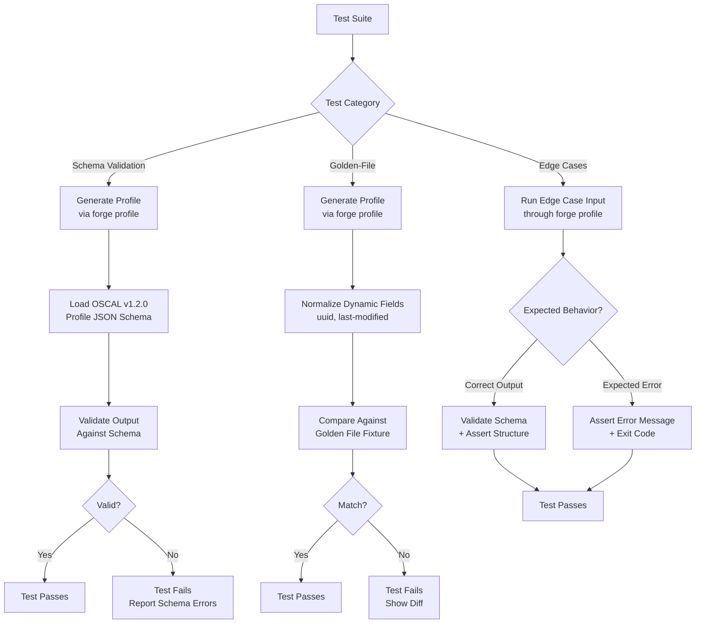
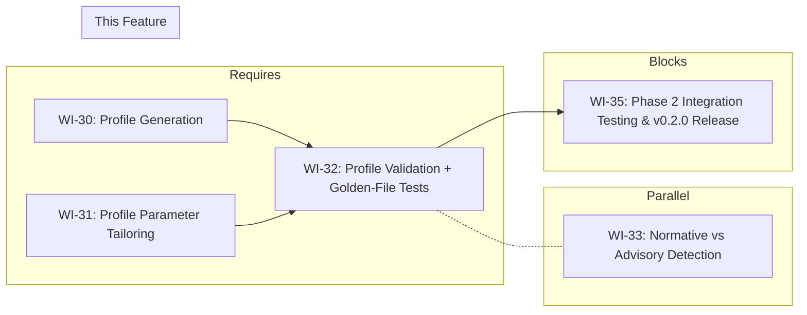

# 032-prd-profile-validation-tests

> **Document Type:** Product Requirements Document
> **Audience:** LLM agents, human reviewers
> **Status:** Draft
> **Last Updated:** 2026-02-10 <!-- @auto -->
> **Owner:** Brian Luby <!-- @human-required -->

**Feature Branch**: `032-profile-validation-tests`
**Created**: 2026-02-10
**Status**: Draft
**Input**: Derived from FORGE Product Roadmap WI-32

---

## Review Tier Legend

| Marker | Tier | Speckit Behavior |
|--------|------|------------------|
| :red_circle: `@human-required` | Human Generated | Prompt human to author; blocks until complete |
| :yellow_circle: `@human-review` | LLM + Human Review | LLM drafts → prompt human to confirm/edit; blocks until confirmed |
| :green_circle: `@llm-autonomous` | LLM Autonomous | LLM completes; no prompt; logged for audit |
| :white_circle: `@auto` | Auto-generated | System fills (timestamps, links); no prompt |

---

## Document Completion Order

> :warning: **For LLM Agents:** Complete sections in this order. Do not fill downstream sections until upstream human-required inputs exist.

1. **Context** (Background, Scope) → requires human input first
2. **Problem Statement & User Scenarios** → requires human input
3. **Requirements** (Must/Should/Could/Won't) → requires human input
4. **Technical Constraints** → human review
5. **Diagrams, Data Model, Interface** → LLM can draft after above exist
6. **Acceptance Criteria** → derived from requirements
7. **Everything else** → can proceed

---

## Context

### Background :red_circle: `@human-required`
This PRD covers **WI-32: Profile Validation + Golden-File Tests** from the FORGE Product Roadmap (Sprint S-32, Oct 6-10 2026, Theme T-5: Profile & Tailoring, Milestone MS-6). WI-30 implemented the core `forge profile` subcommand with `--include`/`--exclude` control selection and OSCAL Profile JSON generation with `imports[]`. WI-31 added parameter tailoring via `--set-param` and the `modify` section with `set-parameters`. At this point, Profile generation is functionally complete but lacks two critical quality assurance layers: (1) schema validation confirming that generated Profiles conform to the OSCAL v1.2.0 Profile JSON schema, and (2) golden-file tests that lock down the expected output and catch regressions. Without these, there is no automated mechanism to confirm that generated Profiles are structurally valid OSCAL documents, and no regression safety net as WI-33 (normative/advisory tagging) and WI-34 (parameter extraction) add new capabilities that touch Profile output. This work item closes the validation gap, exercises edge cases (empty selection, all controls, conflicting parameters), and ensures AC-12 from the parent PRD is fully passing.

### Scope Boundaries :yellow_circle: `@human-review`

**In Scope:**
- Schema validation of generated OSCAL Profiles against the OSCAL v1.2.0 Profile JSON schema
- Golden-file tests comparing `forge profile` output against expected JSON fixtures
- Edge case tests: empty control selection, all-controls selection, conflicting parameter values, duplicate include/exclude IDs
- Verification that AC-12 (parent PRD) is passing end-to-end
- Negative tests: invalid catalog path, malformed control IDs, non-existent control IDs in include/exclude

**Out of Scope:**
- New Profile generation features or CLI flags -- already implemented in WI-30 and WI-31
- Normative vs advisory detection -- deferred to WI-33 (033-prd-normative-advisory-detection)
- Parameter extraction from policy text -- deferred to WI-34 (034-prd-parameter-extraction)
- Profile Resolution (import → merge → modify) -- delegated to NIST oscal-cli in WI-36
- XML or YAML Profile output validation -- Profile generation currently outputs JSON only; format expansion handled in T-4
- Performance benchmarking of Profile generation -- not required at this stage

### Glossary :yellow_circle: `@human-review`

| Term | Definition |
|------|------------|
| OSCAL Profile | An OSCAL model for selecting, organizing, and tailoring controls into a baseline from one or more Catalogs |
| Schema Validation | The process of confirming a JSON document conforms to a JSON Schema definition |
| Golden-File Test | A test that compares generated output against a pre-approved expected output file; any deviation fails the test |
| Profile JSON Schema | The OSCAL v1.2.0 JSON Schema for the Profile model, published by NIST |
| imports | The OSCAL Profile section specifying which Catalog controls to include or exclude |
| modify | The OSCAL Profile section specifying parameter overrides and control alterations |
| set-parameters | An element within the Profile `modify` section that overrides parameter values from the source Catalog |
| Edge Case | A boundary condition or unusual input that tests the limits of the system's behavior |
| AC-12 | Parent PRD acceptance criterion: Given a policy Catalog with multiple controls, When running `forge profile` with include/exclude flags, Then a valid OSCAL Profile is generated |

### Related Documents :white_circle: `@auto`

| Document | Link | Relationship |
|----------|------|--------------|
| Parent PRD | docs/FORGE_PRD.md | Parent requirements S-5, AC-12, US-4 |
| Product Roadmap | docs/FORGE_PRODUCT_ROADMAP.md | Sprint S-32 context |
| Product Vision | docs/FORGE_PRODUCT_VISION.md | Strategic goal G-2 |
| Constitution | .specify/memory/constitution.md | Technical constraints and quality gates |
| Depends On | docs/PRD/030-prd-profile-generation.md | Core Profile generation (`forge profile` with --include/--exclude) |
| Depends On | docs/PRD/031-prd-profile-parameter-tailoring.md | Profile parameter tailoring (--set-param, modify section) |
| Parallel With | docs/PRD/033-prd-normative-advisory-detection.md | Normative vs advisory tagging (runs in parallel) |
| Blocks | docs/PRD/035-prd-phase2-integration-testing.md | Phase 2 integration testing and v0.2.0 release |

---

## Problem Statement :red_circle: `@human-required`

Profile generation (WI-30) and parameter tailoring (WI-31) are functionally complete, but there is no automated validation that the generated OSCAL Profiles conform to the OSCAL v1.2.0 Profile JSON schema, and no golden-file tests that lock down expected output to catch regressions. Without schema validation, a Profile could be generated with missing required fields, incorrect structure, or invalid element ordering and still appear to "work" because the JSON is syntactically valid. Without golden-file tests, changes in WI-33 (normative/advisory tagging) or WI-34 (parameter extraction) could silently alter Profile output in unexpected ways. Additionally, edge cases -- empty control selection, selecting all controls, conflicting parameter overrides, duplicate IDs in include/exclude lists -- have not been systematically tested. Until this work item is complete, AC-12 from the parent PRD cannot be considered fully validated, and the MS-6 milestone (Profile generation with tailoring, v0.2.0) cannot be confidently released. WI-35 (Phase 2 integration testing and release prep) is blocked until this validation layer is in place.

---

## User Scenarios & Testing :red_circle: `@human-required`

### User Story 1 -- Schema-Valid Profile Output (Priority: P1)

A developer needs automated confirmation that every Profile generated by `forge profile` conforms to the OSCAL v1.2.0 Profile JSON schema.

> As a developer working on FORGE, I want schema validation tests for generated Profiles so that I can be confident the output is structurally valid OSCAL and not just syntactically valid JSON.

**Why this priority**: Schema validation is the most fundamental quality gate for OSCAL output. Without it, downstream tools (oscal-cli, GRC platforms) may reject Profiles as malformed. This directly validates AC-12.

**Independent Test**: Generate a Profile from a sample Catalog using `forge profile`, then validate the output against the OSCAL v1.2.0 Profile JSON schema and verify it passes with zero validation errors.

**Acceptance Scenarios**:
1. **Given** a valid OSCAL Catalog with 10 controls, **When** running `forge profile --catalog catalog.json --include POL-AC-001,POL-AC-002 --format json`, **Then** the output validates against the OSCAL v1.2.0 Profile JSON schema with zero errors.
2. **Given** a Profile with parameter tailoring (`--set-param`), **When** validating the output against the Profile schema, **Then** the `modify` section with `set-parameters` is schema-valid.
3. **Given** a Profile with only `--exclude` flags (all controls except excluded ones), **When** validating, **Then** the `imports` section correctly represents the exclusion and passes schema validation.

---

### User Story 2 -- Golden-File Regression Tests (Priority: P1)

A developer needs golden-file tests that lock down the exact expected output for representative Profile generation scenarios, catching any unintended changes.

> As a developer working on FORGE, I want golden-file tests for Profile generation so that any change to the output format is immediately detected and must be explicitly approved.

**Why this priority**: Golden-file tests are the strongest regression safety net. As WI-33 and WI-34 modify Profile-related code, these tests ensure no unintended side effects on existing Profile output.

**Independent Test**: Run `cargo test` and verify that golden-file comparison tests pass, confirming generated Profile output matches the expected fixture files byte-for-byte (after normalization of timestamps and UUIDs).

**Acceptance Scenarios**:
1. **Given** a sample Catalog and an include list, **When** generating a Profile and comparing to the golden file, **Then** the output matches the expected fixture (modulo dynamic fields like `last-modified` and `uuid`).
2. **Given** a sample Catalog with parameter tailoring, **When** generating a Profile with `--set-param` and comparing to the golden file, **Then** the output matches the expected fixture including the `modify` section.
3. **Given** an intentional change to Profile output format, **When** running golden-file tests, **Then** the tests fail until the golden files are explicitly updated.

---

### User Story 3 -- Edge Case Coverage (Priority: P1)

A developer needs tests covering boundary conditions and unusual inputs for Profile generation to ensure robust behavior.

> As a developer working on FORGE, I want edge case tests for Profile generation so that unusual inputs (empty selection, all controls, conflicting params) produce correct and predictable behavior.

**Why this priority**: Edge cases are where bugs hide. Empty selection, all-controls selection, and conflicting parameters are realistic user inputs that must be handled gracefully. Testing them now prevents surprises in WI-35 integration testing.

**Independent Test**: Run `cargo test` and verify all edge case tests pass, covering empty selection, all-controls selection, conflicting parameters, and invalid inputs.

**Acceptance Scenarios**:
1. **Given** a Catalog with 10 controls, **When** running `forge profile` with an empty `--include` list (no controls selected), **Then** the behavior is well-defined: either an error is produced or a Profile with no imports is generated, and the result is schema-valid.
2. **Given** a Catalog with 10 controls, **When** running `forge profile` with all 10 control IDs in `--include`, **Then** a valid Profile is generated that imports all controls.
3. **Given** conflicting `--set-param` values (same parameter ID set twice with different values), **When** generating a Profile, **Then** the behavior is well-defined: either the last value wins or an error is produced.
4. **Given** a `--include` list containing a control ID that does not exist in the source Catalog, **When** generating a Profile, **Then** a descriptive error or warning is produced.

---

## Assumptions & Risks :yellow_circle: `@human-review`

### Assumptions
- [A-1] WI-30 (Profile generation) and WI-31 (parameter tailoring) are complete and their unit tests passing before WI-32 begins.
- [A-2] The OSCAL v1.2.0 Profile JSON schema is available and can be used with the `jsonschema` crate (or equivalent) already integrated in WI-19 for Catalog schema validation.
- [A-3] The schema validation infrastructure from WI-19/WI-20 (Catalog validation) can be reused for Profile validation with minimal adaptation.
- [A-4] Golden-file test infrastructure from WI-21/WI-22 (Catalog golden files) can be reused for Profile golden files.
- [A-5] Dynamic fields (UUIDs, timestamps) in Profile output are handled by the golden-file comparison framework (normalization or masking) as established in WI-21.

### Risks
| ID | Risk | Likelihood | Impact | Mitigation |
|----|------|------------|--------|------------|
| R-1 | OSCAL v1.2.0 Profile JSON schema has constraints not covered by the `jsonschema` crate | Low | Med | Schema validation infrastructure was proven for Catalogs in WI-19; Profile schema uses the same metaschema framework. If crate limitations emerge, fall back to oscal-cli validation. |
| R-2 | Golden-file tests are brittle due to non-deterministic output ordering (e.g., JSON object key ordering) | Med | Low | Use `serde_json` with consistent key ordering; normalize output before comparison. Established pattern from WI-21. |
| R-3 | Edge cases reveal bugs in WI-30/WI-31 that require fixes outside this WI's scope | Med | Med | File issues for WI-30/WI-31 fixes; this WI can proceed with tests that document known failures via `#[ignore]` or expected-failure annotations. |

---

## Feature Overview

### Flow Diagram :yellow_circle: `@human-review`



### State Diagram (if applicable) :yellow_circle: `@human-review`
N/A -- No state transitions in this work item. This is a test-only work item that validates existing functionality.

---

## Requirements

### Must Have (M) -- MVP, launch blockers :red_circle: `@human-required`
- [ ] **M-1:** Schema validation tests shall validate generated OSCAL Profiles against the OSCAL v1.2.0 Profile JSON schema. *(Traces to: Parent PRD S-5, AC-12)*
- [ ] **M-2:** Schema validation shall cover Profiles generated with `--include` flags (control inclusion). *(Traces to: Parent PRD S-5, AC-12)*
- [ ] **M-3:** Schema validation shall cover Profiles generated with `--exclude` flags (control exclusion). *(Traces to: Parent PRD S-5, AC-12)*
- [ ] **M-4:** Schema validation shall cover Profiles generated with `--set-param` flags (parameter tailoring). *(Traces to: Parent PRD S-5)*
- [ ] **M-5:** Golden-file tests shall compare generated Profile JSON output against expected fixture files for at least 3 representative scenarios (include-only, exclude-only, include with set-param). *(Traces to: Parent PRD S-5)*
- [ ] **M-6:** Golden-file comparison shall handle dynamic fields (UUIDs, `last-modified` timestamps) by normalizing or masking them before comparison. *(Traces to: Parent PRD S-5)*
- [ ] **M-7:** Edge case tests shall cover empty control selection (no controls in `--include`). *(Traces to: Parent PRD S-5)*
- [ ] **M-8:** Edge case tests shall cover all-controls selection (every control ID in `--include`). *(Traces to: Parent PRD S-5)*
- [ ] **M-9:** Edge case tests shall cover conflicting parameter values (same param ID set twice). *(Traces to: Parent PRD S-5)*
- [ ] **M-10:** All tests shall be runnable via `cargo test` and shall pass in CI. *(Traces to: Parent PRD S-5)*

### Should Have (S) -- High value, not blocking :red_circle: `@human-required`
- [ ] **S-1:** Edge case tests should cover non-existent control IDs in `--include`/`--exclude` lists, verifying a descriptive error or warning is produced.
- [ ] **S-2:** Edge case tests should cover duplicate control IDs in `--include` (same ID listed twice), verifying idempotent behavior.
- [ ] **S-3:** Golden-file tests should include a scenario with both `--include` and `--exclude` flags combined.
- [ ] **S-4:** Schema validation error messages should include the JSON path of the invalid field for actionable debugging.

### Could Have (C) -- Nice to have, if time permits :yellow_circle: `@human-review`
- [ ] **C-1:** A golden-file update mode (e.g., `UPDATE_GOLDEN=1 cargo test`) that regenerates fixture files from current output for intentional changes.
- [ ] **C-2:** Schema validation tests for Profile output with `--format json` flag explicitly specified (verifying default behavior matches explicit flag).

### Won't Have (W) -- Explicitly deferred :yellow_circle: `@human-review`
- [ ] **W-1:** Schema validation for XML or YAML Profile output -- *Reason: Profile generation currently only supports JSON; format expansion is in T-4*
- [ ] **W-2:** Profile Resolution validation (import → merge → modify) -- *Reason: Delegated to NIST oscal-cli in WI-36*
- [ ] **W-3:** Performance benchmarking of Profile generation -- *Reason: Not required for validation sprint; can be added to WI-35 if needed*
- [ ] **W-4:** Fuzz testing of Profile generation inputs -- *Reason: Systematic edge cases are sufficient for this sprint; fuzz testing is a future enhancement*

---

## Technical Constraints :yellow_circle: `@human-review`

- **Language/Framework:** Rust (latest stable), Cargo build system
- **Schema Validation:** Reuse the `jsonschema` crate and validation infrastructure established in WI-19 for Catalog validation; apply to OSCAL v1.2.0 Profile JSON schema
- **Golden-File Framework:** Reuse the golden-file comparison infrastructure from WI-21/WI-22; place Profile fixtures alongside Catalog fixtures in the test fixtures directory
- **OSCAL Version:** All validation targets OSCAL v1.2.0 Profile schema
- **Dynamic Field Handling:** UUIDs and `last-modified` timestamps must be normalized (replaced with stable placeholders) before golden-file comparison, per the pattern established in WI-21
- **Linting:** `cargo clippy -- -D warnings` must pass
- **Formatting:** `cargo fmt --all` must produce no changes
- **Testing:** TDD mandatory; all tests must be included in `cargo test`
- **Test Organization:** Profile validation tests should be organized in a dedicated test module (e.g., `tests/profile_validation.rs` or `tests/profile_golden_files.rs`)

---

## Data Model (if applicable) :yellow_circle: `@human-review`

N/A -- No new data model introduced in this work item. This WI tests the Profile output produced by WI-30 and WI-31 against existing OSCAL v1.2.0 schemas and golden-file fixtures.

---

## Interface Contract (if applicable) :yellow_circle: `@human-review`

```rust
// No new public API introduced. This WI adds tests only.
//
// Test functions exercise existing interfaces:
//
// 1. Profile generation (from WI-30):
//    forge profile --catalog <path> --include <ids> [--exclude <ids>] --format json [--output <path>]
//
// 2. Parameter tailoring (from WI-31):
//    forge profile --catalog <path> --include <ids> --set-param <id> <value> --format json
//
// Test infrastructure reused from WI-19/WI-21:
//
// Schema validation:
//    fn validate_against_schema(json: &str, schema_path: &Path) -> Result<(), Vec<ValidationError>>
//
// Golden-file comparison:
//    fn compare_golden_file(actual: &str, expected_path: &Path) -> Result<(), GoldenFileDiff>
//    fn normalize_dynamic_fields(json: &str) -> String  // masks UUIDs and timestamps

// Golden-file fixtures (new files created by this WI):
//   tests/fixtures/profiles/include_only.json        -- Profile with --include
//   tests/fixtures/profiles/exclude_only.json        -- Profile with --exclude
//   tests/fixtures/profiles/include_with_params.json -- Profile with --include + --set-param
//   tests/fixtures/profiles/all_controls.json        -- Profile selecting all controls
//   tests/fixtures/profiles/include_and_exclude.json -- Profile with both --include and --exclude
```

---

## Evaluation Criteria :yellow_circle: `@human-review`

| Criterion | Weight | Metric | Target | Notes |
|-----------|--------|--------|--------|-------|
| Schema Validation Coverage | Critical | All Profile generation paths validated against OSCAL v1.2.0 Profile schema | Include, exclude, and set-param paths all pass | Core quality gate |
| Golden-File Coverage | Critical | At least 3 golden-file scenarios passing | Include-only, exclude-only, include+set-param | Regression safety net |
| Edge Case Coverage | Critical | Edge case tests for empty selection, all controls, conflicting params | All pass or produce expected errors | Boundary condition confidence |
| AC-12 Passing | Critical | Parent PRD acceptance criterion fully validated | End-to-end test passes | MS-6 exit criteria |
| CI Green | High | All tests pass in `cargo test` | Zero failures | Quality gate |

---

## Tool/Approach Candidates :yellow_circle: `@human-review`

| Option | License | Pros | Cons | Spike Result |
|--------|---------|------|------|--------------|
| `jsonschema` crate (reuse from WI-19) | MIT/Apache-2.0 | Already integrated and proven for Catalog validation; supports OSCAL metaschema-derived schemas | Known limitations with some advanced schema features | Selected: proven in WI-19 |
| Golden-file framework (reuse from WI-21) | N/A (internal) | Already built and tested for Catalog golden files; handles dynamic field normalization | Requires adding Profile-specific fixtures | Selected: reuse existing infrastructure |
| oscal-cli for validation | Apache-2.0 | NIST reference implementation; most authoritative validation | External dependency; slower than in-process validation; not yet integrated until WI-36 | Fallback if jsonschema limitations emerge |

### Selected Approach :red_circle: `@human-required`
> **Decision:** Reuse the `jsonschema`-based schema validation infrastructure from WI-19 and the golden-file comparison framework from WI-21, applying both to Profile generation output. Add the OSCAL v1.2.0 Profile JSON schema alongside the existing Catalog schema. Create Profile-specific golden-file fixtures for representative scenarios. Implement edge case tests as standard Rust unit/integration tests.
> **Rationale:** Both infrastructure components are already proven for Catalog validation. Reusing them for Profile validation minimizes new code, ensures consistency, and leverages existing patterns for dynamic field normalization. Edge case tests follow standard Rust testing conventions and run in `cargo test`.

---

## Acceptance Criteria :yellow_circle: `@human-review`

| AC ID | Requirement | User Story | Given | When | Then |
|-------|-------------|------------|-------|------|------|
| AC-1 | M-1, M-2 | US-1 | A valid OSCAL Catalog with multiple controls | Generating a Profile with `--include` flags and validating against the OSCAL v1.2.0 Profile JSON schema | Schema validation passes with zero errors |
| AC-2 | M-1, M-3 | US-1 | A valid OSCAL Catalog with multiple controls | Generating a Profile with `--exclude` flags and validating against the Profile schema | Schema validation passes with zero errors |
| AC-3 | M-1, M-4 | US-1 | A valid OSCAL Catalog with controls and parameters | Generating a Profile with `--set-param` flags and validating against the Profile schema | Schema validation passes with zero errors, including the `modify.set-parameters` section |
| AC-4 | M-5, M-6 | US-2 | A sample Catalog and an include list | Generating a Profile and comparing to the golden file (with dynamic field normalization) | Output matches the expected golden file fixture |
| AC-5 | M-5, M-6 | US-2 | A sample Catalog with parameter tailoring | Generating a Profile with `--set-param` and comparing to the golden file | Output matches the expected golden file fixture including the `modify` section |
| AC-6 | M-7 | US-3 | A Catalog with 10 controls | Running `forge profile` with an empty `--include` list | Behavior is well-defined (error or empty Profile) and schema-valid if output is produced |
| AC-7 | M-8 | US-3 | A Catalog with 10 controls | Running `forge profile` with all 10 control IDs in `--include` | A valid Profile is generated importing all controls; schema validation passes |
| AC-8 | M-9 | US-3 | A Catalog with parameters | Running `forge profile` with conflicting `--set-param` values (same param ID, different values) | Behavior is well-defined (last-wins or error); result is documented and tested |
| AC-9 | M-10 | US-1, US-2, US-3 | All Profile validation and golden-file tests | Running `cargo test` | All tests pass with zero failures |
| AC-10 | M-1 (traces AC-12) | US-1 | A policy Catalog with multiple controls | Running `forge profile` with include/exclude flags | A valid OSCAL Profile is generated (parent PRD AC-12 confirmed passing) |

### Edge Cases :green_circle: `@llm-autonomous`
- [ ] **EC-1:** (M-7) When `--include` is provided with an empty list, then either a descriptive error is produced or an empty Profile is generated that still passes schema validation.
- [ ] **EC-2:** (M-8) When all control IDs from the source Catalog are included, then the Profile imports all controls and passes schema validation.
- [ ] **EC-3:** (M-9) When `--set-param` is specified twice for the same parameter ID with different values, then the last value wins or a descriptive error is produced.
- [ ] **EC-4:** (S-1) When `--include` contains a control ID that does not exist in the source Catalog, then a descriptive error or warning is produced.
- [ ] **EC-5:** (S-2) When `--include` contains the same control ID twice, then the duplicate is handled idempotently (no duplicate imports in the Profile).
- [ ] **EC-6:** (S-3) When both `--include` and `--exclude` are specified, then the Profile correctly resolves the selection (include takes precedence, or exclude filters from include set, depending on WI-30 design).
- [ ] **EC-7:** (M-1) When the source Catalog file path is invalid or the file does not exist, then a descriptive error is produced with a non-zero exit code.
- [ ] **EC-8:** (M-1) When the source Catalog is not a valid OSCAL Catalog (malformed JSON), then a descriptive error is produced.

---

## Dependencies :yellow_circle: `@human-review`



- **Requires:** [WI-30: Profile Generation] (core `forge profile` with --include/--exclude), [WI-31: Profile Parameter Tailoring] (--set-param and modify section)
- **Parallel With:** [WI-33: Normative vs Advisory Detection] (runs concurrently in S-33; no dependency in either direction)
- **Blocks:** [WI-35: Phase 2 Integration Testing & v0.2.0 Release] (cannot release v0.2.0 without validated Profile generation)
- **Reuses Infrastructure From:** [WI-19: Schema Validation] (jsonschema infrastructure), [WI-21/WI-22: Golden-File Tests] (comparison framework and dynamic field normalization)
- **External:** OSCAL v1.2.0 Profile JSON schema (published by NIST, stable)

---

## Security Considerations :yellow_circle: `@human-review`

| Aspect | Assessment | Notes |
|--------|------------|-------|
| Internet Exposure | No | CLI tool, no network services; tests run locally |
| Sensitive Data | No | Tests use synthetic fixture data, not real policy content |
| Authentication Required | No | Local CLI tool and test suite |
| Security Review Required | N/A | This is a test-only work item that validates existing functionality; no new attack surface introduced |

---

## Implementation Guidance :green_circle: `@llm-autonomous`

### Suggested Approach
Start by adding the OSCAL v1.2.0 Profile JSON schema to the project's schema resources (alongside the existing Catalog schema from WI-19). Create a Profile schema validation helper that wraps the existing `jsonschema` validation infrastructure. Write schema validation tests for each Profile generation path: include-only, exclude-only, set-param, and combinations.

For golden-file tests, create a set of Profile fixture files in `tests/fixtures/profiles/`. Each fixture represents the expected output for a specific `forge profile` invocation. Use the dynamic field normalization pattern from WI-21 to mask UUIDs and `last-modified` timestamps before comparison. Write at least 3 golden-file tests: (1) include-only, (2) exclude-only, (3) include with set-param.

For edge case tests, write focused unit or integration tests for each boundary condition: empty selection, all-controls selection, conflicting parameters, non-existent control IDs, and duplicate IDs. Each test should assert either the expected output structure or the expected error behavior.

Finally, write an end-to-end test that exercises the full AC-12 scenario: given a policy Catalog with multiple controls, run `forge profile` with include/exclude flags, validate the output against the Profile schema, and confirm it contains the expected imports.

### Anti-patterns to Avoid
- Writing golden-file tests that are sensitive to JSON key ordering -- use consistent serialization or order-insensitive comparison
- Hard-coding UUIDs or timestamps in golden files without normalization -- these will cause spurious failures
- Skipping schema validation and relying only on golden-file comparison -- schema validation catches structural issues that golden files might miss if fixtures are incorrect
- Testing only the happy path -- edge cases are where Profile generation is most likely to produce invalid output
- Creating a separate validation binary or tool -- reuse the existing validation infrastructure from WI-19

### Reference Examples
- WI-19 schema validation tests: pattern for loading JSON schema and validating output
- WI-21/WI-22 golden-file tests: pattern for fixture management, dynamic field normalization, and comparison
- NIST OSCAL Profile examples: reference for expected Profile JSON structure
- OSCAL v1.2.0 Profile JSON schema: https://pages.nist.gov/OSCAL/concepts/layer/control/profile/

---

## Spike Tasks :yellow_circle: `@human-review`

N/A -- No spike tasks for this work item. Schema validation infrastructure is proven from WI-19, golden-file infrastructure is proven from WI-21/WI-22, and the Profile JSON schema is published by NIST. All technical decisions are settled.

---

## Success Metrics :red_circle: `@human-required`

| Metric | Baseline | Target | Measurement Method |
|--------|----------|--------|-------------------|
| Schema validation tests pass | No Profile schema validation exists | All Profile generation paths validated against OSCAL v1.2.0 Profile schema | `cargo test` |
| Golden-file tests pass | No Profile golden files exist | At least 3 golden-file scenarios passing | `cargo test` |
| Edge case tests pass | No Profile edge case tests exist | Empty selection, all controls, conflicting params all tested | `cargo test` |
| AC-12 verified | AC-12 not yet validated | End-to-end AC-12 test passing | `cargo test` |

### Technical Verification :green_circle: `@llm-autonomous`
| Metric | Target | Verification Method |
|--------|--------|---------------------|
| Profile schema validation coverage | Include, exclude, and set-param paths all validated | `cargo test` -- schema validation tests |
| Golden-file test count | >= 3 scenarios | `cargo test` -- golden-file tests |
| Edge case test count | >= 3 edge cases (empty, all, conflicting) | `cargo test` -- edge case tests |
| No clippy warnings | 0 | `cargo clippy -- -D warnings` |
| No formatting violations | 0 | `cargo fmt --check` |
| All tests pass in CI | 0 failures | `cargo test` in CI pipeline |

---

## Definition of Ready :red_circle: `@human-required`

### Readiness Checklist
- [x] Problem statement reviewed and validated by stakeholder
- [x] All Must Have requirements have acceptance criteria
- [x] Technical constraints are explicit and agreed
- [x] Dependencies identified and owners confirmed
- [x] Security review completed (or N/A documented with justification)
- [x] No open questions blocking implementation
- [x] WI-30 (Profile generation) complete and tests passing
- [x] WI-31 (Profile parameter tailoring) complete and tests passing
- [x] OSCAL v1.2.0 Profile JSON schema available

### Sign-off
| Role | Name | Date | Decision |
|------|------|------|----------|
| Product Owner | Brian Luby | YYYY-MM-DD | [Ready / Not Ready] |

---

## Changelog :white_circle: `@auto`

| Version | Date | Author | Changes |
|---------|------|--------|---------|
| 0.1 | 2026-02-10 | LLM (Claude) | Initial draft derived from FORGE Product Roadmap WI-32 |

---

## Decision Log :yellow_circle: `@human-review`

| Date | Decision | Rationale | Alternatives Considered |
|------|----------|-----------|------------------------|
| 2026-02-10 | Reuse WI-19 schema validation infrastructure for Profile validation | Proven infrastructure; consistent approach across Catalog and Profile validation; minimizes new code | Build separate Profile validation logic (duplicates effort); use oscal-cli only (external dependency, slower) |
| 2026-02-10 | Reuse WI-21/WI-22 golden-file framework for Profile golden files | Established patterns for dynamic field normalization, fixture management, and comparison; consistent developer experience | Build new golden-file framework (unnecessary duplication); use snapshot testing crate like `insta` (introduces new dependency) |
| 2026-02-10 | Require at least 3 golden-file scenarios (include, exclude, include+set-param) | Covers the three primary Profile generation paths from WI-30 and WI-31; sufficient for regression confidence without over-investing in fixtures | Single golden file (insufficient coverage); 10+ golden files (diminishing returns for validation sprint) |
| 2026-02-10 | Test edge cases as standard Rust tests, not golden files | Edge cases test behavior (error messages, exit codes) rather than exact output format; standard assertions are more appropriate than golden-file comparison | Golden files for edge cases (brittle for error message formatting changes) |

---

## Open Questions :yellow_circle: `@human-review`

No open questions for this work item.

---

## Review Checklist :green_circle: `@llm-autonomous`

Before marking as Approved:
- [x] All requirements have unique IDs (M-1 through M-10, S-1 through S-4, C-1 through C-2, W-1 through W-4)
- [x] All Must Have requirements have linked acceptance criteria
- [x] User stories are prioritized and independently testable
- [x] Acceptance criteria reference both requirement IDs and user stories
- [x] Glossary terms are used consistently throughout
- [x] Diagrams use terminology from Glossary
- [x] Security considerations documented (N/A justified)
- [x] Definition of Ready checklist is complete
- [x] No open questions blocking implementation
