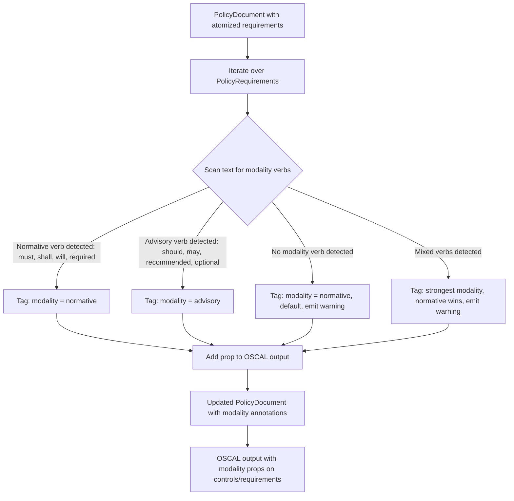
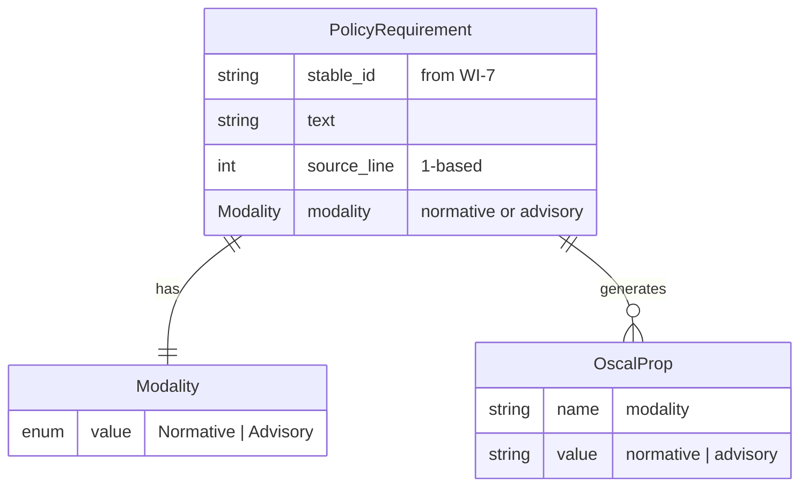
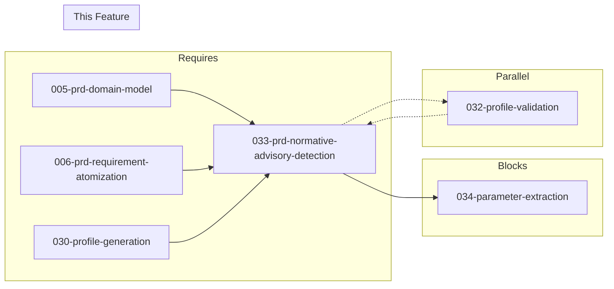

# 033-prd-normative-advisory-detection

> **Document Type:** Product Requirements Document
> **Audience:** LLM agents, human reviewers
> **Status:** Draft
> **Last Updated:** 2026-02-10 <!-- @auto -->
> **Owner:** Brian Luby <!-- @human-required -->

**Feature Branch**: `033-normative-advisory-detection`
**Created**: 2026-02-10
**Status**: Draft
**Input**: Derived from FORGE Product Roadmap WI-33

---

## Review Tier Legend

| Marker | Tier | Speckit Behavior |
|--------|------|------------------|
| :red_circle: `@human-required` | Human Generated | Prompt human to author; blocks until complete |
| :yellow_circle: `@human-review` | LLM + Human Review | LLM drafts -> prompt human to confirm/edit; blocks until confirmed |
| :green_circle: `@llm-autonomous` | LLM Autonomous | LLM completes; no prompt; logged for audit |
| :white_circle: `@auto` | Auto-generated | System fills (timestamps, links); no prompt |

---

## Document Completion Order

> :warning: **For LLM Agents:** Complete sections in this order. Do not fill downstream sections until upstream human-required inputs exist.

1. **Context** (Background, Scope) -> requires human input first
2. **Problem Statement & User Scenarios** -> requires human input
3. **Requirements** (Must/Should/Could/Won't) -> requires human input
4. **Technical Constraints** -> human review
5. **Diagrams, Data Model, Interface** -> LLM can draft after above exist
6. **Acceptance Criteria** -> derived from requirements
7. **Everything else** -> can proceed

---

## Context

### Background :red_circle: `@human-required`
This PRD covers **WI-33: Normative vs Advisory Detection** from the FORGE Product Roadmap (Sprint S-33, Oct 13-17 2026, Theme T-5: Profile & Tailoring, Milestone MS-6). Security policy documents mix normative language ("must", "shall", "will", "required") with advisory language ("should", "may", "recommended", "optional"). These two categories carry fundamentally different compliance implications: normative requirements represent mandatory obligations that must be satisfied, while advisory language represents recommendations or optional practices. Without distinguishing between them, all policy statements are treated with equal weight, which undermines the compliance value of the generated OSCAL artifacts. This work item implements detection of normative vs advisory verb patterns in policy requirement text and tags each `PolicyRequirement` with an OSCAL `prop` annotation (`name: "modality"`, `value: "normative"` or `"advisory"`), enabling downstream filtering, highlighting, and prioritization in output. This builds on the profile generation foundation established in WI-30 and feeds into WI-34 (parameter extraction), which also enriches requirements with semantic annotations.

### Scope Boundaries :yellow_circle: `@human-review`

**In Scope:**
- Detecting normative verbs ("must", "shall", "will", "required") in `PolicyRequirement` text
- Detecting advisory verbs ("should", "may", "recommended", "optional") in `PolicyRequirement` text
- Tagging each `PolicyRequirement` with an OSCAL `prop` annotation: `name: "modality"`, `value: "normative"` or `"advisory"`
- Adding a `modality` field to the `PolicyRequirement` domain model struct
- Handling requirements that contain no detectable modality verbs (default classification)
- Filtering and/or highlighting normative vs advisory requirements in CLI output
- Unit tests covering normative, advisory, mixed, and absent modality scenarios

**Out of Scope:**
- NLP or ML-based semantic analysis of obligation strength -- heuristic verb matching only
- Modifying the atomization logic (WI-6) -- modality detection operates on already-atomized requirements
- Parameter extraction from requirement text -- deferred to WI-34
- Profile generation or tailoring logic -- handled by WI-30/WI-31
- Schema validation of modality props -- deferred to WI-19 (already complete by this sprint)
- Modality-based control grouping or reorganization -- future extension

### Glossary :yellow_circle: `@human-review`

| Term | Definition |
|------|------------|
| Normative | Language expressing mandatory obligations; verbs include "must", "shall", "will", "required" per RFC 2119 and policy convention |
| Advisory | Language expressing recommendations or optional practices; verbs include "should", "may", "recommended", "optional" |
| Modality | The classification of a policy requirement as normative or advisory based on its verb usage |
| Prop | An OSCAL property element (`prop`) consisting of a name-value pair used to annotate OSCAL elements with additional metadata |
| RFC 2119 | IETF standard defining key words ("MUST", "SHALL", "SHOULD", "MAY", etc.) for use in policy and specification documents |
| PolicyRequirement | The domain model struct representing an individual policy requirement extracted from the source document |

### Related Documents :white_circle: `@auto`

| Document | Link | Relationship |
|----------|------|--------------|
| Parent PRD | docs/FORGE_PRD.md | Parent requirement S-7, AC-13 |
| Product Roadmap | docs/FORGE_PRODUCT_ROADMAP.md | Sprint S-33 context |
| Product Vision | docs/FORGE_PRODUCT_VISION.md | Strategic goal G-2 |
| OSCAL Research | docs/research/OSCAL_Research.md | Prop annotation guidance and modality mapping |
| Constitution | .specify/memory/constitution.md | Technical constraints and quality gates |
| Depends On | docs/PRD/005-prd-domain-model.md | PolicyRequirement struct extended by this work item |
| Parallel With | docs/PRD/006-prd-requirement-atomization.md | Atomization provides requirements that modality detection classifies |

---

## Problem Statement :red_circle: `@human-required`

Policy documents routinely mix normative and advisory language. A statement like "Systems must enforce multi-factor authentication" carries a fundamentally different compliance weight than "Systems should enforce multi-factor authentication." The parent PRD requirement S-7 mandates that FORGE distinguish these two categories and tag them appropriately using OSCAL `prop` annotations. Currently, all `PolicyRequirement` structs are treated identically regardless of the obligation strength expressed by their verb patterns. Without modality detection, downstream consumers of OSCAL artifacts (compliance officers, auditors, GRC tools) cannot differentiate mandatory controls from recommended practices, reducing the utility of FORGE's output for risk assessment and compliance gap analysis. The OSCAL research document confirms that `prop` is the correct mechanism for this metadata (not `remarks`), and NIST guidance explicitly supports using properties for additional semantics on controls and requirements.

---

## User Scenarios & Testing :red_circle: `@human-required`

### User Story 1 -- Detect Normative vs Advisory Language (Priority: P1)

A compliance engineer converts a policy document containing mixed normative and advisory language and needs each requirement tagged with its modality.

> As a compliance engineer using FORGE, I want normative requirements ("must"/"shall") distinguished from advisory recommendations ("should"/"may") so that I can prioritize mandatory compliance obligations over optional practices.

**Why this priority**: This is the core functionality of WI-33 and directly satisfies parent PRD requirement S-7 and acceptance criterion AC-13. Without it, all requirements appear equally weighted in the output.

**Independent Test**: Given a Markdown policy with "Organizations must implement encryption" and "Organizations should implement monitoring", convert and verify the first is tagged `modality: normative` and the second `modality: advisory`.

**Acceptance Scenarios**:
1. **Given** a policy requirement containing "must" or "shall", **When** modality detection runs, **Then** the requirement is tagged with `prop` `name: "modality"`, `value: "normative"`.
2. **Given** a policy requirement containing "should" or "may", **When** modality detection runs, **Then** the requirement is tagged with `prop` `name: "modality"`, `value: "advisory"`.

---

### User Story 2 -- Filter Output by Modality (Priority: P2)

A compliance engineer wants to view only normative requirements in the FORGE output to focus on mandatory obligations.

> As a compliance engineer using FORGE, I want to filter or highlight normative vs advisory requirements in the output so that I can focus my review on mandatory compliance obligations.

**Why this priority**: Filtering/highlighting is an output enhancement that builds directly on the modality tagging. The sprint deliverable explicitly includes "Filter/highlight in output."

**Independent Test**: Convert a mixed-modality policy, then verify the output distinguishes normative and advisory requirements visually or via filtering.

**Acceptance Scenarios**:
1. **Given** a converted policy with both normative and advisory requirements, **When** viewing the output, **Then** the modality prop is visible on each requirement (in JSON output, as a `prop` element).
2. **Given** the CLI output, **When** requesting filtered or highlighted output, **Then** normative and advisory requirements are visually distinguishable.

---

### User Story 3 -- Handle Ambiguous or Missing Modality (Priority: P2)

A policy document contains requirements without clear normative or advisory verbs, and the system must handle these gracefully.

> As a developer working on FORGE, I want requirements with no detectable modality verbs to be classified with a sensible default so that every requirement has a modality tag and no requirements are silently dropped.

**Why this priority**: Real-world policies contain imperative statements without explicit RFC 2119 keywords (e.g., "Encrypt all data at rest"). Robust handling of these cases prevents gaps in the modality annotation.

**Independent Test**: Given a requirement "Encrypt all data at rest" (no must/shall/should/may), convert and verify it receives a default modality classification.

**Acceptance Scenarios**:
1. **Given** a policy requirement with no detectable modality verb, **When** modality detection runs, **Then** the requirement is tagged with a default modality (normative) and a warning or informational note is emitted.
2. **Given** a policy requirement with conflicting modality verbs (e.g., "must ... but may"), **When** modality detection runs, **Then** the strongest modality (normative) takes precedence.

---

## Assumptions & Risks :yellow_circle: `@human-review`

### Assumptions
- [A-1] The domain model (WI-5) provides `PolicyRequirement` structs with text content available for modality analysis.
- [A-2] Requirements have been atomized by WI-6 before modality detection runs, so each requirement contains a single obligation with a single primary verb.
- [A-3] Heuristic verb matching is sufficient for well-structured policy documents; NLP-based analysis is not needed in this phase.
- [A-4] The OSCAL `prop` element with `name: "modality"` and `value: "normative"` or `"advisory"` is the correct annotation pattern per NIST guidance.
- [A-5] Profile generation (WI-30) is complete and provides the context for where modality props are consumed downstream.

### Risks
| ID | Risk | Likelihood | Impact | Mitigation |
|----|------|------------|--------|------------|
| R-1 | Heuristic verb matching produces false positives on non-RFC-2119 usage of "must"/"should" (e.g., "this must be understood as") | Med | Low | Match verbs in normative positions (subject + verb + object patterns); allow user override via configuration |
| R-2 | Policy documents use non-standard normative language (e.g., "is required to", "is expected to") | Med | Med | Start with core RFC 2119 verbs; provide extensible verb list via configuration for future expansion |
| R-3 | Atomization (WI-6) did not fully separate compound statements, leaving requirements with mixed modality verbs | Low | Med | Apply strongest-modality-wins rule; log a warning for mixed-modality requirements |
| R-4 | Default classification for missing modality verbs may not match user expectations | Low | Low | Document the default behavior; allow configuration to change default modality |

---

## Feature Overview

### Flow Diagram :yellow_circle: `@human-review`



### State Diagram (if applicable) :yellow_circle: `@human-review`
N/A -- No state transitions in this work item. Modality detection is a single-pass classification applied to each requirement.

---

## Requirements

### Must Have (M) -- MVP, launch blockers :red_circle: `@human-required`
- [ ] **M-1:** The modality detector shall identify normative verbs ("must", "shall", "will", "required") in `PolicyRequirement` text and classify the requirement as normative. *(Traces to: Parent PRD S-7)*
- [ ] **M-2:** The modality detector shall identify advisory verbs ("should", "may", "recommended", "optional") in `PolicyRequirement` text and classify the requirement as advisory. *(Traces to: Parent PRD S-7)*
- [ ] **M-3:** Each classified requirement shall be annotated with an OSCAL `prop` element: `name: "modality"`, `value: "normative"` or `"advisory"`. *(Traces to: Parent PRD S-7, AC-13)*
- [ ] **M-4:** The `PolicyRequirement` domain model struct shall be extended with a `modality` field of type `Modality` enum (`Normative`, `Advisory`). *(Traces to: Parent PRD S-7)*
- [ ] **M-5:** The modality `prop` shall appear on the corresponding OSCAL control or implemented-requirement in the generated output (Catalog and/or Component Definition). *(Traces to: Parent PRD S-7, AC-13)*
- [ ] **M-6:** Verb matching shall be case-insensitive to handle "Must", "MUST", "must", and similar variations. *(Traces to: Parent PRD S-7)*

### Should Have (S) -- High value, not blocking :red_circle: `@human-required`
- [ ] **S-1:** Requirements with no detectable modality verb shall default to normative classification with a warning emitted to stderr.
- [ ] **S-2:** Requirements with conflicting modality verbs (both normative and advisory detected) shall use the strongest modality (normative wins) with a warning emitted.
- [ ] **S-3:** The CLI output shall visually distinguish or allow filtering of normative vs advisory requirements (e.g., summary count in output, or modality annotation visible in JSON/YAML output).

### Could Have (C) -- Nice to have, if time permits :yellow_circle: `@human-review`
- [ ] **C-1:** A configurable verb list allowing users to add custom normative/advisory verbs via CLI flag or configuration file.
- [ ] **C-2:** A `--modality-filter` CLI flag to output only normative or only advisory requirements.
- [ ] **C-3:** Detection of negated modality ("must not", "shall not") as a distinct sub-classification within normative.

### Won't Have (W) -- Explicitly deferred :yellow_circle: `@human-review`
- [ ] **W-1:** NLP or ML-based semantic modality analysis -- *Reason: Heuristic verb matching is sufficient for structured policies; ML adds complexity without proportional benefit at this stage*
- [ ] **W-2:** Modality-based control reorganization or grouping -- *Reason: Modality is metadata, not a structural concern; downstream tools can use the prop for their own grouping*
- [ ] **W-3:** Parameter extraction from modality-annotated requirements -- *Reason: Deferred to WI-34*
- [ ] **W-4:** Modality confidence scoring -- *Reason: Binary normative/advisory classification is sufficient; confidence scoring adds complexity without clear user demand*

---

## Technical Constraints :yellow_circle: `@human-review`

- **Language/Framework:** Rust (latest stable), Cargo build system
- **Verb Matching:** Case-insensitive pattern matching against known verb lists; word-boundary-aware to prevent partial matches (e.g., "customize" should not match "must")
- **Domain Model Extension:** Add `Modality` enum to the domain model crate; extend `PolicyRequirement` with a `modality: Modality` field
- **OSCAL Prop Format:** `{ "name": "modality", "value": "normative" }` or `{ "name": "modality", "value": "advisory" }` per OSCAL `prop` schema
- **Output Integration:** Modality props must be emitted in both Catalog and Component Definition OSCAL output paths
- **Linting:** `cargo clippy -- -D warnings` must pass
- **Formatting:** `cargo fmt --check` must pass
- **Testing:** TDD mandatory; unit tests for all verb categories, edge cases, and integration with OSCAL output

---

## Data Model (if applicable) :yellow_circle: `@human-review`



Note: The `Modality` enum is added to the domain model as part of this work item. The `OscalProp` represents the OSCAL JSON `prop` element emitted in output. The domain model `PolicyRequirement` struct from WI-5 is extended with a `modality` field that was explicitly deferred (W-3 in 005-prd-domain-model).

---

## Interface Contract (if applicable) :yellow_circle: `@human-review`

```rust
/// Modality classification for a policy requirement
#[derive(Debug, Clone, Copy, PartialEq, Eq)]
pub enum Modality {
    /// Mandatory obligation: must, shall, will, required
    Normative,
    /// Recommendation or option: should, may, recommended, optional
    Advisory,
}

/// Result of modality detection for a single requirement
pub struct ModalityResult {
    /// The detected modality
    pub modality: Modality,
    /// The verb(s) that triggered the classification
    pub matched_verbs: Vec<String>,
    /// Whether a default was applied (no verb detected)
    pub is_default: bool,
    /// Whether conflicting verbs were detected
    pub has_conflict: bool,
}

/// Detect modality for a single policy requirement
pub fn detect_modality(requirement: &PolicyRequirement) -> ModalityResult;

/// Annotate all requirements in a PolicyDocument with modality classifications
/// Returns an updated PolicyDocument with modality fields populated
pub fn annotate_modalities(
    document: PolicyDocument,
) -> Result<PolicyDocument, ForgeError>;

// OSCAL prop output in generated JSON:
// {
//   "props": [
//     {
//       "name": "modality",
//       "value": "normative"
//     }
//   ]
// }
```

---

## Evaluation Criteria :yellow_circle: `@human-review`

| Criterion | Weight | Metric | Target | Notes |
|-----------|--------|--------|--------|-------|
| Normative Detection | Critical | Correct classification of "must"/"shall"/"will"/"required" | 100% on test fixtures | Core functionality |
| Advisory Detection | Critical | Correct classification of "should"/"may"/"recommended"/"optional" | 100% on test fixtures | Core functionality |
| Prop Annotation | Critical | Modality prop present on OSCAL output elements | All requirements annotated | Satisfies AC-13 |
| Case Insensitivity | High | "MUST", "Must", "must" all classified identically | 100% | RFC 2119 convention |
| Default Handling | High | Requirements without modality verbs receive default | Default applied with warning | Prevents gaps |
| Word Boundary | High | Partial matches avoided (e.g., "customize" not matching) | Zero false positives on test fixtures | Correctness |

---

## Tool/Approach Candidates :yellow_circle: `@human-review`

| Option | License | Pros | Cons | Spike Result |
|--------|---------|------|------|--------------|
| Regex-based verb matching | N/A (Rust `regex` crate, MIT/Apache-2.0) | Simple, fast, word-boundary support, well-understood | May need refinement for complex sentence structures | Selected |
| String contains + word boundary check | N/A (stdlib) | Zero dependencies, very fast | Manual word boundary logic, more error-prone | Alternative |
| NLP tokenizer (e.g., `rust-tokenizers`) | MIT/Apache-2.0 | Better linguistic accuracy | Heavy dependency, overkill for verb matching | Deferred |

### Selected Approach :red_circle: `@human-required`
> **Decision:** Regex-based verb matching with word boundary anchors using the Rust `regex` crate.
> **Rationale:** The `regex` crate provides `\b` word boundary anchors that prevent partial matches, supports case-insensitive matching via `(?i)`, and is already a transitive dependency in the project. This approach is simple, deterministic, and auditable -- consistent with product principle P-3. NLP-based approaches are deferred per W-1 as they add unnecessary complexity for structured policy documents.

---

## Acceptance Criteria :yellow_circle: `@human-review`

| AC ID | Requirement | User Story | Given | When | Then |
|-------|-------------|------------|-------|------|------|
| AC-1 | M-1 | US-1 | A requirement "Organizations must implement encryption" | Running modality detection | Modality is classified as `normative`, matched verb is "must" |
| AC-2 | M-2 | US-1 | A requirement "Organizations should implement monitoring" | Running modality detection | Modality is classified as `advisory`, matched verb is "should" |
| AC-3 | M-3 | US-1 | A requirement classified as normative | Generating OSCAL output | The control/requirement has `prop` with `name: "modality"`, `value: "normative"` |
| AC-4 | M-3 | US-1 | A requirement classified as advisory | Generating OSCAL output | The control/requirement has `prop` with `name: "modality"`, `value: "advisory"` |
| AC-5 | M-4 | US-1 | The PolicyRequirement struct | Inspecting the domain model | A `modality` field of type `Modality` enum exists on PolicyRequirement |
| AC-6 | M-5 | US-2 | A policy with mixed normative and advisory requirements | Converting to Catalog JSON | Each control has a `props` array containing the modality prop |
| AC-7 | M-6 | US-1 | A requirement "Systems MUST enforce MFA" | Running modality detection | Modality is classified as `normative` (case-insensitive match) |
| AC-8 | S-1 | US-3 | A requirement "Encrypt all data at rest" (no modality verb) | Running modality detection | Modality defaults to `normative`, warning emitted |
| AC-9 | S-2 | US-3 | A requirement "Systems must implement and should document controls" | Running modality detection | Modality is `normative` (strongest wins), warning emitted about conflict |
| AC-10 | S-3 | US-2 | A converted policy with mixed modality | Viewing CLI output | Modality annotations are visible on requirements in the output |

### Edge Cases :green_circle: `@llm-autonomous`
- [ ] **EC-1:** (M-1) When a requirement contains "must not" or "shall not", then the modality is still classified as `normative` (negation does not change obligation strength).
- [ ] **EC-2:** (M-6) When a requirement contains "MUST" (all caps, RFC 2119 style), then the modality is classified as `normative`.
- [ ] **EC-3:** (M-1, M-2) When a requirement contains "must" in a non-normative context (e.g., "this must be understood as guidance"), then the heuristic may produce a false positive -- accepted as a known limitation of verb-based matching.
- [ ] **EC-4:** (S-1) When a requirement contains only imperative verbs without RFC 2119 keywords (e.g., "Implement encryption for all data"), then the default modality (normative) is applied.
- [ ] **EC-5:** (M-2) When a requirement contains "may" as part of a month name (e.g., "review by May 2026"), then word boundary matching prevents false classification.
- [ ] **EC-6:** (M-1) When a requirement contains "required" as an adjective (e.g., "the required configuration"), then it is still classified as normative (accepted as conservative behavior).
- [ ] **EC-7:** (M-4) When the domain model is loaded from a document processed before WI-33, then the `modality` field defaults to `None` and modality detection populates it.

---

## Dependencies :yellow_circle: `@human-review`



- **Requires:** WI-30 (profile generation -- provides the profile context for where modality props are consumed), WI-5 (domain model -- `PolicyRequirement` struct extended here), WI-6 (atomization -- requirements must be atomized before modality detection)
- **Blocks:** WI-34 (parameter extraction -- builds on the annotation pattern established here)
- **Parallel With:** WI-32 (profile validation + golden-file tests), WI-34 (parameter extraction)
- **External:** None

---

## Security Considerations :yellow_circle: `@human-review`

| Aspect | Assessment | Notes |
|--------|------------|-------|
| Internet Exposure | No | CLI tool, no network services |
| Sensitive Data | Yes | Modality detection operates on policy requirement text which may contain sensitive compliance obligations |
| Authentication Required | No | Local CLI tool |
| Security Review Required | No | Regex-based verb matching on already-parsed text; no external input processing beyond the PolicyDocument; regex patterns are static and not user-supplied (no ReDoS risk) |

---

## Implementation Guidance :green_circle: `@llm-autonomous`

### Suggested Approach
Implement a `modality` module (e.g., `src/parse/modality.rs` or `src/annotate/modality.rs`) containing the `Modality` enum and detection logic. Define two static verb lists: `NORMATIVE_VERBS` containing `["must", "shall", "will", "required"]` and `ADVISORY_VERBS` containing `["should", "may", "recommended", "optional"]`. Compile case-insensitive regex patterns with word boundary anchors (e.g., `(?i)\b(must|shall|will|required)\b`) using `lazy_static` or `once_cell` for efficient reuse. The `detect_modality` function scans the requirement text against both patterns and returns a `ModalityResult`. If normative verbs are found, classify as `Normative`. If only advisory verbs are found, classify as `Advisory`. If both are found, classify as `Normative` (strongest wins) and set the `has_conflict` flag. If neither is found, classify as `Normative` (default) and set the `is_default` flag. The `annotate_modalities` function iterates over all `PolicyRequirement`s in a `PolicyDocument`, calls `detect_modality` on each, populates the `modality` field, and returns the updated document. In the OSCAL output builders (Catalog and Component Definition), add the modality prop to the `props` array of each control or implemented-requirement element.

### Anti-patterns to Avoid
- Using `String::contains()` without word boundary checks -- would match "customize" for "must" or "display" for "may"
- Hard-coding modality logic in the OSCAL builder rather than implementing it as a separate detection pass
- Classifying "must not" or "shall not" as non-normative -- negated obligations are still normative requirements
- Using `remarks` for modality metadata instead of `prop` -- NIST guidance explicitly discourages misusing remarks for structured metadata
- Compiling regex patterns on every call instead of caching them

### Reference Examples
- RFC 2119 keyword definitions: https://datatracker.ietf.org/doc/html/rfc2119
- OSCAL prop model reference: https://pages.nist.gov/OSCAL/reference/latest/catalog/json-outline/#/catalog/controls/props
- OSCAL Research guidance on using props vs remarks: `docs/research/OSCAL_Research.md` (see "Avoid misusing remarks" section)

---

## Spike Tasks :yellow_circle: `@human-review`

N/A -- No spike tasks for this work item. The verb matching approach is straightforward and well-understood. The OSCAL `prop` annotation pattern is documented in the OSCAL research and already used in the codebase for other properties.

---

## Success Metrics :red_circle: `@human-required`

| Metric | Baseline | Target | Measurement Method |
|--------|----------|--------|-------------------|
| Normative detection accuracy | N/A | 100% on test fixtures with explicit RFC 2119 verbs | Unit tests with known-normative requirements |
| Advisory detection accuracy | N/A | 100% on test fixtures with explicit RFC 2119 verbs | Unit tests with known-advisory requirements |
| Modality prop in OSCAL output | N/A | All requirements annotated with modality prop | Integration test verifying prop presence |
| AC-13 passing | N/A | Pass | End-to-end test: mixed-modality policy produces correctly tagged output |

### Technical Verification :green_circle: `@llm-autonomous`
| Metric | Target | Verification Method |
|--------|--------|---------------------|
| Test coverage for modality detection | >90% | `cargo test` + coverage tool |
| No clippy warnings | 0 | `cargo clippy -- -D warnings` |
| No formatting violations | 0 | `cargo fmt --check` |
| No regex performance regressions | <1ms per requirement | Benchmark test (optional) |

---

## Definition of Ready :red_circle: `@human-required`

### Readiness Checklist
- [x] Problem statement reviewed and validated by stakeholder
- [x] All Must Have requirements have acceptance criteria
- [x] Technical constraints are explicit and agreed
- [x] Dependencies identified and owners confirmed
- [x] Security review completed (or N/A documented with justification)
- [x] No open questions blocking implementation

### Sign-off
| Role | Name | Date | Decision |
|------|------|------|----------|
| Product Owner | Brian Luby | YYYY-MM-DD | [Ready / Not Ready] |

---

## Changelog :white_circle: `@auto`

| Version | Date | Author | Changes |
|---------|------|--------|---------|
| 0.1 | 2026-02-10 | LLM (Claude) | Initial draft derived from FORGE Product Roadmap WI-33 |

---

## Decision Log :yellow_circle: `@human-review`

| Date | Decision | Rationale | Alternatives Considered |
|------|----------|-----------|------------------------|
| 2026-02-10 | Use regex-based verb matching with word boundaries | Simple, deterministic, auditable; sufficient for structured policy documents with RFC 2119 keywords | NLP tokenizer (overkill), String::contains (no word boundaries, false positives) |
| 2026-02-10 | Default to normative when no modality verb detected | Conservative approach -- treating unclassified requirements as mandatory ensures nothing is silently downgraded to advisory | Default to advisory (risks missing mandatory requirements), require explicit classification (blocks pipeline on ambiguous text) |
| 2026-02-10 | Strongest modality wins on conflict (normative > advisory) | If both "must" and "should" appear in a single requirement, the mandatory obligation takes precedence; safer for compliance | Advisory wins (under-classifies), error on conflict (too strict for real-world documents) |
| 2026-02-10 | Use OSCAL prop (not remarks) for modality annotation | Follows NIST guidance to use structured properties for additional semantics; supports downstream filtering and querying | Remarks (explicitly discouraged by NIST), separate metadata field (non-standard) |

---

## Open Questions :yellow_circle: `@human-review`

No open questions for this work item.

---

## Review Checklist :green_circle: `@llm-autonomous`

Before marking as Approved:
- [x] All requirements have unique IDs (M-1 through M-6, S-1 through S-3, C-1 through C-3, W-1 through W-4)
- [x] All Must Have requirements have linked acceptance criteria
- [x] User stories are prioritized and independently testable
- [x] Acceptance criteria reference both requirement IDs and user stories
- [x] Glossary terms are used consistently throughout
- [x] Diagrams use terminology from Glossary
- [x] Security considerations documented
- [x] Definition of Ready checklist is complete
- [x] No open questions blocking implementation
