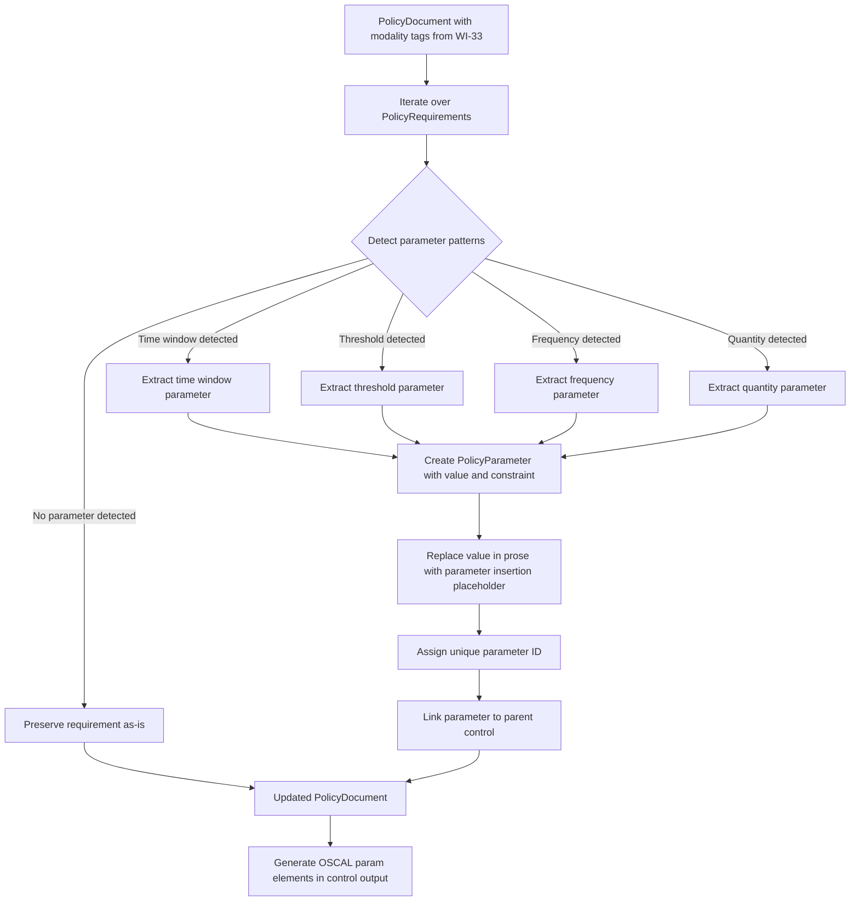
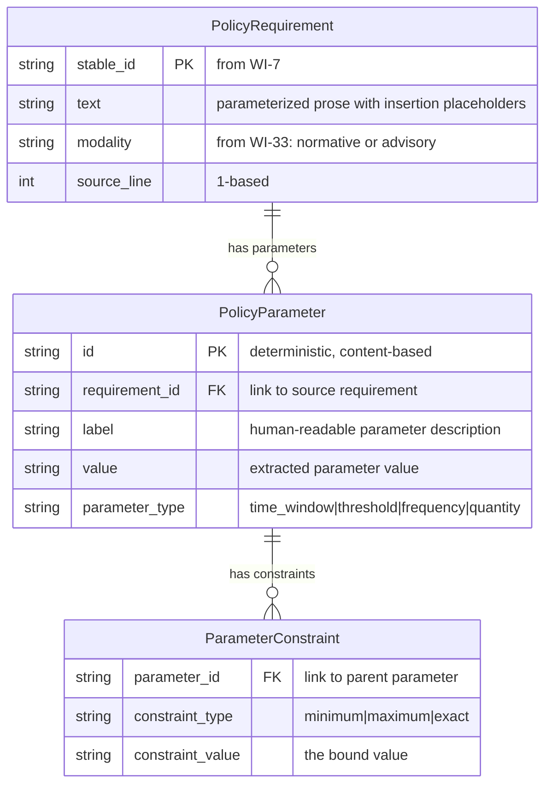
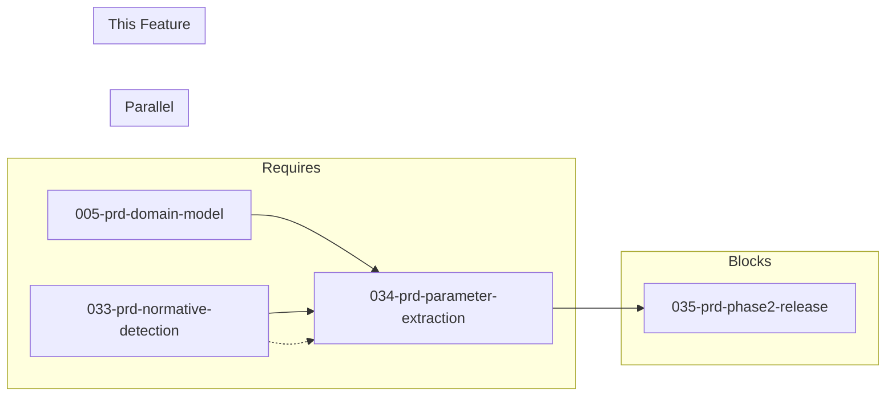

# 034-prd-parameter-extraction

> **Document Type:** Product Requirements Document
> **Audience:** LLM agents, human reviewers
> **Status:** Draft
> **Last Updated:** 2026-02-10 <!-- @auto -->
> **Owner:** Brian Luby <!-- @human-required -->

**Feature Branch**: `034-parameter-extraction`
**Created**: 2026-02-10
**Status**: Draft
**Input**: Derived from FORGE Product Roadmap WI-34

---

## Review Tier Legend

| Marker | Tier | Speckit Behavior |
|--------|------|------------------|
| 🔴 `@human-required` | Human Generated | Prompt human to author; blocks until complete |
| 🟡 `@human-review` | LLM + Human Review | LLM drafts → prompt human to confirm/edit; blocks until confirmed |
| 🟢 `@llm-autonomous` | LLM Autonomous | LLM completes; no prompt; logged for audit |
| ⚪ `@auto` | Auto-generated | System fills (timestamps, links); no prompt |

---

## Document Completion Order

> ⚠️ **For LLM Agents:** Complete sections in this order. Do not fill downstream sections until upstream human-required inputs exist.

1. **Context** (Background, Scope) → requires human input first
2. **Problem Statement & User Scenarios** → requires human input
3. **Requirements** (Must/Should/Could/Won't) → requires human input
4. **Technical Constraints** → human review
5. **Diagrams, Data Model, Interface** → LLM can draft after above exist
6. **Acceptance Criteria** → derived from requirements
7. **Everything else** → can proceed

---

## Context

### Background 🔴 `@human-required`
This PRD covers **WI-34: Parameter Extraction — Time Windows, Thresholds to OSCAL Param Elements** from the FORGE Product Roadmap (Sprint S-34, Oct 20–24 2026, Theme T-5: Profile & Tailoring, Milestone MS-6). Policy documents embed configurable values directly in requirement text — time windows ("within 30 days"), frequencies ("at least annually"), thresholds ("minimum 128-bit"), and quantities ("no fewer than 3"). These values are policy parameters: they define the specific measurable criteria that make a requirement concrete and assessable. When left embedded in prose, these parameters are invisible to tooling, cannot be tailored per deployment context, and resist automated compliance checking. OSCAL provides a first-class `param` element with `id`, `label`, `value`, and `constraint` fields specifically designed to represent configurable policy values. This work item detects parameter patterns in requirement text, extracts them into OSCAL `param` elements with value domains, and links each parameter to its parent control. Parameter extraction builds on WI-33 (normative detection), which establishes the modality tagging infrastructure that identifies which requirements contain normative obligations — the primary source of parameterized values. WI-34 runs in parallel with WI-33 and blocks WI-35 (Phase 2 integration testing and v0.2.0 release).

### Scope Boundaries 🟡 `@human-review`

**In Scope:**
- Detecting parameterized values in `PolicyRequirement` text: time windows, frequencies, thresholds, quantities, and key lengths
- Extracting detected parameters into `PolicyParameter` model objects linked to their source requirement
- Generating OSCAL `param` elements with `id`, `label`, `value`, and `constraint` fields
- Replacing extracted parameter values in requirement text with OSCAL parameter insertion placeholders (e.g., `{{ insert: param, id-ref: <param-id> }}`)
- Linking parameters to their parent OSCAL controls
- Defining value domains (constraints) for extracted parameters where the pattern implies bounds (e.g., "at least" implies a minimum constraint)
- Unit tests verifying parameter extraction from test fixtures covering each parameter type

**Out of Scope:**
- Profile parameter tailoring (--set-param) — already implemented in WI-31
- Normative vs advisory detection — handled by WI-33; this WI consumes modality tags but does not produce them
- Citation extraction — handled by WI-8
- Parameter validation against external schemas or databases — not in scope for extraction
- User-interactive parameter review or confirmation — fully automatic in this phase
- ML/NLP-based parameter detection — initial version uses regex/heuristic pattern matching only

### Glossary 🟡 `@human-review`

| Term | Definition |
|------|------------|
| Policy Parameter | A configurable value embedded in requirement text that defines a measurable criterion (e.g., time window, threshold, frequency) |
| OSCAL `param` Element | An OSCAL structure representing a configurable parameter with id, label, value, and optional constraint fields |
| Value Domain | The set of valid values or bounds for a parameter, expressed as OSCAL constraints (e.g., minimum, maximum, enumeration) |
| Time Window | A duration parameter specifying a deadline or period (e.g., "within 30 days", "every 90 days") |
| Threshold | A numeric boundary parameter specifying a minimum or maximum value (e.g., "at least 128-bit", "no more than 5") |
| Frequency | A recurrence parameter specifying how often an action must occur (e.g., "at least annually", "quarterly") |
| Quantity | A count parameter specifying a number of items or instances (e.g., "no fewer than 3", "at least 2") |
| Parameter Insertion | An OSCAL markup convention for referencing a parameter within prose text: `{{ insert: param, id-ref: <param-id> }}` |
| Constraint | An OSCAL sub-element of `param` that defines allowed values or bounds for the parameter |
| Normative Detection | The process (WI-33) of identifying whether a requirement uses normative ("must"/"shall") or advisory ("should"/"may") language |

### Related Documents ⚪ `@auto`

| Document | Link | Relationship |
|----------|------|--------------|
| Parent PRD | docs/FORGE_PRD.md | Parent requirement S-8 |
| Product Roadmap | docs/FORGE_PRODUCT_ROADMAP.md | Sprint S-34 context |
| Product Vision | docs/FORGE_PRODUCT_VISION.md | Strategic goal G-2 |
| Depends On | docs/PRD/033-prd-normative-detection.md | Normative detection (WI-33) provides modality tagging |
| Depends On | docs/PRD/005-prd-domain-model.md | Domain model structs (PolicyRequirement, PolicyParameter) |
| Blocks | docs/PRD/035-prd-phase2-release.md | Phase 2 integration testing and v0.2.0 release |
| Constitution | .specify/memory/constitution.md | Technical constraints and quality gates |

---

## Problem Statement 🔴 `@human-required`

Policy documents express configurable values — time windows, thresholds, frequencies, and quantities — inline within requirement prose. For example, "Passwords must be changed within 30 days of compromise" embeds the parameter "30 days" directly in the text. When these values are not extracted, they create several problems for compliance automation: (1) the specific measurable criteria are invisible to tooling and cannot be queried or compared programmatically; (2) the values cannot be tailored for different deployment contexts without editing the source document (e.g., a high-security environment may require "within 7 days" instead of "within 30 days"); and (3) automated compliance checking cannot validate whether observed values fall within policy-defined bounds. OSCAL solves this with the `param` element, which represents a configurable parameter with an identifier, label, current value, and constraints defining the value domain. Per parent PRD requirement S-8, FORGE must extract these parameters from requirement text, generate corresponding OSCAL `param` elements with value domains, and link them to their parent controls. This enables downstream profile tailoring (WI-31), automated assessment, and context-specific policy adaptation — all without modifying the source policy document.

---

## User Scenarios & Testing 🔴 `@human-required`

### User Story 1 — Extract Time Window Parameters (Priority: P1)

A policy requirement specifies a time window that should be extracted as a configurable OSCAL parameter.

> As a compliance engineer, I want FORGE to detect time window parameters (e.g., "within 30 days") in policy requirements and extract them as OSCAL `param` elements so that the time windows can be tailored per deployment context and validated by automated tools.

**Why this priority**: Time windows are the most common parameterized value in security policies and directly demonstrate parent PRD S-8 capability.

**Independent Test**: Pass a requirement containing "within 30 days" through parameter extraction and verify an OSCAL `param` element is generated with the correct value and a minimum-type constraint.

**Acceptance Scenarios**:
1. **Given** a PolicyRequirement with text "Passwords must be changed within 30 days of compromise", **When** parameter extraction runs, **Then** a PolicyParameter is created with value = "30 days", label = "time window", and a constraint indicating a duration bound, and the requirement text contains a parameter insertion placeholder in place of "30 days".
2. **Given** a PolicyRequirement with text "Access reviews shall be completed within 90 days of account creation", **When** parameter extraction runs, **Then** a PolicyParameter is created with value = "90 days" and the prose is updated with the parameter insertion placeholder.

---

### User Story 2 — Extract Threshold Parameters (Priority: P1)

A policy requirement specifies a numeric threshold (minimum or maximum) that should be extracted as a configurable OSCAL parameter.

> As a compliance engineer, I want FORGE to detect threshold parameters (e.g., "at least 128-bit", "minimum 12 characters") and extract them as OSCAL `param` elements with constraint bounds so that thresholds can be adjusted for different risk levels.

**Why this priority**: Thresholds define the measurable criteria that compliance assessors evaluate. Extracting them as parameters with constraints enables automated validation.

**Independent Test**: Pass a requirement containing "at least 128-bit" through parameter extraction and verify an OSCAL `param` element is generated with value = "128-bit" and a minimum constraint.

**Acceptance Scenarios**:
1. **Given** a PolicyRequirement with text "Encryption must use at least 128-bit keys", **When** parameter extraction runs, **Then** a PolicyParameter is created with value = "128-bit", a constraint with type "minimum", and the prose contains a parameter insertion placeholder.
2. **Given** a PolicyRequirement with text "Passwords must be minimum 12 characters", **When** parameter extraction runs, **Then** a PolicyParameter is created with value = "12 characters" and a minimum constraint.
3. **Given** a PolicyRequirement with text "Sessions must timeout after no more than 15 minutes of inactivity", **When** parameter extraction runs, **Then** a PolicyParameter is created with value = "15 minutes" and a maximum constraint.

---

### User Story 3 — Extract Frequency Parameters (Priority: P1)

A policy requirement specifies how often an action must occur, and the frequency should be extracted as a configurable OSCAL parameter.

> As a compliance engineer, I want FORGE to detect frequency parameters (e.g., "at least annually", "quarterly") and extract them as OSCAL `param` elements so that review and audit frequencies can be tailored per organizational policy.

**Why this priority**: Frequency parameters are explicitly called out in parent PRD S-8 ("at least annually") and are common across security policies for review cycles, training, and auditing.

**Independent Test**: Pass a requirement containing "at least annually" through parameter extraction and verify an OSCAL `param` element is generated with value = "annually" and an appropriate constraint.

**Acceptance Scenarios**:
1. **Given** a PolicyRequirement with text "Security training must be completed at least annually", **When** parameter extraction runs, **Then** a PolicyParameter is created with value = "annually" and a frequency-type constraint.
2. **Given** a PolicyRequirement with text "Vulnerability scans shall be performed quarterly", **When** parameter extraction runs, **Then** a PolicyParameter is created with value = "quarterly".

---

### User Story 4 — Extract Quantity Parameters (Priority: P2)

A policy requirement specifies a count or quantity that should be extracted as a configurable OSCAL parameter.

> As a developer working on FORGE, I want quantity parameters (e.g., "no fewer than 3", "at least 2") detected and extracted as OSCAL `param` elements so that numeric policy thresholds are represented as configurable values.

**Why this priority**: Quantity parameters complement thresholds and frequencies, completing the set of common parameterized values in security policies. Lower priority because they are less frequent than time windows and thresholds.

**Independent Test**: Pass a requirement containing "no fewer than 3" through parameter extraction and verify an OSCAL `param` element is generated with value = "3" and a minimum constraint.

**Acceptance Scenarios**:
1. **Given** a PolicyRequirement with text "Multi-factor authentication must require no fewer than 3 authentication factors", **When** parameter extraction runs, **Then** a PolicyParameter is created with value = "3" and a minimum constraint.
2. **Given** a PolicyRequirement with text "Backups shall be retained for at least 2 generations", **When** parameter extraction runs, **Then** a PolicyParameter is created with value = "2 generations" and a minimum constraint.

---

### User Story 5 — Link Parameters to Parent Controls (Priority: P1)

Extracted parameters must be linked to the OSCAL control that contains them.

> As a compliance engineer, I want extracted parameters linked to their parent OSCAL controls so that when viewing a control, I can see all its configurable parameters and their current values.

**Why this priority**: Without linkage, parameters are orphaned and cannot be used for profile tailoring or assessment. This is a structural requirement for valid OSCAL output.

**Independent Test**: Extract parameters from a requirement that maps to an OSCAL control and verify the generated `param` elements are nested within or linked to the correct control.

**Acceptance Scenarios**:
1. **Given** a PolicyRequirement with a parameterized value that maps to OSCAL control POL-AC-001, **When** parameter extraction and OSCAL generation run, **Then** the `param` element appears within the control's `params` array with a reference linking it to POL-AC-001.
2. **Given** a requirement with multiple parameters, **When** extraction runs, **Then** each parameter has a unique `id` and all are linked to the same parent control.

---

## Assumptions & Risks 🟡 `@human-review`

### Assumptions
- [A-1] Parameterized values in policy requirements follow recognizable syntactic patterns: "within N days", "at least N", "minimum N", "no fewer than N", "no more than N", "every N days/months", frequency words ("annually", "quarterly", "monthly", "weekly", "daily").
- [A-2] The domain model (WI-5) provides `PolicyParameter` structs as defined in the parent PRD data model, with fields for id, requirement_id, name, value, and value_domain.
- [A-3] WI-33 (normative detection) has tagged requirements with modality, enabling parameter extraction to focus on normative requirements where parameters are most meaningful.
- [A-4] Heuristic/regex-based parameter detection is sufficient for the majority of well-structured policy documents; ML-based extraction is not needed in this phase.
- [A-5] OSCAL `param` elements follow the OSCAL v1.2.0 specification structure with id, label, value, and constraint sub-elements.

### Risks
| ID | Risk | Likelihood | Impact | Mitigation |
|----|------|------------|--------|------------|
| R-1 | Heuristic patterns miss uncommon parameter phrasings (e.g., "not to exceed 72 hours", "a period of no less than one year") | Med | Med | Start with common patterns; expand pattern library iteratively; log unmatched potential parameters for review |
| R-2 | False positive extraction — detecting numeric values that are not parameters (e.g., "Section 3.2", "NIST SP 800-53") | Med | Med | Use contextual cues: require proximity to normative verbs and qualifier words ("within", "at least", "minimum"); exclude known non-parameter patterns (section numbers, standard references) |
| R-3 | Parameter insertion placeholders break prose readability when parameters are not resolved | Low | Low | Provide a human-readable label in the placeholder; ensure downstream rendering resolves placeholders |
| R-4 | Multiple parameters in a single requirement create ambiguous extraction results | Low | Med | Extract each parameter independently; assign unique IDs based on position and content; test with multi-parameter fixtures |

---

## Feature Overview

### Flow Diagram 🟡 `@human-review`



### State Diagram (if applicable) 🟡 `@human-review`
N/A — Parameter extraction is a stateless transformation pass over the domain model.

---

## Requirements

### Must Have (M) — MVP, launch blockers 🔴 `@human-required`
- [ ] **M-1:** The system shall detect time window parameters in requirement text using patterns such as "within N days/weeks/months/years", "after N days", and "every N days/months" and extract them into `PolicyParameter` objects. *(Traces to: Parent PRD S-8)*
- [ ] **M-2:** The system shall detect threshold parameters using patterns such as "at least N", "minimum N", "no fewer than N", "no more than N", "no less than N", and "maximum N" and extract them into `PolicyParameter` objects. *(Traces to: Parent PRD S-8)*
- [ ] **M-3:** The system shall detect frequency parameters using patterns such as "at least annually/quarterly/monthly/weekly/daily" and standalone frequency words and extract them into `PolicyParameter` objects. *(Traces to: Parent PRD S-8)*
- [ ] **M-4:** Each extracted `PolicyParameter` shall include: `id` (unique identifier), `label` (human-readable description of the parameter type), `value` (the extracted numeric or textual value), and `value_domain` (constraint information indicating the bound type — minimum, maximum, or exact). *(Traces to: Parent PRD S-8)*
- [ ] **M-5:** The system shall generate OSCAL `param` elements from extracted `PolicyParameter` objects, with `id`, `label`, `value`, and `constraint` fields populated. *(Traces to: Parent PRD S-8)*
- [ ] **M-6:** Each extracted parameter shall be linked to the `PolicyRequirement` (and thereby the OSCAL control) from which it was extracted, via the `requirement_id` field. *(Traces to: Parent PRD S-8)*
- [ ] **M-7:** The system shall replace extracted parameter values in requirement text with OSCAL parameter insertion placeholders (`{{ insert: param, id-ref: <param-id> }}`), producing parameterized prose suitable for OSCAL control statements. *(Traces to: Parent PRD S-8)*
- [ ] **M-8:** Parameter extraction shall be implemented as a pipeline enrichment function that takes a `PolicyDocument` and returns an enriched `PolicyDocument` with parameters populated and prose updated. *(Traces to: Parent PRD S-8)*

### Should Have (S) — High value, not blocking 🔴 `@human-required`
- [ ] **S-1:** The system should detect quantity parameters using patterns such as "no fewer than N", "at least N [unit]" where the unit is a countable noun (e.g., "factors", "characters", "generations") and extract them as `PolicyParameter` objects.
- [ ] **S-2:** The system should infer constraint types from qualifier words: "at least" / "minimum" / "no fewer than" implies a minimum constraint; "no more than" / "maximum" / "at most" implies a maximum constraint; bare values without qualifiers imply an exact constraint.
- [ ] **S-3:** The system should assign deterministic parameter IDs derived from the parent requirement's stable ID, the parameter's position within the requirement, and the parameter value, ensuring reproducibility across runs.
- [ ] **S-4:** The parameter extraction function should be idempotent — running it twice on the same document produces the same result without double-extracting parameters.

### Could Have (C) — Nice to have, if time permits 🟡 `@human-review`
- [ ] **C-1:** The system could detect compound parameters where a single requirement contains multiple parameterized values (e.g., "must be at least 12 characters and changed within 90 days") and extract each as a separate `PolicyParameter`.
- [ ] **C-2:** The system could produce an extraction summary log reporting the count of parameters extracted by type (time window, threshold, frequency, quantity) for CLI output.
- [ ] **C-3:** The system could detect written-out numeric values (e.g., "thirty days", "one year") and convert them to their numeric equivalents during extraction.

### Won't Have (W) — Explicitly deferred 🟡 `@human-review`
- [ ] **W-1:** ML/NLP-based parameter detection — *Reason: Heuristic regex patterns are sufficient for well-structured policy documents; ML deferred to future phases per principle P-3 (deterministic and auditable)*
- [ ] **W-2:** Parameter validation against external value databases — *Reason: Out of scope; FORGE extracts parameters but does not validate their correctness against external standards*
- [ ] **W-3:** User-interactive parameter review or confirmation — *Reason: Fully automatic in this phase; interactive review deferred to future UX improvements*
- [ ] **W-4:** Parameter value normalization (converting "30 days" to ISO 8601 duration "P30D") — *Reason: Value normalization adds complexity without immediate benefit; deferred to future enhancement*

---

## Technical Constraints 🟡 `@human-review`

- **Language/Framework:** Rust (latest stable)
- **Pattern Matching:** Use `regex` crate for parameter pattern detection; patterns must be deterministic and auditable
- **Error Handling:** `thiserror` for extraction errors (per constitution principle VIII)
- **Determinism:** Same input text must always produce the same extracted parameters and the same parameter IDs (per principle P-3)
- **Design:** Parameter extraction must be a pure enrichment pass — it reads `PolicyRequirement.text`, extracts parameters, updates the text with placeholders, and populates the parameters field
- **OSCAL Compliance:** Generated `param` elements must conform to the OSCAL v1.2.0 Catalog model specification
- **Testing:** TDD mandatory; comprehensive unit tests for each parameter type with test fixtures
- **Dependencies:** Depends on WI-33 normative detection (for modality context) and WI-5 domain model (for `PolicyParameter` struct)
- **Performance:** Parameter extraction must handle documents with hundreds of requirements without noticeable delay; linear time O(n) in the number of requirements

---

## Data Model (if applicable) 🟡 `@human-review`



Note: The `PolicyParameter` struct aligns with the parent PRD data model definition (id, requirement_id, name, value, value_domain). The `ParameterConstraint` maps to the OSCAL `constraint` sub-element within a `param` element. In practice, the value domain is stored as a string in the `PolicyParameter.value_domain` field, encoding the constraint type and bound.

---

## Interface Contract (if applicable) 🟡 `@human-review`

```rust
/// A policy parameter extracted from requirement text
#[derive(Debug, Clone)]
pub struct PolicyParameter {
    /// Unique identifier for this parameter (deterministic, content-based)
    pub id: String,
    /// ID of the PolicyRequirement this parameter was extracted from
    pub requirement_id: String,
    /// Human-readable label describing the parameter (e.g., "password change time window")
    pub label: String,
    /// The extracted parameter value (e.g., "30 days", "128-bit", "annually")
    pub value: String,
    /// The type of parameter: time_window, threshold, frequency, quantity
    pub parameter_type: ParameterType,
    /// Constraint defining the value domain (minimum, maximum, or exact)
    pub constraint: Option<ParameterConstraint>,
}

/// Types of policy parameters
#[derive(Debug, Clone, PartialEq)]
pub enum ParameterType {
    TimeWindow,
    Threshold,
    Frequency,
    Quantity,
}

/// Constraint on a parameter value
#[derive(Debug, Clone)]
pub struct ParameterConstraint {
    /// The type of constraint: minimum, maximum, or exact
    pub constraint_type: ConstraintType,
    /// The bound value as a string
    pub value: String,
}

/// Types of parameter constraints
#[derive(Debug, Clone, PartialEq)]
pub enum ConstraintType {
    Minimum,
    Maximum,
    Exact,
}

/// Enrichment function: extract parameters from all requirements in a document
/// Updates requirement text with parameter insertion placeholders
pub fn extract_parameters(document: &mut PolicyDocument) -> Result<(), ForgeError>;

/// Lower-level: extract parameters from a single requirement's text
/// Returns (parameterized_text, extracted_parameters)
pub fn extract_parameters_from_text(
    requirement_id: &str,
    text: &str,
) -> Result<(String, Vec<PolicyParameter>), ForgeError>;

/// Generate an OSCAL param element from a PolicyParameter
pub fn to_oscal_param(parameter: &PolicyParameter) -> OscalParam;

/// Generate a deterministic parameter ID from content
pub fn parameter_id(
    requirement_id: &str,
    value: &str,
    position: usize,
) -> String;
```

The `PolicyRequirement` struct (from WI-5) uses its existing `parameters` field:

```rust
pub struct PolicyRequirement {
    pub stable_id: Option<String>,       // populated by WI-7
    pub text: String,                     // parameterized after extraction
    pub modality: Option<Modality>,       // populated by WI-33
    pub source_line: usize,
    pub nesting_depth: u8,
    pub parameters: Vec<PolicyParameter>, // populated by WI-34 (this WI)
    pub citations: Vec<Citation>,         // populated by WI-8
}
```

---

## Evaluation Criteria 🟡 `@human-review`

| Criterion | Weight | Metric | Target | Notes |
|-----------|--------|--------|--------|-------|
| Time Window Extraction | Critical | Time window parameters correctly detected and extracted | 100% on test fixtures | Core parameter type per S-8 |
| Threshold Extraction | Critical | Threshold parameters correctly detected and extracted | 100% on test fixtures | Core parameter type per S-8 |
| Frequency Extraction | Critical | Frequency parameters correctly detected and extracted | 100% on test fixtures | Explicitly called out in S-8 |
| OSCAL Param Generation | Critical | Valid OSCAL `param` elements generated with id, label, value, constraint | 100% conformant | Must validate against OSCAL schema |
| Prose Parameterization | High | Extracted values replaced with insertion placeholders in requirement text | 100% on test fixtures | Required for valid OSCAL control statements |
| Constraint Inference | High | Correct constraint type inferred from qualifier words | 100% on test fixtures | "at least" = minimum, "no more than" = maximum |
| Parameter-Control Linkage | Critical | Every parameter linked to its parent control | 100% linked | Required for valid OSCAL structure |

---

## Tool/Approach Candidates 🟡 `@human-review`

| Option | License | Pros | Cons | Spike Result |
|--------|---------|------|------|--------------|
| Regex-based heuristic extraction | N/A (regex crate, MIT/Apache-2.0) | Deterministic, auditable, no external NLP dependencies | Limited to syntactic patterns; may miss unusual phrasings | Selected |
| NLP-based named entity recognition | Various | Handles complex sentence structures; detects implicit parameters | Non-deterministic, heavy dependency, violates P-3 | Deferred (W-1) |
| Grammar-based parser (pest/nom) | MIT | Structured parsing of parameter patterns | Overkill for the parameter patterns; higher implementation cost | Not selected |

### Selected Approach 🔴 `@human-required`
> **Decision:** Regex-based heuristic extraction with pattern-specific matchers for each parameter type (time window, threshold, frequency, quantity)
> **Rationale:** Deterministic and auditable per principle P-3. Regex patterns can be tested exhaustively against fixtures, expanded incrementally as new patterns are encountered, and produce consistent results across runs. The pattern library covers the common parameter phrasings found in well-structured security policy documents without introducing ML dependencies.

---

## Acceptance Criteria 🟡 `@human-review`

| AC ID | Requirement | User Story | Given | When | Then |
|-------|-------------|------------|-------|------|------|
| AC-1 | M-1, M-4 | US-1 | "Passwords must be changed within 30 days of compromise" | Running parameter extraction | A PolicyParameter is created with value = "30 days", label describing time window, constraint_type = minimum (duration bound), and prose contains `{{ insert: param, id-ref: <param-id> }}` in place of "30 days" |
| AC-2 | M-2, M-4 | US-2 | "Encryption must use at least 128-bit keys" | Running parameter extraction | A PolicyParameter is created with value = "128-bit", constraint_type = minimum, and prose contains the insertion placeholder |
| AC-3 | M-2, M-4 | US-2 | "Sessions must timeout after no more than 15 minutes of inactivity" | Running parameter extraction | A PolicyParameter is created with value = "15 minutes", constraint_type = maximum |
| AC-4 | M-3, M-4 | US-3 | "Security training must be completed at least annually" | Running parameter extraction | A PolicyParameter is created with value = "annually", parameter_type = frequency |
| AC-5 | M-5 | US-5 | A PolicyParameter with id, label, value, and constraint | Generating OSCAL output | An OSCAL `param` element is produced with id, label, value, and constraint fields correctly populated |
| AC-6 | M-6 | US-5 | A PolicyRequirement with an extracted parameter that maps to control POL-AC-001 | Running OSCAL generation | The `param` element appears within or linked to control POL-AC-001 |
| AC-7 | M-7 | US-1 | "Access reviews shall be completed within 90 days of account creation" | Running parameter extraction | The requirement text is updated to contain a parameter insertion placeholder where "90 days" was |
| AC-8 | M-8 | US-1 | A PolicyDocument with 5 requirements, 3 containing parameters | Calling extract_parameters() | Updated PolicyDocument with 3 requirements containing parameters and updated prose; 2 requirements unchanged |
| AC-9 | S-1 | US-4 | "MFA must require no fewer than 3 authentication factors" | Running parameter extraction | A PolicyParameter is created with value = "3", constraint_type = minimum, parameter_type = quantity |
| AC-10 | S-2 | US-2 | "Passwords must be minimum 12 characters" | Running parameter extraction | constraint_type = minimum is inferred from "minimum" qualifier |

### Edge Cases 🟢 `@llm-autonomous`
- [ ] **EC-1:** (M-1) When a requirement contains no parameterized values (e.g., "All systems must enforce MFA"), then the text is unchanged and no PolicyParameters are created.
- [ ] **EC-2:** (M-2) When a value appears in a non-parameter context (e.g., "per Section 3.2" or "NIST SP 800-53"), then it is not extracted as a parameter (false positive avoidance).
- [ ] **EC-3:** (M-7) When replacing a parameter value with an insertion placeholder, then surrounding whitespace and punctuation are preserved and no awkward formatting is introduced.
- [ ] **EC-4:** (M-1) When a requirement contains multiple parameters (e.g., "must be at least 12 characters and changed within 90 days"), then each parameter is extracted separately with a unique ID.
- [ ] **EC-5:** (M-8) When a PolicyDocument has zero requirements, then extract_parameters() returns the document unchanged without error.
- [ ] **EC-6:** (M-3) When a frequency is expressed as a standalone word without a qualifier (e.g., "quarterly"), then it is extracted with an exact constraint type.
- [ ] **EC-7:** (M-2) When a threshold uses "no less than" (synonym for "at least"), then it is correctly detected and extracted with a minimum constraint.
- [ ] **EC-8:** (S-3) When the same requirement is processed twice, then identical parameter IDs are produced (deterministic).
- [ ] **EC-9:** (M-1) When a time window uses weeks, months, or years (e.g., "within 6 months", "every 2 years"), then it is correctly detected and extracted.
- [ ] **EC-10:** (M-2) When a requirement text is empty or whitespace-only, then it is preserved as-is without error and no parameters are extracted.

---

## Dependencies 🟡 `@human-review`



- **Requires:** [005-prd-domain-model](docs/PRD/005-prd-domain-model.md) — provides `PolicyDocument`, `PolicyRequirement`, `PolicyParameter` structs
- **Depends On:** [033-prd-normative-detection](docs/PRD/033-prd-normative-detection.md) (WI-33) — normative detection provides modality tagging that informs parameter extraction context
- **Parallel With:** [033-prd-normative-detection](docs/PRD/033-prd-normative-detection.md) (WI-33) — can proceed concurrently; consumes modality tags when available
- **Blocks:** [035-prd-phase2-release](docs/PRD/035-prd-phase2-release.md) (WI-35) — Phase 2 integration testing and v0.2.0 release depends on parameter extraction being complete
- **External:** `regex` crate (well-established Rust ecosystem crate)

---

## Security Considerations 🟡 `@human-review`

| Aspect | Assessment | Notes |
|--------|------------|-------|
| Internet Exposure | No | Parameter extraction is offline text processing; no network access |
| Sensitive Data | Yes | Policy requirement text may contain sensitive operational details, thresholds, and security configuration values |
| Authentication Required | No | Local CLI tool |
| Security Review Required | No | Regex patterns operate on already-parsed text from the domain model; no external input injection risk beyond the source document |

Additional security notes:
- If `regex` crate is used, ensure patterns are not vulnerable to catastrophic backtracking (ReDoS). Use bounded patterns and test with adversarial input.
- Extracted parameter values (e.g., key lengths, timeout durations) may reveal security posture details; these should not be logged at debug level in production builds.

---

## Implementation Guidance 🟢 `@llm-autonomous`

### Suggested Approach
Implement parameter extraction as an enrichment pass in the pipeline, following the pattern established by WI-6 (atomization) and WI-8 (citation extraction). Create a `parameter` module (or extend the existing `parse` module) with extraction functions organized by parameter type. The implementation should:

1. **Define pattern matchers per parameter type**: Create separate regex patterns for each category:
   - Time windows: `within\s+(\d+)\s+(days?|weeks?|months?|years?)`, `after\s+(\d+)\s+(days?|weeks?|months?|years?)`, `every\s+(\d+)\s+(days?|weeks?|months?|years?)`
   - Thresholds: `(at\s+least|minimum|no\s+fewer\s+than|no\s+less\s+than)\s+(\d+[\w-]*)`, `(no\s+more\s+than|maximum|at\s+most)\s+(\d+[\w-]*)`
   - Frequencies: `(at\s+least\s+)?(annually|quarterly|monthly|weekly|daily|biannually|semi-annually)`
   - Quantities: `(at\s+least|no\s+fewer\s+than|minimum)\s+(\d+)\s+(\w+)`

2. **Infer constraint types**: Map qualifier words to constraint types — "at least"/"minimum"/"no fewer than"/"no less than" to Minimum; "no more than"/"maximum"/"at most" to Maximum; bare values to Exact.

3. **Generate parameter IDs**: Compute deterministic IDs from the parent requirement's stable_id, the parameter value, and its position index within the requirement. Use a content-based hash consistent with the preliminary ID scheme from WI-7.

4. **Replace values with insertion placeholders**: After extracting a parameter, replace the matched text in the requirement prose with `{{ insert: param, id-ref: <param-id> }}`, preserving surrounding context.

5. **Populate the domain model**: Add extracted `PolicyParameter` objects to the `PolicyRequirement.parameters` Vec. Ensure the enrichment function is idempotent.

6. **Generate OSCAL output**: Provide a `to_oscal_param()` function that converts a `PolicyParameter` into the OSCAL `param` element structure, ready for embedding in control output.

### Anti-patterns to Avoid
- Extracting numeric values without contextual cues — bare numbers like "3" or "12" without qualifier words ("at least", "within", "minimum") should not be extracted as parameters
- Extracting values from citations or section references (e.g., "Section 3.2", "NIST SP 800-53") — coordinate with WI-8 citation extraction to avoid conflicts
- Modifying requirements that contain no parameterized values — the extraction pass must be a no-op for non-parameterized requirements
- Using non-deterministic processing — parameter IDs and extraction results must be identical across runs per P-3
- Over-engineering with NLP features that violate the heuristic-only scope of this WI

### Reference Examples
- Parent PRD S-8: "within 30 days", "at least annually" as OSCAL `param` elements with value domains
- OSCAL Catalog model `param` element: https://pages.nist.gov/OSCAL-Reference/models/latest/catalog/json-reference/#/catalog/groups/controls/params
- OSCAL parameter insertion: `{{ insert: param, id-ref: param-id }}` in control prose

---

## Spike Tasks 🟡 `@human-review`

N/A — No spike tasks for this work item. The regex-based approach is well-understood and the OSCAL `param` element structure is documented in the OSCAL specification.

---

## Success Metrics 🔴 `@human-required`

| Metric | Baseline | Target | Measurement Method |
|--------|----------|--------|-------------------|
| Time window extraction accuracy | N/A | 100% of time window patterns in test fixtures correctly extracted | Unit tests with time window fixtures |
| Threshold extraction accuracy | N/A | 100% of threshold patterns in test fixtures correctly extracted | Unit tests with threshold fixtures |
| Frequency extraction accuracy | N/A | 100% of frequency patterns in test fixtures correctly extracted | Unit tests with frequency fixtures |
| OSCAL param validity | N/A | 100% of generated param elements conform to OSCAL v1.2.0 schema | Schema validation of generated output |
| False positive rate | N/A | 0% false extractions on test fixtures (no section numbers, standard references extracted as parameters) | Unit tests with negative fixtures |

### Technical Verification 🟢 `@llm-autonomous`
| Metric | Target | Verification Method |
|--------|--------|---------------------|
| Test coverage | >90% | `cargo test` + coverage tool |
| No clippy warnings | 0 | `cargo clippy -- -D warnings` |
| No formatting violations | 0 | `cargo fmt --check` |
| No regex ReDoS vulnerability | 0 | Test with adversarial long input strings |

---

## Definition of Ready 🔴 `@human-required`

### Readiness Checklist
- [x] Problem statement reviewed and validated by stakeholder
- [x] All Must Have requirements have acceptance criteria
- [x] Technical constraints are explicit and agreed
- [x] Dependencies identified and owners confirmed
- [x] Security review completed (or N/A documented with justification)
- [x] No open questions blocking implementation

### Sign-off
| Role | Name | Date | Decision |
|------|------|------|----------|
| Product Owner | Brian Luby | YYYY-MM-DD | [Ready / Not Ready] |

---

## Changelog ⚪ `@auto`

| Version | Date | Author | Changes |
|---------|------|--------|---------|
| 0.1 | 2026-02-10 | LLM (Claude) | Initial draft derived from FORGE Product Roadmap WI-34 |

---

## Decision Log 🟡 `@human-review`

| Date | Decision | Rationale | Alternatives Considered |
|------|----------|-----------|------------------------|
| 2026-02-10 | Use heuristic regex-based parameter extraction, not NLP | Deterministic and auditable per principle P-3; avoids heavy ML dependencies; sufficient for well-structured policy documents with common parameter phrasings | NLP-based named entity recognition (non-deterministic, heavy dependency); grammar-based parser (overkill for parameter patterns) |
| 2026-02-10 | Infer constraint types from qualifier words rather than requiring explicit annotation | Qualifier words ("at least", "minimum", "no more than") carry clear semantic meaning that maps directly to OSCAL constraint types; requiring annotation would burden policy authors | Explicit constraint annotation in source documents (impractical for existing policies); no constraints (loses value domain information) |
| 2026-02-10 | Replace extracted values with OSCAL insertion placeholders in prose | OSCAL convention for parameterized control text; enables profile tailoring to substitute values without modifying control structure | Leave values in prose (prevents tailoring); remove values entirely (breaks readability) |
| 2026-02-10 | Parameter extraction as pipeline enrichment pass (not inline during parsing) | Keeps extraction decoupled from parsing; enables independent testing; follows pattern established by WI-6 and WI-8 | Inline extraction during structural parsing (tight coupling, blocks parallelism) |

---

## Open Questions 🟡 `@human-review`

No open questions for this work item.

---

## Review Checklist 🟢 `@llm-autonomous`

Before marking as Approved:
- [x] All requirements have unique IDs (M-1 through M-8, S-1 through S-4, C-1 through C-3, W-1 through W-4)
- [x] All Must Have requirements have linked acceptance criteria
- [x] User stories are prioritized and independently testable
- [x] Acceptance criteria reference both requirement IDs and user stories
- [x] Glossary terms are used consistently throughout
- [x] Diagrams use terminology from Glossary
- [x] Security considerations documented
- [x] Definition of Ready checklist is complete
- [x] No open questions blocking implementation
