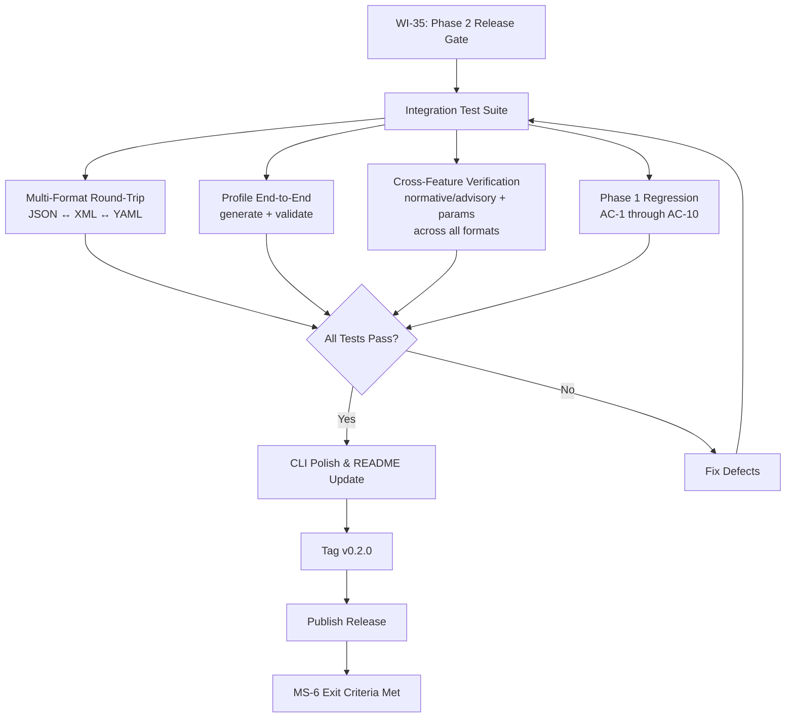
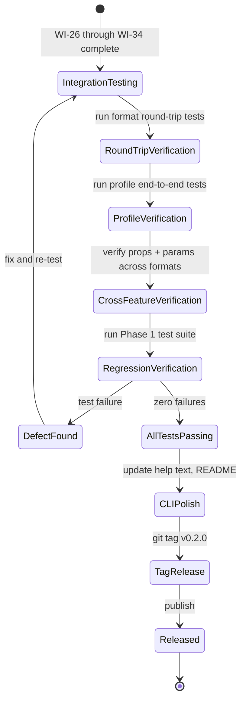
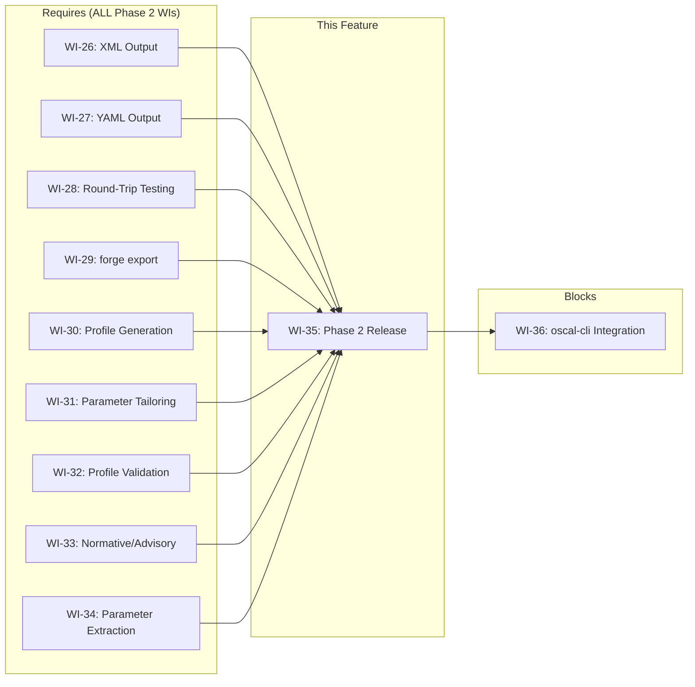

# 035-prd-phase2-release

> **Document Type:** Product Requirements Document
> **Audience:** LLM agents, human reviewers
> **Status:** Released
> **Last Updated:** 2026-02-10 <!-- @auto -->
> **Owner:** Brian Luby <!-- @human-required -->

**Feature Branch**: `035-prd-phase2-release`
**Created**: 2026-02-10
**Status**: Released
**Input**: Derived from FORGE Product Roadmap WI-35

---

## Review Tier Legend

| Marker | Tier | Speckit Behavior |
|--------|------|------------------|
| 🔴 `@human-required` | Human Generated | Prompt human to author; blocks until complete |
| 🟡 `@human-review` | LLM + Human Review | LLM drafts → prompt human to confirm/edit; blocks until confirmed |
| 🟢 `@llm-autonomous` | LLM Autonomous | LLM completes; no prompt; logged for audit |
| ⚪ `@auto` | Auto-generated | System fills (timestamps, links); no prompt |

---

## Document Completion Order

> ⚠️ **For LLM Agents:** Complete sections in this order. Do not fill downstream sections until upstream human-required inputs exist.

1. **Context** (Background, Scope) → requires human input first
2. **Problem Statement & User Scenarios** → requires human input
3. **Requirements** (Must/Should/Could/Won't) → requires human input
4. **Technical Constraints** → human review
5. **Diagrams, Data Model, Interface** → LLM can draft after above exist
6. **Acceptance Criteria** → derived from requirements
7. **Everything else** → can proceed

---

## Context

### Background 🔴 `@human-required`
This PRD covers **WI-35: Phase 2 Integration Testing & v0.2.0 Release** from the FORGE Product Roadmap (Sprint S-35, Oct 27–31 2026, Theme T-5: Profile & Tailoring, Milestone MS-6). Phase 2 spans Sprints 26–35 and delivers all Should Have requirements (S-3 through S-8) across two themes: T-4 (Output Format Expansion, Sprints 26–29) and T-5 (Profile & Tailoring, Sprints 30–35). WI-35 is the Phase 2 release gate — the final sprint that performs cross-cutting integration testing across all 10 Phase 2 work items (WI-26 through WI-34), verifies multi-format round-trip fidelity, confirms Profile generation with tailoring, and tags v0.2.0 for release.

Phase 2 work items delivered:
- **WI-26:** XML output via `quick-xml` + schema validation (`--format xml`)
- **WI-27:** YAML output via `serde_yaml` + validation (`--format yaml`)
- **WI-28:** Multi-format round-trip testing (JSON <-> XML <-> YAML equivalence)
- **WI-29:** `forge export` subcommand for cross-format conversion
- **WI-30:** Profile generation (`forge profile` with `--include`/`--exclude`)
- **WI-31:** Profile parameter tailoring (`--set-param`)
- **WI-32:** Profile validation + golden-file tests
- **WI-33:** Normative vs advisory detection (must/shall vs should/may tagging)
- **WI-34:** Parameter extraction (time windows, thresholds as OSCAL `param` elements)

Note: S-1 (PDF input) and S-2 (DOCX input) are excluded from Phase 2 per ADR-001 (Markdown-only input constraint). Phase 2 covers S-3 through S-8 only.

### Scope Boundaries 🟡 `@human-review`

**In Scope:**
- Integration testing across all Should Have requirements S-3 through S-8 as delivered by WI-26 through WI-34
- Multi-format round-trip verification: JSON -> XML -> JSON and JSON -> YAML -> JSON semantic equivalence
- Profile generation end-to-end: `forge profile --catalog catalog.json --include <ids> --set-param <id> <value>` producing valid OSCAL Profile
- Verification of normative vs advisory tagging (`prop` annotations) in Catalog and Component Definition output
- Verification of parameter extraction as OSCAL `param` elements in output
- Verification that all Phase 1 functionality (v0.1.0 baseline) remains working (no regressions)
- CLI polish for new subcommands and flags introduced in Phase 2
- Tagging and publishing `v0.2.0`
- Updating CHANGELOG and release notes

**Out of Scope:**
- PDF ingestion (S-1) — excluded per ADR-001
- DOCX ingestion (S-2) — excluded per ADR-001
- New feature development — all features must be complete in WI-26 through WI-34 before WI-35 begins
- oscal-cli integration — deferred to WI-36 (Phase 3)
- Could Have features (C-1 through C-4) — deferred to Phase 3
- Assessment Plan scaffolding — deferred to WI-41 (Phase 3)
- Performance optimization beyond existing benchmarks — already addressed in WI-24

### Glossary 🟡 `@human-review`

| Term | Definition |
|------|------------|
| Round-trip | Converting an OSCAL artifact from one format to another and back, verifying semantic equivalence |
| Semantic equivalence | Two OSCAL documents containing identical logical content regardless of serialization format or element ordering |
| Profile | An OSCAL model that selects and tailors controls from one or more Catalogs for a specific baseline |
| Tailoring | Modifying control parameters or selection in a Profile via `--set-param`, `--include`, or `--exclude` |
| Normative | Language indicating mandatory requirements ("must", "shall") |
| Advisory | Language indicating recommended practices ("should", "may") |
| Release gate | A verification checkpoint that must pass before a version tag is created and published |
| v0.2.0 | The second milestone release of FORGE, containing all Should Have requirements (S-3 through S-8) |
| ADR-001 | Architecture Decision Record constraining FORGE to Markdown-only input; PDF/DOCX support excluded |

### Related Documents ⚪ `@auto`

| Document | Link | Relationship |
|----------|------|--------------|
| Parent PRD | docs/FORGE_PRD.md | Parent requirements (S-3 through S-8, AC-11 through AC-13) |
| Product Roadmap | docs/FORGE_PRODUCT_ROADMAP.md | Sprint S-35, MS-6 context |
| Product Vision | docs/FORGE_PRODUCT_VISION.md | Strategic goal G-2 |
| Constitution | .specify/memory/constitution.md | Technical constraints, ADR-001, quality gates |
| Depends On | docs/PRD/026-prd-xml-output.md | XML serialization (WI-26) |
| Depends On | docs/PRD/027-prd-yaml-output.md | YAML serialization (WI-27) |
| Depends On | docs/PRD/028-prd-round-trip-testing.md | Round-trip verification (WI-28) |
| Depends On | docs/PRD/029-prd-export-subcommand.md | `forge export` subcommand (WI-29) |
| Depends On | docs/PRD/030-prd-profile-generation.md | Profile generation (WI-30) |
| Depends On | docs/PRD/031-prd-profile-parameter-tailoring.md | Parameter tailoring (WI-31) |
| Depends On | docs/PRD/032-prd-profile-validation.md | Profile validation (WI-32) |
| Depends On | docs/PRD/033-prd-normative-advisory-detection.md | Normative/advisory tagging (WI-33) |
| Depends On | docs/PRD/034-prd-parameter-extraction.md | Parameter extraction (WI-34) |
| Blocks | docs/PRD/036-prd-oscal-cli-integration.md | Phase 3 begins (WI-36) |

---

## Problem Statement 🔴 `@human-required`

Phase 2 delivered 10 work items (WI-26 through WI-34) across two themes, each developed and unit-tested independently over 9 sprints. While individual sprints verified their own features, no cross-cutting integration testing has confirmed that all Phase 2 capabilities work together correctly and that Phase 1 functionality (v0.1.0 baseline) has not regressed. Specifically: multi-format output (JSON/XML/YAML) must round-trip with semantic equivalence; Profile generation must work end-to-end with tailoring, parameter setting, and schema validation; normative/advisory tagging and parameter extraction must appear correctly in all output formats; and the `forge export` subcommand must correctly convert between all supported formats. Without this integration testing, v0.2.0 cannot be tagged with confidence that all Should Have requirements (S-3 through S-8) are met. The MS-6 exit criteria — "`forge profile` generates valid Profiles with include/exclude and parameter setting; v0.2.0 tagged" — cannot be satisfied until this verification is complete.

---

## User Scenarios & Testing 🔴 `@human-required`

### User Story 1 — Verify Multi-Format Output Round-Trip (Priority: P1)

A compliance engineer converts a policy to OSCAL in all three formats and confirms they are semantically equivalent.

> As a compliance engineer, I want to convert my policy to OSCAL in JSON, XML, and YAML formats and confirm that converting between formats preserves all content so that I can trust any format for my workflow.

**Why this priority**: Multi-format output (S-3, S-4) is a key Phase 2 deliverable. Round-trip fidelity is the fundamental correctness guarantee for format support.

**Independent Test**: Convert a sample policy to JSON, then use `forge export` to convert to XML and YAML, then convert each back to JSON and compare for semantic equivalence.

**Acceptance Scenarios**:
1. **Given** an OSCAL Catalog in JSON format, **When** converting to XML via `forge export` and back to JSON, **Then** the resulting JSON is semantically equivalent to the original (identical content, ignoring serialization-specific ordering).
2. **Given** an OSCAL Catalog in JSON format, **When** converting to YAML via `forge export` and back to JSON, **Then** the resulting JSON is semantically equivalent to the original.
3. **Given** an OSCAL Component Definition in JSON format, **When** round-tripping through XML and YAML, **Then** semantic equivalence is preserved for both paths.

---

### User Story 2 — End-to-End Profile Generation with Tailoring (Priority: P1)

A compliance engineer generates an OSCAL Profile that selects controls and sets parameters from an existing Catalog.

> As a compliance engineer, I want to run `forge profile --catalog catalog.json --include POL-AC-001,POL-AC-002 --set-param password-length 16` and receive a valid OSCAL Profile so that I can define a tailored baseline for my organization.

**Why this priority**: Profile generation (S-5) with include/exclude and parameter setting is the MS-6 exit criteria. This is the highest-priority verification for this release gate.

**Independent Test**: Generate a Catalog from a sample policy, then generate a Profile selecting specific controls and setting parameters. Validate the Profile against the OSCAL schema.

**Acceptance Scenarios**:
1. **Given** a valid OSCAL Catalog with 10 controls, **When** running `forge profile --catalog catalog.json --include POL-AC-001,POL-AC-002 --format json`, **Then** a valid OSCAL Profile JSON is produced with `imports[].include-controls` referencing the specified control IDs.
2. **Given** a Profile generation with `--set-param password-length 16`, **When** inspecting the output, **Then** the Profile contains a `modify.set-parameters` entry with the specified parameter ID and value.
3. **Given** a generated Profile, **When** running `forge validate` against it, **Then** schema validation passes with zero errors.
4. **Given** Profile generation with `--exclude` instead of `--include`, **When** inspecting the output, **Then** the Profile contains `imports[].exclude-controls` referencing the excluded control IDs.

---

### User Story 3 — Verify Normative/Advisory Tagging Across Formats (Priority: P2)

A compliance engineer confirms that normative and advisory tagging is preserved in all output formats.

> As a compliance engineer, I want to see normative ("must"/"shall") and advisory ("should"/"may") requirements tagged with `prop` annotations in JSON, XML, and YAML output so that I can filter requirements by obligation level regardless of output format.

**Why this priority**: S-7 (normative/advisory detection) must work across all output formats to be useful. Cross-format verification confirms tagging survives serialization.

**Independent Test**: Convert a policy with mixed normative and advisory language to all three formats and verify `prop` annotations are present and correct in each.

**Acceptance Scenarios**:
1. **Given** a policy containing "Systems must enforce MFA" and "Administrators should review logs", **When** converting to JSON, XML, and YAML, **Then** each output contains `prop` annotations with `name: "modality"` and values `"normative"` or `"advisory"` on the corresponding controls.
2. **Given** a round-trip through XML and back to JSON, **When** inspecting the normative/advisory `prop` annotations, **Then** they are preserved identically.

---

### User Story 4 — Verify Parameter Extraction Across Formats (Priority: P2)

A compliance engineer confirms that extracted parameters appear correctly in all output formats.

> As a compliance engineer, I want policy parameters (time windows, thresholds) to appear as OSCAL `param` elements in JSON, XML, and YAML output so that I can manage configurable values in my compliance toolchain regardless of format choice.

**Why this priority**: S-8 (parameter extraction) must be verified across all output formats for completeness.

**Independent Test**: Convert a policy with parameterized requirements to all three formats and verify `param` elements appear correctly in each.

**Acceptance Scenarios**:
1. **Given** a policy containing "Passwords must be changed within 90 days", **When** converting to JSON, XML, and YAML, **Then** each output contains an OSCAL `param` element representing the "90 days" time window with an appropriate value domain.
2. **Given** a round-trip through YAML and back to JSON, **When** inspecting `param` elements, **Then** parameter IDs, values, and constraints are preserved.

---

### User Story 5 — Phase 1 Regression Verification (Priority: P1)

A developer confirms that all Phase 1 (v0.1.0) functionality still works correctly after Phase 2 changes.

> As a developer working on FORGE, I want to verify that all Phase 1 acceptance criteria (AC-1 through AC-10) still pass after Phase 2 development so that I can confirm v0.2.0 is a strict superset of v0.1.0 with no regressions.

**Why this priority**: A release that breaks existing functionality is unacceptable. Regression testing is a non-negotiable gate for any version tag.

**Independent Test**: Run the full Phase 1 test suite and verify all tests pass. Run `forge convert` with Catalog and Component Definition strategies and verify output matches v0.1.0 golden files.

**Acceptance Scenarios**:
1. **Given** the complete Phase 1 test suite, **When** running `cargo test`, **Then** all Phase 1 tests pass with zero failures.
2. **Given** a sample Markdown policy, **When** running `forge convert policy.md --strategy catalog --format json`, **Then** the output matches the Phase 1 golden-file baseline (or differs only in expected additive ways such as new `prop` annotations from S-7/S-8).

---

### User Story 6 — Tag and Publish v0.2.0 (Priority: P1)

A developer tags the v0.2.0 release after all integration tests pass.

> As a developer working on FORGE, I want to tag v0.2.0 in the repository after all Phase 2 exit criteria are met so that there is a clear, reproducible release marker for the Phase 2 milestone.

**Why this priority**: The version tag is the MS-6 deliverable. Without it, the milestone is not formally complete.

**Independent Test**: Verify the `v0.2.0` git tag exists, points to a commit where all tests pass, and `forge --version` reports `0.2.0`.

**Acceptance Scenarios**:
1. **Given** all integration tests passing, **When** creating the `v0.2.0` git tag, **Then** the tag is created on a commit where `cargo test` passes with zero failures and `cargo clippy -- -D warnings` reports zero warnings.
2. **Given** the tagged release, **When** running `forge --version`, **Then** the output includes `0.2.0`.

---

## Assumptions & Risks 🟡 `@human-review`

### Assumptions
- [A-1] All Phase 2 work items (WI-26 through WI-34) are complete and their unit tests passing before WI-35 begins.
- [A-2] Phase 1 golden-file test suite (WI-21, WI-22) provides a baseline for regression detection.
- [A-3] Schema validation (WI-19) is available to validate generated Profiles against OSCAL v1.2.0 schemas.
- [A-4] The `forge export` subcommand (WI-29) supports conversion between all three formats (JSON, XML, YAML).
- [A-5] Round-trip test infrastructure from WI-28 can be reused for integration-level round-trip verification.

### Risks
| ID | Risk | Likelihood | Impact | Mitigation |
|----|------|------------|--------|------------|
| R-1 | Integration of 10 Phase 2 work items reveals interface mismatches or serialization inconsistencies between formats | Med | Med | Each WI was tested independently; integration tests catch boundary issues early in the sprint |
| R-2 | Normative/advisory `prop` annotations or `param` elements are lost during format conversion (XML/YAML serialization does not preserve them) | Low | High | Round-trip tests from WI-28 should catch this; add specific prop/param round-trip assertions |
| R-3 | Phase 2 changes introduce regressions in Phase 1 functionality | Low | High | Full Phase 1 test suite and golden-file comparisons run as part of integration testing |
| R-4 | Profile generation with complex tailoring (multiple includes, excludes, and set-params) produces invalid OSCAL | Med | Med | Schema validation (WI-19) runs against all generated Profiles; golden-file tests from WI-32 cover edge cases |
| R-5 | Release tagging is delayed because a blocking defect is found during integration testing | Med | Low | Sprint has 5 days; defect fixes take priority over polish work; can slip to a patch release if needed |

---

## Feature Overview

### Flow Diagram 🟡 `@human-review`



### State Diagram (if applicable) 🟡 `@human-review`



---

## Requirements

### Must Have (M) — MVP, launch blockers 🔴 `@human-required`
- [ ] **M-1:** Multi-format round-trip tests shall pass for JSON -> XML -> JSON and JSON -> YAML -> JSON conversions, confirming semantic equivalence for both Catalog and Component Definition artifacts. *(Traces to: Parent PRD S-3, S-4)*
- [ ] **M-2:** An end-to-end test shall verify `forge profile --catalog <path> --include <ids> --format json` produces a valid OSCAL Profile JSON with correct `imports[].include-controls`. *(Traces to: Parent PRD S-5, AC-12)*
- [ ] **M-3:** An end-to-end test shall verify `forge profile --catalog <path> --set-param <id> <value>` produces a Profile with correct `modify.set-parameters` entries. *(Traces to: Parent PRD S-5, AC-12)*
- [ ] **M-4:** Generated Profiles shall pass schema validation against OSCAL v1.2.0 Profile schemas via `forge validate`. *(Traces to: Parent PRD S-5)*
- [ ] **M-5:** Normative/advisory `prop` annotations (S-7) and `param` elements (S-8) shall be present and correct in JSON, XML, and YAML output, and shall survive format round-trips. *(Traces to: Parent PRD S-7, S-8, AC-13)*
- [ ] **M-6:** All Phase 1 tests shall pass with zero failures, confirming no regressions from Phase 2 development. *(Traces to: Parent PRD AC-1 through AC-10)*
- [ ] **M-7:** The `v0.2.0` git tag shall be created on a commit where `cargo test` passes, `cargo clippy -- -D warnings` reports zero warnings, and `cargo fmt --check` reports zero violations. *(Traces to: MS-6 exit criteria)*
- [ ] **M-8:** `forge --version` shall report version `0.2.0` in the tagged release. *(Traces to: MS-6 exit criteria)*

### Should Have (S) — High value, not blocking 🔴 `@human-required`
- [ ] **S-1:** Integration tests shall cover Profile generation with `--exclude` (not just `--include`) to verify both selection modes.
- [ ] **S-2:** Integration tests shall cover Profile generation in XML and YAML formats (not just JSON) to verify multi-format Profile output.
- [ ] **S-3:** CHANGELOG shall be updated with a summary of all Phase 2 features for the v0.2.0 release.
- [ ] **S-4:** `--help` text for `forge profile`, `forge export`, and new flags introduced in Phase 2 shall be reviewed for clarity and completeness.

### Could Have (C) — Nice to have, if time permits 🟡 `@human-review`
- [ ] **C-1:** A release checklist document enumerating all verification steps performed before tagging v0.2.0.
- [ ] **C-2:** Automated smoke test comparing v0.2.0 output against v0.1.0 output for the same sample policy, documenting expected differences.

### Won't Have (W) — Explicitly deferred 🟡 `@human-review`
- [ ] **W-1:** PDF ingestion (S-1) — *Reason: Excluded per ADR-001; Markdown-only input*
- [ ] **W-2:** DOCX ingestion (S-2) — *Reason: Excluded per ADR-001; Markdown-only input*
- [ ] **W-3:** oscal-cli integration — *Reason: Deferred to WI-36 (Phase 3)*
- [ ] **W-4:** Could Have features (C-1 through C-4 from parent PRD) — *Reason: Deferred to Phase 3*
- [ ] **W-5:** New feature development — *Reason: WI-35 is integration testing and release only; no new features*

---

## Technical Constraints 🟡 `@human-review`

- **Language/Framework:** Rust (latest stable), Cargo build system
- **CLI Framework:** clap 4.x (established in WI-1)
- **Serialization:** `serde` + `serde_json` (JSON), `quick-xml` (XML, WI-26), `serde_yaml` (YAML, WI-27)
- **OSCAL Version:** All output targets OSCAL v1.2.0 structure
- **Schema Validation:** `forge validate` using OSCAL v1.2.0 schemas (WI-19)
- **Error Handling:** `thiserror` for error types; all errors propagate cleanly via `Result<T, ForgeError>`
- **Linting:** `cargo clippy -- -D warnings` must pass — zero warnings required for release tag
- **Formatting:** `cargo fmt --check` must produce no changes — required for release tag
- **Testing:** TDD mandatory; `cargo test` must pass with zero failures for release tag
- **Version:** `Cargo.toml` version field must be set to `0.2.0` before tagging
- **Git:** Release tag must follow `v0.2.0` naming convention

---

## Data Model (if applicable) 🟡 `@human-review`

N/A — No new data model introduced in this work item. WI-35 is an integration testing and release sprint that verifies data models established in WI-26 through WI-34. All data models used in testing (Catalog, Component Definition, Profile, `prop` annotations, `param` elements) are defined in their respective upstream WIs.

---

## Interface Contract (if applicable) 🟡 `@human-review`

```rust
// No new interfaces introduced in WI-35.
// This work item tests existing interfaces from WI-26 through WI-34:

// Multi-format output (WI-26, WI-27):
// forge convert policy.md --strategy catalog --format json|xml|yaml [--output <path>]
// forge convert policy.md --strategy component --format json|xml|yaml [--output <path>]

// Format conversion (WI-29):
// forge export artifact.json --format xml|yaml [--output <path>]
// forge export artifact.xml --format json|yaml [--output <path>]
// forge export artifact.yaml --format json|xml [--output <path>]

// Profile generation (WI-30, WI-31):
// forge profile --catalog <path> --include <ids> [--exclude <ids>] [--set-param <id> <value>]... --format json|xml|yaml [--output <path>]

// Validation (WI-19):
// forge validate <artifact-path>

// Version:
// forge --version  → "forge 0.2.0"
```

---

## Evaluation Criteria 🟡 `@human-review`

| Criterion | Weight | Metric | Target | Notes |
|-----------|--------|--------|--------|-------|
| Round-Trip Fidelity | Critical | JSON <-> XML <-> YAML semantic equivalence | 100% equivalence for Catalog and Component Definition | MS-5 exit criteria verified |
| Profile Generation | Critical | `forge profile` produces valid OSCAL Profile | Schema validation passes; include/exclude/set-param all work | MS-6 exit criteria |
| Normative/Advisory Tagging | High | `prop` annotations present in all formats | Correct modality values survive round-trip | S-7 verified |
| Parameter Extraction | High | `param` elements present in all formats | Parameters survive round-trip | S-8 verified |
| Phase 1 Regression | Critical | All Phase 1 tests pass | Zero failures | No regressions from Phase 2 |
| Release Tag | Critical | `v0.2.0` tag on passing commit | All quality gates green | MS-6 deliverable |

---

## Tool/Approach Candidates 🟡 `@human-review`

| Option | License | Pros | Cons | Spike Result |
|--------|---------|------|------|--------------|
| cargo test (integration tests) | N/A | Standard Rust test framework; already in use | None | Selected: consistent with project conventions |
| Golden-file comparison | N/A | Catches unexpected output changes; established in WI-21/WI-22/WI-32 | Requires updating golden files for expected changes | Selected: reuse existing golden-file infrastructure |
| Schema validation via forge validate | N/A | Tests the validation pipeline itself while validating artifacts | Depends on WI-19 working correctly | Selected: dogfooding own tools |

### Selected Approach 🔴 `@human-required`
> **Decision:** Use `cargo test` with integration test modules for cross-cutting verification; reuse golden-file infrastructure from WI-21/WI-22/WI-32; validate all generated artifacts via `forge validate`. Tag v0.2.0 after all tests pass and quality gates are green.
> **Rationale:** All testing infrastructure already exists from prior WIs. The integration tests add cross-cutting scenarios that exercise multiple features together, while golden-file comparisons and schema validation provide high-confidence correctness checks. No new tooling is needed.

---

## Acceptance Criteria 🟡 `@human-review`

| AC ID | Requirement | User Story | Given | When | Then |
|-------|-------------|------------|-------|------|------|
| AC-1 | M-1 | US-1 | An OSCAL Catalog JSON produced by `forge convert` | Converting to XML via `forge export` and back to JSON | The result is semantically equivalent to the original |
| AC-2 | M-1 | US-1 | An OSCAL Catalog JSON produced by `forge convert` | Converting to YAML via `forge export` and back to JSON | The result is semantically equivalent to the original |
| AC-3 | M-2 | US-2 | A valid OSCAL Catalog with 10 controls | Running `forge profile --catalog catalog.json --include POL-AC-001,POL-AC-002 --format json` | A valid OSCAL Profile JSON with `imports[].include-controls` referencing POL-AC-001 and POL-AC-002 |
| AC-4 | M-3 | US-2 | A valid OSCAL Catalog with parameterized controls | Running `forge profile --catalog catalog.json --include POL-AC-001 --set-param password-length 16 --format json` | Profile contains `modify.set-parameters` with `password-length` set to `16` |
| AC-5 | M-4 | US-2 | A generated OSCAL Profile | Running `forge validate profile.json` | Schema validation passes with zero errors |
| AC-6 | M-5 | US-3 | A policy with normative ("must") and advisory ("should") language | Converting to JSON, XML, and YAML | Each format contains `prop` with `name: "modality"` and correct values |
| AC-7 | M-5 | US-4 | A policy with parameterized requirements ("within 90 days") | Converting to JSON, XML, and YAML | Each format contains `param` elements with correct values |
| AC-8 | M-5 | US-3, US-4 | OSCAL output with `prop` and `param` elements in JSON | Round-tripping through XML and YAML | `prop` annotations and `param` elements are preserved |
| AC-9 | M-6 | US-5 | The complete Phase 1 and Phase 2 test suites | Running `cargo test` | All tests pass with zero failures |
| AC-10 | M-7, M-8 | US-6 | All tests passing and quality gates green | Creating `v0.2.0` git tag and running `forge --version` | Tag exists; version reports `0.2.0`; CI passes |

### Edge Cases 🟢 `@llm-autonomous`
- [ ] **EC-1:** (M-1) When round-tripping a Catalog with empty groups (no controls), then semantic equivalence is still maintained across JSON, XML, and YAML.
- [ ] **EC-2:** (M-2) When generating a Profile with `--include` specifying a control ID that does not exist in the Catalog, then a descriptive error is produced.
- [ ] **EC-3:** (M-3) When using `--set-param` with a parameter ID that does not exist in the Catalog, then a descriptive error or warning is produced.
- [ ] **EC-4:** (M-5) When a control has both normative and advisory sub-statements (from atomization), then each resulting control has the correct individual `prop` annotation.
- [ ] **EC-5:** (M-1) When round-tripping a Component Definition (not just Catalog) through XML and YAML, then semantic equivalence is maintained.
- [ ] **EC-6:** (M-2) When generating a Profile with both `--include` and `--exclude` flags, then the behavior is well-defined (include takes precedence, or error, per WI-30 design).
- [ ] **EC-7:** (M-6) When Phase 2 introduces additive changes to output (e.g., new `prop` annotations), then Phase 1 golden-file tests account for expected additive differences.

---

## Dependencies 🟡 `@human-review`



- **Requires:** WI-26 (XML Output), WI-27 (YAML Output), WI-28 (Round-Trip Testing), WI-29 (`forge export`), WI-30 (Profile Generation), WI-31 (Parameter Tailoring), WI-32 (Profile Validation), WI-33 (Normative/Advisory Detection), WI-34 (Parameter Extraction) — and transitively all Phase 1 work items (WI-1 through WI-25)
- **Blocks:** WI-36 (oscal-cli Integration — Phase 3 begins)
- **External:** OSCAL v1.2.0 JSON/XML schemas for validation (already available from WI-19)

---

## Security Considerations 🟡 `@human-review`

| Aspect | Assessment | Notes |
|--------|------------|-------|
| Internet Exposure | No | CLI tool, no network services |
| Sensitive Data | Yes | Integration tests process policy document content which may contain sensitive operational details |
| Authentication Required | No | Local CLI tool |
| Security Review Required | No | WI-35 introduces no new code beyond integration tests; all functionality was implemented and reviewed in WI-26 through WI-34 |

Additional security notes:
- Integration test fixtures should use synthetic policy content, not real organizational policies.
- The v0.2.0 release tag should be created on a verified commit (all CI checks passing) to ensure no untested code is released.

---

## Implementation Guidance 🟢 `@llm-autonomous`

### Suggested Approach
Organize integration tests in a dedicated `tests/` directory (or extend the existing integration test modules). Create test functions that exercise cross-cutting scenarios:

1. **Round-trip tests**: Generate a Catalog and Component Definition in JSON, convert to XML via `forge export`, convert back to JSON, and assert semantic equivalence using deserialized comparison (ignoring serialization-specific ordering). Repeat for YAML.

2. **Profile end-to-end tests**: Generate a Catalog from a sample policy, then generate Profiles with various `--include`, `--exclude`, and `--set-param` combinations. Validate each Profile via `forge validate`. Compare against golden files from WI-32.

3. **Cross-feature tests**: Generate output with normative/advisory tagging and parameter extraction, then verify `prop` and `param` elements are present in JSON, XML, and YAML. Round-trip and verify preservation.

4. **Regression tests**: Run the full existing test suite (`cargo test`). Compare key outputs against Phase 1 golden files, noting expected additive differences (new `prop`/`param` elements from S-7/S-8).

5. **Release prep**: Update `Cargo.toml` version to `0.2.0`. Update CHANGELOG. Review and polish `--help` text. Create git tag after all tests pass.

### Anti-patterns to Avoid
- Skipping regression testing because "Phase 1 tests still pass in CI" — integration-level regressions may not be caught by unit tests
- Testing only JSON output and assuming XML/YAML work by extension — each serialization format has its own edge cases
- Hard-coding test expectations to specific serialization ordering — use deserialized comparison for semantic equivalence
- Tagging the release before all quality gates pass — the tag must point to a fully verified commit
- Creating new feature code during the release sprint — all features must be complete in WI-26 through WI-34

### Reference Examples
- WI-25 (Phase 1 release) follows the same pattern: integration testing across all Must Have requirements, regression verification, and version tagging
- WI-28 (Round-trip testing) provides the infrastructure for format equivalence checks
- WI-32 (Profile validation) provides golden-file tests and schema validation patterns

---

## Spike Tasks 🟡 `@human-review`

N/A — No spike tasks for this work item. All technical decisions have been made in prior WIs. This is a pure integration testing and release sprint.

---

## Success Metrics 🔴 `@human-required`

| Metric | Baseline | Target | Measurement Method |
|--------|----------|--------|-------------------|
| Multi-format round-trip fidelity | WI-28 tests pass individually | 100% semantic equivalence for Catalog and Component Definition across JSON/XML/YAML | Integration test assertions |
| Profile generation end-to-end | WI-30/WI-31/WI-32 tests pass individually | `forge profile` with include/exclude/set-param produces valid OSCAL Profile | Schema validation + golden-file comparison |
| Phase 1 regression | v0.1.0 all tests passing | Zero test failures after Phase 2 changes | `cargo test` (full suite) |
| Should Have coverage | S-3 through S-8 implemented individually | All S-requirements verified working together in integration | Integration test suite |
| Release tagged | No v0.2.0 tag | `v0.2.0` tag on verified commit | `git tag -l v0.2.0` + CI verification |

### Technical Verification 🟢 `@llm-autonomous`
| Metric | Target | Verification Method |
|--------|--------|---------------------|
| All tests pass | 0 failures | `cargo test` |
| No clippy warnings | 0 | `cargo clippy -- -D warnings` |
| No formatting violations | 0 | `cargo fmt --check` |
| Round-trip equivalence | 100% | Deserialized comparison in integration tests |
| Profile schema validation | 0 errors | `forge validate` on all generated Profiles |
| Phase 1 golden-file match | 100% (accounting for expected additive changes) | Golden-file comparison tests |

---

## Definition of Ready 🔴 `@human-required`

### Readiness Checklist
- [x] Problem statement reviewed and validated by stakeholder
- [x] All Must Have requirements have acceptance criteria
- [x] Technical constraints are explicit and agreed
- [x] Dependencies identified and owners confirmed
- [x] Security review completed (or N/A documented with justification)
- [x] No open questions blocking implementation

### Sign-off
| Role | Name | Date | Decision |
|------|------|------|----------|
| Product Owner | Brian Luby | YYYY-MM-DD | [Ready / Not Ready] |

---

## Changelog ⚪ `@auto`

| Version | Date | Author | Changes |
|---------|------|--------|---------|
| 0.1 | 2026-02-10 | LLM (Claude) | Initial draft derived from FORGE Product Roadmap WI-35 |

---

## Decision Log 🟡 `@human-review`

| Date | Decision | Rationale | Alternatives Considered |
|------|----------|-----------|------------------------|
| 2026-02-10 | S-1 (PDF) and S-2 (DOCX) excluded from Phase 2 verification per ADR-001 | FORGE is Markdown-only input; PDF/DOCX support was removed from the roadmap; Phase 2 covers S-3 through S-8 only | Include PDF/DOCX testing (not applicable — features do not exist) |
| 2026-02-10 | Reuse existing test infrastructure from WI-28 and WI-32 rather than building new integration test framework | Round-trip and golden-file infrastructure already exists and is tested; adding cross-cutting test scenarios to existing modules is more efficient | Build dedicated integration test harness (over-engineering for a 1-week sprint) |
| 2026-02-10 | Tag v0.2.0 only after all quality gates pass (tests, clippy, fmt) | Ensures the release tag represents a fully verified state; matches the pattern established by v0.1.0 in WI-25 | Tag first and fix later (risks shipping broken code) |

---

## Open Questions 🟡 `@human-review`

No open questions for this work item.

---

## Review Checklist 🟢 `@llm-autonomous`

Before marking as Approved:
- [x] All requirements have unique IDs (M-1 through M-8, S-1 through S-4, C-1 through C-2, W-1 through W-5)
- [x] All Must Have requirements have linked acceptance criteria
- [x] User stories are prioritized and independently testable
- [x] Acceptance criteria reference both requirement IDs and user stories
- [x] Glossary terms are used consistently throughout
- [x] Diagrams use terminology from Glossary
- [x] Security considerations documented
- [x] Definition of Ready checklist is complete
- [x] No open questions blocking implementation
