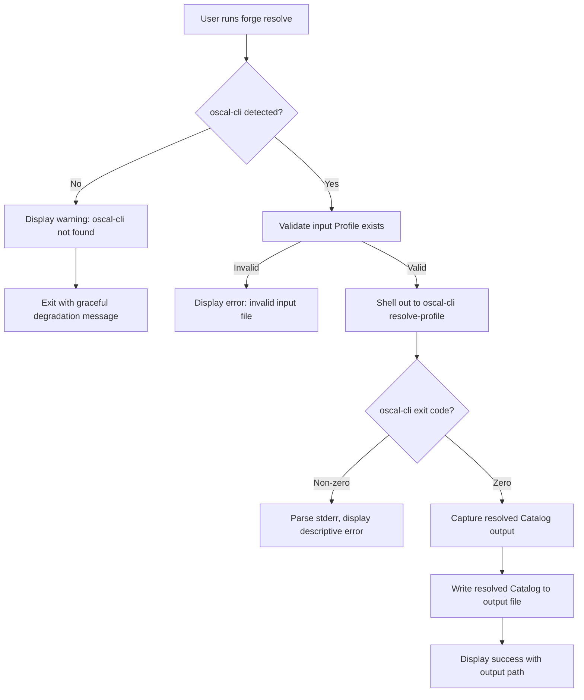
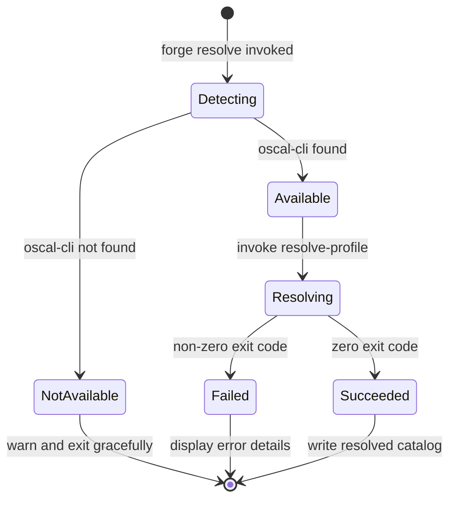
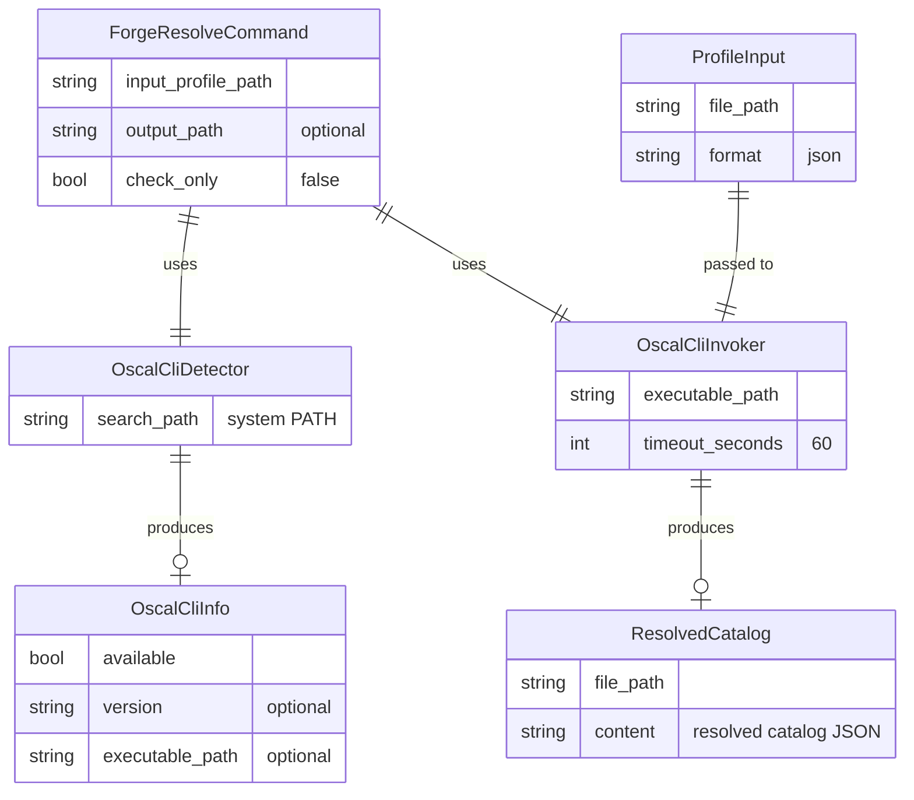
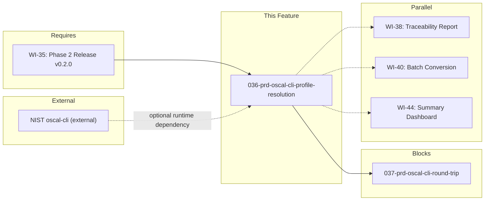

# 036-prd-oscal-cli-profile-resolution

> **Document Type:** Product Requirements Document
> **Audience:** LLM agents, human reviewers
> **Status:** Draft
> **Last Updated:** 2026-02-10 <!-- @auto -->
> **Owner:** Brian Luby <!-- @human-required -->

**Feature Branch**: `036-oscal-cli-profile-resolution`
**Created**: 2026-02-10
**Status**: Draft
**Input**: Derived from FORGE Product Roadmap WI-36

---

## Review Tier Legend

| Marker | Tier | Speckit Behavior |
|--------|------|------------------|
| 🔴 `@human-required` | Human Generated | Prompt human to author; blocks until complete |
| 🟡 `@human-review` | LLM + Human Review | LLM drafts → prompt human to confirm/edit; blocks until confirmed |
| 🟢 `@llm-autonomous` | LLM Autonomous | LLM completes; no prompt; logged for audit |
| ⚪ `@auto` | Auto-generated | System fills (timestamps, links); no prompt |

---

## Document Completion Order

> ⚠️ **For LLM Agents:** Complete sections in this order. Do not fill downstream sections until upstream human-required inputs exist.

1. **Context** (Background, Scope) → requires human input first
2. **Problem Statement & User Scenarios** → requires human input
3. **Requirements** (Must/Should/Could/Won't) → requires human input
4. **Technical Constraints** → human review
5. **Diagrams, Data Model, Interface** → LLM can draft after above exist
6. **Acceptance Criteria** → derived from requirements
7. **Everything else** → can proceed

---

## Context

### Background 🔴 `@human-required`
This PRD covers **WI-36: oscal-cli Integration — Profile Resolution Delegation** from the FORGE Product Roadmap (Sprint S-36, Nov 3–7 2026, Theme T-6: Ecosystem & Community, Milestone MS-7). FORGE generates OSCAL Profiles (WI-30 through WI-34 in Phase 2), but Profile Resolution — the NIST-defined algorithm that processes import → merge → modify directives to produce a resolved catalog baseline — is explicitly deferred from native implementation (Parent PRD W-3: "Built-in Profile Resolution engine — Reason: Delegates to NIST oscal-cli; building a conformant resolver is a major effort better addressed later"). Rather than implementing this complex algorithm natively, FORGE delegates Profile Resolution to NIST's official `oscal-cli` tool by shelling out to `oscal-cli resolve-profile`. This work item establishes the integration layer: detecting whether oscal-cli is installed, invoking it with the correct arguments, parsing its output, and handling the case where oscal-cli is not available (graceful degradation). This is the first work item in Phase 3 (Exploratory confidence) and the first integration point with external NIST tooling.

### Scope Boundaries 🟡 `@human-review`

**In Scope:**
- Detecting whether `oscal-cli` is installed and available on the system PATH
- Shelling out to `oscal-cli resolve-profile` to resolve a FORGE-generated Profile into a resolved Catalog
- Capturing and parsing the resolved Catalog output from oscal-cli
- Graceful degradation when oscal-cli is not installed (clear warning message, skip resolution, return unresolved Profile)
- A `forge resolve` subcommand (or `--resolve` flag on the profile workflow) that triggers profile resolution via oscal-cli
- Reporting oscal-cli version information for diagnostics
- Handling oscal-cli execution errors (non-zero exit code, stderr output) with descriptive error messages

**Out of Scope:**
- Native (built-in) Profile Resolution engine — explicitly deferred per Parent PRD W-3
- Round-trip validation via oscal-cli (JSON→XML→JSON) — deferred to WI-37 (037-prd-oscal-cli-round-trip)
- Installing or bundling oscal-cli with FORGE — users must install oscal-cli independently
- Profile generation logic (import/merge/modify directives) — completed in WI-30 through WI-34
- Batch resolution of multiple profiles — deferred to WI-40 (batch conversion)
- Caching of resolved catalogs — deferred to future optimization work

### Glossary 🟡 `@human-review`

| Term | Definition |
|------|------------|
| oscal-cli | NIST's official command-line tool for OSCAL operations including validation, conversion, and profile resolution |
| Profile Resolution | The NIST-defined algorithm (import → merge → modify) that processes an OSCAL Profile to produce a resolved Catalog containing the selected and tailored controls |
| Resolved Catalog | The output of Profile Resolution: a flat Catalog containing only the controls selected and modified by the Profile |
| Graceful Degradation | The ability to continue operating with reduced functionality when an optional dependency (oscal-cli) is unavailable |
| Shell Out | Invoking an external process (oscal-cli) from within FORGE using OS-level process execution |
| Profile | An OSCAL model that selects and tailors controls from one or more Catalogs via import, merge, and modify directives |
| Catalog | An OSCAL model containing a structured collection of security controls and control enhancements |

### Related Documents ⚪ `@auto`

| Document | Link | Relationship |
|----------|------|--------------|
| Parent PRD | docs/FORGE_PRD.md | Parent requirement W-3 (deferred Profile Resolution engine) |
| Product Roadmap | docs/FORGE_PRODUCT_ROADMAP.md | Sprint S-36 context |
| OSCAL Research | docs/research/OSCAL_Research.md | Profile Resolution guidance and oscal-cli capabilities |
| Product Vision | docs/FORGE_PRODUCT_VISION.md | Strategic goal G-3 (Community Adoption), G-4 (Implementation Layer) |
| Constitution | .specify/memory/constitution.md | Technical constraints and quality gates |
| Depends On | docs/FORGE_PRODUCT_ROADMAP.md | WI-35 (Phase 2 release) |
| Blocks | docs/PRD/ | WI-37 (oscal-cli round-trip validation) |

---

## Problem Statement 🔴 `@human-required`

FORGE generates OSCAL Profiles (WI-30 through WI-34) with import, merge, and modify directives, but cannot resolve those Profiles into flat Catalog baselines. Profile Resolution is the canonical NIST algorithm that processes a Profile's directives to produce a resolved Catalog — the actual set of controls an organization uses for compliance. Without resolution capability, users must manually run a separate tool to obtain their resolved baseline, breaking the workflow continuity. Building a conformant Profile Resolution engine is a major engineering effort (the algorithm involves recursive import processing, merge conflict resolution, and modify directive application across potentially nested profile chains). NIST already provides this capability through oscal-cli. By delegating to oscal-cli, FORGE gains authoritative, NIST-conformant resolution without reimplementing a complex algorithm, while maintaining the CLI-composable philosophy (Product Vision principle P-4). However, the integration must handle the case where oscal-cli is not installed, since it is an optional external dependency (Roadmap risk D-9), providing a clear degradation path rather than a hard failure.

---

## User Scenarios & Testing 🔴 `@human-required`

### User Story 1 — Resolve a Profile via oscal-cli (Priority: P1)

A compliance engineer generates an OSCAL Profile with FORGE and wants to resolve it into a flat Catalog baseline using oscal-cli.

> As a compliance engineer, I want FORGE to resolve my generated Profile into a resolved Catalog using oscal-cli so that I can obtain the final tailored baseline without manually running a separate tool.

**Why this priority**: This is the core function of WI-36. Profile Resolution is the critical step between generating a Profile and using it for downstream compliance workflows. Without this integration, users must break out of FORGE to run oscal-cli manually.

**Independent Test**: Generate a Profile with FORGE, run `forge resolve <profile.json>`, and verify that a resolved Catalog JSON file is produced containing only the selected and tailored controls.

**Acceptance Scenarios**:
1. **Given** a valid FORGE-generated Profile JSON and oscal-cli installed, **When** running `forge resolve profile.json`, **Then** a resolved Catalog JSON is produced containing the controls selected by the Profile's import directives.
2. **Given** a Profile that imports controls from a Catalog and applies modify directives, **When** resolving via `forge resolve`, **Then** the resolved Catalog reflects the modifications (e.g., parameter values set, control additions applied).

---

### User Story 2 — Graceful Degradation Without oscal-cli (Priority: P1)

A developer or compliance engineer runs FORGE on a system where oscal-cli is not installed.

> As a FORGE user on a system without oscal-cli installed, I want FORGE to warn me that profile resolution is unavailable and continue operating without crashing, so that I can still use all other FORGE features.

**Why this priority**: oscal-cli is an external dependency that FORGE does not control (Roadmap risk D-9). Users may not have it installed. A hard failure would break the entire FORGE experience for a feature that is optional to the core conversion pipeline.

**Independent Test**: Remove oscal-cli from the PATH, run `forge resolve profile.json`, and verify a descriptive warning is displayed explaining that oscal-cli is not installed and resolution was skipped.

**Acceptance Scenarios**:
1. **Given** oscal-cli is not installed or not on PATH, **When** running `forge resolve profile.json`, **Then** a warning message is displayed indicating oscal-cli is not found and profile resolution is unavailable, and the command exits with a non-zero but non-panic exit code.
2. **Given** oscal-cli is not installed, **When** running any other FORGE command (e.g., `forge convert`), **Then** no warning about oscal-cli is displayed and the command operates normally.

---

### User Story 3 — Diagnostic oscal-cli Information (Priority: P2)

A developer troubleshooting FORGE wants to verify the oscal-cli integration status and version.

> As a developer working on FORGE, I want to check whether oscal-cli is detected and what version is available so that I can diagnose integration issues.

**Why this priority**: Diagnostic capability is essential for troubleshooting integration issues, especially since oscal-cli is an external dependency with its own versioning.

**Independent Test**: Run `forge resolve --check` and verify it prints the oscal-cli detection status and version (or "not found" message).

**Acceptance Scenarios**:
1. **Given** oscal-cli is installed, **When** running `forge resolve --check`, **Then** the output displays the oscal-cli version and path.
2. **Given** oscal-cli is not installed, **When** running `forge resolve --check`, **Then** the output displays a message indicating oscal-cli was not found with installation guidance.

---

### User Story 4 — Handle oscal-cli Execution Errors (Priority: P1)

A user runs profile resolution but oscal-cli encounters an error (e.g., invalid Profile input, unsupported OSCAL version).

> As a compliance engineer, I want FORGE to display clear error messages when oscal-cli fails during profile resolution so that I can understand and fix the issue without interpreting raw stderr output.

**Why this priority**: oscal-cli error output can be verbose and Java-stack-trace heavy. FORGE must translate these into actionable user-facing messages.

**Independent Test**: Provide an invalid Profile JSON to `forge resolve`, and verify that FORGE displays a clear error message including the relevant oscal-cli error detail.

**Acceptance Scenarios**:
1. **Given** an invalid Profile JSON file, **When** running `forge resolve invalid-profile.json`, **Then** a descriptive error is displayed indicating the Profile is invalid, including relevant detail from oscal-cli stderr.
2. **Given** oscal-cli exits with a non-zero exit code, **When** FORGE captures the result, **Then** the exit code and a summary of the error are included in FORGE's error output.

---

## Assumptions & Risks 🟡 `@human-review`

### Assumptions
- [A-1] NIST oscal-cli is available as a standalone executable that can be invoked via the system PATH (e.g., installed via Homebrew, direct download, or package manager).
- [A-2] oscal-cli supports the `resolve-profile` subcommand with file path input and JSON output.
- [A-3] WI-35 (Phase 2 release, v0.2.0) is complete, meaning FORGE can generate valid OSCAL Profiles that oscal-cli can process.
- [A-4] oscal-cli outputs resolved Catalog JSON to stdout or a specified output file.
- [A-5] The oscal-cli `resolve-profile` command operates synchronously and completes within a reasonable time for typical Profiles (< 30 seconds).
- [A-6] oscal-cli uses OSCAL v1.2.0 or a compatible version that aligns with FORGE's target OSCAL version.

### Risks
| ID | Risk | Likelihood | Impact | Mitigation |
|----|------|------------|--------|------------|
| R-1 | NIST oscal-cli is unavailable or discontinued | Low | High | Graceful degradation (M-4); document manual resolution workflow; monitor NIST releases. Corresponds to Roadmap risk D-9. |
| R-2 | oscal-cli resolve-profile CLI interface changes between versions | Med | Med | Pin to a known-compatible version range; detect version at runtime and warn on untested versions |
| R-3 | oscal-cli produces output in an unexpected format or OSCAL version | Low | Med | Validate resolved Catalog output structure before returning to user; fail with descriptive error if unexpected |
| R-4 | oscal-cli execution is slow for large Profiles with many imports | Low | Low | Set a configurable timeout; display progress indication; document performance expectations |
| R-5 | oscal-cli requires Java runtime which may not be installed | Med | Med | Detect Java availability as part of oscal-cli detection; include Java requirement in user-facing messages |

---

## Feature Overview

### Flow Diagram 🟡 `@human-review`



### State Diagram (if applicable) 🟡 `@human-review`



---

## Requirements

### Must Have (M) — MVP, launch blockers 🔴 `@human-required`
- [ ] **M-1:** FORGE shall detect whether `oscal-cli` is installed and available on the system PATH. *(Traces to: Parent PRD W-3, Roadmap D-9)*
- [ ] **M-2:** FORGE shall invoke `oscal-cli resolve-profile` to resolve a given OSCAL Profile into a resolved Catalog. *(Traces to: Parent PRD W-3)*
- [ ] **M-3:** FORGE shall capture the resolved Catalog output from oscal-cli and write it to a specified output file (or a default path derived from the input filename). *(Traces to: Parent PRD W-3)*
- [ ] **M-4:** When oscal-cli is not installed, FORGE shall display a descriptive warning message and exit gracefully without panicking or producing a misleading error. *(Traces to: Parent PRD W-3, Roadmap D-9)*
- [ ] **M-5:** When oscal-cli exits with a non-zero exit code, FORGE shall display a descriptive error message that includes relevant detail from oscal-cli's stderr output. *(Traces to: Parent PRD W-3)*
- [ ] **M-6:** FORGE shall provide a `forge resolve` subcommand (or equivalent CLI entry point) that accepts a Profile file path and an optional `--output` flag. *(Traces to: Parent PRD W-3)*
- [ ] **M-7:** The `forge resolve` subcommand shall validate that the input file exists and is a JSON file before invoking oscal-cli. *(Traces to: Parent PRD W-3)*

### Should Have (S) — High value, not blocking 🔴 `@human-required`
- [ ] **S-1:** FORGE should detect the installed oscal-cli version and log it for diagnostic purposes.
- [ ] **S-2:** FORGE should provide a `--check` flag on the `resolve` subcommand that reports oscal-cli detection status, version, and path without performing resolution.
- [ ] **S-3:** FORGE should set a configurable timeout for oscal-cli execution (default: 60 seconds) to prevent indefinite hangs.
- [ ] **S-4:** When oscal-cli is not found, the warning message should include installation guidance (e.g., link to NIST oscal-cli repository or installation instructions).

### Could Have (C) — Nice to have, if time permits 🟡 `@human-review`
- [ ] **C-1:** FORGE could accept XML Profile input in addition to JSON by detecting the file extension and passing the appropriate flags to oscal-cli.
- [ ] **C-2:** FORGE could validate the resolved Catalog output against the OSCAL v1.2.0 schema before writing it to disk (reusing WI-19 validation infrastructure).

### Won't Have (W) — Explicitly deferred 🟡 `@human-review`
- [ ] **W-1:** Native (built-in) Profile Resolution engine — *Reason: Delegates to NIST oscal-cli per Parent PRD W-3; building a conformant resolver is a major effort*
- [ ] **W-2:** Automatic installation or bundling of oscal-cli — *Reason: oscal-cli is a separate NIST project with its own distribution; FORGE should not manage its lifecycle*
- [ ] **W-3:** Caching of resolved Catalogs — *Reason: Optimization deferred; users can re-resolve as needed; caching introduces cache invalidation complexity*
- [ ] **W-4:** Round-trip validation via oscal-cli — *Reason: Deferred to WI-37 (oscal-cli round-trip validation)*

---

## Technical Constraints 🟡 `@human-review`

- **Language/Framework:** Rust (latest stable), Cargo build system
- **Process Execution:** Use `std::process::Command` for shelling out to oscal-cli; avoid third-party process management crates unless justified
- **External Dependency:** NIST oscal-cli (Java-based CLI tool); not bundled with FORGE; must be installed separately by the user
- **OSCAL Version:** Target OSCAL v1.2.0; oscal-cli version must support v1.2.0 Profiles
- **CLI Framework:** clap 4.x for the `resolve` subcommand definition
- **Error Handling:** `thiserror` for error types; must wrap oscal-cli-specific errors in FORGE error variants
- **Linting:** `cargo clippy -- -D warnings` must pass
- **Formatting:** `cargo fmt --check` must produce no violations
- **Testing:** TDD mandatory; unit tests for detection logic, integration tests for oscal-cli invocation (with mock/stub for CI environments where oscal-cli is unavailable)
- **Cross-Platform:** Process invocation must work on Linux, macOS, and Windows (PATH detection, executable naming conventions)

---

## Data Model (if applicable) 🟡 `@human-review`



---

## Interface Contract (if applicable) 🟡 `@human-review`

```rust
/// Information about the detected oscal-cli installation
pub struct OscalCliInfo {
    /// Whether oscal-cli was found on the system
    pub available: bool,
    /// The version string (e.g., "1.0.3"), if detected
    pub version: Option<String>,
    /// The full path to the oscal-cli executable
    pub executable_path: Option<String>,
}

/// Result of an oscal-cli resolve-profile invocation
pub struct ResolveResult {
    /// The resolved Catalog content (JSON string)
    pub resolved_catalog: String,
    /// The path where the resolved Catalog was written
    pub output_path: String,
}

/// Detect whether oscal-cli is installed and available
pub fn detect_oscal_cli() -> OscalCliInfo;

/// Resolve an OSCAL Profile using oscal-cli resolve-profile
///
/// Returns the resolved Catalog or an error describing what went wrong.
pub fn resolve_profile(
    profile_path: &str,
    output_path: Option<&str>,
    timeout_seconds: u64,
) -> Result<ResolveResult, ForgeError>;

// CLI Interface:
// forge resolve <profile-path> [--output <path>] [--check] [--timeout <seconds>]
```

---

## Evaluation Criteria 🟡 `@human-review`

| Criterion | Weight | Metric | Target | Notes |
|-----------|--------|--------|--------|-------|
| oscal-cli detection accuracy | Critical | Correctly detects installed/not-installed state | 100% | Must work on Linux, macOS, Windows |
| Graceful degradation | Critical | No panic or misleading error when oscal-cli absent | 100% | Clear warning message with guidance |
| Resolution correctness | Critical | Resolved Catalog matches oscal-cli direct invocation | 100% | FORGE adds no transformation to oscal-cli output |
| Error message clarity | High | User can diagnose issue from FORGE error alone | Qualitative | Must surface relevant oscal-cli stderr detail |
| Cross-platform compatibility | High | Works on Linux, macOS, Windows | All 3 platforms | PATH detection and process invocation |

---

## Tool/Approach Candidates 🟡 `@human-review`

| Option | License | Pros | Cons | Spike Result |
|--------|---------|------|------|--------------|
| std::process::Command (Rust stdlib) | N/A | No additional dependency; cross-platform; well-documented | Lower-level API; manual timeout handling | Selected — aligns with minimal dependency philosophy |
| tokio::process::Command (async) | MIT | Async execution; built-in timeout | Adds async runtime dependency for a synchronous operation | Not selected — unnecessary complexity for a blocking CLI operation |
| duct crate | MIT/Apache-2.0 | Ergonomic process piping; built-in timeout | Additional dependency for limited benefit | Not selected — std::process::Command sufficient |
| which crate | MIT | Cross-platform executable detection | Additional dependency | Evaluate — may simplify PATH detection on Windows |

### Selected Approach 🔴 `@human-required`
> **Decision:** Use `std::process::Command` from the Rust standard library for process detection and invocation. Use `which` crate (or manual PATH search) for cross-platform executable detection.
> **Rationale:** Minimizes external dependencies (Constitution principle XI). `std::process::Command` is the standard approach for shelling out in Rust and provides cross-platform process management. The integration is inherently synchronous (CLI invokes oscal-cli, waits for result), so async is unnecessary overhead.

---

## Acceptance Criteria 🟡 `@human-review`

| AC ID | Requirement | User Story | Given | When | Then |
|-------|-------------|------------|-------|------|------|
| AC-1 | M-1 | US-2, US-3 | oscal-cli is installed on the system | Detecting oscal-cli | FORGE reports oscal-cli as available with its path |
| AC-2 | M-1, M-4 | US-2 | oscal-cli is not installed | Detecting oscal-cli | FORGE reports oscal-cli as not available |
| AC-3 | M-2, M-3 | US-1 | A valid FORGE-generated Profile JSON and oscal-cli installed | Running `forge resolve profile.json` | A resolved Catalog JSON file is produced at the output path |
| AC-4 | M-4 | US-2 | oscal-cli is not installed | Running `forge resolve profile.json` | A warning message is displayed indicating oscal-cli is not found, with installation guidance, and the command exits gracefully |
| AC-5 | M-5 | US-4 | oscal-cli is installed but the input Profile is invalid | Running `forge resolve invalid.json` | A descriptive error is displayed including relevant oscal-cli error detail |
| AC-6 | M-6 | US-1 | The `forge` binary is built | Running `forge resolve --help` | Usage text is printed showing the `resolve` subcommand with `<profile-path>`, `--output`, and `--check` options |
| AC-7 | M-7 | US-4 | A non-existent file path is provided | Running `forge resolve nonexistent.json` | A descriptive error is displayed indicating the file does not exist (before invoking oscal-cli) |
| AC-8 | S-1, S-2 | US-3 | oscal-cli is installed | Running `forge resolve --check` | The output displays oscal-cli version and executable path |

### Edge Cases 🟢 `@llm-autonomous`
- [ ] **EC-1:** (M-1) When oscal-cli is on PATH but not executable (permissions issue), then a descriptive error is displayed indicating a permissions problem.
- [ ] **EC-2:** (M-2) When oscal-cli is installed but the `resolve-profile` subcommand is not supported (old version), then a descriptive error is displayed suggesting an upgrade.
- [ ] **EC-3:** (M-5) When oscal-cli produces stderr output but exits with code 0 (warnings), then the resolution succeeds and warnings are forwarded to the user.
- [ ] **EC-4:** (M-7) When the input file exists but is not valid JSON (e.g., a YAML Profile), then a descriptive error indicates the expected format.
- [ ] **EC-5:** (S-3) When oscal-cli execution exceeds the configured timeout, then the process is terminated and a timeout error is displayed.
- [ ] **EC-6:** (M-3) When the `--output` flag is omitted, then the resolved Catalog is written to a default path derived from the input filename (e.g., `profile-resolved.json`).
- [ ] **EC-7:** (M-1) When multiple versions of oscal-cli are on PATH, then the first one found is used (standard PATH resolution behavior).

---

## Dependencies 🟡 `@human-review`



- **Requires:** WI-35 (Phase 2 release, v0.2.0) — Profile generation must be complete so that FORGE produces valid Profiles for oscal-cli to resolve
- **Blocks:** WI-37 (oscal-cli round-trip validation) — round-trip depends on the oscal-cli integration layer established here
- **Parallel With:** WI-38 (Traceability Report), WI-40 (Batch Conversion), WI-44 (Summary Dashboard)
- **External:** NIST oscal-cli — optional runtime dependency; FORGE must function without it (Roadmap risk D-9: "NIST oscal-cli availability — MS-7 blocked; build mock fallback")

---

## Security Considerations 🟡 `@human-review`

| Aspect | Assessment | Notes |
|--------|------------|-------|
| Internet Exposure | No | CLI tool; oscal-cli invocation is local process execution only |
| Sensitive Data | Low | Profile content may reference internal baseline configurations; resolved Catalog is written to local filesystem |
| Authentication Required | No | Local CLI tool |
| Command Injection | Yes — mitigated | Must sanitize file paths passed to `std::process::Command` to prevent command injection; use argument arrays (not shell strings) for process invocation |
| Security Review Required | Yes | Process execution with external tool input requires review of argument passing and output handling |

---

## Implementation Guidance 🟢 `@llm-autonomous`

### Suggested Approach
Implement a `resolve` module containing three components: (1) `OscalCliDetector` — uses `which`-style PATH lookup to find the `oscal-cli` executable, then runs `oscal-cli --version` to capture version information; returns an `OscalCliInfo` struct. (2) `OscalCliInvoker` — constructs a `std::process::Command` with `resolve-profile` as the subcommand, the input Profile path as an argument, and an output path flag; captures stdout, stderr, and exit code; applies a timeout using `std::process::Child::wait_with_output` or a thread-based timeout. (3) `ResolveCommand` — the clap-derived subcommand struct that wires detection and invocation together, handling the `--check` flag for diagnostics and the `--output` flag for specifying the output path. For graceful degradation, check `OscalCliInfo.available` before attempting invocation; if unavailable, emit a warning via the existing logging/output infrastructure and exit with a distinct non-zero exit code (e.g., exit code 2 for "dependency unavailable"). For error handling, parse oscal-cli stderr to extract the most relevant error line (oscal-cli often produces Java stack traces; extract the root cause message). Write integration tests that mock the external process using a test helper that creates a fake `oscal-cli` script on PATH during testing.

### Anti-patterns to Avoid
- Using `std::process::Command::new("sh").arg("-c").arg(format!("oscal-cli ..."))` (shell injection risk) — always use argument arrays
- Panicking when oscal-cli is not found — must degrade gracefully
- Silently swallowing oscal-cli stderr output — errors must surface to the user
- Hard-coding the oscal-cli executable name without considering platform differences (e.g., `.exe` on Windows, `.bat` wrappers)
- Implementing even a partial Profile Resolution algorithm as a "fallback" — delegation to oscal-cli is the deliberate architectural choice per Parent PRD W-3
- Blocking indefinitely on oscal-cli execution without a timeout

### Reference Examples
- Rust std::process::Command: https://doc.rust-lang.org/std/process/struct.Command.html
- NIST oscal-cli repository: https://github.com/usnistgov/oscal-cli
- OSCAL Profile Resolution specification: https://pages.nist.gov/OSCAL/concepts/processing/profile-resolution/

---

## Spike Tasks 🟡 `@human-review`

| ID | Task | Purpose | Timebox | Output |
|----|------|---------|---------|--------|
| SP-1 | Verify oscal-cli resolve-profile CLI interface | Confirm exact command-line arguments, input/output formats, and exit code conventions for the `resolve-profile` subcommand | 2 hours | Documented CLI interface contract for oscal-cli integration |
| SP-2 | Test oscal-cli on Linux/macOS/Windows | Verify installation methods and PATH detection work on all target platforms | 2 hours | Cross-platform detection strategy confirmed |

---

## Success Metrics 🔴 `@human-required`

| Metric | Baseline | Target | Measurement Method |
|--------|----------|--------|-------------------|
| Profile resolution via oscal-cli | N/A | Resolved Catalog produced from FORGE-generated Profile | Integration test with oscal-cli |
| Graceful degradation | N/A | Clear warning, no panic when oscal-cli absent | Unit test with mocked PATH |
| Error message clarity | N/A | User can diagnose issue from error alone | Manual review of error messages |

### Technical Verification 🟢 `@llm-autonomous`
| Metric | Target | Verification Method |
|--------|--------|---------------------|
| Test coverage for oscal-cli integration | >80% | `cargo test` + coverage tool |
| No clippy warnings | 0 | `cargo clippy -- -D warnings` |
| No formatting violations | 0 | `cargo fmt --check` |
| Graceful degradation paths tested | 100% of degradation scenarios | Unit tests with mocked oscal-cli absence |
| Cross-platform process invocation | Linux + macOS + Windows | CI matrix or manual verification |

---

## Definition of Ready 🔴 `@human-required`

### Readiness Checklist
- [x] Problem statement reviewed and validated by stakeholder
- [x] All Must Have requirements have acceptance criteria
- [x] Technical constraints are explicit and agreed
- [x] Dependencies identified and owners confirmed
- [x] Security review completed (command injection mitigation documented)
- [x] Spike tasks identified for oscal-cli CLI interface verification
- [x] No open questions blocking implementation

### Sign-off
| Role | Name | Date | Decision |
|------|------|------|----------|
| Product Owner | Brian Luby | YYYY-MM-DD | [Ready / Not Ready] |

---

## Changelog ⚪ `@auto`

| Version | Date | Author | Changes |
|---------|------|--------|---------|
| 0.1 | 2026-02-10 | LLM (Claude) | Initial draft derived from FORGE Product Roadmap WI-36 |

---

## Decision Log 🟡 `@human-review`

| Date | Decision | Rationale | Alternatives Considered |
|------|----------|-----------|------------------------|
| 2026-02-10 | Delegate Profile Resolution to oscal-cli rather than implementing natively | Building a conformant Profile Resolution engine is a major effort; NIST tooling already provides authoritative resolution; aligns with Parent PRD W-3 and Product Vision principle P-4 (CLI-first, composable) | Native implementation (rejected — too complex for MVP; may revisit post-v1.0); partial/simplified resolver (rejected — non-conformant resolution is worse than delegation) |
| 2026-02-10 | Use std::process::Command for process invocation | Standard library, no additional dependencies, cross-platform support; synchronous invocation matches CLI workflow | tokio::process (rejected — unnecessary async complexity); duct crate (rejected — additional dependency for limited benefit) |
| 2026-02-10 | Graceful degradation over hard dependency | oscal-cli is an external NIST tool that users may not have installed; FORGE should remain fully functional for its core conversion pipeline without it; hard failures for optional features violate user expectations | Hard dependency with install check (rejected — blocks all FORGE usage); bundling oscal-cli (rejected — licensing, size, and maintenance concerns) |

---

## Open Questions 🟡 `@human-review`

| ID | Question | Impact | Owner | Status |
|----|----------|--------|-------|--------|
| OQ-1 | What is the exact oscal-cli `resolve-profile` command-line interface? (arguments, flags, output format) | Determines M-2 implementation | Brian Luby | Open — addressed by Spike SP-1 |
| OQ-2 | Does oscal-cli require a Java runtime, and should FORGE detect Java availability as part of oscal-cli detection? | Affects M-1 detection logic and S-4 installation guidance | Brian Luby | Open — addressed by Spike SP-2 |

---

## Review Checklist 🟢 `@llm-autonomous`

Before marking as Approved:
- [x] All requirements have unique IDs (M-1 through M-7, S-1 through S-4, C-1 through C-2, W-1 through W-4)
- [x] All Must Have requirements have linked acceptance criteria
- [x] User stories are prioritized and independently testable
- [x] Acceptance criteria reference both requirement IDs and user stories
- [x] Glossary terms are used consistently throughout
- [x] Diagrams use terminology from Glossary
- [x] Security considerations documented (command injection mitigation noted)
- [x] Definition of Ready checklist is complete
- [x] Open questions documented with owners and spike task references
