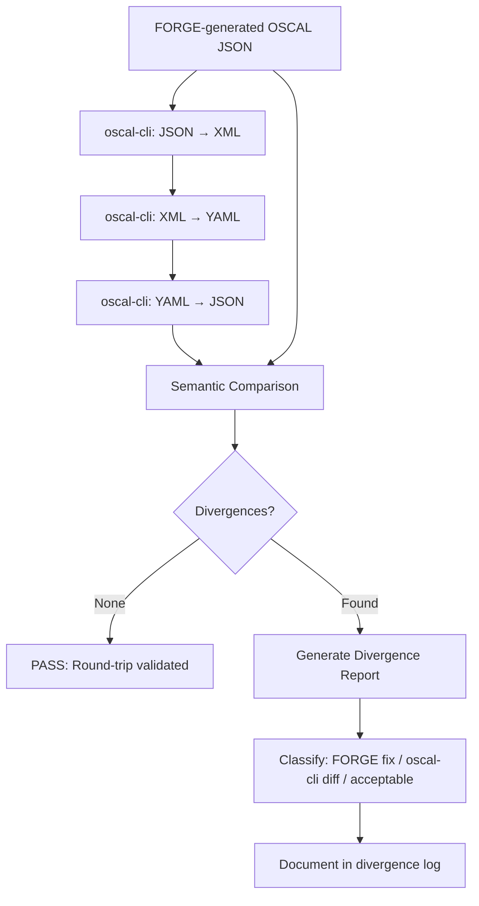
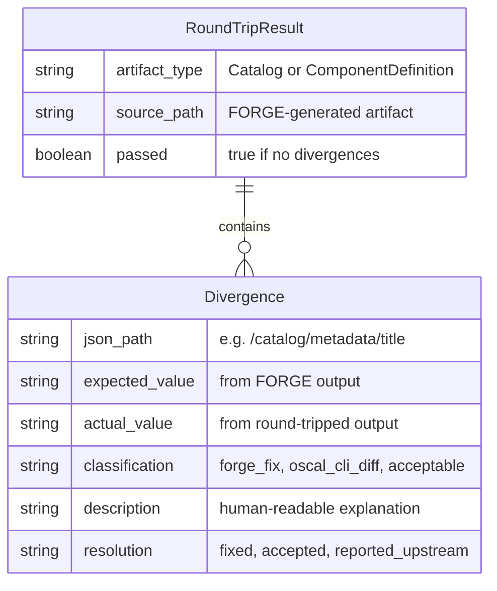
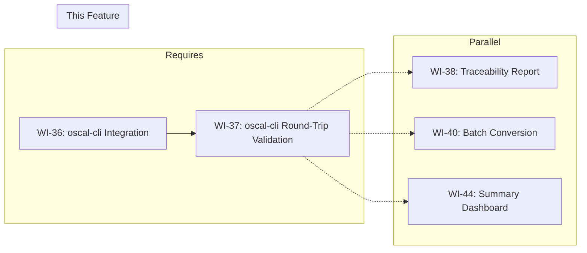

# 037-prd-oscal-cli-round-trip

> **Document Type:** Product Requirements Document
> **Audience:** LLM agents, human reviewers
> **Status:** Draft
> **Last Updated:** 2026-02-10 <!-- @auto -->
> **Owner:** Brian Luby <!-- @human-required -->

**Feature Branch**: `037-oscal-cli-round-trip`
**Created**: 2026-02-10
**Status**: Draft
**Input**: Derived from FORGE Product Roadmap WI-37

---

## Review Tier Legend

| Marker | Tier | Speckit Behavior |
|--------|------|------------------|
| 🔴 `@human-required` | Human Generated | Prompt human to author; blocks until complete |
| 🟡 `@human-review` | LLM + Human Review | LLM drafts → prompt human to confirm/edit; blocks until confirmed |
| 🟢 `@llm-autonomous` | LLM Autonomous | LLM completes; no prompt; logged for audit |
| ⚪ `@auto` | Auto-generated | System fills (timestamps, links); no prompt |

---

## Document Completion Order

> ⚠️ **For LLM Agents:** Complete sections in this order. Do not fill downstream sections until upstream human-required inputs exist.

1. **Context** (Background, Scope) → requires human input first
2. **Problem Statement & User Scenarios** → requires human input
3. **Requirements** (Must/Should/Could/Won't) → requires human input
4. **Technical Constraints** → human review
5. **Diagrams, Data Model, Interface** → LLM can draft after above exist
6. **Acceptance Criteria** → derived from requirements
7. **Everything else** → can proceed

---

## Context

### Background 🔴 `@human-required`
This PRD covers **WI-37: oscal-cli Round-Trip Validation** from the FORGE Product Roadmap (Sprint S-37, Nov 10 2026, Theme T-6: Ecosystem, Milestone MS-7). WI-36 integrates NIST's oscal-cli for profile resolution delegation. WI-37 extends that integration by using oscal-cli as the authoritative reference for round-trip validation of FORGE-generated OSCAL artifacts. The goal is to convert FORGE's JSON output through oscal-cli's JSON to XML to YAML conversions and back, then compare the results to verify structural and semantic fidelity. Any divergences between FORGE output and oscal-cli's canonical conversion must be documented and, where possible, resolved. This ensures FORGE produces OSCAL artifacts that are fully interoperable with the NIST reference toolchain.

**Confidence Level:** :orange_circle: Phase 3 — Exploratory. This work item is in the Phase 3 Ecosystem batch. Requirements may evolve as oscal-cli integration matures and real-world interoperability gaps are discovered.

### Scope Boundaries 🟡 `@human-review`

**In Scope:**
- Using oscal-cli to perform JSON → XML → YAML round-trip conversions of FORGE-generated OSCAL artifacts
- Comparing FORGE output with oscal-cli conversion output to identify divergences
- Automated round-trip validation test suite that runs against FORGE-generated Catalog and Component Definition artifacts
- Documenting any divergences between FORGE output and oscal-cli canonical output (structural, ordering, whitespace, field naming)
- Resolving divergences in FORGE output where FORGE is non-conformant

**Out of Scope:**
- oscal-cli profile resolution delegation — completed in WI-36 (036-prd-oscal-cli-integration)
- Fixing bugs in oscal-cli itself — divergences caused by oscal-cli are reported upstream, not fixed in FORGE
- XML or YAML output format generation — deferred to WI-26/WI-27 (Phase 2)
- Schema validation of FORGE output — completed in WI-19 (019-prd-schema-validation)
- Golden-file test suite — completed in WI-21/WI-22 (Phase 1 validation)

### Glossary 🟡 `@human-review`

| Term | Definition |
|------|------------|
| oscal-cli | NIST's official command-line tool for OSCAL operations including format conversion, validation, and profile resolution |
| Round-Trip Validation | The process of converting an artifact through multiple formats (JSON → XML → YAML → JSON) and verifying the result matches the original |
| Divergence | A difference between FORGE-generated output and oscal-cli's canonical conversion that may indicate non-conformance |
| Canonical Output | The output produced by oscal-cli as the authoritative OSCAL reference implementation |
| Interoperability | The ability of FORGE-generated OSCAL artifacts to be correctly consumed by other OSCAL-compliant tools |
| OSCAL Catalog | An OSCAL model representing a structured collection of controls (requirements) |
| Component Definition | OSCAL model describing how controls are implemented by reusable components |

### Related Documents ⚪ `@auto`

| Document | Link | Relationship |
|----------|------|--------------|
| Parent PRD | docs/FORGE_PRD.md | Parent requirements (interoperability validation) |
| Product Roadmap | docs/FORGE_PRODUCT_ROADMAP.md | Sprint S-37 context |
| Depends On | WI-36 (oscal-cli integration) | oscal-cli availability and integration infrastructure |
| Product Vision | docs/FORGE_PRODUCT_VISION.md | Strategic goal G-1 |
| Constitution | .specify/memory/constitution.md | Technical constraints and quality gates |

---

## Problem Statement 🔴 `@human-required`

FORGE generates OSCAL artifacts (Catalogs and Component Definitions) in JSON format, but there is no automated verification that these artifacts are fully interoperable with the NIST reference toolchain. Schema validation (WI-19) confirms structural validity, but does not catch semantic divergences such as field ordering differences, whitespace handling, optional field omission patterns, or serialization conventions that differ from oscal-cli's canonical output. Without round-trip validation, FORGE users cannot be confident that their generated artifacts will be correctly consumed by other OSCAL-compliant tools in the ecosystem. This work item establishes oscal-cli as the authoritative reference and builds an automated comparison pipeline that surfaces any divergences, ensuring FORGE output meets the interoperability expectations of the OSCAL community.

---

## User Scenarios & Testing 🔴 `@human-required`

### User Story 1 — Verify FORGE Output Matches oscal-cli Conversion (Priority: P1)

A developer runs the round-trip validation suite to confirm FORGE-generated OSCAL artifacts are interoperable with the NIST reference toolchain.

> As a developer working on FORGE, I want to automatically compare FORGE output against oscal-cli's canonical conversion so that I can identify and fix any divergences before users encounter interoperability issues.

**Why this priority**: This is the core purpose of WI-37. Without this comparison, there is no automated confidence that FORGE output is interoperable with the OSCAL ecosystem.

**Independent Test**: Generate an OSCAL Catalog JSON with FORGE, convert it through oscal-cli (JSON → XML → JSON), and compare the original FORGE output with the round-tripped result. Verify the comparison produces a clear pass/fail with divergence details.

**Acceptance Scenarios**:
1. **Given** a FORGE-generated OSCAL Catalog JSON, **When** converting it through oscal-cli (JSON → XML → JSON), **Then** the round-tripped JSON is semantically equivalent to the original, or divergences are reported with specific field paths.
2. **Given** a FORGE-generated Component Definition JSON, **When** converting it through oscal-cli (JSON → XML → YAML → JSON), **Then** the round-tripped JSON is semantically equivalent to the original, or divergences are reported.

---

### User Story 2 — Document Divergences (Priority: P1)

A developer reviews documented divergences to determine whether FORGE or oscal-cli is the source of the difference and what action to take.

> As a developer working on FORGE, I want divergences between FORGE output and oscal-cli conversion to be clearly documented so that I can prioritize fixes and communicate known differences to users.

**Why this priority**: Divergences must be understood and categorized (FORGE bug vs. oscal-cli difference vs. acceptable variation) to take appropriate action.

**Independent Test**: Run the round-trip validation against a known divergent artifact and verify the divergence report includes the field path, expected value, actual value, and severity classification.

**Acceptance Scenarios**:
1. **Given** a round-trip comparison that identifies divergences, **When** reviewing the divergence report, **Then** each divergence includes the JSON path, expected value, actual value, and classification (FORGE fix needed, oscal-cli difference, acceptable variation).
2. **Given** all known divergences, **When** reviewing the documentation, **Then** each divergence has a resolution status (fixed, accepted, reported upstream).

---

### User Story 3 — Round-Trip Across All Supported Formats (Priority: P2)

A developer validates that FORGE output survives round-trip through all three OSCAL serialization formats.

> As a developer working on FORGE, I want round-trip validation across JSON, XML, and YAML so that I can verify FORGE output is format-agnostic and interoperable regardless of which format downstream tools consume.

**Why this priority**: Full format coverage ensures interoperability beyond JSON. While FORGE currently outputs JSON, downstream consumers may use XML or YAML.

**Independent Test**: Convert FORGE output through JSON → XML → YAML → JSON using oscal-cli and verify semantic equivalence at each step.

**Acceptance Scenarios**:
1. **Given** a FORGE-generated Catalog JSON, **When** converting JSON → XML → YAML → JSON via oscal-cli, **Then** the final JSON is semantically equivalent to the original FORGE output.
2. **Given** a FORGE-generated Component Definition JSON, **When** performing the same round-trip, **Then** the final JSON is semantically equivalent to the original.

---

## Assumptions & Risks 🟡 `@human-review`

### Assumptions
- [A-1] oscal-cli is installed and available in the development/CI environment (infrastructure established in WI-36).
- [A-2] oscal-cli supports JSON → XML, XML → YAML, and YAML → JSON conversions for both Catalog and Component Definition models.
- [A-3] oscal-cli's conversion output is the authoritative reference — when FORGE and oscal-cli differ, FORGE is assumed non-conformant unless proven otherwise.
- [A-4] Semantic equivalence comparison can tolerate acceptable variations (field ordering, whitespace, formatting) and focus on structural/value differences.

### Risks
| ID | Risk | Likelihood | Impact | Mitigation |
|----|------|------------|--------|------------|
| R-1 | oscal-cli is not available in CI environment (Java dependency) | Med | Med | Use Docker-based oscal-cli or mark round-trip tests as integration tests that run conditionally |
| R-2 | oscal-cli introduces its own non-standard transformations during conversion | Low | Med | Cross-reference divergences against OSCAL specification; report genuine oscal-cli issues upstream |
| R-3 | Round-trip comparison produces false positives from acceptable variations (ordering, whitespace) | Med | Low | Implement semantic comparison (parse and compare data structures) rather than string comparison |
| R-4 | oscal-cli version updates change conversion behavior | Low | Low | Pin oscal-cli version in CI; update intentionally and re-validate |

---

## Feature Overview

### Flow Diagram 🟡 `@human-review`



### State Diagram (if applicable) 🟡 `@human-review`
N/A — No state transitions in this work item.

---

## Requirements

### Must Have (M) — MVP, launch blockers 🔴 `@human-required`
- [ ] **M-1:** An automated test shall convert FORGE-generated Catalog JSON through oscal-cli (JSON → XML → JSON) and compare the result with the original. *(Traces to: interoperability validation)*
- [ ] **M-2:** An automated test shall convert FORGE-generated Component Definition JSON through oscal-cli (JSON → XML → JSON) and compare the result with the original. *(Traces to: interoperability validation)*
- [ ] **M-3:** The comparison shall use semantic equivalence (parsed data structure comparison) rather than string comparison, tolerating acceptable variations in field ordering and whitespace. *(Traces to: reliable comparison)*
- [ ] **M-4:** Divergences shall be reported with the JSON path, expected value, actual value, and a human-readable description. *(Traces to: actionable diagnostics)*
- [ ] **M-5:** All identified divergences where FORGE is non-conformant shall be resolved (FORGE output corrected) before this WI is considered complete. *(Traces to: interoperability)*
- [ ] **M-6:** A divergence log shall document all discovered divergences, their classification, and resolution status. *(Traces to: audit trail)*

### Should Have (S) — High value, not blocking 🔴 `@human-required`
- [ ] **S-1:** The round-trip validation should include a full JSON → XML → YAML → JSON cycle (three-format round-trip), not just JSON → XML → JSON.
- [ ] **S-2:** The round-trip tests should run in CI as integration tests, gated on oscal-cli availability.
- [ ] **S-3:** The divergence report should classify each divergence as "FORGE fix needed", "oscal-cli difference", or "acceptable variation".

### Could Have (C) — Nice to have, if time permits 🟡 `@human-review`
- [ ] **C-1:** A `forge validate --round-trip` CLI flag could invoke oscal-cli round-trip validation on a FORGE-generated artifact.
- [ ] **C-2:** The divergence log could be machine-readable (JSON format) for automated tracking.

### Won't Have (W) — Explicitly deferred 🟡 `@human-review`
- [ ] **W-1:** Fixing divergences caused by oscal-cli bugs — *Reason: Reported upstream to NIST; not addressable in FORGE*
- [ ] **W-2:** Round-trip validation for Profile or Assessment Plan models — *Reason: FORGE does not yet generate these models; deferred to future WIs*
- [ ] **W-3:** Performance benchmarking of oscal-cli conversion — *Reason: Performance is addressed in WI-24; this WI focuses on correctness*

---

## Technical Constraints 🟡 `@human-review`

- **Language/Framework:** Rust (latest stable), Cargo build system
- **External Tool:** oscal-cli (Java-based, requires JRE) — must be available in PATH or configurable via environment variable
- **Comparison:** Semantic comparison of parsed JSON structures (using `serde_json::Value` tree comparison)
- **Test Type:** Integration tests (require oscal-cli); should be conditionally skipped if oscal-cli is not available
- **OSCAL Version:** Target OSCAL v1.2.0; oscal-cli version must support v1.2.0
- **Error Handling:** `thiserror` for error types; clear errors when oscal-cli is not available
- **Linting:** `cargo clippy -- -D warnings` must pass
- **Formatting:** `cargo fmt --check` must produce no violations
- **Testing:** TDD mandatory; round-trip comparison logic must have unit tests independent of oscal-cli

---

## Data Model (if applicable) 🟡 `@human-review`



---

## Interface Contract (if applicable) 🟡 `@human-review`

```rust
/// Result of a round-trip validation run
pub struct RoundTripResult {
    /// The type of OSCAL artifact tested
    pub artifact_type: String,
    /// Path to the original FORGE-generated artifact
    pub source_path: PathBuf,
    /// Whether the round-trip passed (no divergences)
    pub passed: bool,
    /// List of divergences found
    pub divergences: Vec<Divergence>,
}

/// A single divergence between FORGE output and oscal-cli round-tripped output
pub struct Divergence {
    /// RFC 6901 JSON Pointer path (e.g., "/catalog/metadata/title")
    pub json_path: String,
    /// Value from FORGE output
    pub expected: serde_json::Value,
    /// Value from round-tripped output
    pub actual: serde_json::Value,
    /// Classification of the divergence
    pub classification: DivergenceClass,
    /// Human-readable description
    pub description: String,
    /// Resolution status; None until investigated, serializes as null
    pub resolution: Option<ResolutionStatus>,
}

pub enum DivergenceClass {
    ForgeFix,       // FORGE output is non-conformant; fix needed
    OscalCliDiff,   // oscal-cli behaves differently; report upstream
    Acceptable,     // Acceptable variation (ordering, whitespace)
}

pub enum ResolutionStatus {
    Fixed,            // FORGE output corrected
    Accepted,         // Acceptable variation; no fix required
    ReportedUpstream, // Caused by oscal-cli; reported to NIST
}

/// Execute the oscal-cli conversion chain: JSON → XML → YAML → JSON
pub fn run_round_trip_chain(
    input_json_path: &Path,
    invoker: &dyn OscalCliInvoke,
    temp_dir: &Path,
    timeout: Duration,
) -> Result<PathBuf, ForgeError>;

/// Compare two parsed JSON values semantically with OSCAL-aware rules
pub fn compare_oscal_json(
    expected: &serde_json::Value,
    actual: &serde_json::Value,
    path: &str,
    rules: &OscalComparisonRules,
) -> Vec<Divergence>;

/// Write a RoundTripResult as a pretty-printed JSON file
pub fn write_divergence_log(
    result: &RoundTripResult,
    output_path: &Path,
) -> Result<(), ForgeError>;
```

---

## Evaluation Criteria 🟡 `@human-review`

| Criterion | Weight | Metric | Target | Notes |
|-----------|--------|--------|--------|-------|
| Round-trip pass rate | Critical | FORGE output survives JSON → XML → JSON round-trip | 100% (zero unresolved FORGE-caused divergences) | Core deliverable |
| Divergence documentation | Critical | All divergences documented with classification | 100% | Audit trail |
| Semantic comparison reliability | High | No false positives from acceptable variations | Zero false positives | Comparison must be robust |
| CI integration | High | Round-trip tests run in CI when oscal-cli available | Conditional execution | Graceful skip when unavailable |

---

## Tool/Approach Candidates 🟡 `@human-review`

| Option | License | Pros | Cons | Spike Result |
|--------|---------|------|------|--------------|
| oscal-cli (NIST) | Public domain | Authoritative reference implementation | Java dependency; CI complexity | Selected per WI-36 integration |
| serde_json::Value comparison | MIT/Apache-2.0 | Semantic comparison in Rust; handles ordering differences | Must handle OSCAL-specific comparison rules | Selected for comparison logic |
| assert_json_diff crate | MIT | Purpose-built JSON diff library | May need customization for OSCAL semantics | Evaluate as comparison helper |

### Selected Approach 🔴 `@human-required`
> **Decision:** Use oscal-cli for format conversion (JSON → XML → YAML → JSON); use serde_json::Value tree comparison for semantic equivalence checking; document divergences in a structured log.
> **Rationale:** oscal-cli is the NIST reference implementation and the authoritative standard for OSCAL format conversion. Semantic JSON comparison avoids false positives from acceptable variations. A structured divergence log provides an audit trail and guides resolution.

---

## Acceptance Criteria 🟡 `@human-review`

| AC ID | Requirement | User Story | Given | When | Then |
|-------|-------------|------------|-------|------|------|
| AC-1 | M-1 | US-1 | A FORGE-generated Catalog JSON | Converting through oscal-cli JSON → XML → JSON | The round-tripped JSON is semantically equivalent to the original, or divergences are reported |
| AC-2 | M-2 | US-1 | A FORGE-generated Component Definition JSON | Converting through oscal-cli JSON → XML → JSON | The round-tripped JSON is semantically equivalent to the original, or divergences are reported |
| AC-3 | M-3 | US-1 | Two JSON documents differing only in field order | Running semantic comparison | The comparison reports no divergences (field order is acceptable variation) |
| AC-4 | M-4 | US-2 | A round-trip comparison with divergences | Reviewing the divergence output | Each divergence includes JSON path, expected value, actual value, and description |
| AC-5 | M-5 | US-1 | All FORGE-caused divergences identified | Resolving divergences | FORGE output is corrected and round-trip validation passes |
| AC-6 | M-6 | US-2 | Completed round-trip validation | Reviewing the divergence log | All divergences are documented with classification and resolution status |
| AC-7 | S-1 | US-3 | A FORGE-generated Catalog JSON | Converting through oscal-cli JSON → XML → YAML → JSON | The final JSON is semantically equivalent to the original |

### Edge Cases 🟢 `@llm-autonomous`
- [ ] **EC-1:** (M-1) When oscal-cli is not available in the environment, then round-trip tests are skipped with a clear warning message (not a test failure).
- [ ] **EC-2:** (M-3) When FORGE output contains empty arrays `[]` and oscal-cli omits them entirely, then the comparison classifies this as an acceptable variation.
- [ ] **EC-3:** (M-3) When oscal-cli reorders array elements (e.g., props), then the comparison handles unordered array comparison for known unordered OSCAL fields.
- [ ] **EC-4:** (M-4) When a divergence involves deeply nested fields, then the JSON path is complete (e.g., `catalog.groups[0].controls[2].parts[0].prose`).
- [ ] **EC-5:** (M-1) When FORGE output includes fields not recognized by oscal-cli, then the divergence is classified and reported with the field path.

---

## Dependencies 🟡 `@human-review`



- **Requires:** [WI-36: oscal-cli Integration](docs/PRD/036-prd-oscal-cli-integration.md) (oscal-cli availability and integration infrastructure)
- **Blocks:** None directly
- **Parallel With:** [WI-38: Traceability Report], [WI-40: Batch Conversion], [WI-44: Summary Dashboard]
- **External:** NIST oscal-cli (Java-based, requires JRE)

---

## Security Considerations 🟡 `@human-review`

| Aspect | Assessment | Notes |
|--------|------------|-------|
| Internet Exposure | No | CLI tool, no network services |
| Sensitive Data | Yes | Round-trip validation processes OSCAL artifacts which may contain policy content |
| Authentication Required | No | Local CLI tool |
| Security Review Required | No | This WI invokes oscal-cli as a subprocess; standard subprocess security practices apply (no shell injection, validated paths) |

Additional security notes:
- oscal-cli is invoked as a subprocess with controlled arguments. Input paths are validated before passing to the subprocess.
- Temporary files created during round-trip conversion (intermediate XML/YAML) should be cleaned up after comparison.

---

## Implementation Guidance 🟢 `@llm-autonomous`

### Suggested Approach
Create a `round_trip` module that orchestrates the validation process. The module should: (1) invoke oscal-cli to convert FORGE JSON output to XML, (2) invoke oscal-cli to convert XML to YAML, (3) invoke oscal-cli to convert YAML back to JSON, (4) parse both the original FORGE JSON and the round-tripped JSON as `serde_json::Value` trees, (5) walk both trees recursively comparing values at each path. Use `std::process::Command` to invoke oscal-cli as a subprocess. Implement the semantic comparison as a separate, unit-testable function that takes two `serde_json::Value` inputs and returns a `Vec<Divergence>`. Handle OSCAL-specific comparison rules (e.g., some arrays are ordered, some are unordered). Write integration tests that generate a Catalog and Component Definition through the FORGE pipeline, run round-trip validation, and assert zero FORGE-caused divergences.

### Anti-patterns to Avoid
- String-level comparison of JSON output — JSON field ordering is not significant and will produce false positives
- Ignoring all divergences as "acceptable" without classification — each divergence must be understood and categorized
- Hard-coding oscal-cli path instead of making it configurable — environments differ
- Leaving temporary files (intermediate XML/YAML) after test runs — clean up in test teardown
- Running round-trip tests unconditionally — they must gracefully skip when oscal-cli is unavailable

### Reference Examples
- oscal-cli documentation: https://github.com/usnistgov/oscal-cli
- NIST OSCAL format conversion documentation for JSON/XML/YAML equivalence rules
- `serde_json::Value` recursive comparison patterns in Rust

---

## Spike Tasks 🟡 `@human-review`

N/A — oscal-cli integration infrastructure is established in WI-36. The round-trip conversion commands and comparison approach are well-understood.

---

## Success Metrics 🔴 `@human-required`

| Metric | Baseline | Target | Measurement Method |
|--------|----------|--------|-------------------|
| Round-trip pass rate | No round-trip testing exists | FORGE output matches oscal-cli conversion (zero FORGE-caused divergences) | Automated round-trip test suite |
| Divergence documentation | No divergence tracking | All divergences documented with classification and resolution | Divergence log review |
| Format coverage | No format testing | JSON → XML → YAML → JSON round-trip validated | Integration test results |

### Technical Verification 🟢 `@llm-autonomous`
| Metric | Target | Verification Method |
|--------|--------|---------------------|
| Semantic comparison unit tests | >90% coverage | `cargo test` + coverage tool |
| No clippy warnings | 0 | `cargo clippy -- -D warnings` |
| No formatting violations | 0 | `cargo fmt --check` |
| Round-trip tests pass (when oscal-cli available) | 100% | `cargo test` integration tests |

---

## Definition of Ready 🔴 `@human-required`

### Readiness Checklist
- [x] Problem statement reviewed and validated by stakeholder
- [x] All Must Have requirements have acceptance criteria
- [x] Technical constraints are explicit and agreed
- [x] Dependencies identified and owners confirmed
- [x] Security review completed (or N/A documented with justification)
- [x] No open questions blocking implementation

### Sign-off
| Role | Name | Date | Decision |
|------|------|------|----------|
| Product Owner | Brian Luby | YYYY-MM-DD | [Ready / Not Ready] |

---

## Changelog ⚪ `@auto`

| Version | Date | Author | Changes |
|---------|------|--------|---------|
| 0.1 | 2026-02-10 | LLM (Claude) | Initial draft derived from FORGE Product Roadmap WI-37 |

---

## Decision Log 🟡 `@human-review`

| Date | Decision | Rationale | Alternatives Considered |
|------|----------|-----------|------------------------|
| 2026-02-10 | Use semantic JSON comparison rather than string comparison | JSON field ordering is not significant per RFC 8259; string comparison produces false positives | String diff (too many false positives); schema-level comparison only (misses value differences) |
| 2026-02-10 | Classify divergences into three categories (FORGE fix, oscal-cli diff, acceptable) | Not all divergences require FORGE changes; classification guides appropriate action | Binary pass/fail (loses nuance); ignore divergences (hides interoperability issues) |
| 2026-02-10 | Conditionally skip round-trip tests when oscal-cli is unavailable | oscal-cli requires Java runtime which may not be present in all environments; failing tests on missing optional tool is disruptive | Require oscal-cli in all environments (blocks development); mock oscal-cli (defeats purpose of round-trip validation) |
| 2026-03-12 | Elevate C-2 (machine-readable divergence log) to MUST-level requirement (FR-006) | `serde_json` is already a project dependency with no new cost; the clarification session confirmed JSON as the required format; a structured log enables automated tracking and the `resolution: null` sentinel for unresolved divergences is only expressible in a structured format | Treat as optional Could Have; plain-text log |
| 2026-03-12 | Replace `validate_round_trip` entry point with `run_round_trip_chain` + `compare_oscal_json` | Separation of concerns: chain orchestration (subprocess management) and comparison (pure recursive function) are independently unit-testable; `validate_round_trip` was a monolithic entry point that combined both concerns and required oscal-cli for any test | Single `validate_round_trip` monolithic function |

---

## Open Questions 🟡 `@human-review`

No open questions for this work item.

---

## Review Checklist 🟢 `@llm-autonomous`

Before marking as Approved:
- [x] All requirements have unique IDs (M-1 through M-6, S-1 through S-3, C-1 through C-2, W-1 through W-3)
- [x] All Must Have requirements have linked acceptance criteria
- [x] User stories are prioritized and independently testable
- [x] Acceptance criteria reference both requirement IDs and user stories
- [x] Glossary terms are used consistently throughout
- [x] Diagrams use terminology from Glossary
- [x] Security considerations documented
- [x] Definition of Ready checklist is complete
- [x] No open questions blocking implementation
