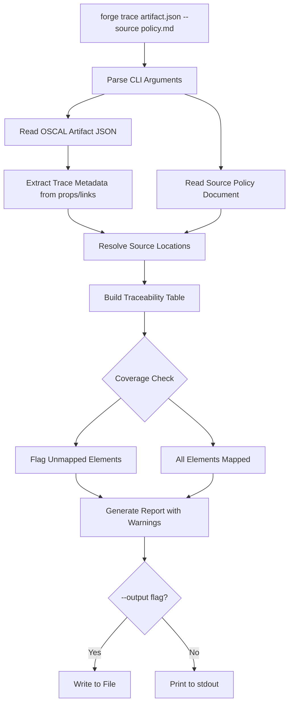
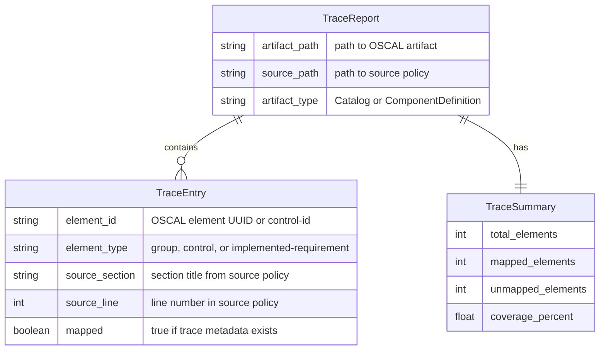
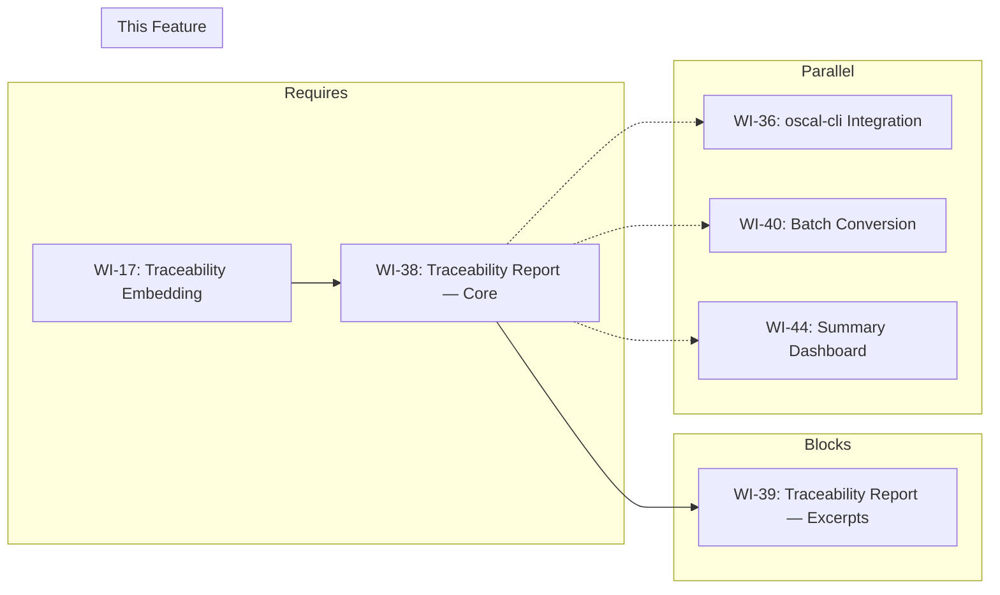

# 038-prd-traceability-report

> **Document Type:** Product Requirements Document
> **Audience:** LLM agents, human reviewers
> **Status:** Draft
> **Last Updated:** 2026-02-10 <!-- @auto -->
> **Owner:** Brian Luby <!-- @human-required -->

**Feature Branch**: `038-traceability-report`
**Created**: 2026-02-10
**Status**: Draft
**Input**: Derived from FORGE Product Roadmap WI-38

---

## Review Tier Legend

| Marker | Tier | Speckit Behavior |
|--------|------|------------------|
| 🔴 `@human-required` | Human Generated | Prompt human to author; blocks until complete |
| 🟡 `@human-review` | LLM + Human Review | LLM drafts → prompt human to confirm/edit; blocks until confirmed |
| 🟢 `@llm-autonomous` | LLM Autonomous | LLM completes; no prompt; logged for audit |
| ⚪ `@auto` | Auto-generated | System fills (timestamps, links); no prompt |

---

## Document Completion Order

> ⚠️ **For LLM Agents:** Complete sections in this order. Do not fill downstream sections until upstream human-required inputs exist.

1. **Context** (Background, Scope) → requires human input first
2. **Problem Statement & User Scenarios** → requires human input
3. **Requirements** (Must/Should/Could/Won't) → requires human input
4. **Technical Constraints** → human review
5. **Diagrams, Data Model, Interface** → LLM can draft after above exist
6. **Acceptance Criteria** → derived from requirements
7. **Everything else** → can proceed

---

## Context

### Background 🔴 `@human-required`
This PRD covers **WI-38: Traceability Report — Core** from the FORGE Product Roadmap (Sprint S-38, Nov 17 2026, Theme T-6: Ecosystem, Milestone MS-7). WI-16 established the TraceLink model mapping source locations to OSCAL elements, and WI-17 embedded trace metadata as props/links in generated OSCAL artifacts. WI-38 builds on that foundation by implementing a user-facing `forge trace` subcommand that produces a traceability report. The report maps each OSCAL element (group, control, implemented-requirement) back to its source policy section and line number. This fulfills Parent PRD requirement S-6: "The CLI shall produce a traceability report mapping source policy locations to OSCAL element identifiers." The traceability report is essential for compliance engineers who need to audit the conversion and demonstrate to assessors that every OSCAL element has a documented provenance in the source policy.

**Confidence Level:** :orange_circle: Phase 3 — Exploratory. This work item is in the Phase 3 Ecosystem batch. Requirements may evolve as traceability use cases are validated with real compliance workflows.

### Scope Boundaries 🟡 `@human-review`

**In Scope:**
- Implementing the `forge trace <artifact> --source <policy>` subcommand
- Reading an OSCAL artifact (Catalog or Component Definition JSON) and extracting embedded trace metadata (props/links from WI-17)
- Reading the source policy document and resolving trace references to source locations
- Mapping each OSCAL element to its source section and line number
- Producing a structured table report to stdout or to a file
- Supporting both Catalog and Component Definition artifacts

**Out of Scope:**
- Source text excerpts in the report — deferred to WI-39 (039-prd-traceability-report-excerpts)
- JSON output format for the trace report — deferred to WI-39
- TraceLink model definition — completed in WI-16 (016-prd-traceability-model)
- Trace metadata embedding in OSCAL artifacts — completed in WI-17 (017-prd-traceability-embedding)
- Diff report between two conversions — deferred to WI-43 (043-prd-diff-report)
- Bidirectional traceability (source → OSCAL and OSCAL → source in one view) — deferred to future enhancement

### Glossary 🟡 `@human-review`

| Term | Definition |
|------|------------|
| Traceability Report | A structured output mapping each OSCAL element to its originating source policy location (section, line) |
| TraceLink | The internal model (from WI-16) that associates a source location with an OSCAL element identifier |
| Trace Metadata | Props and links embedded in OSCAL artifacts (by WI-17) that encode source location references |
| forge trace | The CLI subcommand that produces the traceability report |
| Source Location | A reference to a specific position in the source policy document, identified by section and line number |
| OSCAL Element | A discrete unit in an OSCAL artifact (e.g., group, control, implemented-requirement) identified by a UUID or control-id |
| Structured Table | A formatted text table with columns for OSCAL element ID, element type, source section, and source line |

### Related Documents ⚪ `@auto`

| Document | Link | Relationship |
|----------|------|--------------|
| Parent PRD | docs/FORGE_PRD.md | Parent requirement S-6, AC-10; User Story US-7 |
| Product Roadmap | docs/FORGE_PRODUCT_ROADMAP.md | Sprint S-38 context |
| Depends On | WI-17 (traceability embedding) | Trace metadata in OSCAL artifacts |
| Extends | WI-39 (traceability excerpts) | Source excerpts and JSON output |
| Product Vision | docs/FORGE_PRODUCT_VISION.md | Strategic goal G-1 |
| Constitution | .specify/memory/constitution.md | Technical constraints and quality gates |

---

## Problem Statement 🔴 `@human-required`

WI-17 embeds trace metadata (source section, paragraph, and line references) within generated OSCAL artifacts as props and links, but there is no user-facing way to view or consume this traceability information. A compliance engineer who needs to verify the provenance of an OSCAL control — which source policy section and line number it came from — must currently inspect raw JSON and manually decode trace props. This is impractical for audits and does not satisfy Parent PRD requirement S-6 ("The CLI shall produce a traceability report mapping source policy locations to OSCAL element identifiers") or User Story US-7 (Traceability Report). WI-38 implements the `forge trace` subcommand that reads an OSCAL artifact, extracts embedded trace metadata, resolves it against the source policy, and produces a clear, structured table mapping every OSCAL element to its source location. This gives compliance engineers and assessors a single, auditable view of the conversion provenance.

---

## User Scenarios & Testing 🔴 `@human-required`

### User Story 1 — Produce Traceability Report (Priority: P1)

A compliance engineer generates a traceability report to audit the mapping between an OSCAL Catalog and the source policy.

> As a compliance engineer, I want to run `forge trace catalog.json --source policy.md` and receive a structured table mapping each OSCAL element to its source policy location so that I can audit the conversion and demonstrate provenance to assessors.

**Why this priority**: This is the core purpose of WI-38 and directly satisfies Parent PRD S-6 and US-7. Without this subcommand, traceability metadata embedded by WI-17 is inaccessible to users.

**Independent Test**: Generate an OSCAL Catalog from a sample policy (with trace metadata embedded by WI-17), run `forge trace catalog.json --source policy.md`, and verify the output is a structured table with one row per OSCAL element, showing element ID, element type, source section, and source line number.

**Acceptance Scenarios**:
1. **Given** an OSCAL Catalog JSON with 3 groups and 10 controls containing trace metadata, **When** running `forge trace catalog.json --source policy.md`, **Then** a structured table is produced with 13 rows (3 groups + 10 controls), each showing the OSCAL element ID, type, source section title, and line number.
2. **Given** an OSCAL Component Definition JSON with 5 implemented-requirements containing trace metadata, **When** running `forge trace compdef.json --source policy.md`, **Then** a structured table is produced with rows for each implemented-requirement, each mapped to its source location.

---

### User Story 2 — Save Traceability Report to File (Priority: P2)

A compliance engineer saves the traceability report to a file for inclusion in audit documentation.

> As a compliance engineer, I want to save the traceability report to a file using `--output trace-report.txt` so that I can include it in audit packages and share it with assessors.

**Why this priority**: File output is essential for practical audit workflows but the core functionality (stdout output) is higher priority.

**Independent Test**: Run `forge trace catalog.json --source policy.md --output trace-report.txt` and verify the file is created with the same structured table content.

**Acceptance Scenarios**:
1. **Given** `--output trace-report.txt` is specified, **When** running `forge trace`, **Then** the file `trace-report.txt` is created containing the structured table.
2. **Given** the `--output` flag is omitted, **When** running `forge trace`, **Then** the structured table is printed to stdout.

---

### User Story 3 — Verify Complete Coverage (Priority: P2)

A compliance engineer verifies that every OSCAL element has a source mapping (no orphaned elements).

> As a compliance engineer, I want the traceability report to flag any OSCAL elements that lack source mapping so that I can identify gaps in the conversion provenance.

**Why this priority**: Completeness of traceability is essential for audit confidence. Gaps undermine trust in the conversion.

**Independent Test**: Generate a traceability report from an artifact where one control has no trace metadata, and verify the report flags it as unmapped.

**Acceptance Scenarios**:
1. **Given** an OSCAL Catalog where one control lacks trace metadata, **When** running `forge trace`, **Then** the report includes a row for that control marked as "unmapped" and a summary warning indicating incomplete coverage.
2. **Given** an OSCAL Catalog where all controls have trace metadata, **When** running `forge trace`, **Then** the report summary indicates 100% coverage.

---

## Assumptions & Risks 🟡 `@human-review`

### Assumptions
- [A-1] WI-17 has embedded trace metadata (props/links) in OSCAL artifacts, and the metadata format is stable and documented.
- [A-2] The trace metadata includes sufficient information to resolve source section and line number references.
- [A-3] The source policy document is available at the path specified by `--source` and has not been modified since conversion (line numbers still match).
- [A-4] The `forge trace` subcommand was scaffolded in WI-1 or can be added as a new subcommand using the existing clap CLI structure.

### Risks
| ID | Risk | Likelihood | Impact | Mitigation |
|----|------|------------|--------|------------|
| R-1 | Trace metadata format from WI-17 does not contain enough information for full source resolution | Low | Med | WI-17 design includes section and line references; validate metadata completeness during integration |
| R-2 | Source policy has been modified since conversion, causing line number mismatches | Med | Low | Report warns when source file mtime is newer than the OSCAL artifact's `metadata.last-modified` timestamp |
| R-3 | Large OSCAL artifacts produce unwieldy table output | Low | Low | Provide summary statistics; detailed per-element output can be paginated or written to file |

---

## Feature Overview

### Flow Diagram 🟡 `@human-review`



### State Diagram (if applicable) 🟡 `@human-review`
N/A — No state transitions in this work item.

---

## Requirements

### Must Have (M) — MVP, launch blockers 🔴 `@human-required`
- [ ] **M-1:** The CLI shall provide a `forge trace <artifact> --source <policy>` subcommand that produces a traceability report. *(Traces to: Parent PRD S-6, US-7)*
- [ ] **M-2:** The traceability report shall map each OSCAL element (group, control, implemented-requirement) to its source section and line number. Parts are excluded — WI-17 does not embed trace metadata on parts. *(Traces to: Parent PRD S-6, AC-10)*
- [ ] **M-3:** The report shall be output as a structured table with columns: OSCAL Element ID, Element Type, Source Section, Source Line. *(Traces to: Parent PRD S-6)*
- [ ] **M-4:** The `forge trace` subcommand shall support both Catalog and Component Definition OSCAL artifacts. *(Traces to: Parent PRD S-6)*
- [ ] **M-5:** The report shall extract trace metadata from props/links embedded in the OSCAL artifact by WI-17. *(Traces to: WI-17 dependency)*
- [ ] **M-6:** Elements without trace metadata shall be flagged as "unmapped" in the report with a coverage summary. *(Traces to: audit completeness)*

### Should Have (S) — High value, not blocking 🔴 `@human-required`
- [ ] **S-1:** The `forge trace` subcommand should support an `--output <path>` flag to write the report to a file instead of stdout.
- [ ] **S-2:** The report should include a summary section showing total elements, mapped elements, unmapped elements, and coverage percentage.
- [ ] **S-3:** The report should warn if the source policy file appears to have been modified since conversion, by comparing the source file's modification time against the OSCAL artifact's `metadata.last-modified` timestamp.

### Could Have (C) — Nice to have, if time permits 🟡 `@human-review`
- [ ] **C-1:** The report could support a `--filter <element-type>` flag to show only specific element types (e.g., `--filter controls` to show only controls).
- [ ] **C-2:** The report could include column sorting options (by source line, by element type, by element ID).

### Won't Have (W) — Explicitly deferred 🟡 `@human-review`
- [ ] **W-1:** Source text excerpts in the report — *Reason: Deferred to WI-39 (traceability report excerpts)*
- [ ] **W-2:** JSON output format for the report — *Reason: Deferred to WI-39*
- [ ] **W-3:** Bidirectional traceability view (source → OSCAL interleaved with OSCAL → source) — *Reason: Deferred to future enhancement*
- [ ] **W-4:** Interactive or HTML report format — *Reason: CLI-first approach; rich formats deferred*

---

## Technical Constraints 🟡 `@human-review`

- **Language/Framework:** Rust (latest stable), Cargo build system
- **CLI Framework:** clap 4.x — `trace` subcommand added to the existing CLI structure
- **OSCAL Parsing:** `serde` and `serde_json` for reading OSCAL artifact JSON
- **Table Formatting:** Use a text-based table formatting approach (e.g., manual column alignment or a lightweight table crate)
- **Trace Metadata Format:** Must consume the props/links format established by WI-17
- **Error Handling:** `thiserror` for error types; clear errors for missing files, invalid JSON, missing trace metadata
- **Linting:** `cargo clippy -- -D warnings` must pass
- **Formatting:** `cargo fmt --check` must produce no violations
- **Testing:** TDD mandatory; unit tests for trace metadata extraction, source resolution, and table formatting

---

## Data Model (if applicable) 🟡 `@human-review`



---

## Interface Contract (if applicable) 🟡 `@human-review`

```rust
// CLI Interface (WI-38 addition)

// forge trace <artifact> --source <policy> [--output <path>]
//
// Examples:
//   forge trace catalog.json --source policy.md
//   forge trace compdef.json --source policy.md --output trace-report.txt

/// A single entry in the traceability report
pub struct TraceEntry {
    /// OSCAL element identifier (UUID or control-id)
    pub element_id: String,
    /// Type of OSCAL element (group, control, or implemented-requirement)
    pub element_type: String,
    /// Source policy section title
    pub source_section: String,
    /// Source line number
    pub source_line: Option<usize>,
    /// Whether this element has trace metadata
    pub mapped: bool,
}

/// Summary statistics for the traceability report
pub struct TraceSummary {
    pub total_elements: usize,
    pub mapped_elements: usize,
    pub unmapped_elements: usize,
    pub coverage_percent: f64,
}

/// Full traceability report
pub struct TraceReport {
    pub artifact_path: PathBuf,
    pub source_path: PathBuf,
    pub artifact_type: String,
    pub entries: Vec<TraceEntry>,
    pub summary: TraceSummary,
}

/// Generate a traceability report from an OSCAL artifact and source policy
pub fn generate_trace_report(
    artifact_path: &Path,
    source_path: &Path,
) -> Result<TraceReport, ForgeError>;

/// Format the trace report as a structured text table
pub fn format_trace_table(report: &TraceReport) -> String;
```

---

## Evaluation Criteria 🟡 `@human-review`

| Criterion | Weight | Metric | Target | Notes |
|-----------|--------|--------|--------|-------|
| Element coverage | Critical | All OSCAL elements appear in the report | 100% | No elements silently omitted |
| Source resolution accuracy | Critical | Source section and line match actual source locations | 100% | Verified against known test fixtures |
| Unmapped detection | High | Elements without trace metadata are flagged | 100% detection | No false negatives |
| Report readability | High | Table output is correctly aligned and readable | Manual review | Column widths and alignment |
| CLI usability | High | `forge trace` follows established CLI patterns | Consistent with `forge convert` | Same flag conventions |

---

## Tool/Approach Candidates 🟡 `@human-review`

| Option | License | Pros | Cons | Spike Result |
|--------|---------|------|------|--------------|
| Manual column alignment (format!) | N/A | No dependencies; full control over output | More code to maintain | Selected for simplicity |
| comfy-table crate | MIT | Rich table formatting, Unicode borders | Additional dependency | Evaluate if manual alignment is insufficient |
| tabled crate | MIT | Derive-based table formatting from structs | Additional dependency | Alternative to comfy-table |

### Selected Approach 🔴 `@human-required`
> **Decision:** Use manual column alignment with Rust's `format!` macro for table output; parse OSCAL artifact JSON with serde_json and extract trace metadata from WI-17 props/links format; resolve source locations by reading the source policy and matching line numbers.
> **Rationale:** Manual formatting avoids introducing a new dependency for a straightforward table layout. The trace metadata format is defined by WI-17, so extraction is deterministic. Source resolution is a simple line-number lookup in the source file.

---

## Acceptance Criteria 🟡 `@human-review`

| AC ID | Requirement | User Story | Given | When | Then |
|-------|-------------|------------|-------|------|------|
| AC-1 | M-1 | US-1 | An OSCAL Catalog JSON with trace metadata and the source policy | Running `forge trace catalog.json --source policy.md` | A structured table is printed to stdout mapping each element to its source location |
| AC-2 | M-2 | US-1 | A Catalog with 3 groups and 10 controls | Running `forge trace` | The report contains 13 rows, each with source section and line number |
| AC-3 | M-3 | US-1 | The traceability report output | Inspecting the table | Columns include OSCAL Element ID, Element Type, Source Section, Source Line |
| AC-4 | M-4 | US-1 | An OSCAL Component Definition JSON with trace metadata | Running `forge trace compdef.json --source policy.md` | The report maps implemented-requirements to their source locations |
| AC-5 | M-5 | US-1 | An OSCAL artifact with WI-17 trace props/links | Running `forge trace` | Trace metadata is correctly extracted and resolved to source locations |
| AC-6 | M-6 | US-3 | An OSCAL artifact where one control lacks trace metadata | Running `forge trace` | The report flags the control as "unmapped" and the summary shows <100% coverage |
| AC-7 | S-1 | US-2 | `--output trace-report.txt` is specified | Running `forge trace` | The file `trace-report.txt` is created with the report content |
| AC-8 | S-2 | US-3 | A completed traceability report | Inspecting the summary section | Total, mapped, unmapped counts and coverage percentage are displayed |

### Edge Cases 🟢 `@llm-autonomous`
- [ ] **EC-1:** (M-1) When the OSCAL artifact file does not exist, then `forge trace` exits with a non-zero status code and a descriptive error message.
- [ ] **EC-2:** (M-1) When the source policy file does not exist, then `forge trace` exits with a descriptive error indicating the source file is missing.
- [ ] **EC-3:** (M-5) When the OSCAL artifact contains no trace metadata (e.g., generated without WI-17), then all elements are flagged as "unmapped" and a warning is emitted.
- [ ] **EC-4:** (M-2) When a trace metadata reference points to a line number beyond the source file's length, then the entry is flagged with a "source modified" warning.
- [ ] **EC-5:** (M-4) When the OSCAL artifact is neither a Catalog nor a Component Definition, then `forge trace` exits with an error indicating unsupported artifact type.
- [ ] **EC-6:** (M-1) When the OSCAL artifact is invalid JSON, then `forge trace` exits with a descriptive parsing error.

---

## Dependencies 🟡 `@human-review`



- **Requires:** [WI-17: Traceability Embedding](docs/PRD/017-prd-traceability-embedding.md) (trace metadata in OSCAL artifacts)
- **Blocks:** [WI-39: Traceability Report — Excerpts](docs/PRD/039-prd-traceability-report-excerpts.md) (extends this report with source excerpts)
- **Parallel With:** [WI-36: oscal-cli Integration], [WI-40: Batch Conversion], [WI-44: Summary Dashboard]
- **External:** None

---

## Security Considerations 🟡 `@human-review`

| Aspect | Assessment | Notes |
|--------|------------|-------|
| Internet Exposure | No | CLI tool, no network services |
| Sensitive Data | Yes | Traceability report reveals source policy structure and line references, which may be sensitive |
| Authentication Required | No | Local CLI tool |
| Security Review Required | No | This WI reads existing files (OSCAL artifact and source policy) and produces a text report; no new attack surface |

Additional security notes:
- The traceability report may reveal organizational policy structure. Users should treat the report with the same sensitivity as the source policy and generated OSCAL artifacts.

---

## Implementation Guidance 🟢 `@llm-autonomous`

### Suggested Approach
Add a `trace` subcommand to the clap CLI definition with `<artifact>` positional argument, `--source <policy>` required flag, and `--output <path>` optional flag. Implement a `generate_trace_report` function that: (1) reads and parses the OSCAL artifact JSON using serde_json, (2) walks the OSCAL structure to find all elements (groups, controls, implemented-requirements — parts excluded as WI-17 does not embed trace metadata on them), (3) for each element, extracts trace metadata from its props/links (format defined by WI-17), (4) reads the source policy and resolves line number references, (5) builds a `TraceReport` with entries and summary. Implement a `format_trace_table` function that formats entries as an aligned text table with header row and column separators. Output to stdout by default or to a file if `--output` is specified.

### Anti-patterns to Avoid
- Hardcoding trace metadata prop names instead of using constants shared with WI-17
- Silently skipping elements that have no trace metadata — they must be reported as "unmapped"
- Using tab-separated output without alignment — structured table output should be visually readable
- Re-implementing OSCAL parsing instead of reusing serde_json deserialization
- Coupling the report format to a specific OSCAL model version — extract trace metadata generically from props/links

### Reference Examples
- WI-17 trace metadata format documentation for prop/link names and structure
- Parent PRD US-7 acceptance scenario: "every OSCAL element links back to a source location"

---

## Spike Tasks 🟡 `@human-review`

N/A — The trace metadata format is defined by WI-17, and the table formatting approach is straightforward. No spike tasks are needed.

---

## Success Metrics 🔴 `@human-required`

| Metric | Baseline | Target | Measurement Method |
|--------|----------|--------|-------------------|
| Traceability report works | No trace subcommand exists | `forge trace` produces structured table output | Manual verification + automated tests |
| Element coverage | N/A | 100% of OSCAL elements appear in report (mapped or unmapped) | Automated test with known fixture |
| Source resolution accuracy | N/A | Line numbers match source policy locations | Manual verification against sample policy |

### Technical Verification 🟢 `@llm-autonomous`
| Metric | Target | Verification Method |
|--------|--------|---------------------|
| Test coverage for trace report generation | >90% | `cargo test` + coverage tool |
| No clippy warnings | 0 | `cargo clippy -- -D warnings` |
| No formatting violations | 0 | `cargo fmt --check` |
| Trace metadata extraction correctness | 100% | Unit tests with mock OSCAL artifacts |

---

## Definition of Ready 🔴 `@human-required`

### Readiness Checklist
- [x] Problem statement reviewed and validated by stakeholder
- [x] All Must Have requirements have acceptance criteria
- [x] Technical constraints are explicit and agreed
- [x] Dependencies identified and owners confirmed
- [x] Security review completed (or N/A documented with justification)
- [x] No open questions blocking implementation

### Sign-off
| Role | Name | Date | Decision |
|------|------|------|----------|
| Product Owner | Brian Luby | YYYY-MM-DD | [Ready / Not Ready] |

---

## Changelog ⚪ `@auto`

| Version | Date | Author | Changes |
|---------|------|--------|---------|
| 0.1 | 2026-02-10 | LLM (Claude) | Initial draft derived from FORGE Product Roadmap WI-38 |

---

## Decision Log 🟡 `@human-review`

| Date | Decision | Rationale | Alternatives Considered |
|------|----------|-----------|------------------------|
| 2026-02-10 | Use structured text table output for the traceability report | Text tables are readable in terminals, pipeable, and require no additional dependencies; richer formats (JSON, HTML) are deferred to WI-39 and future WIs | JSON output (deferred to WI-39); HTML report (over-engineered for CLI-first approach); CSV output (less readable in terminal) |
| 2026-02-10 | Require `--source` flag to resolve trace references against the original policy | Trace metadata contains line numbers and section references that need the source file for resolution and verification | Embed full source text in OSCAL artifacts (bloats artifacts); resolve from metadata alone without source verification (loses line-level accuracy) |
| 2026-02-10 | Flag unmapped elements explicitly rather than silently omitting them | Completeness is essential for audit confidence; silent omission hides conversion gaps | Skip unmapped elements (hides gaps); fail with error on unmapped elements (too strict for advisory reporting) |

---

## Open Questions 🟡 `@human-review`

No open questions for this work item.

---

## Review Checklist 🟢 `@llm-autonomous`

Before marking as Approved:
- [x] All requirements have unique IDs (M-1 through M-6, S-1 through S-3, C-1 through C-2, W-1 through W-4)
- [x] All Must Have requirements have linked acceptance criteria
- [x] User stories are prioritized and independently testable
- [x] Acceptance criteria reference both requirement IDs and user stories
- [x] Glossary terms are used consistently throughout
- [x] Diagrams use terminology from Glossary
- [x] Security considerations documented
- [x] Definition of Ready checklist is complete
- [x] No open questions blocking implementation
