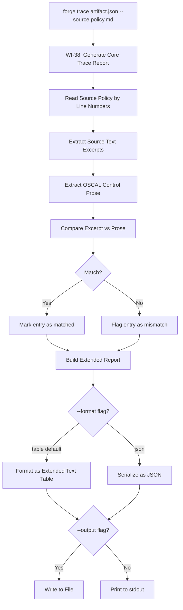
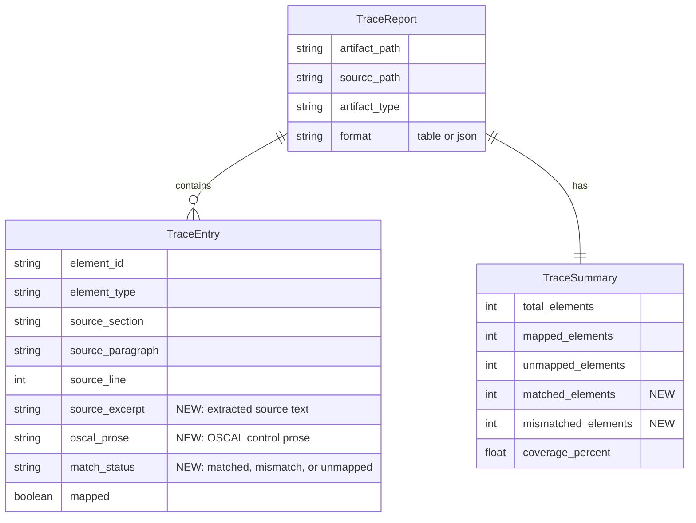
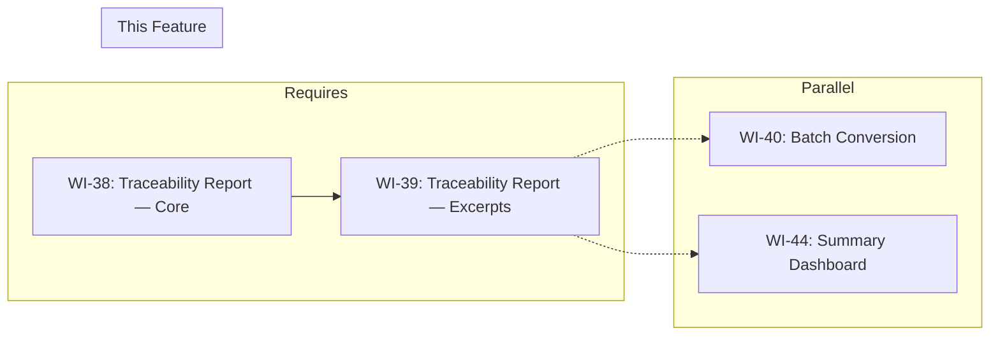

# 039-prd-traceability-report-excerpts

> **Document Type:** Product Requirements Document
> **Audience:** LLM agents, human reviewers
> **Status:** Draft
> **Last Updated:** 2026-02-10 <!-- @auto -->
> **Owner:** Brian Luby <!-- @human-required -->

**Feature Branch**: `039-traceability-report-excerpts`
**Created**: 2026-02-10
**Status**: Draft
**Input**: Derived from FORGE Product Roadmap WI-39

---

## Review Tier Legend

| Marker | Tier | Speckit Behavior |
|--------|------|------------------|
| 🔴 `@human-required` | Human Generated | Prompt human to author; blocks until complete |
| 🟡 `@human-review` | LLM + Human Review | LLM drafts → prompt human to confirm/edit; blocks until confirmed |
| 🟢 `@llm-autonomous` | LLM Autonomous | LLM completes; no prompt; logged for audit |
| ⚪ `@auto` | Auto-generated | System fills (timestamps, links); no prompt |

---

## Document Completion Order

> ⚠️ **For LLM Agents:** Complete sections in this order. Do not fill downstream sections until upstream human-required inputs exist.

1. **Context** (Background, Scope) → requires human input first
2. **Problem Statement & User Scenarios** → requires human input
3. **Requirements** (Must/Should/Could/Won't) → requires human input
4. **Technical Constraints** → human review
5. **Diagrams, Data Model, Interface** → LLM can draft after above exist
6. **Acceptance Criteria** → derived from requirements
7. **Everything else** → can proceed

---

## Context

### Background 🔴 `@human-required`
This PRD covers **WI-39: Traceability Report — Source Excerpts** from the FORGE Product Roadmap (Sprint S-39, Nov 24 2026, Theme T-6: Ecosystem, Milestone MS-7). WI-38 implements the core `forge trace` subcommand that maps each OSCAL element to its source section, paragraph, and line number in a structured table. WI-39 extends that report by including the actual source text excerpts alongside each mapping, so that a reviewer can see both the OSCAL element and the original policy text that produced it in one view. Additionally, WI-39 verifies that source text excerpts match the OSCAL control statement prose (ensuring the conversion faithfully preserved the source) and adds a JSON output option for programmatic consumption of the traceability report. This completes the traceability report capability described in Parent PRD requirement S-6.

**Confidence Level:** :orange_circle: Phase 3 — Exploratory. This work item is in the Phase 3 Ecosystem batch. Requirements may evolve as traceability use cases are validated with real compliance workflows and assessor feedback.

### Scope Boundaries 🟡 `@human-review`

**In Scope:**
- Including source text excerpts in each traceability report entry (the original policy text that was converted to the OSCAL element)
- Verifying that source text excerpts match the OSCAL control statement prose (flagging mismatches)
- Adding a `--format json` output option for the traceability report (programmatic consumption)
- Extending the structured table output to include an excerpt column
- Truncating long excerpts in table output with configurable excerpt length

**Out of Scope:**
- Core traceability report generation — completed in WI-38 (038-prd-traceability-report)
- TraceLink model definition — completed in WI-16 (016-prd-traceability-model)
- Trace metadata embedding — completed in WI-17 (017-prd-traceability-embedding)
- Diff report between two conversions — deferred to WI-43 (043-prd-diff-report)
- HTML or rich-format report output — deferred to future enhancement
- Full-text search across traceability entries — deferred to future enhancement

### Glossary 🟡 `@human-review`

| Term | Definition |
|------|------------|
| Source Text Excerpt | The original policy text from the source document that corresponds to an OSCAL element, extracted by line number reference |
| Prose Match | Verification that the source text excerpt matches the OSCAL control statement prose, confirming conversion fidelity |
| Traceability Report | A structured output mapping each OSCAL element to its originating source policy location and text (extended from WI-38) |
| JSON Output | Machine-readable JSON format of the traceability report for programmatic consumption by downstream tools |
| Excerpt Truncation | Shortening long source text excerpts for display in table output, with full text available in JSON output |
| forge trace | The CLI subcommand that produces the traceability report (established in WI-38, extended here) |

### Related Documents ⚪ `@auto`

| Document | Link | Relationship |
|----------|------|--------------|
| Parent PRD | docs/FORGE_PRD.md | Parent requirement S-6, AC-10; User Story US-7 |
| Product Roadmap | docs/FORGE_PRODUCT_ROADMAP.md | Sprint S-39 context |
| Depends On | docs/PRD/038-prd-traceability-report.md | Core traceability report (WI-38) |
| Product Vision | docs/FORGE_PRODUCT_VISION.md | Strategic goal G-1 |
| Constitution | .specify/memory/constitution.md | Technical constraints and quality gates |

---

## Problem Statement 🔴 `@human-required`

WI-38 produces a traceability report mapping OSCAL elements to source locations (section, paragraph, line number), but without the actual source text, a reviewer must manually open the source policy and navigate to each line to see what text produced a given OSCAL element. This manual cross-referencing is time-consuming and error-prone, especially for large policies with hundreds of requirements. Furthermore, there is no automated verification that the OSCAL control statement prose faithfully matches the source text — a conversion bug could silently alter requirement wording. Finally, the WI-38 report outputs only structured text tables, which cannot be consumed by downstream automation tools (CI pipelines, compliance dashboards, audit systems). WI-39 addresses all three gaps: it includes source text excerpts in the report, verifies excerpt-to-prose matching, and adds JSON output for programmatic consumption. Together with WI-38, this delivers the full traceability report capability required by Parent PRD S-6.

---

## User Scenarios & Testing 🔴 `@human-required`

### User Story 1 — View Source Text Alongside OSCAL Elements (Priority: P1)

A compliance engineer reviews the traceability report with source text excerpts to verify each OSCAL element's provenance without opening the source document.

> As a compliance engineer, I want the traceability report to include the original source text excerpt for each OSCAL element so that I can verify provenance in a single view without manually cross-referencing the source document.

**Why this priority**: This is the core enhancement of WI-39. Source text excerpts transform the traceability report from a location reference into a self-contained audit artifact.

**Independent Test**: Generate a traceability report from a Catalog with 5 controls and verify each row includes the source text excerpt that produced the control.

**Acceptance Scenarios**:
1. **Given** an OSCAL Catalog with 5 controls and trace metadata referencing source lines, **When** running `forge trace catalog.json --source policy.md`, **Then** each row in the report includes the source text excerpt from the referenced line(s).
2. **Given** a source policy requirement spanning multiple lines, **When** the traceability report is generated, **Then** the excerpt includes the full multi-line text of the requirement.

---

### User Story 2 — Verify Excerpt Matches OSCAL Prose (Priority: P1)

A compliance engineer verifies that the source text excerpt matches the OSCAL control statement prose, confirming conversion fidelity.

> As a compliance engineer, I want the traceability report to flag any mismatches between source text excerpts and OSCAL control prose so that I can identify conversion errors that altered requirement wording.

**Why this priority**: Conversion fidelity is essential for compliance. A mismatch between source text and OSCAL prose indicates a bug that could have regulatory consequences.

**Independent Test**: Generate a traceability report where one control's prose differs from its source text, and verify the mismatch is flagged.

**Acceptance Scenarios**:
1. **Given** an OSCAL control whose prose exactly matches the source text excerpt, **When** running `forge trace`, **Then** the entry is marked as "matched".
2. **Given** an OSCAL control whose prose differs from the source text excerpt (e.g., text was truncated or modified during conversion), **When** running `forge trace`, **Then** the entry is flagged as "mismatch" with both the excerpt and the prose shown for comparison.

---

### User Story 3 — Export Traceability Report as JSON (Priority: P1)

A developer or automation tool consumes the traceability report in JSON format for programmatic processing.

> As a developer, I want to export the traceability report as JSON using `--format json` so that I can integrate traceability data into CI pipelines, compliance dashboards, and audit automation tools.

**Why this priority**: JSON output enables programmatic consumption, which is essential for integrating traceability into automated compliance workflows.

**Independent Test**: Run `forge trace catalog.json --source policy.md --format json` and verify the output is valid JSON containing all traceability entries with excerpts, match status, and summary.

**Acceptance Scenarios**:
1. **Given** `--format json` is specified, **When** running `forge trace`, **Then** the output is valid JSON containing an array of trace entries and a summary object.
2. **Given** JSON output, **When** parsing the output, **Then** each entry includes `element_id`, `element_type`, `source_section`, `source_line`, `source_excerpt`, `oscal_prose`, and `match_status`.

---

## Assumptions & Risks 🟡 `@human-review`

### Assumptions
- [A-1] WI-38 provides a working `forge trace` subcommand with trace metadata extraction and source location resolution that WI-39 extends.
- [A-2] The source policy file is available and unmodified since conversion, allowing accurate text extraction by line number.
- [A-3] The trace metadata (from WI-17) includes sufficient line range information to extract multi-line source text excerpts.
- [A-4] OSCAL control statement prose is accessible from the parsed OSCAL artifact for comparison against source excerpts.

### Risks
| ID | Risk | Likelihood | Impact | Mitigation |
|----|------|------------|--------|------------|
| R-1 | Source text extraction by line number does not capture full requirement text (e.g., requirement spans implicit continuation lines) | Med | Med | Use line range (start + end) from trace metadata; fall back to paragraph-level extraction if line range is insufficient |
| R-2 | Excerpt-to-prose comparison produces false mismatches due to normalization differences (whitespace, punctuation) | Med | Low | Normalize both excerpt and prose before comparison (trim whitespace, collapse multiple spaces) |
| R-3 | Long excerpts make the text table output unwieldy | Med | Low | Truncate excerpts in table output with ellipsis; full text available in JSON output |
| R-4 | Source policy has been modified since conversion, causing excerpt extraction to return wrong text | Med | Med | Check file hash (from WI-38 S-3) and warn if source has been modified; proceed but flag results as potentially inaccurate |

---

## Feature Overview

### Flow Diagram 🟡 `@human-review`



### State Diagram (if applicable) 🟡 `@human-review`
N/A — No state transitions in this work item.

---

## Requirements

### Must Have (M) — MVP, launch blockers 🔴 `@human-required`
- [ ] **M-1:** Each traceability report entry shall include the source text excerpt extracted from the source policy at the referenced line(s). *(Traces to: Parent PRD S-6, US-7)*
- [ ] **M-2:** The report shall compare each source text excerpt with the corresponding OSCAL control statement prose and flag mismatches. *(Traces to: conversion fidelity verification)*
- [ ] **M-3:** The `forge trace` subcommand shall support a `--format json` option that outputs the traceability report as a valid JSON document. *(Traces to: programmatic consumption)*
- [ ] **M-4:** The JSON output shall include for each entry: `element_id`, `element_type`, `source_section`, `source_line`, `source_excerpt`, `oscal_prose`, and `match_status`. *(Traces to: complete programmatic data)*
- [ ] **M-5:** The JSON output shall include a summary object with `total_elements`, `mapped_elements`, `unmapped_elements`, `matched_elements`, `mismatched_elements`, and `coverage_percent`. *(Traces to: programmatic consumption)*
- [ ] **M-6:** Multi-line source requirements shall be extracted as complete excerpts using the line range from trace metadata. *(Traces to: excerpt completeness)*

### Should Have (S) — High value, not blocking 🔴 `@human-required`
- [ ] **S-1:** Long source text excerpts should be truncated in the text table output (default 80 characters) with an ellipsis indicator and a `--excerpt-length <n>` flag to override.
- [ ] **S-2:** The excerpt-to-prose comparison should normalize whitespace (trim, collapse multiple spaces) before matching to avoid false mismatch flags.
- [ ] **S-3:** Mismatched entries in the text table output should be visually distinguished (e.g., prefixed with a warning marker).

### Could Have (C) — Nice to have, if time permits 🟡 `@human-review`
- [ ] **C-1:** A `--show-prose` flag could include the OSCAL prose text alongside the excerpt in the text table output for side-by-side comparison.
- [ ] **C-2:** A `--mismatches-only` flag could filter the report to show only entries where the excerpt and prose do not match.

### Won't Have (W) — Explicitly deferred 🟡 `@human-review`
- [ ] **W-1:** Semantic or fuzzy matching between excerpt and prose — *Reason: Initial implementation uses normalized string comparison; semantic matching deferred to future enhancement*
- [ ] **W-2:** HTML or rich-format report output — *Reason: CLI-first approach; rich formats deferred*
- [ ] **W-3:** Inline diff visualization between excerpt and prose — *Reason: Over-engineered for MVP; text flag of mismatch is sufficient*
- [ ] **W-4:** Automatic correction of mismatched prose — *Reason: Mismatches indicate conversion bugs that should be fixed in the conversion pipeline, not patched in reporting*

---

## Technical Constraints 🟡 `@human-review`

- **Language/Framework:** Rust (latest stable), Cargo build system
- **CLI Framework:** clap 4.x — extend `forge trace` subcommand with `--format` and `--excerpt-length` flags
- **Serialization:** `serde` and `serde_json` for JSON output format
- **Source Text Extraction:** Read source file lines by number; use line range from trace metadata
- **String Comparison:** Normalized string comparison for excerpt-to-prose matching (trim, collapse whitespace)
- **Error Handling:** `thiserror` for error types; clear errors for source file access issues
- **Linting:** `cargo clippy -- -D warnings` must pass
- **Formatting:** `cargo fmt --check` must produce no violations
- **Testing:** TDD mandatory; unit tests for excerpt extraction, prose comparison, and JSON serialization

---

## Data Model (if applicable) 🟡 `@human-review`



---

## Interface Contract (if applicable) 🟡 `@human-review`

```rust
// CLI Interface (WI-39 extensions to forge trace)

// forge trace <artifact> --source <policy> [--format table|json] [--output <path>] [--excerpt-length <n>]
//
// Examples:
//   forge trace catalog.json --source policy.md
//   forge trace catalog.json --source policy.md --format json
//   forge trace catalog.json --source policy.md --format json --output trace.json
//   forge trace catalog.json --source policy.md --excerpt-length 120

/// Extended trace entry with source excerpt and prose comparison (extends WI-38 TraceEntry)
pub struct TraceEntryWithExcerpt {
    /// Base trace entry fields from WI-38
    pub element_id: String,
    pub element_type: String,
    pub source_section: String,
    pub source_paragraph: String,
    pub source_line: Option<usize>,
    pub mapped: bool,
    /// Source text excerpt extracted from the source policy
    pub source_excerpt: Option<String>,
    /// OSCAL control statement prose for comparison
    pub oscal_prose: Option<String>,
    /// Match status between excerpt and prose
    pub match_status: MatchStatus,
}

pub enum MatchStatus {
    Matched,    // Excerpt and prose match (after normalization)
    Mismatch,   // Excerpt and prose differ
    Unmapped,   // No trace metadata; cannot compare
    NoExcerpt,  // Trace metadata exists but excerpt could not be extracted
}

/// Extended summary with match statistics
pub struct TraceSummaryWithMatches {
    pub total_elements: usize,
    pub mapped_elements: usize,
    pub unmapped_elements: usize,
    pub matched_elements: usize,
    pub mismatched_elements: usize,
    pub coverage_percent: f64,
}

/// Extract source text excerpt for a given line range
pub fn extract_excerpt(
    source_lines: &[String],
    start_line: usize,
    end_line: usize,
) -> Option<String>;

/// Compare source excerpt with OSCAL prose (normalized)
pub fn compare_excerpt_prose(
    excerpt: &str,
    prose: &str,
) -> MatchStatus;

/// Serialize trace report to JSON
pub fn serialize_trace_json(
    report: &TraceReport,
) -> Result<String, ForgeError>;
```

---

## Evaluation Criteria 🟡 `@human-review`

| Criterion | Weight | Metric | Target | Notes |
|-----------|--------|--------|--------|-------|
| Excerpt accuracy | Critical | Source excerpts match the actual text at referenced lines | 100% | Verified against known fixtures |
| Prose match detection | Critical | Mismatches between excerpt and prose are correctly flagged | Zero false negatives | No mismatches silently pass |
| JSON output validity | Critical | JSON output parses without error and contains all required fields | Valid JSON with complete schema | Verified by parsing test |
| False mismatch rate | High | Normalized comparison avoids false positives | <5% false positive rate | Whitespace normalization handles common cases |
| Excerpt completeness | High | Multi-line requirements are fully extracted | 100% | Line range extraction |

---

## Tool/Approach Candidates 🟡 `@human-review`

| Option | License | Pros | Cons | Spike Result |
|--------|---------|------|------|--------------|
| Line-based text extraction | N/A | Simple, deterministic, uses trace metadata line numbers | Requires accurate line ranges | Selected for excerpt extraction |
| serde_json for JSON output | MIT/Apache-2.0 | Standard JSON serialization; already a dependency | None significant | Selected for JSON output |
| Normalized string comparison | N/A | Simple, handles whitespace differences | May miss semantic equivalence | Selected for initial implementation |

### Selected Approach 🔴 `@human-required`
> **Decision:** Extract source text by reading lines from the source file at the line numbers/ranges specified in trace metadata; compare against OSCAL prose using normalized string comparison (trim, collapse whitespace); output JSON using serde_json serialization with derive macros.
> **Rationale:** Line-based extraction is deterministic and aligns with the trace metadata format from WI-17. Normalized string comparison handles common whitespace variations without over-engineering. serde_json is already a project dependency and provides reliable JSON output.

---

## Acceptance Criteria 🟡 `@human-review`

| AC ID | Requirement | User Story | Given | When | Then |
|-------|-------------|------------|-------|------|------|
| AC-1 | M-1 | US-1 | A Catalog with 5 controls and trace metadata referencing source lines | Running `forge trace catalog.json --source policy.md` | Each entry includes the source text excerpt from the referenced lines |
| AC-2 | M-2 | US-2 | A control whose prose exactly matches the source text | Running `forge trace` | The entry is marked as "matched" |
| AC-3 | M-2 | US-2 | A control whose prose differs from the source text | Running `forge trace` | The entry is flagged as "mismatch" |
| AC-4 | M-3 | US-3 | `--format json` is specified | Running `forge trace` | The output is valid JSON |
| AC-5 | M-4 | US-3 | JSON output | Parsing the JSON | Each entry contains element_id, element_type, source_section, source_line, source_excerpt, oscal_prose, and match_status |
| AC-6 | M-5 | US-3 | JSON output | Parsing the summary object | Summary includes total_elements, mapped_elements, unmapped_elements, matched_elements, mismatched_elements, and coverage_percent |
| AC-7 | M-6 | US-1 | A source requirement spanning 3 lines | Running `forge trace` | The excerpt includes all 3 lines of the requirement |
| AC-8 | S-1 | US-1 | A source excerpt exceeding 80 characters in table output | Running `forge trace` (default table format) | The excerpt is truncated with an ellipsis |

### Edge Cases 🟢 `@llm-autonomous`
- [ ] **EC-1:** (M-1) When the source file has been modified since conversion and a referenced line no longer contains the expected text, then the excerpt is extracted from the current file and a "source modified" warning is emitted.
- [ ] **EC-2:** (M-2) When the excerpt and prose differ only in whitespace (leading/trailing spaces, multiple spaces collapsed to one), then the entry is marked as "matched" (normalization handles this).
- [ ] **EC-3:** (M-6) When a trace metadata entry references a single line that contains only part of a requirement (sentence continues on the next line), then the excerpt extracts only the referenced line range.
- [ ] **EC-4:** (M-3) When `--format json` and `--output` are both specified, then the JSON is written to the file.
- [ ] **EC-5:** (M-1) When an element is unmapped (no trace metadata), then `source_excerpt` and `oscal_prose` are null in JSON output and marked as "N/A" in table output.
- [ ] **EC-6:** (S-1) When `--excerpt-length 0` is specified, then excerpts are not truncated in table output (full text shown).

---

## Dependencies 🟡 `@human-review`



- **Requires:** [WI-38: Traceability Report — Core](docs/PRD/038-prd-traceability-report.md) (core trace subcommand and report structure)
- **Blocks:** None directly
- **Parallel With:** [WI-40: Batch Conversion], [WI-44: Summary Dashboard]
- **External:** None

---

## Security Considerations 🟡 `@human-review`

| Aspect | Assessment | Notes |
|--------|------------|-------|
| Internet Exposure | No | CLI tool, no network services |
| Sensitive Data | Yes | Source text excerpts in the report reveal actual policy requirement text, which may be sensitive |
| Authentication Required | No | Local CLI tool |
| Security Review Required | No | This WI extends WI-38 with additional text extraction and comparison; no new attack surface |

Additional security notes:
- The traceability report with excerpts contains verbatim policy text. Users should treat the report (especially JSON output) with the same sensitivity as the source policy document.
- JSON output files should not be committed to public repositories if they contain sensitive policy text.

---

## Implementation Guidance 🟢 `@llm-autonomous`

### Suggested Approach
Extend the WI-38 `generate_trace_report` function to populate excerpt and prose fields. After building the core trace entries (element ID, type, source location), read the source policy file into a vector of lines. For each mapped entry, extract the source text excerpt using the line range from trace metadata (start line to end line). Then, extract the OSCAL control statement prose from the parsed artifact. Compare the normalized excerpt against the normalized prose to determine match status. For JSON output, derive `Serialize` on the report structs and use `serde_json::to_string_pretty()`. Extend the clap `trace` subcommand to accept `--format table|json` and `--excerpt-length <n>` flags. In table output, truncate excerpts to the configured length with "..." appended. In JSON output, include full (untruncated) excerpts.

### Anti-patterns to Avoid
- Extracting excerpts by character offset instead of line number — trace metadata uses line numbers; character offsets are fragile
- Using exact string comparison without normalization — whitespace differences between source and prose are common and should not trigger false mismatches
- Truncating excerpts in JSON output — JSON is for programmatic consumption and should contain complete data
- Embedding the entire source document in the JSON output — include only the relevant excerpt per element
- Modifying WI-38's core report structure instead of extending it — maintain backward compatibility with the base table output

### Reference Examples
- WI-38 TraceReport structure for base fields
- Parent PRD US-7 acceptance scenario for traceability report expectations
- serde_json derive examples for JSON serialization

---

## Spike Tasks 🟡 `@human-review`

N/A — The excerpt extraction approach (line-based) and prose comparison (normalized string matching) are well-understood. No spike tasks are needed.

---

## Success Metrics 🔴 `@human-required`

| Metric | Baseline | Target | Measurement Method |
|--------|----------|--------|-------------------|
| Full traceability report with excerpts | WI-38 provides location-only report | Excerpts included for all mapped elements | Automated tests |
| Prose match verification | No match verification exists | All entries have match status (matched, mismatch, unmapped) | Automated tests |
| JSON output available | No JSON output exists | `--format json` produces valid, complete JSON | Automated parsing test |

### Technical Verification 🟢 `@llm-autonomous`
| Metric | Target | Verification Method |
|--------|--------|---------------------|
| Test coverage for excerpt extraction and comparison | >90% | `cargo test` + coverage tool |
| No clippy warnings | 0 | `cargo clippy -- -D warnings` |
| No formatting violations | 0 | `cargo fmt --check` |
| JSON output schema completeness | All required fields present | Unit test with fixture verification |
| False mismatch rate | 0 (with normalized comparison) | Unit tests with whitespace variation cases |

---

## Definition of Ready 🔴 `@human-required`

### Readiness Checklist
- [x] Problem statement reviewed and validated by stakeholder
- [x] All Must Have requirements have acceptance criteria
- [x] Technical constraints are explicit and agreed
- [x] Dependencies identified and owners confirmed
- [x] Security review completed (or N/A documented with justification)
- [x] No open questions blocking implementation

### Sign-off
| Role | Name | Date | Decision |
|------|------|------|----------|
| Product Owner | Brian Luby | YYYY-MM-DD | [Ready / Not Ready] |

---

## Changelog ⚪ `@auto`

| Version | Date | Author | Changes |
|---------|------|--------|---------|
| 0.1 | 2026-02-10 | LLM (Claude) | Initial draft derived from FORGE Product Roadmap WI-39 |

---

## Decision Log 🟡 `@human-review`

| Date | Decision | Rationale | Alternatives Considered |
|------|----------|-----------|------------------------|
| 2026-02-10 | Use normalized string comparison for excerpt-to-prose matching | Handles common whitespace differences without introducing complexity of semantic matching; sufficient for detecting conversion bugs | Exact string comparison (too many false mismatches from whitespace); fuzzy/semantic matching (over-engineered for MVP); diff-based comparison (too detailed for a match/mismatch flag) |
| 2026-02-10 | Include full excerpts in JSON output but truncate in table output | JSON is for programmatic consumption and should be complete; table output must be readable in a terminal | Truncate everywhere (loses data in JSON); full text everywhere (table becomes unreadable); separate --full-excerpts flag (adds complexity) |
| 2026-02-10 | Add --format json to forge trace rather than a separate subcommand | Consistent with `forge convert --format json` pattern; keeps the CLI interface uniform | Separate `forge trace-json` subcommand (fragments CLI); always output both formats (wasteful) |

---

## Open Questions 🟡 `@human-review`

No open questions for this work item.

---

## Review Checklist 🟢 `@llm-autonomous`

Before marking as Approved:
- [x] All requirements have unique IDs (M-1 through M-6, S-1 through S-3, C-1 through C-2, W-1 through W-4)
- [x] All Must Have requirements have linked acceptance criteria
- [x] User stories are prioritized and independently testable
- [x] Acceptance criteria reference both requirement IDs and user stories
- [x] Glossary terms are used consistently throughout
- [x] Diagrams use terminology from Glossary
- [x] Security considerations documented
- [x] Definition of Ready checklist is complete
- [x] No open questions blocking implementation
