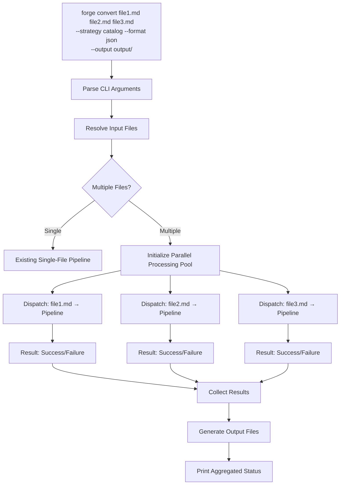
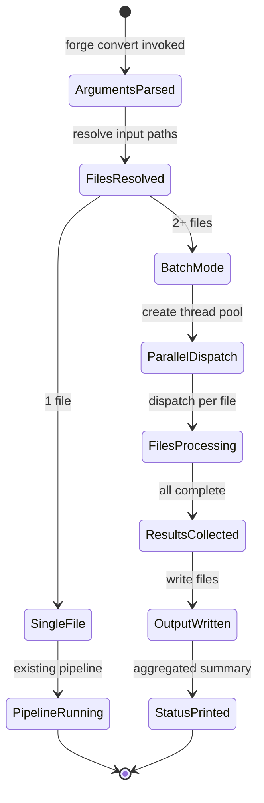
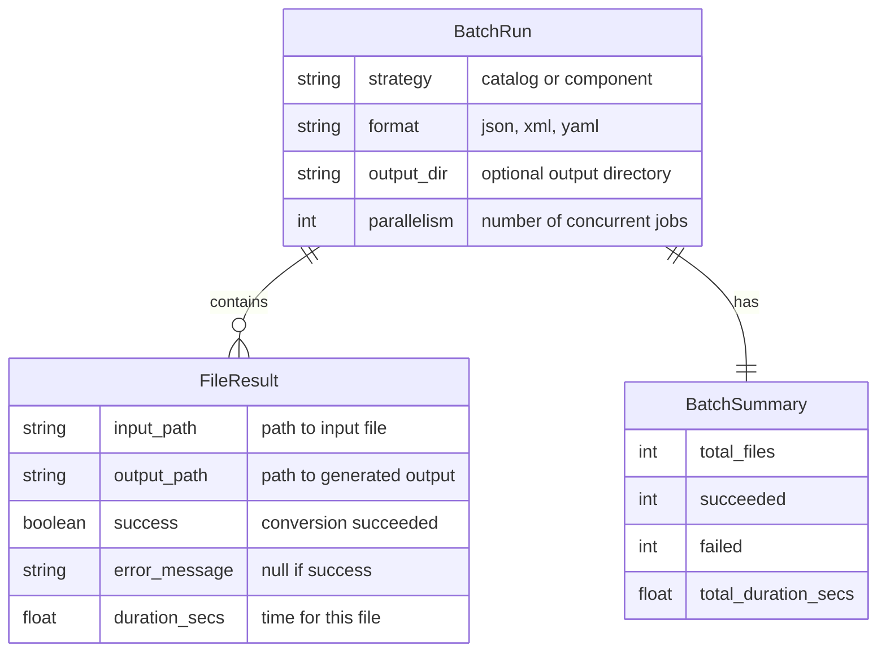
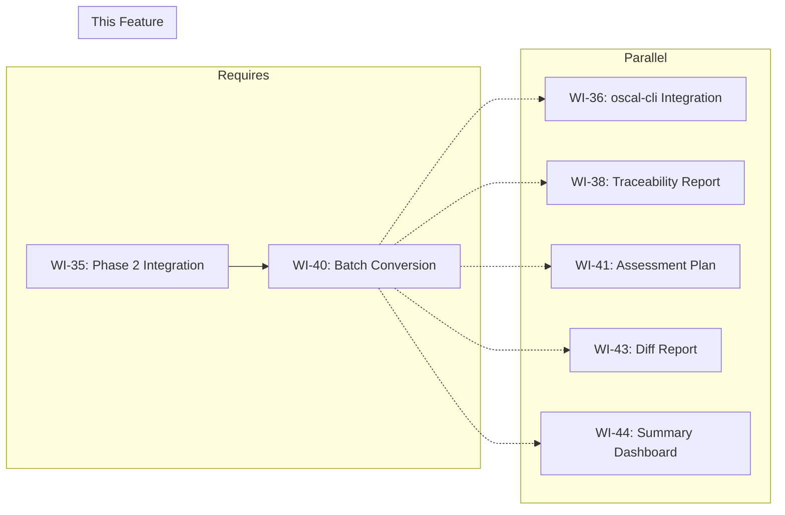

# 040-prd-batch-conversion

> **Document Type:** Product Requirements Document
> **Audience:** LLM agents, human reviewers
> **Status:** Draft
> **Last Updated:** 2026-02-10 <!-- @auto -->
> **Owner:** Brian Luby <!-- @human-required -->

**Feature Branch**: `040-batch-conversion`
**Created**: 2026-02-10
**Status**: Draft
**Input**: Derived from FORGE Product Roadmap WI-40

---

## Review Tier Legend

| Marker | Tier | Speckit Behavior |
|--------|------|------------------|
| 🔴 `@human-required` | Human Generated | Prompt human to author; blocks until complete |
| 🟡 `@human-review` | LLM + Human Review | LLM drafts → prompt human to confirm/edit; blocks until confirmed |
| 🟢 `@llm-autonomous` | LLM Autonomous | LLM completes; no prompt; logged for audit |
| ⚪ `@auto` | Auto-generated | System fills (timestamps, links); no prompt |

---

## Document Completion Order

> ⚠️ **For LLM Agents:** Complete sections in this order. Do not fill downstream sections until upstream human-required inputs exist.

1. **Context** (Background, Scope) → requires human input first
2. **Problem Statement & User Scenarios** → requires human input
3. **Requirements** (Must/Should/Could/Won't) → requires human input
4. **Technical Constraints** → human review
5. **Diagrams, Data Model, Interface** → LLM can draft after above exist
6. **Acceptance Criteria** → derived from requirements
7. **Everything else** → can proceed

---

## Context

### Background 🔴 `@human-required`
This PRD covers **WI-40: Batch Conversion** from the FORGE Product Roadmap (Sprint S-40, Dec 1 2026, Theme T-6: Ecosystem, Milestone MS-7). Through WI-35, the FORGE CLI supports converting a single policy document per invocation (`forge convert policy.md --strategy catalog --format json`). Organizations typically maintain multiple policy documents (e.g., access control policy, incident response policy, data classification policy), and converting them one at a time is tedious and error-prone. WI-40 adds batch conversion support, allowing multiple input files in a single `forge convert` invocation. This fulfills Parent PRD requirement C-1: "The CLI could support batch conversion of multiple policy documents in a single invocation." Batch conversion should leverage parallel processing where possible and provide aggregated status output showing the result of each file conversion.

**Confidence Level:** :orange_circle: Phase 3 — Exploratory. This work item is in the Phase 3 Ecosystem batch. Requirements may evolve as batch processing use cases are validated with real-world policy document sets.

### Scope Boundaries 🟡 `@human-review`

**In Scope:**
- Supporting multiple input files in a single `forge convert` invocation: `forge convert policy1.md policy2.md --strategy catalog`
- Parallel processing of independent conversions where possible
- Aggregated status output showing per-file success/failure results
- Per-file output naming when `--output` specifies a directory
- Glob pattern support for input file selection (e.g., `forge convert policies/*.md`)

**Out of Scope:**
- Merging multiple policy documents into a single OSCAL artifact — each input produces its own output
- Cross-document traceability — deferred to future enhancement
- Batch traceability report generation — deferred to future enhancement combining WI-38/WI-39 with WI-40
- Recursive directory traversal for input files — deferred to future enhancement
- Progress bars or real-time streaming status — deferred to future enhancement

### Glossary 🟡 `@human-review`

| Term | Definition |
|------|------------|
| Batch Conversion | Processing multiple policy documents through the FORGE conversion pipeline in a single CLI invocation |
| Parallel Processing | Executing multiple file conversions concurrently using thread-level parallelism to reduce total processing time |
| Aggregated Status | A summary output showing the conversion result (success or failure with error message) for each input file |
| Output Directory | When `--output` specifies a directory, each converted file is written to that directory with an auto-generated filename |
| Glob Pattern | A wildcard pattern (e.g., `*.md`, `policies/*.md`) used to select multiple input files |

### Related Documents ⚪ `@auto`

| Document | Link | Relationship |
|----------|------|--------------|
| Parent PRD | docs/FORGE_PRD.md | Parent requirement C-1 |
| Product Roadmap | docs/FORGE_PRODUCT_ROADMAP.md | Sprint S-40 context |
| Depends On | WI-35 (Phase 2 integration) | Stable single-file conversion pipeline |
| Product Vision | docs/FORGE_PRODUCT_VISION.md | Strategic goal G-1 |
| Constitution | .specify/memory/constitution.md | Technical constraints and quality gates |

---

## Problem Statement 🔴 `@human-required`

Organizations maintain multiple policy documents that need conversion to OSCAL format. With the current single-file CLI (`forge convert policy.md`), converting a set of 10 or 20 policies requires 10 or 20 separate invocations, each needing the same flags (`--strategy`, `--format`, `--output`). This is repetitive, error-prone (flags may be inconsistent across invocations), and slow (no parallelism between conversions). Shell scripting can work around this, but it places the burden on the user and does not provide aggregated status reporting. WI-40 addresses this by supporting multiple input files in a single invocation, applying the same conversion strategy and format to all inputs, processing them in parallel where possible, and producing an aggregated status output showing which files succeeded and which failed with error details. This makes FORGE practical for organizations with multi-document policy suites and satisfies Parent PRD C-1.

---

## User Scenarios & Testing 🔴 `@human-required`

### User Story 1 — Convert Multiple Policy Documents (Priority: P1)

A compliance engineer converts multiple policy documents to OSCAL format in a single command.

> As a compliance engineer, I want to run `forge convert policy1.md policy2.md policy3.md --strategy catalog --format json` and have all three documents converted so that I can process my entire policy suite efficiently.

**Why this priority**: This is the core purpose of WI-40 and directly satisfies Parent PRD C-1. Without batch conversion, multi-document policy suites require tedious per-file invocation.

**Independent Test**: Run `forge convert policy1.md policy2.md policy3.md --strategy catalog --format json --output output/` and verify three OSCAL Catalog JSON files are produced in the `output/` directory.

**Acceptance Scenarios**:
1. **Given** three Markdown policy files and `--output output/`, **When** running `forge convert policy1.md policy2.md policy3.md --strategy catalog --format json --output output/`, **Then** three OSCAL Catalog JSON files are created in the `output/` directory with names derived from the input filenames.
2. **Given** multiple input files and no `--output` flag, **When** running `forge convert policy1.md policy2.md --strategy catalog --format json`, **Then** each OSCAL Catalog JSON is printed to stdout separated by a delimiter or written to individual files with auto-generated names.

---

### User Story 2 — Aggregated Status Output (Priority: P1)

A compliance engineer reviews the conversion results for all files in a single summary.

> As a compliance engineer, I want an aggregated status summary after batch conversion so that I can see which files succeeded and which failed without scrolling through individual outputs.

**Why this priority**: Without aggregated status, the user cannot quickly determine if all conversions succeeded. This is essential for operational confidence.

**Independent Test**: Run a batch conversion where one of three files has a parsing error, and verify the aggregated status shows 2 successes and 1 failure with the error message.

**Acceptance Scenarios**:
1. **Given** three input files where one contains invalid Markdown structure, **When** running batch conversion, **Then** the aggregated status output shows 2 successes and 1 failure, with the failure entry including the filename and error message.
2. **Given** all input files are valid, **When** running batch conversion, **Then** the aggregated status shows all files as successful with a summary count.

---

### User Story 3 — Parallel Processing for Performance (Priority: P2)

A developer benefits from parallel processing when converting a large batch of policy documents.

> As a developer, I want batch conversion to process files in parallel where possible so that converting a large policy suite is faster than sequential processing.

**Why this priority**: Parallel processing is a performance enhancement. The core batch functionality (US-1, US-2) is higher priority, but parallelism makes batch conversion practical for large document sets.

**Independent Test**: Run a batch conversion of 10 policy files and verify the total time is less than 10x the single-file conversion time (demonstrating parallelism).

**Acceptance Scenarios**:
1. **Given** 10 independent Markdown policy files, **When** running batch conversion, **Then** the total conversion time is significantly less than 10x the single-file time (parallel processing engaged).
2. **Given** parallel processing is active, **When** one file conversion fails, **Then** other file conversions are not affected and continue to completion.

---

### User Story 4 — Glob Pattern Input (Priority: P2)

A compliance engineer uses a glob pattern to select input files.

> As a compliance engineer, I want to use `forge convert policies/*.md --strategy catalog` to convert all Markdown files in a directory so that I do not need to list each file individually.

**Why this priority**: Glob patterns are a convenience feature that significantly improves usability for directory-based policy organization.

**Independent Test**: Run `forge convert policies/*.md --strategy catalog --format json --output output/` where `policies/` contains 5 Markdown files, and verify 5 output files are produced.

**Acceptance Scenarios**:
1. **Given** a `policies/` directory with 5 Markdown files, **When** running `forge convert policies/*.md --strategy catalog --format json --output output/`, **Then** 5 OSCAL Catalog JSON files are produced in the `output/` directory.
2. **Given** a glob pattern that matches no files, **When** running `forge convert empty_dir/*.md`, **Then** a descriptive error is displayed indicating no files matched the pattern.

---

## Assumptions & Risks 🟡 `@human-review`

### Assumptions
- [A-1] The existing single-file conversion pipeline (WI-13 for Catalog, WI-18 for Component) is stable and can be invoked multiple times independently.
- [A-2] Each input file produces its own independent OSCAL artifact — no cross-document merging or linking.
- [A-3] The shell expands glob patterns before passing arguments to the CLI (standard shell behavior), so FORGE receives individual file paths.
- [A-4] The `--output` flag, when used with multiple inputs, must specify a directory (not a single file path).
- [A-5] Rayon or similar parallel processing crate is available for thread-level parallelism in Rust.

### Risks
| ID | Risk | Likelihood | Impact | Mitigation |
|----|------|------------|--------|------------|
| R-1 | Parallel processing introduces non-deterministic output ordering | Med | Low | Collect results and sort by input filename before displaying aggregated status |
| R-2 | One file conversion failure causes panic that terminates the entire batch | Low | High | Use `catch_unwind` or isolated error handling per file; never let one failure abort others |
| R-3 | Stdout output for multiple files is interleaved and unreadable | Med | Med | When multiple files are converted without `--output`, buffer each file's output and write sequentially, or require `--output` for batch mode |
| R-4 | Large batch sizes exhaust system resources (file handles, memory) | Low | Med | Limit parallelism to a configurable thread pool size; default to number of CPU cores |

---

## Feature Overview

### Flow Diagram 🟡 `@human-review`



### State Diagram (if applicable) 🟡 `@human-review`



---

## Requirements

### Must Have (M) — MVP, launch blockers 🔴 `@human-required`
- [ ] **M-1:** The `forge convert` subcommand shall accept multiple input file paths in a single invocation. *(Traces to: Parent PRD C-1)*
- [ ] **M-2:** Each input file shall be independently converted through the existing pipeline (Catalog or Component), producing its own OSCAL artifact. *(Traces to: Parent PRD C-1)*
- [ ] **M-3:** When `--output` specifies a directory and multiple inputs are provided, each output file shall be written to that directory with a filename derived from the input filename (e.g., `policy1.json`). *(Traces to: practical output management)*
- [ ] **M-4:** An aggregated status summary shall be printed to stderr after all conversions complete, showing per-file success/failure with error messages for failures. *(Traces to: operational visibility)*
- [ ] **M-5:** A failure in one file's conversion shall not prevent other files from being converted. *(Traces to: batch resilience)*
- [ ] **M-6:** The CLI shall exit with a non-zero status code if any file in the batch fails conversion. *(Traces to: CI/script integration)*

### Should Have (S) — High value, not blocking 🔴 `@human-required`
- [ ] **S-1:** Batch conversion should process files in parallel using a thread pool, with parallelism limited to the number of available CPU cores by default.
- [ ] **S-2:** A `--jobs <n>` flag should allow the user to control the degree of parallelism (number of concurrent conversions).
- [ ] **S-3:** When multiple inputs are provided without `--output`, each output should be written to an auto-generated filename in the current directory (e.g., `policy1.json`) rather than interleaved on stdout.
- [ ] **S-4:** The aggregated status summary should include total file count, success count, failure count, and total processing time.

### Could Have (C) — Nice to have, if time permits 🟡 `@human-review`
- [ ] **C-1:** A `--continue-on-error` flag could control whether batch conversion continues after a failure (default: continue) or stops at the first failure.
- [ ] **C-2:** A `--dry-run` flag could list the files that would be converted without actually running the pipeline.
- [ ] **C-3:** The aggregated status output could be available in JSON format via `--status-format json` for programmatic consumption.

### Won't Have (W) — Explicitly deferred 🟡 `@human-review`
- [ ] **W-1:** Merging multiple policy documents into a single OSCAL artifact — *Reason: Each document produces its own artifact; merging requires cross-document semantics*
- [ ] **W-2:** Recursive directory traversal for input discovery — *Reason: Glob patterns and explicit file lists are sufficient for MVP*
- [ ] **W-3:** Progress bars or real-time streaming status during batch conversion — *Reason: Adds terminal UI complexity; aggregated summary after completion is sufficient*
- [ ] **W-4:** Cross-document traceability or inter-document linking — *Reason: Each document is converted independently; cross-document features are a future capability*
- [ ] **W-5:** Batch traceability report (`forge trace` on multiple artifacts) — *Reason: WI-38/WI-39 operate on single artifacts; batch trace is a future enhancement*

---

## Technical Constraints 🟡 `@human-review`

- **Language/Framework:** Rust (latest stable), Cargo build system
- **CLI Framework:** clap 4.x — extend `convert` subcommand to accept multiple positional arguments
- **Parallelism:** `rayon` crate for data-parallel iteration, or `std::thread` for manual thread pool
- **Output Naming:** When `--output` is a directory, derive output filename from input: `{input_stem}.{format}` (e.g., `policy1.md` → `policy1.json`)
- **Error Handling:** Per-file error isolation using `Result` types; aggregate errors for final status; `thiserror` for error types
- **Status Output:** Aggregated status to stderr (not stdout) to avoid mixing with OSCAL output
- **Linting:** `cargo clippy -- -D warnings` must pass
- **Formatting:** `cargo fmt --check` must produce no violations
- **Testing:** TDD mandatory; unit tests for multi-file argument parsing, output naming, and result aggregation; integration test for parallel processing

---

## Data Model (if applicable) 🟡 `@human-review`



---

## Interface Contract (if applicable) 🟡 `@human-review`

```rust
// CLI Interface (WI-40 extensions to forge convert)

// forge convert <input>... --strategy <catalog|component> --format <json|xml|yaml>
//   [--output <dir>] [--jobs <n>]
//
// Examples:
//   forge convert policy1.md policy2.md --strategy catalog --format json
//   forge convert policies/*.md --strategy catalog --format json --output output/
//   forge convert policy1.md policy2.md --strategy catalog --format json --jobs 4

/// Result of converting a single file in a batch
pub struct FileResult {
    /// Path to the input file
    pub input_path: PathBuf,
    /// Path to the generated output file (if successful)
    pub output_path: Option<PathBuf>,
    /// Whether the conversion succeeded
    pub success: bool,
    /// Error message if conversion failed
    pub error_message: Option<String>,
    /// Duration of this file's conversion
    pub duration: std::time::Duration,
}

/// Summary of a batch conversion run
pub struct BatchSummary {
    pub total_files: usize,
    pub succeeded: usize,
    pub failed: usize,
    pub total_duration: std::time::Duration,
    pub results: Vec<FileResult>,
}

/// Run batch conversion on multiple input files
pub fn run_batch_conversion(
    input_paths: &[PathBuf],
    strategy: &str,
    format: &str,
    output_dir: Option<&Path>,
    parallelism: usize,
) -> BatchSummary;

/// Derive output filename from input path and format
pub fn derive_output_path(
    input_path: &Path,
    format: &str,
    output_dir: Option<&Path>,
) -> PathBuf;

/// Format aggregated status summary for display
pub fn format_batch_summary(summary: &BatchSummary) -> String;
```

---

## Evaluation Criteria 🟡 `@human-review`

| Criterion | Weight | Metric | Target | Notes |
|-----------|--------|--------|--------|-------|
| Multi-file conversion | Critical | Multiple files converted in single invocation | All files processed | Core deliverable |
| Error isolation | Critical | One failure does not abort other conversions | 100% isolation | Batch resilience |
| Aggregated status | Critical | Summary shows per-file results | All files reported | Operational visibility |
| Output file naming | High | Output filenames derived from input filenames | Predictable naming | User expectation |
| Parallelism benefit | High | Batch is faster than sequential | Measurable speedup on multi-core | Performance value |

---

## Tool/Approach Candidates 🟡 `@human-review`

| Option | License | Pros | Cons | Spike Result |
|--------|---------|------|------|--------------|
| rayon crate | MIT/Apache-2.0 | Easy data-parallel iteration with par_iter(); automatic thread pool | Additional dependency | Selected for parallel processing |
| std::thread manual pool | N/A | No dependency; full control | More boilerplate; must manage thread pool manually | Fallback if rayon is too heavy |
| tokio async runtime | MIT | Async I/O for file operations | Over-engineered for CPU-bound pipeline; adds async complexity | Not selected |

### Selected Approach 🔴 `@human-required`
> **Decision:** Use `rayon` for parallel file processing with `par_iter()` over input paths; derive output filenames from input stems; collect results into `BatchSummary` for aggregated status; print status to stderr.
> **Rationale:** Rayon provides effortless data-parallel iteration with automatic thread pool management, which is ideal for processing independent file conversions. Output filename derivation is deterministic and predictable. Status on stderr keeps OSCAL output on stdout clean (for single-file mode backward compatibility).

---

## Acceptance Criteria 🟡 `@human-review`

| AC ID | Requirement | User Story | Given | When | Then |
|-------|-------------|------------|-------|------|------|
| AC-1 | M-1, M-2 | US-1 | Three Markdown policy files | Running `forge convert policy1.md policy2.md policy3.md --strategy catalog --format json --output output/` | Three OSCAL Catalog JSON files are produced in the `output/` directory |
| AC-2 | M-3 | US-1 | Three input files and `--output output/` | Checking output filenames | Files are named `policy1.json`, `policy2.json`, `policy3.json` |
| AC-3 | M-4 | US-2 | Three input files where one has a parsing error | Running batch conversion | Aggregated status shows 2 successes, 1 failure with error message |
| AC-4 | M-5 | US-2 | Three input files where the second fails | Running batch conversion | Files 1 and 3 are successfully converted despite file 2's failure |
| AC-5 | M-6 | US-2 | A batch where one file fails | Checking exit code | The CLI exits with non-zero status code |
| AC-6 | S-1 | US-3 | Ten independent Markdown policy files | Running batch conversion | Total time is less than 10x single-file time (parallel processing engaged) |
| AC-7 | M-1 | US-4 | A `policies/` directory with 5 Markdown files | Running `forge convert policies/*.md --strategy catalog --format json --output output/` | 5 output files are produced |
| AC-8 | S-4 | US-2 | A completed batch conversion | Inspecting the aggregated status | Summary shows total count, success count, failure count, and total time |

### Edge Cases 🟢 `@llm-autonomous`
- [ ] **EC-1:** (M-1) When only one input file is provided, then the behavior is identical to the existing single-file conversion (backward compatible).
- [ ] **EC-2:** (M-1) When zero input files are provided (e.g., glob matches nothing), then the CLI exits with a descriptive error indicating no input files.
- [ ] **EC-3:** (M-3) When two input files have the same name but different directories (e.g., `dir1/policy.md` and `dir2/policy.md`), then the output files must not collide (e.g., prefix with directory name or add a numeric suffix).
- [ ] **EC-4:** (M-3) When `--output` is a file path (not a directory) and multiple inputs are provided, then the CLI exits with an error indicating `--output` must be a directory for batch mode.
- [ ] **EC-5:** (M-5) When all files in the batch fail, then the aggregated status shows all failures and the exit code is non-zero.
- [ ] **EC-6:** (M-3) When the `--output` directory does not exist, then it is created automatically.
- [ ] **EC-7:** (S-1) When `--jobs 1` is specified, then files are processed sequentially (no parallelism).

---

## Dependencies 🟡 `@human-review`



- **Requires:** [WI-35: Phase 2 Integration](docs/PRD/035-prd-phase2-integration.md) (stable single-file conversion pipeline)
- **Blocks:** None directly
- **Parallel With:** [WI-36: oscal-cli Integration], [WI-38: Traceability Report], [WI-41: Assessment Plan], [WI-43: Diff Report], [WI-44: Summary Dashboard]
- **External:** None

---

## Security Considerations 🟡 `@human-review`

| Aspect | Assessment | Notes |
|--------|------------|-------|
| Internet Exposure | No | CLI tool, no network services |
| Sensitive Data | Yes | Batch conversion processes multiple policy documents which may contain sensitive operational details |
| Authentication Required | No | Local CLI tool |
| Security Review Required | No | This WI extends existing conversion with multi-file support; no new parsing or input processing logic beyond file path handling |

Additional security notes:
- Multiple input file paths are user-provided and should be validated (file exists, readable) before processing.
- The `--output` directory path is user-provided; standard `std::fs::create_dir_all()` is safe for directory creation.
- Parallel processing does not introduce shared mutable state — each file conversion is independent.

---

## Implementation Guidance 🟢 `@llm-autonomous`

### Suggested Approach
Modify the clap definition for the `convert` subcommand to accept multiple positional arguments (`Vec<PathBuf>` instead of `PathBuf`). When more than one input is provided, enter batch mode. In batch mode: (1) validate all input files exist and are readable, (2) determine output paths using `derive_output_path` (input stem + format extension, placed in `--output` directory or current directory), (3) use `rayon::par_iter()` to process files in parallel, calling the existing single-file pipeline for each, (4) collect `FileResult`s into a `Vec`, (5) build a `BatchSummary` from the results, (6) print the formatted summary to stderr, (7) exit with code 0 if all succeeded, non-zero if any failed. For single-file input, the behavior is unchanged from prior WIs (backward compatible). Handle the filename collision edge case (EC-3) by appending a numeric suffix when two input files would produce the same output filename.

### Anti-patterns to Avoid
- Modifying the single-file pipeline to be "batch-aware" — the pipeline should remain a pure function that converts one file; batch orchestration wraps it
- Printing OSCAL output to stdout for multiple files — stdout output is only appropriate for single-file mode; batch mode must use file output
- Ignoring failures silently — every file result must be captured and reported in the aggregated status
- Using `unwrap()` or `expect()` in per-file processing — a panic in one thread terminates the entire batch
- Creating output files before validation — validate all inputs first, then process; avoids partial output from validation failures

### Reference Examples
- Rayon `par_iter()` examples: https://docs.rs/rayon/latest/rayon/
- clap multiple values: `#[arg(num_args = 1..)]` for accepting multiple positional arguments
- Standard batch processing patterns in CLI tools (e.g., `rustfmt` processes multiple files)

---

## Spike Tasks 🟡 `@human-review`

N/A — Rayon is a well-established Rust crate for parallel iteration, and the batch conversion pattern is straightforward. No spike tasks are needed.

---

## Success Metrics 🔴 `@human-required`

| Metric | Baseline | Target | Measurement Method |
|--------|----------|--------|-------------------|
| Batch conversion works | Single-file only | Multiple files in single invocation | Automated tests |
| Error isolation | N/A | One failure does not abort batch | Test with mixed valid/invalid files |
| Aggregated status | N/A | Per-file results with summary | Manual verification + tests |
| Parallel speedup | Sequential processing | Measurable speedup on multi-core | Benchmark with 10+ files |

### Technical Verification 🟢 `@llm-autonomous`
| Metric | Target | Verification Method |
|--------|--------|---------------------|
| Test coverage for batch logic | >90% | `cargo test` + coverage tool |
| No clippy warnings | 0 | `cargo clippy -- -D warnings` |
| No formatting violations | 0 | `cargo fmt --check` |
| Single-file backward compatibility | 100% | Existing single-file tests still pass |
| Error isolation test | All files report status regardless of individual failures | Integration test with mixed inputs |

---

## Definition of Ready 🔴 `@human-required`

### Readiness Checklist
- [x] Problem statement reviewed and validated by stakeholder
- [x] All Must Have requirements have acceptance criteria
- [x] Technical constraints are explicit and agreed
- [x] Dependencies identified and owners confirmed
- [x] Security review completed (or N/A documented with justification)
- [x] No open questions blocking implementation

### Sign-off
| Role | Name | Date | Decision |
|------|------|------|----------|
| Product Owner | Brian Luby | YYYY-MM-DD | [Ready / Not Ready] |

---

## Changelog ⚪ `@auto`

| Version | Date | Author | Changes |
|---------|------|--------|---------|
| 0.1 | 2026-02-10 | LLM (Claude) | Initial draft derived from FORGE Product Roadmap WI-40 |

---

## Decision Log 🟡 `@human-review`

| Date | Decision | Rationale | Alternatives Considered |
|------|----------|-----------|------------------------|
| 2026-02-10 | Use rayon for parallel file processing | Rayon provides effortless data parallelism with par_iter(); automatic thread pool management; well-tested in the Rust ecosystem | Manual std::thread pool (more boilerplate); tokio async (over-engineered for CPU-bound work); sequential processing (no performance benefit) |
| 2026-02-10 | Print aggregated status to stderr, not stdout | Stdout may contain OSCAL output in single-file mode; mixing status and data on stdout breaks piping; stderr is the conventional channel for status messages | Stdout for everything (breaks piping); separate status file (adds complexity); no status output (poor UX) |
| 2026-02-10 | Require --output directory for batch mode, auto-generate filenames | Predictable output location and naming; avoids stdout interleaving; consistent with user expectations from other batch tools | Allow stdout for multiple files (interleaving issues); require explicit per-file --output (defeats batch purpose); single merged output file (violates one-artifact-per-input principle) |
| 2026-02-10 | Continue processing on individual file failure (default behavior) | Batch operations should be resilient; aborting on first failure wastes the work already done on other files | Abort on first failure (wastes work); configurable via --continue-on-error (deferred to C-1) |

---

## Open Questions 🟡 `@human-review`

No open questions for this work item.

---

## Review Checklist 🟢 `@llm-autonomous`

Before marking as Approved:
- [x] All requirements have unique IDs (M-1 through M-6, S-1 through S-4, C-1 through C-3, W-1 through W-5)
- [x] All Must Have requirements have linked acceptance criteria
- [x] User stories are prioritized and independently testable
- [x] Acceptance criteria reference both requirement IDs and user stories
- [x] Glossary terms are used consistently throughout
- [x] Diagrams use terminology from Glossary
- [x] Security considerations documented
- [x] Definition of Ready checklist is complete
- [x] No open questions blocking implementation
