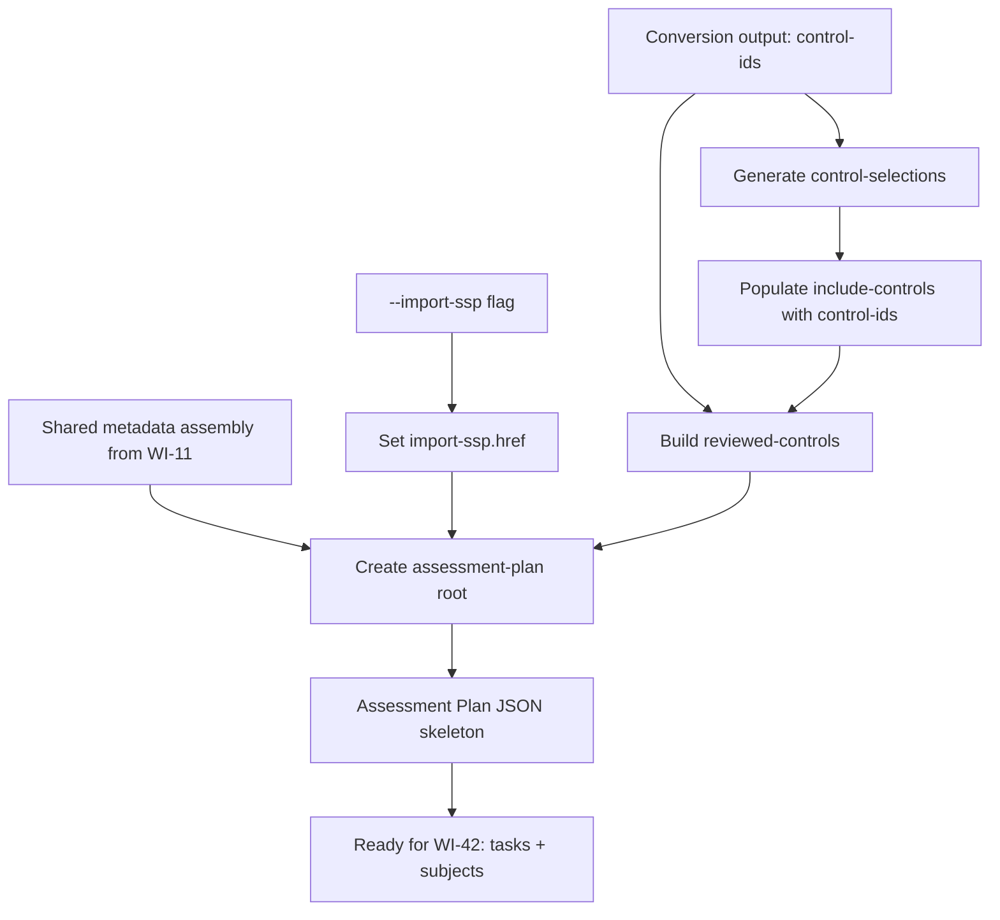
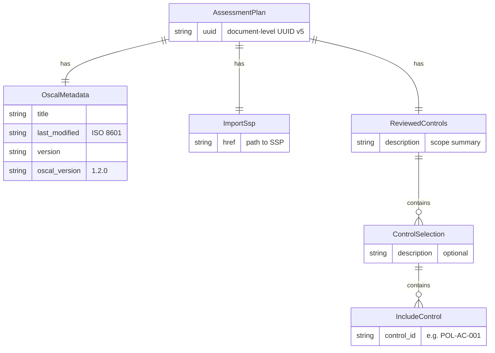
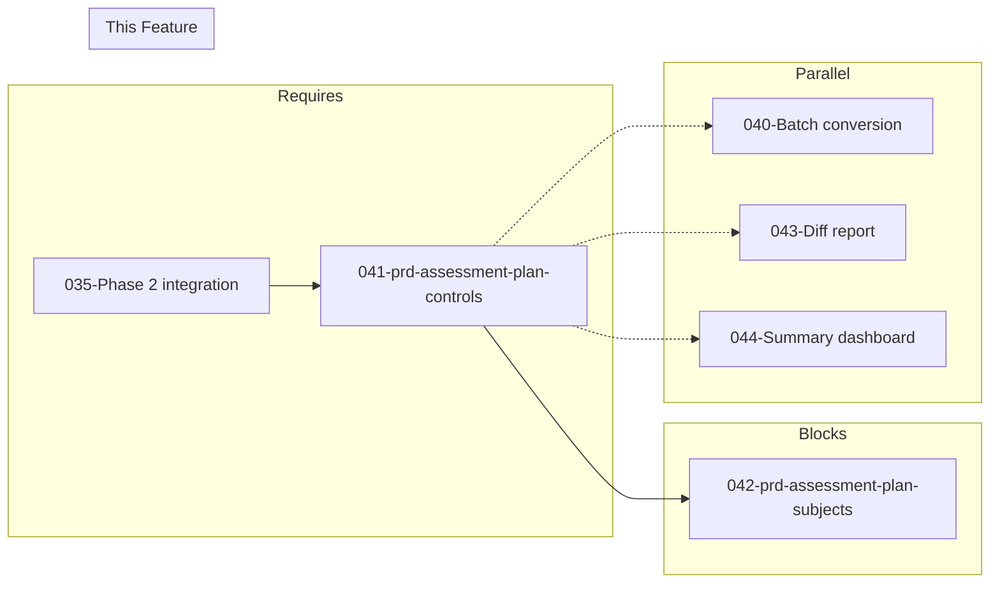

# 041-prd-assessment-plan-controls

> **Document Type:** Product Requirements Document
> **Audience:** LLM agents, human reviewers
> **Status:** Draft
> **Last Updated:** 2026-02-10 <!-- @auto -->
> **Owner:** Brian Luby <!-- @human-required -->

**Feature Branch**: `041-assessment-plan-controls`
**Created**: 2026-02-10
**Status**: Draft
**Input**: Derived from FORGE Product Roadmap WI-41

---

## Review Tier Legend

| Marker | Tier | Speckit Behavior |
|--------|------|------------------|
| 🔴 `@human-required` | Human Generated | Prompt human to author; blocks until complete |
| 🟡 `@human-review` | LLM + Human Review | LLM drafts → prompt human to confirm/edit; blocks until confirmed |
| 🟢 `@llm-autonomous` | LLM Autonomous | LLM completes; no prompt; logged for audit |
| ⚪ `@auto` | Auto-generated | System fills (timestamps, links); no prompt |

---

## Document Completion Order

> ⚠️ **For LLM Agents:** Complete sections in this order. Do not fill downstream sections until upstream human-required inputs exist.

1. **Context** (Background, Scope) → requires human input first
2. **Problem Statement & User Scenarios** → requires human input
3. **Requirements** (Must/Should/Could/Won't) → requires human input
4. **Technical Constraints** → human review
5. **Diagrams, Data Model, Interface** → LLM can draft after above exist
6. **Acceptance Criteria** → derived from requirements
7. **Everything else** → can proceed

---

## Context

### Background 🔴 `@human-required`
This PRD covers **WI-41: Assessment Plan Scaffolding — Controls** from the FORGE Product Roadmap (Sprint S-41, Dec 8–12 2026, Theme T-6: Ecosystem & Community, Milestone MS-7). This is a Phase 3 "Exploratory" confidence level work item. The OSCAL Assessment Plan model (`assessment-plan`) describes planned assessment activities, objectives, scope, and resources. It sits in the Assessment layer of the OSCAL architecture, importing an SSP reference and defining what controls will be reviewed and how. WI-41 generates the Assessment Plan skeleton from the policy/catalog output, populating `reviewed-controls` with `control-selections` derived from the controls generated in prior pipeline stages, and linking an `import-ssp` reference. This is the first of two Assessment Plan work items — WI-42 adds tasks and assessment-subjects to complete the scaffold.

Parent PRD C-2: "The CLI could generate Assessment Plan skeletons with reviewed-controls and assessment tasks derived from policy requirements."

### Scope Boundaries 🟡 `@human-review`

**In Scope:**
- Generating the Assessment Plan JSON skeleton with root key `assessment-plan`
- Assembling OSCAL metadata (uuid, title, last-modified, version, oscal-version) reusing the shared metadata pattern from WI-11
- Populating the `import-ssp` reference with a user-provided SSP path (via CLI flag)
- Generating `reviewed-controls` with `control-selections` derived from the Catalog or Component Definition controls
- Generating `control-selections` entries with `include-controls` referencing control-ids from the conversion output
- Producing deterministic UUIDs for Assessment Plan elements using WI-7 UUID infrastructure

**Out of Scope:**
- Assessment `tasks[]` generation — deferred to WI-42 (042-prd-assessment-plan-subjects)
- `assessment-subjects` generation — deferred to WI-42
- Full OSCAL AP schema validation — deferred to WI-19 pattern (schema validation)
- SSP generation itself — deferred to WI-45/WI-46
- Assessment Results or POA&M generation — not in current roadmap scope
- `assessment-assets` or `assessment-platform` population — future extension

### Glossary 🟡 `@human-review`

| Term | Definition |
|------|------------|
| Assessment Plan | OSCAL model (`assessment-plan`) describing planned assessment activities, reviewed controls, subjects, and resources |
| reviewed-controls | A structure within the Assessment Plan that identifies which controls from the imported SSP will be assessed |
| control-selections | An entry within reviewed-controls that specifies which controls are included (or excluded) for assessment |
| include-controls | An array within control-selections listing specific control-ids to be assessed |
| import-ssp | A reference (href) in the Assessment Plan pointing to the System Security Plan being assessed |
| control-id | The identifier of a control from the source catalog or baseline (e.g., "POL-AC-001") |
| Assessment Plan Scaffold | A structurally valid but incomplete Assessment Plan that provides the framework for assessors to complete |

### Related Documents ⚪ `@auto`

| Document | Link | Relationship |
|----------|------|--------------|
| Parent PRD | docs/FORGE_PRD.md | Parent requirement C-2 |
| Product Roadmap | docs/FORGE_PRODUCT_ROADMAP.md | Sprint S-41 context |
| OSCAL Research | docs/research/OSCAL_Research.md | Assessment Plan model guidance |
| Product Vision | docs/FORGE_PRODUCT_VISION.md | Strategic goal G-3, G-4 |
| Constitution | .specify/memory/constitution.md | Technical constraints and quality gates |

---

## Problem Statement 🔴 `@human-required`

After FORGE generates Catalogs and Component Definitions (Phases 1–2), compliance teams still need to manually create Assessment Plans to define what controls will be reviewed and how. The Assessment Plan is a critical OSCAL artifact that bridges the gap between control documentation and actual assessment activities. Without automated scaffolding, assessors must manually enumerate every control from the SSP into the Assessment Plan's reviewed-controls structure — a tedious, error-prone process that FORGE can automate. By generating an Assessment Plan skeleton with reviewed-controls derived from the same policy requirements that produced the Catalog or Component Definition, FORGE provides a consistent, traceable path from policy authoring through assessment planning. This work item addresses Parent PRD C-2 by producing the control-selection portion of the Assessment Plan scaffold.

---

## User Scenarios & Testing 🔴 `@human-required`

### User Story 1 — Generate Assessment Plan with Reviewed Controls (Priority: P1)

A compliance engineer generates an Assessment Plan skeleton that lists all controls from a converted policy as reviewed-controls, ready for an assessor to refine.

> As a compliance engineer, I want to generate an Assessment Plan skeleton with reviewed-controls populated from my policy conversion output so that assessors have a structured starting point that covers all policy-derived controls.

**Why this priority**: This is the core function of WI-41 — producing the reviewed-controls structure that defines the scope of assessment. Without this, the Assessment Plan has no control coverage and provides no value to assessors.

**Independent Test**: Convert a policy with 10 controls, generate an Assessment Plan, and verify that `reviewed-controls.control-selections` includes all 10 control-ids in `include-controls`.

**Acceptance Scenarios**:
1. **Given** a conversion output with 10 controls and an SSP reference path, **When** generating the Assessment Plan, **Then** the output contains `reviewed-controls` with `control-selections` listing all 10 control-ids in `include-controls`.
2. **Given** a conversion output, **When** generating the Assessment Plan, **Then** the `import-ssp.href` field matches the user-provided SSP path.

---

### User Story 2 — Link Import-SSP Reference (Priority: P1)

A compliance engineer specifies the SSP that the Assessment Plan references using a CLI flag.

> As a compliance engineer, I want to specify the SSP reference for the Assessment Plan so that the generated artifact correctly links to the system context being assessed.

**Why this priority**: The `import-ssp` is a required structural element of the OSCAL Assessment Plan — without it, the plan has no system context and is structurally incomplete.

**Independent Test**: Generate an Assessment Plan with `--import-ssp ./ssp/system-ssp.json` and verify the `import-ssp.href` field equals that path.

**Acceptance Scenarios**:
1. **Given** an SSP path of `./ssp/system-ssp.json`, **When** generating the Assessment Plan, **Then** `import-ssp.href` equals `"./ssp/system-ssp.json"`.
2. **Given** no `--import-ssp` flag provided, **When** generating an Assessment Plan, **Then** a descriptive error indicates that `--import-ssp` is required.

---

### User Story 3 — Deterministic Assessment Plan UUIDs (Priority: P2)

The Assessment Plan and its elements receive deterministic UUIDs for stability across re-generations.

> As a developer working on FORGE, I want Assessment Plan UUIDs to be deterministic so that re-generating from the same input produces identical identifiers, enabling meaningful diffs and stable references.

**Why this priority**: UUID stability is a cross-cutting requirement (Parent PRD M-8) that must be maintained across all generated OSCAL artifacts.

**Independent Test**: Generate an Assessment Plan from the same input twice and verify all UUIDs are identical across runs.

**Acceptance Scenarios**:
1. **Given** the same conversion output and SSP reference, **When** generating the Assessment Plan twice, **Then** all UUIDs are identical across both runs.
2. **Given** a change in the control set, **When** re-generating the Assessment Plan, **Then** the document-level UUID and affected control-selection UUIDs change accordingly.

---

## Assumptions & Risks 🟡 `@human-review`

### Assumptions
- [A-1] The Catalog and/or Component Definition pipeline (Phases 1–2) produces a list of control-ids that can be consumed by the Assessment Plan builder.
- [A-2] The `import-ssp` reference is a simple href string provided by the user — no SSP content is read or validated at this stage.
- [A-3] A single `reviewed-controls` entry with one `control-selections` block is sufficient for the initial scaffold; multiple selection groups are a future extension.
- [A-4] UUID v5 generation from WI-7 is available and can be applied to Assessment Plan elements.
- [A-5] The OSCAL v1.2.0 Assessment Plan JSON structure is stable and well-documented by NIST.

### Risks
| ID | Risk | Likelihood | Impact | Mitigation |
|----|------|------------|--------|------------|
| R-1 | Assessment Plan schema differs from NIST documentation in edge cases | Low | Med | Test against NIST published examples; defer full schema validation to a future work item |
| R-2 | Control-ids from Catalog/Component pipelines may not align with SSP control-ids | Med | Med | Document that SSP and policy conversion must share the same baseline; user is responsible for alignment |
| R-3 | Phase 3 exploratory scope may shift, deferring or cutting this feature | Med | Low | Feature is self-contained and does not block Must Have requirements; can be cut without impact to core pipeline |

---

## Feature Overview

### Flow Diagram 🟡 `@human-review`



### State Diagram (if applicable) 🟡 `@human-review`
N/A — No state transitions in this work item. The builder produces the Assessment Plan skeleton in a single pass.

---

## Requirements

### Must Have (M) — MVP, launch blockers 🔴 `@human-required`
- [ ] **M-1:** The builder shall produce a JSON object with root key `"assessment-plan"` conforming to the OSCAL Assessment Plan model structure. *(Traces to: Parent PRD C-2)*
- [ ] **M-2:** The Assessment Plan shall include required OSCAL metadata: `uuid`, `title`, `last-modified`, `version`, and `oscal-version` set to `"1.2.0"`. *(Traces to: Parent PRD C-2, M-5)*
- [ ] **M-3:** The Assessment Plan shall include an `import-ssp` object with an `href` field set to the value of the `--import-ssp` CLI flag. *(Traces to: Parent PRD C-2)*
- [ ] **M-4:** The Assessment Plan shall include a `reviewed-controls` object containing a `control-selections` array. *(Traces to: Parent PRD C-2)*
- [ ] **M-5:** Each `control-selections` entry shall include an `include-controls` array populated with `control-id` values from the conversion output. *(Traces to: Parent PRD C-2)*
- [ ] **M-6:** The `--import-ssp` flag shall be required when generating an Assessment Plan; omitting it shall produce a descriptive error. *(Traces to: Parent PRD C-2)*
- [ ] **M-7:** All UUIDs in the Assessment Plan shall be generated deterministically using UUID v5, consistent with WI-7 patterns. *(Traces to: Parent PRD M-8)*

### Should Have (S) — High value, not blocking 🔴 `@human-required`
- [ ] **S-1:** The `reviewed-controls` should include a `description` field summarizing the scope of the assessment (e.g., "Controls derived from [Policy Title] for assessment review.").
- [ ] **S-2:** The builder should reuse the metadata assembly function established in WI-11 for generating the document-level metadata block.

### Could Have (C) — Nice to have, if time permits 🟡 `@human-review`
- [ ] **C-1:** The `control-selections` could support `exclude-controls` to allow users to exclude specific controls from the assessment scope via a CLI flag.
- [ ] **C-2:** The Assessment Plan could include `back-matter` resources referencing the source policy document.

### Won't Have (W) — Explicitly deferred 🟡 `@human-review`
- [ ] **W-1:** Assessment `tasks[]` — *Reason: Deferred to WI-42*
- [ ] **W-2:** `assessment-subjects` — *Reason: Deferred to WI-42*
- [ ] **W-3:** OSCAL AP schema validation — *Reason: Deferred to future validation work item*
- [ ] **W-4:** SSP content reading or validation — *Reason: import-ssp is a reference only; SSP generation is WI-45/WI-46*
- [ ] **W-5:** `assessment-assets` or `assessment-platform` — *Reason: Future extension beyond scaffold scope*

---

## Technical Constraints 🟡 `@human-review`

- **Language/Framework:** Rust (latest stable), Cargo build system
- **OSCAL Version:** Target OSCAL v1.2.0 Assessment Plan model
- **Output Format:** JSON (via `serde_json`)
- **UUID Generation:** UUID v5 (deterministic, content-based) consistent with WI-7 pattern
- **Metadata Assembly:** Must reuse the metadata builder from WI-11 (shared across all OSCAL artifacts)
- **Serialization:** `serde` with `#[serde(rename)]` to produce OSCAL-compliant JSON keys (e.g., `assessment-plan`, `import-ssp`, `reviewed-controls`, `control-selections`, `include-controls`)
- **CLI Integration:** `--import-ssp` flag via clap 4.x; new `assess` subcommand or extension to `convert`
- **Error Handling:** `thiserror` for error types; descriptive error when `--import-ssp` is missing
- **Linting:** `cargo clippy -- -D warnings` must pass
- **Formatting:** `cargo fmt --check` must pass
- **Testing:** TDD mandatory; unit tests for Assessment Plan construction and reviewed-controls population

---

## Data Model (if applicable) 🟡 `@human-review`



---

## Interface Contract (if applicable) 🟡 `@human-review`

```rust
/// Build an OSCAL Assessment Plan JSON skeleton from conversion output.
///
/// Produces an assessment-plan root with:
///   - document-level UUID (v5) and metadata
///   - import-ssp reference from CLI flag
///   - reviewed-controls with control-selections populated from control-ids
pub fn build_assessment_plan(
    control_ids: &[String],
    import_ssp_href: &str,
    policy_title: &str,
) -> Result<serde_json::Value, ForgeError>;

// Expected JSON output structure:
// {
//   "assessment-plan": {
//     "uuid": "<document-uuid-v5>",
//     "metadata": {
//       "title": "Assessment Plan for <Policy Title>",
//       "last-modified": "<ISO 8601 timestamp>",
//       "version": "<version>",
//       "oscal-version": "1.2.0"
//     },
//     "import-ssp": {
//       "href": "<from --import-ssp flag>"
//     },
//     "reviewed-controls": {
//       "description": "Controls derived from <Policy Title> for assessment review.",
//       "control-selections": [
//         {
//           "include-controls": [
//             { "control-id": "POL-AC-001" },
//             { "control-id": "POL-AC-002" },
//             ...
//           ]
//         }
//       ]
//     }
//   }
// }
```

---

## Evaluation Criteria 🟡 `@human-review`

| Criterion | Weight | Metric | Target | Notes |
|-----------|--------|--------|--------|-------|
| Reviewed-controls completeness | Critical | All conversion control-ids appear in include-controls | 100% | No controls lost during mapping |
| Import-SSP correctness | Critical | import-ssp.href matches --import-ssp value | 100% | Direct pass-through |
| JSON Structure | Critical | Output matches OSCAL Assessment Plan shape | Matches NIST structure | Root key, metadata, import-ssp, reviewed-controls |
| UUID determinism | High | Same input produces same UUIDs | 100% | Verified by re-generation test |
| Metadata consistency | High | Metadata block follows WI-11 pattern | Consistent with Catalog/Component Definition | Shared assembly function |

---

## Tool/Approach Candidates 🟡 `@human-review`

| Option | License | Pros | Cons | Spike Result |
|--------|---------|------|------|--------------|
| serde_json Value builder | MIT/Apache-2.0 | Consistent with Catalog/Component Definition builders | No compile-time OSCAL shape enforcement | Selected — consistent with established pattern |
| uuid crate (v5) | MIT/Apache-2.0 | Deterministic UUID generation; already used across pipeline | Requires namespace UUID | Already selected in WI-7 |

### Selected Approach 🔴 `@human-required`
> **Decision:** Use `serde_json::Value` builder pattern consistent with the Catalog and Component Definition builders (WI-9/WI-14), with shared metadata assembly from WI-11 and UUID v5 from WI-7.
> **Rationale:** Maintains consistency with the established OSCAL generation pattern across all artifact types. The Assessment Plan is structurally simpler than Catalog or Component Definition, making the Value builder approach well-suited.

---

## Acceptance Criteria 🟡 `@human-review`

| AC ID | Requirement | User Story | Given | When | Then |
|-------|-------------|------------|-------|------|------|
| AC-1 | M-1 | US-1 | A conversion output with control-ids | Calling `build_assessment_plan()` | JSON output has root key `"assessment-plan"` |
| AC-2 | M-2 | US-1 | A policy title and version | Building Assessment Plan | `metadata.title`, `metadata.version`, `metadata.oscal-version` = "1.2.0", `uuid`, and `last-modified` are present and correct |
| AC-3 | M-3 | US-2 | An SSP path `./ssp/system-ssp.json` | Building Assessment Plan | `import-ssp.href` equals `"./ssp/system-ssp.json"` |
| AC-4 | M-4, M-5 | US-1 | A conversion output with 10 control-ids | Building Assessment Plan | `reviewed-controls.control-selections[0].include-controls` contains all 10 control-ids |
| AC-5 | M-6 | US-2 | No `--import-ssp` flag provided | Running Assessment Plan generation | A descriptive error indicates `--import-ssp` is required |
| AC-6 | M-7 | US-3 | The same conversion output and SSP reference | Generating the Assessment Plan twice | All UUIDs are identical across both runs |
| AC-7 | S-1 | US-1 | A policy titled "Corporate Security Policy" | Building Assessment Plan | `reviewed-controls.description` references "Corporate Security Policy" |

### Edge Cases 🟢 `@llm-autonomous`
- [ ] **EC-1:** (M-5) When the conversion output has zero controls, then `include-controls` is an empty array and a warning is emitted indicating no controls to assess.
- [ ] **EC-2:** (M-3) When `--import-ssp` is an empty string, then the CLI exits with an error indicating an invalid SSP path.
- [ ] **EC-3:** (M-5) When duplicate control-ids exist in the conversion output, then `include-controls` contains each control-id only once (deduplicated).
- [ ] **EC-4:** (M-1) When the builder is called, then the output JSON is parseable by `serde_json` and the root key is exactly `"assessment-plan"` (hyphenated, per OSCAL convention).
- [ ] **EC-5:** (M-7) When conversion input changes, then the Assessment Plan UUID changes accordingly (deterministic v5 generation).

---

## Dependencies 🟡 `@human-review`



- **Requires:** WI-35 (Phase 2 integration testing — ensures Catalog/Component Definition pipelines are complete and stable)
- **Blocks:** WI-42 (Assessment Plan scaffolding — tasks and subjects)
- **Parallel With:** WI-40 (batch conversion), WI-43 (diff report), WI-44 (summary dashboard)
- **External:** OSCAL v1.2.0 Assessment Plan JSON schema (NIST)

---

## Security Considerations 🟡 `@human-review`

| Aspect | Assessment | Notes |
|--------|------------|-------|
| Internet Exposure | No | CLI tool, no network services |
| Sensitive Data | Yes | Reviewed-controls contain control-ids derived from policy content, which may reveal organizational security posture |
| Authentication Required | No | Local CLI tool |
| Security Review Required | No | JSON builder only; no new input parsing attack surface beyond CLI flag handling |

---

## Implementation Guidance 🟢 `@llm-autonomous`

### Suggested Approach
Implement a `build_assessment_plan` function in the `oscal` module that follows the established builder pattern from Catalog (WI-9) and Component Definition (WI-14). Start by calling the shared metadata assembly function (WI-11) to produce the metadata block with a title like "Assessment Plan for {Policy Title}". Construct the `import-ssp` object from the `--import-ssp` CLI flag value. Then iterate over the control-ids from the conversion output and build `include-controls` entries within a `control-selections` array. Wrap everything in a `reviewed-controls` object with a description summarizing the assessment scope. Generate the document-level UUID using UUID v5 from the combination of policy content and SSP reference. Add CLI argument validation to enforce that `--import-ssp` is provided when generating an Assessment Plan.

### Anti-patterns to Avoid
- Generating random UUIDs (v4) for Assessment Plan elements — must use deterministic v5 for stability
- Reading or parsing the SSP file content — `import-ssp` is a reference (href) only, not embedded content
- Duplicating metadata assembly logic instead of reusing WI-11's shared function
- Including assessment tasks or subjects at this stage — that is WI-42's responsibility
- Hard-coding control-ids instead of deriving them from the conversion output

### Reference Examples
- OSCAL Research: `docs/research/OSCAL_Research.md` (Assessment Plan model section)
- NIST OSCAL Assessment Plan model reference: https://pages.nist.gov/OSCAL/reference/latest/assessment-plan/json-outline/
- Catalog and Component Definition builder patterns in the codebase for structural consistency

---

## Spike Tasks 🟡 `@human-review`

N/A — No spike tasks for this work item. The Assessment Plan JSON structure is documented in OSCAL v1.2.0 and the OSCAL Research document describes the model's purpose and structure. The builder pattern is already established by the Catalog and Component Definition pipelines.

---

## Success Metrics 🔴 `@human-required`

| Metric | Baseline | Target | Measurement Method |
|--------|----------|--------|-------------------|
| Assessment Plan structure produced | N/A | Valid JSON with correct root key, import-ssp, and reviewed-controls | Unit tests |
| Control coverage completeness | N/A | 100% of conversion control-ids in include-controls | Unit tests |
| UUID determinism | N/A | Identical UUIDs for identical inputs across re-runs | Re-generation comparison test |

### Technical Verification 🟢 `@llm-autonomous`
| Metric | Target | Verification Method |
|--------|--------|---------------------|
| Test coverage for Assessment Plan builder | >90% | `cargo test` + coverage tool |
| No clippy warnings | 0 | `cargo clippy -- -D warnings` |
| No formatting violations | 0 | `cargo fmt --check` |
| Output matches OSCAL Assessment Plan JSON shape | Valid | Manual comparison against OSCAL v1.2.0 schema structure |

---

## Definition of Ready 🔴 `@human-required`

### Readiness Checklist
- [x] Problem statement reviewed and validated by stakeholder
- [x] All Must Have requirements have acceptance criteria
- [x] Technical constraints are explicit and agreed
- [x] Dependencies identified and owners confirmed
- [x] Security review completed (or N/A documented with justification)
- [x] No open questions blocking implementation

### Sign-off
| Role | Name | Date | Decision |
|------|------|------|----------|
| Product Owner | Brian Luby | YYYY-MM-DD | [Ready / Not Ready] |

---

## Changelog ⚪ `@auto`

| Version | Date | Author | Changes |
|---------|------|--------|---------|
| 0.1 | 2026-02-10 | LLM (Claude) | Initial draft derived from FORGE Product Roadmap WI-41 |

---

## Decision Log 🟡 `@human-review`

| Date | Decision | Rationale | Alternatives Considered |
|------|----------|-----------|------------------------|
| 2026-02-10 | Use serde_json::Value builder pattern (same as Catalog/Component Definition) | Maintains consistency with established OSCAL generation pattern across all artifact types | Typed Assessment Plan structs (more rigid, premature for exploratory phase) |
| 2026-02-10 | Single control-selections entry for all controls | Simplest correct representation; one policy conversion = one selection group; aligns with OSCAL semantics | Multiple selection groups per section (over-fragments the mapping); nested selections (adds complexity without current use case) |
| 2026-02-10 | Require --import-ssp for Assessment Plan generation | OSCAL Assessment Plan requires an SSP reference; generating without one produces structurally incomplete output | Default to a placeholder SSP (masks missing data); make SSP optional (produces invalid OSCAL) |

---

## Open Questions 🟡 `@human-review`

No open questions for this work item.

---

## Review Checklist 🟢 `@llm-autonomous`

Before marking as Approved:
- [x] All requirements have unique IDs (M-1 through M-7, S-1 through S-2, C-1 through C-2, W-1 through W-5)
- [x] All Must Have requirements have linked acceptance criteria
- [x] User stories are prioritized and independently testable
- [x] Acceptance criteria reference both requirement IDs and user stories
- [x] Glossary terms are used consistently throughout
- [x] Diagrams use terminology from Glossary
- [x] Security considerations documented
- [x] Definition of Ready checklist is complete
- [x] No open questions blocking implementation
