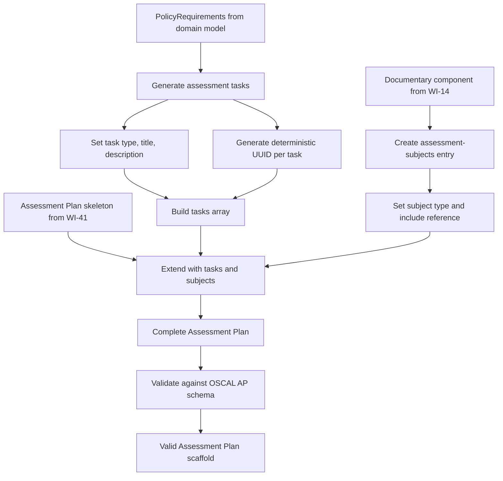
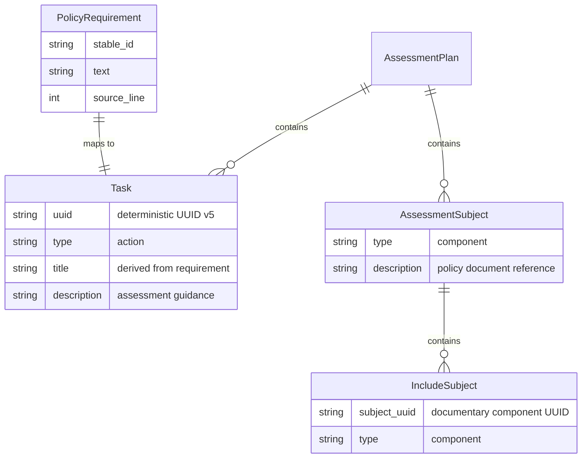
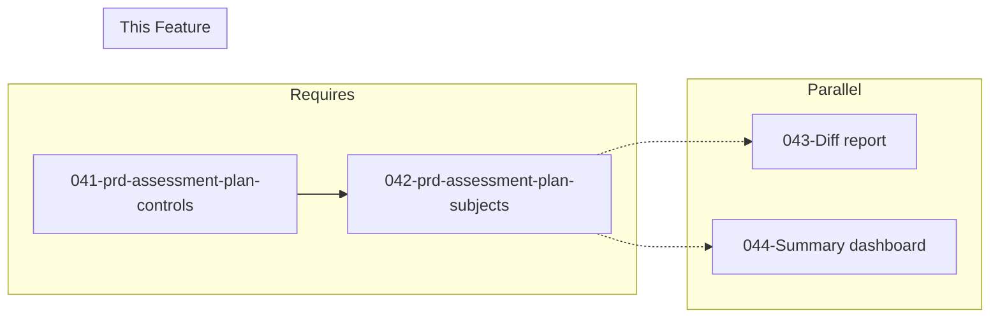

# 042-prd-assessment-plan-subjects

> **Document Type:** Product Requirements Document
> **Audience:** LLM agents, human reviewers
> **Status:** Draft
> **Last Updated:** 2026-02-10 <!-- @auto -->
> **Owner:** Brian Luby <!-- @human-required -->

**Feature Branch**: `042-assessment-plan-subjects`
**Created**: 2026-02-10
**Status**: Draft
**Input**: Derived from FORGE Product Roadmap WI-42

---

## Review Tier Legend

| Marker | Tier | Speckit Behavior |
|--------|------|------------------|
| 🔴 `@human-required` | Human Generated | Prompt human to author; blocks until complete |
| 🟡 `@human-review` | LLM + Human Review | LLM drafts → prompt human to confirm/edit; blocks until confirmed |
| 🟢 `@llm-autonomous` | LLM Autonomous | LLM completes; no prompt; logged for audit |
| ⚪ `@auto` | Auto-generated | System fills (timestamps, links); no prompt |

---

## Document Completion Order

> ⚠️ **For LLM Agents:** Complete sections in this order. Do not fill downstream sections until upstream human-required inputs exist.

1. **Context** (Background, Scope) → requires human input first
2. **Problem Statement & User Scenarios** → requires human input
3. **Requirements** (Must/Should/Could/Won't) → requires human input
4. **Technical Constraints** → human review
5. **Diagrams, Data Model, Interface** → LLM can draft after above exist
6. **Acceptance Criteria** → derived from requirements
7. **Everything else** → can proceed

---

## Context

### Background 🔴 `@human-required`
This PRD covers **WI-42: Assessment Plan Scaffolding — Tasks & Subjects** from the FORGE Product Roadmap (Sprint S-42, Dec 15–19 2026, Theme T-6: Ecosystem & Community, Milestone MS-7). This is a Phase 3 "Exploratory" confidence level work item. WI-41 produces the Assessment Plan skeleton with `reviewed-controls` and `import-ssp`. WI-42 completes the scaffold by generating assessment `tasks[]` from policy requirements and creating `assessment-subjects` from the documentary components produced by the Component Definition pipeline. Each policy requirement becomes an assessment task describing what to verify and how, while the documentary component (the policy itself) becomes an assessment subject. The completed Assessment Plan scaffold is then validated against the OSCAL AP schema to ensure structural correctness.

Parent PRD C-2: "The CLI could generate Assessment Plan skeletons with reviewed-controls and assessment tasks derived from policy requirements."

### Scope Boundaries 🟡 `@human-review`

**In Scope:**
- Generating assessment `tasks[]` from `PolicyRequirement`s in the domain model, each task describing what to assess for a given requirement
- Creating `assessment-subjects` from documentary components (the policy document as a component)
- Populating task `type`, `title`, `description`, and `associated-activities` where applicable
- Generating deterministic UUIDs for tasks and subjects using WI-7 UUID infrastructure
- Validating the completed Assessment Plan against the OSCAL AP schema structure
- Integrating tasks and subjects into the WI-41 Assessment Plan skeleton

**Out of Scope:**
- Assessment Plan skeleton structure (import-ssp, reviewed-controls) — completed in WI-41 (041-prd-assessment-plan-controls)
- Actual assessment execution or results recording — Assessment Results model is not in current scope
- `assessment-assets` or `assessment-platform` population — future extension
- SSP generation — deferred to WI-45/WI-46
- Detailed assessment methodology or evidence collection procedures — assessors refine these manually

### Glossary 🟡 `@human-review`

| Term | Definition |
|------|------------|
| Assessment Task | An entry in the Assessment Plan's `tasks[]` array describing a specific assessment activity to be performed |
| assessment-subjects | A structure within the Assessment Plan identifying what entities (components, inventory items, users) are being assessed |
| associated-activities | Activities linked to a task that describe specific assessment actions |
| Documentary Component | An OSCAL component of type "policy" representing non-technical control implementations, used here as an assessment subject |
| PolicyRequirement | The internal domain model struct representing an individual policy requirement extracted from source text |
| OSCAL AP Schema | The JSON schema for OSCAL Assessment Plan v1.2.0 that defines structural validity rules |
| Task Type | The classification of an assessment task (e.g., "action" for assessment activities) |

### Related Documents ⚪ `@auto`

| Document | Link | Relationship |
|----------|------|--------------|
| Parent PRD | docs/FORGE_PRD.md | Parent requirement C-2 |
| Product Roadmap | docs/FORGE_PRODUCT_ROADMAP.md | Sprint S-42 context |
| OSCAL Research | docs/research/OSCAL_Research.md | Assessment Plan model guidance |
| Depends On | docs/PRD/041-prd-assessment-plan-controls.md | Assessment Plan skeleton (WI-41) |
| Product Vision | docs/FORGE_PRODUCT_VISION.md | Strategic goal G-3, G-4 |
| Constitution | .specify/memory/constitution.md | Technical constraints and quality gates |

---

## Problem Statement 🔴 `@human-required`

WI-41 produces an Assessment Plan skeleton with reviewed-controls and an SSP reference, but without `tasks[]` and `assessment-subjects`, the plan provides no guidance on what specific assessment activities should be performed or what entities are being assessed. An Assessment Plan without tasks is like a test plan without test cases — it defines scope (reviewed-controls) but not execution. By generating tasks from policy requirements, FORGE translates each requirement into an assessable activity: "Verify that [requirement text] is implemented as described." By identifying the documentary component (the policy itself) as an assessment subject, the plan connects assessment activities to the specific artifact being evaluated. This completes the Assessment Plan scaffold described in Parent PRD C-2, producing a structurally valid OSCAL Assessment Plan that assessors can refine and execute.

---

## User Scenarios & Testing 🔴 `@human-required`

### User Story 1 — Generate Assessment Tasks from Policy Requirements (Priority: P1)

A compliance engineer generates an Assessment Plan where each policy requirement is translated into an assessment task describing what to verify.

> As a compliance engineer, I want each policy requirement to become an assessment task in the Assessment Plan so that assessors have a structured checklist of what to verify during the assessment.

**Why this priority**: Tasks are the actionable core of the Assessment Plan — they tell assessors what to do. Without tasks, the reviewed-controls from WI-41 define scope but provide no execution guidance.

**Independent Test**: Build an Assessment Plan from a PolicyDocument with 8 requirements and verify that `tasks[]` contains 8 entries, each with a title, description, and type derived from the corresponding requirement.

**Acceptance Scenarios**:
1. **Given** a PolicyDocument with 8 PolicyRequirements, **When** generating the Assessment Plan, **Then** `tasks[]` contains 8 entries, each with `uuid`, `type`, `title`, and `description` fields populated.
2. **Given** a PolicyRequirement with text "All systems must enforce multi-factor authentication", **When** mapped to a task, **Then** the task `description` contains assessment guidance derived from that requirement (e.g., "Verify that all systems enforce multi-factor authentication as specified in the policy.").

---

### User Story 2 — Create Assessment Subjects from Documentary Components (Priority: P1)

The Assessment Plan identifies the documentary component (the policy document) as an assessment subject.

> As a compliance engineer, I want the Assessment Plan to identify the policy document as an assessment subject so that the plan explicitly states what artifact is being assessed.

**Why this priority**: Assessment subjects define the "what" of the assessment. Without subjects, assessors have no formal linkage between the plan and the artifacts being evaluated.

**Independent Test**: Generate an Assessment Plan from a policy titled "Information Security Policy" and verify that `assessment-subjects` contains an entry referencing the documentary component with type and description.

**Acceptance Scenarios**:
1. **Given** a PolicyDocument titled "Information Security Policy" that produces a documentary component, **When** generating the Assessment Plan, **Then** `assessment-subjects` contains one entry with `type: "component"` and a description referencing the policy document.
2. **Given** the documentary component UUID from the Component Definition, **When** generating assessment-subjects, **Then** the subject includes a reference (via `include-subjects` or `props`) linking to the component UUID.

---

### User Story 3 — Validate Against OSCAL AP Schema (Priority: P2)

The completed Assessment Plan scaffold is validated against the OSCAL AP schema to ensure structural correctness.

> As a developer working on FORGE, I want the completed Assessment Plan to be validated against the OSCAL AP schema so that I can be confident the generated artifact is structurally correct before delivery.

**Why this priority**: Schema validation catches structural errors early and builds confidence that the generated artifact is usable by downstream OSCAL tools. This is especially important for Phase 3 exploratory features.

**Independent Test**: Generate a complete Assessment Plan (with reviewed-controls, tasks, and subjects) and validate it against the OSCAL v1.2.0 Assessment Plan JSON schema.

**Acceptance Scenarios**:
1. **Given** a complete Assessment Plan with metadata, import-ssp, reviewed-controls, tasks, and subjects, **When** validating against the OSCAL AP schema, **Then** no validation errors are reported.
2. **Given** an Assessment Plan with a missing required field, **When** validating, **Then** a descriptive validation error identifies the missing field.

---

## Assumptions & Risks 🟡 `@human-review`

### Assumptions
- [A-1] WI-41 provides a working Assessment Plan skeleton with reviewed-controls and import-ssp that WI-42 extends.
- [A-2] Each PolicyRequirement maps to exactly one assessment task — a 1:1 mapping from requirements to tasks.
- [A-3] The documentary component UUID is available from the Component Definition pipeline (WI-14/WI-15) for use in assessment-subjects.
- [A-4] UUID v5 generation from WI-7 is available for generating deterministic UUIDs for tasks and subjects.
- [A-5] The OSCAL v1.2.0 Assessment Plan JSON schema is available for validation (from WI-19 schema infrastructure or NIST published schemas).

### Risks
| ID | Risk | Likelihood | Impact | Mitigation |
|----|------|------------|--------|------------|
| R-1 | Task description generation produces unhelpful boilerplate that assessors ignore | Med | Low | Use requirement text directly with assessment framing ("Verify that..."); assessors can refine |
| R-2 | OSCAL AP schema validation reveals structural issues in the WI-41 skeleton | Low | Med | Run validation incrementally; fix WI-41 issues before adding tasks/subjects |
| R-3 | assessment-subjects structure is more complex than anticipated for documentary components | Low | Med | Start with the simplest valid representation; extend as needed based on schema validation results |
| R-4 | WI-41 skeleton changes during its implementation, requiring WI-42 rework | Low | Med | WI-42 runs in the sprint after WI-41; review WI-41 output before starting WI-42 |

---

## Feature Overview

### Flow Diagram 🟡 `@human-review`



### State Diagram (if applicable) 🟡 `@human-review`
N/A — No state transitions in this work item.

---

## Requirements

### Must Have (M) — MVP, launch blockers 🔴 `@human-required`
- [ ] **M-1:** The Assessment Plan shall include a `tasks[]` array with one task entry per `PolicyRequirement`. *(Traces to: Parent PRD C-2)*
- [ ] **M-2:** Each task entry shall include a `uuid` field generated deterministically using UUID v5. *(Traces to: Parent PRD C-2, M-8)*
- [ ] **M-3:** Each task entry shall include a `type` field set to `"action"`. *(Traces to: Parent PRD C-2)*
- [ ] **M-4:** Each task entry shall include a `title` field derived from the PolicyRequirement (e.g., "Assess: {requirement summary}"). *(Traces to: Parent PRD C-2)*
- [ ] **M-5:** Each task entry shall include a `description` field containing assessment guidance derived from the PolicyRequirement prose (e.g., "Verify that {requirement text} is implemented."). *(Traces to: Parent PRD C-2)*
- [ ] **M-6:** The Assessment Plan shall include an `assessment-subjects` array with at least one entry representing the documentary component (the policy document). *(Traces to: Parent PRD C-2)*
- [ ] **M-7:** Each assessment-subject entry shall include a `type` field (e.g., `"component"`) and a `description` identifying the policy document being assessed. *(Traces to: Parent PRD C-2)*
- [ ] **M-8:** The completed Assessment Plan (skeleton from WI-41 + tasks/subjects from WI-42) shall be validated against the OSCAL v1.2.0 Assessment Plan JSON schema with zero structural errors. *(Traces to: Parent PRD C-2)*

### Should Have (S) — High value, not blocking 🔴 `@human-required`
- [ ] **S-1:** Each task should include an `associated-activities` or `related-controls` reference linking the task to the specific control-id it assesses.
- [ ] **S-2:** The assessment-subject entry should include `include-subjects` with a reference to the documentary component UUID from the Component Definition.
- [ ] **S-3:** Tasks should be ordered consistently with the control-id ordering from the conversion output.

### Could Have (C) — Nice to have, if time permits 🟡 `@human-review`
- [ ] **C-1:** Tasks could include `responsible-roles` entries with placeholder role-ids for "assessor" and "system-owner".
- [ ] **C-2:** Assessment-subjects could include multiple entries when the conversion produces multiple documentary components.

### Won't Have (W) — Explicitly deferred 🟡 `@human-review`
- [ ] **W-1:** Assessment Results generation — *Reason: Not in current roadmap scope*
- [ ] **W-2:** Detailed assessment methodology or evidence collection procedures — *Reason: Assessors refine these manually*
- [ ] **W-3:** `assessment-assets` or `assessment-platform` — *Reason: Future extension*
- [ ] **W-4:** `observations` or `findings` — *Reason: These belong to Assessment Results, not Assessment Plan*

---

## Technical Constraints 🟡 `@human-review`

- **Language/Framework:** Rust (latest stable), Cargo build system
- **OSCAL Version:** Target OSCAL v1.2.0 Assessment Plan model
- **Output Format:** JSON (via `serde_json`)
- **UUID Generation:** UUID v5 (deterministic, content-based) consistent with WI-7 pattern
- **Schema Validation:** Validate against OSCAL v1.2.0 Assessment Plan JSON schema (reuse WI-19 validation infrastructure if available, otherwise manual structural checks)
- **Serialization:** `serde` with `#[serde(rename)]` to produce OSCAL-compliant JSON keys (e.g., `assessment-subjects`, `include-subjects`, `associated-activities`)
- **Error Handling:** `thiserror` for error types; descriptive errors for schema validation failures
- **Linting:** `cargo clippy -- -D warnings` must pass
- **Formatting:** `cargo fmt --check` must pass
- **Testing:** TDD mandatory; unit tests for task generation, subject creation, and schema validation

---

## Data Model (if applicable) 🟡 `@human-review`



---

## Interface Contract (if applicable) 🟡 `@human-review`

```rust
/// Generate assessment tasks from PolicyRequirements.
///
/// Each requirement becomes one task with assessment guidance.
pub fn generate_assessment_tasks(
    requirements: &[PolicyRequirement],
) -> Result<Vec<serde_json::Value>, ForgeError>;

/// Create assessment-subjects from documentary component metadata.
pub fn create_assessment_subjects(
    component_uuid: &str,
    policy_title: &str,
) -> Result<Vec<serde_json::Value>, ForgeError>;

/// Complete the Assessment Plan by adding tasks and subjects to the WI-41 skeleton.
pub fn complete_assessment_plan(
    skeleton: serde_json::Value,
    tasks: Vec<serde_json::Value>,
    subjects: Vec<serde_json::Value>,
) -> Result<serde_json::Value, ForgeError>;

/// Validate the completed Assessment Plan against the OSCAL AP schema.
pub fn validate_assessment_plan(
    plan: &serde_json::Value,
) -> Result<(), ForgeError>;

// Expected tasks[] entry structure:
// {
//   "uuid": "<task-uuid-v5>",
//   "type": "action",
//   "title": "Assess: <requirement summary>",
//   "description": "Verify that <requirement text> is implemented as specified in the policy.",
//   "related-controls": {
//     "control-selections": [
//       { "include-controls": [{ "control-id": "POL-AC-001" }] }
//     ]
//   }
// }
//
// Expected assessment-subjects[] entry structure:
// {
//   "type": "component",
//   "description": "Policy document: <Policy Title>",
//   "include-subjects": [
//     { "subject-uuid": "<component-uuid>", "type": "component" }
//   ]
// }
```

---

## Evaluation Criteria 🟡 `@human-review`

| Criterion | Weight | Metric | Target | Notes |
|-----------|--------|--------|--------|-------|
| Task completeness | Critical | All PolicyRequirements mapped to tasks | 100% | 1:1 mapping, no requirements lost |
| Task quality | High | Task descriptions contain meaningful assessment guidance | Manual review | Requirement text preserved with assessment framing |
| Subject correctness | Critical | Assessment-subjects reference documentary component | Valid reference | UUID linkage to Component Definition |
| Schema validation | Critical | Completed Assessment Plan passes OSCAL AP schema | Zero errors | Structural correctness verified |
| UUID determinism | High | Same input produces same task/subject UUIDs | 100% | Verified by re-generation test |

---

## Tool/Approach Candidates 🟡 `@human-review`

| Option | License | Pros | Cons | Spike Result |
|--------|---------|------|------|--------------|
| serde_json Value builder | MIT/Apache-2.0 | Consistent with all other OSCAL builders | No compile-time shape enforcement | Selected — consistent with established pattern |
| uuid crate (v5) | MIT/Apache-2.0 | Deterministic UUID generation; already used across pipeline | Requires namespace UUID | Already selected in WI-7 |
| jsonschema crate | MIT/Apache-2.0 | Schema validation for OSCAL AP | May have limitations per WI-19 spike results | Use if available from WI-19; fallback to structural checks |

### Selected Approach 🔴 `@human-required`
> **Decision:** Use `serde_json::Value` builder pattern to generate tasks and subjects; extend WI-41's Assessment Plan skeleton; validate against OSCAL AP schema using available validation infrastructure (WI-19 pattern or structural checks).
> **Rationale:** Maintains consistency with the established OSCAL generation pattern. Task generation follows a simple 1:1 mapping from requirements to tasks with assessment framing. Schema validation provides confidence in the exploratory-phase output.

---

## Acceptance Criteria 🟡 `@human-review`

| AC ID | Requirement | User Story | Given | When | Then |
|-------|-------------|------------|-------|------|------|
| AC-1 | M-1, M-2 | US-1 | A PolicyDocument with 8 PolicyRequirements | Generating the Assessment Plan | `tasks[]` contains 8 entries, each with a deterministic `uuid` |
| AC-2 | M-3, M-4, M-5 | US-1 | A PolicyRequirement with text "Systems must enforce MFA" | Mapping to a task | Task has `type: "action"`, a title derived from the requirement, and a description with assessment guidance |
| AC-3 | M-6, M-7 | US-2 | A documentary component UUID and policy title | Generating assessment-subjects | `assessment-subjects` contains one entry with `type: "component"` and description referencing the policy |
| AC-4 | S-2 | US-2 | A documentary component UUID | Generating assessment-subjects | `include-subjects` contains a reference with the component UUID |
| AC-5 | M-8 | US-3 | A complete Assessment Plan (skeleton + tasks + subjects) | Validating against OSCAL AP schema | Zero validation errors |
| AC-6 | M-2 | US-1 | The same PolicyDocument | Generating the Assessment Plan twice | All task UUIDs are identical across both runs |
| AC-7 | S-1 | US-1 | A task derived from a requirement with control-id "POL-AC-001" | Examining the task | Task includes `related-controls` referencing "POL-AC-001" |

### Edge Cases 🟢 `@llm-autonomous`
- [ ] **EC-1:** (M-1) When a PolicyDocument has zero PolicyRequirements, then `tasks[]` is an empty array and a warning is emitted.
- [ ] **EC-2:** (M-5) When a PolicyRequirement has empty text, then the task description defaults to a placeholder indicating no assessment guidance available.
- [ ] **EC-3:** (M-6) When no documentary component UUID is available (Catalog-only conversion without Component Definition), then assessment-subjects uses a generic subject type with a description referencing the policy title.
- [ ] **EC-4:** (M-2) When two PolicyRequirements have identical text but different source locations, then they receive distinct task UUIDs (incorporating source location into the UUID seed).
- [ ] **EC-5:** (M-8) When the Assessment Plan has a structural issue, then validation produces a descriptive error identifying the specific problem.

---

## Dependencies 🟡 `@human-review`



- **Requires:** WI-41 (Assessment Plan skeleton with reviewed-controls and import-ssp)
- **Blocks:** None directly (downstream consumers would use the complete Assessment Plan)
- **Parallel With:** WI-43 (diff report), WI-44 (summary dashboard)
- **External:** OSCAL v1.2.0 Assessment Plan JSON schema (NIST)

---

## Security Considerations 🟡 `@human-review`

| Aspect | Assessment | Notes |
|--------|------------|-------|
| Internet Exposure | No | CLI tool, no network services |
| Sensitive Data | Yes | Task descriptions contain policy requirement text, which may include sensitive operational details about security controls |
| Authentication Required | No | Local CLI tool |
| Security Review Required | No | Extends existing builder pattern; no new input parsing attack surface |

---

## Implementation Guidance 🟢 `@llm-autonomous`

### Suggested Approach
Implement a `generate_assessment_tasks` function that iterates over `PolicyRequirement`s and produces a task entry for each. Each task should have: (1) a UUID v5 derived from the requirement's stable_id (using WI-7's UUID generation with an assessment-plan-specific namespace component), (2) `type: "action"`, (3) a `title` summarizing the assessment activity (e.g., "Assess: {first N characters of requirement text}"), and (4) a `description` framing the requirement as an assessment activity ("Verify that {requirement text} is implemented as specified in the policy."). Optionally include `related-controls` linking the task to the corresponding control-id.

Implement `create_assessment_subjects` to build an assessment-subject entry of `type: "component"` with a description referencing the policy title and an `include-subjects` array containing the documentary component UUID.

Implement `complete_assessment_plan` to merge tasks and subjects into the WI-41 skeleton. Finally, implement `validate_assessment_plan` to check the completed plan against the OSCAL AP schema — use the `jsonschema` crate if available from WI-19, or perform structural checks (required fields present, correct types, valid UUIDs).

### Anti-patterns to Avoid
- Generating vague or generic task descriptions that provide no assessment value — use the actual requirement text
- Creating tasks without linking them to control-ids — traceability from task to control is critical for assessors
- Modifying WI-41's skeleton structure instead of extending it — add tasks and subjects without changing reviewed-controls or import-ssp
- Generating random UUIDs (v4) for tasks — must use deterministic v5 for stability
- Skipping schema validation — Phase 3 features should still be structurally correct

### Reference Examples
- OSCAL Research: `docs/research/OSCAL_Research.md` (Assessment Plan model section, activities/steps/tasks concepts)
- NIST OSCAL Assessment Plan model reference: https://pages.nist.gov/OSCAL/reference/latest/assessment-plan/json-outline/
- Assessment Plan task structure from NIST example files

---

## Spike Tasks 🟡 `@human-review`

N/A — No spike tasks for this work item. The Assessment Plan task and subject structures are documented in OSCAL v1.2.0. The builder pattern is established and WI-41 provides the skeleton to extend.

---

## Success Metrics 🔴 `@human-required`

| Metric | Baseline | Target | Measurement Method |
|--------|----------|--------|-------------------|
| Task generation completeness | N/A | 100% of PolicyRequirements mapped to tasks | Unit tests |
| Assessment subject correctness | N/A | Subject references documentary component UUID | Unit tests |
| Schema validation | N/A | Complete Assessment Plan passes OSCAL AP schema | Schema validation test |
| UUID determinism | N/A | Identical UUIDs for identical inputs across re-runs | Re-generation comparison test |

### Technical Verification 🟢 `@llm-autonomous`
| Metric | Target | Verification Method |
|--------|--------|---------------------|
| Test coverage for task/subject generation | >90% | `cargo test` + coverage tool |
| No clippy warnings | 0 | `cargo clippy -- -D warnings` |
| No formatting violations | 0 | `cargo fmt --check` |
| Output passes OSCAL AP schema validation | Valid | Schema validation in test suite |

---

## Definition of Ready 🔴 `@human-required`

### Readiness Checklist
- [x] Problem statement reviewed and validated by stakeholder
- [x] All Must Have requirements have acceptance criteria
- [x] Technical constraints are explicit and agreed
- [x] Dependencies identified and owners confirmed
- [x] Security review completed (or N/A documented with justification)
- [x] No open questions blocking implementation

### Sign-off
| Role | Name | Date | Decision |
|------|------|------|----------|
| Product Owner | Brian Luby | YYYY-MM-DD | [Ready / Not Ready] |

---

## Changelog ⚪ `@auto`

| Version | Date | Author | Changes |
|---------|------|--------|---------|
| 0.1 | 2026-02-10 | LLM (Claude) | Initial draft derived from FORGE Product Roadmap WI-42 |

---

## Decision Log 🟡 `@human-review`

| Date | Decision | Rationale | Alternatives Considered |
|------|----------|-----------|------------------------|
| 2026-02-10 | 1:1 mapping from PolicyRequirement to assessment task | Simplest correct representation; every requirement deserves an assessment activity; assessors can merge or refine | Group requirements into composite tasks (loses traceability); generate tasks only for Must-level requirements (incomplete coverage) |
| 2026-02-10 | Use requirement text directly with assessment framing for task descriptions | Faithful to source text, assessor can understand what to verify; avoids AI-generated paraphrasing at this stage | AI-summarized assessment guidance (introduces non-determinism); template-only descriptions (too generic to be useful) |
| 2026-02-10 | Validate against OSCAL AP schema as part of WI-42 | Completing the scaffold is the right time to validate; ensures tasks and subjects integrate correctly with the WI-41 skeleton | Defer validation entirely (risks shipping broken output); validate only WI-42 additions (misses integration issues) |

---

## Open Questions 🟡 `@human-review`

No open questions for this work item.

---

## Review Checklist 🟢 `@llm-autonomous`

Before marking as Approved:
- [x] All requirements have unique IDs (M-1 through M-8, S-1 through S-3, C-1 through C-2, W-1 through W-4)
- [x] All Must Have requirements have linked acceptance criteria
- [x] User stories are prioritized and independently testable
- [x] Acceptance criteria reference both requirement IDs and user stories
- [x] Glossary terms are used consistently throughout
- [x] Diagrams use terminology from Glossary
- [x] Security considerations documented
- [x] Definition of Ready checklist is complete
- [x] No open questions blocking implementation
