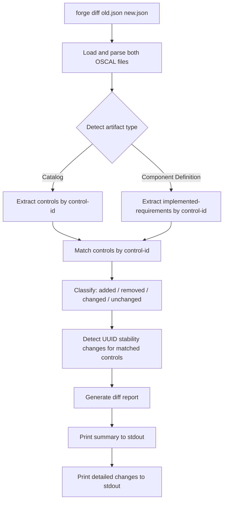
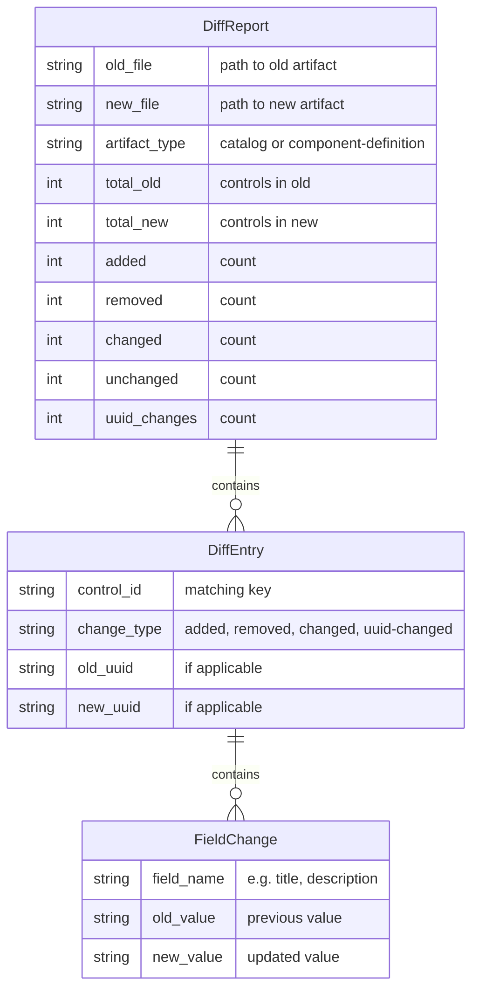
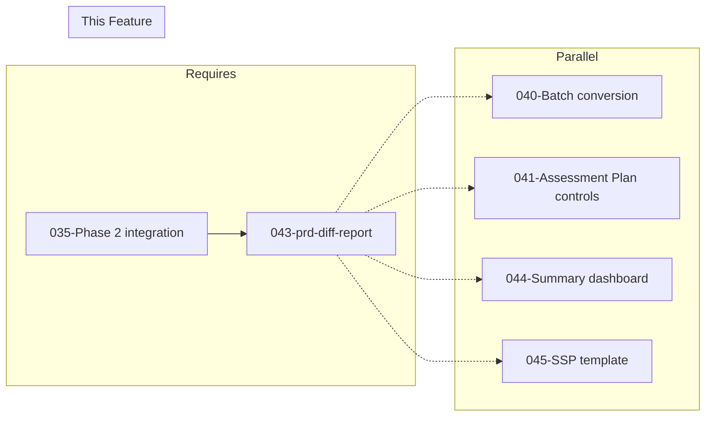

# 043-prd-diff-report

> **Document Type:** Product Requirements Document
> **Audience:** LLM agents, human reviewers
> **Status:** Draft
> **Last Updated:** 2026-02-10 <!-- @auto -->
> **Owner:** Brian Luby <!-- @human-required -->

**Feature Branch**: `043-diff-report`
**Created**: 2026-02-10
**Status**: Draft
**Input**: Derived from FORGE Product Roadmap WI-43

---

## Review Tier Legend

| Marker | Tier | Speckit Behavior |
|--------|------|------------------|
| 🔴 `@human-required` | Human Generated | Prompt human to author; blocks until complete |
| 🟡 `@human-review` | LLM + Human Review | LLM drafts → prompt human to confirm/edit; blocks until confirmed |
| 🟢 `@llm-autonomous` | LLM Autonomous | LLM completes; no prompt; logged for audit |
| ⚪ `@auto` | Auto-generated | System fills (timestamps, links); no prompt |

---

## Document Completion Order

> ⚠️ **For LLM Agents:** Complete sections in this order. Do not fill downstream sections until upstream human-required inputs exist.

1. **Context** (Background, Scope) → requires human input first
2. **Problem Statement & User Scenarios** → requires human input
3. **Requirements** (Must/Should/Could/Won't) → requires human input
4. **Technical Constraints** → human review
5. **Diagrams, Data Model, Interface** → LLM can draft after above exist
6. **Acceptance Criteria** → derived from requirements
7. **Everything else** → can proceed

---

## Context

### Background 🔴 `@human-required`
This PRD covers **WI-43: Diff Report** from the FORGE Product Roadmap (Sprint S-43, Dec 22–26 2026, Theme T-6: Ecosystem & Community, Milestone MS-7). This is a Phase 3 "Exploratory" confidence level work item. Security policies evolve over time — requirements are added, removed, modified, or reorganized. When a compliance engineer re-converts an updated version of the same policy through FORGE, they need to understand what changed in the OSCAL output. The diff report compares two OSCAL conversion outputs (produced from different versions of the same policy) and shows added, removed, and changed controls and requirements. It also highlights ID stability changes — cases where a control's UUID changed due to content modifications — which is critical for traceability and downstream tool integration.

Parent PRD C-3: "The CLI could produce a diff report showing changes between two conversions of different versions of the same policy."

### Scope Boundaries 🟡 `@human-review`

**In Scope:**
- Implementing a `forge diff` subcommand that takes two OSCAL artifact paths as input
- Comparing Catalog and/or Component Definition JSON outputs to identify structural differences
- Reporting added controls/requirements (present in new but not old)
- Reporting removed controls/requirements (present in old but not new)
- Reporting changed controls/requirements (same control-id but different content)
- Highlighting ID stability changes (UUID changes for the same logical control)
- Producing human-readable diff output to stdout
- Supporting both Catalog and Component Definition artifact types

**Out of Scope:**
- Diffing Assessment Plans, Profiles, or SSPs — future extension
- Semantic diff (understanding the meaning of changes) — structural diff only
- Three-way merge or conflict resolution — diff is read-only reporting
- Diffing non-OSCAL files (raw Markdown, PDF, etc.) — only OSCAL JSON outputs are compared
- Visual/GUI diff rendering — stdout text output only
- Automated remediation or change application — report only

### Glossary 🟡 `@human-review`

| Term | Definition |
|------|------------|
| Diff Report | A structured comparison showing differences between two OSCAL conversion outputs |
| Added Control | A control present in the new conversion output but absent from the old |
| Removed Control | A control present in the old conversion output but absent from the new |
| Changed Control | A control with the same control-id in both outputs but with different content (title, description, parts, etc.) |
| UUID Stability Change | A case where a control's UUID changed between conversions, indicating content modification that affected the deterministic UUID seed |
| control-id | The stable identifier for a control (e.g., "POL-AC-001") used as the primary key for matching controls across versions |
| Conversion Output | An OSCAL JSON artifact (Catalog or Component Definition) produced by `forge convert` |

### Related Documents ⚪ `@auto`

| Document | Link | Relationship |
|----------|------|--------------|
| Parent PRD | docs/FORGE_PRD.md | Parent requirement C-3 |
| Product Roadmap | docs/FORGE_PRODUCT_ROADMAP.md | Sprint S-43 context |
| Product Vision | docs/FORGE_PRODUCT_VISION.md | Strategic goal G-3, G-4 |
| Constitution | .specify/memory/constitution.md | Technical constraints and quality gates |

---

## Problem Statement 🔴 `@human-required`

When security policies are updated — new requirements added, existing requirements modified or removed, sections reorganized — the compliance engineer re-converts the updated policy through FORGE. Without a diff capability, the engineer must manually compare two large JSON files to understand what changed, which is tedious, error-prone, and impractical for policies with hundreds of controls. Generic JSON diff tools (like `jq` or `diff`) show structural differences but cannot interpret OSCAL semantics — they cannot tell you "control POL-AC-003 was added" or "the implementation narrative for POL-IA-002 changed." FORGE has the domain knowledge to provide meaningful, OSCAL-aware diffing: matching controls by control-id across versions, identifying content changes within matched controls, and flagging UUID stability issues that would break downstream tool integrations. This addresses Parent PRD C-3 by making policy evolution visible and actionable.

---

## User Scenarios & Testing 🔴 `@human-required`

### User Story 1 — Compare Two Conversion Outputs (Priority: P1)

A compliance engineer compares an old and new conversion of the same policy to see what controls changed.

> As a compliance engineer, I want to run `forge diff old-catalog.json new-catalog.json` and see a clear report of added, removed, and changed controls so that I can understand the impact of policy changes on my compliance posture.

**Why this priority**: This is the core function of WI-43 — without the ability to compare two outputs, the diff feature has no value. Everything else builds on this comparison.

**Independent Test**: Convert two versions of a policy (one with 10 controls, one with 12 controls where 2 are new and 1 existing control is modified), run `forge diff`, and verify the report shows 2 added, 0 removed, and 1 changed.

**Acceptance Scenarios**:
1. **Given** two Catalog JSONs where the new version has 2 additional controls, **When** running `forge diff old.json new.json`, **Then** the report lists 2 controls as "added" with their control-ids.
2. **Given** two Catalog JSONs where one control's description has changed, **When** running `forge diff old.json new.json`, **Then** the report lists that control as "changed" and shows the old and new description.
3. **Given** two Catalog JSONs where the old version has a control not in the new version, **When** running `forge diff old.json new.json`, **Then** the report lists that control as "removed."

---

### User Story 2 — Detect UUID Stability Changes (Priority: P1)

A compliance engineer needs to know when UUIDs have changed for the same logical control, as this affects downstream tool references.

> As a compliance engineer, I want the diff report to highlight when a control's UUID has changed so that I can update downstream references (SSP imports, Assessment Plans, tool integrations) that depend on stable UUIDs.

**Why this priority**: UUID stability is a cross-cutting requirement (Parent PRD M-8). When UUIDs change, downstream artifacts that reference those UUIDs break silently. Highlighting these changes prevents integration failures.

**Independent Test**: Convert two versions of a policy where one control's text has been substantively modified (changing its UUID v5), run `forge diff`, and verify the report flags the UUID change.

**Acceptance Scenarios**:
1. **Given** two Catalog JSONs where control "POL-AC-001" exists in both but has a different UUID (due to content change), **When** running `forge diff`, **Then** the report highlights "POL-AC-001" as having a UUID stability change with old and new UUIDs.
2. **Given** two Catalog JSONs where all UUIDs are identical, **When** running `forge diff`, **Then** no UUID stability changes are reported.

---

### User Story 3 — Diff Component Definitions (Priority: P2)

A compliance engineer compares two Component Definition outputs to see changes in implemented-requirements.

> As a compliance engineer, I want to diff two Component Definition outputs so that I can see changes in implemented-requirements and control-implementations across policy versions.

**Why this priority**: Component Definitions are the primary artifact for the component-first strategy. Diffing them provides visibility into how policy changes affect implementation narratives.

**Independent Test**: Convert two versions of a policy using `--strategy component`, run `forge diff`, and verify the report shows changes in implemented-requirements.

**Acceptance Scenarios**:
1. **Given** two Component Definition JSONs with different implemented-requirements counts, **When** running `forge diff`, **Then** the report shows added/removed implemented-requirements.
2. **Given** two Component Definition JSONs where an implementation narrative changed, **When** running `forge diff`, **Then** the report shows the changed narrative with old and new text.

---

## Assumptions & Risks 🟡 `@human-review`

### Assumptions
- [A-1] Both input files are valid OSCAL JSON produced by FORGE (Catalog or Component Definition).
- [A-2] Control-id is the primary key for matching controls across versions — controls with the same control-id are considered the "same" control.
- [A-3] The diff report is text-based (stdout) — no GUI or HTML rendering is needed at this stage.
- [A-4] The diff operates on the final OSCAL output, not intermediate domain model representations.
- [A-5] Users will provide two files of the same OSCAL artifact type (both Catalogs or both Component Definitions) — cross-type diffing is not supported.

### Risks
| ID | Risk | Likelihood | Impact | Mitigation |
|----|------|------------|--------|------------|
| R-1 | Matching controls by control-id fails when IDs are reorganized or renumbered between versions | Med | Med | Report unmatched controls as removed/added; provide summary count so user can identify bulk reorganizations |
| R-2 | Large policies produce verbose diff output that is hard to read | Med | Low | Provide summary counts at the top; allow `--summary-only` flag to suppress details |
| R-3 | Component Definition diff is more complex due to nested control-implementations structure | Low | Med | Start with Catalog diff; extend to Component Definition incrementally |
| R-4 | Phase 3 exploratory scope may shift, deferring or cutting this feature | Med | Low | Feature is self-contained and does not block Must Have requirements |

---

## Feature Overview

### Flow Diagram 🟡 `@human-review`



### State Diagram (if applicable) 🟡 `@human-review`
N/A — No state transitions in this work item. The diff is a single-pass comparison producing a report.

---

## Requirements

### Must Have (M) — MVP, launch blockers 🔴 `@human-required`
- [ ] **M-1:** The CLI shall provide a `forge diff <old-artifact> <new-artifact>` subcommand that accepts two OSCAL JSON file paths. *(Traces to: Parent PRD C-3)*
- [ ] **M-2:** The diff shall identify and report added controls (present in new but not old), matched by control-id. *(Traces to: Parent PRD C-3)*
- [ ] **M-3:** The diff shall identify and report removed controls (present in old but not new), matched by control-id. *(Traces to: Parent PRD C-3)*
- [ ] **M-4:** The diff shall identify and report changed controls (same control-id, different content), showing old and new values for changed fields. *(Traces to: Parent PRD C-3)*
- [ ] **M-5:** The diff shall detect and highlight UUID stability changes — cases where a control's UUID differs between versions for the same control-id. *(Traces to: Parent PRD C-3, M-8)*
- [ ] **M-6:** The diff report shall be printed to stdout in a human-readable format. *(Traces to: Parent PRD C-3)*
- [ ] **M-7:** The diff shall support Catalog artifacts (comparing controls within `catalog.groups[].controls[]`). *(Traces to: Parent PRD C-3)*
- [ ] **M-8:** The CLI shall produce a descriptive error when input files are invalid JSON, not OSCAL artifacts, or are different artifact types. *(Traces to: Parent PRD C-3)*

### Should Have (S) — High value, not blocking 🔴 `@human-required`
- [ ] **S-1:** The diff shall support Component Definition artifacts (comparing `implemented-requirements[]` within `control-implementations[]`).
- [ ] **S-2:** The diff report shall include a summary section at the top showing counts: total controls in old, total in new, added, removed, changed, unchanged, UUID changes.
- [ ] **S-3:** The diff shall compare control properties (title, description, parts/statements) and report which specific fields changed. *(Note: Field-level comparison is also specified as Must Have in spec.md FR-004; S-3 is satisfied by FR-004 and retained here for PRD completeness.)*

### Could Have (C) — Nice to have, if time permits 🟡 `@human-review`
- [ ] **C-1:** A `--format json` flag could produce the diff report as structured JSON for programmatic consumption.
- [ ] **C-2:** A `--summary-only` flag could suppress detailed changes and show only summary counts.
- [ ] **C-3:** The diff could detect control-id renaming heuristically (e.g., same text content but different control-id) and report as "possibly renamed."

### Won't Have (W) — Explicitly deferred 🟡 `@human-review`
- [ ] **W-1:** Three-way merge or conflict resolution — *Reason: Diff is read-only reporting*
- [ ] **W-2:** Diffing non-OSCAL files (Markdown, PDF, etc.) — *Reason: Only OSCAL JSON outputs are compared*
- [ ] **W-3:** Diffing Assessment Plans, Profiles, or SSPs — *Reason: Future extension; start with Catalog and Component Definition*
- [ ] **W-4:** Visual/GUI diff rendering — *Reason: CLI tool; stdout text output only*
- [ ] **W-5:** Semantic diff (understanding the meaning of changes) — *Reason: Structural diff only at this stage*

---

## Technical Constraints 🟡 `@human-review`

- **Language/Framework:** Rust (latest stable), Cargo build system
- **Input Format:** OSCAL JSON (Catalog and Component Definition artifacts produced by FORGE)
- **Output Format:** Human-readable text to stdout; optionally structured JSON
- **Comparison Key:** control-id is the primary matching key for controls across versions
- **JSON Parsing:** `serde_json` for loading and traversing OSCAL JSON structures
- **CLI Integration:** New `diff` subcommand via clap 4.x with two positional arguments
- **Error Handling:** `thiserror` for error types; descriptive errors for invalid input files
- **Linting:** `cargo clippy -- -D warnings` must pass
- **Formatting:** `cargo fmt --check` must pass
- **Testing:** TDD mandatory; unit tests for each diff category (added, removed, changed, UUID stability)

---

## Data Model (if applicable) 🟡 `@human-review`



---

## Interface Contract (if applicable) 🟡 `@human-review`

```rust
/// The result of comparing two OSCAL artifacts.
pub struct DiffReport {
    pub old_file: String,
    pub new_file: String,
    pub artifact_type: ArtifactType,
    pub entries: Vec<DiffEntry>,
    pub summary: DiffSummary,
}

pub enum ArtifactType {
    Catalog,
    ComponentDefinition,
}

pub struct DiffSummary {
    pub total_old: usize,
    pub total_new: usize,
    pub added: usize,
    pub removed: usize,
    pub changed: usize,
    pub unchanged: usize,
    pub uuid_changes: usize,
}

pub enum DiffEntry {
    Added { control_id: String, new_uuid: String },
    Removed { control_id: String, old_uuid: String },
    Changed {
        control_id: String,
        old_uuid: String,
        new_uuid: String,
        /// True when the UUID also changed alongside field-level content changes.
        /// The summary uuid_changes counter does NOT include these entries.
        uuid_changed: bool,
        field_changes: Vec<FieldChange>,
    },
    UuidChanged {
        control_id: String,
        old_uuid: String,
        new_uuid: String,
    },
}

pub struct FieldChange {
    pub field_name: String,
    pub old_value: String,
    pub new_value: String,
}

/// Compare two OSCAL JSON artifacts and produce a diff report.
pub fn diff_artifacts(
    old_path: &Path,
    new_path: &Path,
) -> Result<DiffReport, ForgeError>;

/// Format a DiffReport as human-readable text for stdout.
pub fn format_diff_report(report: &DiffReport) -> String;
```

---

## Evaluation Criteria 🟡 `@human-review`

| Criterion | Weight | Metric | Target | Notes |
|-----------|--------|--------|--------|-------|
| Added detection accuracy | Critical | All added controls correctly identified | 100% | No false positives or negatives |
| Removed detection accuracy | Critical | All removed controls correctly identified | 100% | No false positives or negatives |
| Changed detection accuracy | Critical | All changed controls correctly identified with field-level detail | 100% | Content changes detected |
| UUID stability detection | Critical | All UUID changes for same control-id flagged | 100% | Critical for downstream tool integration |
| Report readability | High | Human can understand changes from stdout output | Manual review | Clear formatting with summary |
| Error handling | High | Invalid inputs produce descriptive errors | 100% | No panics on bad input |

---

## Tool/Approach Candidates 🟡 `@human-review`

| Option | License | Pros | Cons | Spike Result |
|--------|---------|------|------|--------------|
| Custom OSCAL-aware diff (control-id matching) | N/A | Domain-specific; understands OSCAL semantics; provides meaningful output | Must be built from scratch | Selected — generic JSON diff tools lack OSCAL awareness |
| serde_json for JSON parsing | MIT/Apache-2.0 | Already used across codebase; reliable JSON traversal | No diff-specific features | Selected for loading/parsing |
| Generic JSON diff crate (json-patch) | MIT | Standard JSON diff/patch operations | No OSCAL awareness; produces low-level JSON patches not human-readable reports | Rejected — does not meet readability requirement |

### Selected Approach 🔴 `@human-required`
> **Decision:** Build a custom OSCAL-aware diff engine that loads both artifacts with `serde_json`, extracts controls by control-id, matches across versions, and produces a structured `DiffReport` with human-readable formatting.
> **Rationale:** Generic JSON diff tools cannot provide OSCAL-semantic diffing (e.g., "control POL-AC-003 was added"). The custom approach leverages FORGE's domain knowledge to produce meaningful, actionable reports. The implementation is straightforward since control-id provides a natural matching key.

---

## Acceptance Criteria 🟡 `@human-review`

| AC ID | Requirement | User Story | Given | When | Then |
|-------|-------------|------------|-------|------|------|
| AC-1 | M-1 | US-1 | Two valid OSCAL Catalog JSON files | Running `forge diff old.json new.json` | A diff report is printed to stdout |
| AC-2 | M-2 | US-1 | Old Catalog with 10 controls, new Catalog with 12 controls (2 new) | Running `forge diff` | Report lists 2 controls as "added" with their control-ids |
| AC-3 | M-3 | US-1 | Old Catalog with 10 controls, new Catalog with 9 controls (1 removed) | Running `forge diff` | Report lists 1 control as "removed" with its control-id |
| AC-4 | M-4 | US-1 | Two Catalogs where one control's description changed | Running `forge diff` | Report lists that control as "changed" with old and new description |
| AC-5 | M-5 | US-2 | Two Catalogs where control "POL-AC-001" has a different UUID | Running `forge diff` | Report highlights the UUID stability change with old and new UUIDs |
| AC-6 | M-6 | US-1 | Any valid diff comparison | Viewing the report | Output is human-readable with clear labeling of added/removed/changed |
| AC-7 | M-8 | US-1 | An invalid JSON file or non-OSCAL file | Running `forge diff` | A descriptive error is produced (not a panic) |
| AC-8 | S-2 | US-1 | Any valid diff comparison | Viewing the report | Summary section at top shows counts of added, removed, changed, unchanged, UUID changes |

### Edge Cases 🟢 `@llm-autonomous`
- [ ] **EC-1:** (M-1) When both files are identical, then the report shows zero changes with a message "No differences found."
- [ ] **EC-2:** (M-2) When the old file has zero controls, then all controls in the new file are reported as "added."
- [ ] **EC-3:** (M-3) When the new file has zero controls, then all controls in the old file are reported as "removed."
- [ ] **EC-4:** (M-8) When the two files are different artifact types (one Catalog, one Component Definition), then a descriptive error is produced.
- [ ] **EC-5:** (M-8) When a file path does not exist, then a descriptive error indicates the missing file.
- [ ] **EC-6:** (M-4) When a control's title changed but description stayed the same, then only the title change is reported.
- [ ] **EC-7:** (M-5) When a control has the same UUID but different content (should not happen with deterministic UUIDs but could indicate external modification), then it is reported as "changed" without a UUID stability flag.

---

## Dependencies 🟡 `@human-review`



- **Requires:** WI-35 (Phase 2 integration testing — ensures Catalog/Component Definition pipelines are complete and produce stable output for diffing)
- **Blocks:** None directly
- **Parallel With:** WI-40 (batch conversion), WI-41 (Assessment Plan controls), WI-44 (summary dashboard), WI-45 (SSP template)
- **External:** None

---

## Security Considerations 🟡 `@human-review`

| Aspect | Assessment | Notes |
|--------|------------|-------|
| Internet Exposure | No | CLI tool, no network services |
| Sensitive Data | Yes | Diff output reveals policy content changes, which may expose organizational security posture evolution |
| Authentication Required | No | Local CLI tool |
| Security Review Required | No | Read-only comparison of existing JSON files; no new input parsing attack surface beyond JSON loading |

---

## Implementation Guidance 🟢 `@llm-autonomous`

### Suggested Approach
Implement a `diff` subcommand in the CLI module using clap 4.x with two positional arguments (`old-artifact` and `new-artifact`). Load both files with `serde_json::from_reader`. Detect the artifact type by checking for root keys (`"catalog"` or `"component-definition"`). For Catalogs, extract controls from `catalog.groups[].controls[]` into a HashMap keyed by control-id. For Component Definitions, extract from `components[].control-implementations[].implemented-requirements[]` keyed by control-id. Compare the two HashMaps: keys only in new = added, keys only in old = removed, keys in both = compare content. For matched controls, compare fields (title, description, parts/statements) and UUIDs. Build a `DiffReport` struct with entries classified by change type. Format the report with a summary header (counts) followed by detailed entries grouped by change type. Print to stdout.

### Anti-patterns to Avoid
- Using generic text diff (line-by-line) on JSON files — produces unreadable output that lacks OSCAL semantics
- Comparing entire JSON subtrees without extracting meaningful fields — too noisy
- Panicking on invalid input instead of returning descriptive errors
- Ignoring UUID changes — these are critical for downstream tool integration
- Sorting output inconsistently — maintain control-id ordering for predictable output

### Reference Examples
- `cargo diff` or `git diff` for inspiration on human-readable diff output formatting
- OSCAL Catalog and Component Definition JSON structures in the codebase for understanding traversal paths

---

## Spike Tasks 🟡 `@human-review`

N/A — No spike tasks for this work item. The diff logic is straightforward HashMap-based set comparison. The OSCAL JSON structures are well-understood from Phases 1–2.

---

## Success Metrics 🔴 `@human-required`

| Metric | Baseline | Target | Measurement Method |
|--------|----------|--------|-------------------|
| Diff detection accuracy | N/A | 100% of added/removed/changed controls correctly identified | Unit tests with known-change test fixtures |
| UUID stability detection | N/A | 100% of UUID changes flagged | Unit tests |
| Report readability | N/A | Clear, actionable output | Manual review |

### Technical Verification 🟢 `@llm-autonomous`
| Metric | Target | Verification Method |
|--------|--------|---------------------|
| Test coverage for diff engine | >90% | `cargo test` + coverage tool |
| No clippy warnings | 0 | `cargo clippy -- -D warnings` |
| No formatting violations | 0 | `cargo fmt --check` |
| Edge cases handled | Zero panics on invalid input | Error handling tests |

---

## Definition of Ready 🔴 `@human-required`

### Readiness Checklist
- [x] Problem statement reviewed and validated by stakeholder
- [x] All Must Have requirements have acceptance criteria
- [x] Technical constraints are explicit and agreed
- [x] Dependencies identified and owners confirmed
- [x] Security review completed (or N/A documented with justification)
- [x] No open questions blocking implementation

### Sign-off
| Role | Name | Date | Decision |
|------|------|------|----------|
| Product Owner | Brian Luby | YYYY-MM-DD | [Ready / Not Ready] |

---

## Changelog ⚪ `@auto`

| Version | Date | Author | Changes |
|---------|------|--------|---------|
| 0.1 | 2026-02-10 | LLM (Claude) | Initial draft derived from FORGE Product Roadmap WI-43 |

---

## Decision Log 🟡 `@human-review`

| Date | Decision | Rationale | Alternatives Considered |
|------|----------|-----------|------------------------|
| 2026-02-10 | Build custom OSCAL-aware diff engine rather than using generic JSON diff | Generic JSON diff tools cannot interpret OSCAL semantics; custom engine provides meaningful "control X was added" reports | json-patch crate (produces RFC 6902 patches, not human-readable); line-by-line text diff (no structure awareness) |
| 2026-02-10 | Use control-id as the primary matching key | Control-id is the stable, human-assigned identifier that persists across re-conversions even when UUIDs change due to content modifications | UUID matching (breaks when content changes); title matching (too fragile, titles may be edited); positional matching (breaks on reordering) |
| 2026-02-10 | Start with Catalog diff, extend to Component Definition as Should Have | Catalog diff is simpler (flat control list) and validates the approach; Component Definition diff adds nesting complexity | Build both simultaneously (higher risk); Component Definition only (misses the more common use case) |

---

## Open Questions 🟡 `@human-review`

No open questions for this work item.

---

## Review Checklist 🟢 `@llm-autonomous`

Before marking as Approved:
- [x] All requirements have unique IDs (M-1 through M-8, S-1 through S-3, C-1 through C-3, W-1 through W-5)
- [x] All Must Have requirements have linked acceptance criteria
- [x] User stories are prioritized and independently testable
- [x] Acceptance criteria reference both requirement IDs and user stories
- [x] Glossary terms are used consistently throughout
- [x] Diagrams use terminology from Glossary
- [x] Security considerations documented
- [x] Definition of Ready checklist is complete
- [x] No open questions blocking implementation
