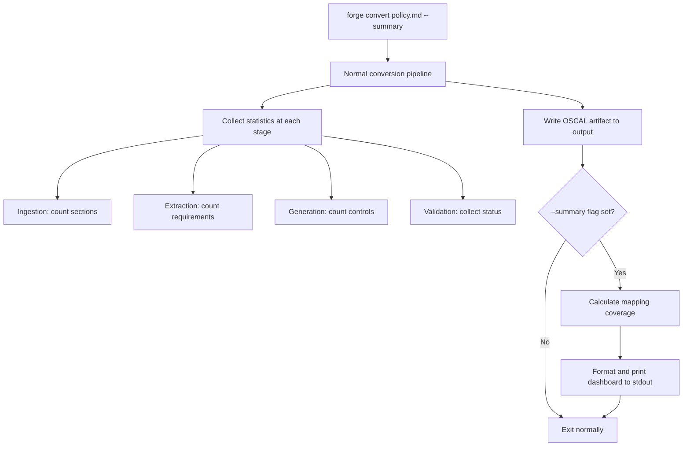
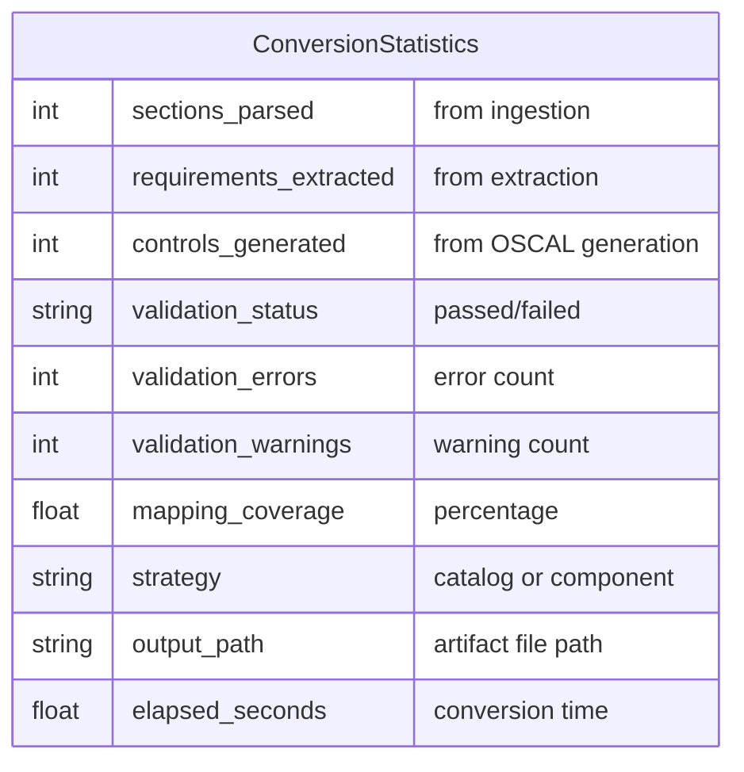
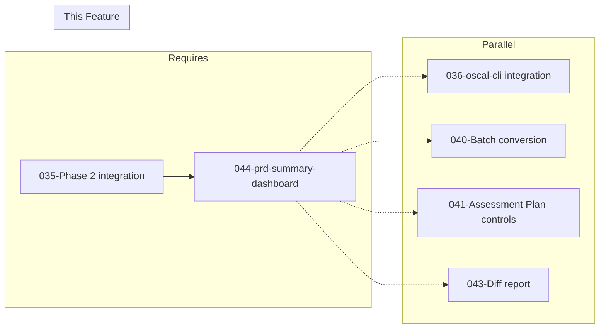

# 044-prd-summary-dashboard

> **Document Type:** Product Requirements Document
> **Audience:** LLM agents, human reviewers
> **Status:** Draft
> **Last Updated:** 2026-02-10 <!-- @auto -->
> **Owner:** Brian Luby <!-- @human-required -->

**Feature Branch**: `044-summary-dashboard`
**Created**: 2026-02-10
**Status**: Draft
**Input**: Derived from FORGE Product Roadmap WI-44

---

## Review Tier Legend

| Marker | Tier | Speckit Behavior |
|--------|------|------------------|
| 🔴 `@human-required` | Human Generated | Prompt human to author; blocks until complete |
| 🟡 `@human-review` | LLM + Human Review | LLM drafts → prompt human to confirm/edit; blocks until confirmed |
| 🟢 `@llm-autonomous` | LLM Autonomous | LLM completes; no prompt; logged for audit |
| ⚪ `@auto` | Auto-generated | System fills (timestamps, links); no prompt |

---

## Document Completion Order

> ⚠️ **For LLM Agents:** Complete sections in this order. Do not fill downstream sections until upstream human-required inputs exist.

1. **Context** (Background, Scope) → requires human input first
2. **Problem Statement & User Scenarios** → requires human input
3. **Requirements** (Must/Should/Could/Won't) → requires human input
4. **Technical Constraints** → human review
5. **Diagrams, Data Model, Interface** → LLM can draft after above exist
6. **Acceptance Criteria** → derived from requirements
7. **Everything else** → can proceed

---

## Context

### Background 🔴 `@human-required`
This PRD covers **WI-44: Summary Dashboard** from the FORGE Product Roadmap (Sprint S-44, Jan 5–9 2027, Theme T-6: Ecosystem & Community, Milestone MS-7). This is a Phase 3 "Exploratory" confidence level work item, sized as XS (extra small). After running `forge convert`, users currently receive only the generated OSCAL artifact with no visibility into what the pipeline did — how many sections were parsed, how many requirements were extracted, how many controls were generated, whether validation passed, or what percentage of requirements were successfully represented in OSCAL. The summary dashboard provides conversion statistics to stdout, giving users immediate feedback on the quality and completeness of the conversion. This is activated via a `--summary` flag on the `convert` subcommand.

Parent PRD C-4: "The CLI could produce a summary dashboard (to stdout) showing conversion statistics: sections parsed, requirements extracted, controls generated, validation status."

### Scope Boundaries 🟡 `@human-review`

**In Scope:**
- Adding a `--summary` flag to the `forge convert` subcommand
- Collecting and displaying conversion statistics to stdout after conversion completes
- Reporting: sections parsed, requirements extracted, controls generated
- Reporting validation status summary (pass/fail/warnings count)
- Reporting mapping coverage (percentage of requirements with OSCAL representation)
- Formatting the dashboard as human-readable text to stdout

**Out of Scope:**
- Persistent storage of statistics (database, file) — stdout only
- Historical tracking or trend analysis across multiple runs — single-run statistics only
- Web-based or GUI dashboard — CLI stdout output only
- Performance benchmarking or timing metrics — focus is on content statistics, not performance
- Modifying the conversion pipeline logic — only instrumenting it for statistics collection

### Glossary 🟡 `@human-review`

| Term | Definition |
|------|------------|
| Summary Dashboard | A text-based statistics display printed to stdout after conversion, showing pipeline metrics |
| Sections Parsed | The count of structural sections (headings) identified in the input document during ingestion |
| Requirements Extracted | The count of PolicyRequirements identified and atomized from the input document |
| Controls Generated | The count of OSCAL controls (Catalog) or implemented-requirements (Component Definition) produced |
| Validation Status | The pass/fail/warnings result from OSCAL schema validation of the generated artifact |
| Mapping Coverage | The percentage of extracted requirements that resulted in an OSCAL representation (control or implemented-requirement) |
| --summary | CLI flag that activates the summary dashboard output after conversion |

### Related Documents ⚪ `@auto`

| Document | Link | Relationship |
|----------|------|--------------|
| Parent PRD | docs/FORGE_PRD.md | Parent requirement C-4 |
| Product Roadmap | docs/FORGE_PRODUCT_ROADMAP.md | Sprint S-44 context |
| Product Vision | docs/FORGE_PRODUCT_VISION.md | Strategic goal G-3, G-4 |
| Constitution | .specify/memory/constitution.md | Technical constraints and quality gates |

---

## Problem Statement 🔴 `@human-required`

When `forge convert` runs today, it produces an OSCAL JSON file and exits silently (or with minimal status output). The user has no visibility into the conversion pipeline's behavior — they cannot tell at a glance how many sections were found, how many requirements were extracted, whether any requirements failed to map to controls, or whether the output passed validation. This lack of feedback forces users to manually inspect the output JSON to understand completeness and quality, which is impractical for large policies. A summary dashboard addresses this by printing a concise statistics overview after conversion, showing the key metrics that indicate conversion quality: sections parsed, requirements extracted, controls generated, validation status, and mapping coverage. This is especially valuable for iterative workflows where the user is refining their input policy and wants quick feedback on each conversion run.

---

## User Scenarios & Testing 🔴 `@human-required`

### User Story 1 — View Conversion Statistics (Priority: P1)

A compliance engineer runs a conversion and sees a summary of what the pipeline produced.

> As a compliance engineer, I want to see conversion statistics after running `forge convert --summary` so that I can quickly assess the quality and completeness of the conversion without manually inspecting the JSON output.

**Why this priority**: This is the core function of WI-44 — providing visibility into the conversion pipeline. All other dashboard features build on having statistics collected and displayed.

**Independent Test**: Convert a policy document with `--summary` flag and verify that stdout includes counts for sections parsed, requirements extracted, and controls generated.

**Acceptance Scenarios**:
1. **Given** a policy document with 5 sections and 15 requirements, **When** running `forge convert policy.md --strategy catalog --summary`, **Then** stdout shows "Sections parsed: 5", "Requirements extracted: 15", and "Controls generated: N" (where N is the actual control count).
2. **Given** a successful conversion, **When** using `--summary`, **Then** the statistics are printed after the conversion output path confirmation.

---

### User Story 2 — View Validation Status (Priority: P1)

A compliance engineer sees whether the generated artifact passed OSCAL validation as part of the summary.

> As a compliance engineer, I want the summary to include validation status so that I know immediately whether the output is valid OSCAL without running a separate validation step.

**Why this priority**: Validation status is a critical quality indicator. Users need to know if the output is usable before passing it to downstream tools.

**Independent Test**: Convert a policy document with `--summary` and verify that stdout includes validation status (e.g., "Validation: PASSED" or "Validation: FAILED (3 errors)").

**Acceptance Scenarios**:
1. **Given** a conversion that produces valid OSCAL, **When** using `--summary`, **Then** stdout shows "Validation: PASSED".
2. **Given** a conversion that produces OSCAL with validation warnings, **When** using `--summary`, **Then** stdout shows "Validation: PASSED with N warnings".

---

### User Story 3 — View Mapping Coverage (Priority: P2)

A compliance engineer sees what percentage of requirements were successfully mapped to OSCAL representations.

> As a compliance engineer, I want to see mapping coverage percentage so that I can identify if any requirements failed to convert and need attention.

**Why this priority**: Mapping coverage highlights completeness — a 100% coverage means every requirement became a control/implemented-requirement, while lower coverage indicates gaps that need investigation.

**Independent Test**: Convert a policy where 12 of 15 requirements produce controls, run with `--summary`, and verify stdout shows "Mapping coverage: 80.0% (12/15 requirements mapped)".

**Acceptance Scenarios**:
1. **Given** a conversion where 12 of 15 requirements produce OSCAL controls, **When** using `--summary`, **Then** stdout shows mapping coverage as "80.0% (12/15)".
2. **Given** a conversion where all requirements produce controls, **When** using `--summary`, **Then** stdout shows mapping coverage as "100.0%".

---

## Assumptions & Risks 🟡 `@human-review`

### Assumptions
- [A-1] The conversion pipeline (ingestion, parsing, extraction, OSCAL generation) can be instrumented to collect statistics without significant performance impact.
- [A-2] Statistics are collected during the normal conversion flow — no separate analysis pass is needed.
- [A-3] Validation status is available from the existing validation infrastructure (WI-19+) or a lightweight structural check.
- [A-4] The `--summary` flag does not affect the conversion output itself — it only adds statistics to stdout after the artifact is written.
- [A-5] Mapping coverage is calculated as (controls generated / requirements extracted) * 100, with the understanding that some requirements may legitimately not map to individual controls.

### Risks
| ID | Risk | Likelihood | Impact | Mitigation |
|----|------|------------|--------|------------|
| R-1 | Pipeline instrumentation requires changes across multiple modules | Med | Low | Use a simple statistics struct passed through the pipeline; collect counts at each stage boundary |
| R-2 | Mapping coverage calculation is misleading when requirements intentionally do not map 1:1 to controls | Low | Low | Document that coverage is a rough metric; provide raw counts alongside percentage |
| R-3 | Summary output interleaved with other stdout content (e.g., verbose logging) | Low | Low | Print summary as a distinct section with clear delimiters; use stderr for diagnostics |

---

## Feature Overview

### Flow Diagram 🟡 `@human-review`



### State Diagram (if applicable) 🟡 `@human-review`
N/A — No state transitions in this work item. Statistics are collected during conversion and printed at the end.

---

## Requirements

### Must Have (M) — MVP, launch blockers 🔴 `@human-required`
- [ ] **M-1:** The `forge convert` subcommand shall accept a `--summary` flag. *(Traces to: Parent PRD C-4)*
- [ ] **M-2:** When `--summary` is provided, the CLI shall print the number of sections parsed from the input document to stdout. *(Traces to: Parent PRD C-4)*
- [ ] **M-3:** When `--summary` is provided, the CLI shall print the number of requirements extracted to stdout. *(Traces to: Parent PRD C-4)*
- [ ] **M-4:** When `--summary` is provided, the CLI shall print the number of controls generated (Catalog controls or Component Definition implemented-requirements) to stdout. *(Traces to: Parent PRD C-4)*
- [ ] **M-5:** When `--summary` is provided, the CLI shall print the validation status (passed/failed with error count) to stdout. *(Traces to: Parent PRD C-4)*
- [ ] **M-6:** When `--summary` is provided, the CLI shall print the mapping coverage percentage (requirements with OSCAL representation / total requirements) to stdout. *(Traces to: Parent PRD C-4)*
- [ ] **M-7:** The summary dashboard shall be printed after the conversion artifact is written, as a distinct section with clear formatting. *(Traces to: Parent PRD C-4)*

### Should Have (S) — High value, not blocking 🔴 `@human-required`
- [ ] **S-1:** The summary dashboard should include the conversion strategy used (catalog or component).
- [ ] **S-2:** The summary dashboard should include the output file path for easy reference.
- [ ] **S-3:** The summary dashboard should include the time elapsed for the conversion.

### Could Have (C) — Nice to have, if time permits 🟡 `@human-review`
- [ ] **C-1:** A `--summary-format json` option could produce the statistics as structured JSON for programmatic consumption.
- [ ] **C-2:** The summary could include a breakdown of requirements by section (e.g., "Section 3: Access Control — 5 requirements, 5 controls").

### Won't Have (W) — Explicitly deferred 🟡 `@human-review`
- [ ] **W-1:** Persistent storage of statistics — *Reason: stdout only; historical tracking is a future extension*
- [ ] **W-2:** Web-based or GUI dashboard — *Reason: CLI tool; stdout text output only*
- [ ] **W-3:** Performance benchmarking or timing beyond elapsed time — *Reason: Focus is on content statistics*
- [ ] **W-4:** Automatic remediation suggestions based on low coverage — *Reason: Report only; remediation is manual*

---

## Technical Constraints 🟡 `@human-review`

- **Language/Framework:** Rust (latest stable), Cargo build system
- **Output:** Human-readable text to stdout; must not interfere with artifact file output
- **CLI Integration:** `--summary` flag on `convert` subcommand via clap 4.x
- **Statistics Collection:** Lightweight struct passed through pipeline stages; must not impact conversion performance
- **Validation Integration:** Reuse validation infrastructure from WI-19+ if available; fallback to structural check status
- **Error Handling:** `thiserror` for error types; summary should still print even if validation has warnings
- **Linting:** `cargo clippy -- -D warnings` must pass
- **Formatting:** `cargo fmt --check` must pass
- **Testing:** TDD mandatory; unit tests for statistics collection and dashboard formatting

---

## Data Model (if applicable) 🟡 `@human-review`



---

## Interface Contract (if applicable) 🟡 `@human-review`

```rust
/// Statistics collected during a conversion pipeline run.
pub struct ConversionStatistics {
    pub sections_parsed: usize,
    pub requirements_extracted: usize,
    pub controls_generated: usize,
    pub validation_status: ValidationStatus,
    pub validation_errors: usize,
    pub validation_warnings: usize,
    pub strategy: String,
    pub output_path: String,
}

pub enum ValidationStatus {
    Passed,
    PassedWithWarnings,
    Failed,
    NotRun,
}

impl ConversionStatistics {
    /// Calculate mapping coverage as a percentage.
    pub fn mapping_coverage(&self) -> f64 {
        if self.requirements_extracted == 0 {
            return 0.0;
        }
        (self.controls_generated as f64 / self.requirements_extracted as f64) * 100.0
    }
}

/// Format conversion statistics as a human-readable dashboard string.
pub fn format_summary_dashboard(stats: &ConversionStatistics) -> String;

// Expected stdout output format:
//
// ┌─────────────────────────────────────────┐
// │          FORGE Conversion Summary        │
// ├─────────────────────────────────────────┤
// │ Strategy:           catalog              │
// │ Output:             output/catalog.json  │
// ├─────────────────────────────────────────┤
// │ Sections parsed:    12                   │
// │ Requirements:       47                   │
// │ Controls generated: 47                   │
// │ Mapping coverage:   100.0% (47/47)       │
// ├─────────────────────────────────────────┤
// │ Validation:         PASSED               │
// └─────────────────────────────────────────┘
```

---

## Evaluation Criteria 🟡 `@human-review`

| Criterion | Weight | Metric | Target | Notes |
|-----------|--------|--------|--------|-------|
| Statistics accuracy | Critical | All counts match actual pipeline behavior | 100% | Sections, requirements, controls match actual data |
| Mapping coverage correctness | Critical | Percentage calculated correctly | Matches manual count | (controls / requirements) * 100 |
| Validation status accuracy | Critical | Status matches actual validation result | 100% | Pass/fail/warnings correctly reported |
| Dashboard readability | High | User can understand conversion quality at a glance | Manual review | Clear formatting, aligned values |
| No interference with output | Critical | Summary does not corrupt artifact file output | 100% | Summary to stdout after file write |

---

## Tool/Approach Candidates 🟡 `@human-review`

| Option | License | Pros | Cons | Spike Result |
|--------|---------|------|------|--------------|
| Simple println! with formatting | N/A | Zero dependencies; straightforward | No table formatting | Acceptable for XS scope |
| comfy-table crate | MIT | Pretty terminal tables with borders and alignment | Additional dependency | Could enhance readability; evaluate if time permits |
| Custom box-drawing characters | N/A | Nice visual formatting; no dependencies | Manual implementation | Selected for initial approach |

### Selected Approach 🔴 `@human-required`
> **Decision:** Use custom formatting with box-drawing characters for a clean, aligned dashboard display. No additional dependencies needed.
> **Rationale:** This is an XS-sized work item. Simple formatting with box-drawing characters provides good readability without introducing new dependencies. If more advanced formatting is needed later, a crate like `comfy-table` can be added.

---

## Acceptance Criteria 🟡 `@human-review`

| AC ID | Requirement | User Story | Given | When | Then |
|-------|-------------|------------|-------|------|------|
| AC-1 | M-1 | US-1 | A valid policy document | Running `forge convert policy.md --strategy catalog --summary` | Conversion succeeds and summary dashboard is printed to stdout |
| AC-2 | M-2 | US-1 | A policy with 5 sections | Running with `--summary` | Dashboard shows "Sections parsed: 5" |
| AC-3 | M-3 | US-1 | A policy with 15 requirements | Running with `--summary` | Dashboard shows "Requirements extracted: 15" |
| AC-4 | M-4 | US-1 | A conversion producing 15 controls | Running with `--summary` | Dashboard shows "Controls generated: 15" |
| AC-5 | M-5 | US-2 | A valid conversion | Running with `--summary` | Dashboard shows "Validation: PASSED" |
| AC-6 | M-6 | US-3 | 12 of 15 requirements mapped to controls | Running with `--summary` | Dashboard shows "Mapping coverage: 80.0% (12/15)" |
| AC-7 | M-7 | US-1 | Any conversion with `--summary` | Viewing stdout | Summary is printed after the output file path, as a distinct formatted section |

### Edge Cases 🟢 `@llm-autonomous`
- [ ] **EC-1:** (M-6) When zero requirements are extracted (empty document), then mapping coverage shows "0.0% (0/0)" and a warning is emitted.
- [ ] **EC-2:** (M-5) When validation is not available (WI-19 not yet integrated), then validation status shows "Not run".
- [ ] **EC-3:** (M-1) When `--summary` is not provided, then no dashboard is printed (default behavior unchanged).
- [ ] **EC-4:** (M-4) When using `--strategy component`, then "Controls generated" reflects implemented-requirements count, not Catalog controls.
- [ ] **EC-5:** (M-7) When the conversion fails with an error, then the summary is not printed (only error message is shown).
- [ ] **EC-6:** (M-6) When controls_generated exceeds requirements_extracted (e.g., atomization produces more controls than input requirements), then mapping coverage can exceed 100% and is displayed as such.

---

## Dependencies 🟡 `@human-review`



- **Requires:** WI-35 (Phase 2 integration testing — ensures conversion pipeline is complete and instrumentation points are stable)
- **Blocks:** None directly
- **Parallel With:** WI-36 (oscal-cli integration), WI-40 (batch conversion), WI-41 (Assessment Plan controls), WI-43 (diff report)
- **External:** None

---

## Security Considerations 🟡 `@human-review`

| Aspect | Assessment | Notes |
|--------|------------|-------|
| Internet Exposure | No | CLI tool, no network services |
| Sensitive Data | No | Statistics are aggregate counts (not policy content); no sensitive data in dashboard output |
| Authentication Required | No | Local CLI tool |
| Security Review Required | No | Read-only statistics collection and display; no new input parsing or attack surface |

---

## Implementation Guidance 🟢 `@llm-autonomous`

### Suggested Approach
Define a `ConversionStatistics` struct that collects counts at each pipeline stage. Instrument the conversion pipeline to populate this struct: increment `sections_parsed` during ingestion, `requirements_extracted` during extraction/atomization, `controls_generated` during OSCAL generation, and capture validation results. Add a `--summary` flag to the `convert` subcommand using clap 4.x. After the conversion artifact is written to the output file, check the `--summary` flag and, if set, call `format_summary_dashboard()` to produce the formatted text and print it to stdout. The formatting function should use box-drawing characters (or simple ASCII borders) to create a clean, aligned table showing all statistics. Calculate mapping coverage as `(controls_generated / requirements_extracted) * 100.0`, handling the zero-requirements edge case.

### Anti-patterns to Avoid
- Printing the summary before the artifact is written — the file write must complete first
- Mixing summary output with the artifact JSON on stdout — the artifact should go to a file, not stdout
- Modifying the conversion pipeline's behavior based on `--summary` — the flag is purely for output; the conversion should be identical with or without it
- Using floating-point comparison for coverage assertions in tests — use approximate comparison with epsilon
- Hard-coding statistics instead of collecting from actual pipeline execution

### Reference Examples
- `cargo build` summary output for inspiration on clean CLI statistics display
- `rustfmt --check` output format for pass/fail status reporting
- Box-drawing characters: `┌ ┐ └ ┘ ─ │ ├ ┤ ┬ ┴ ┼`

---

## Spike Tasks 🟡 `@human-review`

N/A — No spike tasks for this work item. The implementation is straightforward statistics collection and formatting. This is an XS-sized feature.

---

## Success Metrics 🔴 `@human-required`

| Metric | Baseline | Target | Measurement Method |
|--------|----------|--------|-------------------|
| Statistics accuracy | N/A | All counts match actual pipeline behavior | Unit tests with known-count test fixtures |
| Coverage calculation correctness | N/A | Percentage matches manual calculation | Unit tests |
| Dashboard prints successfully | N/A | Summary appears on stdout with --summary flag | Integration test |

### Technical Verification 🟢 `@llm-autonomous`
| Metric | Target | Verification Method |
|--------|--------|---------------------|
| Test coverage for statistics and formatting | >90% | `cargo test` + coverage tool |
| No clippy warnings | 0 | `cargo clippy -- -D warnings` |
| No formatting violations | 0 | `cargo fmt --check` |
| No performance regression from instrumentation | <1% overhead | Manual timing comparison |

---

## Definition of Ready 🔴 `@human-required`

### Readiness Checklist
- [x] Problem statement reviewed and validated by stakeholder
- [x] All Must Have requirements have acceptance criteria
- [x] Technical constraints are explicit and agreed
- [x] Dependencies identified and owners confirmed
- [x] Security review completed (or N/A documented with justification)
- [x] No open questions blocking implementation

### Sign-off
| Role | Name | Date | Decision |
|------|------|------|----------|
| Product Owner | Brian Luby | YYYY-MM-DD | [Ready / Not Ready] |

---

## Changelog ⚪ `@auto`

| Version | Date | Author | Changes |
|---------|------|--------|---------|
| 0.1 | 2026-02-10 | LLM (Claude) | Initial draft derived from FORGE Product Roadmap WI-44 |

---

## Decision Log 🟡 `@human-review`

| Date | Decision | Rationale | Alternatives Considered |
|------|----------|-----------|------------------------|
| 2026-02-10 | Use --summary flag on convert rather than a separate subcommand | Statistics are inherently tied to a conversion run; a flag on `convert` is more ergonomic than `forge summary` after the fact | Separate `forge stats` subcommand (requires persisting data between runs); always show summary (too verbose for scripted usage) |
| 2026-02-10 | Custom box-drawing formatting over dependency on table crate | XS-sized feature; minimal formatting needs; avoids adding a dependency for cosmetic output | comfy-table crate (nice but adds dependency for XS feature); plain text without borders (less readable) |
| 2026-02-10 | Include mapping coverage as a percentage | Percentage provides at-a-glance quality assessment; raw counts alone require mental math | Raw counts only (harder to interpret); letter grade (A/B/C — too subjective); no coverage metric (loses key quality signal) |

---

## Open Questions 🟡 `@human-review`

No open questions for this work item.

---

## Review Checklist 🟢 `@llm-autonomous`

Before marking as Approved:
- [x] All requirements have unique IDs (M-1 through M-7, S-1 through S-3, C-1 through C-2, W-1 through W-4)
- [x] All Must Have requirements have linked acceptance criteria
- [x] User stories are prioritized and independently testable
- [x] Acceptance criteria reference both requirement IDs and user stories
- [x] Glossary terms are used consistently throughout
- [x] Diagrams use terminology from Glossary
- [x] Security considerations documented
- [x] Definition of Ready checklist is complete
- [x] No open questions blocking implementation
