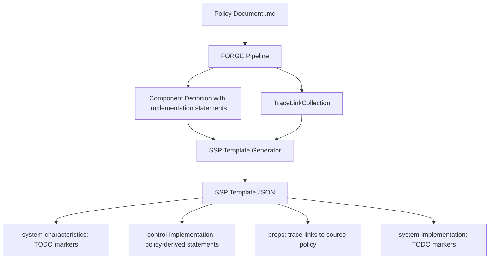
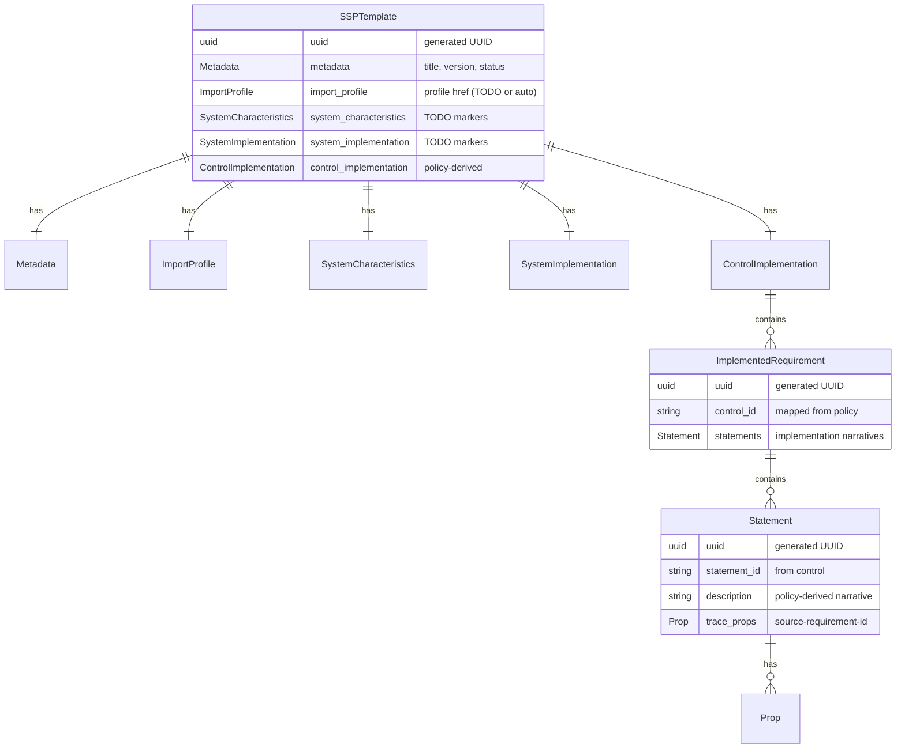
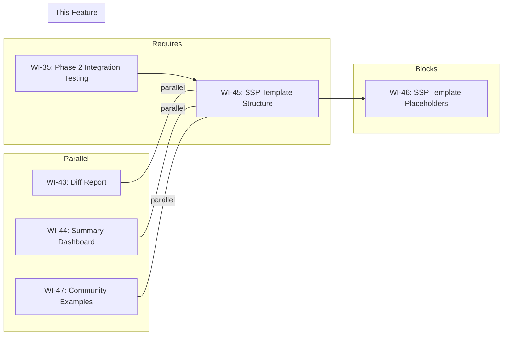

# 045-prd-ssp-template-structure

> **Document Type:** Product Requirements Document
> **Audience:** LLM agents, human reviewers
> **Status:** Draft
> **Last Updated:** 2026-02-10 <!-- @auto -->
> **Owner:** Brian Luby <!-- @human-required -->

**Feature Branch**: `045-ssp-template-structure`
**Created**: 2026-02-10
**Status**: Draft
**Input**: Derived from FORGE Product Roadmap WI-45

---

## Review Tier Legend

| Marker | Tier | Speckit Behavior |
|--------|------|------------------|
| :red_circle: `@human-required` | Human Generated | Prompt human to author; blocks until complete |
| :yellow_circle: `@human-review` | LLM + Human Review | LLM drafts → prompt human to confirm/edit; blocks until confirmed |
| :green_circle: `@llm-autonomous` | LLM Autonomous | LLM completes; no prompt; logged for audit |
| :white_circle: `@auto` | Auto-generated | System fills (timestamps, links); no prompt |

---

## Document Completion Order

> :warning: **For LLM Agents:** Complete sections in this order. Do not fill downstream sections until upstream human-required inputs exist.

1. **Context** (Background, Scope) → requires human input first
2. **Problem Statement & User Scenarios** → requires human input
3. **Requirements** (Must/Should/Could/Won't) → requires human input
4. **Technical Constraints** → human review
5. **Diagrams, Data Model, Interface** → LLM can draft after above exist
6. **Acceptance Criteria** → derived from requirements
7. **Everything else** → can proceed

---

## Context

### Background :red_circle: `@human-required`
This PRD covers **WI-45: SSP Template Generation — Structure** from the FORGE Product Roadmap (Sprint S-45, Jan 12–16 2027, Theme T-6: Ecosystem & Community, Milestone MS-7). The parent PRD (docs/FORGE_PRD.md) explicitly defers "Full SSP generation" as W-1 because it requires system-specific data (inventory, boundaries, hosting) beyond policy text. However, FORGE can generate SSP *templates* — structured JSON scaffolds that contain policy-derived content (implementation statements traced from Catalog and Component Definition outputs) alongside clearly marked placeholders for system-specific sections. This work item creates the SSP template JSON structure with a `system-characteristics` section populated by TODO markers, and traces links from policy-derived implementation statements back to source requirements via the TraceLink model (WI-16). This is template/scaffold generation, not full SSP generation, and stays within the scope boundary established by the parent PRD.

> **Confidence Level:** :orange_circle: Exploratory — Phase 3 scope is directionally agreed; scope and timing are flexible.

### Scope Boundaries :yellow_circle: `@human-review`

**In Scope:**
- Generating an OSCAL SSP template JSON structure with required top-level fields (`uuid`, `metadata`, `import-profile`, `system-characteristics`, `system-implementation`, `control-implementation`)
- Populating the `system-characteristics` section with TODO marker placeholders for system name, description, security sensitivity level, and authorization boundary
- Including policy-derived `control-implementation` entries (implementation statements) sourced from Component Definition outputs (WI-14/WI-15)
- Embedding trace links from implementation statements back to source policy requirements via props (leveraging WI-16/WI-17 TraceLink model)
- Generating the template via a new `--strategy ssp-template` option on the `forge convert` subcommand
- Unit tests validating template structure, placeholder presence, and trace link embedding

**Out of Scope:**
- Full SSP generation with system-specific data — deferred per parent PRD W-1
- System inventory population (hardware, software, interconnections) — deferred to WI-46
- Network boundary diagram generation — deferred to WI-46
- Assessment Plan or POA&M generation — deferred per parent PRD W-2
- XML or YAML SSP template output — JSON only in this work item; format expansion covered by WI-26–WI-29
- Profile resolution or baseline selection — leverages existing Profile outputs from WI-30–WI-35

### Glossary :yellow_circle: `@human-review`

| Term | Definition |
|------|------------|
| SSP | System Security Plan — an OSCAL model describing how controls are implemented for a specific information system |
| SSP Template | A partially populated SSP JSON structure containing policy-derived content and TODO placeholders for system-specific data |
| system-characteristics | OSCAL SSP section describing the system's name, description, sensitivity level, authorization boundary, and related metadata |
| control-implementation | OSCAL SSP section containing statements about how each control is implemented for the system |
| TODO Marker | A clearly annotated placeholder string (e.g., `"TODO: [description]"`) indicating a field that requires manual completion |
| Implementation Statement | A narrative describing how a specific control requirement is satisfied, derived from policy text |
| TraceLink | A data structure (from WI-16) mapping a policy requirement to its corresponding OSCAL element with source location |

### Related Documents :white_circle: `@auto`

| Document | Link | Relationship |
|----------|------|--------------|
| Parent PRD | docs/FORGE_PRD.md | Parent requirements; W-1 defers full SSP but templates are in scope |
| Product Roadmap | docs/FORGE_PRODUCT_ROADMAP.md | Sprint S-45 context |
| Product Vision | docs/FORGE_PRODUCT_VISION.md | Strategic goal G-4 (Implementation Layer) |
| Constitution | .specify/memory/constitution.md | Technical constraints and quality gates |
| Depends On | docs/PRD/016-prd-traceability-model.md | TraceLink model for source traceability |
| WI-35 | Phase 2 integration testing | SSP templates build on Phase 2 outputs |

---

## Problem Statement :red_circle: `@human-required`

FORGE currently generates OSCAL Catalogs, Profiles, and Component Definitions from policy documents, but compliance engineers who need System Security Plans must manually create the entire SSP structure from scratch. Even though full SSP generation requires system-specific data that FORGE cannot derive from policy text alone, a significant portion of the SSP — specifically the `control-implementation` section containing implementation statements — can be pre-populated from policy-derived content already produced by the Catalog and Component Definition pipelines. Without an SSP template generator, compliance engineers must redundantly re-enter policy-derived implementation narratives and lose traceability back to source policy documents. This work item bridges the gap by generating a structured SSP template JSON that includes all policy-derivable content with clear TODO markers for system-specific sections, reducing manual effort and preserving end-to-end traceability.

---

## User Scenarios & Testing :red_circle: `@human-required`

### User Story 1 — Generate SSP Template from Policy (Priority: P1)

A compliance engineer wants to generate an SSP template from a converted policy document to jumpstart their SSP authoring process.

> As a compliance engineer, I want to generate an SSP template from my policy document so that implementation statements are pre-populated and I only need to fill in system-specific details.

**Why this priority**: This is the core deliverable of WI-45. Without the ability to generate a template, the entire SSP template feature has no value.

**Independent Test**: Run `forge convert policy.md --strategy ssp-template --format json` and verify the output contains a valid SSP JSON structure with `control-implementation` entries derived from the policy and TODO markers in system-specific sections.

**Acceptance Scenarios**:
1. **Given** a policy document that has been previously converted to a Component Definition, **When** running `forge convert policy.md --strategy ssp-template --format json`, **Then** an SSP template JSON file is produced with the required top-level structure (`uuid`, `metadata`, `import-profile`, `system-characteristics`, `system-implementation`, `control-implementation`).
2. **Given** a generated SSP template, **When** inspecting the `control-implementation` section, **Then** implementation statements are present and derived from policy requirements.

---

### User Story 2 — System Characteristics TODO Markers (Priority: P1)

A compliance engineer opens the generated SSP template and sees clearly marked TODO sections for system-specific information.

> As a compliance engineer, I want the SSP template to include clear TODO markers in system-specific sections so that I know exactly which fields I need to complete manually.

**Why this priority**: Without clear TODO markers, the template would be confusing — users would not know which fields are policy-derived and which need manual completion.

**Independent Test**: Open the generated SSP template and verify that `system-characteristics` fields contain recognizable TODO marker strings with descriptive instructions.

**Acceptance Scenarios**:
1. **Given** a generated SSP template, **When** inspecting the `system-characteristics` section, **Then** fields for system name, description, security sensitivity level, and authorization boundary contain TODO markers with descriptive instructions.
2. **Given** a generated SSP template, **When** searching for all TODO markers, **Then** each marker includes a brief description of what information is needed (e.g., `"TODO: Enter the system name as registered in the authorization package"`).

---

### User Story 3 — Trace Links in Implementation Statements (Priority: P1)

A compliance engineer needs to trace each implementation statement in the SSP template back to the source policy requirement.

> As a compliance engineer, I want each implementation statement in the SSP template to include trace links back to the source policy so that I can verify the provenance of pre-populated content.

**Why this priority**: Product principle P-2 (traceability is non-negotiable) requires that generated content be traceable. SSP templates must maintain this standard.

**Independent Test**: Inspect the SSP template's `control-implementation` entries and verify that each contains a prop or link referencing the source policy requirement's stable ID and location.

**Acceptance Scenarios**:
1. **Given** an SSP template with policy-derived implementation statements, **When** inspecting any implementation statement, **Then** a `prop` with name `source-requirement-id` contains the stable ID of the originating policy requirement.
2. **Given** an SSP template with trace link props, **When** looking up the referenced requirement ID in the TraceLinkCollection, **Then** the source location (file, section, line) matches the original policy document.

---

## Assumptions & Risks :yellow_circle: `@human-review`

### Assumptions
- [A-1] The Component Definition pipeline (WI-14/WI-15) is complete and produces implementation statements that can be reused in SSP templates.
- [A-2] The TraceLink model (WI-16/WI-17) is integrated and trace links are available for implementation statements.
- [A-3] Phase 2 integration testing (WI-35) has validated the end-to-end pipeline, providing stable outputs to build upon.
- [A-4] The SSP template follows OSCAL v1.2.0 SSP model structure, even though full schema validation may not pass due to required system-specific fields being placeholders.
- [A-5] Users understand that the generated template is not a complete SSP and requires manual completion.

### Risks
| ID | Risk | Likelihood | Impact | Mitigation |
|----|------|------------|--------|------------|
| R-1 | OSCAL SSP schema rejects template due to TODO placeholder strings in required fields | Med | Low | Document that partial SSP templates may not pass full schema validation; WI-46 addresses schema-compatible placeholder strategies |
| R-2 | Implementation statement format from Component Definition pipeline does not map cleanly to SSP control-implementation structure | Low | Med | OSCAL SSP control-implementation mirrors Component Definition implemented-requirements; mapping should be straightforward |
| R-3 | Users confuse SSP template with a complete, submittable SSP | Low | Med | Include prominent metadata indicating template status; TODO markers make incompleteness obvious |

---

## Feature Overview

### Flow Diagram :yellow_circle: `@human-review`



### State Diagram (if applicable) :yellow_circle: `@human-review`
N/A — No state transitions. The SSP template is generated in a single pass from existing pipeline outputs.

---

## Requirements

### Must Have (M) — MVP, launch blockers :red_circle: `@human-required`
- [ ] **M-1:** The system shall generate an SSP template JSON file when invoked with `--strategy ssp-template`. *(Traces to: Parent PRD W-1 — template generation is within scope even though full SSP is deferred)*
- [ ] **M-2:** The SSP template shall contain the required OSCAL SSP top-level structure: `uuid`, `metadata`, `import-profile`, `system-characteristics`, `system-implementation`, and `control-implementation`.
- [ ] **M-3:** The `system-characteristics` section shall contain TODO marker placeholders for: system name, system description, security sensitivity level (FIPS 199), and authorization boundary description.
- [ ] **M-4:** The `control-implementation` section shall be populated with implementation statements derived from the Component Definition pipeline output (WI-14/WI-15).
- [ ] **M-5:** Each implementation statement in the SSP template shall include a `prop` element with `name="source-requirement-id"` and `value` set to the originating policy requirement's stable ID.
- [ ] **M-6:** The SSP template `metadata` section shall include a `prop` with `name="template-status"` and `value="incomplete"` to clearly indicate the template requires manual completion.

### Should Have (S) — High value, not blocking :red_circle: `@human-required`
- [ ] **S-1:** Each TODO marker shall include a brief descriptive instruction explaining what information is needed (e.g., `"TODO: Enter the system's FIPS 199 security categorization (low/moderate/high)"`).
- [ ] **S-2:** The SSP template shall include an `import-profile` section with a TODO marker for the profile href, or auto-populate it if a Profile output is available from earlier pipeline stages.
- [ ] **S-3:** The `metadata` section shall include `last-modified` timestamp and `version` fields auto-populated at generation time.

### Could Have (C) — Nice to have, if time permits :yellow_circle: `@human-review`
- [ ] **C-1:** The SSP template could include `responsible-parties` placeholders with TODO markers for organizational roles (System Owner, Authorizing Official, ISSO).
- [ ] **C-2:** The template could include a `remarks` field on each TODO section summarizing what OSCAL data type or format is expected.

### Won't Have (W) — Explicitly deferred :yellow_circle: `@human-review`
- [ ] **W-1:** Full SSP generation with system-specific data — *Reason: Deferred per parent PRD W-1; requires data beyond policy text*
- [ ] **W-2:** System inventory population (hardware, software, services) — *Reason: Deferred to WI-46*
- [ ] **W-3:** Network boundary and hosting environment placeholders — *Reason: Deferred to WI-46*
- [ ] **W-4:** SSP template output in XML or YAML formats — *Reason: JSON only; format expansion covered by WI-26–WI-29 patterns*

---

## Technical Constraints :yellow_circle: `@human-review`

- **Language/Framework:** Rust (latest stable)
- **Output Format:** JSON only (OSCAL SSP v1.2.0 structure)
- **Serialization:** `serde_json` for SSP template generation; reuse existing OSCAL serialization patterns from WI-9/WI-14
- **Error Handling:** `thiserror` for SSP template generation errors (e.g., missing Component Definition input, trace link resolution failures)
- **Traceability:** All implementation statements must have associated trace links via the TraceLinkCollection (WI-16)
- **TODO Markers:** Use a consistent format: `"TODO: [descriptive instruction]"` — must be easily searchable via text search
- **Testing:** TDD mandatory; unit tests for template structure, placeholder content, and trace link embedding
- **Dependencies:** No new external crates required; leverages existing `serde`, `serde_json`, `uuid` crates

---

## Data Model (if applicable) :yellow_circle: `@human-review`



---

## Interface Contract (if applicable) :yellow_circle: `@human-review`

```rust
// CLI Interface extension
// forge convert <input> --strategy ssp-template --format json [--output <path>]

/// SSP Template generation entry point
pub fn generate_ssp_template(
    policy_doc: &PolicyDocument,
    component_def: &ComponentDefinition,
    trace_links: &TraceLinkCollection,
) -> Result<SspTemplate, ForgeError>;

/// SSP Template structure (simplified)
pub struct SspTemplate {
    pub uuid: String,
    pub metadata: SspMetadata,
    pub import_profile: ImportProfile,
    pub system_characteristics: SystemCharacteristics,  // TODO markers
    pub system_implementation: SystemImplementation,      // TODO markers
    pub control_implementation: ControlImplementation,    // policy-derived
}

/// TODO marker constant format
const TODO_MARKER_PREFIX: &str = "TODO: ";

/// Example TODO marker generation
fn todo_marker(instruction: &str) -> String {
    format!("{}{}", TODO_MARKER_PREFIX, instruction)
}
```

---

## Evaluation Criteria :yellow_circle: `@human-review`

| Criterion | Weight | Metric | Target | Notes |
|-----------|--------|--------|--------|-------|
| Template Structure | Critical | SSP JSON contains all required top-level sections | 100% | Must include all 6 required sections |
| TODO Completeness | Critical | All system-specific fields have TODO markers | 100% | No blank fields in system-characteristics |
| Implementation Statements | Critical | Policy-derived statements present in control-implementation | >0 statements | At least one implementation statement from policy |
| Trace Link Accuracy | Critical | All implementation statements have trace props | 100% | Product principle P-2 compliance |

---

## Tool/Approach Candidates :yellow_circle: `@human-review`

| Option | License | Pros | Cons | Spike Result |
|--------|---------|------|------|--------------|
| Direct serde_json construction | MIT/Apache-2.0 | Full control over template structure; reuses existing patterns | More verbose code | Selected |
| OSCAL Rust crate (if available) | Varies | Type-safe OSCAL models | May not exist or may lag behind v1.2.0 | Not available; build from OSCAL JSON schema |
| Handlebars/Tera templating | MIT | Template-based generation; easy to modify | Adds dependency; less type-safe; harder to embed trace links dynamically | Rejected |

### Selected Approach :red_circle: `@human-required`
> **Decision:** Direct `serde_json` construction with Rust structs modeling the SSP template, following the same pattern established by Catalog (WI-9) and Component Definition (WI-14) generators.
> **Rationale:** Consistent with existing FORGE codebase patterns; type-safe; no new dependencies; allows precise control over TODO marker placement and trace link embedding.

---

## Acceptance Criteria :yellow_circle: `@human-review`

| AC ID | Requirement | User Story | Given | When | Then |
|-------|-------------|------------|-------|------|------|
| AC-1 | M-1 | US-1 | A policy document with extracted requirements | Running `forge convert policy.md --strategy ssp-template --format json` | An SSP template JSON file is produced |
| AC-2 | M-2 | US-1 | A generated SSP template | Inspecting the JSON structure | All 6 required top-level sections are present: uuid, metadata, import-profile, system-characteristics, system-implementation, control-implementation |
| AC-3 | M-3 | US-2 | A generated SSP template | Inspecting the system-characteristics section | TODO markers are present for system name, description, security sensitivity level, and authorization boundary |
| AC-4 | M-4 | US-1 | A policy document with 5 requirements mapped to controls | Generating an SSP template | The control-implementation section contains 5 implementation statements derived from the policy |
| AC-5 | M-5 | US-3 | A generated SSP template with implementation statements | Inspecting any implementation statement | A prop with name="source-requirement-id" is present with the correct stable ID |
| AC-6 | M-6 | US-2 | A generated SSP template | Inspecting the metadata section | A prop with name="template-status" and value="incomplete" is present |

### Edge Cases :green_circle: `@llm-autonomous`
- [ ] **EC-1:** (M-1) When the input policy document has no extractable requirements, then the SSP template is still generated with empty control-implementation and all TODO markers in place.
- [ ] **EC-2:** (M-4) When a policy requirement maps to multiple implementation statements (e.g., shared across components), then all statements are included without duplication.
- [ ] **EC-3:** (M-5) When a trace link is unavailable for an implementation statement (e.g., pipeline gap), then a warning is logged and the prop is omitted rather than including an invalid reference.
- [ ] **EC-4:** (M-2) When the output path is not specified, the SSP template is written to stdout (consistent with existing FORGE CLI behavior).

---

## Dependencies :yellow_circle: `@human-review`



- **Requires:** [WI-35: Phase 2 Integration Testing](docs/PRD/035-prd-phase2-integration.md) — Phase 2 outputs (Catalog, Profile, Component Definition) must be stable before building SSP templates on top of them
- **Parallel With:** [WI-43: Diff Report](docs/PRD/043-prd-diff-report.md), [WI-44: Summary Dashboard](docs/PRD/044-prd-summary-dashboard.md), [WI-47: Community Examples](docs/PRD/047-prd-community-examples.md) — runs in the same Phase 3 timeframe
- **Blocks:** [WI-46: SSP Template — System Placeholders](docs/PRD/046-prd-ssp-template-placeholders.md) — WI-46 extends the template with detailed system-specific placeholder sections
- **External:** OSCAL v1.2.0 SSP JSON schema (published, stable)

---

## Security Considerations :yellow_circle: `@human-review`

| Aspect | Assessment | Notes |
|--------|------------|-------|
| Internet Exposure | No | CLI tool; no network operations |
| Sensitive Data | Yes | SSP templates may contain policy-derived implementation narratives revealing organizational security posture |
| Authentication Required | No | Local CLI tool |
| Security Review Required | No | Template generation only; no system-specific sensitive data included (those are TODO placeholders); users should treat generated templates as sensitive |

---

## Implementation Guidance :green_circle: `@llm-autonomous`

### Suggested Approach
Create a new `ssp` submodule within the `oscal` module (or as a sibling to existing Catalog/Component generators). Define Rust structs modeling the OSCAL SSP template structure: `SspTemplate`, `SspMetadata`, `SystemCharacteristics`, `SystemImplementation`, `ControlImplementation`, and their sub-components. The `generate_ssp_template()` function should accept the Component Definition output (for implementation statements) and the TraceLinkCollection (for trace props), then assemble the SSP JSON by:

1. Generating a fresh UUID for the SSP template
2. Populating metadata with title, timestamp, version, and `template-status=incomplete` prop
3. Creating `system-characteristics` with TODO marker strings in all required fields
4. Creating `system-implementation` with TODO markers (detailed in WI-46)
5. Iterating over Component Definition implemented-requirements to populate `control-implementation` with trace props

Register the `--strategy ssp-template` option in the CLI (extending the existing strategy enum from WI-1/WI-13).

### Anti-patterns to Avoid
- Generating SSP template from scratch without leveraging existing Component Definition outputs — reuse pipeline artifacts
- Hardcoding OSCAL field names as magic strings — use constants or enums for OSCAL field names
- Attempting full schema validation on templates with TODO placeholders — partial validation is acceptable; full validation is WI-46's concern
- Mixing system-specific placeholder logic into this work item — defer inventory, boundaries, and hosting to WI-46

### Reference Examples
- NIST OSCAL SSP example: https://github.com/usnistgov/oscal-content/tree/main/examples/ssp
- Existing Catalog generator (WI-9) for structural patterns
- Existing Component Definition generator (WI-14) for implementation statement patterns

---

## Spike Tasks :yellow_circle: `@human-review`

N/A — No spike tasks. The SSP template structure follows the published OSCAL SSP model and builds on established FORGE pipeline patterns.

---

## Success Metrics :red_circle: `@human-required`

| Metric | Baseline | Target | Measurement Method |
|--------|----------|--------|-------------------|
| SSP template generated | N/A | Valid JSON with all 6 top-level sections | Automated test |
| TODO markers present | N/A | All system-specific fields have TODO markers | String search in output |
| Implementation statements populated | N/A | >0 policy-derived statements | Count check in test |
| Trace links embedded | N/A | 100% of implementation statements have trace props | Automated test |

### Technical Verification :green_circle: `@llm-autonomous`
| Metric | Target | Verification Method |
|--------|--------|---------------------|
| Test coverage | >90% | `cargo test` + coverage tool |
| No clippy warnings | 0 | `cargo clippy -- -D warnings` |
| No formatting violations | 0 | `cargo fmt --check` |

---

## Definition of Ready :red_circle: `@human-required`

### Readiness Checklist
- [x] Problem statement reviewed and validated by stakeholder
- [x] All Must Have requirements have acceptance criteria
- [x] Technical constraints are explicit and agreed
- [x] Dependencies identified and owners confirmed
- [x] Security review completed (or N/A documented with justification)
- [x] No open questions blocking implementation

### Sign-off
| Role | Name | Date | Decision |
|------|------|------|----------|
| Product Owner | Brian Luby | YYYY-MM-DD | [Ready / Not Ready] |

---

## Changelog :white_circle: `@auto`

| Version | Date | Author | Changes |
|---------|------|--------|---------|
| 0.1 | 2026-02-10 | LLM (Claude) | Initial draft derived from FORGE Product Roadmap WI-45 |

---

## Decision Log :yellow_circle: `@human-review`

| Date | Decision | Rationale | Alternatives Considered |
|------|----------|-----------|------------------------|
| 2026-02-10 | Generate SSP templates (not full SSPs) to stay within parent PRD scope | Parent PRD W-1 defers full SSP generation; templates with placeholders provide value without requiring system-specific data | Full SSP generation (out of scope), no SSP support at all (misses G-4 goal) |
| 2026-02-10 | Use direct serde_json construction rather than a templating engine | Consistent with existing Catalog and Component Definition generators; type-safe; no new dependencies | Handlebars/Tera templates (adds dependency, less type-safe) |
| 2026-02-10 | Include trace links as props on implementation statements | Maintains product principle P-2 (traceability is non-negotiable) across all generated artifacts | Omit trace links from SSP templates (violates P-2), separate sidecar trace file (less integrated) |

---

## Open Questions :yellow_circle: `@human-review`

- [ ] **OQ-1:** Should the `import-profile` section reference a specific Profile output from earlier pipeline stages (if available), or always use a TODO placeholder? Auto-populating would be more useful but creates a dependency on the Profile pipeline being run first.
- [ ] **OQ-2:** Should TODO markers use a machine-parseable format (e.g., `"TODO(field-name): description"`) to enable automated tooling to enumerate incomplete fields?

---

## Review Checklist :green_circle: `@llm-autonomous`

Before marking as Approved:
- [x] All requirements have unique IDs (M-1 through M-6, S-1 through S-3, C-1 through C-2, W-1 through W-4)
- [x] All Must Have requirements have linked acceptance criteria
- [x] User stories are prioritized and independently testable
- [x] Acceptance criteria reference both requirement IDs and user stories
- [x] Glossary terms are used consistently throughout
- [x] Diagrams use terminology from Glossary
- [x] Security considerations documented
- [x] Definition of Ready checklist is complete
- [x] No open questions blocking implementation (OQ-1 and OQ-2 are non-blocking design preferences)
